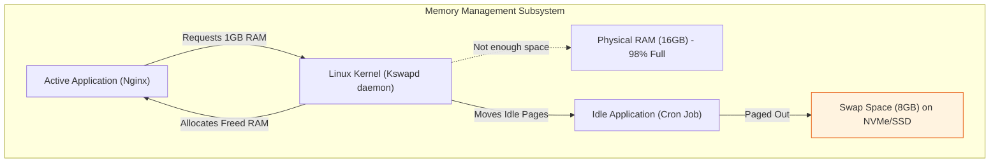
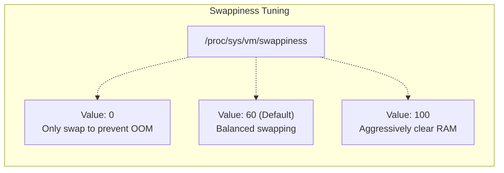
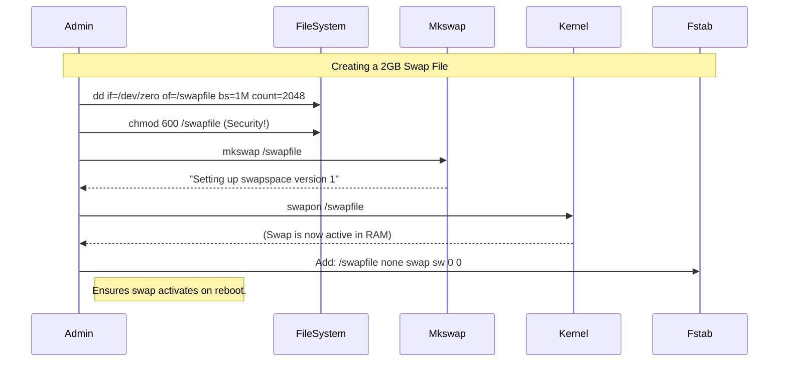

# CHAPTER 37 — SWAP SPACE MANAGEMENT

---

## 1. Introduction

### Why This Topic Exists
Physical RAM (Random Access Memory) is finite. If a server has 16GB of RAM, and applications attempt to use 17GB, the Linux kernel faces a crisis. It must either forcefully kill an application to free up memory (the Out of Memory or "OOM" Killer), or it must find somewhere else to temporarily store memory pages. **Swap space** provides that alternative. It is a designated section of the hard drive that the kernel treats as overflow RAM.

### Why Linux Administrators Use It
Administrators configure swap space to act as a safety net. While reading and writing to a hard drive (swap) is thousands of times slower than reading from physical RAM, a slow server is almost always preferable to a crashed server. Administrators monitor swap usage to determine if a server is undersized and needs a physical RAM upgrade.

### Why Companies Care About It
Stability under spike loads. E-commerce platforms experience sudden traffic spikes (e.g., Black Friday). These spikes consume massive amounts of RAM. Without swap space, the kernel's OOM Killer might randomly terminate the database service, causing total application failure. With swap space, the database survives the spike (albeit running slower), keeping the business online until traffic subsides.

---

## 2. Learning Objectives

By the end of this chapter, you will be able to:
- Understand the concept of "Swappiness" and memory paging.
- Create and format a dedicated Swap Partition.
- Create and format a Swap File (for systems without free partitions).
- Enable and disable swap space dynamically (`swapon`, `swapoff`).
- Configure swap space to persist across reboots via `/etc/fstab`.
- Adjust the kernel's swappiness parameter to optimize performance.

---

## 3. Beginner-Friendly Explanation

Think of a busy office desk:
- **Physical RAM:** The top of your desk. It is fast and easy to reach. You keep your most active documents here.
- **The Hard Drive:** The filing cabinet across the room. It holds massive amounts of data, but walking over to get a file is very slow.
- **Swap Space:** A temporary sorting tray on the floor next to your desk.
- **The Process (Swapping/Paging):** If the top of your desk (RAM) becomes 100% covered in documents, you can't work. Instead of throwing a document in the trash (OOM Killer) to make room, you take the least-recently-used document from your desk and move it to the sorting tray on the floor (Swap Space). When you need that document again later, you swap it back onto the desk, moving something else to the floor.

---

## 4. Core Theory

### 4.1 What is Swap?
Swap is virtual memory. The Linux kernel divides RAM into chunks called "pages" (usually 4KB each). When physical RAM runs out, the kernel identifies pages that have not been accessed recently and writes them to the swap space on the hard drive. This process is called "paging out".

### 4.2 Swap Partitions vs Swap Files
- **Swap Partition:** A dedicated, raw partition on the hard drive (e.g., `/dev/sda3`) formatted exclusively for swap. Traditionally preferred for performance, but inflexible because resizing partitions is dangerous.
- **Swap File:** A massive, pre-allocated file sitting on the regular filesystem (e.g., `/swapfile`). Preferred in modern cloud environments (like AWS or Azure) because if you need more swap, you can just create a larger file in 5 seconds without touching `fdisk`.

### 4.3 Swappiness
"Swappiness" is a kernel parameter (ranging from 0 to 100) that determines how aggressively the kernel will use swap space.
- `0`: The kernel will absolutely refuse to use swap until RAM is 100% full.
- `60`: (Default). The kernel strikes a balance, starting to swap out idle pages even if some RAM is still free, ensuring there is a buffer of free RAM for sudden spikes.
- `100`: The kernel swaps aggressively at all times.

---

## 5. Internal Working

### The OOM (Out Of Memory) Killer
If physical RAM is 100% full, AND the Swap space is 100% full, the Linux kernel invokes the OOM Killer. The OOM Killer scans all running processes, calculates a "badness" score based on how much memory they are using, and sends a `SIGKILL` (Signal 9) to the worst offender. It literally shoots the biggest process in the head to save the rest of the operating system from crashing.
If you see a database mysteriously stop, and there are no errors in the database logs, run `dmesg | grep -i oom`. You will likely see that the kernel assassinated the database.

---

## 6. Production Architecture



---

## 7. Command-by-Command Explanation

### 7.1 `free -h`
- **Purpose:** Displays total, used, and free physical memory and swap space in human-readable format.

### 7.2 `mkswap /dev/sdb1`
- **Purpose:** Formats a partition (or file) with the specific swap filesystem structure. (This is the swap equivalent of `mkfs`).

### 7.3 `swapon /dev/sdb1`
- **Purpose:** Instantly activates the swap space, making it available to the kernel. (Does not survive reboot).

### 7.4 `swapoff /dev/sdb1` (or `swapoff -a`)
- **Purpose:** Deactivates swap. The kernel will pull all swapped data back into physical RAM. **Warning:** If you have 4GB of data in swap, but only 2GB of physical RAM available, running `swapoff` will trigger the OOM Killer!

### 7.5 `dd if=/dev/zero of=/swapfile bs=1M count=2048`
- **Purpose:** Creates a 2GB empty file filled with zeros.
  - `if`: Input file (`/dev/zero` provides an infinite stream of zeros).
  - `of`: Output file (the new swap file).
  - `bs`: Block size (1 Megabyte).
  - `count`: How many blocks to write (2048 * 1MB = 2GB).

---

## 8. Syntax Breakdown

**The `/etc/fstab` entry for Swap**
Just like standard filesystems, swap must be added to `fstab` to survive a reboot.
```text
/swapfile       none            swap    sw              0 0
│               │               │       │               │ │
│               │               │       │               │ └── Pass: Do not run fsck
│               │               │       │               └──── Dump: Do not backup
│               │               │       └──────────────────── Options: standard swap (sw)
│               │               └──────────────────────────── Type: swap
│               └──────────────────────────────────────────── Mount Point: none (Swap is not a folder)
└──────────────────────────────────────────────────────────── Device: The file or partition UUID
```

---

## 9. Parameter Explanation

| Command | Parameter | Description |
|:---|:---|:---|
| `swapon` | `-s` (or `--show`) | Shows a table of all currently active swap areas and their priorities. |
| `swapon` | `-a` | Reads `/etc/fstab` and turns on all swap devices listed there. |
| `swapoff`| `-a` | Turns off all currently active swap devices. |
| `chmod`  | `600 /swapfile` | Security requirement: Swap files must be readable ONLY by root, otherwise users could extract passwords from it. |

---

## 10. Sample Output Analysis

**Scenario:** Checking system memory pressure.
**Command:** `free -h`

**Output:**
```text
               total        used        free      shared  buff/cache   available
Mem:            15Gi        10Gi       2.0Gi       100Mi       3.0Gi       4.5Gi
Swap:          8.0Gi       4.0Gi       4.0Gi
```

**Analysis:**
- **Mem used:** 10GB of RAM is actively utilized by applications.
- **buff/cache:** 3GB of RAM is being used by the kernel to cache files from the hard drive to speed up read times. (This RAM is instantly given up if applications need it).
- **available:** 4.5GB of RAM is truly available for new applications to use without swapping.
- **Swap used:** 4.0GB. The system is under memory pressure and has heavily resorted to using the hard drive for memory. This server likely needs a physical RAM upgrade.

---

## 11. Architecture Diagram



---

## 12. Workflow Diagram



---

## 13. Real Production Examples

### Kubernetes and Swap
Modern container orchestration platforms like Kubernetes **demand** that swap space is disabled on the worker nodes. Kubernetes relies on precise memory cgroups to manage pods. If swap is enabled, pods can use far more memory than they requested by spilling into swap, causing unpredictable performance across the entire cluster.
```bash
# Disable all swap immediately
sudo swapoff -a

# Prevent it from coming back on reboot
sudo sed -i '/ swap / s/^\(.*\)$/#\1/g' /etc/fstab
```

### Tuning Swappiness for Database Servers
A massive Oracle or PostgreSQL database server has 256GB of RAM. The DBA wants the database to stay in RAM at all costs because disk swapping destroys query performance. However, they don't want to set swappiness to 0 (which risks the OOM killer). They set it to a very low value (e.g., 10).
```bash
# Temporary change (until reboot)
sudo sysctl vm.swappiness=10

# Permanent change (survives reboot)
echo "vm.swappiness = 10" | sudo tee -a /etc/sysctl.conf
sudo sysctl -p
```

---

## 14. Common Mistakes

1. **Forgetting `chmod 600` on a swap file** — The swap file contains raw memory dumps of applications, which can include plaintext passwords, credit card numbers, and encryption keys. If the file has default permissions (`644`), any standard user on the server can read the swap file and steal credentials. Always `chmod 600` before running `mkswap`.
2. **Making swap too large** — In the 1990s, the rule of thumb was "Swap should be 2x physical RAM." Today, if a server has 128GB of RAM, creating a 256GB swap partition is an absurd waste of SSD space. For large memory systems, 4GB to 8GB of swap is usually sufficient as an emergency buffer.
3. **Running `swapoff` on a heavily swapped system** — If a server is using 8GB of swap, and only has 2GB of free physical RAM, typing `swapoff -a` forces the kernel to pull 8GB of data into 2GB of space. The kernel will instantly trigger a massive OOM massacre, terminating half the processes on the system and likely crashing the server.

---

## 15. Best Practices

- Prefer **Swap Files** over Swap Partitions on virtual machines and cloud instances. They are infinitely easier to resize, delete, and manage without risking partition table corruption.
- Monitor swap usage (`free -h` or `top`). If a server is constantly using high amounts of swap (Swap Thrashing), it means the CPU is spending all its time moving data between RAM and Disk instead of doing actual work. You must add physical RAM; adding more swap will not fix the speed issue.

---

## 16. Security Considerations

- **Swap Encryption:** If a laptop is stolen, an attacker can remove the hard drive, read the swap partition, and extract the Full Disk Encryption keys or user passwords that were temporarily paged out of RAM. In high-security environments, swap partitions are encrypted using LUKS.

---

## 17. Performance Considerations

- **Thrashing:** If a system runs out of physical RAM and the active working set of applications is larger than RAM, the kernel enters a state called "Thrashing". It constantly pages data to the disk, realizes it needs it immediately, and pages it back. The server becomes completely unresponsive (even SSH will time out). The only solution is a hard reboot or waiting for the OOM killer.

---

## 18. Troubleshooting Guide

| Symptom | Root Cause | Resolution |
|:---|:---|:---|
| Applications randomly crashing | OOM Killer activated | Check `dmesg \| grep -i oom`. Add swap space or physical RAM. |
| Server is incredibly slow, high Disk I/O | Swap Thrashing | Check `free -h`. If swap used is high, you need more physical RAM. |
| `swapon: /swapfile: insecure permissions` | File is readable by others | Run `chmod 600 /swapfile` |
| Swap doesn't mount on reboot | Missing from `/etc/fstab` | Add the correct entry to `fstab` |

---

## 19. Practical Labs

**Lab 37.1:** Checking Swap Status
```bash
free -h
swapon --show
cat /proc/sys/vm/swappiness
```

**Lab 37.2:** Creating a Swap File
```bash
# 1. Create a 512MB file
sudo dd if=/dev/zero of=/swaptest bs=1M count=512
# 2. Secure it
sudo chmod 600 /swaptest
# 3. Format it
sudo mkswap /swaptest
# 4. Activate it
sudo swapon /swaptest
# 5. Verify it is active
free -h
# 6. Turn it off and delete it
sudo swapoff /swaptest
sudo rm /swaptest
```

---

## 20. Mini Project

Temporarily adjusting Kernel Parameters.
Your server is aggressively swapping data even though it has plenty of free RAM. You want to tell the kernel to rely more on physical RAM.
1. Check the current swappiness value:
   `cat /proc/sys/vm/swappiness` (Usually 60).
2. Change it dynamically in memory without rebooting:
   `sudo sysctl vm.swappiness=10`
3. Verify the change took effect:
   `cat /proc/sys/vm/swappiness`
4. This change will be lost on reboot. To make it permanent, you would add `vm.swappiness=10` to `/etc/sysctl.conf`.

---

## 21. Assignments

1. What is the fundamental difference between a Swap Partition and a Swap File?
2. What is the OOM Killer, and under what conditions does it trigger?
3. Why is it a security risk to leave a swap file with 644 (`rw-r--r--`) permissions?

---

## 22. Interview Questions

### Basic
1. **Q: How do you check how much swap space is currently being used on a Linux server?**
   A: `free -h` or `swapon -s`.

2. **Q: What command creates an empty 1GB file that can be used for swap?**
   A: `dd if=/dev/zero of=/swapfile bs=1M count=1024`

### Intermediate
3. **Q: You just created and activated a 4GB swap file. The server reboots for a kernel update, and when it comes back up, the swap space is 0. What step did you miss?**
   A: I forgot to make the configuration persistent by adding the swap file to the `/etc/fstab` file.

4. **Q: What is "swappiness" and how does it affect system performance?**
   A: Swappiness is a kernel parameter (0-100) that dictates how aggressively the kernel will page memory to the hard drive. A higher value (e.g., 60-100) preserves free physical RAM by aggressively pushing idle application data to the slow swap drive. A lower value (e.g., 10) forces the kernel to keep applications in fast physical RAM as much as possible, only swapping to prevent a crash.

### Scenario-Based
5. **Q: A developer complains that their Java application crashed overnight. You check the application logs, but there are no errors; the log just abruptly stops. The server itself did not reboot. What is the most likely cause, and what command would you run to prove it?**
   A: The most likely cause is that the server ran out of physical RAM and swap space, causing the Linux Kernel's Out-of-Memory (OOM) Killer to terminate the Java process to save the OS. I would prove this by searching the kernel ring buffer logs using `dmesg | grep -i oom` or checking `/var/log/messages` (or `syslog`) to find the exact timestamp the kernel killed the PID.

---

## 23. Chapter Summary and Quick Revision Notes

- **Swap:** Virtual memory on the hard drive used when physical RAM is full.
- **OOM Killer:** Assasinates processes to save the OS if RAM + Swap is 100% full.
- **Swap Partition:** Dedicated raw disk space (hard to resize).
- **Swap File:** A massive file on an existing filesystem (easy to resize).
- **Security:** Swap files MUST be `chmod 600`.
- **Commands:** `mkswap` (Format), `swapon` (Enable), `swapoff` (Disable).
- **Persistence:** Must be added to `/etc/fstab`.
- **Swappiness:** Kernel parameter (0-100). Lower = use RAM. Higher = use Swap.

---

## 24. Cheat Sheet

| Command | Purpose |
|:---|:---|
| `free -h` | View RAM and Swap usage |
| `dd if=/dev/zero of=/swap bs=1M count=1024` | Create 1GB file |
| `mkswap /swap` | Format file/partition as swap |
| `swapon /swap` | Turn on specific swap |
| `swapoff -a` | Turn off all swap |
| `cat /proc/sys/vm/swappiness` | Check swap aggressiveness |
| `sysctl vm.swappiness=10` | Change swappiness immediately |
