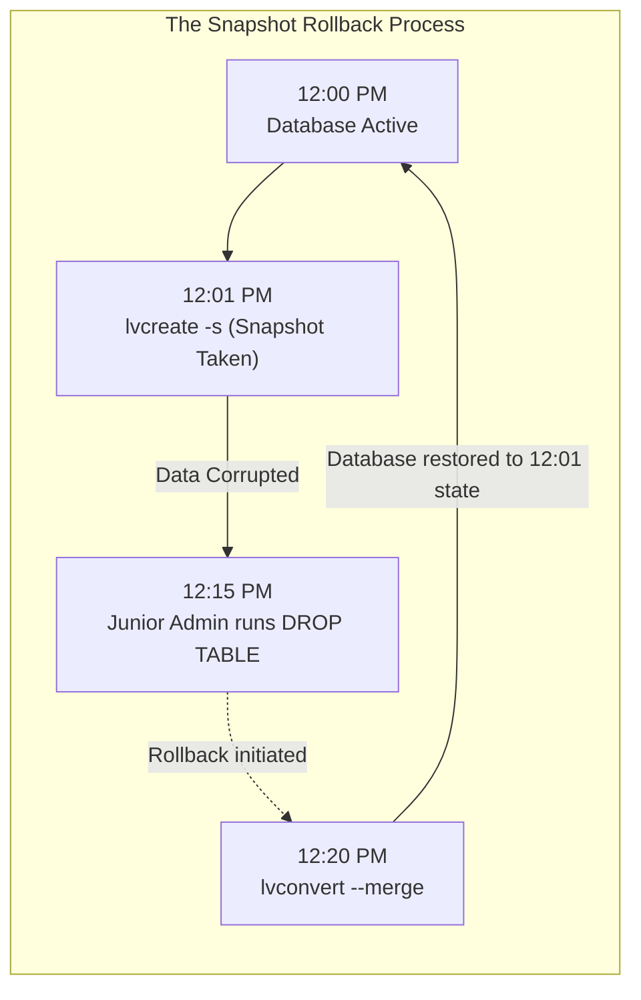
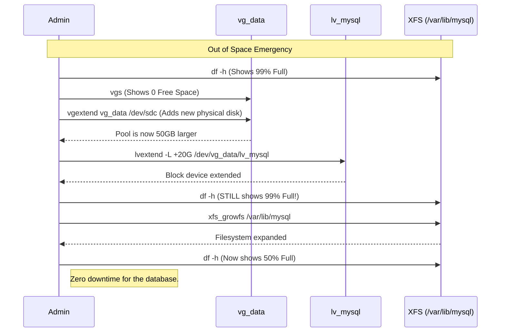

# CHAPTER 39 — LVM RESIZING AND SNAPSHOTS

---

## 1. Introduction

### Why This Topic Exists
The core promise of LVM (Logical Volume Management) is flexibility. If a partition runs out of space, the administrator doesn't need to endure hours of downtime migrating data to a larger disk. They can simply expand the Volume Group and stretch the Logical Volume. Furthermore, LVM offers a powerful backup mechanism called **Snapshots**, which freezes the state of a filesystem at an exact point in time so backups can be taken without taking the database offline.

### Why Linux Administrators Use It
System administrators resize LVM volumes routinely. They monitor storage using tools like Nagios or Datadog. If an alert fires saying `/var/log` is 95% full, the administrator logs in, runs `lvextend` to add 10GB, and runs `xfs_growfs` to expand the filesystem. The crisis is averted in 30 seconds, and the users never even know it happened.

### Why Companies Care About It
Minimizing Data Loss and Downtime. If a company upgrades a massive database, and the upgrade corrupts the data, restoring from a traditional tape backup might take 12 hours. If the administrator took an LVM Snapshot *before* running the upgrade, they can revert the entire 500GB database to its exact pre-upgrade state in a few seconds, saving the company from millions of dollars in lost revenue.

---

## 2. Learning Objectives

By the end of this chapter, you will be able to:
- Extend a Logical Volume (`lvextend`) using free space in the Volume Group.
- Expand the underlying filesystem (`resize2fs`, `xfs_growfs`) to use the new space.
- Understand the extreme risks of shrinking a Logical Volume.
- Create an LVM Snapshot for consistent point-in-time backups.
- Restore (merge) an LVM Snapshot to rollback a system.

---

## 3. Beginner-Friendly Explanation

Think of a water balloon inside a plastic bucket:
- **The Bucket (The Logical Volume):** The physical container holding the space.
- **The Water Balloon (The Filesystem):** The actual data structure holding your files.
- **Resizing:** If you want more water, you can't just stretch the balloon. It will pop against the bucket. You must first buy a bigger bucket (`lvextend`), and *then* you can pump more water into the balloon so it expands to fill the new bucket (`resize2fs`).
- **Snapshots:** Taking a photograph of the balloon. If someone accidentally pops the balloon an hour later, you use the photograph to instantly recreate the balloon exactly as it was.

---

## 4. Core Theory

### 4.1 The Golden Rule of Resizing
Expanding storage requires **two separate steps**.
1. **Expand the Block Device:** Tell LVM to allocate more extents to the LV (`lvextend`).
2. **Expand the Filesystem:** Tell the filesystem (ext4 or xfs) to recognize the new blocks and format them (`resize2fs` or `xfs_growfs`).
*If you do step 1 but forget step 2, `df -h` will show that you still have no free space!*

### 4.2 Shrinking LVs (The Danger Zone)
While expanding an LV can be done seamlessly while the disk is mounted and active (online), **shrinking** an LV is incredibly dangerous.
- You **cannot** shrink an XFS filesystem. It is architecturally impossible.
- You *can* shrink an ext4 filesystem, but you must unmount it first (offline). If you shrink the LV block device *before* shrinking the filesystem, you will instantly slice the end off your data, completely destroying the filesystem. Avoid shrinking in production at all costs.

### 4.3 LVM Snapshots
A snapshot is a read-only or read-write copy of a Logical Volume frozen in time.
It uses **Copy-on-Write (CoW)** technology. When you take a snapshot of a 100GB database, the snapshot doesn't consume 100GB of disk space. It consumes 0GB. It only consumes space when the *original* database changes. If a database record is modified, LVM copies the *old* record into the snapshot space before allowing the modification. Thus, the snapshot only grows as the original data changes.

---

## 5. Internal Working

### Copy-On-Write (CoW) Mechanics
Imagine a book. Taking a snapshot means taking a picture of every page. If the author wants to rewrite Page 5, LVM says "Wait!" LVM photocopies the original Page 5 and puts it in a separate folder (the Snapshot Volume). Then it allows the author to rewrite Page 5 in the book. If you read the Snapshot, LVM shows you the live book for pages 1-4, seamlessly switches to the photocopy folder for Page 5, and back to the live book for pages 6-100. This is how snapshots appear to hold the entire filesystem while actually only storing the changes.

---

## 6. Production Architecture

```mermaid
graph TD
    subgraph LVM Expansion Process
        Admin["Administrator"]
        VG["Volume Group (10GB Free)"]
        LV["Logical Volume (20GB)"]
        FS["Ext4 Filesystem (20GB)"]
        
        Admin -->|1. lvextend -L +5G| LV
        LV -.->|Borrows 5GB from| VG
        Note over LV: LV is now 25GB.<br/>Filesystem is still 20GB!
        Admin -->|2. resize2fs| FS
        FS -.->|Expands to fill| LV
        Note over FS: Filesystem is now 25GB.<br/>df -h shows new space.
    end
```

---

## 7. Command-by-Command Explanation

### 7.1 `lvextend -L +10G /dev/vg_data/lv_mysql`
- **Purpose:** Adds 10 Gigabytes of space to the Logical Volume. (The `+` is crucial. `-L 10G` means "make it exactly 10G". `-L +10G` means "add 10G to whatever size it currently is").

### 7.2 `resize2fs /dev/vg_data/lv_mysql`
- **Purpose:** Expands an `ext4` filesystem to fill the newly available space in the Logical Volume.

### 7.3 `xfs_growfs /var/lib/mysql`
- **Purpose:** Expands an `xfs` filesystem. Notice the major difference: `resize2fs` targets the block device (`/dev/vg_data/...`), whereas `xfs_growfs` targets the **mount point** (`/var/lib/mysql`).

### 7.4 `lvcreate -s -n lv_snap -L 2G /dev/vg_data/lv_mysql`
- **Purpose:** Creates a snapshot (`-s`) named `lv_snap`. It allocates 2GB of Copy-on-Write space for it. (If the original database changes by more than 2GB, the snapshot will become full and permanently break).

### 7.5 `lvconvert --merge /dev/vg_data/lv_snap`
- **Purpose:** Rolls back the original Logical Volume to the exact state it was in when the snapshot was taken, overwriting all changes made since then. The snapshot is destroyed in the process.

---

## 8. Syntax Breakdown

```bash
lvextend -l +100%FREE -r /dev/vg_data/lv_app
│        │  │         │  │
│        │  │         │  └── Target Logical Volume
│        │  │         └───── Resize filesystem automatically
│        │  └─────────────── Use all remaining free space in the VG
│        └────────────────── Extent sizing (lowercase l)
└─────────────────────────── Command: Extend LV
```
*(The `-r` flag is magic. It automatically detects if the filesystem is ext4 or xfs and runs `resize2fs` or `xfs_growfs` for you, reducing a 2-step process to a single command!)*

---

## 9. Parameter Explanation

| Command | Parameter | Description |
|:---|:---|:---|
| `lvextend` | `-r` | Resize the underlying filesystem automatically |
| `lvextend` | `-L +5G`| Add 5 Gigabytes |
| `lvextend` | `-l +50%FREE` | Add half of the VG's remaining free space |
| `lvcreate` | `-s` | Create a snapshot instead of a normal LV |
| `vgs` | | Check how much free space is available to use for expanding |

---

## 10. Sample Output Analysis

**Scenario:** We extend an LV without using the `-r` flag, then manually grow the XFS filesystem.
**Command:** `xfs_growfs /data`

**Output:**
```text
meta-data=/dev/mapper/vg_data-lv_app isize=512    agcount=4, agsize=655360 blks
         =                       sectsz=4096  attr=2, projid32bit=1
...
data     =                       bsize=4096   blocks=2621440, imaxpct=25
         =                       sunit=0      swidth=0 blks
naming   =version 2              bsize=4096   ascii-ci=0 ftype=1
...
data blocks changed from 2621440 to 5242880
```

**Analysis:**
- The output displays the deeply complex internal geometry of the XFS filesystem (allocation groups, block sizes, sector sizes).
- The final line `data blocks changed from...` confirms that the filesystem successfully recognized the new space provided by `lvextend` and expanded its internal structures to utilize it. Running `df -h` will now show the new space.

---

## 11. Architecture Diagram



---

## 12. Workflow Diagram



---

## 13. Real Production Examples

### Safely Patching a Critical Server
An administrator must apply a major OS patch to a critical server. If the patch breaks the server, rebuilding it will take hours.
```bash
# 1. Take a 5GB snapshot of the root filesystem
sudo lvcreate -s -n root_snap -L 5G /dev/rhel/root

# 2. Apply the dangerous patch
sudo dnf update -y

# 3. (Scenario A) The server works fine!
# Delete the snapshot to stop tracking changes and regain performance.
sudo lvremove /dev/rhel/root_snap

# 3. (Scenario B) The server crashes and fails to boot!
# Boot into a Rescue CD, and merge the snapshot.
sudo lvconvert --merge /dev/rhel/root_snap
# Reboot, and the server is exactly as it was before the patch.
```

### The Magic One-Liner for Expansion
Instead of checking whether the filesystem is ext4 or xfs, modern administrators use the `-r` flag to let LVM handle the filesystem expansion automatically.
```bash
# Expand the LV by 50GB and automatically resize the filesystem
sudo lvextend -r -L +50G /dev/vg_data/lv_app
```

---

## 14. Common Mistakes

1. **Letting a snapshot fill up** — If you allocate 2GB for a snapshot, and the original volume changes by 2.1GB, the snapshot is "dropped" (invalidated). It becomes completely useless for recovery. Always allocate enough space for the snapshot to hold all anticipated changes during your maintenance window.
2. **Forgetting to delete snapshots** — Because snapshots use Copy-on-Write, every time the database writes data, the kernel has to write it *twice* (once to the snapshot, once to the live disk). This halves disk write performance. Never leave a snapshot running permanently. Delete it (`lvremove`) as soon as you verify your patch/upgrade was successful.
3. **Attempting to shrink XFS** — If you run `lvreduce` on an XFS filesystem, you will instantly corrupt it. XFS does not support shrinking. If you must shrink an XFS volume, you must back up all the files, destroy the LV, create a smaller LV, format it, and restore the files.

---

## 15. Best Practices

- Use the `-r` flag with `lvextend` to prevent the common mistake of forgetting to resize the filesystem.
- When taking backups of actively writing databases (like MySQL), take an LVM snapshot, mount the snapshot to a temporary directory, and run your backup software against the snapshot. This ensures your backup is perfectly consistent (a frozen point in time) without ever having to shut down the live database.

---

## 16. Security Considerations

- **Snapshot Data Exposure:** A snapshot contains a perfect replica of the original filesystem at that point in time. If an administrator creates a snapshot of `/etc/`, changes the root password on the live system, and forgets to delete the snapshot, an attacker can simply mount the old snapshot and extract the old password hashes.

---

## 17. Performance Considerations

- **Snapshot Penalty:** Creating multiple snapshots on a high I/O volume (like a busy database) causes severe performance degradation. For every single block modified on the live disk, LVM must pause the write, copy the old block to *every single active snapshot*, and then allow the new write.

---

## 18. Troubleshooting Guide

| Symptom | Root Cause | Resolution |
|:---|:---|:---|
| `lvextend: Insufficient free space` | The Volume Group is full | Add a new physical disk to the VG using `vgextend` |
| `lvextend` succeeds, but `df -h` shows no change | Forgot to grow the filesystem | Run `xfs_growfs` (or `resize2fs`) |
| Snapshot is marked "Invalid" | Snapshot ran out of CoW space | Delete the snapshot and recreate it with a larger `-L` size |
| Cannot mount snapshot | Same UUID conflict (XFS) | Mount XFS snapshots using `mount -o nouuid /dev/vg/snap /mnt` |

---

## 19. Practical Labs

**Lab 39.1:** Expanding an LV
*(Assuming `lv_html` exists from the previous chapter)*
1. Check current size: `df -h /var/www/html`
2. Check VG free space: `sudo vgs`
3. Extend the LV by 1GB: `sudo lvextend -L +1G /dev/vg_web/lv_html`
4. Notice `df -h` hasn't changed.
5. Grow the XFS filesystem: `sudo xfs_growfs /var/www/html`
6. Check size again: `df -h /var/www/html`

**Lab 39.2:** Snapshots
1. Create a file on the live volume: `echo "Version 1" | sudo tee /var/www/html/file.txt`
2. Take a snapshot: `sudo lvcreate -s -n snap_html -L 500M /dev/vg_web/lv_html`
3. Alter the live file: `echo "Version 2 - Corrupted!" | sudo tee /var/www/html/file.txt`
4. Unmount the live volume: `sudo umount /var/www/html`
5. Merge the snapshot to rollback: `sudo lvconvert --merge /dev/vg_web/snap_html`
6. Remount: `sudo mount /dev/vg_web/lv_html /var/www/html`
7. Check the file: `cat /var/www/html/file.txt`. It should say "Version 1".

---

## 20. Mini Project

The One-Command Expansion.
You are tasked with giving the `/var/www/html` directory all remaining space in the storage pool.
1. Run `vgs` to see how much free space remains in `vg_web`.
2. Execute the expansion and filesystem resize in a single command using percentages:
   `sudo lvextend -r -l +100%FREE /dev/vg_web/lv_html`
3. Verify the result using `df -h /var/www/html`. You will see it has absorbed the entirety of the volume group's free space.

---

## 21. Assignments

1. Why must you execute two separate steps (unless using the `-r` flag) to make an expanded Logical Volume usable?
2. Why is leaving an LVM snapshot active for a month a bad idea for system performance?
3. What is the command to expand an `ext4` filesystem? What about an `xfs` filesystem?

---

## 22. Interview Questions

### Basic
1. **Q: You ran `lvextend -L +10G /dev/vg_data/lv_app`. The command succeeded. You run `df -h`, but the `/app` directory still shows the old size. What did you forget to do?**
   A: I forgot to resize the underlying filesystem to match the new size of the logical block device. I need to run `resize2fs` (for ext4) or `xfs_growfs` (for xfs).

2. **Q: What command flag allows you to skip that second step and do it all automatically?**
   A: The `-r` (resize) flag on `lvextend`.

### Intermediate
3. **Q: You are asked to shrink the `/var` logical volume by 10GB to give space to the `/home` logical volume. The filesystem is XFS. How do you do this?**
   A: You cannot shrink an XFS filesystem. It is not supported by the filesystem architecture. The only way to achieve this is to back up all data in `/var`, destroy the logical volume, create a smaller one, format it, restore the data, and then give the freed space to `/home`.

4. **Q: How does a 2GB LVM Snapshot manage to back up a 500GB database?**
   A: It doesn't back up the whole database. It uses Copy-on-Write (CoW). The snapshot only stores the *changes* (the delta) that occur after the snapshot is taken. As long as the database doesn't change by more than 2GB during the backup window, the snapshot remains valid.

### Scenario-Based
5. **Q: You took an LVM snapshot of a busy database volume before applying a patch. The patching process took 3 hours. When you check `lvs`, the snapshot says "Invalid". You check the logs and see the patching failed, so you attempt to run `lvconvert --merge` to roll back, but it fails. Why did this happen and how could you have prevented it?**
   A: The snapshot size (e.g., 5GB) was too small to handle the volume of changes generated by the busy database and the patching process over 3 hours. Once the changes exceeded 5GB, the snapshot filled up and the kernel dropped it to prevent the live database from halting. Because it was dropped, it is useless for rollback. I could have prevented this by allocating a much larger size (e.g., 20GB or 50GB) to the snapshot initially, ensuring it could absorb all the CoW changes during the maintenance window.

---

## 23. Chapter Summary and Quick Revision Notes

- **Resizing requires 2 steps:** Grow the LV (`lvextend`), then grow the FS (`resize2fs` or `xfs_growfs`).
- **The Magic Flag:** `lvextend -r` does both steps automatically.
- **Shrinking:** Very dangerous. Ext4 requires unmounting first. XFS cannot be shrunk at all.
- **Snapshots:** Frozen point-in-time copies. Uses Copy-on-Write. Consumes space only when original data changes.
- **Rollback:** Unmount the live volume, run `lvconvert --merge snap_name`, and remount.
- Delete snapshots immediately after use to prevent severe performance penalties on disk writes.

---

## 24. Cheat Sheet

| Command | Purpose |
|:---|:---|
| `lvextend -L +5G /dev/vg/lv` | Expand LV by 5GB |
| `lvextend -r -l +100%FREE ...` | Expand LV and Filesystem to max |
| `resize2fs /dev/vg/lv` | Expand ext4 filesystem |
| `xfs_growfs /mount/point` | Expand xfs filesystem |
| `lvcreate -s -n snap -L 5G /dev/vg/lv`| Create a 5GB Snapshot |
| `lvconvert --merge /dev/vg/snap` | Restore from Snapshot |
| `lvremove /dev/vg/snap` | Delete Snapshot |
