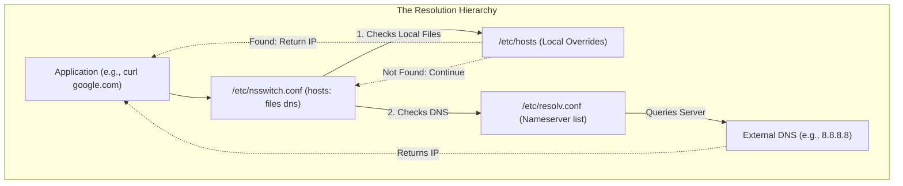
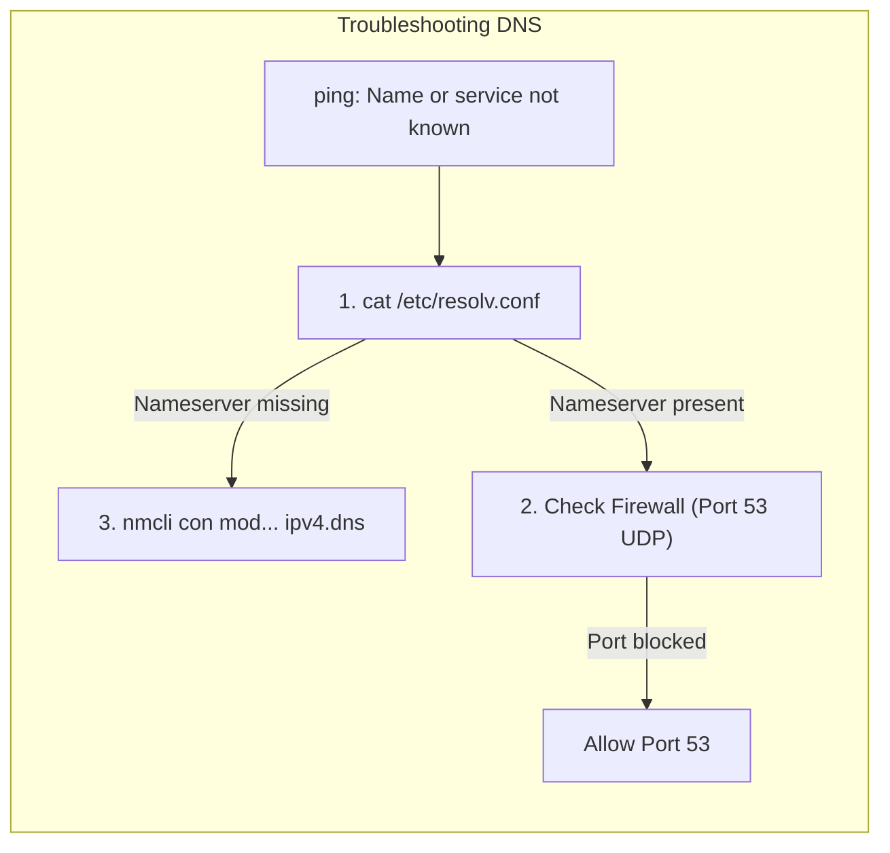
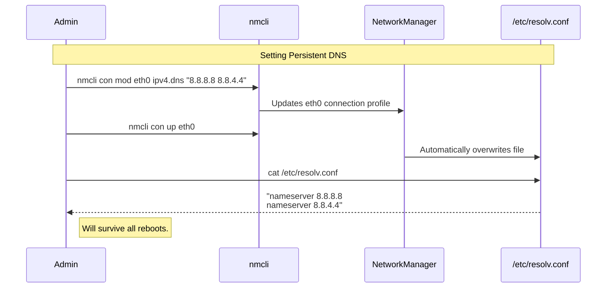

# CHAPTER 44 — DNS AND HOST RESOLUTION

---

## 1. Introduction

### Why This Topic Exists
Computers do not understand names; they only understand IP addresses. When you type `google.com` into a web browser, or when a web server tries to connect to `db01.corporate.local`, the Linux kernel has absolutely no idea where those servers are. It must first translate (resolve) that human-readable name into an IP address (like `142.250.190.46`). This translation process relies on **DNS (Domain Name System)** and local host files.

### Why Linux Administrators Use It
System administrators spend a significant portion of their careers troubleshooting "network" issues that turn out to be DNS issues. If a web server's DNS configuration is broken, it cannot reach the internet to download software updates, it cannot resolve the database's hostname, and the entire application crashes. Administrators must know how to configure DNS servers (`/etc/resolv.conf`) and test resolution (`dig`, `nslookup`).

### Why Companies Care About It
Speed and Reliability. When a customer types a company's URL, the DNS lookup is the very first thing that happens. If the corporate DNS servers are slow or misconfigured, the customer experiences a slow website, or worse, a "Site not found" error. Internally, companies rely on custom DNS to ensure thousands of microservices can instantly find each other by name, rather than hardcoding IP addresses that change constantly.

---

## 2. Learning Objectives

By the end of this chapter, you will be able to:
- Explain the difference between `/etc/hosts` and `/etc/resolv.conf`.
- Understand the priority order defined in `/etc/nsswitch.conf`.
- Configure persistent DNS servers using NetworkManager.
- Query DNS records (A, CNAME, MX) using `dig` and `nslookup`.
- Troubleshoot common hostname resolution failures.

---

## 3. Beginner-Friendly Explanation

Think of finding a friend's phone number:
1. **The `/etc/hosts` file:** This is the physical Little Black Book on your desk. It is extremely fast. If your friend "John" is written in there, you instantly know his number. But if John changes his number, you have to manually erase it and rewrite it.
2. **The DNS Server (`/etc/resolv.conf`):** This is the Information Operator (like calling 411). If you want to call a business in another state, they aren't in your Little Black Book. You call the Operator and ask, "What is the number for Google?" The Operator looks it up in their massive global database and tells you the number.

---

## 4. Core Theory

### 4.1 Local Resolution (`/etc/hosts`)
Before the internet existed, every computer on a network kept a giant text file (`/etc/hosts`) listing the IP address and name of every other computer. Today, it is mostly used for local overrides. If you put `10.0.0.50 mydatabase` in this file, the server will *always* trust this file first, bypassing the network DNS servers entirely.

### 4.2 The Name Service Switch (`/etc/nsswitch.conf`)
How does the kernel know to check the local file before calling the DNS server? This is defined in `/etc/nsswitch.conf`.
Look for the line: `hosts: files dns`.
This tells the kernel: "When resolving a hostname, check the local *files* (`/etc/hosts`) first. If you don't find it there, ask *dns* (`/etc/resolv.conf`)."

### 4.3 DNS Resolution (`/etc/resolv.conf`)
If the name is not in the local hosts file, the kernel reads `/etc/resolv.conf` to find the IP address of the DNS servers it is allowed to ask (e.g., Google's `8.8.8.8` or a corporate Windows Active Directory server).

### 4.4 Common DNS Record Types
- **A Record:** Translates a name to an IPv4 address (e.g., `google.com -> 142.250.190.46`).
- **AAAA Record:** Translates a name to an IPv6 address.
- **CNAME (Canonical Name):** An alias. Translates a name to another name (e.g., `www.google.com -> google.com`).
- **MX (Mail Exchange):** Tells email servers where to deliver mail for a domain.

---

## 5. Internal Working

### The Problem with `/etc/resolv.conf`
Historically, administrators would manually type `nameserver 8.8.8.8` into `/etc/resolv.conf`.
**DO NOT DO THIS on modern systems!**
Today, NetworkManager or `systemd-resolved` completely controls this file. If you manually edit `/etc/resolv.conf` using `vim`, the moment you reboot the server (or restart the network service), NetworkManager will overwrite your edits and delete your changes. To permanently change your DNS servers, you must use `nmcli` to update the connection profile, which then automatically populates `/etc/resolv.conf` for you.

---

## 6. Production Architecture



---

## 7. Command-by-Command Explanation

### 7.1 `cat /etc/resolv.conf`
- **Purpose:** Displays the DNS servers the system is currently using. Look for the `nameserver` lines.

### 7.2 `ping google.com`
- **Purpose:** The simplest way to test if DNS is working. If it says `ping: google.com: Name or service not known`, DNS is completely broken. If it translates it to an IP address but times out, DNS is working perfectly, but a firewall is blocking the ping.

### 7.3 `nslookup google.com`
- **Purpose:** A legacy (but very common) tool to query DNS servers directly.

### 7.4 `dig google.com`
- **Purpose:** The modern, professional tool for querying DNS. It provides highly detailed output, including query times and specific record types.

### 7.5 `hostnamectl set-hostname web01.local`
- **Purpose:** Sets the actual name of the server itself persistently (updating `/etc/hostname`).

---

## 8. Syntax Breakdown

**Modifying DNS via NetworkManager**

```bash
nmcli connection modify eth0 ipv4.dns "8.8.8.8 1.1.1.1"
│     │          │      │    │        │
│     │          │      │    │        └── The DNS Servers (separated by a space)
│     │          │      │    └─────────── The DNS property
│     │          │      └──────────────── The connection profile name
│     │          └─────────────────────── Action: Modify
│     └────────────────────────────────── Object: Connection
└──────────────────────────────────────── Utility
```
*(Remember to run `nmcli con up eth0` to apply!)*

---

## 9. Parameter Explanation

| Command | Parameter | Description |
|:---|:---|:---|
| `dig` | `google.com mx` | Specifically ask for the MX (Mail) records instead of the default A record. |
| `dig` | `+short` | Cuts out all the technical metadata and just returns the raw IP addresses. Great for bash scripts. |
| `dig` | `@8.8.8.8 google.com` | Bypass your system's `/etc/resolv.conf` and explicitly ask a specific DNS server (`8.8.8.8`) for the answer. |
| `getent` | `hosts google.com` | Simulates exactly how the system (and `nsswitch.conf`) will resolve the name. |

---

## 10. Sample Output Analysis

**Scenario:** We want detailed DNS information about a domain.
**Command:** `dig example.com`

**Output:**
```text
; <<>> DiG 9.11.4-P2-RedHat <<>> example.com
;; global options: +cmd
;; Got answer:
;; ->>HEADER<<- opcode: QUERY, status: NOERROR, id: 38243
;; flags: qr rd ra; QUERY: 1, ANSWER: 1, AUTHORITY: 0, ADDITIONAL: 1

;; QUESTION SECTION:
;example.com.                   IN      A

;; ANSWER SECTION:
example.com.            82939   IN      A       93.184.216.34

;; Query time: 14 msec
;; SERVER: 8.8.8.8#53(8.8.8.8)
```

**Analysis:**
- **status: NOERROR:** The query was successful. (If the domain didn't exist, it would say `NXDOMAIN`).
- **QUESTION SECTION:** We asked for the IPv4 `A` record for `example.com`.
- **ANSWER SECTION:** It told us the IP is `93.184.216.34`. (The `82939` is the Time-To-Live in seconds, meaning this answer will be cached before needing to be looked up again).
- **SERVER:** It confirms that the server which provided this answer was `8.8.8.8` on Port `53`.

---

## 11. Architecture Diagram



---

## 12. Workflow Diagram



---

## 13. Real Production Examples

### The Local Override (Dev/Test Environment)
A developer is writing code that connects to `api.company.com`. In production, this resolves to `10.0.50.5`. But the developer is testing on a local lab server and wants the code to hit the lab API at `192.168.1.99` without rewriting their code.
The administrator edits `/etc/hosts`:
```text
127.0.0.1   localhost localhost.localdomain
192.168.1.99  api.company.com
```
Now, when the code on this specific server asks for `api.company.com`, the kernel checks `/etc/hosts` first, finds the override, and routes the traffic to the lab API instantly, never asking the real DNS server.

### Checking Propagation
A company just changed their website's IP address. The administrator needs to know if the global DNS system has updated yet. They use `dig` to bypass local caching and query Google and Cloudflare directly.
```bash
dig @8.8.8.8 www.company.com +short
dig @1.1.1.1 www.company.com +short
```

---

## 14. Common Mistakes

1. **Editing `/etc/resolv.conf` manually** — As mentioned, this is a futile effort on modern servers. NetworkManager (or `systemd-resolved` on Ubuntu) will overwrite your changes. Always use `nmcli` or `netplan` to set DNS permanently.
2. **Confusing Ping failures with DNS failures** — If `ping google.com` fails, look closely at the error. If it says `Name or service not known`, DNS is broken. But if it says `PING google.com (142.250.190.46) 56(84) bytes of data.` and then hangs, **DNS is working perfectly.** The server successfully translated the name to an IP. The hang is caused by routing or firewalls blocking ICMP packets, not DNS.
3. **Putting too many entries in `/etc/hosts`** — Managing 500 servers by copying a giant `/etc/hosts` file to all of them is an unmaintainable nightmare. If an IP changes, you have to update 500 files. Use `/etc/hosts` for temporary overrides only. Use an internal DNS server (like Bind or Windows DNS) for real infrastructure.

---

## 15. Best Practices

- Always configure at least **two** DNS servers (`ipv4.dns "8.8.8.8 8.8.4.4"`). If the primary DNS server crashes, the kernel will automatically timeout and query the secondary server, keeping your applications online.
- When configuring internal servers, always point them to your internal corporate DNS servers first, so they can resolve internal hostnames (like `db01`), and let the corporate DNS server forward unknown requests to the internet.

---

## 16. Security Considerations

- **DNS Spoofing / Cache Poisoning:** If an attacker compromises your DNS server, they can change the record for `banking.com` to point to a malicious server they control. When your users type `banking.com`, they are silently redirected to the attacker's fake login page. This is why DNSSEC (DNS Security Extensions) is used to cryptographically sign DNS records, ensuring they haven't been tampered with.

---

## 17. Performance Considerations

- **DNS Caching:** Querying a remote DNS server takes time (e.g., 20ms to 50ms). If a busy mail server has to query DNS for every single email it receives, the latency adds up and severely slows down the server. Modern Linux uses `systemd-resolved` or `dnsmasq` to cache DNS answers locally in RAM, reducing lookup times to 0ms for frequently accessed domains.

---

## 18. Troubleshooting Guide

| Symptom | Root Cause | Resolution |
|:---|:---|:---|
| `Name or service not known` | Missing DNS servers | Use `nmcli` to add `ipv4.dns` servers and `con up` |
| `dig` times out | Firewall blocking Port 53 | Allow UDP Port 53 outbound |
| Changes to `/etc/resolv.conf` disappear | NetworkManager overwrote it | Never edit it manually. Use `nmcli`. |
| Server resolves wrong IP for an internal app | Stale entry in `/etc/hosts` | Remove the old IP from `/etc/hosts` |

---

## 19. Practical Labs

**Lab 44.1:** The Local Override
1. Run `ping -c 1 google.com`. Note the real IP address.
2. Edit your hosts file: `sudo vim /etc/hosts`
3. Add a line: `127.0.0.1 google.com`
4. Run `ping -c 1 google.com`. Notice it now pings your localhost!
5. **CRITICAL:** Remove that line from `/etc/hosts` so you don't break your server.

**Lab 44.2:** Using Dig
```bash
# Get everything
dig amazon.com
# Get just the IPs
dig amazon.com +short
# Check who handles Amazon's email
dig amazon.com mx +short
```

---

## 20. Mini Project

Fixing a "Broken" Server.
1. Temporarily break your DNS using NetworkManager:
   `sudo nmcli con modify eth0 ipv4.dns "127.0.0.55"` (A fake, broken IP)
   `sudo nmcli con up eth0`
2. Try to `ping google.com`. It will hang for 10 seconds, then fail with "Name or service not known".
3. Check `cat /etc/resolv.conf`. You will see the broken IP injected by NetworkManager.
4. Fix it permanently:
   `sudo nmcli con modify eth0 ipv4.dns "8.8.8.8 1.1.1.1"`
   `sudo nmcli con up eth0`
5. Test `ping google.com` again. It works instantly.

---

## 21. Assignments

1. What file dictates the priority order between checking local files and querying DNS servers?
2. Why is manually typing `nameserver 8.8.8.8` into `/etc/resolv.conf` bad practice on a modern RHEL server?
3. What command would you use to find the Mail Exchange (MX) records for a domain?

---

## 22. Interview Questions

### Basic
1. **Q: What is the primary purpose of DNS?**
   A: To translate human-readable domain names (like google.com) into machine-readable IP addresses.

2. **Q: Which file allows you to create local DNS overrides that bypass the network DNS servers?**
   A: `/etc/hosts`

### Intermediate
3. **Q: A developer says their application cannot connect to the database by its hostname `db-prod.local`. You check `/etc/resolv.conf` and see the correct DNS servers. You run `ping db-prod.local` and it fails with "Name or service not known". You run `dig db-prod.local` and it succeeds, returning the correct IP address. Why is ping failing when dig succeeds?**
   A: `dig` bypasses the OS's resolution hierarchy and queries the DNS servers in `/etc/resolv.conf` directly. `ping` obeys the OS hierarchy defined in `/etc/nsswitch.conf`. If `nsswitch.conf` is misconfigured (e.g., the `dns` keyword is missing from the `hosts:` line), `ping` will only check the local `/etc/hosts` file and fail, even though the DNS server has the correct answer.

4. **Q: What port and protocol does DNS primarily use?**
   A: Port 53, primarily using UDP (though it can use TCP for large zone transfers or heavy responses).

### Scenario-Based
5. **Q: You are provisioning a new server. You want to set the DNS servers to `8.8.8.8` and `8.8.4.4`. You edit `/etc/resolv.conf` using `vi`, save it, and test it. It works. You reboot the server to verify persistence, but when it comes back up, DNS is broken and `/etc/resolv.conf` is empty. How do you fix this permanently using the command line?**
   A: On modern systems, NetworkManager dynamically generates `/etc/resolv.conf`. Manual edits are lost on reboot or network restart. To fix it permanently, I must use `nmcli`.
   1. Find the connection name: `nmcli con show`
   2. Modify it: `nmcli con modify <connection_name> ipv4.dns "8.8.8.8 8.8.4.4"`
   3. Activate the changes: `nmcli con up <connection_name>`. NetworkManager will now permanently write these values into `/etc/resolv.conf` on every boot.

---

## 23. Chapter Summary and Quick Revision Notes

- **DNS:** Translates names to IPs (Port 53, UDP).
- **`/etc/hosts`:** Local override file. Always checked first.
- **`/etc/nsswitch.conf`:** Tells the kernel the priority order (`hosts: files dns`).
- **`/etc/resolv.conf`:** Contains the list of DNS servers. **DO NOT EDIT MANUALLY.**
- **NetworkManager (`nmcli`)** is the correct way to set DNS persistently.
- **`dig`:** The professional tool for querying DNS records directly.
- **`nslookup`:** The older, legacy tool for querying DNS.

---

## 24. Cheat Sheet

| Command / File | Purpose |
|:---|:---|
| `cat /etc/hosts` | View local DNS overrides |
| `cat /etc/resolv.conf` | View current DNS servers being used |
| `nmcli con modify eth0 ipv4.dns "8.8.8.8"` | Set DNS persistently |
| `dig google.com` | Query the A record (IPv4) |
| `dig google.com +short` | Query just the IP address |
| `dig google.com mx` | Query Mail records |
| `ping google.com` | Test full OS name resolution |
