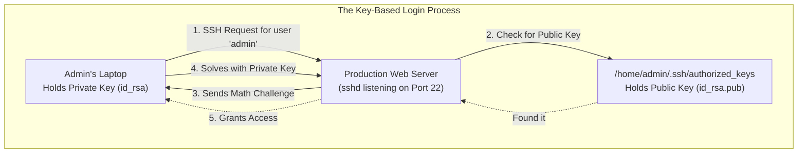
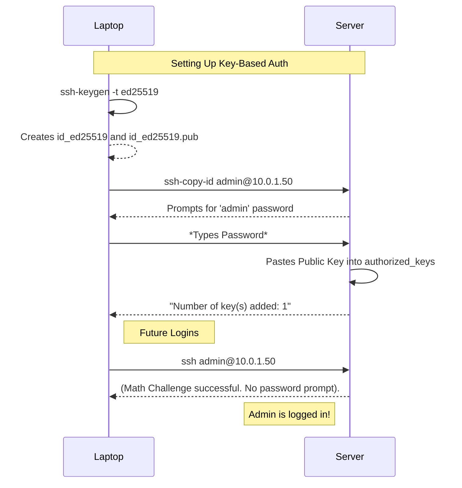

# CHAPTER 47 — OPENSSH SERVER CONFIGURATION AND KEY-BASED AUTHENTICATION

---

## 1. Introduction

### Why This Topic Exists
In an enterprise datacenter or cloud environment, you rarely have physical access to the servers. You cannot plug in a monitor and keyboard. To administer a Linux server, you must connect to it remotely over the network. **Secure Shell (SSH)** is the cryptographic network protocol that allows you to open a secure, encrypted terminal session on a remote server. The `OpenSSH` suite is the industry-standard software that provides this capability.

### Why Linux Administrators Use It
SSH is the primary tool used by Linux administrators every single day. They use the SSH Client (`ssh`) on their laptops to connect to the SSH Server (`sshd`) running on production machines. Administrators also configure the `sshd_config` file to lock down the server, ensuring that only authorized users can log in, and that the encryption algorithms used are strong enough to resist modern hacking attempts.

### Why Companies Care About It
Encryption and Compliance. Before SSH was invented in 1995, administrators used Telnet. Telnet sent all commands and passwords in plaintext over the internet, allowing anyone with a packet sniffer to steal passwords. SSH encrypts the entire session. Furthermore, companies rely on SSH Key-Based Authentication (instead of passwords) to prevent brute-force attacks and satisfy strict security compliance audits (like SOC2 or PCI-DSS).

---

## 2. Learning Objectives

By the end of this chapter, you will be able to:
- Connect to a remote server using the `ssh` client.
- Understand the underlying cryptography (Symmetric vs Asymmetric).
- Generate a public/private SSH key pair using `ssh-keygen`.
- Copy your public key to a remote server using `ssh-copy-id`.
- Edit the primary OpenSSH configuration file (`/etc/ssh/sshd_config`).
- Restart the `sshd` service to apply new configurations.

---

## 3. Beginner-Friendly Explanation

Think of a high-security bank vault:
- **Telnet (The Old Way):** You yell your combination across the lobby to the bank teller. Anyone standing in the lobby can hear your combination and steal your money.
- **SSH (The New Way):** You and the teller create a secret mathematical language before you start talking. Even if someone in the lobby hears you, they just hear gibberish.
- **Passwords vs Keys:** 
  - *Password:* A secret word you type. A computer can guess 10,000 words a second until it guesses yours.
  - *Key-Based Authentication:* Instead of a password, you have two mathematically linked keys. One is a **Lock** (Public Key), and one is the physical **Key** (Private Key). You put the Lock on the bank vault. You keep the Key in your pocket. A hacker cannot guess a physical Key. They must steal it from your pocket.

---

## 4. Core Theory

### 4.1 Symmetric vs Asymmetric Cryptography
SSH uses both.
- **Asymmetric (Public/Private Keys):** Used only at the very beginning of the connection to prove who you are and to securely exchange a temporary secret code. 
- **Symmetric (The Session Key):** Once the temporary secret code is exchanged, both sides use it to encrypt the rest of the conversation. (Symmetric math is much faster, which keeps the terminal responsive).

### 4.2 The OpenSSH Suite
OpenSSH is usually installed by default on almost all Linux distributions. It has two main parts:
1. **The Client (`ssh`):** Used to connect *to* other machines.
2. **The Server (`sshd`):** A daemon running in the background listening on TCP Port 22 for incoming connections.

### 4.3 SSH Key Pairs
An SSH Key Pair consists of two files:
- **Private Key (e.g., `id_rsa`):** YOUR secret. It stays on your laptop. NEVER share it. NEVER email it. If someone gets this, they are you.
- **Public Key (e.g., `id_rsa.pub`):** The Lock. You can give this to anyone. You place this file on any server you want to log into.

When you try to log in, the server looks at the Public Key on its hard drive and sends you a math puzzle. Only the matching Private Key on your laptop can solve the puzzle. If you solve it, you are logged in. No passwords required.

---

## 5. Internal Working

### The `authorized_keys` File
When you place your Public Key on a remote server, where does it go?
It goes into a specific hidden directory in the home folder of the user you are logging in as: `~/.ssh/authorized_keys`.
If you want to log into the remote server as the `admin` user, your public key must be pasted inside `/home/admin/.ssh/authorized_keys`. When `sshd` receives a connection request for `admin`, it specifically checks that file to see if you have the lock.

---

## 6. Production Architecture



---

## 7. Command-by-Command Explanation

### 7.1 `ssh user@192.168.1.50`
- **Purpose:** Connects to the server `192.168.1.50` as `user`. It will prompt for a password unless SSH keys are set up.

### 7.2 `ssh-keygen -t ed25519`
- **Purpose:** Generates a new cryptographic key pair on your local machine.
  - `-t ed25519`: Specifies the mathematical algorithm. Ed25519 is the modern, highly secure, and very fast standard that replaced the older RSA algorithm.

### 7.3 `ssh-copy-id user@192.168.1.50`
- **Purpose:** Automates the process of copying your Public Key to the remote server. It connects (asking for your password one last time), creates the `~/.ssh` directory if it doesn't exist, and securely pastes your public key into the `authorized_keys` file.

### 7.4 `cat /etc/ssh/sshd_config`
- **Purpose:** Views the primary configuration file for the SSH Server daemon. (Note the `d` in `sshd_config`. There is also an `ssh_config` file, which configures how the *client* behaves. You almost always want `sshd_config`).

### 7.5 `systemctl restart sshd`
- **Purpose:** Restarts the SSH daemon to apply any changes made to `sshd_config`.

---

## 8. Syntax Breakdown

```bash
ssh -i /home/sachin/aws_key.pem -p 2222 ec2-user@10.0.1.50
│   │  │                        │  │    │        │
│   │  │                        │  │    │        └── The remote server IP
│   │  │                        │  │    └─────────── The remote user to log in as
│   │  │                        │  └──────────────── Custom Port number (if not 22)
│   │  │                        └─────────────────── Port flag
│   │  └──────────────────────────────────────────── Explicit path to a Private Key file
│   └─────────────────────────────────────────────── Identity flag (Use this specific key)
└─────────────────────────────────────────────────── Command: SSH Client
```

---

## 9. Parameter Explanation

| Command | Parameter | Description |
|:---|:---|:---|
| `ssh` | `-v` | Verbose mode. Prints exactly what algorithms are being negotiated. Essential for troubleshooting why a connection is failing. (You can use `-vvv` for extreme detail). |
| `ssh` | `-X` | Enables X11 Forwarding. Allows you to run a graphical GUI application (like Firefox) on the server, but have the window appear on your local laptop screen. |
| `ssh-keygen`| `-b 4096` | If you must use the older RSA algorithm (`-t rsa`), use `-b 4096` to force it to create a 4096-bit key, as the default 2048-bit keys are becoming mathematically vulnerable. |

---

## 10. Sample Output Analysis

**Scenario:** We connect to a completely new server for the very first time.
**Command:** `ssh root@10.0.1.99`

**Output:**
```text
The authenticity of host '10.0.1.99 (10.0.1.99)' can't be established.
ED25519 key fingerprint is SHA256:7bY3z9...
This key is not known by any other names
Are you sure you want to continue connecting (yes/no/[fingerprint])? 
```

**Analysis:**
- **The Warning:** SSH is designed to prevent "Man-in-the-Middle" attacks. Your laptop is saying, "I have never seen this server before. I don't know if this is actually the server, or a hacker pretending to be the server."
- **The Fingerprint:** This is a hash of the Server's own public key. (The server has keys too, not just users). 
- **The Action:** You must type `yes` to accept the fingerprint. Your laptop saves this fingerprint in a file called `~/.ssh/known_hosts`. If a hacker later tries to impersonate `10.0.1.99`, their server will present a different fingerprint, and your laptop will instantly throw a massive, terrifying RED error blocking the connection.

---

## 11. Architecture Diagram

```mermaid
graph LR
    subgraph The ~/.ssh Directory Structure (Permissions Matter!)
        Dir["~/.ssh/ (Permissions: 700)"]
        
        Priv["id_ed25519<br/>(Private Key - Perms: 600)"]
        Pub["id_ed25519.pub<br/>(Public Key - Perms: 644)"]
        Auth["authorized_keys<br/>(Allowed Logins - Perms: 600)"]
        Known["known_hosts<br/>(Saved Server Fingerprints - Perms: 644)"]
        
        Dir --> Priv
        Dir --> Pub
        Dir --> Auth
        Dir --> Known
    end
```
*CRITICAL: If the permissions on these files are too open (e.g., your Private Key is readable by other users), SSH will simply refuse to work and will lock you out.*

---

## 12. Workflow Diagram



---

## 13. Real Production Examples

### The DevOps Key (`-i`)
When you spin up a server in AWS (EC2), AWS automatically injects your Public Key into the server, and gives you a `.pem` file containing the Private Key. To connect, you cannot just type `ssh`. You must explicitly tell SSH to use that `.pem` file.
```bash
# First, secure the key so SSH will accept it
chmod 600 my-aws-key.pem
# Connect using the Identity file
ssh -i my-aws-key.pem ec2-user@3.85.12.99
```

### Checking `sshd_config` Defaults
An administrator wants to see what the SSH server's rules are. They open `/etc/ssh/sshd_config`.
```text
#Port 22
#PermitRootLogin prohibit-password
#PasswordAuthentication yes
```
*Note: If a line has a `#` at the beginning, it is commented out. In `sshd_config`, commented lines show you the compiled-in DEFAULT value. If you want to change it (e.g., change the port to 2222), you must remove the `#` and change the number.*

---

## 14. Common Mistakes

1. **Destroying existing keys** — If you run `ssh-keygen` and press Enter through all the prompts, it creates `id_rsa` or `id_ed25519`. If you run it a second time a month later, it will ask "Overwrite existing file?". If you press Yes, your original Private Key is destroyed. You are now permanently locked out of any server that relied on that key.
2. **Bad File Permissions** — If you manually create the `authorized_keys` file on a server instead of using `ssh-copy-id`, and you accidentally leave the permissions as `777` (readable/writable by everyone), the `sshd` daemon will say "This is a massive security risk, I am ignoring this file" and will force you to use a password anyway. The `.ssh` directory MUST be `700`, and `authorized_keys` MUST be `600`.
3. **Restarting SSH with syntax errors** — If you edit `/etc/ssh/sshd_config`, make a typo, and run `systemctl restart sshd`, the daemon will crash and refuse to start. Because SSH is down, you cannot connect to fix it. Always test your config file syntax BEFORE restarting: `sshd -t`.

---

## 15. Best Practices

- Use **Passphrases** on your Private Keys. When you run `ssh-keygen`, it asks for a passphrase. If you leave it blank, the key is saved in plaintext. If a hacker steals your laptop, they can instantly log into all your servers. If you set a passphrase, the Private Key is encrypted on your hard drive. Even if stolen, the hacker cannot use the key without knowing the passphrase to decrypt it.
- Never use the older DSA or RSA (under 2048-bit) algorithms. Standardize on `ed25519` for all new key generation.

---

## 16. Security Considerations

- **Key Management:** In a large enterprise, managing SSH keys manually becomes impossible. When an employee leaves the company, an administrator must log into 5,000 servers and delete their Public Key from every `authorized_keys` file. If they miss one, the ex-employee still has access. Modern enterprises use Centralized Identity (LDAP/Active Directory) or short-lived SSH Certificates (via HashiCorp Vault) to solve this.

---

## 17. Performance Considerations

- **DNS Lookups:** By default, when you SSH into a server, the `sshd` daemon tries to do a reverse DNS lookup on your IP address. If the corporate DNS server is slow, your SSH connection will hang for 10-15 seconds before prompting you for a password. If you experience slow logins, editing `/etc/ssh/sshd_config` and setting `UseDNS no` will make logins instantaneous.

---

## 18. Troubleshooting Guide

| Symptom | Root Cause | Resolution |
|:---|:---|:---|
| `Connection timed out` | Network/Firewall dropping Port 22 | Check routing and `firewall-cmd` |
| `Connection refused` | `sshd` is not running on the server | `systemctl status sshd` via console |
| Still asking for password after copying key | Bad permissions on server | Ensure `~/.ssh` is 700 and `authorized_keys` is 600 |
| `REMOTE HOST IDENTIFICATION HAS CHANGED` | The server was rebuilt with a new key | Remove the old fingerprint from your `~/.ssh/known_hosts` file |

---

## 19. Practical Labs

**Lab 47.1:** Key Generation and Copying
*(Requires two VMs: VM A and VM B. Run this on VM A).*
1. `ssh-keygen -t ed25519` (Press Enter to accept defaults).
2. `ls -l ~/.ssh/` (Verify the two files exist).
3. `ssh-copy-id <user>@<IP_of_VM_B>`
4. Enter the password for VM B.
5. `ssh <user>@<IP_of_VM_B>` (You should log in instantly without a password!).
6. Type `exit` to return to VM A.

**Lab 47.2:** Validating SSH Config
1. `sudo sshd -t` (Checks the syntax of the config file. No output means it is perfect).
2. `sudo vim /etc/ssh/sshd_config` (Add a random garbage line at the bottom).
3. `sudo sshd -t` (Notice it throws a fatal error and line number).
4. Remove the garbage line to fix it.

---

## 20. Mini Project

The "Known Hosts" Alert.
1. From Server A, SSH into Server B: `ssh user@ServerB`
2. Exit back to Server A.
3. On Server B, force it to regenerate its own host keys (Simulating a server rebuild):
   `sudo rm /etc/ssh/ssh_host_*`
   `sudo systemctl restart sshd` (It will automatically generate new keys).
4. Go back to Server A and try to SSH into Server B again.
5. Watch the massive WARNING message. The fingerprint changed!
6. Fix it by deleting the old fingerprint from your local machine:
   `ssh-keygen -R <IP_of_VM_B>`
7. Connect again. You will be prompted to accept the new fingerprint.

---

## 21. Assignments

1. What are the two files generated by `ssh-keygen` and which one is safe to share?
2. What command completely automates the process of moving your public key to a remote server's `authorized_keys` file?
3. What is the absolute first command you should run after making changes to `/etc/ssh/sshd_config` but before you restart the daemon?

---

## 22. Interview Questions

### Basic
1. **Q: What port does SSH use by default, and what protocol does it use?**
   A: Port 22, TCP.

2. **Q: You want to log into a server securely without typing a password. What mechanism allows this?**
   A: SSH Key-Based Authentication (Public/Private Key pairs).

### Intermediate
3. **Q: You generate an SSH key and attempt to use it, but the client throws an error saying "Permissions are too open" and ignores the key. What is wrong?**
   A: The permissions on the Private Key file (e.g., `id_rsa` or the `.pem` file) are set too loosely (like 644). Anyone on the local system could read it. SSH enforces strict security and requires the Private Key to have permissions of `600` (read/write by owner only). I must run `chmod 600 <keyfile>`.

4. **Q: What is the purpose of the `~/.ssh/known_hosts` file?**
   A: It stores the cryptographic fingerprints of every remote server you have previously connected to. If a server's fingerprint changes in the future, SSH checks this file, detects the mismatch, and aborts the connection to protect you from a potential Man-in-the-Middle (MitM) attack.

### Scenario-Based
5. **Q: You are editing `/etc/ssh/sshd_config` to tighten security on a remote production server hundreds of miles away. You disable password authentication. You plan to restart the SSH daemon. If you make a mistake, you might permanently lock yourself out. What precautions should you take before running `systemctl restart sshd`?**
   A: 
   1. First, I would run `sshd -t` to check the configuration file for syntax errors. 
   2. Second, I would **NOT** close my current, active SSH session. Restarting the `sshd` daemon does not kill active, established connections. I would open a *second* terminal window and try to SSH into the server using the new configuration. 
   3. If the second window successfully connects using keys, I know it works. If it fails, I still have my first window open and active, allowing me to revert the changes in `sshd_config` and try again.

---

## 23. Chapter Summary and Quick Revision Notes

- **SSH (Secure Shell):** Encrypted remote administration (Port 22, TCP).
- **Public Key (The Lock):** Safe to share. Goes on the remote server in `~/.ssh/authorized_keys`.
- **Private Key (The Key):** Keep secret. Stays on your laptop (`~/.ssh/id_ed25519`).
- **`ssh-keygen`:** Creates the key pair.
- **`ssh-copy-id`:** Automates copying the public key to the remote server.
- **`sshd_config`:** The Server configuration file.
- **`sshd -t`:** Tests the syntax of the config file. Never restart without running this.
- **File Permissions:** `~/.ssh` (700), `authorized_keys` (600), Private Keys (600).

---

## 24. Cheat Sheet

| Command | Purpose |
|:---|:---|
| `ssh user@10.0.0.5` | Connect to server |
| `ssh -i key.pem user@10.0.0.5`| Connect using specific private key |
| `ssh-keygen -t ed25519` | Generate modern SSH key pair |
| `ssh-copy-id user@10.0.0.5` | Copy public key to remote server |
| `sudo sshd -t` | Validate sshd_config syntax |
| `ssh-keygen -R 10.0.0.5` | Remove bad server from known_hosts |
| `chmod 600 ~/.ssh/id_ed25519` | Secure your private key |
