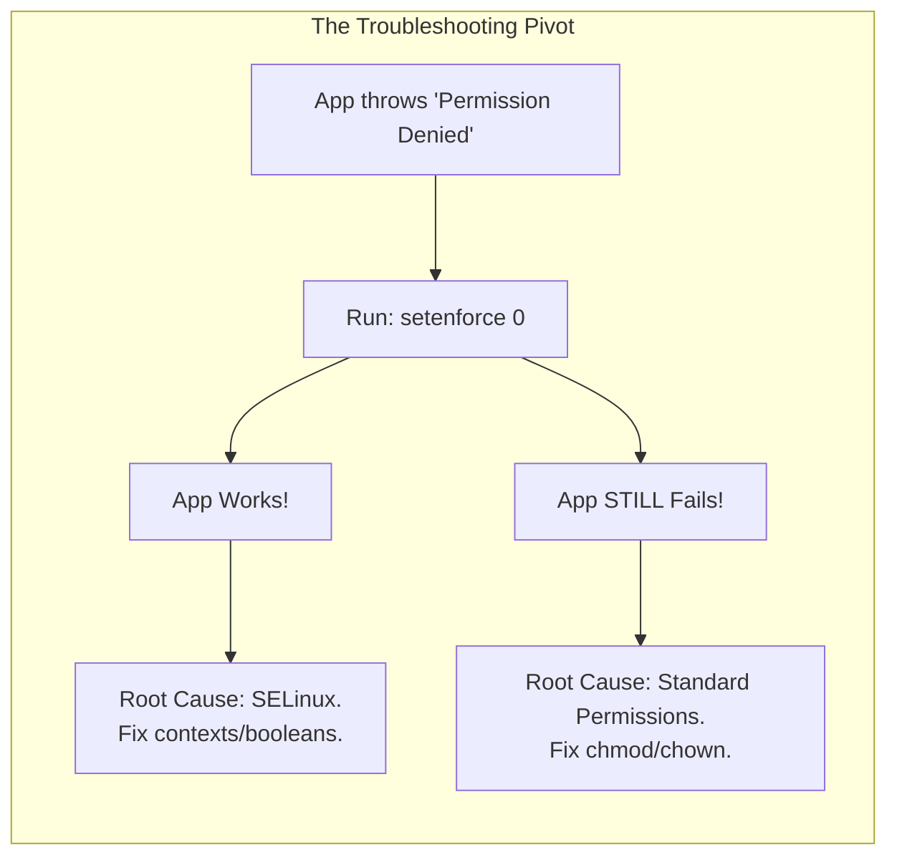
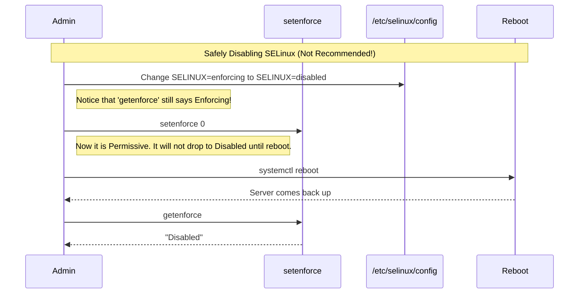

# CHAPTER 49 — SELINUX FUNDAMENTALS (ENFORCING VS PERMISSIVE)

---

## 1. Introduction

### Why This Topic Exists
Historically, Linux security relied on standard file permissions (rwx). If a hacker found a vulnerability in the Apache web server and exploited it, they gained the permissions of the `apache` user. If the administrator accidentally made a file readable by `apache`, the hacker could steal it. **SELinux (Security-Enhanced Linux)** was developed by the United States National Security Agency (NSA) to fix this. It shifts Linux from Discretionary Access Control (DAC) to Mandatory Access Control (MAC).

### Why Linux Administrators Use It
Administrators use SELinux to confine programs to the absolute minimum privileges necessary to function, regardless of who owns the file. Even if a hacker completely compromises the Apache web server and gains `root` access through an exploit, SELinux steps in and says, "Apache is only allowed to read files in `/var/www/`. I don't care if you have root permissions, you are denied access to `/etc/shadow`."

### Why Companies Care About It
Zero-Day Vulnerability Mitigation. A "zero-day" is a software bug that hackers discover before the developers know about it. There is no patch available. If a zero-day is discovered in Nginx, companies running SELinux are largely protected because SELinux physically prevents the Nginx process from executing arbitrary code or accessing unauthorized directories, stopping the exploit in its tracks.

---

## 2. Learning Objectives

By the end of this chapter, you will be able to:
- Explain the difference between Discretionary Access Control (DAC) and Mandatory Access Control (MAC).
- Understand the three SELinux modes (Enforcing, Permissive, Disabled).
- Check the current SELinux status using `sestatus` and `getenforce`.
- Temporarily change the SELinux mode using `setenforce`.
- Permanently change the SELinux mode by editing `/etc/selinux/config`.
- Read and interpret basic SELinux violation logs in `/var/log/audit/audit.log`.

---

## 3. Beginner-Friendly Explanation

Think of a High-Security Office Building:
- **Standard Linux (DAC):** An employee (Apache) has a master key badge. The building manager trusts the employee to only go to the Web Server room. But if the employee goes crazy, their badge physically works on the HR door, and they can steal the payroll files.
- **SELinux (MAC):** An NSA agent sits in the lobby. The agent places a physical tracking collar on every employee (Process Context), and a barcode on every door (File Context). The agent has an unalterable rulebook (Policy) that says "The Apache collar can only enter doors with the Web Server barcode." If the Apache employee tries to open the HR door, the NSA agent tackles them, *even if they have the master key badge*.

---

## 4. Core Theory

### 4.1 DAC vs MAC
- **DAC (Discretionary Access Control):** Users own files. Users have the *discretion* to change permissions (`chmod 777`). A bad decision by a user compromises security.
- **MAC (Mandatory Access Control):** The system enforces a global security policy. Users cannot bypass it. Even the `root` user is bound by the policy.

### 4.2 The Three Modes of SELinux
1. **Enforcing:** SELinux is active. It actively blocks unauthorized access and logs the violation.
2. **Permissive:** SELinux is active, but it acts like a passive observer. It does NOT block unauthorized access, but it logs a massive warning saying "I *would* have blocked this in Enforcing mode." (Crucial for troubleshooting).
3. **Disabled:** SELinux is completely turned off. The kernel does not load the module. (Requires a reboot to fully apply).

### 4.3 Why People Hate SELinux
The most common phrase in Linux administration is, "My application isn't working. Just disable SELinux." 
This happens because standard `rwx` permissions show up clearly in `ls -l`. SELinux blocks happen invisibly in the background. An admin checks the file permissions, sees `777`, and is baffled why the application still says "Permission Denied." Disabling SELinux fixes the symptom but destroys the server's security. Professional administrators learn to troubleshoot SELinux instead of turning it off.

---

## 5. Internal Working

### The Policy Database
SELinux operates using a massive, compiled database of rules known as the **Targeted Policy**.
The policy defines thousands of rules like:
- `allow httpd_t var_log_t:dir { read }` (Apache can read log directories)
- `allow sshd_t shadow_t:file { read }` (SSH can read the shadow password file)
If an action is not explicitly listed in the policy with an `allow` rule, it is implicitly and permanently denied.

---

## 6. Production Architecture

```mermaid
graph TD
    subgraph The Double-Check System
        App["Application Process (e.g., Nginx)"]
        File["Target File (/etc/shadow)"]
        DAC["1. Standard DAC Check (chmod/chown)"]
        MAC["2. SELinux MAC Check (Policy)"]
        
        App -->|Tries to read| DAC
        DAC -.->|Fails rwx check| Deny1["Access Denied"]
        DAC -->|Passes rwx check (e.g., ran as root)| MAC
        MAC -.->|Fails Policy Check| Deny2["Access Denied (SELinux AVC Denial)"]
        MAC -->|Passes Policy Check| Grant["Access Granted"]
    end
    style MAC fill:#e3f2fd,stroke:#1565c0
```
*Notice that SELinux is evaluated SECOND. If standard file permissions block the user, SELinux doesn't even bother checking.*

---

## 7. Command-by-Command Explanation

### 7.1 `sestatus`
- **Purpose:** Prints a comprehensive summary of SELinux status, including the current mode, the mode configured to load on the next boot, and the active policy.

### 7.2 `getenforce`
- **Purpose:** Prints a single word representing the current live mode (Enforcing, Permissive, or Disabled).

### 7.3 `setenforce 0`
- **Purpose:** Instantly switches SELinux from Enforcing to Permissive mode in live RAM.
- **Why use it?** If an application is mysteriously failing, run `setenforce 0`. Try the application again. If it suddenly works, you have proven 100% that SELinux is the root cause. You then switch it back (`setenforce 1`) and fix the policy.

### 7.4 `setenforce 1`
- **Purpose:** Instantly switches SELinux back to Enforcing mode.

### 7.5 `grep AVC /var/log/audit/audit.log`
- **Purpose:** Whenever SELinux blocks an action, it logs an "Access Vector Cache (AVC) Denial" in the audit log. Searching for `AVC` reveals exactly which process was blocked from accessing which file.

---

## 8. Syntax Breakdown

**The SELinux Config File (`/etc/selinux/config`)**

```ini
# This file controls the state of SELinux on the system.
# SELINUX= can take one of these three values:
#     enforcing - SELinux security policy is enforced.
#     permissive - SELinux prints warnings instead of enforcing.
#     disabled - No SELinux policy is loaded.
SELINUX=enforcing
│       │
│       └── The persistent state that will apply on the next reboot.
└────────── The directive variable.
```

---

## 9. Parameter Explanation

| Mode / Command | Effect | Security Posture |
|:---|:---|:---|
| `setenforce 0` | Becomes `Permissive` | Vulnerable (but logging violations) |
| `setenforce 1` | Becomes `Enforcing` | Highly Secure |
| `vi /etc/selinux/config` | Change `SELINUX=disabled` | Completely Vulnerable (No logging). Requires reboot. |

*Warning: If you change SELinux to Disabled, reboot, run the server for a month, and then change it back to Enforcing and reboot, the server may fail to boot. All files created during that month have no SELinux labels, and the strict policy will block the kernel from reading them.*

---

## 10. Sample Output Analysis

**Scenario:** We check the status of SELinux on a standard RHEL server.
**Command:** `sestatus`

**Output:**
```text
SELinux status:                 enabled
SELinuxfs mount:                /sys/fs/selinux
SELinux root directory:         /etc/selinux
Loaded policy name:             targeted
Current mode:                   enforcing
Mode from config file:          enforcing
Policy MLS status:              enabled
Policy deny_unknown status:     allowed
Max kernel policy version:      33
```

**Analysis:**
- **SELinux status:** The module is loaded into the kernel.
- **Loaded policy name:** `targeted`. This means SELinux only restricts specific network-facing daemons (like Apache, Bind, MariaDB). Standard users logging in via terminal are usually "unconfined" and not strictly restricted by this specific policy.
- **Current mode:** `enforcing`. The NSA agent is actively tackling rule-breakers.
- **Mode from config file:** `enforcing`. When the server reboots, it will remain in enforcing mode.

---

## 11. Architecture Diagram


*This flowchart saves administrators hundreds of hours of debugging.*

---

## 12. Workflow Diagram



---

## 13. Real Production Examples

### The Nginx Reverse Proxy Failure
An administrator installs Nginx to act as a reverse proxy. They configure Nginx to forward traffic to a backend Node.js server on `http://127.0.0.1:3000`.
They try to access the website. Nginx throws a "502 Bad Gateway" error.
They check the Nginx logs and see `Permission denied while connecting to upstream`.
The admin checks `chmod`, and it looks fine.
The admin runs `setenforce 0`, refreshes the page, and the website works perfectly!
**Conclusion:** SELinux has a rule that forbids web servers from initiating outbound network connections (to prevent a hacked web server from being used in a botnet). The admin turns SELinux back on (`setenforce 1`) and will learn how to fix this specific rule in the next chapter.

### Security Auditing
A company is undergoing a strict SOC2 compliance audit. The auditor runs a script across all 500 Linux servers to check the output of `sestatus`. If a single server returns `Current mode: permissive` or `Disabled`, the company fails the audit and may lose enterprise clients. SELinux Enforcing is non-negotiable in government and financial sectors.

---

## 14. Common Mistakes

1. **"Fixing" things by disabling SELinux permanently** — This is the hallmark of an amateur administrator. You are removing the armor from your server because you don't understand how the straps work. Learn the tools.
2. **Confusing `setenforce` with the config file** — `setenforce` only changes RAM. If you run `setenforce 0` to fix a broken application and close your laptop, the application will break again the very next time the server reboots for maintenance.
3. **Attempting to run `setenforce Disabled`** — You cannot transition from Enforcing to Disabled in live RAM. `setenforce` only toggles between 1 (Enforcing) and 0 (Permissive). Disabling requires editing the config file and rebooting.

---

## 15. Best Practices

- Use **Permissive Mode** for debugging. If you install a massive, complex third-party application (like GitLab or Oracle), put SELinux in Permissive mode. Run the application through all its functions. SELinux will silently log every single rule the application broke. You can then use tools (like `audit2allow`) to automatically generate a custom SELinux policy based on those logs, and then safely switch back to Enforcing mode.
- Before blaming SELinux, always check standard `rwx` permissions first. SELinux cannot grant access if standard permissions are denying it.

---

## 16. Security Considerations

- **Container Security (Docker/Podman):** SELinux is the absolute backbone of container security on Red Hat systems. Without SELinux (or AppArmor on Ubuntu), a root user inside a Docker container has a high chance of breaking out of the container and gaining root access to the underlying host server. With SELinux Enforcing, the container process is strictly confined, making breakout nearly impossible.

---

## 17. Performance Considerations

- **Negligible Overhead:** Some administrators claim they disable SELinux for "performance reasons." This is a myth from 2005. Modern SELinux checks are deeply integrated into the kernel and highly cached. The performance overhead of running SELinux Enforcing is virtually zero (often less than a 1% impact).

---

## 18. Troubleshooting Guide

| Symptom | Root Cause | Resolution |
|:---|:---|:---|
| `setenforce: command not found` | SELinux tools aren't installed | (Debian/Ubuntu). Use AppArmor instead, or install `selinux-utils`. |
| App throws Permission Denied | SELinux Policy Blocking | Toggle `setenforce 0` to confirm. |
| Cannot switch to Disabled via CLI | Limitation of SELinux | Edit `/etc/selinux/config` and reboot. |
| `getenforce` says Disabled | Config file was changed | Edit config to Enforcing, reboot, and prepare for a long relabeling process. |

---

## 19. Practical Labs

**Lab 49.1:** Exploring the Modes
1. `getenforce` (Should return Enforcing)
2. `sestatus` (Observe the output)
3. `sudo setenforce 0`
4. `getenforce` (Should return Permissive)
5. `sestatus` (Notice "Current mode" changed, but "Mode from config file" did not).
6. `sudo setenforce 1` (Put it back!).

**Lab 49.2:** Generating an AVC Denial
1. `sudo touch /root/testfile.txt`
2. `sudo mv /root/testfile.txt /var/www/html/`
3. Try to read it via Apache (or just run `cat /var/www/html/testfile.txt` as the apache user). It will likely fail.
4. `sudo grep AVC /var/log/audit/audit.log | tail -n 1`
5. You will see a raw log entry explaining the denial.

---

## 20. Mini Project

The Panic Assessment.
You inherit a server from a previous administrator. You need to know its security posture immediately.
1. Run `getenforce`. (Assume it says Permissive).
2. The server is currently vulnerable, but why is it in this state?
3. Run `cat /etc/selinux/config`. Look at the `SELINUX=` line.
4. If it says `SELINUX=enforcing`, you know the previous admin temporarily ran `setenforce 0` to fix a bug, but forgot to turn it back on. The server will fix itself on the next reboot.
5. If it says `SELINUX=permissive`, the previous admin permanently gave up on security. You have work to do.

---

## 21. Assignments

1. What is the fundamental difference between Discretionary Access Control (DAC) and Mandatory Access Control (MAC)?
2. If an application suddenly works when you run `setenforce 0`, what have you just proven?
3. Where does SELinux write its log files when it blocks an action in Enforcing mode?

---

## 22. Interview Questions

### Basic
1. **Q: What command do you run to instantly check if SELinux is actively blocking things on a live server?**
   A: `getenforce` (or `sestatus`).

2. **Q: What file dictates whether SELinux will turn on after a server reboot?**
   A: `/etc/selinux/config`

### Intermediate
3. **Q: An application throws a "Permission Denied" error when trying to write to a log folder. You run `ls -l` and the folder permissions are `777`. What is the very next troubleshooting step you should take?**
   A: I should suspect a Mandatory Access Control system is interfering. I would run `setenforce 0` to temporarily switch SELinux into Permissive mode, and then test the application again. If it works, SELinux is the culprit. I would then turn it back to Enforcing (`setenforce 1`) and investigate the SELinux logs to fix the underlying rule.

4. **Q: Why shouldn't you permanently leave a server in Permissive mode?**
   A: Permissive mode turns off the active defense capabilities of SELinux. If a zero-day vulnerability is exploited, the hacker will succeed. The server will only log a warning about it. Permissive mode should only be used temporarily for troubleshooting or policy generation.

### Scenario-Based
5. **Q: You are hired to audit a company's web infrastructure. You log into `web01` and run `getenforce`, which returns "Disabled". You open `/etc/selinux/config` and change `SELINUX=disabled` to `SELINUX=enforcing`. You reboot the server. The server never comes back online and hangs during the boot process. What happened?**
   A: When SELinux is completely disabled, the kernel stops writing security context labels to newly created or modified files. If the server ran in Disabled mode for months, thousands of files lack the proper SELinux labels. When the system boots in Enforcing mode, the strict policy reads these unlabeled files, assumes they are massive security violations, and violently blocks the boot process (often blocking the `systemd` init process itself). To fix this, you must force the system to relabel the entire filesystem by creating an empty file named `.autorelabel` in the root directory before rebooting.

---

## 23. Chapter Summary and Quick Revision Notes

- **DAC (Standard rwx):** Security is up to the user's discretion.
- **MAC (SELinux):** Security is mandated by a strict, unalterable system policy.
- **Enforcing:** Blocks and logs violations. (The goal).
- **Permissive:** Allows violations but logs warnings. (For troubleshooting).
- **Disabled:** Turned off. (Requires reboot, dangerous to turn back on).
- **`setenforce 0 / 1`:** Changes mode instantly in RAM.
- **`/etc/selinux/config`:** Changes mode persistently on disk.
- **`/var/log/audit/audit.log`:** The log file where AVC Denials are recorded.

---

## 24. Cheat Sheet

| Command / File | Purpose |
|:---|:---|
| `getenforce` | Show live mode (Enforcing/Permissive/Disabled) |
| `sestatus` | Show detailed status and active policy |
| `setenforce 0` | Switch to Permissive (Live troubleshooting) |
| `setenforce 1` | Switch to Enforcing (Secure) |
| `vi /etc/selinux/config` | Change persistent boot mode |
| `grep AVC /var/log/audit/audit.log`| View blocked actions |
