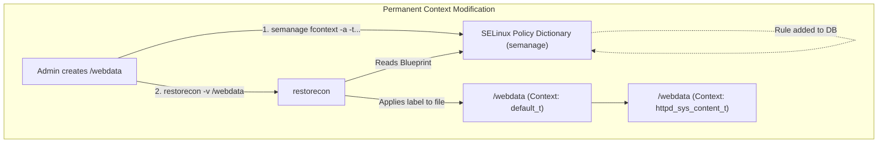
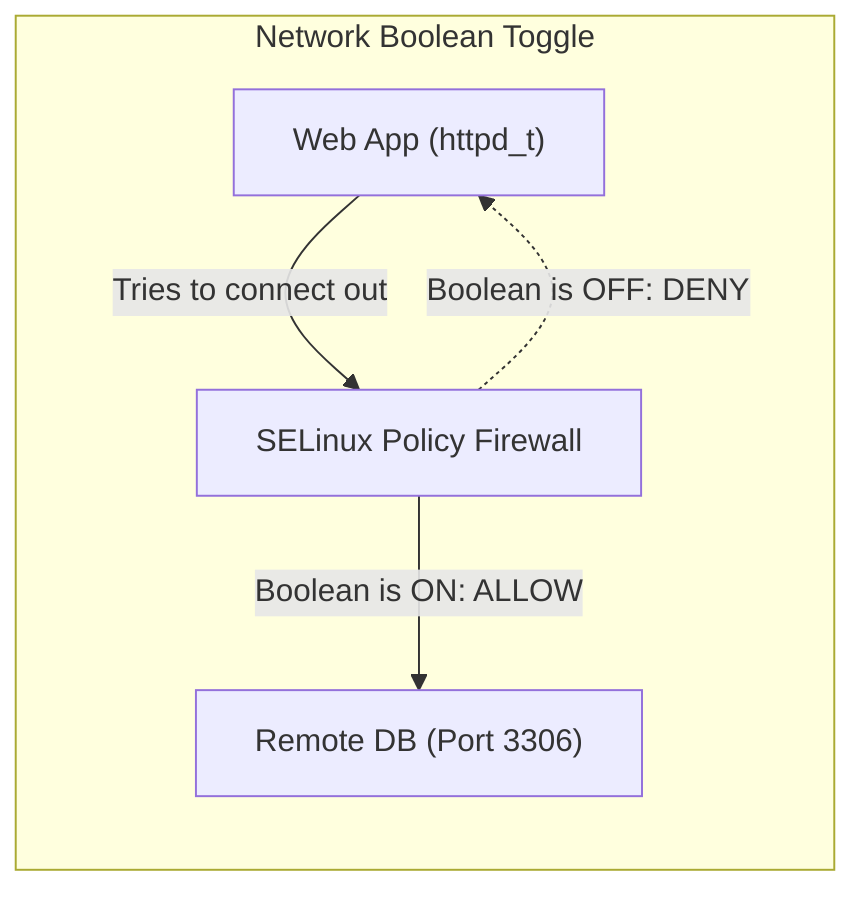
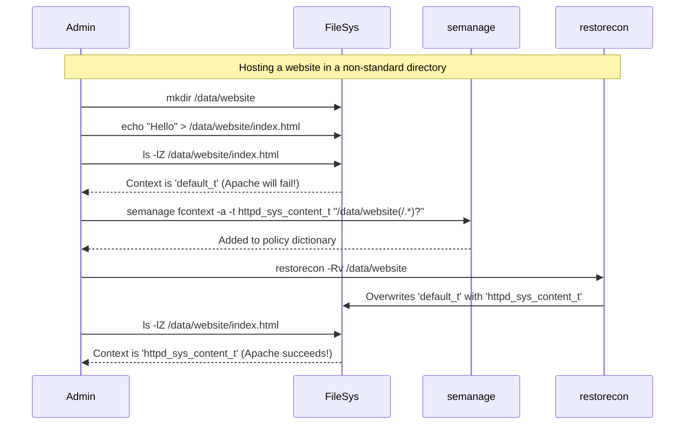

# CHAPTER 50 — SELINUX CONTEXTS AND BOOLEANS

---

## 1. Introduction

### Why This Topic Exists
In the previous chapter, we learned that SELinux blocks actions that violate its policy. But how does SELinux actually know what an action is? It uses labels called **Contexts**. Every single file, directory, network port, and running process on a Linux system is tagged with an invisible SELinux Context label. When a labeled process tries to touch a labeled file, SELinux compares the two labels against its policy rulebook. If the rulebook says "No", access is denied.

### Why Linux Administrators Use It
When an administrator moves a website directory from `/home/user/website` to `/var/www/html`, the web server will suddenly fail with a "Permission Denied" error. The administrator must use tools like `chcon` or `restorecon` to change the SELinux label on the website files so the web server is allowed to read them. Furthermore, administrators use **Booleans** to toggle complex SELinux rules on or off without having to rewrite the underlying policy code.

### Why Companies Care About It
Operational Security. A developer might request that SELinux be disabled because their web app needs to connect to a remote database, and SELinux is blocking it. Instead of compromising the entire server's security by disabling SELinux, a trained administrator simply flips a single SELinux Boolean (`httpd_can_network_connect = on`). The server remains completely secure, and the developer's app works perfectly.

---

## 2. Learning Objectives

By the end of this chapter, you will be able to:
- View SELinux contexts on files and processes using the `-Z` flag.
- Understand the anatomy of a context string (`user:role:type:level`).
- Temporarily change a file's context using `chcon`.
- Permanently change a file's context using `semanage fcontext` and `restorecon`.
- List and toggle SELinux Booleans using `getsebool` and `setsebool`.

---

## 3. Beginner-Friendly Explanation

Imagine a hospital where every person and every door has a color-coded sticker:
- **The Process Context (The Doctor):** Dr. Smith has a **BLUE** sticker on her ID badge (`httpd_t`).
- **The File Context (The Door):** The Patient Ward door has a **BLUE** sticker (`httpd_sys_content_t`). The Pharmacy door has a **RED** sticker (`shadow_t`).
- **The Policy Rulebook:** The hospital rules state: "People with BLUE stickers can only open doors with BLUE stickers."
- **The Problem:** Dr. Smith buys a new filing cabinet for her office. Because it came from the outside world, it has a **GREY** sticker (`default_t`). When she tries to open it, the hospital security guard (SELinux) tackles her, because BLUE cannot open GREY.
- **The Solution:** The administrator uses a tool (`restorecon`) to peel off the GREY sticker and slap a BLUE sticker on the cabinet. Now, Dr. Smith can open it.

---

## 4. Core Theory

### 4.1 The Context String
When you view an SELinux label, it looks like a long string of text separated by colons:
`unconfined_u:object_r:httpd_sys_content_t:s0`
There are 4 parts:
1. **User (`unconfined_u`):** The SELinux user identity (rarely changed in standard admin).
2. **Role (`object_r`):** What role the object plays (process vs file).
3. **Type (`httpd_sys_content_t`):** **This is the most critical part.** The Type defines the actual permission group. 99% of your time will be spent manipulating the Type. Types always end in `_t`.
4. **Level (`s0`):** Multi-Level Security (MLS) sensitivity (used in Top Secret government systems, usually ignored in standard enterprise).

### 4.2 Changing Contexts: `chcon` vs `restorecon`
- **`chcon` (Change Context):** Slaps a new sticker on a file immediately. **WARNING:** This is temporary. If the system reboots or the filesystem is relabeled, the sticker falls off and reverts to the default.
- **`semanage fcontext` + `restorecon`:** The professional way. You use `semanage` to update the master blueprint (the policy database) saying, "This directory should *always* have the BLUE sticker." Then you run `restorecon`, which looks at the blueprint and applies the sticker permanently.

### 4.3 SELinux Booleans
Writing raw SELinux policy code is incredibly difficult. To make life easier, the developers created "Booleans"—simple On/Off switches for common scenarios.
For example, by default, a web server is not allowed to read files in a user's home directory. If you want to host personal web pages (`~user/public_html`), you don't need to write custom policy. You just flip the Boolean `httpd_enable_homedirs` to `on`.

---

## 5. Internal Working

### How `restorecon` Knows the Defaults
The SELinux policy contains a massive dictionary of Regular Expressions mapping file paths to Context Types. 
For example, the dictionary contains a rule: `^/var/www(/.*)?  -->  httpd_sys_content_t`.
When you run `restorecon -R /var/www/`, the tool scans the directory, checks the dictionary, sees that everything in `/var/www` is *supposed* to be `httpd_sys_content_t`, and forcefully overwrites the labels to match the dictionary.

---

## 6. Production Architecture



---

## 7. Command-by-Command Explanation

### 7.1 `ls -lZ`
- **Purpose:** The `-Z` flag lists files and shows their SELinux contexts alongside the standard `rwx` permissions.

### 7.2 `ps -eZ`
- **Purpose:** Shows the SELinux context of every running process.

### 7.3 `chcon -t httpd_sys_content_t /webdata/index.html`
- **Purpose:** Temporarily changes the Type (`-t`) of a file. Good for quick testing.

### 7.4 `semanage fcontext -a -t httpd_sys_content_t "/webdata(/.*)?"`
- **Purpose:** Adds (`-a`) a new rule to the permanent SELinux dictionary for the `/webdata` directory and all its contents (using a Regular Expression).

### 7.5 `restorecon -Rv /webdata`
- **Purpose:** Restores the contexts of a directory Recursively (`-R`) and Verbosely (`-v` prints what was changed). It forces the files to match the permanent dictionary.

### 7.6 `getsebool -a`
- **Purpose:** Lists all available SELinux Booleans and their current On/Off status.

### 7.7 `setsebool -P httpd_can_network_connect on`
- **Purpose:** Toggles a Boolean. The `-P` flag makes the change Permanent across reboots.

---

## 8. Syntax Breakdown

```bash
semanage fcontext -a -t httpd_sys_content_t "/customweb(/.*)?"
│        │        │  │  │                   │
│        │        │  │  │                   └── RegEx: The directory and everything inside it
│        │        │  │  └────────────────────── The Type label we want to assign
│        │        │  └───────────────────────── Target the Type field
│        │        └──────────────────────────── Action: Add a rule
│        └───────────────────────────────────── Object: File Contexts
└────────────────────────────────────────────── Command: SELinux Management Tool
```
*(After this command, you MUST run `restorecon` to apply the rule!)*

---

## 9. Parameter Explanation

| Command | Parameter | Description |
|:---|:---|:---|
| `ls` | `-Z` | Prints the SELinux security context. |
| `ps` | `-Z` | Prints the SELinux security context of processes. |
| `netstat` / `ss` | `-Z` | Prints the SELinux context of a network socket. |
| `restorecon` | `-R` | Recursive (apply to all files inside the directory). |
| `restorecon` | `-v` | Verbose (show exactly which files had their labels changed). |
| `setsebool` | `-P` | Make the boolean change Persistent (writes to disk). Without `-P`, it is lost on reboot. |

---

## 10. Sample Output Analysis

**Scenario:** We investigate why the web server cannot read a newly created file.
**Command:** `ls -lZ /var/www/html/`

**Output:**
```text
-rw-r--r--. root root unconfined_u:object_r:httpd_sys_content_t:s0 index.html
-rw-r--r--. root root unconfined_u:object_r:admin_home_t:s0        new_page.html
```

**Analysis:**
- **index.html:** Has the `httpd_sys_content_t` type. The Apache web server is allowed to read this. It works perfectly.
- **new_page.html:** Has the `admin_home_t` type. The Apache web server is explicitly forbidden from reading files owned by administrator home directories. 
- **The Story:** The administrator created `new_page.html` in their `/root` home folder, and then used the `mv` command to move it to `/var/www/html`. When you use `mv`, the file *retains its original SELinux context*. (If they had used `cp`, the file would have inherited the correct context of the destination folder).
- **The Fix:** Run `restorecon -v /var/www/html/new_page.html` to fix the sticker.

---

## 11. Architecture Diagram


*Web servers are frequently hacked. By default, SELinux prevents them from acting as clients to connect out to the internet or other servers. If your web app genuinely needs to talk to an external API or Database, you must flip `httpd_can_network_connect = on`.*

---

## 12. Workflow Diagram



---

## 13. Real Production Examples

### Finding the Right Boolean
An administrator sets up a Samba (SMB) file sharing server. They want users to be able to share files directly out of their `/home` directories. The administrator knows SELinux is blocking it, but doesn't know the exact boolean name.
```bash
# Search for booleans related to samba
getsebool -a | grep samba

# Output shows:
# samba_enable_home_dirs --> off
# samba_export_all_rw --> off

# The admin toggles the correct boolean permanently
sudo setsebool -P samba_enable_home_dirs on
```

### The `mv` vs `cp` Trap
A junior developer downloads a critical config file to their `/tmp` directory (Context: `user_tmp_t`). They use `mv` to move it to `/etc/nginx/conf.d/`. Nginx crashes on startup with "Permission Denied".
The senior admin knows that `mv` moves the file but preserves the old `user_tmp_t` label. If the junior developer had used `cp`, the file would have automatically inherited the correct `httpd_config_t` label from the `/etc/nginx` folder.
The senior admin fixes it instantly: `restorecon -v /etc/nginx/conf.d/config.conf`.

---

## 14. Common Mistakes

1. **Using `chcon` instead of `semanage`** — A tutorial online tells you to fix a permission issue by running `chcon -t httpd_sys_content_t /var/custom/file.txt`. You run it. It works. Three months later, the system runs an automatic filesystem relabeling cron job (or reboot), the context reverts to the default, and the website crashes in the middle of the night. Never use `chcon` in production. Always update the dictionary with `semanage` and use `restorecon`.
2. **Forgetting `-P` on `setsebool`** — You fix a broken database connection by running `setsebool httpd_can_network_connect on`. It works. The server reboots a week later. The boolean resets to `off` because you forgot the `-P` (Permanent) flag. The database breaks again.
3. **Getting intimidated by the Regex** — The `(/.*)?` syntax at the end of the `semanage` command looks terrifying, but it simply means "Apply this rule to the directory itself, and (optionally) everything recursively inside it." Memorize this pattern.

---

## 15. Best Practices

- Always use the `-v` (verbose) flag with `restorecon`. If you run it on a folder with 10,000 files, it will remain completely silent. If you use `-v`, it prints out every single file that was actually fixed, proving that your `semanage` dictionary rule worked correctly.
- Use `man -k selinux` or install the `selinux-policy-devel` tools. Many services have built-in man pages specifically explaining their SELinux booleans (e.g., `man httpd_selinux`).

---

## 16. Security Considerations

- **The `_rw_` Types:** By default, Apache can read `httpd_sys_content_t`. But it cannot *write* to it (to prevent hackers from defacing the website). If your web app has an upload folder (like Wordpress uploads), you must explicitly label that specific folder as `httpd_sys_rw_content_t`. This grants write access ONLY to that one folder, containing the damage if the web app is compromised.

---

## 17. Performance Considerations

- **Massive Relabels:** Running `restorecon -R /` on a live production server with terabytes of data will cause massive disk I/O spikes as the system reads and checks the extended attributes (labels) of millions of files. It can severely slow down the server. Only run `restorecon` on the specific directories you modified.

---

## 18. Troubleshooting Guide

| Symptom | Root Cause | Resolution |
|:---|:---|:---|
| File moved, now app is denied | `mv` preserves old contexts | Run `restorecon -v <file>` |
| App cannot connect to remote IP | Boolean is off | `setsebool -P httpd_can_network_connect 1` |
| Cannot find `semanage` command | Tool not installed | `dnf install policycoreutils-python-utils` |
| `chcon` changes disappear on reboot | `chcon` is temporary | Use `semanage fcontext` and `restorecon` |

---

## 19. Practical Labs

**Lab 50.1:** Contexts and `mv` vs `cp`
1. `touch /tmp/test1.txt`
2. `touch /tmp/test2.txt`
3. `sudo cp /tmp/test1.txt /var/www/html/` (Copy it)
4. `sudo mv /tmp/test2.txt /var/www/html/` (Move it)
5. `ls -lZ /var/www/html/`
6. Notice `test1` automatically inherited the correct web context. `test2` kept its broken `user_tmp_t` context.
7. `sudo restorecon -v /var/www/html/test2.txt` (Watch it fix the label).

**Lab 50.2:** Booleans
1. `getsebool -a | grep ftp` (View FTP booleans)
2. `sudo setsebool -P ftpd_anon_write on` (Allow anonymous FTP writes permanently)
3. `getsebool -a | grep ftp` (Verify it flipped to 'on')

---

## 20. Mini Project

Hosting from a Custom Directory.
You want to store your website on a massive secondary drive mounted at `/data/www`.
1. `sudo mkdir -p /data/www`
2. `sudo echo "Custom Site" > /data/www/index.html`
3. Check the context: `ls -lZ /data/www`. It is `default_t`. Apache will fail to read it.
4. Update the policy blueprint:
   `sudo semanage fcontext -a -t httpd_sys_content_t "/data/www(/.*)?"`
5. Apply the blueprint:
   `sudo restorecon -Rv /data/www`
6. Check the context again: `ls -lZ /data/www`. It is now `httpd_sys_content_t`. Apache will now serve the site successfully while SELinux remains strictly Enforcing.

---

## 21. Assignments

1. What command switch is universally used in Linux (with `ls`, `ps`, `ss`) to display SELinux contexts?
2. Explain why using the `mv` command to place files in a web directory often causes SELinux "Permission Denied" errors, while using `cp` does not.
3. Why should you avoid using `chcon` in a production environment?

---

## 22. Interview Questions

### Basic
1. **Q: You want to see the SELinux contexts of all files in a directory. What command do you use?**
   A: `ls -lZ` (or `ls -Z`).

2. **Q: What command lists all available SELinux Booleans and their statuses?**
   A: `getsebool -a`

### Intermediate
3. **Q: A developer wrote a script that requires Apache to connect to an external API over the internet. SELinux is blocking it. You want to fix it without disabling SELinux and without writing custom policy code. How do you do this?**
   A: I would look for the appropriate SELinux Boolean. Specifically, I would run `setsebool -P httpd_can_network_connect on`. This safely allows Apache to make outbound network connections while keeping all other SELinux protections Enforcing.

4. **Q: You use `chcon` to change a file's SELinux context so an application can read it. A month later, the server reboots, and the application fails because the context reverted. What is the correct, permanent way to change a file's context?**
   A: `chcon` is only temporary. To make it permanent, I must use `semanage fcontext -a -t <type> <file_path_regex>` to update the system's policy database, and then run `restorecon -v <file>` to apply the context. This guarantees the context will survive reboots and filesystem relabels.

### Scenario-Based
5. **Q: You have created a brand new directory `/u01/app/oracle` for a database installation. The installer fails with SELinux denials. You look at the default context of `/u01/app/oracle` and see it is `default_t`. You want to change it to `oracle_db_t`. Write the exact two commands required to make this change recursively and permanently.**
   A: 
   1. `sudo semanage fcontext -a -t oracle_db_t "/u01/app/oracle(/.*)?"`
   2. `sudo restorecon -Rv /u01/app/oracle`

---

## 23. Chapter Summary and Quick Revision Notes

- **Context String:** `user:role:type:level`. The **Type** (`_t`) is the most important part.
- **`-Z` flag:** Displays contexts in standard commands (`ls -Z`, `ps -Z`).
- **`mv` vs `cp`:** `mv` retains old contexts (causes errors). `cp` inherits new destination contexts.
- **`chcon`:** Temporary context change (Avoid in production).
- **`semanage fcontext`:** Updates the permanent policy dictionary.
- **`restorecon`:** Restores file labels to match the permanent policy dictionary.
- **Booleans:** Simple On/Off switches for complex SELinux rules.
- **`setsebool -P`:** Make the boolean toggle Permanent.

---

## 24. Cheat Sheet

| Command | Purpose |
|:---|:---|
| `ls -lZ` | View file contexts |
| `ps -eZ` | View process contexts |
| `chcon -t httpd_sys_content_t <file>`| Temporarily change context |
| `semanage fcontext -a -t <type> "<path>(/.*)?"` | Add permanent context rule |
| `restorecon -Rv <path>` | Apply permanent context rules |
| `getsebool -a` | List all booleans |
| `setsebool -P <boolean> on` | Toggle a boolean permanently |
