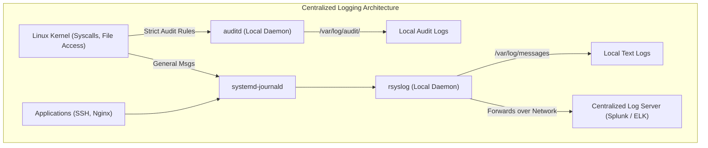
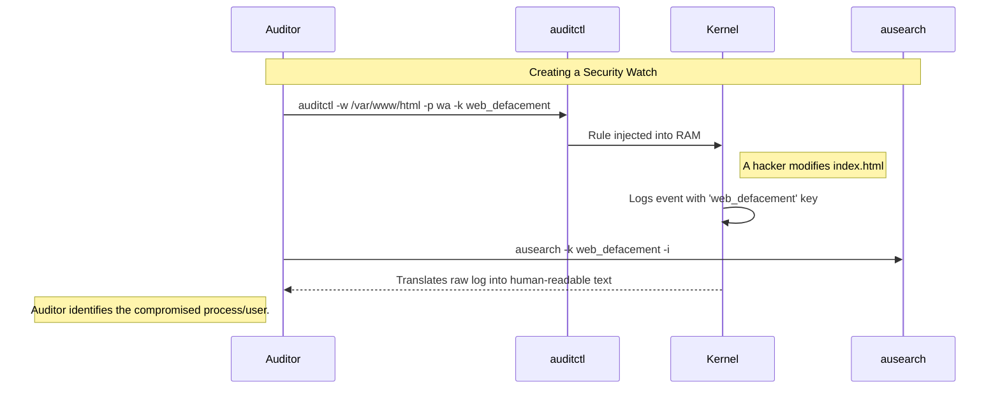

# CHAPTER 51 — AUDITING (AUDITD) AND LOGGING (RSYSLOG)

---

## 1. Introduction

### Why This Topic Exists
A server is a black box. If an application crashes, or if a hacker successfully breaches the system, how do you know what happened? You look at the logs. Linux has two entirely separate, highly robust systems for recording events: 
1. **rsyslog:** The standard system logger (records informational messages, errors, and application output).
2. **auditd:** The kernel-level security auditor (records strictly formatted, undeniable proof of security events for compliance).

### Why Linux Administrators Use It
Administrators use `rsyslog` to troubleshoot everyday problems (e.g., "Why did the web server fail to start?"). They use `auditd` to answer complex security questions (e.g., "Exactly which user deleted `/etc/passwd` on Tuesday at 4:00 AM, and what command did they type to do it?").

### Why Companies Care About It
Compliance, Forensics, and Non-Repudiation. If a company processes credit cards (PCI-DSS) or healthcare data (HIPAA), it is a federal requirement to log every single time an administrator touches a sensitive file. `auditd` provides a tamper-evident trail of breadcrumbs. If a data breach occurs, cybersecurity forensics teams rely entirely on these logs to figure out how the hackers got in, what data they stole, and how to stop them next time.

---

## 2. Learning Objectives

By the end of this chapter, you will be able to:
- Understand the difference between standard logging (`rsyslog`) and security auditing (`auditd`).
- View and parse system logs using `/var/log/messages` and `journalctl`.
- Configure `auditd` rules to monitor specific files for unauthorized access or modification.
- Search the audit logs efficiently using `ausearch`.
- Generate security compliance reports using `aureport`.

---

## 3. Beginner-Friendly Explanation

Think of a busy bank:
- **`rsyslog` (The Bank Manager's Journal):** The manager writes down general notes. "The AC broke today at noon." "Alice was late for work." "The vault door creaked when it opened." It's great for general troubleshooting.
- **`auditd` (The Security Cameras):** The cameras don't care about the AC. They are hardwired into the vault. If *anyone* touches the vault, the camera records exactly who it was, what time it was, and what they touched. The cameras cannot be turned off, and their footage is stored in a reinforced safe for the police (Auditors) to review later.

---

## 4. Core Theory

### 4.1 System Logging (`rsyslog` and `journald`)
Modern Linux uses `systemd-journald` to collect logs in a binary format (viewed with `journalctl`). However, most enterprise systems also forward these logs to `rsyslog` (the traditional daemon), which sorts the logs and writes them into plain-text files in `/var/log/`.
- `/var/log/messages` (or `syslog`): The main bucket for almost all system events.
- `/var/log/secure` (or `auth.log`): Strictly authentication events (SSH logins, sudo usage).

### 4.2 The Audit Daemon (`auditd`)
`auditd` does not rely on applications voluntarily sending it log messages. It hooks directly into the Linux Kernel. You can tell the kernel: "Tell me every time ANY user runs the `chmod` command," or "Tell me if ANY user reads the `/etc/shadow` file." Because it sits in the kernel, a hacker cannot easily bypass it.

### 4.3 Log Rotation
Logs grow infinitely. If left unchecked, `/var/log/messages` will eventually consume 100% of the hard drive, crashing the server. The `logrotate` utility runs daily via `cron` to compress old logs (e.g., `messages.1.gz`) and delete logs older than a specific timeframe (e.g., 4 weeks), keeping the disk from filling up.

---

## 5. Internal Working

### Syslog Facilities and Severities
`rsyslog` sorts incoming messages based on two tags:
- **Facility (Who sent it):** e.g., `auth`, `cron`, `mail`, `kern`.
- **Severity (How bad is it):** e.g., `debug` (0), `info` (1), `warning` (4), `err` (3), `emerg` (7 - System is unusable).
An admin can configure `/etc/rsyslog.conf` with a rule like: `mail.err /var/log/mail_errors.log`. This tells the daemon: "If the mail server sends an error-level message, write it to this specific file."

---

## 6. Production Architecture


*In enterprise, logs are immediately forwarded to a remote server. If a hacker wipes the local hard drive to hide their tracks, the evidence is already safely secured on the central server.*

---

## 7. Command-by-Command Explanation

### 7.1 `journalctl -u sshd --since "1 hour ago"`
- **Purpose:** Views the binary systemd journal, filtering specifically for the SSH daemon, showing only events from the last hour.

### 7.2 `auditctl -w /etc/shadow -p wa -k shadow_monitor`
- **Purpose:** Adds a temporary rule to the live kernel. 
  - `-w /etc/shadow`: Watch this specific file.
  - `-p wa`: Only alert me if someone tries to **w**rite to it or change its **a**ttributes (permissions). (Don't alert on reads).
  - `-k shadow_monitor`: A custom key/tag so you can easily search for these specific alerts later.

### 7.3 `ausearch -k shadow_monitor`
- **Purpose:** Searches the massive, cryptic `/var/log/audit/audit.log` file specifically for the key you created in the rule above.

### 7.4 `aureport --tty`
- **Purpose:** Generates a human-readable report. (This specific flag reports on keystroke logging, if enabled). Other flags include `--auth` (authentication report) or `--file` (file access report).

---

## 8. Syntax Breakdown

**Audit Rules File (`/etc/audit/rules.d/audit.rules`)**

```bash
-w /etc/passwd -p wa -k passwd_changes
│  │           │  │  │  │
│  │           │  │  │  └── The custom search key
│  │           │  │  └───── Key flag
│  │           │  └──────── Watch for: Write (w), Attribute change (a)
│  │           └─────────── Permissions flag
│  └─────────────────────── The path to the file/directory to watch
└────────────────────────── Watch flag
```
*(Rules placed in this file become permanent across reboots).*

---

## 9. Parameter Explanation

| Command | Parameter | Description |
|:---|:---|:---|
| `journalctl` | `-f` | "Follow". Tails the log live, printing new lines as they happen. |
| `auditctl` | `-l` | List all currently active audit rules loaded in the kernel. |
| `auditctl` | `-D` | Delete all currently active rules from the live kernel. |
| `ausearch` | `-m USER_LOGIN` | Search specifically for a message type (e.g., successful or failed user logins). |

---

## 10. Sample Output Analysis

**Scenario:** We added a watch on `/etc/shadow`. We then use `ausearch -k shadow_monitor` after an incident.

**Output:**
```text
----
time->Sun Oct 24 14:32:11 2026
type=PROCTITLE msg=audit(1698165131.450:234): proctitle=7669202F6574632F736861646F77
type=PATH msg=audit(1698165131.450:234): item=0 name="/etc/shadow" inode=16777328 dev=fd:00 mode=0100000 ouid=0 ogid=0 rdev=00:00 obj=system_u:object_r:shadow_t:s0 nametype=NORMAL cap_fp=0 cap_fi=0 cap_fe=0 cap_fver=0 cap_frootid=0
type=SYSCALL msg=audit(1698165131.450:234): arch=c000003e syscall=257 success=yes exit=3 a0=ffffff9c a1=5623f9b1c7a0 a2=80000 a3=0 items=1 ppid=1543 pid=2102 auid=1000 uid=0 gid=0 euid=0 suid=0 fsuid=0 egid=0 sgid=0 fsgid=0 tty=pts0 ses=3 comm="vi" exe="/usr/bin/vi" subj=unconfined_u:unconfined_r:unconfined_t:s0-s0:c0.c1023 key="shadow_monitor"
```

**Analysis (How to read this nightmare):**
- *Audit logs are intentionally machine-readable and difficult for humans.* Look at the `type=SYSCALL` line.
- **auid=1000:** The "Audit User ID". This is the most important field. Even if the user ran `sudo su -` to become `root` (uid=0), the `auid` permanently tracks their *original* login ID (1000, usually the first admin account). They cannot hide their true identity.
- **exe="/usr/bin/vi" / comm="vi":** The exact command they ran. They opened the file in the `vi` text editor.
- **success=yes:** The kernel allowed the write to happen.
- **key="shadow_monitor":** The tag that triggered this log entry.
- *Conclusion:* The admin with User ID 1000 used `vi` to successfully edit the shadow password file.

---

## 11. Architecture Diagram

```mermaid
graph LR
    subgraph Tracking the Hacker (auid)
        User["Hacker (Logs in as 'bob', UID 1005)"]
        Elevate["Runs: sudo su - (Becomes UID 0)"]
        Action["Deletes /etc/important.conf"]
        Audit["Auditd Log Entry"]
        
        User -->|auid=1005| Elevate
        Elevate -->|uid=0, auid=1005| Action
        Action --> Audit
        Audit -.->|Forensics team reads log| Result["Hacker identified as 'bob' (1005)"]
    end
```
*The `auid` (Audit UID) is immutable. Once a session starts, it cannot be changed, making it impossible for a rogue administrator to hide behind the anonymous `root` account.*

---

## 12. Workflow Diagram



---

## 13. Real Production Examples

### The "Who Restarted It?" Mystery
A critical database keeps restarting at random times. Standard logs just say "Shutting down". The admin wants to know *who* is typing the command to restart it.
They add an audit rule to watch the systemctl command:
```bash
sudo auditctl -w /usr/bin/systemctl -p x -k service_restarts
```
*(The `-p x` means watch for e**X**ecution of the binary).*
The next time the database restarts, the admin runs `ausearch -k service_restarts -i` and discovers that a Junior Admin's automation script is triggering at the wrong time.

### Centralized Logging (`rsyslog.conf`)
An enterprise company requires all SSH login attempts (Facility: `authpriv`) to be sent to a central security server (`10.0.50.100`) so they can be fed into Splunk.
The admin edits `/etc/rsyslog.conf` on the local server:
```text
# Add this line to forward auth logs over UDP (@) or TCP (@@)
authpriv.*    @10.0.50.100:514
```
They run `systemctl restart rsyslog`. Now, every time someone tries to log in, the local server instantly shoots a copy of the log across the network.

---

## 14. Common Mistakes

1. **Watching highly active directories** — If you run `auditctl -w /tmp -p rwa`, you are telling the kernel to log every single time any process reads or writes a temporary file. Within 10 minutes, the server will generate gigabytes of logs, maxing out the CPU and completely filling the hard drive, causing a catastrophic server crash. Be extremely specific with your rules.
2. **Reading raw audit logs manually** — Running `cat /var/log/audit/audit.log` is a recipe for a headache. The timestamps are in Epoch time (seconds since 1970). The user IDs are numbers. Always use `ausearch -i` (the `-i` flag means "Interpret"). It automatically translates Epoch time into standard dates and User IDs into Usernames.
3. **Forgetting to make audit rules permanent** — `auditctl` only applies rules to live RAM. They vanish on reboot. To make them permanent, you must save them in `/etc/audit/rules.d/`.

---

## 15. Best Practices

- Standardize on `journalctl`. While `/var/log/messages` is comfortable, `journalctl` allows powerful filtering. For example, `journalctl -p err` instantly filters the noise and shows you only severe system errors.
- Lock down the `/var/log/audit/` directory. By default, only root can read it. Never change these permissions. If a hacker gains standard user access, you don't want them to be able to read the audit rules to figure out what you are watching.

---

## 16. Security Considerations

- **Log Tampering:** If a hacker gains `root` access, the very first thing they do is `rm -rf /var/log/messages` to delete the evidence of how they broke in. This is why forwarding logs via `rsyslog` to a centralized, write-only logging server is critical. They can delete the local logs, but the remote logs are safely out of their reach.

---

## 17. Performance Considerations

- **Auditd Overhead:** Every active `auditd` rule requires the kernel to perform an extra mathematical check on every single system call. If you have 500 audit rules, you will noticeably degrade the performance of the entire server. Only audit critical files (`/etc/passwd`, `/etc/shadow`, `/etc/sudoers`) and critical binaries.

---

## 18. Troubleshooting Guide

| Symptom | Root Cause | Resolution |
|:---|:---|:---|
| `/var/log/` is 100% full | Logrotate is broken or stopped | Run `logrotate -f /etc/logrotate.conf` to force compression |
| No logs arriving at central server | Firewall blocking port 514 | Open UDP/TCP 514 on the receiving server |
| Audit rule not triggering | Rule syntax incorrect | Use `auditctl -l` to verify the rule is actually loaded in RAM |
| `ausearch` output is unreadable | Missing interpret flag | Add `-i` to translate data into human text |

---

## 19. Practical Labs

**Lab 51.1:** Filtering with Journalctl
```bash
# Show logs since boot
journalctl -b
# Show only errors
journalctl -p err
# Show logs for a specific service
journalctl -u NetworkManager
```

**Lab 51.2:** Creating an Audit Watch
1. Create a fake critical file: `sudo touch /etc/topsecret.txt`
2. Add a watch to the live kernel:
   `sudo auditctl -w /etc/topsecret.txt -p wa -k secret_watch`
3. Verify it is loaded: `sudo auditctl -l`
4. Trigger the watch (write to the file):
   `sudo bash -c 'echo "hacked" > /etc/topsecret.txt'`
5. Search the logs (interpreted for humans):
   `sudo ausearch -k secret_watch -i`
6. Clean up (delete all rules): `sudo auditctl -D`

---

## 20. Mini Project

The Authentication Report.
You are tasked with generating a report of all failed and successful logins for the security team over the last week.
1. Instead of reading `/var/log/secure` line by line, use `aureport`.
2. Generate an authentication summary:
   `sudo aureport --auth`
3. Note the output. It lists the Date, Time, User, Terminal (SSH), Host IP, and whether the login succeeded (yes/no).
4. Generate a summary of just the failed logins:
   `sudo aureport --auth --failed`
5. This tool instantly satisfies compliance auditors without requiring complex `grep` or `awk` scripts.

---

## 21. Assignments

1. Why is `auditd` considered more secure and authoritative than `rsyslog`?
2. What is the significance of the `auid` (Audit User ID) in an audit log entry?
3. What flag must you pass to `ausearch` so that you can actually read the timestamps and usernames?

---

## 22. Interview Questions

### Basic
1. **Q: You want to see the live, real-time log output of a specific service (like sshd). What command do you use?**
   A: `journalctl -u sshd -f` (The `-f` flag follows the log live).

2. **Q: What daemon is responsible for ensuring `/var/log/messages` doesn't grow infinitely and fill up the hard drive?**
   A: `logrotate` (Usually run as a daily cron job).

### Intermediate
3. **Q: You suspect a junior administrator is tampering with the `/etc/sudoers` file. How do you configure the system to definitively prove if they modify it?**
   A: I would use `auditd`. I would add a rule: `auditctl -w /etc/sudoers -p wa -k sudoers_tamper`. This tells the kernel to monitor the file for writes or attribute changes. If the junior admin modifies the file, I can run `ausearch -k sudoers_tamper -i` to see the exact time, the command used, and their immutable `auid`.

4. **Q: A hacker gains root access to your server. They immediately run `rm -rf /var/log/*` and `auditctl -D` to wipe all logs and stop auditing. How could you have designed your architecture to ensure you still have forensics data to investigate the breach?**
   A: By implementing Centralized Logging. I would configure `rsyslog` (or a modern agent like Filebeat) to instantly forward all logs over the network to a remote, highly secure log aggregation server (like Splunk or ELK). Even if the hacker destroys the local evidence, the logs detailing *how* they broke in are already safely off-server.

### Scenario-Based
5. **Q: You are investigating a data breach. You see a critical file was deleted. The audit log shows the `uid` (User ID) is 0 (Root). The junior admins claim a hacker must have broken into the root account directly. You look closer at the audit log and see `auid=1003`. What does this prove?**
   A: It proves the hacker did NOT break into the root account directly. The `auid` (Audit UID) tracks the original user who authenticated to the system, before any privilege escalation. User 1003 logged into the server, and then used `sudo` or `su` to become root (`uid=0`) to delete the file. I would check `/etc/passwd` to see which employee or service account owns UID 1003, as that is the compromised account.

---

## 23. Chapter Summary and Quick Revision Notes

- **`rsyslog` / `journalctl`:** General system and application logging. Good for troubleshooting.
- **`auditd`:** Kernel-level security auditing. Good for compliance and forensics.
- **`auditctl`:** Injects temporary rules into the live kernel.
- **`ausearch`:** Searches the audit logs (Always use `-i` to interpret the data!).
- **`aureport`:** Generates formatted summaries for compliance audits.
- **`auid` (Audit UID):** The immutable ID that tracks the original user, bypassing `sudo` obfuscation.
- **Log Forwarding:** Essential for security. Protects logs if the local server is wiped.

---

## 24. Cheat Sheet

| Command | Purpose |
|:---|:---|
| `journalctl -p err` | View only severe system errors |
| `journalctl -u nginx -f` | Tail the Nginx logs live |
| `auditctl -w /etc/shadow -p wa -k shadow`| Watch shadow file for writes |
| `auditctl -l` | List active audit rules |
| `ausearch -k shadow -i` | Search audit logs for specific key (human readable) |
| `aureport --auth --failed` | Summary of failed logins |
