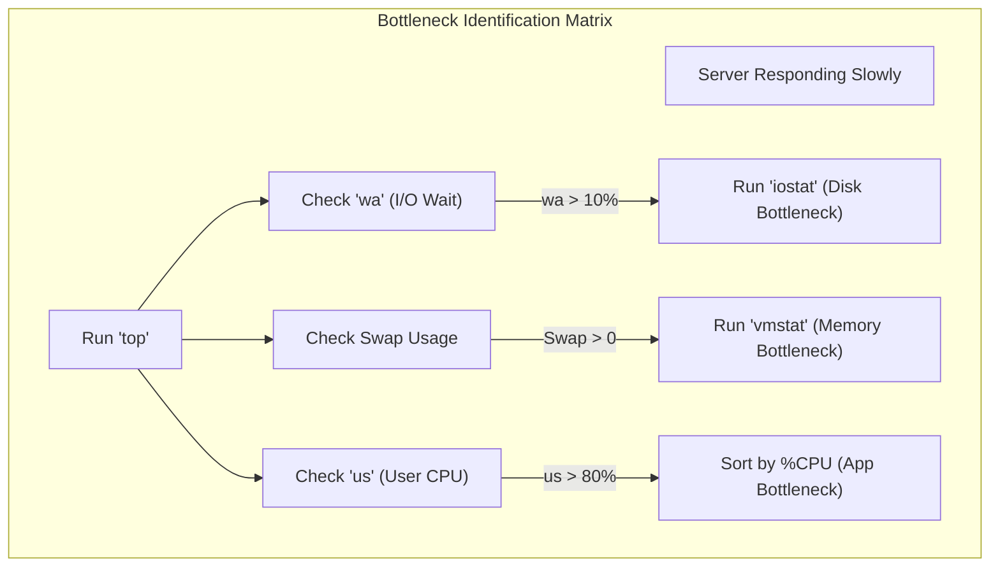
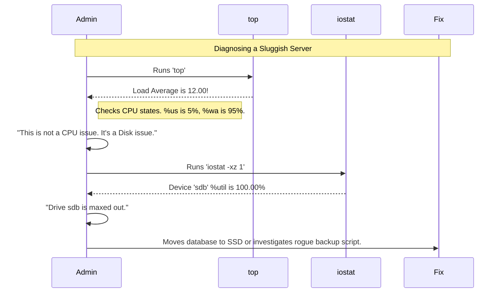

# CHAPTER 53 — PERFORMANCE MONITORING (TOP, HTOP, VMSTAT, IOSTAT)

---

## 1. Introduction

### Why This Topic Exists
A Linux server has four primary finite resources: CPU, Memory (RAM), Disk I/O (Input/Output), and Network Bandwidth. When an application runs poorly or a website takes 10 seconds to load, the issue is almost always a bottleneck in one of these four resources. Performance Monitoring is the art of looking at real-time statistics to instantly identify which resource is exhausted and which specific process is responsible for exhausting it.

### Why Linux Administrators Use It
When the alarm monitoring system pages an administrator at 2:00 AM saying "Web Server 04 CPU is at 100%", the administrator logs in and uses tools like `top` or `htop` to identify the rogue process (e.g., a runaway PHP script). They then use `kill` to terminate the process, restoring the server's health before the customers even notice.

### Why Companies Care About It
Cost Optimization and Uptime. If a database server is running slowly, a junior administrator might tell the company, "We need to spend $10,000 on more RAM." A senior administrator uses `iostat` to prove that the RAM is perfectly fine; the actual problem is that the hard drives are too slow to write the data (Disk I/O bottleneck). Proper monitoring saves companies massive amounts of money by ensuring they upgrade the *correct* hardware.

---

## 2. Learning Objectives

By the end of this chapter, you will be able to:
- Read and interpret the Load Average metric.
- Use `top` and `htop` to identify CPU and Memory bottlenecks in real-time.
- Differentiate between User CPU time, System CPU time, and I/O Wait.
- Use `vmstat` to identify memory swapping and system-wide bottlenecks.
- Use `iostat` to diagnose slow hard drives and disk latency.

---

## 3. Beginner-Friendly Explanation

Think of a busy restaurant kitchen:
- **The CPU:** The Head Chef. They can only cook so many meals at a time. If you give them 100 tickets at once, they get overwhelmed (100% CPU Utilization).
- **The RAM (Memory):** The kitchen counter space. The chef needs counter space to chop vegetables. If the counter is 100% full, they have to put vegetables in the freezer, which takes a long time to retrieve later (Swapping/Paging).
- **Disk I/O:** The pantry. If the pantry door is stuck and it takes the chef 5 minutes to get a bag of flour, the chef does nothing but stand there waiting. The Chef isn't busy cooking, they are busy waiting (I/O Wait).
- **Monitoring Tools:** The Kitchen Manager standing in the corner with a stopwatch, figuring out exactly why the food is coming out late.

---

## 4. Core Theory

### 4.1 The Load Average
If you type `uptime` or `top`, you will see three numbers (e.g., `Load average: 1.50, 0.75, 0.25`).
These represent the average number of processes demanding CPU time over the last **1 minute**, **5 minutes**, and **15 minutes**.
- **Rule of Thumb:** A load average of `1.0` per CPU core means the CPU is exactly 100% utilized. 
- If you have a 4-core server, a load average of `4.0` is perfect 100% utilization. A load of `8.0` means the CPU is completely overwhelmed, and half the processes are sitting in a queue waiting their turn.

### 4.2 CPU States (us, sy, id, wa)
Inside `top`, the CPU line shows what the CPU is actually doing:
- **us (User):** Time spent running normal applications (like Nginx or MySQL).
- **sy (System):** Time spent running Linux Kernel tasks (like assigning memory).
- **id (Idle):** Time spent doing absolutely nothing (You want this to be high!).
- **wa (I/O Wait):** *CRITICAL.* Time the CPU spent doing nothing because it was waiting for a slow hard drive to return data. If `wa` is high, your CPU is fine, but your disks are terribly slow.

### 4.3 Memory and Swap
Linux loves to use RAM. If you have 32GB of RAM, Linux will often show 30GB "Used". Do not panic! Linux uses free RAM to cache files from the hard drive (Page Cache) to make the server insanely fast.
The real danger is **Swap**. If the server actually runs out of RAM for applications, it starts using the hard drive as fake RAM (Swap). Because hard drives are 100,000 times slower than RAM, the server will grind to an absolute halt.

---

## 5. Internal Working

### How `top` gets its data
Monitoring tools do not perform magic. They simply read text files that the Linux Kernel constantly updates in RAM. Specifically, they read the `/proc/` virtual filesystem. If you run `cat /proc/meminfo`, you will see the exact raw text data that `top` parses and colors to show you memory usage.

---

## 6. Production Architecture



---

## 7. Command-by-Command Explanation

### 7.1 `top`
- **Purpose:** The universal standard. Displays a real-time, constantly updating list of processes, sorted by CPU usage. Press `M` to sort by Memory. Press `q` to quit.

### 7.2 `htop`
- **Purpose:** A modern, colorful, interactive replacement for `top`. It allows you to scroll horizontally/vertically, click with a mouse, and visually see CPU bars. (Often requires `dnf install htop`).

### 7.3 `vmstat 1`
- **Purpose:** Virtual Memory Statistics. The `1` means "print a new line every 1 second". It is the best tool for spotting if your server is actively swapping to disk right now.

### 7.4 `iostat -xz 1`
- **Purpose:** Input/Output Statistics. Shows the exact read/write speed of every hard drive on the server.
  - `-x`: Extended statistics (shows the crucial `%util` column).
  - `-z`: Omits disks that are currently idle, cleaning up the output.

### 7.5 `free -h`
- **Purpose:** A simple snapshot of current RAM and Swap usage in Human-readable format (MB/GB).

---

## 8. Syntax Breakdown

**Reading the Output of `free -h`**

```text
              total        used        free      shared  buff/cache   available
Mem:           31Gi       2.0Gi       1.0Gi        10Mi        28Gi        28Gi
Swap:         4.0Gi          0B       4.0Gi
│               │           │           │                     │             │
│               │           │           │                     │             └── The REAL amount of RAM available for new apps
│               │           │           │                     └── RAM used by the Kernel to cache files (Can be dumped instantly)
│               │           │           └── RAM that is completely empty
│               │           └── RAM actively used by applications
│               └── The total physical hardware RAM installed
└────────────────── If the "used" Swap is above 0B, your server ran out of RAM!
```

---

## 9. Parameter Explanation

| Tool | Keyboard Shortcut inside Tool | Description |
|:---|:---|:---|
| `top` | `c` | Toggles the "Command" column to show the full absolute path of the command running, not just the short name. |
| `top` | `k` | Kills a process. It prompts you for the PID (Process ID). Type the PID and hit Enter. |
| `htop`| `F5` | Switches to "Tree View". Shows parent-child relationships (e.g., Apache's main process spawning 10 worker processes). |
| `htop`| `F9` | Brings up a menu to send kill signals to the highlighted process. |

---

## 10. Sample Output Analysis

**Scenario:** The server is slow. We run `vmstat 1 5` (Run every 1 second, 5 times total).

**Output:**
```text
procs -----------memory---------- ---swap-- -----io---- -system-- ------cpu-----
 r  b   swpd   free   buff  cache   si   so    bi    bo   in   cs us sy id wa st
 2  0   5120   1240     10  45890    0    0   120    45   55   98 45  5 45  5  0
 3  1   5120   1100     10  45890 4096 8192   500   200  100  200 95  5  0  0  0
 2  1   8000    950     10  45890 8192 4096   800   100  150  250 90  5  0  5  0
```

**Analysis:**
- **procs (r):** Run queue. 3 processes are begging for CPU time.
- **procs (b):** Blocked. 1 process is frozen, waiting for the hard drive.
- **swap (si/so):** Swap In / Swap Out. **THIS IS THE RED FLAG.** In line 2 and 3, the server is aggressively moving data from RAM to the Hard Drive (`so`) and back (`si`). This proves the server is out of RAM and is thrashing the disk.
- **cpu (id):** Idle is 0. The CPU is completely maxed out.
- *Conclusion:* The server desperately needs more RAM, or the memory leak in the application must be fixed.

---

## 11. Architecture Diagram

```mermaid
graph TD
    subgraph The CPU Wait State (I/O Bottleneck)
        App["Database Query"]
        CPU["CPU"]
        RAM["RAM Cache"]
        Disk["Slow HDD"]
        
        App -->|Requires Data| CPU
        CPU -->|Checks Cache (Miss)| RAM
        CPU -->|Requests Data| Disk
        Disk -.->|Takes 500ms to spin platters| Disk
        Note right of CPU: CPU state goes to 'wa' (Wait).<br/>CPU does nothing.
        Disk -->|Returns Data| CPU
        CPU -->|Finishes Math| App
    end
```

---

## 12. Workflow Diagram



---

## 13. Real Production Examples

### Identifying the Rogue Script
A server's fans spin up to maximum speed. The admin runs `htop`.
They see a single process named `python3 backup_script.py` consuming 100% of a CPU core. The script has gone into an infinite loop (a programming bug).
The admin presses `F9` (Kill), selects `SIGKILL (9)`, and hits Enter. The script dies, CPU usage drops to 1%, and the fans quiet down.

### The Page Cache Panic
A Junior Admin runs `free -h` on a 64GB database server. It says `free: 1.2Gi`. The Junior Admin panics, calls the manager, and says "The database is about to crash, we are out of RAM!"
The Senior Admin looks at `free -h` and sees `available: 48Gi`.
The Senior Admin explains: "Linux hates empty RAM. It is using 47GB to cache our database queries (`buff/cache`). If an application actually needs that RAM, the kernel instantly dumps the cache and gives it to the application. We are perfectly fine."

---

## 14. Common Mistakes

1. **Misunderstanding Load Average** — A load average of 5.0 is terrible on a 2-core server (severe bottleneck). A load average of 5.0 on a 32-core server means the server is practically asleep (barely 15% utilized). Always compare the load average to the number of CPU cores (`nproc`).
2. **Looking at `%MEM` instead of `RES` in top** — In `top`, VIRT is fake, theoretical memory the app requested. RES (Resident) is the *actual* physical RAM the app is currently holding. Always troubleshoot memory leaks by looking at the RES column.
3. **Ignoring I/O Wait** — Admins see "Load Average 20.0" and instantly add more CPUs to the virtual machine. If the high load is caused by `wa` (I/O Wait), adding 100 more CPUs won't help at all, because the CPUs are just waiting on the slow hard drive.

---

## 15. Best Practices

- Run `htop` over `top` if possible. It is visually easier to parse and prevents you from accidentally killing the wrong process (which is easy to do when typing PIDs manually in `top`).
- If you notice heavy disk I/O, you can use the `iotop` command (requires `sudo dnf install iotop`). It looks exactly like `top`, but instead of sorting processes by CPU usage, it sorts them by exactly how many Megabytes per second they are writing to the hard drive.

---

## 16. Security Considerations

- **Cryptominers:** If you log into a server and `top` shows a strange, randomly named process (e.g., `xmr-stak` or `kdevtmpfsi`) consuming 99% CPU, your server has been hacked. Hackers install cryptocurrency miners on compromised Linux servers to steal your CPU power. You must immediately kill the process, quarantine the server off the network, and investigate the breach.

---

## 17. Performance Considerations

- **The Observer Effect:** Running monitoring tools actually consumes CPU. Running `top` with an update interval of 0.1 seconds will consume a massive amount of CPU just to redraw the screen. Stick to the default 1-second or 3-second intervals.

---

## 18. Troubleshooting Guide

| Metric in `top` | Warning Sign | Meaning & Resolution |
|:---|:---|:---|
| `load average` | Consistently higher than CPU core count | Server is overloaded. Scale up (add resources) or scale out (add servers). |
| `wa` (I/O Wait) | Consistently > 10% | Disks are too slow. Check `iostat` or `iotop`. |
| `sy` (System) | Consistently > 30% | Kernel is struggling. Often caused by failing hardware or terrible drivers. |
| `Swap` | Used > 0 | Server ran out of RAM. Add RAM or find the memory leak. |
| Zombie (`z`) | > 0 | Parent process died but child didn't clean up. (Usually harmless, but indicates a buggy app). |

---

## 19. Practical Labs

**Lab 53.1:** CPU Stress Test (Simulating a bottleneck)
1. Open two terminal windows.
2. In Terminal 1, run `top`. Note the load average (likely near 0.00).
3. In Terminal 2, create an infinite loop to max out a CPU core:
   `while true; do true; done`
4. Look at Terminal 1. Within 60 seconds, the 1-minute Load Average will rise to 1.00. You will see `bash` consuming 100% CPU.
5. In Terminal 2, press `Ctrl+C` to kill the loop. Watch the load average drop back down in Terminal 1.

**Lab 53.2:** Viewing Disk I/O
1. Run `iostat -xz 2 5` (Run every 2 seconds, 5 times).
2. Look at the `%util` column for your disks. It should be 0.00% if idle.

---

## 20. Mini Project

The Memory Investigation.
1. Run `free -h`. Note the `available` memory.
2. Run `htop` (Install it if necessary: `sudo dnf install htop`).
3. Press `F6` to change the sort column.
4. Select `PERCENT_MEM` and hit Enter.
5. The list is now sorted by the heaviest RAM consumers. Look at the `RES` column to see exactly how many Megabytes the top application is physically holding.
6. Press `q` to quit.

---

## 21. Assignments

1. What is the difference between the `used` memory and the `available` memory in the `free -h` output?
2. If your 4-core server has a load average of 8.0, and the CPU state shows 90% `wa` (I/O Wait), what piece of hardware is actually causing the bottleneck?
3. Which column in `top` should you look at to see the actual, physical RAM an application is consuming: VIRT or RES?

---

## 22. Interview Questions

### Basic
1. **Q: How do you view a live, constantly updating list of processes consuming CPU?**
   A: `top` or `htop`.

2. **Q: You run `uptime` and see a load average of `1.00, 0.50, 0.10`. What do those three numbers represent?**
   A: The average system load over the last 1 minute, 5 minutes, and 15 minutes.

### Intermediate
3. **Q: A developer complains that their application is running slowly. You run `top`. The CPU `id` (idle) is 0%, but the `us` (user) is only 5%. The `wa` (wait) is 90%. Is the CPU the bottleneck?**
   A: No. The CPU is completely idle, but it cannot process anything because it is spending 90% of its time waiting for the hard drive to read or write data. The bottleneck is Disk I/O. Upgrading the CPU will not help; we must upgrade to faster storage (like NVMe SSDs) or optimize the application's disk usage.

4. **Q: You run `vmstat 1` and notice the `si` (Swap In) and `so` (Swap Out) columns are consistently showing high numbers like 4000. What does this mean?**
   A: The system is "thrashing". It has completely run out of physical RAM and is aggressively moving data back and forth between RAM and the hard drive (Swap space) just to keep the OS alive. Performance will be disastrously slow. The server needs more RAM immediately, or a rogue process needs to be killed.

### Scenario-Based
5. **Q: You log into a RHEL database server with 128GB of RAM. The monitoring dashboard is flashing red, saying "Memory at 99%". You run `free -h`. It shows `used: 20Gi`, `buff/cache: 106Gi`, `free: 2Gi`. The junior admin wants to reboot the database to clear the RAM. What do you do?**
   A: I tell the junior admin to cancel the reboot. The monitoring dashboard is poorly configured and doesn't understand Linux memory management. The database is only using 20GB. The kernel is efficiently using the remaining 106GB to cache files, making disk reads instantaneous. If an application needs more RAM, the kernel will seamlessly discard the cache. The true metric to watch is `available`, which is likely around 108GB. The server is perfectly healthy.

---

## 23. Chapter Summary and Quick Revision Notes

- **Load Average (1m, 5m, 15m):** Total demand for CPU. `1.0` per core = 100% utilized.
- **CPU States:** `us` (User Apps), `sy` (Kernel), `id` (Idle), `wa` (I/O Wait - Disk Bottleneck).
- **RAM:** Linux caches files in empty RAM to speed up performance. This is good.
- **Swap:** Using disk as fake RAM. If `si`/`so` are active, performance is destroyed.
- **`top` / `htop`:** Real-time process monitoring.
- **`vmstat`:** Best tool for spotting active Swapping/Thrashing.
- **`iostat`:** Best tool for measuring hard drive speed and latency.

---

## 24. Cheat Sheet

| Command | Purpose |
|:---|:---|
| `uptime` | View Load Average |
| `top` | Live process viewer (Press 'M' for memory sort) |
| `htop` | Colorful, interactive process viewer |
| `free -h` | View RAM and Swap usage (Look at 'available') |
| `vmstat 1` | Watch system memory/CPU/Swap live |
| `iostat -xz 1` | Watch Disk I/O utilization live |
| `iotop` | Find exactly which process is thrashing the disk |
