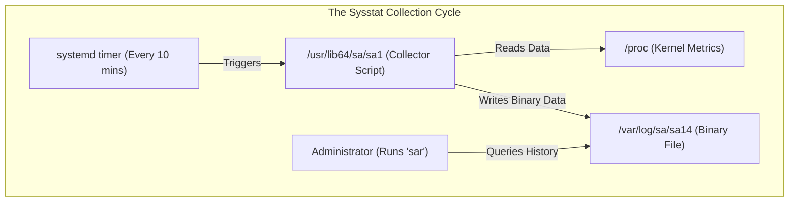
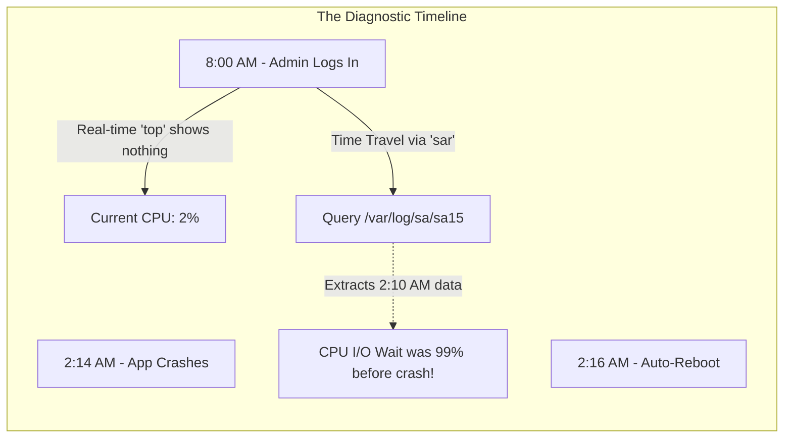
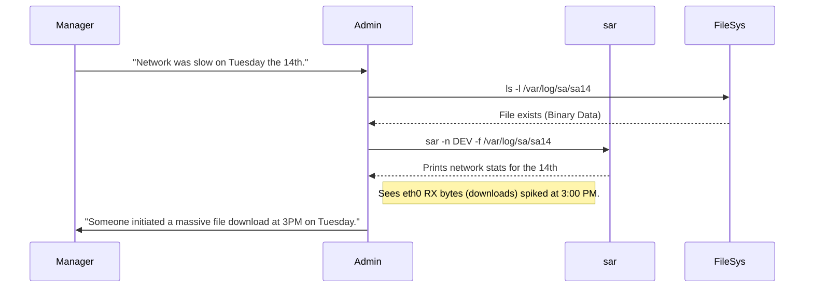

# CHAPTER 54 — SYSTEM ACTIVITY REPORTER (SAR AND SYSSTAT)

---

## 1. Introduction

### Why This Topic Exists
Tools like `top`, `vmstat`, and `iostat` are excellent for real-time troubleshooting. But what happens if a server crashes at 3:00 AM, reboots itself, and when you log in at 8:00 AM, everything looks perfectly fine? Real-time tools cannot help you analyze the past. You need a flight data recorder. **sysstat** is a package that installs a background daemon to constantly record system performance metrics to disk every 10 minutes. The **sar (System Activity Reporter)** tool is used to query those historical records.

### Why Linux Administrators Use It
Administrators use `sar` to perform post-mortem root cause analysis. If the database team complains that the server was extremely slow yesterday between 2:00 PM and 4:00 PM, the Linux administrator uses `sar` to travel back in time and view exactly what the CPU, Memory, and Disk usage were during that specific two-hour window.

### Why Companies Care About It
Capacity Planning and Forecasting. Companies do not want to buy $50,000 worth of new servers if they don't need them. By analyzing months of historical `sar` data, an architect can prove, "Our CPU usage has grown by exactly 2% every month for the last year. We will not hit 100% capacity until next November. We do not need to buy hardware right now."

---

## 2. Learning Objectives

By the end of this chapter, you will be able to:
- Install and enable the `sysstat` package.
- Understand how the `sysstat` daemon collects and stores historical data.
- Use `sar` to view today's historical CPU, Memory, and Disk metrics.
- Query `sar` data from previous days using the `-f` flag.
- Generate network performance history using `sar -n DEV`.

---

## 3. Beginner-Friendly Explanation

Think of a patient with a mysterious heart condition:
- **`top` (The Stethoscope):** The doctor listens to the patient's heart right now. It sounds fine. But the patient says, "It hurt really bad last night at 2:00 AM!" The doctor can't use a stethoscope on the past.
- **`sar` (The Holter Monitor):** The doctor straps a recording device to the patient's chest. It records their heartbeat every 10 minutes for a month. When the patient comes in on Tuesday, the doctor plugs the device into a computer, rewinds the tape to 2:00 AM on Sunday, and sees exactly what the heart was doing.

---

## 4. Core Theory

### 4.1 The `sysstat` Daemon
When you install the `sysstat` package, it enables a systemd service (`sysstat.service`) and a timer/cron job. By default, every 10 minutes, the system quickly gathers CPU, RAM, Network, and Disk statistics and writes them to a highly compressed binary file.

### 4.2 Data Storage (`/var/log/sa/`)
The recorded data is stored in `/var/log/sa/` (System Activity).
- Files named `saDD` (e.g., `sa15`): These are the raw, unreadable binary data files collected on the 15th day of the month.
- Files named `sarDD` (e.g., `sar15`): These are human-readable text summaries generated at the end of the day.
By default, `sysstat` keeps 28 days of history.

### 4.3 `sar` (The Query Tool)
You never read the `sa` files directly. You use the `sar` command.
If you type `sar` with no arguments, it prints today's CPU history from midnight up until right now. If you want to see yesterday's data, you tell `sar` to read yesterday's binary file.

---

## 5. Internal Working

### Performance Impact of Sysstat
Many administrators worry that running a background recorder will slow down the server. The `sysstat` collection script is written in optimized C code. It runs for roughly 0.05 seconds every 10 minutes. The performance overhead is practically unmeasurable (less than 0.1% CPU usage). It is perfectly safe, and highly recommended, to run on every production server.

---

## 6. Production Architecture



---

## 7. Command-by-Command Explanation

### 7.1 `systemctl enable --now sysstat`
- **Purpose:** Starts the background collector. If you don't run this, `sar` will just say "File not found" when you try to query history.

### 7.2 `sar`
- **Purpose:** The default command. Shows today's CPU usage (`%user`, `%system`, `%iowait`, `%idle`) recorded in 10-minute intervals.

### 7.3 `sar -r`
- **Purpose:** Shows today's historical Memory (RAM) usage. (`-r` for RAM). Look at `%memused`.

### 7.4 `sar -d`
- **Purpose:** Shows today's historical Disk I/O usage. (`-d` for Disk). You must usually combine this with `-p` (pretty) so it shows `sda` instead of `dev8-0`.

### 7.5 `sar -f /var/log/sa/sa12`
- **Purpose:** Travels back in time. Instead of showing today's data, it queries the binary file from the 12th day of the month.

---

## 8. Syntax Breakdown

**Querying Past Network Activity**

```bash
sar -n DEV -f /var/log/sa/sa05 -s 14:00:00 -e 16:00:00
│   │  │   │  │                │          │
│   │  │   │  │                │          └── End time (4:00 PM)
│   │  │   │  │                └───────────── Start time (2:00 PM)
│   │  │   │  └────────────────────────────── File to read (The 5th of the month)
│   │  │   └───────────────────────────────── Target specific network Devices (eth0)
│   │  └───────────────────────────────────── Network statistics flag
└──────────────────────────────────────────── Command: System Activity Reporter
```
*(This command instantly answers: "Was there a network spike yesterday afternoon?")*

---

## 9. Parameter Explanation

| Command | Parameter | Description |
|:---|:---|:---|
| `sar` | `-q` | Shows the historical Load Average and Run Queue length. |
| `sar` | `-W` | Shows Swapping statistics (`pswpin/s`). Critical for finding OOM (Out of Memory) events. |
| `sar` | `2 5` | Run in real-time mode! Instead of reading history, sample the live system every 2 seconds for 5 intervals (exactly like `vmstat`). |
| `sar` | `-A` | Print absolutely everything (CPU, RAM, Disk, Network) for the entire day. (Usually piped to a text file for auditor review). |

---

## 10. Sample Output Analysis

**Scenario:** The database team says the server froze up between 9:00 AM and 10:00 AM today.
**Command:** `sar -r -s 09:00:00 -e 10:00:00`

**Output:**
```text
09:00:01 AM kbmemfree kbmemused  %memused kbbuffers  kbcached  kbcommit   %commit
09:10:01 AM   2540000   5460000     68.25    102400   2048000   4000000     50.00
09:20:01 AM   1024000   6976000     87.20     51200   1024000   6500000     81.25
09:30:01 AM     50000   7950000     99.37     10240    102400   9000000    112.50
09:40:01 AM   2500000   5500000     68.75    102400   2000000   4100000     51.25
```

**Analysis:**
- **09:10 AM:** Memory usage was a healthy 68%.
- **09:30 AM:** Memory usage spiked to **99.37%**. Notice that `kbcommit` (memory requested by apps) exceeded 100% of physical RAM (112%). The server ran completely out of RAM. 
- **09:40 AM:** Memory usage plummeted back down to 68%. 
- **Conclusion:** At exactly 09:30 AM, a massive query or process consumed all the RAM. The Linux OOM (Out of Memory) Killer likely intervened, assassinated the database process to save the OS, and the database automatically restarted by 09:40 AM. The Admin now knows exactly when to look in the application logs.

---

## 11. Architecture Diagram



---

## 12. Workflow Diagram



---

## 13. Real Production Examples

### Capacity Planning
A manager wants to know if they need to buy more RAM for the web server cluster before the Black Friday shopping event.
The administrator writes a simple bash script to loop through all the `sa` files for the last 28 days and extracts the peak `%memused` for each day.
They graph it in Excel. The graph shows that even during peak hours over the last month, RAM usage never exceeded 45%. The administrator proves that buying more RAM would be a waste of money.

### Discovering Cryptominers
An administrator checks the server on Monday morning. They run `sar` to look at Sunday's CPU usage.
Normally, Sunday CPU usage is 2% because the office is closed. However, `sar` shows that starting at 1:00 AM on Sunday, `%user` CPU spiked to 100% and stayed there perfectly flat for 24 hours. This unnatural, flat 100% usage during off-hours is the classic signature of a cryptocurrency mining malware infection.

---

## 14. Common Mistakes

1. **Trying to `cat` an `sa` file** — If you type `cat /var/log/sa/sa12`, your terminal will fill with alien garbage text, beep loudly, and possibly freeze. It is a binary database file. You MUST use `sar -f` to read it.
2. **Forgetting to enable the service** — Many admins install the `sysstat` package but forget to run `systemctl enable --now sysstat`. Six months later, a server crashes, they go to check `sar`, and find out it hasn't been recording anything since it was installed.
3. **Misinterpreting 10-minute averages** — `sar` records a snapshot every 10 minutes (by default). If a CPU spikes to 100% for exactly 30 seconds at 2:05 PM, and then drops to 1%, `sar` might completely miss the spike, or it might average it out so the 2:10 PM log just shows a gentle 15% bump. `sar` is for macro-trends, not micro-second analysis.

---

## 15. Best Practices

- Change the default retention period. By default, `sysstat` keeps 28 days of logs. If you edit `/etc/sysconfig/sysstat` (or `/etc/default/sysstat` on Ubuntu), you can change `HISTORY=28` to `HISTORY=90` to keep 3 months of data. The files are tiny (a few megabytes), so storing 90 days is highly recommended for quarterly reporting.
- Use `kSar` or `sysstat-graph`. While reading text output is fine, there are third-party tools that can ingest a `sar` file and instantly generate beautiful line graphs for CPU/RAM usage, which are perfect for presenting to management.

---

## 16. Security Considerations

- **Log Tampering:** Just like `auditd` logs, a hacker with `root` privileges can delete the `/var/log/sa/` directory to hide the fact that they spiked the CPU at 3:00 AM compiling malware. Centralized monitoring (like Prometheus/Grafana or Datadog) is required in enterprise environments to ship performance metrics off-server in real-time. `sar` is the ultimate *local* fallback tool.

---

## 17. Performance Considerations

- **Decreasing the Interval:** You can edit the `cron` job in `/etc/cron.d/sysstat` to make it record data every 1 minute instead of every 10 minutes. This gives you much higher resolution data to catch micro-spikes. However, it will make the `sa` files 10x larger and consume slightly more disk I/O. For most servers, 10 minutes is a perfect balance.

---

## 18. Troubleshooting Guide

| Symptom | Root Cause | Resolution |
|:---|:---|:---|
| `Cannot open /var/log/sa/saXX` | Sysstat is not running | `systemctl enable --now sysstat` and wait 10 minutes for the first file to generate. |
| `Invalid system activity file` | OS version mismatch | You copied an `sa` file from an Ubuntu server to a RHEL server. `sar` binaries are OS-specific. |
| `sar` output shows AM/PM incorrectly | Locale issue | Prepend `LC_TIME=C sar` to force standard 24-hour time format. |
| Disk names look like `dev8-0` | Using raw device names | Always use `sar -dp` (pretty) to translate to `sda`. |

---

## 19. Practical Labs

**Lab 54.1:** Installation and Live Usage
1. `sudo dnf install sysstat -y`
2. `sudo systemctl enable --now sysstat`
3. Force the system to generate its first record immediately:
   `sudo /usr/lib64/sa/sa1 1 1` (Path may vary on Ubuntu: `/usr/lib/sysstat/sa1`)
4. View the CPU history: `sar`
5. View the RAM history: `sar -r`

**Lab 54.2:** Real-Time Monitoring with sar
1. Instead of history, use `sar` like `top`.
2. Monitor Disk I/O every 1 second, 5 times:
   `sar -dp 1 5`
3. Monitor Network every 2 seconds, 3 times:
   `sar -n DEV 2 3`

---

## 20. Mini Project

The Time Machine.
1. Run `ls -l /var/log/sa/`
2. Look at the date of the files. Pick a file from 2 days ago (e.g., if today is the 15th, pick `sa13`).
3. Query the overall load average from that day:
   `sar -q -f /var/log/sa/sa13`
4. Filter it to only show the load average between 1:00 PM and 3:00 PM:
   `sar -q -f /var/log/sa/sa13 -s 13:00:00 -e 15:00:00`
5. You have just successfully pulled historical telemetry data from a Linux server.

---

## 21. Assignments

1. Why is `sar` useful when `top` and `htop` already exist?
2. By default, how many days of history does `sysstat` keep on the hard drive?
3. What is the danger of relying on `sar` to detect a CPU spike that only lasted for 15 seconds?

---

## 22. Interview Questions

### Basic
1. **Q: You need to review what the CPU utilization was at 4:00 AM yesterday. What tool do you use?**
   A: `sar` (System Activity Reporter).

2. **Q: Where does the `sysstat` daemon store its historical data files?**
   A: `/var/log/sa/`

### Intermediate
3. **Q: A manager hands you a binary file named `sa05` from a crashed server and asks you to tell them what the memory usage was before the crash. How do you read it?**
   A: I cannot `cat` or `vim` the file because it is binary. I must use the command `sar -r -f sa05` to parse the file and output the memory statistics in a human-readable format.

4. **Q: What is the difference between `sar` and `sar -r`?**
   A: Running `sar` with no arguments defaults to showing CPU utilization history. `sar -r` specifies that you want to see RAM (Memory) utilization history.

### Scenario-Based
5. **Q: You install `sysstat` on a new server. A week later, the server crashes. You log in, run `sar`, and it returns an error saying the file cannot be found. You check `/var/log/sa/` and the directory is completely empty. What did you forget to do during installation?**
   A: I forgot to start and enable the `sysstat` service (`systemctl enable --now sysstat`). Installing the package places the binaries on the system, but the background timer/daemon must be explicitly started for it to actually begin collecting and writing data to disk.

---

## 23. Chapter Summary and Quick Revision Notes

- **`sysstat`:** The package/daemon that collects the data.
- **`sar`:** The command-line tool used to query the data.
- **`/var/log/sa/`:** The directory where binary `sa` files are stored.
- **`sar` (no flags):** CPU History.
- **`sar -r`:** Memory History.
- **`sar -d -p`:** Disk I/O History (Pretty formatted).
- **`sar -n DEV`:** Network History.
- **`sar -f <file>`:** Read history from a previous day.
- **Time filters:** Use `-s` (Start) and `-e` (End) to narrow down the output.

---

## 24. Cheat Sheet

| Command | Purpose |
|:---|:---|
| `systemctl enable --now sysstat` | Start the historical collector |
| `sar` | View today's CPU history |
| `sar -r` | View today's RAM history |
| `sar -d -p` | View today's Disk history |
| `sar -q` | View today's Load Average history |
| `sar -f /var/log/sa/sa10` | Read data from the 10th of the month |
| `sar -f /var/log/sa/sa10 -s 12:00:00`| Read data from noon onward |
