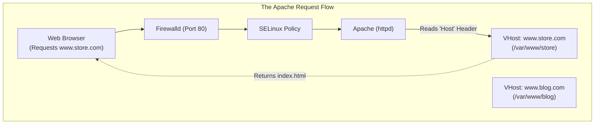
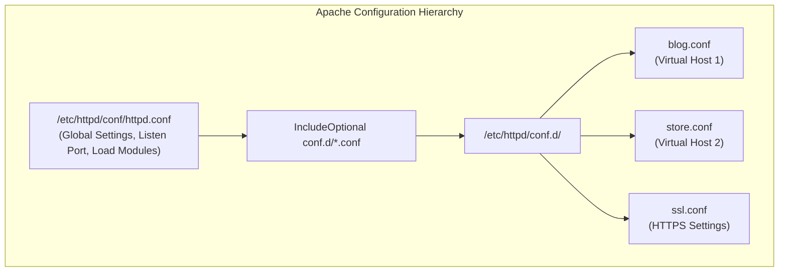
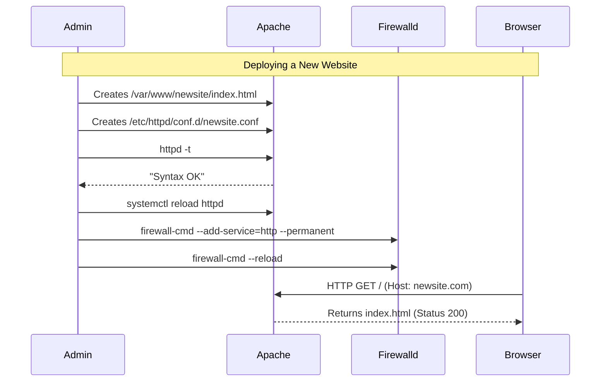

# CHAPTER 56 — APACHE HTTP SERVER ADMINISTRATION

---

## 1. Introduction

### Why This Topic Exists
A web server is a software application that listens on Port 80 (HTTP) or Port 443 (HTTPS), accepts requests from web browsers over the internet, and returns HTML pages, images, or data. For decades, the **Apache HTTP Server** (commonly referred to simply as "Apache" or `httpd`) was the undisputed king of the internet. While newer servers like Nginx have gained massive popularity, Apache remains a foundational technology deployed in almost every enterprise, renowned for its stability, modules, and `.htaccess` flexibility.

### Why Linux Administrators Use It
Linux administrators use Apache to host everything from simple static documentation sites to massive e-commerce applications built on PHP (the classic LAMP stack: Linux, Apache, MySQL, PHP). They are responsible for configuring Virtual Hosts (allowing one server to host 50 different websites), tuning performance limits, and securing the server by restricting directory access.

### Why Companies Care About It
Reliability and Legacy Support. Millions of enterprise applications, WordPress blogs, and corporate intranets were built specifically for Apache. Companies rely on administrators who can seamlessly maintain, secure, and troubleshoot these Apache servers. If the Apache configuration is broken, the website goes down, and the business instantly loses money and customer trust.

---

## 2. Learning Objectives

By the end of this chapter, you will be able to:
- Install, start, and enable the Apache HTTP server (`httpd` or `apache2`).
- Understand the primary configuration file (`httpd.conf`).
- Host multiple websites on a single server using **Virtual Hosts**.
- Restrict access to specific directories using Authentication and `Require` directives.
- View and analyze Apache Access and Error logs.
- Understand the difference between MPM Prefork and Worker processing modules.

---

## 3. Beginner-Friendly Explanation

Think of a bustling Restaurant:
- **The Building (The Linux Server):** The physical location.
- **The Hostess (Port 80/443):** Stands at the door waiting for customers (web browsers) to arrive.
- **The Waitstaff (Apache Worker Processes):** When a customer asks for a menu (a web page), a waiter grabs the menu from the kitchen (the hard drive) and brings it to the customer.
- **Virtual Hosts:** The restaurant has two different signs outside: "Bob's Burgers" and "Alice's Pizza". Both restaurants operate out of the exact same physical kitchen. The Hostess looks at which sign the customer walked under, and hands them the correct menu.

---

## 4. Core Theory

### 4.1 The Daemon Name (`httpd` vs `apache2`)
Depending on your Linux distribution, the Apache software goes by different names:
- **Red Hat / CentOS / Fedora:** The package and service are named `httpd`.
- **Ubuntu / Debian:** The package and service are named `apache2`.

### 4.2 The Document Root
The Document Root is the main folder on the hard drive where the website's HTML files live.
- By default on RHEL: `/var/www/html/`
If a user goes to `http://your-server.com/index.html`, Apache literally looks for the file `/var/www/html/index.html` and sends it back.

### 4.3 Virtual Hosts (vHosts)
Without Virtual Hosts, one Linux server can only host one website. With Virtual Hosts, a single server with a single IP address can host `google.com`, `apple.com`, and `microsoft.com` simultaneously.
When a web browser connects, it sends an invisible HTTP header called `Host: google.com`. Apache reads this header, checks its Virtual Host configurations, and routes the request to the specific folder belonging to that website (e.g., `/var/www/google/`).

### 4.4 The `.htaccess` File
Apache allows developers to override global server configurations on a per-directory basis using a hidden file named `.htaccess`. Developers love this because they can create custom URL redirects or password protections without needing the Linux Administrator to edit the main `httpd.conf` and restart the whole server.

---

## 5. Internal Working

### Multi-Processing Modules (MPM)
How does Apache handle 1,000 customers at exactly the same time? It uses MPMs.
- **Prefork:** The traditional, highly stable method. The main Apache process spawns 100 identical "child" processes. Each child handles exactly one customer. It is memory-heavy but extremely safe (used heavily with older PHP).
- **Worker / Event:** The modern, high-performance method. It spawns a few child processes, but each child uses "Threads" to handle hundreds of customers simultaneously. It uses far less RAM and handles massive traffic spikes much better.

---

## 6. Production Architecture



---

## 7. Command-by-Command Explanation

### 7.1 `dnf install httpd`
- **Purpose:** Installs the Apache web server on Red Hat-based systems.

### 7.2 `systemctl enable --now httpd`
- **Purpose:** Starts the Apache service immediately and ensures it starts automatically if the server reboots.

### 7.3 `httpd -t` (or `apachectl configtest`)
- **Purpose:** **CRITICAL COMMAND.** Tests the syntax of your configuration files. If you made a typo in `httpd.conf`, running this will tell you exactly which line is broken. If you restart Apache with a broken config, the server will crash and the website will go offline. Always run this first.

### 7.4 `apachectl -S`
- **Purpose:** Lists all configured Virtual Hosts and shows you exactly which config file is controlling them. Essential for troubleshooting "Why is my domain showing the wrong website?"

### 7.5 `tail -f /var/log/httpd/access_log`
- **Purpose:** Tails the access log in real-time. Every single time someone loads a page or an image on your website, a line appears here.

---

## 8. Syntax Breakdown

**A Basic Virtual Host Configuration (RHEL: `/etc/httpd/conf.d/store.conf`)**

```apache
<VirtualHost *:80>
    ServerName www.store.com
    ServerAlias store.com
    DocumentRoot /var/www/store

    ErrorLog /var/log/httpd/store_error.log
    CustomLog /var/log/httpd/store_access.log combined

    <Directory "/var/www/store">
        Require all granted
    </Directory>
</VirtualHost>
```
- `<VirtualHost *:80>`: Listen on all IP addresses (`*`) on Port 80.
- `ServerName`: The primary domain this block responds to.
- `ServerAlias`: Other domains that should show the same site.
- `Require all granted`: Modern Apache syntax authorizing the internet to read this folder.

---

## 9. Parameter Explanation

| Directive | Purpose |
|:---|:---|
| `Listen 80` | Tells the physical daemon to bind to Port 80. If you want Apache to run on a custom port, change this to `Listen 8080`. |
| `DirectoryIndex` | Defines which file to serve if the user requests a bare directory. Defaults to `index.html`. If you use PHP, you must add `index.php`. |
| `AllowOverride All` | Inside a `<Directory>` block, this allows developers to use `.htaccess` files. If set to `None`, `.htaccess` files are completely ignored. |
| `KeepAlive On` | Keeps the TCP connection open after a browser downloads the HTML, allowing it to download the CSS and images instantly without re-establishing the connection. Drastically speeds up websites. |

---

## 10. Sample Output Analysis

**Scenario:** We are tailing the Apache Access Log to see who is visiting the site.
**Command:** `tail -f /var/log/httpd/access_log`

**Output:**
```text
192.168.1.50 - - [24/Oct/2026:14:32:01 -0400] "GET /index.html HTTP/1.1" 200 4532 "-" "Mozilla/5.0 (Windows NT 10.0; Win64)"
203.0.113.99 - - [24/Oct/2026:14:32:05 -0400] "GET /admin/login.php HTTP/1.1" 403 212 "-" "Python-urllib/3.8"
45.55.66.77  - - [24/Oct/2026:14:32:10 -0400] "GET /old-page.html HTTP/1.1" 404 153 "-" "Mozilla/5.0 (Macintosh)"
```

**Analysis:**
- **Line 1:** User `192.168.1.50` requested `index.html`. The server returned HTTP Status **200 (OK)** and sent 4532 bytes of data. The user was using a Windows web browser. This is a normal, healthy request.
- **Line 2:** IP `203.0.113.99` requested the admin login page. The server returned HTTP Status **403 (Forbidden)**. The user-agent reveals it was an automated Python script, not a real human. This is a hacker running a bot. Apache successfully blocked them.
- **Line 3:** A Mac user requested `old-page.html`. The server returned HTTP Status **404 (Not Found)**. The file doesn't exist on the hard drive.

---

## 11. Architecture Diagram


*Best Practice: Never put all your websites into the main `httpd.conf`. Create separate, small `.conf` files in the `conf.d` directory. Apache automatically stitches them all together when it starts.*

---

## 12. Workflow Diagram



---

## 13. Real Production Examples

### Password Protecting a Directory
A company wants to put a beta version of their website online, but only employees should see it. The admin uses Apache's Basic Auth.
1. Generate a password file: `htpasswd -c /etc/httpd/.htpasswd alice` (Prompts for password).
2. Edit the Virtual Host file:
```apache
<Directory "/var/www/beta">
    AuthType Basic
    AuthName "Restricted Beta Area"
    AuthUserFile /etc/httpd/.htpasswd
    Require valid-user
</Directory>
```
3. `systemctl reload httpd`. Now, when anyone goes to the beta site, the browser pops up a username/password box.

### Fixing a Permission Denied Error (SELinux)
You create a new virtual host pointing to `/data/website/`. You test it in a browser, and Apache returns `403 Forbidden`. You check the `/var/log/httpd/error_log` and see:
`[core:error] (13)Permission denied: AH00035: access to / denied`
You check standard permissions (`chmod`), and they are fine. You remember Chapter 50.
You run `semanage fcontext -a -t httpd_sys_content_t "/data/website(/.*)?"` and `restorecon -Rv /data/website`. The website instantly works.

---

## 14. Common Mistakes

1. **Forgetting `httpd -t` before restarting** — A junior admin makes a typo in a configuration file on a server hosting 20 critical websites. They run `systemctl restart httpd`. The daemon crashes due to the typo. All 20 websites immediately go offline. The admin panics trying to find the typo. If they had run `httpd -t` first, it would have caught the typo *without* taking the server offline.
2. **Missing `Require all granted` in Apache 2.4** — If you migrate an old config file from a 15-year-old server (Apache 2.2) to a modern server (Apache 2.4), the old syntax used `Order allow,deny / Allow from all`. Apache 2.4 completely changed this to `Require all granted`. If you use the old syntax, Apache will throw massive errors.
3. **Leaving `Options Indexes` enabled** — If a directory doesn't have an `index.html` file, Apache's default behavior is to generate a clickable list of every single file in that folder (Directory Listing). If this is an images folder, fine. If it's a folder containing backup SQL databases, hackers will download your entire database. **Always remove the `Indexes` option.**

---

## 15. Best Practices

- **Hide Server Information:** By default, if Apache returns a 404 Error page, it prints "Apache/2.4.37 (Red Hat Enterprise Linux) Server at example.com" at the bottom. This tells hackers exactly which OS and version you are running, making it easy for them to look up known exploits. In `httpd.conf`, set `ServerTokens Prod` and `ServerSignature Off` to hide this data.
- **Separate Log Files:** When configuring Virtual Hosts, always define a unique `ErrorLog` and `CustomLog` for each website. If you dump 20 websites into the main global log file, troubleshooting a specific site becomes an unreadable nightmare.

---

## 16. Security Considerations

- **The Apache User:** Apache must bind to Port 80, which requires `root` privileges. However, immediately after binding to the port, Apache drops its privileges and runs all worker processes as a restricted user (usually `apache` or `www-data`). NEVER run the worker processes as root. If a hacker exploits a bug in the website code, they only gain access to the restricted `apache` user account.

---

## 17. Performance Considerations

- **MaxRequestWorkers:** If a single Apache worker consumes 50MB of RAM, and you configure `MaxRequestWorkers 1000`, Apache could try to consume 50GB of RAM under heavy load. If your server only has 16GB of RAM, it will start aggressively swapping to the hard drive, freezing the entire server. You must calculate and strictly limit the maximum number of workers based on your physical RAM.

---

## 18. Troubleshooting Guide

| Symptom | Root Cause | Resolution |
|:---|:---|:---|
| Browser says "Site cannot be reached" | Firewall is blocking Port 80/443 | `firewall-cmd --add-service=http --permanent` |
| Browser says "403 Forbidden" | Permissions or SELinux | Check `chmod`, `chown apache:apache`, and `restorecon`. |
| Browser says "404 Not Found" | Typo in URL or missing file | Check `DocumentRoot` path. Ensure `index.html` exists. |
| Apache fails to start (`Address already in use`) | Another service is using Port 80 | Run `ss -tulpn \| grep :80`. It is often Nginx conflicting. |

---

## 19. Practical Labs

**Lab 56.1:** Basic Installation and Testing
1. `sudo dnf install httpd -y`
2. `sudo systemctl enable --now httpd`
3. `sudo firewall-cmd --add-service=http --permanent && sudo firewall-cmd --reload`
4. `echo "<h1>Welcome to Apache</h1>" | sudo tee /var/www/html/index.html`
5. Open a web browser on your laptop and type the IP address of your Linux VM. You will see the welcome message!

**Lab 56.2:** Creating a Virtual Host
1. `sudo mkdir /var/www/myproject`
2. `echo "My Project Site" | sudo tee /var/www/myproject/index.html`
3. `sudo vim /etc/httpd/conf.d/myproject.conf`
4. Add the configuration:
```apache
<VirtualHost *:80>
    ServerName myproject.local
    DocumentRoot /var/www/myproject
</VirtualHost>
```
5. `sudo httpd -t` (Check syntax)
6. `sudo systemctl reload httpd`
7. Test it from the server itself: `curl -H "Host: myproject.local" http://localhost`

---

## 20. Mini Project

Log File Forensics.
1. Run `sudo tail -n 20 /var/log/httpd/access_log`.
2. Review the logs. Look at the HTTP Status Codes (the number immediately following the "HTTP/1.1" string).
3. Identify a `200` (Success).
4. Identify a `404` (Not Found).
5. Identify the User-Agent (the browser string at the very end). Are they using Chrome? Firefox? A command-line script like `curl`?
6. This skill is critical for identifying whether traffic is legitimate or malicious.

---

## 21. Assignments

1. What is the difference between `httpd.conf` and the files in `conf.d/`?
2. Why is it dangerous to restart the Apache service without running `httpd -t` first?
3. What is the primary purpose of a Virtual Host in Apache?

---

## 22. Interview Questions

### Basic
1. **Q: What is the default directory where Apache looks for website files on a Red Hat/CentOS system?**
   A: `/var/www/html/`

2. **Q: You want to host `websiteA.com` and `websiteB.com` on the same Linux server using the same IP address. What Apache feature makes this possible?**
   A: Virtual Hosts (vHosts).

### Intermediate
3. **Q: A developer asks you to enable "Directory Listings" for a folder full of PDFs so users can just browse the files. How do you do this, and what is the security concern?**
   A: I would add `Options Indexes` to the `<Directory>` block for that specific folder. The security concern is that if this is accidentally applied to a root directory, hackers can easily browse and download sensitive configuration files, backup archives, or proprietary source code. It should be used very strictly.

4. **Q: You configure a new Virtual Host. You run `systemctl restart httpd`. The website loads, but it shows a default Apache welcome page instead of the developer's code. You verify the developer's code is in the `DocumentRoot`. What is the most likely issue?**
   A: The developer probably named their main file something like `home.html` or `main.php`. By default, the `DirectoryIndex` directive tells Apache to look strictly for `index.html`. If it doesn't find it, and `Indexes` is off, it may show the default welcome page or a 403 Forbidden. The file must be renamed to `index.html`, or `DirectoryIndex` must be updated.

### Scenario-Based
5. **Q: A high-traffic e-commerce site running on Apache goes down. You log into the server and run `top`. The CPU is at 100%, and you see 500 different `httpd` processes running. The server is completely out of RAM and is thrashing the swap file. What caused this, and how do you prevent it from happening again?**
   A: The server experienced a massive surge in traffic (or a DDoS attack). Apache was configured to use the Prefork MPM, which spawns a brand new, memory-heavy process for every single visitor. It spawned so many processes that it exhausted the physical RAM, causing a Swap death-spiral. To prevent this, I must edit the Apache configuration and lower the `MaxRequestWorkers` limit to a mathematically safe number that fits inside the physical RAM. Alternatively, I could migrate the server to the modern `Event` MPM or Nginx, which handle high concurrency with much lower RAM usage.

---

## 23. Chapter Summary and Quick Revision Notes

- **Apache (`httpd` / `apache2`):** The foundational open-source web server.
- **DocumentRoot:** The physical folder on the hard drive.
- **Virtual Hosts:** Allow one server to host multiple domain names.
- **`httpd -t`:** Checks config syntax. Run this before EVERY reload.
- **`systemctl reload httpd`:** Applies config changes safely without dropping connections.
- **`.htaccess`:** Allows developers to override settings in specific folders.
- **Access Logs:** Track who visited, what they requested, and the HTTP Status Code (200 OK, 404 Not Found, 403 Forbidden, 500 Internal Error).

---

## 24. Cheat Sheet

| Command / Syntax | Purpose |
|:---|:---|
| `systemctl enable --now httpd` | Start the web server |
| `httpd -t` | Verify syntax (Catch typos) |
| `apachectl -S` | List all active Virtual Hosts |
| `tail -f /var/log/httpd/access_log`| View live website traffic |
| `<VirtualHost *:80>` | Start a vHost block |
| `ServerName example.com` | Bind the vHost to a domain |
| `DocumentRoot /var/www/site` | Set the directory path |
| `Require all granted` | Allow public access to a folder |
