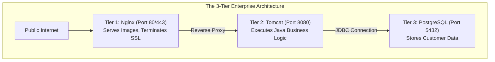
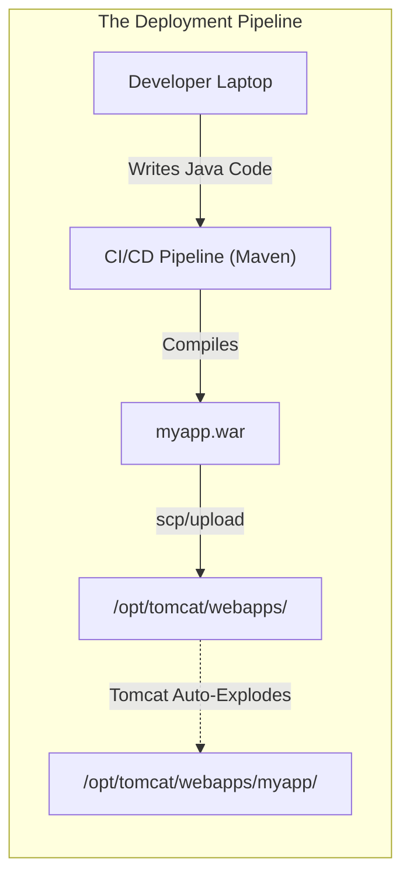
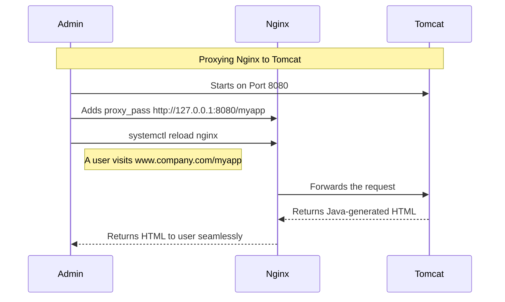

# CHAPTER 58 — TOMCAT AND JAVA APPLICATION SERVERS

---

## 1. Introduction

### Why This Topic Exists
While Apache and Nginx are incredible at serving static HTML, CSS, and images, they cannot natively execute complex enterprise business logic written in Java. Java powers the backends of massive corporate applications, banking systems, and legacy enterprise software. To run these Java applications on a Linux server, you need a specialized "Application Server" or "Servlet Container". **Apache Tomcat** is the most widely deployed open-source Java application server in the world.

### Why Linux Administrators Use It
Developers write the Java code, compile it into a `.war` (Web Application Archive) file, and hand it to the Linux Administrator. The administrator is responsible for installing the Java Runtime Environment (JRE), installing Tomcat, configuring Tomcat's memory limits (Heap Size), deploying the `.war` file, and securing the server.

### Why Companies Care About It
Enterprise Architecture. A massive enterprise application is rarely just "a website". It is a multi-tier architecture. Nginx sits at the front facing the internet (Tier 1), handling SSL and static images. Nginx proxies the complex business requests back to Tomcat (Tier 2). Tomcat executes the Java code and connects to an Oracle or PostgreSQL database (Tier 3). If Tomcat is misconfigured or runs out of memory, the entire enterprise application crashes.

---

## 2. Learning Objectives

By the end of this chapter, you will be able to:
- Differentiate between a Web Server (Nginx/Apache) and an Application Server (Tomcat).
- Install the Java Runtime Environment (JRE) and Apache Tomcat.
- Deploy a Java `.war` file into Tomcat's `webapps` directory.
- Configure Tomcat's listening ports (8080).
- Tune the Java Virtual Machine (JVM) memory heap size to prevent `OutOfMemory` errors.
- Secure the Tomcat Manager GUI.

---

## 3. Beginner-Friendly Explanation

Think of a massive Automobile Factory:
- **Nginx (The Showroom):** The glossy front end. It shows customers pictures of the cars (HTML/CSS). It's fast and looks great, but it doesn't build anything.
- **Tomcat (The Factory Floor):** The heavy machinery in the back. Customers are not allowed here. When a customer orders a custom car in the showroom, the order is sent to the factory floor. The heavy machinery (Java) takes raw steel, builds the custom car, and sends it to the showroom.
- **The `.war` file (The Blueprint):** The instructions the engineers (Developers) give to the machinery to tell it exactly how to build the new car.
- **The JVM Heap (The Factory Electricity):** The factory needs a massive amount of power. If you don't give Tomcat enough electricity (RAM), the machines stop halfway through building a car and everything grinds to a halt.

---

## 4. Core Theory

### 4.1 Java Architecture (JDK vs JRE)
- **JDK (Java Development Kit):** Used by developers on their laptops to write and compile Java code.
- **JRE (Java Runtime Environment):** Used by Linux administrators on production servers to *execute* the code. Tomcat requires a JRE to run.

### 4.2 The `.war` File
In PHP or Python, developers upload thousands of loose files to the server. In Java, developers zip all their compiled classes, HTML, CSS, and XML configurations into a single, neat file called a **WAR (Web Application Archive)** file (e.g., `store.war`).
When you place `store.war` into Tomcat's `webapps` folder, Tomcat automatically "explodes" (unzips) it and starts serving the application.

### 4.3 Tomcat vs Enterprise Application Servers
Tomcat is technically a "Servlet Container". It is lightweight and handles standard Java web applications perfectly. Heavier, more complex applications might require full Java EE Application Servers like **JBoss / WildFly**, **WebLogic** (Oracle), or **WebSphere** (IBM). However, the administrative concepts (JVM tuning, deploying WARs) remain largely the same across all of them.

---

## 5. Internal Working

### The JVM Heap (Garbage Collection)
Tomcat runs entirely inside a Java Virtual Machine (JVM). When a user logs into the app, the JVM allocates a chunk of physical RAM to hold their session data. When the user logs out, the JVM runs a process called "Garbage Collection" (GC) to sweep up that RAM and mark it as free.
If 10,000 users log in, the JVM might hit its maximum memory limit (The Max Heap Size). If it hits the limit, Garbage Collection runs frantically trying to find free memory. CPU spikes to 100%, the application freezes, and Tomcat eventually crashes with the dreaded `java.lang.OutOfMemoryError`.

---

## 6. Production Architecture


*Notice that Tomcat (Port 8080) is never directly exposed to the internet. It sits safely behind Nginx or Apache.*

---

## 7. Command-by-Command Explanation

### 7.1 `dnf install java-17-openjdk-headless`
- **Purpose:** Installs the Java Runtime Environment. The `-headless` version is optimized for servers (it strips out graphical components like sound/mouse support that a web server doesn't need, saving RAM and improving security).

### 7.2 `useradd -r -s /sbin/nologin tomcat`
- **Purpose:** Security best practice. You should NEVER run Tomcat as `root`. This command creates a system (`-r`) user named `tomcat` with no login shell, strictly for running the application server.

### 7.3 `tar -xzf apache-tomcat-10.tar.gz -C /opt/tomcat/`
- **Purpose:** Tomcat is often installed manually by downloading the tarball directly from the Apache foundation rather than using `dnf` (which often has outdated versions). This extracts Tomcat into the `/opt/` directory (the standard location for third-party software).

### 7.4 `chown -R tomcat:tomcat /opt/tomcat/`
- **Purpose:** Grants the restricted `tomcat` user ownership of the application server files so it has permission to start.

---

## 8. Syntax Breakdown

**Tuning the JVM Heap Size (`/opt/tomcat/bin/setenv.sh`)**

```bash
export CATALINA_OPTS="-Xms512M -Xmx2048M"
│      │               │       │
│      │               │       └── Maximum Heap Size (2 Gigabytes). Tomcat will NEVER exceed this.
│      │               └────────── Initial/Minimum Heap Size (512 Megabytes). Tomcat claims this immediately on startup.
│      └────────────────────────── Environment variable read by Tomcat on startup.
└───────────────────────────────── Expose the variable to the shell environment.
```
*If a server has 16GB of RAM, you might set `-Xmx` to `12G`, leaving 4GB for the Linux OS and Nginx.*

---

## 9. Parameter Explanation

| Tomcat Directory | Purpose |
|:---|:---|
| `/opt/tomcat/bin/` | Contains the startup and shutdown scripts (`startup.sh`, `shutdown.sh`). |
| `/opt/tomcat/conf/`| Configuration files. The most important is `server.xml` (Controls ports). |
| `/opt/tomcat/webapps/` | The Deployment folder. You drop your `.war` files here. |
| `/opt/tomcat/logs/` | Log files. The most important is `catalina.out` (The master application log). |

---

## 10. Sample Output Analysis

**Scenario:** A developer deploys a new application. They say it isn't working. We tail the main log file.
**Command:** `tail -f /opt/tomcat/logs/catalina.out`

**Output:**
```text
14-Oct-2026 09:00:01.450 INFO [main] org.apache.catalina.startup.HostConfig.deployWAR Deploying web application archive [/opt/tomcat/webapps/myapp.war]
14-Oct-2026 09:00:05.112 SEVERE [main] org.apache.catalina.core.StandardContext.startInternal One or more listeners failed to start.
14-Oct-2026 09:00:05.120 SEVERE [main] java.lang.OutOfMemoryError: Java heap space
    at java.util.Arrays.copyOf(Arrays.java:3332)
14-Oct-2026 09:00:06.000 INFO [main] org.apache.catalina.startup.Catalina.start Server startup in 15000 ms
```

**Analysis:**
- **Line 1:** Tomcat detects the `myapp.war` file and attempts to extract and deploy it.
- **Line 2/3:** **THE RED FLAG.** The application required more RAM to initialize than the JVM was allowed to provide. It hit a `java.lang.OutOfMemoryError`. 
- **Action:** The administrator must edit `setenv.sh`, increase the `-Xmx` parameter, and restart Tomcat. (Or, the developer wrote a terrible, memory-leaking application and needs to rewrite it).

---

## 11. Architecture Diagram



---

## 12. Workflow Diagram



---

## 13. Real Production Examples

### The Nginx to Tomcat Proxy
You have installed Tomcat, and the application works if you type `http://10.0.1.50:8080/store` in your browser. But you want the public to just type `www.store.com` (Port 80) and never see the ugly `:8080` port.
You install Nginx and configure the Reverse Proxy:
```nginx
server {
    listen 80;
    server_name www.store.com;
    
    location / {
        proxy_pass http://127.0.0.1:8080/store/;
        proxy_set_header Host $host;
    }
}
```
Now, Nginx handles the public internet on Port 80 and secretly talks to Tomcat on 8080 in the background.

### Finding the Hidden Port Conflict
You try to start Tomcat, but it immediately fails. You check `catalina.out` and see `java.net.BindException: Address already in use <null>:8080`.
You realize another service is already using Port 8080 (perhaps an alternate web server or monitoring agent).
You open `/opt/tomcat/conf/server.xml` and find:
`<Connector port="8080" protocol="HTTP/1.1" ... />`
You change `8080` to `8090`, restart Tomcat, and it works perfectly.

---

## 14. Common Mistakes

1. **Running Tomcat as Root** — Junior admins often download Tomcat, unzip it as `root`, and start it. If a hacker exploits a vulnerability in the Java application (like the Struts vulnerability that took down Equifax), the hacker instantly gains `root` access to the entire Linux server. Always create a restricted `tomcat` user.
2. **Exposing the Manager GUI** — Tomcat comes with a built-in web graphical interface (Manager App) used for uploading `.war` files via a browser. By default, it requires a password configured in `tomcat-users.xml`. If a lazy admin sets the password to `admin/admin` and exposes Port 8080 to the internet, hackers will log in, upload a malicious `.war` file containing a shell script, and take over the server. It is best to completely disable the Manager App in production.
3. **Setting `-Xms` and `-Xmx` too far apart** — Setting `-Xms512M` (Min) and `-Xmx16G` (Max) forces the JVM to constantly pause the application to recalculate and expand the heap size as demand grows. In strict production environments, architects often set them exactly the same (e.g., `-Xms8G -Xmx8G`) so the memory is claimed immediately, preventing performance stutters.

---

## 15. Best Practices

- **Create a Systemd Service File:** Because Tomcat is usually installed manually into `/opt/`, it doesn't come with a `systemctl` command. You must manually create `/etc/systemd/system/tomcat.service` so that Tomcat starts automatically if the server reboots.
- **Log Rotation:** The `catalina.out` file captures every single `System.out.println()` from the developers' Java code. If developers log aggressively, this file can grow to 100GB in a week, crashing the server. Ensure `logrotate` is configured for the Tomcat log directory.

---

## 16. Security Considerations

- **The AJP Connector:** By default, Tomcat opens Port `8009` for something called the Apache JServ Protocol (AJP). Unless you are specifically using an old Apache HTTPD server configured with `mod_jk` to proxy traffic to Tomcat, you should immediately open `server.xml` and comment out the AJP Connector. It is an unnecessary open port and a potential security vulnerability.

---

## 17. Performance Considerations

- **Thread Limits:** In `server.xml`, the `<Connector>` element defines how many simultaneous connections Tomcat can handle. The default `maxThreads` is 200. If 300 users connect, 100 of them will hang indefinitely waiting for a free thread. If you have a massive application behind an Nginx proxy, you may need to increase `maxThreads="1000"` (and ensure your JVM Heap is large enough to support 1000 active threads).

---

## 18. Troubleshooting Guide

| Symptom | Root Cause | Resolution |
|:---|:---|:---|
| `Address already in use: 8080` | Port conflict | Edit `server.xml` and change the Connector port to 8090 |
| `java.lang.OutOfMemoryError` | JVM Heap is full | Edit `setenv.sh`, increase `-Xmx`, and restart. |
| Cannot upload `.war` to Manager GUI | File too large | Default GUI limit is 50MB. Deploy directly to `webapps/` via SSH instead. |
| Tomcat won't start via `systemctl` | Incorrect ownership | `chown -R tomcat:tomcat /opt/tomcat` |

---

## 19. Practical Labs

**Lab 58.1:** Installing and Starting Tomcat
1. Install Java: `sudo dnf install java-17-openjdk-headless -y`
2. Create User: `sudo useradd -m -U -d /opt/tomcat -s /bin/false tomcat`
3. Download Tomcat: `wget https://archive.apache.org/dist/tomcat/tomcat-10/v10.1.13/bin/apache-tomcat-10.1.13.tar.gz`
4. Extract: `sudo tar -xf apache-tomcat-*.tar.gz -C /opt/tomcat --strip-components=1`
5. Fix Permissions: `sudo chown -R tomcat:tomcat /opt/tomcat`
6. Start Tomcat manually: `sudo -u tomcat /opt/tomcat/bin/startup.sh`
7. Verify it is running: `curl http://localhost:8080` (You should see the Tomcat HTML).
8. Stop Tomcat manually: `sudo -u tomcat /opt/tomcat/bin/shutdown.sh`

**Lab 58.2:** The Systemd Service
1. Create `/etc/systemd/system/tomcat.service`:
```ini
[Unit]
Description=Apache Tomcat
After=network.target

[Service]
Type=forking
User=tomcat
Group=tomcat
Environment="JAVA_HOME=/usr/lib/jvm/jre"
ExecStart=/opt/tomcat/bin/startup.sh
ExecStop=/opt/tomcat/bin/shutdown.sh

[Install]
WantedBy=multi-user.target
```
2. `sudo systemctl daemon-reload`
3. `sudo systemctl enable --now tomcat`

---

## 20. Mini Project

Deploying a sample application.
1. Download a sample `.war` file:
   `wget https://tomcat.apache.org/tomcat-10.1-doc/appdev/sample/sample.war`
2. Copy it into the webapps directory:
   `sudo cp sample.war /opt/tomcat/webapps/`
3. Look inside the directory: `ls -l /opt/tomcat/webapps/`
4. Notice that Tomcat has automatically created a new directory named `sample`. It detected the `.war` file and exploded it in real-time.
5. Test the application: `curl http://localhost:8080/sample/`

---

## 21. Assignments

1. Why do enterprise environments place Nginx in front of Tomcat instead of exposing Tomcat directly to the internet?
2. What is the difference between a JDK and a JRE?
3. In Tomcat, what occurs when an application exceeds the memory limit defined by the `-Xmx` parameter?

---

## 22. Interview Questions

### Basic
1. **Q: What is a `.war` file?**
   A: A Web Application Archive. It is a zipped file containing a complete Java web application (classes, HTML, configurations) ready to be deployed into a servlet container like Tomcat.

2. **Q: What is the primary log file used to troubleshoot application errors in Tomcat?**
   A: `catalina.out` (located in the `logs/` directory).

### Intermediate
3. **Q: You have an application deployed in Tomcat that runs fine for a few hours, but then suddenly crashes with an `OutOfMemoryError`. The server has 32GB of physical RAM, and `free -h` shows plenty of RAM is available to the OS. Why did Tomcat crash?**
   A: Tomcat does not automatically use all available physical RAM on the server. It is restricted by the Java Virtual Machine (JVM) Max Heap Size parameter (`-Xmx`). Even if the server has 32GB of RAM, if `-Xmx` is set to `2G`, Tomcat will crash as soon as it requires 2.1GB. I need to edit the Tomcat configuration (`setenv.sh`), increase `-Xmx`, and restart the service.

4. **Q: You download the Tomcat `.tar.gz` file, extract it as root into `/opt/tomcat`, and try to start it as a newly created `tomcat` user. It throws massive "Permission Denied" errors and fails to start. Why?**
   A: Because I extracted the files as `root`, the `root` user owns the entire `/opt/tomcat` directory. The restricted `tomcat` user does not have permission to read the configuration files or write to the `logs` and `work` directories. I must run `chown -R tomcat:tomcat /opt/tomcat` to fix the permissions.

### Scenario-Based
5. **Q: A legacy enterprise application runs on Tomcat on Port 8080. Management demands that the application must be secured with a valid HTTPS / SSL Certificate on Port 443. While you *could* technically configure Java Keystores and SSL directly inside Tomcat's `server.xml`, you tell management that is a terrible idea. What architectural solution do you propose instead?**
   A: I propose implementing an Nginx Reverse Proxy in front of Tomcat. I will configure Nginx to listen on Port 443, terminate the SSL/TLS connection using standard, easy-to-manage certificates (like Let's Encrypt or PEM files), and proxy the plain HTTP traffic back to Tomcat on Port 8080 over the internal `localhost` interface. This offloads the heavy cryptographic math from the Java application, massively simplifies certificate management, and allows us to easily scale to multiple Tomcat servers in the future.

---

## 23. Chapter Summary and Quick Revision Notes

- **Tomcat:** A Java Servlet Container / Application Server.
- **JRE (Java Runtime Environment):** Required to execute Java applications.
- **`.war` File:** The packaged Java application. Drop it into `webapps/` to deploy.
- **JVM Heap (`-Xms`, `-Xmx`):** Controls memory limits. If maxed, Tomcat throws `OutOfMemoryError`.
- **`server.xml`:** Controls listening ports (Default 8080) and Max Threads.
- **`catalina.out`:** The master log file for Java errors.
- **Architecture:** Always run Tomcat as a restricted user, hidden behind an Nginx Reverse Proxy.

---

## 24. Cheat Sheet

| Command / Configuration | Purpose |
|:---|:---|
| `dnf install java-17-openjdk-headless` | Install JRE for servers |
| `useradd -r -s /sbin/nologin tomcat` | Create service account |
| `/opt/tomcat/bin/startup.sh` | Start Tomcat manually |
| `cp app.war /opt/tomcat/webapps/` | Deploy an application |
| `export CATALINA_OPTS="-Xms2G -Xmx4G"` | Set JVM Heap in `setenv.sh` |
| `tail -f /opt/tomcat/logs/catalina.out` | View Java app errors live |
