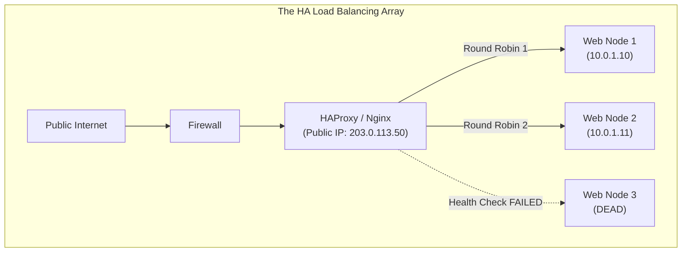
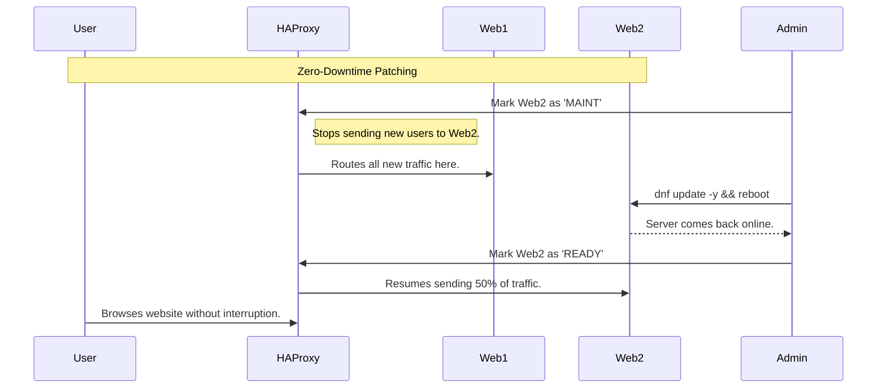

# CHAPTER 59 — LOAD BALANCING (HAPROXY / NGINX)

---

## 1. Introduction

### Why This Topic Exists
A single Linux server, no matter how powerful, has a physical limit. If a viral news event brings 1 million visitors to a website in 10 minutes, a single server will exhaust its RAM, max out its CPU, and crash. The only way to survive massive scale is **Horizontal Scaling**—adding multiple identical servers. But how do 1 million visitors connect to 5 different servers simultaneously when the website only has one domain name? You use a **Load Balancer**.

### Why Linux Administrators Use It
Administrators place a Load Balancer (like **HAProxy** or **Nginx**) at the very edge of the network. The Load Balancer owns the public IP address. When 100 users connect, the Load Balancer acts like a traffic cop, sending 20 users to Server A, 20 to Server B, 20 to Server C, etc. Furthermore, if Server B catches on fire and dies, the Load Balancer instantly detects it, stops sending traffic to Server B, and routes everyone to the surviving servers. The users never even know a server died.

### Why Companies Care About It
High Availability (HA) and Zero Downtime. In enterprise environments, servers die all the time (hardware failure, network glitches). If a company has a load balancer and 3 backend servers, they can intentionally shut down Server 1, install Linux security patches, reboot it, and bring it back online. They repeat this for Server 2 and 3. The company has completely patched their infrastructure with **zero seconds of downtime** for the customer.

---

## 2. Learning Objectives

By the end of this chapter, you will be able to:
- Explain Horizontal Scaling and Single Points of Failure.
- Understand Load Balancing algorithms (Round Robin, Least Connections, Source IP Hash).
- Configure Nginx as a Layer 7 HTTP Load Balancer.
- Configure HAProxy as a Layer 4 TCP Load Balancer (for Databases).
- Implement active Health Checks to automatically remove dead servers from the pool.
- Understand the concept of "Sticky Sessions" (Session Persistence).

---

## 3. Beginner-Friendly Explanation

Think of a busy supermarket:
- **No Load Balancer:** There are 5 cash registers, but only 1 line. Everyone crowds into the single line, pushing and shoving. The cashier is overwhelmed and collapses. The store closes.
- **The Load Balancer:** A manager (HAProxy) stands at the front of the store. When a customer walks up, the manager points and says, "Go to Register 1." The next customer: "Go to Register 2." 
- **Health Checks:** Register 3's credit card machine breaks. The cashier waves a red flag. The manager instantly stops sending customers to Register 3, routing them to the remaining working registers instead. The store continues operating smoothly.

---

## 4. Core Theory

### 4.1 Layer 4 vs Layer 7 Load Balancing
Load Balancers operate at different layers of the OSI model:
- **Layer 7 (Application / HTTP):** The Load Balancer actually reads the HTTP request. It can see the URL. It can say, "Ah, this user wants `/video/`. I will route them to the specialized Video servers." Nginx and HAProxy both excel at this.
- **Layer 4 (Transport / TCP):** The Load Balancer is blind. It doesn't know if the traffic is HTTP, MySQL, or SSH. It just sees raw TCP packets and blindly forwards them to a backend server. This is blisteringly fast and is heavily used for load balancing Databases. HAProxy is the undisputed king of Layer 4.

### 4.2 The Algorithms
How does the Load Balancer choose which server gets the next user?
- **Round Robin:** (Default). Deals them out like a deck of cards. 1, 2, 3, 1, 2, 3. Simple and effective.
- **Least Connections:** Sends the user to the server that currently has the fewest active connections. Excellent for applications where some users stay connected for 5 minutes and others disconnect instantly.
- **Source IP Hash:** Mathematical trick. Takes the user's IP address, runs it through a hash function, and assigns them to a server. That specific user will *always* go to the exact same server every single time they visit.

### 4.3 Sticky Sessions (Session Persistence)
Imagine a user logs into a shopping cart on Server A. If they click "Checkout" and the Load Balancer (using Round Robin) sends their next click to Server B, Server B says "I don't know who you are, please log in." The user's session is broken.
To fix this, the Load Balancer injects a tracking Cookie into the user's browser. The Load Balancer reads this cookie on every click to ensure the user "sticks" to the server that holds their login data.

---

## 5. Internal Working

### Health Checks
A Load Balancer is useless if it sends a user to a dead server.
- **Passive Checks:** The Load Balancer sends a user to Server 1. Server 1 times out. The Load Balancer says, "Oops, Server 1 must be dead," marks it as Down, and sends the user to Server 2. (The first user experiences a delay).
- **Active Checks:** The Load Balancer aggressively pings all backend servers every 2 seconds. If Server 1 fails the ping, it is instantly marked Down. No users are ever sent to it. Nginx (Open Source) only does Passive checks. HAProxy does Active checks out of the box.

---

## 6. Production Architecture



---

## 7. Command-by-Command Explanation

### 7.1 `dnf install haproxy`
- **Purpose:** Installs the HAProxy load balancer daemon.

### 7.2 `haproxy -c -f /etc/haproxy/haproxy.cfg`
- **Purpose:** **CRITICAL COMMAND.** Checks the syntax of the HAProxy configuration file. If it returns "Configuration file is valid", it is safe to reload.

### 7.3 `systemctl reload haproxy`
- **Purpose:** Gracefully reloads HAProxy. Existing connections are maintained, new connections use the new configuration.

---

## 8. Syntax Breakdown

**Nginx as a Layer 7 HTTP Load Balancer (`/etc/nginx/nginx.conf`)**

```nginx
# 1. Define the pool of backend servers
upstream backend_cluster {
    # ip_hash;  <-- Uncomment to enable Sticky Sessions
    server 10.0.1.10:8080 weight=3;
    server 10.0.1.11:8080;
    server 10.0.1.12:8080 down;
}

# 2. Proxy the traffic to the pool
server {
    listen 80;
    server_name www.store.com;
    
    location / {
        proxy_pass http://backend_cluster;
    }
}
```
- `weight=3`: Server .10 is a massive 32-core server. Server .11 is a tiny 4-core server. Weight tells Nginx to send 3 times as much traffic to .10.
- `down`: Manually marks a server as offline for maintenance. Nginx will stop sending it traffic instantly.

---

## 9. Syntax Breakdown 2: HAProxy

**HAProxy as a Layer 4 TCP Database Load Balancer (`/etc/haproxy/haproxy.cfg`)**

```haproxy
listen mysql_cluster
    bind *:3306
    mode tcp
    balance leastconn
    server db1 10.0.2.10:3306 check
    server db2 10.0.2.11:3306 check
```
- `mode tcp`: Do not try to read the packets as HTTP. Just forward the raw TCP data. (Required for databases).
- `balance leastconn`: The algorithm.
- `check`: The magic word. Tells HAProxy to actively health-check the servers on port 3306. If `db2` crashes, HAProxy instantly routes all database traffic to `db1`.

---

## 10. Sample Output Analysis

**Scenario:** We enable the HAProxy Web Statistics Dashboard in our config, and we visit it in a browser.

**Output (Visual Dashboard interpreted as text):**
```text
backend_web_cluster
Server   Status   LastChk  Sessions  BytesIn  BytesOut
web1     UP       L7OK     450       1.2G     4.5G
web2     UP       L7OK     448       1.1G     4.4G
web3     DOWN     L4TOUT   0         0        0
```

**Analysis:**
- **web1 / web2:** Are `UP`. The `L7OK` means HAProxy actually sent an HTTP GET request to them, and they responded with a `200 OK` status. They are receiving a perfectly balanced 450 sessions each.
- **web3:** Is `DOWN`. The `L4TOUT` means Layer 4 Timeout. The server is completely offline or the network cable is unplugged. HAProxy tried to connect to its IP address and the connection timed out. Zero traffic is being sent to it, saving the users from seeing errors.

---

## 11. Architecture Diagram

```mermaid
graph LR
    subgraph Solving the Single Point of Failure
        Internet["Internet"]
        
        subgraph Active-Passive HA Pair (Keepalived)
            LB1["Load Balancer 1 (Active)"]
            LB2["Load Balancer 2 (Standby)"]
        end
        
        Web1["Web Node 1"]
        Web2["Web Node 2"]
        
        Internet --> LB1
        Internet -.->|If LB1 dies, IP moves here| LB2
        LB1 --> Web1
        LB1 --> Web2
        LB2 -.-> Web1
        LB2 -.-> Web2
    end
```
*If you have 5 backend web servers, but only 1 Load Balancer, the Load Balancer itself is a Single Point of Failure (SPOF). In true enterprise environments, you run TWO Load Balancers tied together with a Floating IP address (using a tool like `keepalived`).*

---

## 12. Workflow Diagram



---

## 13. Real Production Examples

### The Read-Replica Database Balancer
A web application reads a massive amount of data from a MySQL database, overloading it. The database admin creates 3 "Read-Replica" MySQL servers.
The Linux admin installs HAProxy on the web server itself. They configure HAProxy to listen on local port `3306` (TCP mode), and balance across the 3 Read-Replicas.
The web application is told to connect to `localhost:3306`. The application has no idea it is talking to a load balancer. HAProxy receives the query and silently balances it across the 3 replicas, tripling the database read speed without rewriting a single line of application code.

### Rate Limiting and DDoS Protection
A hacker tries to brute-force a login page by sending 5,000 requests per second.
The admin configures HAProxy (or Nginx) to enforce Rate Limiting: "If a single IP address makes more than 10 requests per second, block them for 5 minutes."
The Load Balancer absorbs the attack at the edge of the network. The backend Web and Database servers never even see the malicious traffic, remaining perfectly stable for legitimate users.

---

## 14. Common Mistakes

1. **Forgetting to share session state** — A developer builds a shopping cart that stores items in the server's local RAM. They put the app behind a Round-Robin Load Balancer. A user puts shoes in their cart (handled by Server A). They click checkout, the LB sends them to Server B, and their cart is empty! **Fix:** The developer must store sessions in a centralized database (like Redis), OR the administrator must enable Sticky Sessions (`ip_hash`).
2. **Losing the Client IP Address** — When a Load Balancer forwards traffic to a backend web server, the backend server sees the traffic coming from the *Load Balancer's IP address*, not the real customer's IP. If the backend server gets hacked, the logs just show the Load Balancer's IP! **Fix:** The Load Balancer MUST inject the `X-Forwarded-For` HTTP header, and the backend Apache/Nginx must be configured to extract and log that header instead of the raw TCP IP.
3. **Misconfiguring the Health Check URI** — If you tell HAProxy to check `http://server/`, but the developer configured the homepage to instantly return an HTTP `301 Redirect` to `/login`, HAProxy sees the `301` as a failure (it expects a `200 OK`). HAProxy marks all servers as DOWN and the entire site goes offline. Ensure health checks point to a dedicated, simple `/health.html` file that always returns `200 OK`.

---

## 15. Best Practices

- **SSL Offloading:** Do not make your 5 backend Tomcat servers handle SSL encryption. It wastes massive CPU cycles. Install the SSL Certificate *only* on the Load Balancer. The Load Balancer handles the heavy cryptographic math with the internet (HTTPS: 443), and then proxies the decrypted traffic to the backend servers over the internal private network via plain, unencrypted HTTP (Port 80/8080).

---

## 16. Security Considerations

- **Private Backends:** The 5 backend web servers should NEVER have Public IP addresses. They should sit on a Private Subnet (e.g., `10.0.0.x`) with no direct access from the internet. Only the Load Balancer should have a Public IP. This ensures hackers absolutely must pass through your Load Balancer (where your firewalls and rate-limits are enforced).

---

## 17. Performance Considerations

- **File Descriptors (ulimit):** A Load Balancer requires two open network sockets for every user (one facing the user, one facing the backend server). In Linux, network sockets are treated as files. By default, Linux limits a process to 1,024 open files. If you hit 500 users, HAProxy hits the limit and crashes. You must configure the OS to allow HAProxy to open `65535` or more file descriptors (using `/etc/security/limits.conf` or the systemd unit file).

---

## 18. Troubleshooting Guide

| Symptom | Root Cause | Resolution |
|:---|:---|:---|
| `502 Bad Gateway` | No backend servers available | All servers failed health checks, or the backend service is stopped. |
| Backend logs show LB IP, not Client IP | Missing `X-Forwarded-For` | Configure the LB to inject the header, and the backend to log it. |
| Users complain they are randomly logged out | Sessions aren't sticky | Enable `ip_hash` (Nginx) or `cookie` persistence (HAProxy). |
| HAProxy won't start (`Cannot bind to port`) | Port in use or SELinux | Check `ss -tulpn`. Check SELinux boolean `haproxy_connect_any`. |

---

## 19. Practical Labs

**Lab 59.1:** Setting up Nginx Load Balancing
1. Install Nginx: `sudo dnf install nginx -y`
2. We will simulate two backend servers using python:
   - `mkdir /tmp/web1 /tmp/web2`
   - `echo "Server 1" > /tmp/web1/index.html`
   - `echo "Server 2" > /tmp/web2/index.html`
   - Open Terminal 2: `cd /tmp/web1 && python3 -m http.server 8081`
   - Open Terminal 3: `cd /tmp/web2 && python3 -m http.server 8082`
3. Edit Nginx config: `/etc/nginx/conf.d/lb.conf`
```nginx
upstream my_cluster {
    server 127.0.0.1:8081;
    server 127.0.0.1:8082;
}
server {
    listen 80;
    location / { proxy_pass http://my_cluster; }
}
```
4. Reload Nginx: `sudo systemctl reload nginx`
5. Test it: `curl http://localhost`. Run it multiple times.
6. You will see the output alternate: "Server 1", "Server 2", "Server 1", "Server 2". You have built a Round-Robin Load Balancer!

---

## 20. Mini Project

The Failover Test.
1. With the Nginx lab above running, go to Terminal 2 (running Server 1 on 8081) and press `Ctrl+C` to kill it. You just simulated a catastrophic server failure.
2. Go back to Terminal 1 and run `curl http://localhost` 10 times quickly.
3. Nginx realizes Server 1 is dead. It seamlessly sends all 10 requests to "Server 2". The end-user (you) never experienced an error page. You have achieved High Availability.

---

## 21. Assignments

1. What is the difference between a Layer 4 and a Layer 7 load balancer?
2. Why is SSL Offloading considered a best practice in load-balanced environments?
3. Explain the concept of a "Single Point of Failure" (SPOF) in the context of a single Load Balancer.

---

## 22. Interview Questions

### Basic
1. **Q: You have 5 web servers. You want to distribute traffic evenly among them so no single server gets overwhelmed. What technology do you deploy?**
   A: A Load Balancer (like HAProxy or Nginx).

2. **Q: What is the default algorithm most load balancers use to distribute traffic?**
   A: Round Robin.

### Intermediate
3. **Q: You place a Load Balancer in front of three web servers. The developers complain that users add items to their shopping cart, but when they navigate to the checkout page, the cart is empty. What is happening and how do you fix it?**
   A: The Load Balancer is distributing the user's requests across different servers. The user adds an item on Server A (which saves it in local RAM), but the checkout click is routed to Server B (which has empty RAM). I must configure the Load Balancer to use "Sticky Sessions" (Session Persistence) via IP Hashing or Cookie injection, so a user is locked to the same server for the duration of their session.

4. **Q: You want to load balance raw database traffic (TCP Port 3306). Should you use Nginx or HAProxy, and at what OSI layer must you configure it?**
   A: I should use HAProxy configured for Layer 4 (TCP mode). (Note: Modern Nginx *can* do stream/TCP load balancing, but HAProxy is the industry standard purpose-built for raw TCP/Database routing).

### Scenario-Based
5. **Q: Your company's infrastructure team implements a strict security policy: Backend web servers must ONLY log the true IP address of the customer making the request. You install a Load Balancer. You look at the backend Apache logs, and every single log entry shows the IP address of the Load Balancer, not the customer. How do you satisfy the security policy?**
   A: Because the Load Balancer is acting as a proxy, it initiates a brand new TCP connection with the backend server, natively hiding the customer's IP. To fix this, I must configure the Load Balancer (Layer 7) to read the customer's IP and inject it into a new HTTP header called `X-Forwarded-For`. Then, I must configure the backend Apache servers to ignore the TCP connection IP, and instead parse and log the `X-Forwarded-For` HTTP header.

---

## 23. Chapter Summary and Quick Revision Notes

- **Horizontal Scaling:** Adding more servers to handle infinite scale.
- **Load Balancer:** The traffic cop distributing traffic to backend nodes.
- **Layer 7 (HTTP):** Can route based on URLs. Can inject Cookies/Headers.
- **Layer 4 (TCP):** Blind, raw speed. Perfect for Databases.
- **Algorithms:** Round Robin (Even), Least Connections, Source IP Hash (Sticky).
- **Health Checks:** Automatically remove dead servers from the rotation.
- **X-Forwarded-For:** The HTTP header used to preserve the true Client IP address.

---

## 24. Cheat Sheet

| Nginx Configuration | HAProxy Configuration | Purpose |
|:---|:---|:---|
| `upstream cluster { }` | `backend cluster` | Define the pool of servers |
| `server 10.0.1.10;` | `server web1 10.0.1.10 check` | Add a node (HAProxy 'check' enables health monitoring) |
| `ip_hash;` | `balance source` | Enable Sticky Sessions |
| `proxy_pass http://cluster;` | `default_backend cluster` | Route traffic to the pool |
