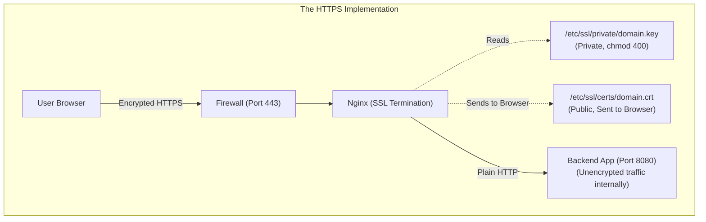
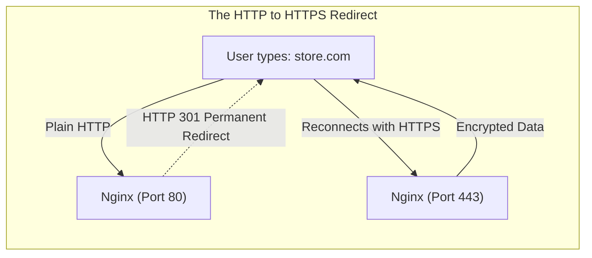
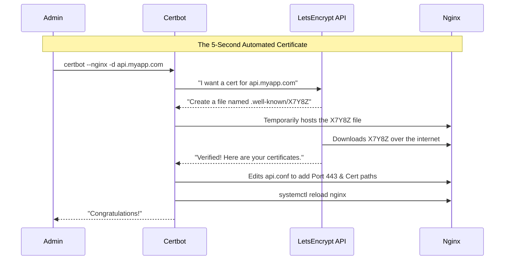

# CHAPTER 60 — SSL/TLS CERTIFICATES AND LET'S ENCRYPT

---

## 1. Introduction

### Why This Topic Exists
The internet was built on plain text. If you log into a website using standard HTTP (Port 80), your username, your password, and your credit card number travel across dozens of public internet routers in plain, readable English. Anyone sitting in a coffee shop with a packet sniffer can steal them instantly. **TLS (Transport Layer Security)**, formerly known as SSL, fixes this by establishing an unbreakable, encrypted mathematical tunnel between the user's browser and the Linux server.

### Why Linux Administrators Use It
Linux administrators are responsible for securing web servers. They must generate cryptographic keys, obtain signed Certificates from a trusted Certificate Authority (CA), and configure Apache or Nginx to listen on Port 443 (HTTPS) to serve those certificates. They must also ensure that old, broken encryption protocols (like SSLv3 or TLS 1.0) are strictly disabled on the server.

### Why Companies Care About It
Mandatory Compliance and SEO. If a company runs an e-commerce site without a valid TLS certificate, Google Chrome will display a massive red "NOT SECURE" warning, terrifying customers. Furthermore, PCI-DSS compliance (the law for processing credit cards) makes it illegal to accept payments without TLS. Search engines also actively punish non-HTTPS websites in their search rankings.

---

## 2. Learning Objectives

By the end of this chapter, you will be able to:
- Explain Asymmetric Encryption (Public Key / Private Key).
- Generate a Private Key and a Certificate Signing Request (CSR) using `openssl`.
- Configure Nginx and Apache to serve an SSL/TLS Certificate on Port 443.
- Use `certbot` (Let's Encrypt) to automatically generate and renew free, trusted certificates.
- Implement an HTTP-to-HTTPS redirect.

---

## 3. Beginner-Friendly Explanation

Think of a secure bank deposit box:
- **Asymmetric Encryption:** You have a padlock (The Public Key) and a physical key (The Private Key). You can make 1,000 copies of the padlock and give them to anyone. If a customer wants to send you a secret message, they put it in a box and snap your padlock shut. Now, *no one in the world* can open the box—not even the customer who just locked it. Only YOU have the Private Key to open it.
- **The Certificate Authority (CA):** How does the customer know the padlock they are using actually belongs to you, and not a hacker in disguise? The government (The CA) stamps your padlock with a holographic seal of authenticity (The Certificate).
- **Let's Encrypt:** In the old days, you had to pay the government $200 a year for that holographic seal. Today, a non-profit called Let's Encrypt uses a robot to verify your identity and gives you the seal for free, in 5 seconds.

---

## 4. Core Theory

### 4.1 The Three Files of SSL
To configure a web server for HTTPS, you always need three distinct mathematical components:
1. **The Private Key (`.key`):** The most highly classified file on your server. If a hacker steals this, they can decrypt all your traffic. It must be owned by `root` with `400` permissions.
2. **The Certificate (`.crt` or `.pem`):** The public "holographic seal." This is sent to every web browser that connects to your server.
3. **The CA Chain / Intermediate:** A file that proves that the CA who signed your certificate is legitimate. (Modern systems often bundle this into the `.crt` file).

### 4.2 How Let's Encrypt (Certbot) Works
Let's Encrypt provides free certificates, but they expire every 90 days. You cannot manage this manually. You install a tool called **Certbot** on your Linux server. 
When you run Certbot, it talks to the Let's Encrypt API. Let's Encrypt says, "Prove you actually own `www.example.com`. Put a secret code in your `/var/www/html` folder." Certbot automatically creates the secret code. Let's Encrypt downloads it, verifies it, and instantly issues the Certificate. Certbot then automatically adds a `cron` job to renew it every 60 days.

### 4.3 SSL is Dead. Long Live TLS.
"SSL" (Secure Sockets Layer) was invented in the 1990s. It was completely broken by hackers years ago. The modern, secure protocol is "TLS" (Transport Layer Security). Specifically, **TLS 1.2** and **TLS 1.3** are the only protocols considered secure today. Even though the technology is technically TLS, the IT industry still colloquially refers to them as "SSL Certificates."

---

## 5. Internal Working

### The Handshake
When a browser connects to Port 443, it performs a "TLS Handshake." The server sends the browser its Public Key (Certificate). The browser verifies the Certificate is signed by a trusted authority (like DigiCert or Let's Encrypt). The browser then uses the Public Key to encrypt a temporary, super-fast "Symmetric Key" and sends it back to the server. For the rest of the session, the server and browser use that symmetric key to encrypt the data.

---

## 6. Production Architecture



---

## 7. Command-by-Command Explanation

### 7.1 `openssl genrsa -out server.key 2048`
- **Purpose:** Generates a 2048-bit RSA Private Key. This is step 1 of manually acquiring a certificate.

### 7.2 `openssl req -new -key server.key -out server.csr`
- **Purpose:** Generates a Certificate Signing Request (CSR). You send this `.csr` text file to a commercial Certificate Authority (like Verisign or GoDaddy). They use it to generate your final `.crt` certificate file.

### 7.3 `dnf install certbot python3-certbot-nginx`
- **Purpose:** Installs the Let's Encrypt automated robot (`certbot`) and the plugin that allows it to automatically edit your Nginx configuration files.

### 7.4 `certbot --nginx -d www.store.com`
- **Purpose:** **The Magic Command.** Certbot automatically talks to Let's Encrypt, proves you own `www.store.com`, downloads the certificates, edits your Nginx config to enable Port 443, and restarts Nginx. All in 5 seconds.

---

## 8. Syntax Breakdown

**Configuring Nginx for HTTPS Manually (`/etc/nginx/conf.d/secure.conf`)**

```nginx
server {
    listen 443 ssl;
    server_name www.secure.com;

    ssl_certificate /etc/ssl/certs/secure_com.crt;
    ssl_certificate_key /etc/ssl/private/secure_com.key;

    # Enforce modern protocols (Disable broken TLS 1.0 / 1.1)
    ssl_protocols TLSv1.2 TLSv1.3;
    
    location / {
        root /var/www/html;
    }
}
```
- `listen 443 ssl`: Port 443 is the standard HTTPS port. The `ssl` flag tells Nginx to expect encrypted handshakes, not plain text.
- `ssl_certificate`: Points to the public file.
- `ssl_certificate_key`: Points to the highly classified private key.

---

## 9. Parameter Explanation

| Certbot Command | Purpose |
|:---|:---|
| `certbot renew --dry-run` | Tests the automated renewal cron job without actually renewing the certificate. Always run this after setting up Certbot! |
| `certbot certonly --webroot -w /var/www/html -d my.site.com` | Tells Certbot to just get the certificate and put it on the hard drive, but DO NOT automatically edit the Nginx/Apache configuration files. (Used by advanced admins who want strict control). |

---

## 10. Sample Output Analysis

**Scenario:** An administrator runs `openssl req -new` to generate a CSR for a commercial certificate.
**Command:** `openssl req -new -key mydomain.key -out mydomain.csr`

**Output:**
```text
You are about to be asked to enter information that will be incorporated
into your certificate request.
Country Name (2 letter code) [XX]:US
State or Province Name (full name) []:New York
Locality Name (eg, city) [Default City]:New York City
Organization Name (eg, company) [Default Company Ltd]:TechCorp Inc.
Organizational Unit Name (eg, section) []:IT Security
Common Name (eg, your name or your server's hostname) []:www.techcorp.com
Email Address []:admin@techcorp.com
```

**Analysis:**
- When you generate a manual CSR, you must fill out the corporate identity information. 
- **Common Name (CN):** **CRITICAL.** This MUST exactly match the URL the user types into their browser (e.g., `www.techcorp.com`). If you type `TechCorp` here, the browser will look at the certificate, see the names don't match, assume you are a hacker spoofing the site, and throw a massive security warning.

---

## 11. Architecture Diagram


*Users never type `https://` manually. Your server must listen on plain Port 80 for the sole purpose of bouncing the user over to the secure Port 443.*

---

## 12. Workflow Diagram



---

## 13. Real Production Examples

### The Self-Signed Certificate
You are building an internal company dashboard (`10.0.5.50`). Because it is not on the public internet, Let's Encrypt cannot reach it to verify it. You don't want to pay a commercial CA. You generate a "Self-Signed" certificate.
`openssl req -x509 -nodes -days 365 -newkey rsa:2048 -keyout internal.key -out internal.crt`
You configure Nginx to use it. The traffic is now 100% mathematically encrypted!
*The catch:* Because it isn't signed by a recognized CA (you signed it yourself), Chrome will throw a "Your connection is not private" warning. Employees must click "Advanced -> Proceed anyway". This is acceptable for internal tools, but completely unacceptable for public websites.

### The Redirect Block
To force all users to use encryption, the administrator configures a dedicated Port 80 server block in Nginx:
```nginx
server {
    listen 80;
    server_name www.store.com;
    # 301 is a Permanent Redirect. It tells the browser to use HTTPS.
    return 301 https://$host$request_uri;
}
```

---

## 14. Common Mistakes

1. **Letting the Certificate Expire** — If a commercial certificate expires, the website dies. Always set calendar reminders for commercial certificates 30 days before expiration. If using Let's Encrypt, always verify `systemctl list-timers` to ensure the `certbot-renew.timer` is actively running.
2. **Blocking Port 80 in the Firewall** — After setting up HTTPS on Port 443, a junior admin thinks, "I don't need plain HTTP anymore," and runs `firewall-cmd --remove-service=http`. **Disaster.** If Port 80 is blocked, Let's Encrypt cannot verify your domain ownership when it tries to renew the certificate 60 days later. Furthermore, users typing `store.com` will time out before they even reach your HTTPS redirect. Leave Port 80 open!
3. **Mishandling the Private Key** — If you email the `.key` file to a coworker, your server is compromised. If you commit the `.key` file to a public GitHub repository, your server is compromised. The `.key` file should never leave the server it was generated on.

---

## 15. Best Practices

- **HSTS (HTTP Strict Transport Security):** Once you have HTTPS working perfectly, you should inject the HSTS header into your Nginx/Apache configuration. This header tells the browser: "For the next 1 year, NEVER attempt to contact this domain over plain HTTP. Even if the user types `http://`, the browser must internally upgrade it to `https://` before sending the packet." This prevents downgrade attacks.
- **Mozilla SSL Configuration Generator:** Never guess which SSL protocols and ciphers are safe. Go to Google, search for "Mozilla SSL Configuration Generator", put in your Nginx/Apache version, and copy-paste their exact configurations to ensure you score an "A+" on security audits.

---

## 16. Security Considerations

- **Wildcard Certificates:** A Wildcard certificate (`*.company.com`) is valid for `api.company.com`, `shop.company.com`, and `mail.company.com`. They are incredibly convenient. However, if one server gets hacked and the wildcard Private Key is stolen, *every single subdomain* in the company is compromised. In highly secure environments, issue unique certificates for every individual server.

---

## 17. Performance Considerations

- **SSL Termination / Offloading:** Cryptographic math consumes heavy CPU cycles. If you have 5 backend web servers, do not configure SSL on all 5 of them. Put an Nginx Load Balancer in front. Configure the Load Balancer to terminate the SSL on Port 443 (handling the heavy math). The Load Balancer then talks to the 5 backend servers over plain Port 80 on the private network.

---

## 18. Troubleshooting Guide

| Symptom | Root Cause | Resolution |
|:---|:---|:---|
| Browser says "Not Secure" (Red Line) | Expired or Self-Signed Cert | Renew the certificate or buy a commercial one. |
| Browser says "Mixed Content Warning" | HTTPS page loads HTTP images | The HTML code has hardcoded `http://` image links. Developers must fix the HTML code to use `https://`. |
| Certbot fails: "Timeout during connect" | Port 80 is blocked or DNS is wrong | Ensure Port 80 is open and the DNS A-Record points to the server's public IP. |
| Nginx fails: "no ssl_certificate is defined" | Missing paths | Ensure both the `.crt` and `.key` directives exist inside the `listen 443 ssl` block. |

---

## 19. Practical Labs

**Lab 60.1:** Self-Signed Certificates
1. Install Nginx: `sudo dnf install nginx -y`
2. Create a folder for the certs: `sudo mkdir /etc/nginx/ssl`
3. Generate a Self-Signed Cert (valid for 365 days):
   `sudo openssl req -x509 -nodes -days 365 -newkey rsa:2048 -keyout /etc/nginx/ssl/self.key -out /etc/nginx/ssl/self.crt`
   (Press Enter through all the identity questions).
4. Edit `/etc/nginx/conf.d/secure.conf`:
```nginx
server {
    listen 443 ssl;
    server_name localhost;
    ssl_certificate /etc/nginx/ssl/self.crt;
    ssl_certificate_key /etc/nginx/ssl/self.key;
    location / { root /usr/share/nginx/html; }
}
```
5. `sudo nginx -t`
6. `sudo systemctl reload nginx`
7. Test it: `curl -k https://localhost` (The `-k` flag tells curl to ignore the fact that the certificate is self-signed/untrusted).

---

## 20. Mini Project

The Qualys SSL Test.
If you have a server with a public domain name and a valid Let's Encrypt certificate:
1. Open your web browser and go to `https://www.ssllabs.com/ssltest/`
2. Enter your domain name and run the scan.
3. This is the industry-standard tool for auditing TLS security. It will grade your server from A+ to F.
4. If you score a 'B' or 'C', scroll down. It will tell you exactly which outdated, vulnerable protocols (like TLS 1.0) your Nginx server is accidentally supporting. You then update `ssl_protocols` in your config and re-test until you get an A.

---

## 21. Assignments

1. Why must the `.key` file be strictly protected with `chmod 400`, while the `.crt` file can be read by anyone?
2. What role does Port 80 play on a server that forces all users to use HTTPS (Port 443)?
3. Explain why Certbot requires your server to be accessible from the public internet in order to issue a certificate.

---

## 22. Interview Questions

### Basic
1. **Q: What command-line tool is used universally in Linux to generate Private Keys and Certificate Signing Requests (CSR)?**
   A: `openssl`

2. **Q: You want to secure a website for free, automatically. What tool and service do you use?**
   A: Certbot, provided by Let's Encrypt.

### Intermediate
3. **Q: You run `certbot --nginx -d example.com`. It fails with a timeout error. You verify that the server is online and you can SSH into it. What are the two most likely reasons Certbot failed?**
   A: 1) The DNS 'A' record for `example.com` does not point to the public IP address of the server. 2) The server's firewall (or cloud security group) is blocking incoming traffic on Port 80, which Let's Encrypt requires to verify domain ownership.

4. **Q: A developer asks you to install an SSL certificate on a Tomcat server. You advise against configuring SSL directly inside Tomcat. What do you recommend instead?**
   A: I recommend "SSL Termination" (or SSL Offloading). I will place an Nginx reverse proxy in front of Tomcat. Nginx will handle the SSL certificates and encryption on Port 443, and then forward the decrypted traffic to Tomcat over Port 8080. This is vastly easier to manage and performs better.

### Scenario-Based
5. **Q: You buy a commercial certificate. The vendor emails you a `.zip` file containing `yourdomain.crt` and `intermediate-ca.crt`. You configure Nginx to use `yourdomain.crt`. It works fine in Google Chrome on your laptop, but users on older Android phones complain the site is untrusted. What did you configure wrong?**
   A: I failed to bundle the Intermediate CA chain. Chrome is smart enough to fetch missing intermediate certificates from the internet, but strict or older clients (like Android or `curl`) will reject the connection because they cannot verify the entire chain of trust back to the Root CA. To fix this in Nginx, I must concatenate the two files into a single bundle: `cat yourdomain.crt intermediate-ca.crt > fullchain.crt`, and configure Nginx to serve the `fullchain.crt`.

---

## 23. Chapter Summary and Quick Revision Notes

- **TLS/SSL:** Encrypts data between the browser and server.
- **Private Key (`.key`):** Highly secret. Decrypts data.
- **Public Certificate (`.crt`):** Public seal of authenticity. Sent to browsers.
- **CSR:** Generated via `openssl`. Given to a commercial CA to buy a cert.
- **Let's Encrypt / Certbot:** Free, automated certificates valid for 90 days.
- **Port 443:** The standard HTTPS port.
- **Port 80 Redirect:** Always keep Port 80 open to bounce users to Port 443.
- **SSL Termination:** Offloading SSL encryption to a proxy (Nginx) instead of the backend app.

---

## 24. Cheat Sheet

| Command / Config | Purpose |
|:---|:---|
| `openssl genrsa -out key 2048` | Generate a Private Key |
| `openssl req -new -key key -out csr` | Generate a CSR |
| `certbot --nginx -d domain.com` | Auto-install Let's Encrypt |
| `certbot renew --dry-run` | Test the automated renewal |
| `listen 443 ssl;` | Nginx directive for HTTPS |
| `return 301 https://$host$request_uri;` | Nginx directive for HTTP->HTTPS redirect |
