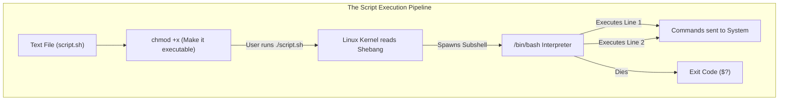
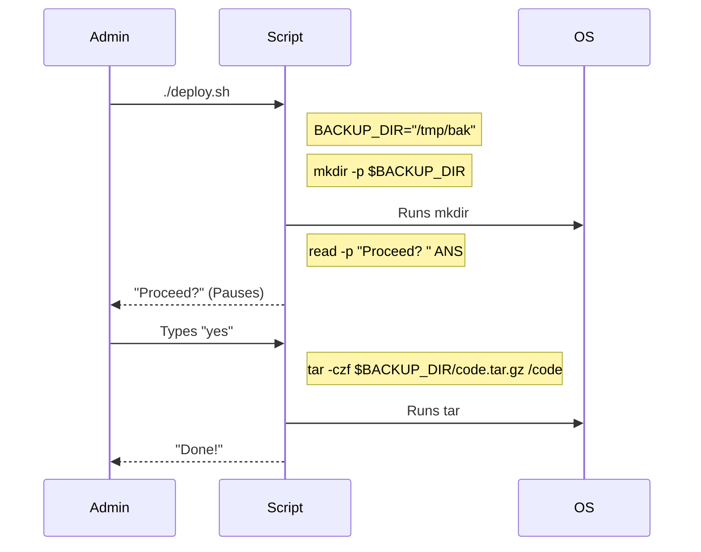

# CHAPTER 61 — BASH SCRIPTING BASICS (VARIABLES, I/O)

---

## 1. Introduction

### Why This Topic Exists
A Linux Administrator who only types commands manually is not an administrator; they are a typist. If you need to create 500 user accounts, typing `useradd` 500 times is a massive waste of time and highly prone to human error. **Bash Scripting** allows you to take any command you would normally type into the terminal, place it into a text file, and execute that file to run all the commands automatically. It is the absolute foundation of Linux automation.

### Why Linux Administrators Use It
Administrators write Bash scripts to automate repetitive tasks: daily database backups, rotating log files, syncing data to offsite servers, or generating weekly system health reports. Instead of waking up at 3:00 AM to run a backup command, the administrator writes a 5-line script and schedules it to run automatically while they sleep.

### Why Companies Care About It
Efficiency and Consistency. If a company hires a new developer, it takes a human 45 minutes to manually create their user account, set up their SSH keys, create their home directory, and assign them to 10 different groups. A Bash script does the exact same process in 0.5 seconds, and it does it *perfectly* every single time, eliminating the risk of a typo granting the wrong permissions.

---

## 2. Learning Objectives

By the end of this chapter, you will be able to:
- Create, make executable, and run a Bash script.
- Understand the importance of the "Shebang" (`#!/bin/bash`).
- Define, assign, and use custom Variables.
- Use special built-in variables (`$1`, `$#`, `$?`).
- Capture input from the user using the `read` command.
- Understand the critical difference between Single Quotes (`'`) and Double Quotes (`"`).

---

## 3. Beginner-Friendly Explanation

Think of a Bash script like a Recipe:
- **The Terminal:** Cooking by memory. You grab flour, you grab eggs, you mix them.
- **The Script:** A written recipe card. 
  1. *Step 1: Put 2 cups of flour in the bowl.*
  2. *Step 2: Add 3 eggs.*
  3. *Step 3: Stir.*
You hand the recipe card to a robot (The Bash Interpreter). The robot reads the card from top to bottom and executes every step instantly. If you need 500 cakes, you just tell the robot to read the card 500 times.

---

## 4. Core Theory

### 4.1 The Shebang (`#!/bin/bash`)
The very first line of *every* script must be the Shebang. `#!` tells the Linux Kernel, "The file you are about to read is a script." `/bin/bash` tells the Kernel, "Hand this text to the Bash interpreter to process." If you wrote a Python script, the shebang would be `#!/usr/bin/python3`. Without a shebang, Linux might try to run the file using the wrong interpreter, causing it to crash.

### 4.2 Variables
A variable is a temporary box in RAM where you store data. 
- You put data in the box: `NAME="Alice"`
- You take data out of the box using the `$` symbol: `echo "Hello $NAME"`
In Bash, variables are completely untyped. You don't have to specify if a variable is an Integer or a String; Bash figures it out on the fly.

### 4.3 Quotes (The Most Common Trap)
- **Double Quotes (`" "`):** "Weak" quotes. They allow variables to expand. `echo "Hello $NAME"` prints `Hello Alice`.
- **Single Quotes (`' '`):** "Strong" quotes. They treat every character literally. `echo 'Hello $NAME'` prints the literal text `Hello $NAME`.

### 4.4 Positional Parameters (Arguments)
Scripts are powerful because they can take input when you run them. If you run a script like this: `./create_user.sh bob developer`
Inside the script, Bash automatically assigns those words to special variables:
- `$0` = The name of the script (`./create_user.sh`)
- `$1` = The first argument (`bob`)
- `$2` = The second argument (`developer`)

---

## 5. Internal Working

### The Execution Subshell
When you run a script by typing `./myscript.sh`, your current terminal shell does *not* execute the script. It spawns a brand new, temporary "child" shell (a Subshell), runs the script inside the child, and when the script finishes, the child shell dies. This protects your main terminal. If the script defines a variable `X=10`, that variable vanishes when the script ends; it does not bleed into your main terminal.

---

## 6. Production Architecture



---

## 7. Command-by-Command Explanation

### 7.1 `nano backup.sh`
- **Purpose:** Creates the text file using a text editor.

### 7.2 `chmod +x backup.sh`
- **Purpose:** By default, Linux creates text files with Read/Write permissions, but NOT Execute permissions. A script is useless if the system refuses to run it. You must add the `x` (execute) bit before it will work.

### 7.3 `./backup.sh`
- **Purpose:** Runs the script. The `./` tells the shell, "The script is right here in my Current Directory, do not go searching the `$PATH` for it."

### 7.4 `read -p "Enter username: " USERNAME`
- **Purpose:** Pauses the script and waits for the user to type something on the keyboard. Whatever they type is saved into the variable `$USERNAME`.

---

## 8. Syntax Breakdown

**A Complete Basic Script**

```bash
#!/bin/bash
# This is a comment. The system ignores it.

# Define variables (NO SPACES around the equals sign!)
BACKUP_DIR="/data/backups"
TARGET="/var/www/html"
TODAY=$(date +%F)

echo "Starting backup of $TARGET..."

# Execute a command using the variables
tar -czf "$BACKUP_DIR/website_$TODAY.tar.gz" "$TARGET"

echo "Backup complete!"
```
*Note the `$(command)` syntax. This is called **Command Substitution**. It runs the `date` command and shoves the output of that command directly into the `TODAY` variable.*

---

## 9. Parameter Explanation

| Special Variable | Meaning | Example Use Case |
|:---|:---|:---|
| `$1, $2, $3` | Positional Arguments | Passing a username to the script from the command line. |
| `$#` | Number of arguments | Checking if the user forgot to pass an argument (`if [ $# -eq 0 ]`). |
| `$?` | The Exit Status of the last command | Checking if the previous `ping` command succeeded (0) or failed (1-255). |
| `$USER` | The user running the script | Standardizing paths: `/home/$USER/downloads` |
| `$$` | The PID (Process ID) of the script | Creating unique temporary files: `/tmp/tempfile_$$` |

---

## 10. Sample Output Analysis

**Scenario:** We have a script named `greet.sh`. It contains `echo "Hello $1, you are in $2"`.
**Command:** `./greet.sh Alice Accounting`

**Output:**
```text
Hello Alice, you are in Accounting
```

**Analysis:**
- The script successfully parsed the command line.
- `$1` was replaced by the first word, `Alice`.
- `$2` was replaced by the second word, `Accounting`.
- If the user had run `./greet.sh "Alice Smith" Accounting`, the quotes would force Bash to treat "Alice Smith" as a single block of text, assigning the whole thing to `$1`.

---

## 11. Architecture Diagram

```mermaid
graph LR
    subgraph The Variable Trap (Spaces)
        Good["NAME='Bob'<br/>(Success)"]
        Bad1["NAME = 'Bob'<br/>(Error: 'NAME' command not found)"]
        Bad2["NAME= 'Bob'<br/>(Error: 'Bob' command not found)"]
        
        Good --> Valid["Bash assigns the variable"]
        Bad1 -.-> Fail1["Bash thinks 'NAME' is a program"]
        Bad2 -.-> Fail2["Bash tries to execute 'Bob'"]
    end
```
*In Python or Java, `NAME = "Bob"` is correct. In Bash, spaces around the `=` will instantly break your script.*

---

## 12. Workflow Diagram



---

## 13. Real Production Examples

### The Wrapper Script
An administrator wants to use `rsync` to back up files, but the specific `rsync` command they need is 150 characters long, involving specific SSH keys and exclude flags. No human can type it from memory.
They create `sync_to_cloud.sh`:
```bash
#!/bin/bash
rsync -avz -e "ssh -i /root/.ssh/cloud_key" --exclude '*.tmp' /data/ root@10.0.5.50:/backup/data/
```
Now, instead of typing 150 characters, the admin just types `./sync_to_cloud.sh`. The script "wraps" the complex command into a simple one.

### Using `$?` to Detect Failure
An administrator writes a script that shuts down a database, runs a backup, and restarts the database. If the backup fails (the hard drive is full), the script must NOT restart the database, otherwise data corruption occurs.
```bash
#!/bin/bash
systemctl stop mysql
tar -czf /backups/db.tar.gz /var/lib/mysql

if [ $? -eq 0 ]; then
    echo "Backup succeeded. Restarting DB."
    systemctl start mysql
else
    echo "CRITICAL: Backup failed! Check disk space."
    # The database remains safely stopped.
fi
```
*(Checking `$?` is the most critical concept for writing safe, robust scripts).*

---

## 14. Common Mistakes

1. **Forgetting `chmod +x`** — You spend an hour writing a beautiful 100-line script. You type `./script.sh`. The terminal says `Permission denied`. You panic, thinking you wrote the code wrong. Your code is fine; you just forgot to make the file executable.
2. **Editing scripts in Windows Notepad** — A junior admin writes a script on their Windows laptop, saves it, and uploads it to the Linux server. When they run it, they get strange errors like `\r: command not found`. Windows uses invisible `CRLF` characters for line breaks. Linux uses `LF`. The Linux Bash interpreter trips over the Windows characters and crashes. Always write Linux scripts inside Linux (using `vim` or `nano`), or use a tool like `dos2unix` to clean the file.
3. **Using Single Quotes for Variables** — `echo 'The cost is $PRICE'` will literally print "The cost is $PRICE". If you want it to print "The cost is 50", you MUST use double quotes: `echo "The cost is $PRICE"`.

---

## 15. Best Practices

- **Always quote your variables:** If a user runs `./script.sh "Alice Smith"`, and you use the variable without quotes in your script (e.g., `touch $1`), Bash will accidentally create *two* files: one named `Alice` and one named `Smith`. If you quote the variable (`touch "$1"`), Bash creates a single file named `Alice Smith`.
- **Use `.sh` extensions:** Linux doesn't actually care about file extensions. A script could be named `backup.sh`, `backup.txt`, or just `backup`. However, naming it `.sh` tells *human* administrators exactly what the file is, and enables syntax highlighting in editors like `vim`.

---

## 16. Security Considerations

- **Storing Passwords in Scripts:** Scripts are just text files. If you write a script that connects to a database, and you hardcode `DB_PASS="supersecret123"` at the top of the script, anyone who can read the file can steal the database password. Ensure strict file permissions (`chmod 700`) so only the script owner can read the text inside the file.

---

## 17. Performance Considerations

- **Bash vs Python:** Bash is incredible for gluing Linux commands together (running `tar`, `grep`, `awk`). However, if you are doing massive mathematical calculations, complex string manipulation, or dealing with JSON data, Bash is extremely slow and clunky. For complex programming logic, switch to Python. For system administration glue, use Bash.

---

## 18. Troubleshooting Guide

| Symptom | Root Cause | Resolution |
|:---|:---|:---|
| `bash: ./script.sh: Permission denied` | Not executable | Run `chmod +x script.sh` |
| `command not found: \r` | Windows line endings | Run `dos2unix script.sh` |
| `VAR: command not found` | Spaces around `=` | Change `VAR = 5` to `VAR=5` |
| Variable prints blank | Typo in variable name | Ensure you spelled it exactly the same when calling it. |

---

## 19. Practical Labs

**Lab 61.1:** Your First Script
1. `nano hello.sh`
2. Add the code:
```bash
#!/bin/bash
echo "Welcome to the system, $USER."
echo "Today is $(date +%A)."
```
3. Save and exit.
4. Try to run it: `./hello.sh` (It will say Permission Denied).
5. Fix permissions: `chmod +x hello.sh`
6. Run it again: `./hello.sh`

**Lab 61.2:** Using Arguments and Input
1. `nano setup.sh`
2. Add the code:
```bash
#!/bin/bash
echo "Setting up workspace for $1..."
mkdir -p "/tmp/$1_workspace"
read -p "Do you want to create a README? (yes/no): " ANS
echo "You chose: $ANS"
```
3. `chmod +x setup.sh`
4. Run it: `./setup.sh Developers`

---

## 20. Mini Project

The System Info Script.
Write a script named `sysinfo.sh` that prints a nicely formatted report for management.
It should output:
1. The hostname of the server.
2. The current uptime.
3. The amount of free RAM.

*Solution:*
```bash
#!/bin/bash
echo "=== SYSTEM REPORT ==="
echo "Hostname: $(hostname)"
echo "Uptime: $(uptime -p)"
echo "RAM Free: $(free -h | grep Mem | awk '{print $4}')"
echo "====================="
```

---

## 21. Assignments

1. Why must the shebang (`#!/bin/bash`) be the absolute first line of the file, with no blank lines above it?
2. What is the difference between `$1` and `$?`?
3. In Bash, why does `NAME = "Bob"` generate a "command not found" error?

---

## 22. Interview Questions

### Basic
1. **Q: What command must you run on a newly created text file to allow Linux to execute it as a script?**
   A: `chmod +x <filename>`

2. **Q: How do you declare a variable in Bash, and how do you reference it later?**
   A: You declare it without a dollar sign (`NAME="Alice"`), and you reference it with a dollar sign (`echo $NAME`).

### Intermediate
3. **Q: A script contains the command `tar -czf backup.tar.gz /etc`. On the very next line, you want the script to check if the `tar` command succeeded or failed before proceeding. How do you do this?**
   A: I check the `$?` special variable. `$?` holds the exit status of the very last command executed. If `[ $? -eq 0 ]`, the `tar` command was successful. If it is greater than 0, the `tar` command failed.

4. **Q: A junior developer writes a script: `./delete_user.sh bob`. Inside the script, they have the command `userdel $1`. It works perfectly. The next day, they run `./delete_user.sh "bob smith"`. The script crashes, throwing an error about "too many arguments." Why, and how do you fix the script?**
   A: Because the variable was unquoted, Bash expanded `$1` into two separate words. The command became `userdel bob smith`. The `userdel` command thinks you are passing it two different users to delete, which breaks its syntax. To fix it, the script must quote the variable: `userdel "$1"`. Now Bash passes the entire string "bob smith" as a single argument.

### Scenario-Based
5. **Q: You write a script to restart a critical web service. You test it on your Ubuntu laptop, and it works flawlessly. You upload the exact same `restart.sh` file to the production RHEL server. When you run `./restart.sh`, the terminal spits out bizarre errors like `^M: bad interpreter` and completely fails. The permissions are correct (`755`). What is the problem?**
   A: The script was saved with incorrect Line Endings. Different text editors (especially Windows Notepad or certain IDEs) use `CRLF` (Carriage Return Line Feed) for line breaks, represented invisibly as `\r\n` or `^M`. Linux Bash strictly expects `LF` (`\n`). When Bash reads the shebang line ending in `^M`, it looks for an interpreter named `bash^M`, which doesn't exist. I must run `dos2unix restart.sh` (or fix the line endings in `vim`) to strip out the carriage returns.

---

## 23. Chapter Summary and Quick Revision Notes

- **Automation:** Bash scripts are just lists of commands in a text file.
- **Shebang (`#!/bin/bash`):** Must be line 1. Tells the kernel which interpreter to use.
- **`chmod +x`:** Required to make the file executable.
- **Variables:** No spaces around `=`. Read them using `$`.
- **Quotes:** Double (`"`) allows variable expansion. Single (`'`) is literal string text.
- **`$1, $2`:** Positional arguments passed from the command line.
- **`$?`:** Exit code of the last command (0 = Success, >0 = Failure).
- **`read`:** Pauses the script to grab user input.

---

## 24. Cheat Sheet

| Syntax | Purpose |
|:---|:---|
| `#!/bin/bash` | The Shebang |
| `MY_VAR="Data"` | Variable assignment (No spaces!) |
| `echo "$MY_VAR"` | Print variable (Use Double Quotes) |
| `DATE=$(date)` | Command Substitution (Save output of `date` to variable) |
| `$1` | The first word passed to the script |
| `$#` | Total number of arguments passed |
| `$?` | Exit code of last command |
| `read -p "Age? " AGE` | Prompt user for input and save it to `$AGE` |
