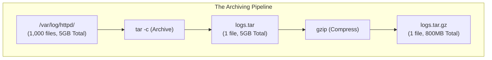
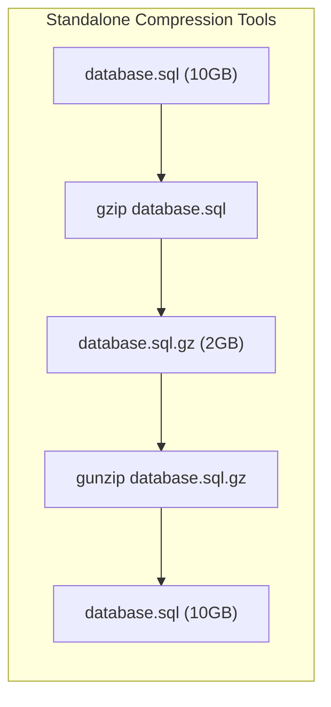
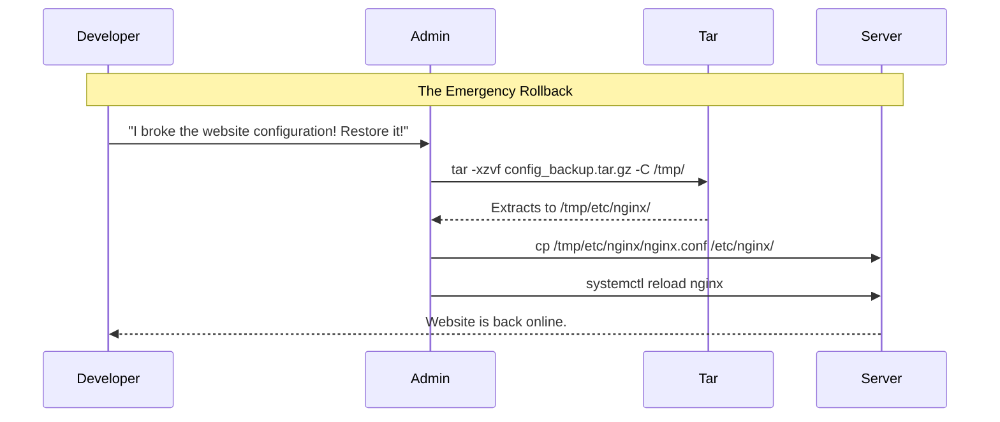

# CHAPTER 67 — TAPE ARCHIVES (TAR) AND COMPRESSION

---

## 1. Introduction

### Why This Topic Exists
In Linux, moving 10,000 tiny files across a network or uploading them to a cloud backup is incredibly slow and inefficient. Every single file requires a new network handshake. To solve this, you need a way to combine those 10,000 files into a single, neat package. Enter **`tar` (Tape Archive)**. Originally designed in the 1970s to write data linearly onto magnetic tape drives, `tar` is still the undisputed standard for packaging files in modern Linux.

### Why Linux Administrators Use It
Administrators use `tar` to bundle applications, log directories, or entire databases into a single `.tar` file. They then pair `tar` with compression algorithms (like `gzip` or `bzip2` or `xz`) to shrink that file to a fraction of its original size. The resulting file (`.tar.gz`) is the Linux equivalent of a Windows `.zip` file.

### Why Companies Care About It
Storage Costs. Enterprise servers generate terabytes of log files and database dumps every month. Storing raw text data on enterprise SAN storage or AWS S3 is incredibly expensive. By writing automated scripts that `tar` and `gzip` old data, a company can reduce their storage footprint by up to 80%, saving tens of thousands of dollars a year in storage costs.

---

## 2. Learning Objectives

By the end of this chapter, you will be able to:
- Explain the difference between Archiving (`tar`) and Compressing (`gzip`).
- Create and Extract `.tar` archives using the `c`, `x`, `v`, and `f` flags.
- Compress archives on the fly to create `.tar.gz` and `.tar.bz2` files.
- View the contents of an archive without actually extracting it.
- Extract a single specific file from a massive 10GB archive.
- Perform standalone compression using `gzip` and `gunzip`.

---

## 3. Beginner-Friendly Explanation

Think of packing for a vacation:
- **`tar` (The Suitcase):** You have 50 shirts, 10 pairs of pants, and 5 shoes. Carrying them in your arms to the airport is impossible. You put them all into a single Suitcase (`tar`). The suitcase holds everything together, but it doesn't make the clothes any smaller. If you put 50 pounds of clothes in, the suitcase weighs 50 pounds.
- **`gzip` (The Vacuum Seal Bag):** You put the Suitcase into a massive plastic bag and use a vacuum to suck all the air out. The suitcase shrinks to half its size, making it much easier to store in the airplane. This is compression.

---

## 4. Core Theory

### 4.1 Archiving vs Compression
This is a massive point of confusion for beginners coming from Windows.
- In Windows, right-clicking and selecting "Send to Compressed Folder" does TWO things simultaneously: it bundles the files, AND it compresses them into a `.zip`.
- In Unix/Linux, these are TWO completely separate mathematical processes.
  - `tar` bundles files together. (The output is a `.tar` file. It is NOT compressed).
  - `gzip` compresses files. (The output is a `.gz` file).
You combine them to create a **Tarball** (`.tar.gz` or `.tgz`).

### 4.2 The Compression Algorithms
Linux gives you choices for the "vacuum seal" algorithm:
- **`gzip` (`.gz`):** The industry standard. Very fast to compress, moderate file size reduction. Used for everyday backups.
- **`bzip2` (`.bz2`):** Slower, but achieves much tighter compression. Used when storage space is more valuable than CPU time.
- **`xz` (`.xz`):** Extremely slow to compress, but achieves the absolute maximum compression possible. Used for archiving data you rarely need to access.

---

## 5. Internal Working

### How `tar` preserves permissions
When `tar` bundles files, it doesn't just copy the raw text. It explicitly records the file's Owner ID, Group ID, Permissions (`chmod`), and Timestamp into the header of the archive. When a `root` user extracts the `.tar` file 5 years later on a completely different server, the files spring out with their exact original ownership and permissions perfectly intact. (This is why `tar` is used for backups instead of `zip`, which is notoriously bad at preserving Linux permissions).

---

## 6. Production Architecture


*Note: Modern `tar` commands do both the archiving and compression in a single step using the `-z` flag, but it still executes this exact pipeline under the hood.*

---

## 7. Command-by-Command Explanation

### 7.1 `tar -cvf backup.tar /var/www/html/`
- **Purpose:** Creates an uncompressed archive.
  - `-c`: **C**reate a new archive.
  - `-v`: **V**erbose (show the files scrolling by).
  - `-f`: **F**ilename (The very next word MUST be the name of the file you are creating: `backup.tar`).

### 7.2 `tar -czvf backup.tar.gz /var/www/html/`
- **Purpose:** Creates a compressed Tarball.
  - `-z`: Passes the archive through `gzip` for compression.

### 7.3 `tar -xzvf backup.tar.gz -C /restore/`
- **Purpose:** Extracts an archive.
  - `-x`: e**X**tract. (Notice we swapped `-c` for `-x`).
  - `-C`: Changes the directory before extracting. If you don't use this, `tar` will extract the files right into your current working directory, which might make a massive mess.

### 7.4 `tar -tzvf backup.tar.gz`
- **Purpose:** Tests/Lists the archive.
  - `-t`: lis**T**. Reads the archive and prints the names of all the files inside it to the screen, without actually extracting anything to the hard drive.

---

## 8. Syntax Breakdown

**Extracting a Single File from a massive Archive**

```bash
tar -xzvf huge_backup.tar.gz var/www/html/index.php
│    │    │                  │
│    │    │                  └── The EXACT relative path of the file inside the archive
│    │    └───────────────────── The name of the archive
│    └────────────────────────── eXtract, gZip, Verbose, File
└─────────────────────────────── The tar command
```
*(If a developer accidentally deletes `index.php`, you don't want to extract the entire 50GB backup just to get one file. You can target it specifically).*

---

## 9. Parameter Explanation

| Flag | Purpose | Algorithm | Extension |
|:---|:---|:---|:---|
| `-z` | Gzip Compression | Lempel-Ziv coding (LZ77) | `.tar.gz` or `.tgz` |
| `-j` | Bzip2 Compression | Burrows-Wheeler | `.tar.bz2` |
| `-J` | XZ Compression | LZMA2 | `.tar.xz` |
| `--exclude` | Skip files | e.g. `--exclude='*.mp4'` | N/A |

---

## 10. Sample Output Analysis

**Scenario:** We are creating a compressed backup of `/etc/`.
**Command:** `tar -czvf etc_backup.tar.gz /etc/`

**Output:**
```text
tar: Removing leading `/' from member names
/etc/
/etc/passwd
/etc/shadow
/etc/hostname
/etc/ssh/sshd_config
...
```

**Analysis:**
- **"Removing leading `/' from member names":** This is a CRITICAL security feature of `tar`. When you told it to backup `/etc/passwd`, it intentionally stripped the first `/` off, saving the file internally as `etc/passwd`.
- **Why?** If `tar` preserved the absolute path `/etc/passwd`, and you later extracted this archive while logged in as `root`, `tar` would forcefully overwrite your actual, live system `/etc/passwd` file with the old backup, instantly breaking the server. By stripping the `/`, the extraction becomes *relative*. It extracts to `./etc/passwd` in your current folder, keeping your live system safe.

---

## 11. Architecture Diagram


*You don't always need `tar`. If you have a single, massive file (like a `.sql` database dump or a `.iso`), you just run `gzip <file>`. Warning: Unlike Windows zip, `gzip` deletes the original uncompressed file by default after shrinking it!*

---

## 12. Workflow Diagram


*(Best Practice: Never extract a backup directly over live production files. Extract to `/tmp/`, verify the file is correct, and manually copy it into place).*

---

## 13. Real Production Examples

### The Pre-Patch Safety Net
An administrator is about to run a massive software update on a specialized application located in `/opt/custom_app/`. They know updates sometimes fail. Before running `dnf update`, they spend 10 seconds creating a safety net:
```bash
tar -czvf /root/custom_app_safety_net.tar.gz /opt/custom_app/
```
The update fails catastrophically and corrupts the application. The administrator simply deletes the corrupted folder (`rm -rf /opt/custom_app/`), extracts the tarball into `/`, and the application is instantly restored to its exact state 5 minutes ago.

### Log Archival Script
Logs take up massive space. A weekly cron job compresses old logs to save space:
```bash
#!/bin/bash
# Find all files ending in .log that are older than 30 days
# Pass them to gzip to compress them in place
find /var/log/myapp/ -name "*.log" -mtime +30 -exec gzip {} \;
```
*(This leaves the files right where they are, but renames them to `app.log.gz` and shrinks them by 90%).*

---

## 14. Common Mistakes

1. **Forgetting the `-f` flag placement** — The `-f` flag stands for File. The very next word you type MUST be the filename. If you type `tar -cfv archive.tar /data/`, `tar` thinks you want to create an archive named `v`. It will fail or create garbage. Always make `f` the absolute last letter in the cluster: `-cvf`.
2. **Extracting malicious "Tar Bombs"** — If you download a script off the internet as a `.tar.gz`, NEVER extract it immediately. A "Tar Bomb" is an archive created poorly (or maliciously) that does not contain a master root folder. If you type `tar -xzvf script.tar.gz`, it might violently vomit 10,000 loose files directly into your current directory, ruining it. ALWAYS run `tar -tzvf script.tar.gz` first to "look inside" the suitcase before opening it.
3. **Using Windows Zip for Linux Backups** — Windows `.zip` format does not natively understand Linux file ownership (UID/GID) or special permissions (like the SUID bit). If you use `zip` to backup `/var/www/`, and then `unzip` it later, all files will be owned by `root`, breaking the website. Always use `tar` for Linux data.

---

## 15. Best Practices

- **Date Stamping Archives:** Hardcoding a filename like `backup.tar.gz` in an automated script means it will overwrite itself every day. Always use Command Substitution to inject the date into the filename:
  `tar -czvf /backups/web_$(date +%F).tar.gz /var/www/`
  *(Produces: `web_2026-10-14.tar.gz`)*
- **Use `pigz` for massive files:** Standard `gzip` only uses 1 CPU core. If you are compressing a 500GB file on a 32-core server, it will take hours and 31 cores will be asleep. Install the `pigz` (Parallel Implementation of GZip) package. It acts exactly like gzip, but uses all 32 cores, finishing 32 times faster.

---

## 16. Security Considerations

- **Tar Absolute Paths (`-P`):** We established that `tar` strips the leading `/` for safety. A malicious administrator can override this by passing the `-P` (Preserve absolute paths) flag when *creating* the archive. If they send this archive to a junior admin, and the junior admin extracts it, it will forcefully overwrite system files (like `/etc/shadow`) without warning. Never use `-P`, and always `tar -t` before extracting unknown files.

---

## 17. Performance Considerations

- **CPU vs IO Bottlenecks:** When creating a `.tar.gz`, the server must read the files from the hard drive (IO), and the CPU must compress them. 
  - If you use `-z` (gzip), it is balanced. 
  - If you use `-J` (xz), it compresses so tightly that it will max out the CPU at 100% for a long time. Do not use `-J` on a production web server during peak business hours, or you will cause a Denial of Service (DoS) against your own application.

---

## 18. Troubleshooting Guide

| Symptom | Root Cause | Resolution |
|:---|:---|:---|
| `tar: Cowardly refusing to create an empty archive`| Missing Source | You typed `tar -cvf backup.tar` but forgot to specify the directory you want to backup at the end. |
| `gzip: stdin: not in gzip format` | Wrong compression flag | You used `-z` to extract a file that was actually compressed with bzip2 (`.bz2`). Use `-j` instead. |
| Files extract to the wrong location | Relative paths | Ensure you are in the correct directory before extracting, or use the `-C /destination` flag. |

---

## 19. Practical Labs

**Lab 67.1:** Creating and Extracting
1. `mkdir /tmp/vacation`
2. `touch /tmp/vacation/shirt.txt /tmp/vacation/pants.txt`
3. Create the Tarball: `tar -czvf /tmp/suitcase.tar.gz /tmp/vacation/`
4. Delete the original folder: `rm -rf /tmp/vacation/`
5. Look inside the suitcase without opening it: `tar -tzvf /tmp/suitcase.tar.gz`
6. Extract the suitcase: `tar -xzvf /tmp/suitcase.tar.gz -C /`
   *(Because the paths inside are `tmp/vacation`, extracting it to `/` places them perfectly back into `/tmp/vacation`).*

**Lab 67.2:** Standalone Gzip
1. `cp /etc/services /tmp/services_copy.txt`
2. Check the size: `ls -lh /tmp/services_copy.txt` (approx 670KB).
3. Compress it: `gzip /tmp/services_copy.txt`
4. Notice the original file is GONE, replaced by `.txt.gz`.
5. Check the size: `ls -lh /tmp/services_copy.txt.gz` (approx 130KB. Massive savings!).
6. Decompress it: `gunzip /tmp/services_copy.txt.gz`

---

## 20. Mini Project

The File Extractor Challenge.
You have downloaded a massive 10GB archive named `linux_source.tar.gz`. You know that somewhere deep inside this archive is a file named `Makefile`. You don't want to extract all 10GB.
1. Run `tar -tzvf linux_source.tar.gz | grep "Makefile"`
2. The output shows the exact path inside the archive: `linux/kernel/build/Makefile`
3. Run the targeted extract:
   `tar -xzvf linux_source.tar.gz linux/kernel/build/Makefile`
4. The extraction completes in 1 second, providing you with exactly the one file you needed.

---

## 21. Assignments

1. What is the fundamental difference between Archiving (`tar`) and Compressing (`gzip`)?
2. Why does `tar` automatically remove the leading slash `/` from absolute paths when creating an archive?
3. If you download a file named `backup.tar.bz2`, which flag must you use in the `tar` command to decompress it?

---

## 22. Interview Questions

### Basic
1. **Q: You need to create a compressed backup of the `/var/log/` directory and name it `logs.tar.gz`. What is the exact command?**
   A: `tar -czvf logs.tar.gz /var/log/`

2. **Q: You want to view the contents of an archive without actually extracting it to the hard drive. What flag do you substitute for `-c` or `-x`?**
   A: The `-t` (list) flag. (`tar -tzvf archive.tar.gz`).

### Intermediate
3. **Q: You run `gzip database.sql`. The command succeeds. You look in the directory, and the `database.sql` file is completely missing! In its place is `database.sql.gz`. What happened to the original file?**
   A: Unlike Windows `.zip` utilities that create a *copy* of the file inside a zip folder, the Linux `gzip` utility compresses the file "in-place", replacing the original uncompressed file with the compressed version to save disk space immediately. If you need to keep both, you must use `gzip -k` (keep).

4. **Q: You run `tar -xzvf archive.tar.gz`. The terminal output scrolls for 5 minutes, vomiting thousands of files directly into your `/home/user/` directory, mixing with your personal files and making a massive mess. How could you have prevented this?**
   A: I should have either used `tar -t` first to inspect the archive's internal directory structure (to see if it was a "Tar Bomb"), OR I should have created a dedicated folder (`mkdir extract_here`), and used the `-C` flag to force the extraction into that specific isolated folder (`tar -xzvf archive.tar.gz -C extract_here/`).

### Scenario-Based
5. **Q: A company asks you to archive 500 Gigabytes of historical financial data and send it to AWS Glacier (Cold Storage), where it will likely sit untouched for 10 years. You need it to be as small as physically possible to save money on AWS storage fees. CPU time during the compression phase does not matter. Which compression algorithm do you choose?**
   A: I will use `xz` (the `-J` flag in tar). While `gzip` (`-z`) is faster, and `bzip2` (`-j`) is better, `xz` provides the absolute highest compression ratio available in standard Linux tools. It will consume massive CPU time and take hours to compress, but it will yield the smallest possible file size, maximizing long-term financial savings.

---

## 23. Chapter Summary and Quick Revision Notes

- **Tarball:** A file that has been Archived (`.tar`) and then Compressed (`.gz`).
- **`tar` Flags:**
  - `-c` = Create
  - `-x` = eXtract
  - `-t` = lisT (View contents)
  - `-v` = Verbose (Print to screen)
  - `-f` = Filename (Must be the last flag before the file name!)
- **Compression Flags:**
  - `-z` = gzip (Standard, fast)
  - `-j` = bzip2 (Slower, better)
  - `-J` = xz (Extremely slow, best)
- **Security:** `tar` strips the leading `/` to prevent accidentally overwriting system files during extraction. Always extract to `/tmp/` or use `-C` to be safe.

---

## 24. Cheat Sheet

| Command | Purpose |
|:---|:---|
| `tar -czvf name.tar.gz /dir/` | Create compressed archive |
| `tar -xzvf name.tar.gz` | Extract in current directory |
| `tar -xzvf name.tar.gz -C /tmp/`| Extract to specific directory |
| `tar -tzvf name.tar.gz` | List contents safely |
| `gzip file.txt` | Compress single file (deletes original) |
| `gunzip file.txt.gz` | Decompress single file |
