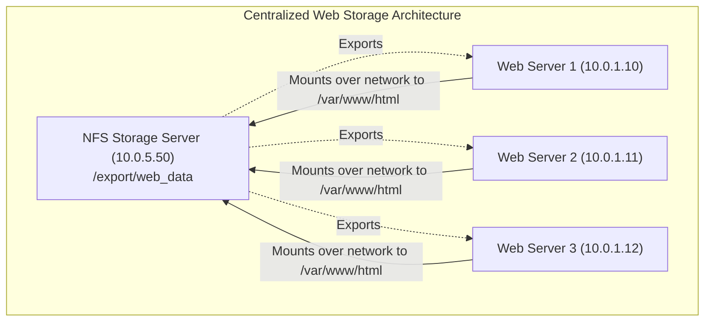
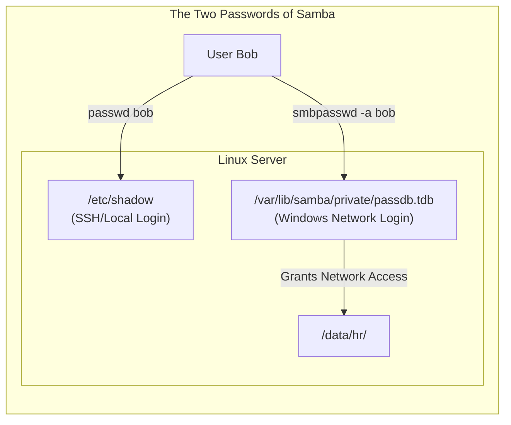
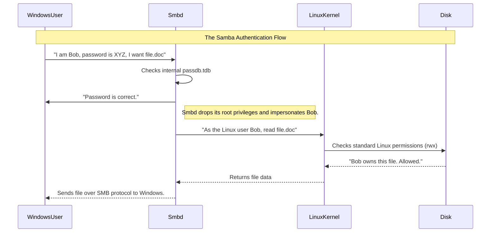

# CHAPTER 73 — FILE SHARING (NFS AND SAMBA)

---

## 1. Introduction

### Why This Topic Exists
In Chapter 36, you learned how to mount a physical hard drive directly to a Linux motherboard. But what if you have 50 web servers that all need access to the exact same directory of 1 million product images? You cannot physically plug 1 hard drive into 50 motherboards. You need a way to take a directory on one server and project it over the network so that other servers can "mount" it as if it were a local hard drive. To do this, Linux uses two primary protocols: **NFS** (Network File System) and **Samba** (SMB/CIFS).

### Why Linux Administrators Use It
Linux administrators use **NFS** to share files between Linux servers (e.g., sharing a massive video archive from a central storage server to 10 Linux processing nodes). 
They use **Samba** when they need to share files between a Linux server and a Windows workstation (e.g., creating a corporate "Z: Drive" where Windows HR employees can drag and drop Excel files onto a secure Linux file server).

### Why Companies Care About It
Centralized Storage and High Availability. If a company runs 5 load-balanced Nginx servers, a user might upload a profile picture to Server 1. If the next user connects to Server 2, the picture is missing! By using NFS, all 5 Nginx servers mount the exact same central `/var/www/uploads/` directory over the network. The picture is instantly available to all servers simultaneously, solving the clustered storage problem.

---

## 2. Learning Objectives

By the end of this chapter, you will be able to:
- Explain the difference between NFS (Linux-to-Linux) and Samba (Linux-to-Windows).
- Configure an NFS Server by editing `/etc/exports`.
- Mount an NFS share temporarily using `mount`, and permanently using `/etc/fstab`.
- Install and configure a Samba Server by editing `smb.conf`.
- Understand the mapping between Linux user permissions and Samba network passwords.
- Secure network shares using basic firewall rules.

---

## 3. Beginner-Friendly Explanation

Think of a physical filing cabinet (The Data):
- **Local Storage:** The filing cabinet is locked in your private office. Only you can reach it.
- **NFS (Network File System):** You put the filing cabinet in the hallway. You tell the security guard: "Anyone wearing a Blue Badge (a Linux Server) is allowed to open the cabinet and read the files." 
- **Samba (SMB):** You put the filing cabinet in the lobby. You tell the security guard: "Anyone wearing a Red Badge (a Windows PC) is allowed to open the cabinet, but they have to show you a special ID card (Samba Password) first."

---

## 4. Core Theory

### 4.1 NFS (Network File System)
Invented by Sun Microsystems in the 1980s, NFS is incredibly fast and native to Unix/Linux. It relies heavily on the concept of UID (User ID) and GID (Group ID). If User `bob` (UID 1000) creates a file on the NFS share from Server A, Server B just sees that the file is owned by UID 1000. For NFS to work seamlessly, all Linux servers connecting to the share should ideally have the exact same UIDs (usually managed by LDAP/Active Directory).

### 4.2 The `root_squash` Security Feature
By default, NFS has a massive security feature called `root_squash`. If the `root` user on Web Server A mounts an NFS share and tries to create a file, the NFS server intercepts the request and says, "I don't trust your root privileges on my system." It violently strips the root privileges and downgrades the user to `nfsnobody` (UID 65534). This prevents a hacker who compromised a web server from using their root access to delete the central storage array.

### 4.3 Samba (SMB / CIFS)
SMB (Server Message Block) is a proprietary protocol invented by Microsoft for Windows networking. **Samba** is an incredible open-source project that reverse-engineered the SMB protocol, allowing a Linux server to perfectly impersonate a Windows File Server. Windows PCs can connect to a Linux Samba server without installing any special software.

---

## 5. Internal Working

### Daemons and Ports
- **NFS:** Uses the `nfs-server` service. Modern NFSv4 operates purely on TCP Port 2049, making it very easy to pass through firewalls. (Legacy NFSv3 was a nightmare of random dynamic RPC ports).
- **Samba:** Uses two daemons: `smbd` (handles the actual file transfers) and `nmbd` (handles NetBIOS name resolution so the server shows up in the "Network Neighborhood" on Windows). It uses TCP Ports 139 and 445.

---

## 6. Production Architecture



---

## 7. Command-by-Command Explanation: NFS

### 7.1 `dnf install nfs-utils`
- **Purpose:** Installs the required NFS packages (on BOTH the Server and the Client).

### 7.2 `systemctl enable --now nfs-server`
- **Purpose:** Starts the NFS daemon on the server.

### 7.3 `exportfs -arv`
- **Purpose:** After editing the `/etc/exports` file, you must run this command to re-read the file and apply the new network shares instantly without restarting the daemon.
  - `-a`: All directories.
  - `-r`: Re-export.
  - `-v`: Verbose.

### 7.4 `showmount -e 10.0.5.50`
- **Purpose:** Run from the *Client*. This asks the NFS server at 10.0.5.50, "What directories are you currently offering to share with me?" It validates that the firewall is open and the export was successful.

### 7.5 `mount -t nfs 10.0.5.50:/export/data /mnt/data`
- **Purpose:** Mounts the network drive to a local directory on the client.

---

## 8. Syntax Breakdown: NFS Exports

**Configuring an NFS Share (`/etc/exports`)**

```text
/export/data    10.0.1.0/24(rw,sync,no_root_squash)
│               │           │  │    │
│               │           │  │    └── (DANGEROUS) Allows remote root users to remain root.
│               │           │  └── Guarantees data is physically written to disk before replying.
│               │           └── Read/Write permission.
│               └── The Subnet of computers allowed to connect.
└── The physical directory on the server being shared.
```
*(Warning: There MUST NOT be a space between the IP address and the parenthesis. `10.0.1.0/24 (rw)` is a massive security flaw that gives the subnet read-only access, but accidentally gives the entire internet read-write access!)*

---

## 9. Command-by-Command Explanation: Samba

### 9.1 `dnf install samba samba-common samba-client`
- **Purpose:** Installs the Samba suite.

### 9.2 `systemctl enable --now smb nmb`
- **Purpose:** Starts both required Samba daemons.

### 9.3 `smbpasswd -a bob`
- **Purpose:** **CRITICAL STEP.** A user named `bob` must already exist in Linux (`useradd bob`). However, Samba does not use Linux passwords. You MUST run this command to generate a separate "Samba Password" for Bob, which is used specifically for network file sharing.

---

## 10. Syntax Breakdown: Samba Config

**Configuring a Samba Share (`/etc/samba/smb.conf`)**

```ini
[HR_Docs]
    comment = Human Resources Department Share
    path = /data/samba/hr
    valid users = bob, alice
    read only = no
    browsable = yes
```
- `[HR_Docs]`: The name that Windows users will see when they map the network drive.
- `valid users`: Only these specific users are allowed to access the folder. (You can also use `@hr_group` for group access).
- `browsable = yes`: Shows the folder in the Windows Network explorer. If `no`, it is a "Hidden" share (users must type the exact path to find it).

---

## 11. Architecture Diagram


*If Bob changes his Linux password, his Samba network password remains the old one until he updates it separately.*

---

## 12. Workflow Diagram


*(If you grant Bob `read only = no` in Samba, but the folder on the hard drive is `chmod 700 root`, Bob STILL gets Permission Denied. Samba cannot override base Linux filesystem permissions!)*

---

## 13. Real Production Examples

### Permanent NFS Mount (fstab)
A Web server needs to mount the NFS storage array automatically every time it reboots.
The administrator edits `/etc/fstab` on the web server:
```text
10.0.5.50:/export/web_data   /var/www/html   nfs   defaults,_netdev   0 0
```
*The `_netdev` option is a critical fail-safe. It tells the Linux boot sequence: "Do not attempt to mount this drive until the network card is fully online." Without this, the server might hang forever during boot.*

### The Windows "Home" Drive
A company wants every Windows user to have a personal "Z: Drive" that only they can see.
In `/etc/samba/smb.conf`, there is a special built-in section called `[homes]`. If you enable it, when `bob` connects to `\\server\bob`, Samba automatically routes him directly to his Linux `/home/bob` directory, providing an instant, secure personal network drive for hundreds of employees with zero manual configuration.

---

## 14. Common Mistakes

1. **Forgetting SELinux on Samba** — You configure Samba perfectly. Permissions are `777`. Windows says "Access Denied." You tear your hair out. **The culprit:** SELinux. By default, SELinux blocks Samba from sharing random directories on the hard drive. You must explicitly tag the directory:
   `chcon -t samba_share_t /data/samba/hr`
2. **Forgetting SELinux on NFS** — Similar issue on the client side. If an Apache web server mounts an NFS drive to `/var/www/html`, SELinux will block Apache from reading the network drive. You must flip a boolean: `setsebool -P httpd_use_nfs 1`.
3. **Ghost NFS Mounts (Stale File Handle)** — If the NFS Server violently crashes or reboots while a Client has the drive mounted, the Client's kernel gets confused. Any command run on the client (even a simple `df -h`) will freeze indefinitely waiting for the server to come back. You must forcefully unmount the ghost drive using `umount -l /var/www/html` (Lazy unmount).

---

## 15. Best Practices

- **Avoid `no_root_squash`:** Do not use this in NFS unless absolutely necessary (e.g., for specialized VMware datastores). Giving remote servers `root` access to your storage array is a massive security risk. Design your file structures to rely on standard group permissions instead.
- **Samba `valid users`:** Never create a Samba share that allows "Guests" or anonymous read/write access. Ransomware worms (like WannaCry) spread by scanning corporate networks for open SMB shares and instantly encrypting everything inside them. Always require a password.

---

## 16. Security Considerations

- **NFSv3 is Unencrypted:** Standard NFS traffic is not encrypted. If you send sensitive files over NFS across a public network, anyone can sniff the packets. Modern NFSv4 supports Kerberos encryption, but it is notoriously difficult to configure. For absolute security across untrusted networks, administrators often wrap NFS traffic inside an encrypted IPSec VPN tunnel, or use `sshfs` instead.

---

## 17. Performance Considerations

- **NFS `async` vs `sync`:** In `/etc/exports`, you choose how the server handles writes.
  - `sync`: The server waits for the physical hard drive to finish writing before telling the client "Success". Extremely safe, but slow.
  - `async`: The server replies "Success" the millisecond it receives the data in RAM, before it writes to the hard drive. Blisteringly fast, but if the server loses power 1 second later, data is permanently corrupted.

---

## 18. Troubleshooting Guide

| Symptom | Root Cause | Resolution |
|:---|:---|:---|
| `mount.nfs: Connection timed out` | Firewall blocking | On NFS Server: `firewall-cmd --add-service=nfs --permanent` |
| `mount.nfs: access denied by server` | Wrong IP in `/etc/exports` | Ensure the client's exact IP or Subnet is allowed. Run `exportfs -arv`. |
| Windows asks for password, but rejects it constantly | No Samba password | Run `smbpasswd -a <user>` on the Linux server. |
| Samba says "Access Denied" after accepting password | SELinux or chmod | Run `chcon -t samba_share_t /path`. Ensure Linux folder is `chmod 770`. |

---

## 19. Practical Labs

**Lab 73.1:** Building an NFS Server
1. `sudo dnf install nfs-utils -y`
2. `sudo systemctl enable --now nfs-server`
3. `sudo mkdir -p /export/shared`
4. `sudo chmod 777 /export/shared` (For easy testing).
5. Edit `/etc/exports`:
   `/export/shared *(rw,sync,no_root_squash)` *(The `*` allows any IP).*
6. Apply it: `sudo exportfs -arv`

**Lab 73.2:** Mounting the NFS Share (Client Side)
1. Ensure `nfs-utils` is installed.
2. Check the server (Replace IP with your server's IP):
   `showmount -e 127.0.0.1`
3. Create a local mount point: `mkdir /mnt/nfs_test`
4. Mount it: `sudo mount -t nfs 127.0.0.1:/export/shared /mnt/nfs_test`
5. Prove it works: `touch /mnt/nfs_test/hello.txt`
6. Check the server folder: `ls /export/shared/`. The file is there!

---

## 20. Mini Project

The Windows Samba Share.
1. `sudo dnf install samba -y`
2. `sudo mkdir /data/finance && sudo chmod 777 /data/finance`
3. Fix SELinux: `sudo chcon -t samba_share_t /data/finance`
4. Create user: `sudo useradd finance_user`
5. Set Samba password: `sudo smbpasswd -a finance_user`
6. Edit `/etc/samba/smb.conf`. Add to the bottom:
```ini
[Finance]
path = /data/finance
valid users = finance_user
read only = no
```
7. `sudo systemctl enable --now smb nmb`
8. `sudo firewall-cmd --add-service=samba --permanent && sudo firewall-cmd --reload`
9. From a Windows PC on the same network, open File Explorer and type: `\\<Linux_IP_Address>\Finance`. Enter the credentials and create a file!

---

## 21. Assignments

1. What is the `root_squash` feature in NFS, and what security threat does it mitigate?
2. If a Linux user changes their password using the `passwd` command, does it automatically change their Samba network password? Why or why not?
3. Why is the `_netdev` flag critical when mounting an NFS share permanently via `/etc/fstab`?

---

## 22. Interview Questions

### Basic
1. **Q: What command do you use on an NFS client to verify which directories an NFS server is currently sharing over the network?**
   A: `showmount -e <Server_IP>`

2. **Q: What is the primary difference in use cases between NFS and Samba?**
   A: NFS is designed for native, high-performance Linux-to-Linux file sharing. Samba is designed to share files with Windows PCs by emulating the SMB protocol.

### Intermediate
3. **Q: You edit `/etc/exports` and add a new directory to share. You save the file. The client tries to mount it but gets "Access Denied." What command did you forget to run on the server?**
   A: `exportfs -arv` (This forces the NFS daemon to re-read the exports file and apply the changes without needing a full restart).

4. **Q: A Windows user complains they can see a Samba folder, but when they try to drag a file into it, it says "Permission Denied." You check `/etc/samba/smb.conf` and it definitely says `read only = no`. What is the most likely issue?**
   A: Samba configuration only handles the *network* permissions. When the network request hits the hard drive, it must still pass standard Linux filesystem permissions. The physical directory on the Linux hard drive is likely owned by `root` with `755` permissions, meaning the standard Samba user does not have Linux write privileges. You must `chmod` or `chown` the physical directory.

### Scenario-Based
5. **Q: A junior administrator mounts an NFS share on a production web server. A few hours later, the NFS server hardware violently catches fire and dies. Instantly, the web server's CPU spikes, SSH sessions freeze, and simple commands like `df -h` or `ls` hang indefinitely, completely crashing the web application. What happened, and how do you recover the web server without rebooting it?**
   A: The NFS client has a "Stale File Handle." The Linux kernel on the web server is desperately trying to contact the dead NFS server and refuses to give up, blocking all IO operations that query the mount points (like `df -h`). To fix this, I must force the kernel to sever the connection immediately by performing a "lazy unmount" on the dead directory: `umount -l /path/to/mount`. This instantly detaches the frozen mount point and restores normal functionality to the web server.

---

## 23. Chapter Summary and Quick Revision Notes

- **NFS (Network File System):** Linux-to-Linux. Uses `/etc/exports`.
- **`exportfs -arv`:** Applies NFS changes.
- **`showmount -e`:** Verifies NFS shares from the client.
- **`root_squash`:** Downgrades remote root users to a safe, unprivileged user.
- **Samba (SMB):** Linux-to-Windows. Uses `/etc/samba/smb.conf`.
- **`smbpasswd`:** Required to set specialized Samba network passwords for users.
- **SELinux:** Must use `chcon -t samba_share_t` or Samba will be blocked from reading directories.
- **`_netdev`:** Required in `/etc/fstab` for all network mounts.

---

## 24. Cheat Sheet

| Task | Command / Syntax |
|:---|:---|
| Share an NFS folder | Add to `/etc/exports`: `/dir IP_Range(rw,sync)` |
| Apply NFS changes | `exportfs -arv` |
| View NFS shares | `showmount -e IP_Address` |
| Mount NFS (Temp) | `mount -t nfs IP:/export/dir /local/dir` |
| Mount NFS (Perm) | `/etc/fstab`: `IP:/dir /local nfs defaults,_netdev 0 0` |
| Set Samba Password| `smbpasswd -a username` |
| Fix Samba SELinux | `chcon -t samba_share_t /directory` |
