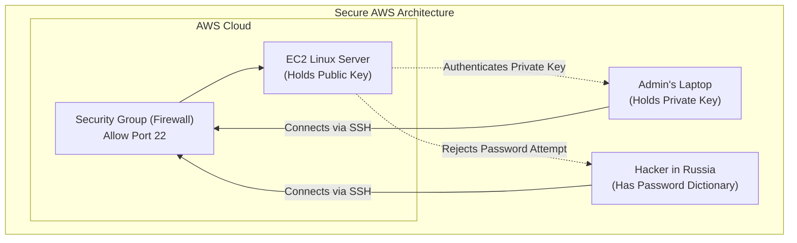
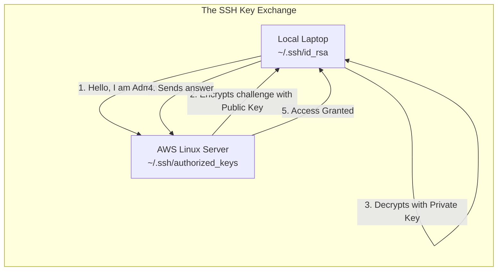
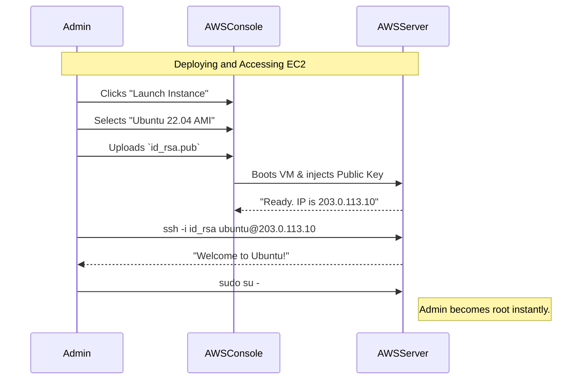

# CHAPTER 76 — LINUX IN AWS (EC2 AND SSH KEY PAIRS)

---

## 1. Introduction

### Why This Topic Exists
Historically, if a company needed a new Linux server, an administrator ordered a Dell physical server online. It arrived 4 weeks later. The admin carried it into a freezing data center, screwed it into a rack, plugged in power and network cables, inserted a USB drive, and spent 2 hours installing RHEL. 
Today, companies use **Public Cloud Computing** (AWS, Azure, Google Cloud). An administrator clicks a button, and 5 seconds later, a fully functioning Linux server is booting up in a data center 3,000 miles away. **Amazon Web Services (AWS)** is the global leader, and its primary server hosting service is called **EC2 (Elastic Compute Cloud)**.

### Why Linux Administrators Use It
Linux administrators must know how to deploy, access, and manage Linux servers running in the cloud. Because these servers are instantly exposed to the public internet, traditional password authentication is considered a massive security risk. Administrators must master **SSH Key Pairs** (Public/Private Keys) to securely access cloud servers.

### Why Companies Care About It
Elasticity and CapEx vs OpEx. 
- **Elasticity:** On Black Friday, an e-commerce company can use AWS to instantly launch 500 Linux web servers to handle the traffic spike, and then delete 490 of them on Saturday morning when the sale ends.
- **Cost:** You do not pay $5,000 upfront for a server (Capital Expenditure). You rent the server by the second (Operational Expenditure). If you delete it after 10 minutes, you pay Amazon 4 cents.

---

## 2. Learning Objectives

By the end of this chapter, you will be able to:
- Explain Cloud Computing and the role of AWS EC2.
- Understand the architecture of Asymmetric Cryptography (SSH Key Pairs).
- Generate an SSH Key Pair using `ssh-keygen`.
- Deploy an EC2 instance in AWS.
- Connect to a remote AWS server securely without typing a password.
- Securely configure `sshd_config` to explicitly disable password logins.

---

## 3. Beginner-Friendly Explanation

Think of renting a hotel room (The Server):
- **Passwords (The Old Way):** The hotel gives you a 4-digit code for the door. A thief stands behind you, watches you type the code, and steals all your stuff. (Hackers brute-forcing SSH passwords).
- **SSH Keys (The Cloud Way):** The hotel changes the door. The door no longer has a keypad. Instead, the door has a massive, complex lock (The **Public Key**). The hotel mails you the only physical, jagged, titanium key in existence that fits that lock (The **Private Key**). 
  If a hacker walks up to the door, there is nothing for them to guess. Without the physical titanium key in their pocket, the door is mathematically impossible to open.

---

## 4. Core Theory

### 4.1 Cloud Infrastructure as a Service (IaaS)
AWS EC2 provides raw Infrastructure. AWS manages the physical building, the power, the cooling, and the physical Dell/HP server hardware (the Hypervisor). You, the Linux Administrator, are completely responsible for the Linux OS and everything inside it. If you install an insecure version of Apache on EC2 and get hacked, AWS is not responsible. This is called the "Shared Responsibility Model."

### 4.2 Asymmetric Cryptography (SSH Keys)
When you generate an SSH key, the computer does advanced math to create TWO files that are mathematically linked:
1. **The Private Key (`id_rsa`):** This is your secret. It stays on your laptop. NEVER share it. NEVER email it. NEVER upload it to GitHub. It is the equivalent of your physical house key.
2. **The Public Key (`id_rsa.pub`):** This is the lock. You can give this to anyone. You copy this text file up to your AWS server. 
When you try to log into AWS, the server takes a random math problem, locks it using your Public Key, and sends it to your laptop. Your laptop uses the Private Key to instantly unlock it, solve the math problem, and send the answer back. The server says, "You must be the true owner," and logs you in.

### 4.3 Amazon Machine Images (AMI)
When you launch an EC2 instance, you don't install Linux from an ISO file. You select an AMI. An AMI is a pre-installed, pre-configured snapshot of a Linux hard drive provided by Amazon (e.g., "Amazon Linux 2023", "Ubuntu 22.04"). It boots in seconds.

---

## 5. Internal Working

### The `authorized_keys` File
How does the AWS server actually know your Public Key? When you launch an EC2 instance in the AWS Web Console, AWS asks you for your Public Key. When the Linux server boots up for the very first time, a script inside the server (called `cloud-init`) grabs your Public Key from the AWS system and injects it directly into the `/home/ec2-user/.ssh/authorized_keys` file. When the SSH daemon (`sshd`) receives your login request, it reads this file to verify your identity.

---

## 6. Production Architecture



---

## 7. Command-by-Command Explanation

*(These commands are run on your LOCAL machine/laptop before connecting to AWS).*

### 7.1 `ssh-keygen -t rsa -b 4096`
- **Purpose:** Generates a new SSH Key Pair.
  - `-t rsa`: Uses the RSA encryption algorithm. (Modern systems increasingly use `ed25519` for faster, stronger cryptography: `ssh-keygen -t ed25519`).
  - `-b 4096`: Generates a massive 4,096-bit key (the default 2048 is considered weak).

### 7.2 `chmod 400 ~/.ssh/my_aws_key.pem`
- **Purpose:** Security constraint. If you download a Private Key from AWS, Linux will refuse to use it if the permissions are too loose (e.g., `644`), because it means other users on your laptop could steal your key. You MUST restrict the Private Key so ONLY you have read access (`400`).

### 7.3 `ssh -i ~/.ssh/my_aws_key.pem ec2-user@54.10.20.30`
- **Purpose:** Connects to the AWS server.
  - `-i`: Identity file. Explicitly tells SSH, "Do not ask for a password. Use this specific Private Key file to authenticate me."
  - `ec2-user`: The default administrative username for Amazon Linux AMIs. (For Ubuntu AMIs, the user is `ubuntu`. For CentOS, it is `centos`. AWS completely disables the `root` user login for security).

---

## 8. Syntax Breakdown

**Disabling Password Logins in `/etc/ssh/sshd_config`**

If you launch an EC2 instance, AWS disables passwords by default. But if you are building an on-premise server and transitioning to SSH Keys, you MUST manually edit the SSH daemon configuration to ban passwords.

```text
PasswordAuthentication no
PubkeyAuthentication yes
```
*(After editing, you must run `systemctl restart sshd`. **WARNING:** Do not do this until you have successfully tested your SSH Key, or you will permanently lock yourself out of the server!)*

---

## 9. Parameter Explanation

| AWS EC2 Term | Traditional Linux Equivalent |
|:---|:---|
| **Instance Type** (e.g. t3.micro) | The physical CPU and RAM (e.g. 2 vCPU, 1GB RAM) |
| **EBS Volume** (Elastic Block Store) | The hard drive (sda or nvme) |
| **Security Group** | The external Firewall (`firewalld` / `iptables`) |
| **Elastic IP** | A static Public IP Address |
| **Key Pair** | SSH Public/Private Keys |

---

## 10. Sample Output Analysis

**Scenario:** We generate a new SSH Key Pair on our local laptop.
**Command:** `ssh-keygen -t ed25519 -C "admin@company.com"`

**Output:**
```text
Generating public/private ed25519 key pair.
Enter file in which to save the key (/home/admin/.ssh/id_ed25519):
Enter passphrase (empty for no passphrase):
Enter same passphrase again:
Your identification has been saved in /home/admin/.ssh/id_ed25519
Your public key has been saved in /home/admin/.ssh/id_ed25519.pub
The key fingerprint is:
SHA256:abcd1234efgh5678ijkl9012mnop3456 admin@company.com
```

**Analysis:**
- **Passphrase:** It asks for a passphrase. This encrypts the Private Key file on your laptop. If your laptop is stolen, the thief cannot use your Private Key to hack into AWS unless they know this passphrase. (If you are using the key for an automated script, you leave this blank).
- **The Files:** It generated TWO files. `id_ed25519` is the Top Secret private key. `id_ed25519.pub` is the lock that you upload to the servers.

---

## 11. Architecture Diagram



---

## 12. Workflow Diagram


*(AWS allows passwordless `sudo` by default. Once you authenticate with the cryptographic key, AWS trusts you are the true administrator).*

---

## 13. Real Production Examples

### Copying a Key to an Existing Server (`ssh-copy-id`)
You have 10 on-premise Linux servers. They currently use passwords. You generate a key on your laptop and want to convert all 10 servers to use your key. Instead of manually copying and pasting the text into 10 different files, you use:
```bash
ssh-copy-id admin@10.0.1.50
```
This command automatically logs into the remote server (it will ask for your password one last time), copies your Public Key, creates the `.ssh` directory, sets the correct permissions, and appends the key into `authorized_keys`. You can now log in without a password forever.

### The Lost Key Disaster
A Junior Admin launches an AWS EC2 instance. They download the Private Key (`.pem` file) to their laptop. A week later, their laptop hard drive dies. They did not back up the Private Key.
Can they log into the AWS server? **NO.** There is no "forgot password" button for SSH keys. The server is permanently cryptographically sealed. In an enterprise, the only fix is to detach the EBS virtual hard drive, attach it to a *different* server, manually hack the `authorized_keys` file, and put the drive back. (Always back up your Private Keys in a secure password vault!).

---

## 14. Common Mistakes

1. **Bad Permissions on `.ssh`** — If an administrator creates the `.ssh` folder on a remote server manually, SSH is incredibly strict. If the `.ssh` folder is `777`, or the `authorized_keys` file is `666`, SSH assumes a hacker has tampered with them and will silently reject the login attempt, asking for a password instead.
   - The `.ssh` directory MUST be `chmod 700`.
   - The `authorized_keys` file MUST be `chmod 600`.
2. **Logging in as Root** — An administrator launches an Amazon Linux instance. They type `ssh -i key.pem root@54.10.10.10`. The server instantly disconnects them with the message: *Please login as the user "ec2-user" rather than the user "root".* AWS completely disables direct root SSH access. You must log in as the standard user first, then use `sudo`.

---

## 15. Best Practices

- **Never Share Private Keys:** If Alice and Bob both need to manage a web server, you do NOT give them both the same Private Key. Alice generates her own key on her laptop. Bob generates his own key on his laptop. The Linux Administrator takes BOTH of their Public Keys and puts both of them into the `/home/admin/.ssh/authorized_keys` file (one on each line). Now both laptops can unlock the same door, and if Bob quits, the Admin simply deletes Bob's line from the file, revoking his access without affecting Alice.
- **Port 22 Exposure:** Even with SSH keys, leaving Port 22 open to the entire internet (`0.0.0.0/0`) in the AWS Security Group is dangerous. Bots will constantly hammer the port. You should restrict Port 22 in the AWS Firewall so that it ONLY accepts connections from your corporate office IP address.

---

## 16. Security Considerations

- **Key Rotation:** Cryptographic standards age. A 1024-bit RSA key generated in 2010 can be cracked by modern supercomputers. Enterprises enforce "Key Rotation." Every 90 days, administrators must generate a brand new `ed25519` key pair, deploy the new Public Keys via automation (like Ansible), and delete the old ones.

---

## 17. Performance Considerations

- **AWS Instance Types (T-Series CPU Credits):** When practicing in AWS, you usually use a `t3.micro` instance (which is free). These are "burstable" instances. They accumulate CPU credits while asleep. If you run a massive compilation script that maxes out the CPU at 100%, after 15 minutes you run out of credits, and AWS brutally throttles your CPU down to 10% speed. The server will become incredibly slow until it rests and earns credits back.

---

## 18. Troubleshooting Guide

| Symptom | Root Cause | Resolution |
|:---|:---|:---|
| `UNPROTECTED PRIVATE KEY FILE!` | File permissions | Run `chmod 400 ~/.ssh/my_key.pem`. |
| Connection Timed Out | AWS Security Group | Go to AWS Console. Ensure the Security Group attached to the EC2 instance allows Inbound Port 22 from your IP. |
| Connection Refused | SSHd is down | The server is running, but the SSH service crashed. Reboot the instance from the AWS console. |
| Prompts for password despite using a key | Wrong user / Bad key | Ensure you are using `ec2-user` or `ubuntu`. Check `/var/log/secure` on the server for rejection reasons. |

---

## 19. Practical Labs

**Lab 76.1:** Generating the Key Pair
*(Run this on your local Linux VM or Mac/WSL terminal)*
1. `ssh-keygen -t rsa -b 4096 -f ~/.ssh/aws_lab_key`
2. Press Enter twice to skip the passphrase.
3. Look at the keys: `ls -lh ~/.ssh/aws_lab_key*`
4. Read your Public Key: `cat ~/.ssh/aws_lab_key.pub`
*(This is the text you would paste into AWS when launching an EC2 instance).*

**Lab 76.2:** Simulating AWS Key Injection (Localhost)
*(We will inject the key into our own server so we can SSH into ourselves without a password).*
1. Create the file: `touch ~/.ssh/authorized_keys`
2. Inject the lock: `cat ~/.ssh/aws_lab_key.pub >> ~/.ssh/authorized_keys`
3. Fix the permissions perfectly:
   `chmod 700 ~/.ssh`
   `chmod 600 ~/.ssh/authorized_keys`
4. Test the SSH connection to yourself:
   `ssh -i ~/.ssh/aws_lab_key localhost`
5. You logged in instantly without a password! Type `exit` to logout.

---

## 20. Mini Project

The Corporate AWS Deployment Plan.
Write a standard operating procedure (SOP) for deploying a new web server in AWS.
1. Log into AWS Console. Navigate to EC2 -> Instances -> Launch Instance.
2. **Name:** `Corp-Web-01`
3. **AMI:** Select `Amazon Linux 2023`.
4. **Instance Type:** Select `t3.micro`.
5. **Key Pair:** Select the previously uploaded Corporate Public Key.
6. **Network/Security Group:**
   - Add Rule: SSH (Port 22) -> Source: Corporate Office IP ONLY.
   - Add Rule: HTTP (Port 80) -> Source: Anywhere (0.0.0.0/0).
7. Click **Launch**.
8. From the Corporate Office terminal, run: `ssh -i ~/.ssh/corp_key.pem ec2-user@<AWS_Public_IP>`

---

## 21. Assignments

1. Why are passwords considered fundamentally insecure for servers directly exposed to the internet (like AWS EC2 instances)?
2. Which part of the SSH Key Pair must absolutely never be shared or uploaded to a remote server?
3. What is the exact path and file name on a Linux server where you paste the Public Keys of users who are allowed to log in?

---

## 22. Interview Questions

### Basic
1. **Q: What command is used to generate a new SSH Public/Private key pair?**
   A: `ssh-keygen`

2. **Q: You download an AWS key named `dev.pem`. You try to SSH using it, but the terminal screams "WARNING: UNPROTECTED PRIVATE KEY FILE!" and aborts the connection. How do you fix it?**
   A: Run `chmod 400 dev.pem` to ensure only the owner can read the file.

### Intermediate
3. **Q: You want to completely disable password logins on a Linux server and force everyone to use SSH keys. Which configuration file do you edit, and what specific line do you change?**
   A: I edit `/etc/ssh/sshd_config`. I find the line `PasswordAuthentication yes` and change it to `PasswordAuthentication no`. I then run `systemctl restart sshd`.

4. **Q: You launch an Ubuntu EC2 instance in AWS. You run `ssh -i key.pem root@54.x.x.x`. It says "Please login as the user 'ubuntu' rather than 'root'". Why does AWS do this?**
   A: For auditing and security. If 5 different administrators all log in directly as `root`, the system logs cannot distinguish who ran a destructive command. By forcing admins to log in as an unprivileged user (`ubuntu` or `ec2-user`) and then executing `sudo`, the `auth.log` files record exactly which specific human escalated to root privileges.

### Scenario-Based
5. **Q: An employee named Dave was fired. Dave had SSH access to 50 production Linux servers. Historically, the company used a shared `root` password, meaning when someone was fired, you had to manually log into 50 servers and change the root password. Assuming the company has modernized to use SSH Key Pairs, how do you instantly revoke Dave's access across the infrastructure without affecting any other administrators?**
   A: Dave authenticated using his own unique Private Key. His corresponding Public Key was placed on the 50 servers. To revoke his access, I simply delete Dave's specific Public Key text string from the `/root/.ssh/authorized_keys` file on those 50 servers (usually achieved instantly via an automation tool like Ansible). The other administrators still have their Public Keys in the file, so their access is entirely uninterrupted. Dave is now locked out forever.

---

## 23. Chapter Summary and Quick Revision Notes

- **AWS EC2:** Virtual Cloud Servers (Infrastructure as a Service).
- **AMI:** Amazon Machine Image (Pre-configured Linux OS template).
- **Asymmetric Cryptography:** Uses a mathematically linked Public (Lock) and Private (Key) pair.
- **`ssh-keygen`:** Generates the keys (`id_rsa` and `id_rsa.pub`).
- **`chmod 400`:** Required permission for the Private Key.
- **`/home/user/.ssh/authorized_keys`:** The file on the remote server where Public Keys must be placed.
- **`PasswordAuthentication no`:** The critical SSH configuration that stops brute-force hackers dead in their tracks.

---

## 24. Cheat Sheet

| Command / Configuration | Purpose |
|:---|:---|
| `ssh-keygen -t rsa -b 4096` | Generate strong RSA keys |
| `ssh-keygen -t ed25519` | Generate modern, fast cryptographic keys |
| `chmod 400 key.pem` | Secure a private key |
| `ssh -i key.pem user@IP` | Connect using a specific key |
| `ssh-copy-id user@IP` | Automatically install your Public key on a remote server |
| `/etc/ssh/sshd_config` | The SSH Daemon configuration file |
| `systemctl restart sshd` | Apply SSH config changes |
