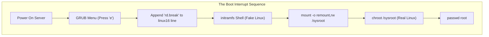
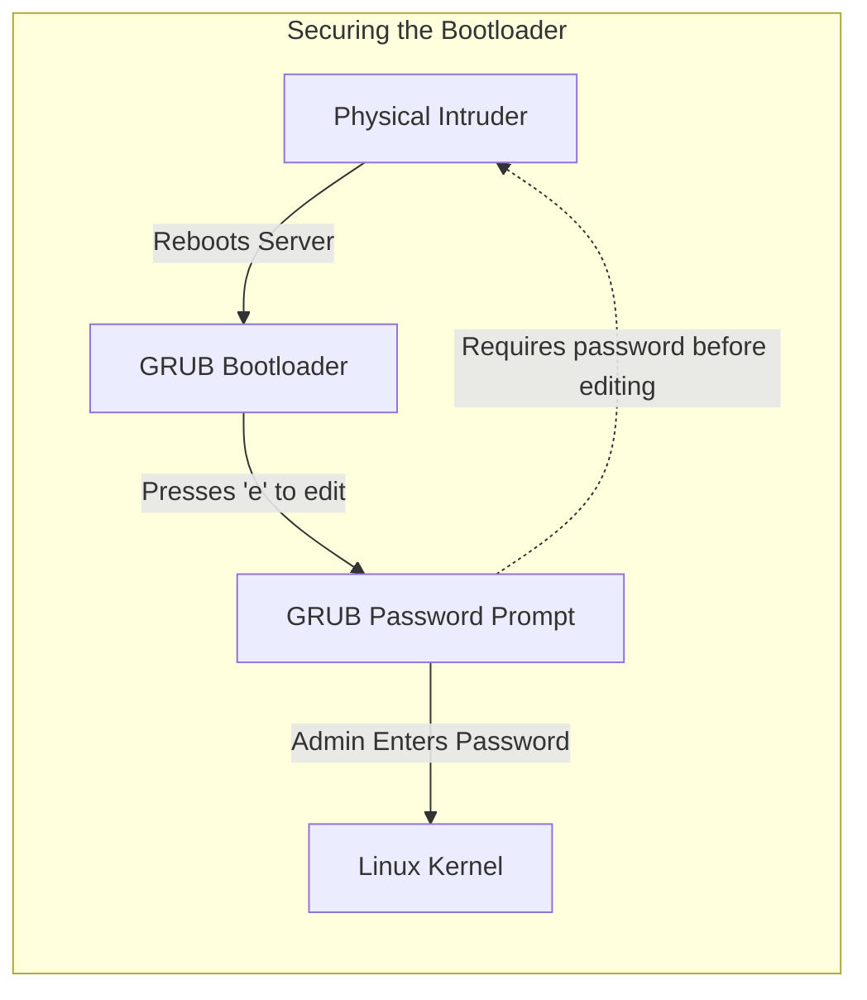

# CHAPTER 79 — THE RESCUE TARGET AND PASSWORD RECOVERY

---

## 1. Introduction

### Why This Topic Exists
You are the Linux Administrator for a massive hospital. You get paged at 3:00 AM. The primary database server has rebooted, but it did not come back online. You rush to the server room, plug in a monitor, and see a terrifying message: `Give root password for maintenance (or type Control-D to continue):`. You type the root password. It says `Login incorrect`. The previous administrator changed the root password before they quit, and never documented it. The server is completely locked down, it refuses to boot, and people's lives are on the line. What do you do?

### Why Linux Administrators Use It
Linux administrators use **systemd Targets** (specifically the Rescue and Emergency targets) to break into their own servers when catastrophic failures occur. By intercepting the boot sequence before the operating system is fully loaded, an administrator can forcefully reset the root password, fix corrupted file systems, or bypass broken authentication mechanisms.

### Why Companies Care About It
Disaster Recovery and Zero-Trust Rebuilding. If an enterprise loses a root password, they cannot afford to format the hard drive and lose the data. They must have a way to break in. However, the ability to break into a Linux server so easily is also a massive security risk. Companies care deeply about understanding this process so they can lock down the bootloader (GRUB) to prevent hackers from doing the exact same thing.

---

## 2. Learning Objectives

By the end of this chapter, you will be able to:
- Understand the difference between Graphical, Multi-User, Rescue, and Emergency targets.
- Interrupt the GRUB bootloader menu.
- Append kernel parameters (`rd.break` or `init=/bin/bash`) to bypass the boot sequence.
- Remount the root filesystem in Read-Write mode.
- Use `chroot` to create a fake root environment.
- Reset the root password of a locked server.
- Force SELinux to automatically relabel the filesystem on boot.

---

## 3. Beginner-Friendly Explanation

Think of a high-security bank vault:
- **Multi-User Target (Normal Boot):** The bank is open. Security guards are at the doors checking IDs. The Vault requires a 10-digit PIN. If you lost the PIN, you are locked out.
- **Interrupting GRUB:** You wait until 3:00 AM when the bank is being built, before the security guards arrive, and before the vault doors are even installed.
- **`chroot`:** You sneak into the bank, walk right past the empty guard desks, walk into the open vault, write a brand new PIN code on a sticky note, slap it on the wall, and leave. When the bank opens at 9:00 AM, the security guards read your sticky note and accept your new PIN.

---

## 4. Core Theory

### 4.1 Systemd Targets (The Runlevels)
In modern Linux, the state of the machine is defined by a "Target".
1. **Graphical Target:** The GUI desktop. (Runlevel 5).
2. **Multi-User Target:** The standard command-line server with networking. (Runlevel 3).
3. **Rescue Target:** A single-user mode. Only the `root` user can log in. Networking is disabled. It mounts the hard drives, but does not start any background services like Nginx or MySQL. (Runlevel 1).
4. **Emergency Target:** The absolute lowest level. The hard drive is mounted as Read-Only. No services run. Used when the hard drive is physically corrupted and needs repair (`fsck`).

### 4.2 The Boot Sequence Weakness
When a server boots, the BIOS hands control to **GRUB** (The Bootloader). GRUB's only job is to load the Linux Kernel into RAM. At the exact moment you are staring at the GRUB menu, the Linux Security Engine (PAM, /etc/shadow, SELinux) has NOT loaded yet. If you press the `e` key, you can edit the instructions GRUB passes to the Kernel, telling it to pause the boot sequence entirely and drop you into a raw shell with absolute root privileges.

---

## 5. Internal Working

### The `chroot` Jail
If you break the boot sequence using the `rd.break` parameter, the Kernel drops you into an "initramfs" prompt. You are running in a tiny, fake Linux environment that exists purely in RAM. Your actual hard drive (with your files and `/etc/shadow`) is mounted in a folder called `/sysroot`. 
If you type `passwd` right now, you are changing the password of the fake RAM environment! 
You must use the `chroot` (Change Root) command to tell the terminal: "Pretend that the folder `/sysroot` is actually `/`. Jump inside it." Once you `chroot`, you are inside your real hard drive, and the `passwd` command modifies the real files.

---

## 6. Production Architecture



---

## 7. Step-by-Step Command Explanation (Password Reset)

*(This is the exact sequence required to break into a RHEL / Rocky / CentOS 8/9 server).*

### Step 1: Interrupt GRUB
- Turn on the server. When the GRUB menu appears (the list of Kernels), use the arrow keys to pause the countdown.
- Select the top Kernel and press **`e`** (Edit).

### Step 2: Edit the Kernel Line
- Scroll down to the line that starts with `linux`, `linux16`, or `linuxefi`.
- Go to the absolute end of that line.
- Type a space, and append: **`rd.break`**
- Press **Ctrl + X** to boot with this modified parameter.

### Step 3: Remount the Hard Drive
- You are now dropped into a scary `switch_root:/#` prompt. The hard drive is mounted Read-Only. You must make it writable:
- **Command:** `mount -o remount,rw /sysroot`

### Step 4: Chroot into the Real System
- **Command:** `chroot /sysroot`
- The prompt changes to `sh-4.4#`. You are now inside your real server as the root user.

### Step 5: Change the Password
- **Command:** `passwd`
- Type your new password twice.

### Step 6: The SELinux Relabel (CRITICAL)
- Because you are running in a broken boot environment, SELinux is asleep. When the `passwd` command modified the `/etc/shadow` file, the file lost its SELinux security context label. If you reboot now, SELinux will wake up, see an unlabeled shadow file, panic, and violently prevent anyone from logging in. You must tell SELinux to fix all labels on the next boot:
- **Command:** `touch /.autorelabel`

### Step 7: Reboot
- Type `exit` (leaves the chroot).
- Type `exit` again (leaves the initramfs and reboots the server).
- Wait 5 minutes while SELinux scans the hard drive. You can now log in with the new password!

---

## 8. Alternative Syntax Breakdown

**The Ubuntu / Debian Method**

Ubuntu does not use `rd.break`. The process is slightly different.

1. Press `e` at GRUB.
2. Find the line starting with `linux`.
3. Change `ro` (Read-Only) to `rw` (Read-Write).
4. Append `init=/bin/bash` to the end of the line.
5. Press **Ctrl + X** or **F10** to boot.
*(This bypasses the init system entirely and drops you straight into a bash shell as root. You don't even need to `chroot`. Just run `passwd`, and reboot).*

---

## 9. Parameter Explanation

| Kernel Parameter | Purpose |
|:---|:---|
| `rd.break` | (RHEL) Breaks the boot process right before the initramfs hands control over to systemd. Drops you into a RAM shell. |
| `init=/bin/bash` | (Ubuntu) Tells the kernel: "Don't start the OS. Just start a bash terminal." |
| `systemd.unit=rescue.target` | Boots the server normally, but stops before starting networking or graphical interfaces. Asks for the root password. |
| `systemd.unit=emergency.target` | Boots the server with the drive Read-Only. Used for fixing catastrophic `/etc/fstab` errors. |

---

## 10. Sample Output Analysis

**Scenario:** We edited `/etc/fstab` and made a typo. We rebooted the server. The server hangs on boot and drops into Emergency Mode.
**Terminal Output:**
```text
You are in emergency mode. After logging in, type "journalctl -xb" to view system logs, "systemctl reboot" to reboot, "systemctl default" or "exit" to boot into default mode.
Give root password for maintenance (or press Control-D to continue):
```

**Analysis:**
- The server tried to mount the hard drives listed in `/etc/fstab`. Because of the typo, the mount failed.
- The Linux Kernel refuses to boot a server with a broken filesystem. It dropped into Emergency Mode.
- You must type the root password. If you don't know it, you are doomed (and must use the `rd.break` method above).
- If you log in, you must run `mount -o remount,rw /`, open `vim /etc/fstab`, fix the typo, and run `reboot`.

---

## 11. Architecture Diagram


*Because breaking into a Linux server via GRUB is so easy, physical security is paramount. If an attacker has physical access to the keyboard, they own the server. In high-security environments, administrators use `grub2-setpassword` to require a password just to press the `e` key.*

---

## 12. Workflow Diagram

```mermaid
sequenceDiagram
    participant Admin
    participant Server
    participant SELinux

    Note over Admin,SELinux: The Missing Relabel Disaster
    Admin->>Server: Uses rd.break and chroot
    Admin->>Server: passwd root (Updates /etc/shadow)
    Note right of Admin: Admin FORGETS to touch /.autorelabel
    Admin->>Server: exit; exit; (Reboot)
    Server->>SELinux: OS loads, Enforcing Mode activated.
    Admin->>Server: Types new root password at login screen
    Server->>SELinux: "Can I read /etc/shadow to check the password?"
    SELinux->>SELinux: Inspects /etc/shadow. Label is missing!
    SELinux-->>Server: ACCESS DENIED. (Silent Drop)
    Server-->>Admin: "Login Incorrect."
    Note right of Admin: Admin is locked out again.
```

---

## 13. Real Production Examples

### Rescuing a Hacked Server
A web server is breached. The hacker changes the root password and locks the administrators out, but leaves the server running.
The administrator cannot log in via SSH. They request "Remote Console" access (iLO/iDRAC) from the physical data center.
They forcefully reboot the server. They catch the GRUB menu, append `rd.break`, drop into the shell, change the root password back, and reboot. They regain control of the server in under 2 minutes, allowing them to isolate it from the network and begin forensics.

### The Broken Graphic Driver
An administrator installs the NVIDIA proprietary graphics driver on a Linux Workstation. On reboot, the driver crashes. The screen goes completely black. They cannot log in.
They reboot, press `e` at GRUB, and append `systemd.unit=multi-user.target` to the kernel line.
This tells the Kernel: "Do NOT attempt to load the graphical GUI (Runlevel 5). Stop at the command line (Runlevel 3)."
The server boots to a black-and-white terminal perfectly. The admin logs in, uninstalls the broken NVIDIA driver, and reboots back into the GUI.

---

## 14. Common Mistakes

1. **Forgetting `mount -o remount,rw`** — When you `rd.break` and try to type `passwd`, it will say `Authentication token manipulation error`. This confusing error simply means the hard drive is Read-Only. You cannot change a password on a Read-Only drive. You must remount it as Read-Write first.
2. **Forgetting `/.autorelabel`** — As outlined in the workflow diagram, failing to trigger the SELinux relabel will result in the server refusing to accept the new password. If you forget this, you must reboot, do the entire `rd.break` process *again*, touch the file, and reboot *again*.
3. **Patience during the Relabel** — After you touch `/.autorelabel` and reboot, the server will sit at a black screen that says `Warning: SELinux targeting policy relabel is required.` It will look like it is frozen. IT IS NOT FROZEN. It is scanning every single file on the hard drive. On a 1TB hard drive, this can take 20 minutes. If you panic and pull the power cord during this process, you will corrupt the entire OS. Go get a coffee.

---

## 15. Best Practices

- **Test this in a Lab FIRST:** Do not wait for a 3:00 AM production outage to try this for the first time. The stress is too high. You should practice the `rd.break` sequence in a virtual machine at least 3 times until it is muscle memory.
- **Physical/Console Security:** If your server is in an unlocked room, anyone can plug in a keyboard and change the root password. Servers must be physically locked, and Virtual Machine hypervisor consoles (vSphere) must be heavily restricted via Active Directory permissions.

---

## 16. Security Considerations

- **Encrypted Hard Drives (LUKS):** Does the `rd.break` trick bypass encrypted hard drives? **NO.** If the hard drive is encrypted with LUKS, when you append `rd.break` and the system attempts to mount `/sysroot`, it will stop and demand the LUKS decryption passphrase. If you don't know the encryption password, the hard drive is mathematically inaccessible, and the server is permanently bricked. This is why enterprise laptops must ALWAYS use Full Disk Encryption.

---

## 17. Performance Considerations

- **Skipping the full Relabel:** If you touch `/.autorelabel`, SELinux scans the entire 1TB hard drive on boot. This takes forever. If you are an advanced administrator, you don't need to relabel the whole drive. After changing the password in the chroot, you can run: `restorecon -v /etc/shadow`. This instantly fixes the label on the one file you broke. You can then reboot instantly without waiting for a full scan.

---

## 18. Troubleshooting Guide

| Symptom | Root Cause | Resolution |
|:---|:---|:---|
| `passwd: Authentication token manipulation error` | Drive is Read-Only | Run `mount -o remount,rw /sysroot`. |
| Rebooted, but new password says "Login incorrect" | SELinux Blocked it | You forgot `touch /.autorelabel`. Do the process again. |
| Emergency Mode on boot | Broken `/etc/fstab` | Type root password. Open `/etc/fstab` and comment out the broken mount point. Reboot. |
| GRUB asks for a password to press 'e' | GRUB is locked | You must find the GRUB password in your corporate password vault. |

---

## 19. Practical Labs

**Lab 79.1:** The Rescue Target (No Reboot Required)
*(Use a Test VM! This will terminate your SSH session).*
1. Tell the server to drop into Rescue Mode immediately:
   `sudo systemctl isolate rescue.target`
2. The GUI and network will instantly die. You will be dropped to a black console asking for the root password.
3. Type the root password to enter Maintenance mode.
4. To return to normal operations without rebooting:
   `systemctl isolate multi-user.target`

**Lab 79.2:** The Ultimate Password Reset Drill
*(Use a Test VM!)*
1. Reboot your VM.
2. At the GRUB menu, press the Up Arrow to stop the timer.
3. Press `e` to edit the top entry.
4. Scroll to the `linux` line. Append ` rd.break` at the end.
5. Press `Ctrl+x` to boot.
6. Type: `mount -o remount,rw /sysroot`
7. Type: `chroot /sysroot`
8. Type: `passwd root` (Set it to something new).
9. Type: `touch /.autorelabel`
10. Type: `exit`
11. Type: `exit`
12. Wait for the relabel. Log in with your new password!

---

## 20. Mini Project

The GRUB Lockdown.
You proved how easy it is to hack a Linux server. Now, secure it.
1. Generate an encrypted GRUB password:
   `grub2-setpassword`
2. Enter a strong password (e.g., `SuperSecretGrub`).
3. Reboot the server.
4. When the GRUB menu appears, press `e` to edit the boot sequence.
5. Notice what happens! GRUB now halts and demands a username and password before it will let you edit the Kernel parameters. The `rd.break` vulnerability is now mitigated.

---

## 21. Assignments

1. What is the difference between the `multi-user.target` and the `rescue.target`?
2. Why does the `passwd` command fail with a "token manipulation" error if you do not remount the filesystem first?
3. What happens if you forget to create the `/.autorelabel` file during a password reset on a RHEL server?

---

## 22. Interview Questions

### Basic
1. **Q: A server is stuck in a boot loop. You need to boot the server without the GUI loading so you can troubleshoot from a command line. What kernel parameter do you append in GRUB?**
   A: `systemd.unit=multi-user.target` (or simply `3` on older systems).

2. **Q: What command is used to change the root directory of the current terminal session, trapping you inside a specific folder as if it were the entire hard drive?**
   A: `chroot`

### Intermediate
3. **Q: You interrupt the boot sequence with `rd.break` and get to the `switch_root:/#` prompt. You type `passwd`. It changes the password successfully. You reboot. The password didn't actually change. What critical step did you miss?**
   A: I missed the `chroot /sysroot` step. Because I didn't chroot into the actual hard drive, the `passwd` command changed the root password of the temporary, fake initramfs environment running in RAM, which disappeared the moment I rebooted.

4. **Q: How do you secure the GRUB bootloader so that a rogue employee in the data center cannot use `rd.break` to reset the root password?**
   A: I must set a bootloader password using `grub2-setpassword`. This requires anyone pressing the `e` key to authenticate before they are allowed to modify the kernel parameters.

### Scenario-Based
5. **Q: You are managing a fleet of 500 laptops for a corporate sales team. A sales rep travels to a conference, forgets their laptop password, and calls you. The laptop runs Ubuntu Linux. They have physical access to the laptop. You walk them through the `init=/bin/bash` GRUB hack over the phone. They drop into the root shell successfully, but when they try to mount the drive, the system demands a complex passphrase that they do not know. Why did the hack fail, and what does this prove about physical security?**
   A: The hack failed because the laptop's hard drive was configured with Full Disk Encryption (LUKS). While the GRUB bootloader hack successfully intercepts the boot sequence, it cannot bypass advanced mathematics. Without the LUKS decryption key, the physical data on the hard drive remains encrypted and unreadable. This proves that physical security mechanisms (like GRUB passwords) are secondary; the only true protection against a physical attacker stealing data from a stolen laptop is Full Disk Encryption.

---

## 23. Chapter Summary and Quick Revision Notes

- **Systemd Targets:** Define the state of the OS (Graphical, Multi-User, Rescue, Emergency).
- **GRUB Interception:** Pressing `e` at boot allows you to inject kernel parameters.
- **`rd.break`:** (RHEL/CentOS) Drops you into an initramfs RAM shell.
- **`init=/bin/bash`:** (Ubuntu/Debian) Drops you directly into a root bash shell.
- **`mount -o remount,rw`:** Required because emergency shells mount the drive Read-Only by default.
- **`chroot /sysroot`:** Changes your environment from the fake RAM disk into your actual hard drive.
- **`/.autorelabel`:** Mandatory step to fix SELinux contexts after bypassing normal boot security.

---

## 24. Cheat Sheet

| Step | RHEL Password Recovery Command Sequence |
|:---|:---|
| 1. GRUB | Append `rd.break` to `linux` line. Press Ctrl+X. |
| 2. Remount | `mount -o remount,rw /sysroot` |
| 3. Chroot | `chroot /sysroot` |
| 4. Password | `passwd root` |
| 5. SELinux | `touch /.autorelabel` |
| 6. Reboot | `exit` then `exit` |
