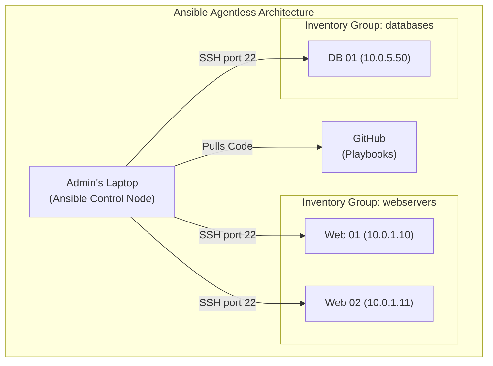
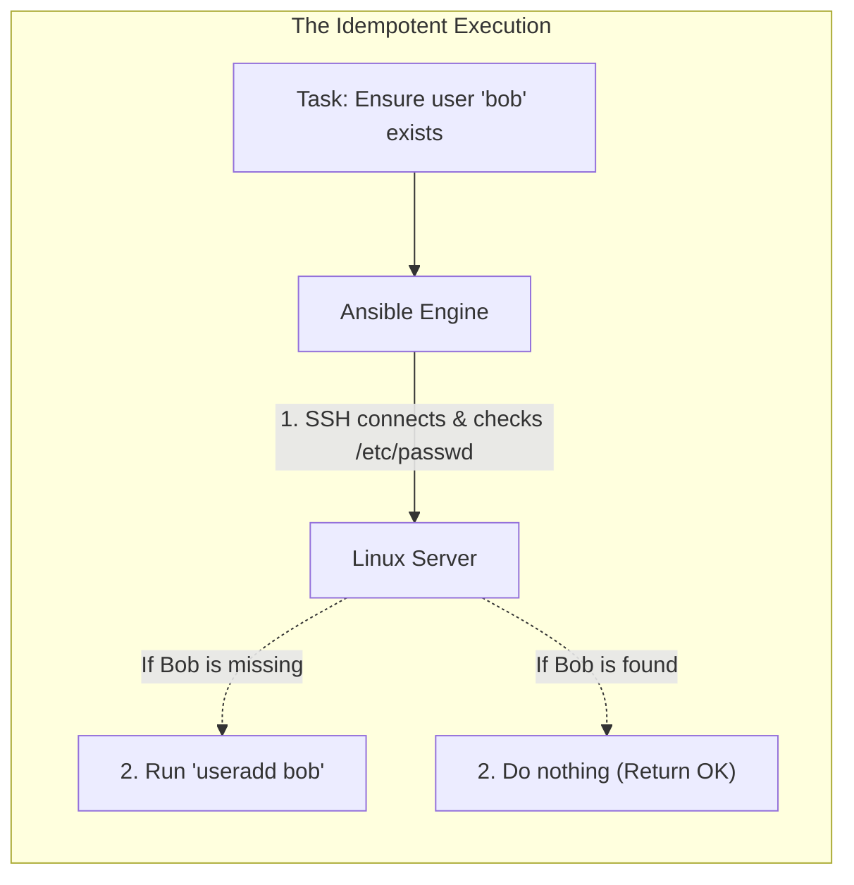
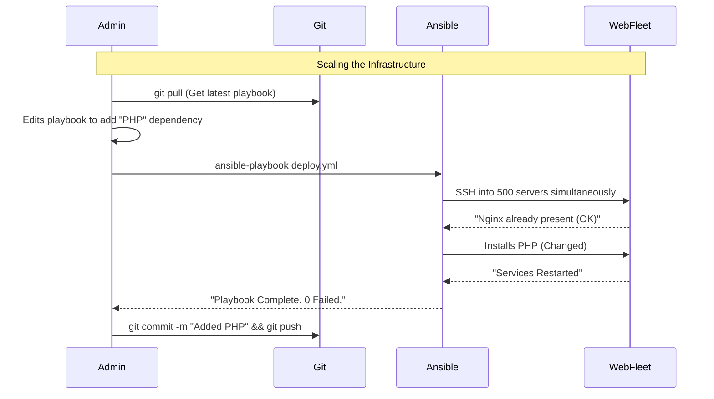

# CHAPTER 81 — CONFIGURATION MANAGEMENT (ANSIBLE BASICS)

---

## 1. Introduction

### Why This Topic Exists
If you have 1 Linux server, and you need to install Nginx, edit the configuration file, and restart the service, it takes 3 minutes. What if you have 500 Linux servers? It takes a human being 25 hours of non-stop typing to do it manually. Even worse, humans make typos. Server #412 gets a broken config file and crashes. To manage enterprise infrastructure at scale, you must use **Configuration Management** tools. **Ansible** is the industry standard tool for automating massive fleets of Linux servers.

### Why Linux Administrators Use It
Linux administrators write "Playbooks" in YAML. A playbook is a simple text file that declares the desired state of a server (e.g., "Nginx must be installed. Nginx must be running."). The administrator runs the playbook from their laptop, and Ansible logs into all 500 servers simultaneously over SSH, executes the tasks, and guarantees that every single server is perfectly identical.

### Why Companies Care About It
Infrastructure as Code (IaC) and Idempotency. 
- **Infrastructure as Code:** Because Ansible playbooks are just text files, companies can store their entire server architecture in Git (Version Control). 
- **Idempotency:** A Bash script is dangerous. If a Bash script runs `useradd bob`, and you run the script twice, the second time it crashes with a fatal error because Bob already exists. Ansible is *idempotent*. If you tell Ansible "Bob must exist," and you run it 1,000 times, Ansible checks first. If Bob is there, it does nothing and safely moves on. This guarantees predictable automation.

---

## 2. Learning Objectives

By the end of this chapter, you will be able to:
- Explain the Agentless architecture of Ansible.
- Understand the difference between the Control Node and Managed Nodes.
- Create an Inventory file (`hosts`).
- Run ad-hoc commands across multiple servers (`ansible all -m ping`).
- Write a basic YAML Playbook to install packages and start services.
- Execute a playbook using `ansible-playbook`.

---

## 3. Beginner-Friendly Explanation

Think of a General commanding an army:
- **The Old Way (Bash Scripts):** The General has to walk up to 500 individual soldiers, grab their hands, and physically move their arms to teach them how to dig a trench.
- **Ansible (Configuration Management):** The General (The Control Node) stands on a hill with a megaphone. The General shouts, "Trench must be 5 feet deep!" (The Playbook). The 500 soldiers (The Managed Nodes) all instantly grab shovels and dig. If a soldier's trench is already 5 feet deep, they simply stand still and do nothing (Idempotency).

---

## 4. Core Theory

### 4.1 The Agentless Architecture
Many older automation tools (like Puppet or Chef) required you to install a heavy "Agent" software on every single server you wanted to control. This was a nightmare to maintain. 
**Ansible is Agentless.** You only install Ansible on ONE machine (your laptop, or a central Control Node). Ansible simply uses standard SSH to log into the remote servers, execute python commands, and log out. If a server has SSH running, it can be managed by Ansible immediately.

### 4.2 The Inventory
Ansible doesn't magically know where your servers are. You must provide an **Inventory** file. This is a simple text file grouping your IP addresses (e.g., `[webservers]`, `[databases]`).

### 4.3 Modules
Ansible doesn't use raw bash commands by default. It uses "Modules". 
Instead of running `dnf install httpd`, you use the `dnf` module. Instead of `systemctl start httpd`, you use the `service` module. Modules are the python scripts that actually perform the idempotent checks under the hood.

---

## 5. Internal Working

### Python Dependency
While Ansible is agentless, the target server MUST have Python installed. When you run an Ansible Playbook, the Control Node dynamically generates a tiny Python script, copies it over SSH to the target server's `/tmp` directory, executes the Python script to make the changes, and then deletes the script to leave no trace.

---

## 6. Production Architecture



---

## 7. Command-by-Command Explanation

### 7.1 `dnf install ansible-core`
- **Purpose:** Installs Ansible on the Control Node (your laptop/bastion host). You DO NOT install this on the target servers.

### 7.2 `ansible all -i hosts -m ping`
- **Purpose:** An "Ad-Hoc" command. It connects to every server listed in the `hosts` inventory file and runs the `ping` module. (This is NOT an ICMP ping. This is an Ansible ping that verifies SSH connectivity and Python availability).

### 7.3 `ansible webservers -i hosts -m command -a "uptime"`
- **Purpose:** Runs a raw Linux command (`uptime`) on all servers in the `[webservers]` group and prints the results to your screen.

### 7.4 `ansible-playbook -i hosts setup_web.yml`
- **Purpose:** Executes a YAML playbook, orchestrating complex configuration changes across the fleet.

---

## 8. Syntax Breakdown

**The YAML Playbook (`setup_web.yml`)**

YAML is incredibly strict about spaces (indentation). **NEVER use the Tab key.** Always use 2 spaces.

```yaml
---
- name: Configure Web Servers
  hosts: webservers
  become: yes               # Become root using sudo

  tasks:
    - name: Install Nginx
      ansible.builtin.dnf:  # The Module
        name: nginx
        state: present      # Idempotent state! (Ensure it exists)

    - name: Ensure Nginx is running
      ansible.builtin.service: # The Module
        name: nginx
        state: started
        enabled: yes
```

---

## 9. Parameter Explanation

| Module Parameter | Meaning |
|:---|:---|
| `state: present` | Ensure the package/file exists. If it isn't there, install/create it. |
| `state: absent` | Ensure the package/file is GONE. If it is there, delete it. |
| `state: latest` | Run `dnf update <package>` to get the newest version. |
| `become: yes` | Escalate privileges. Equivalent to running the command with `sudo`. Required for almost all system administration tasks. |

---

## 10. Sample Output Analysis

**Scenario:** We run our `setup_web.yml` playbook against two servers.
**Command:** `ansible-playbook -i hosts setup_web.yml`

**Output:**
```text
PLAY [Configure Web Servers] ***************************************************

TASK [Gathering Facts] *********************************************************
ok: [10.0.1.10]
ok: [10.0.1.11]

TASK [Install Nginx] ***********************************************************
changed: [10.0.1.10]
ok: [10.0.1.11]

TASK [Ensure Nginx is running] *************************************************
changed: [10.0.1.10]
ok: [10.0.1.11]

PLAY RECAP *********************************************************************
10.0.1.10                  : ok=3    changed=2    unreachable=0    failed=0
10.0.1.11                  : ok=3    changed=0    unreachable=0    failed=0
```

**Analysis:**
- **Gathering Facts:** Ansible automatically scans the target servers first, learning their IP addresses, OS versions, and RAM capacity.
- **changed vs ok:** This proves **Idempotency**! 
  - Server `10.0.1.10` did NOT have Nginx installed. Ansible installed it (`changed`).
  - Server `10.0.1.11` ALREADY had Nginx perfectly configured. Ansible recognized this, did absolutely nothing, and marked it `ok`.

---

## 11. Architecture Diagram



---

## 12. Workflow Diagram



---

## 13. Real Production Examples

### Pushing Configuration Files (The `template` module)
You have a custom Nginx configuration file (`nginx.conf`) on your laptop. You need to push it to 500 servers. You do NOT `scp` it 500 times. You write an Ansible task:
```yaml
    - name: Push Nginx Config
      ansible.builtin.template:
        src: ./files/nginx.conf
        dest: /etc/nginx/nginx.conf
        owner: root
        mode: '0644'
      notify: Restart Nginx
```
Ansible copies the file to all 500 servers and strictly enforces the `0644` file permissions.

### Handlers (Conditional Restarts)
If you push a new `nginx.conf` file, you MUST restart the Nginx service for the changes to take effect. But if you run the playbook tomorrow, and the config file hasn't changed, you do NOT want to restart Nginx and drop customer traffic for no reason.
Ansible uses `notify` and `handlers`. In the example above, if the `template` module actually changes the file, it "notifies" a handler at the bottom of the playbook to restart Nginx. If the file is already perfect (`ok`), the handler is ignored, and the service is never restarted.

---

## 14. Common Mistakes

1. **SSH Key Warnings** — When you SSH into a server for the very first time, Linux asks: `Are you sure you want to continue connecting (yes/no)?`. If you run Ansible against 500 brand new servers, Ansible will get stuck waiting for you to type `yes` 500 times. In `/etc/ansible/ansible.cfg`, administrators must set `host_key_checking = False` to bypass this prompt for massive automated deployments.
2. **YAML Indentation Errors** — YAML does not forgive. If a line is indented with 3 spaces instead of 4, the entire playbook will violently crash with a `Syntax Error`. Always use a code editor (like VSCode or Vim) that automatically aligns spaces for YAML files.
3. **Running Ad-Hoc commands instead of Playbooks** — A junior admin uses `ansible all -m command -a "yum update -y"` to update servers. This defeats the purpose of Configuration Management. Ad-hoc commands leave no Git history, are not idempotent, and cannot be peer-reviewed. All infrastructure changes must be written into YAML playbooks.

---

## 15. Best Practices

- **Ansible Vault:** If your playbook needs to create a database user, you have to type the database password in the playbook. Do NOT commit plaintext passwords to GitHub! Use `ansible-vault encrypt secrets.yml`. This encrypts the file using AES256. When you run the playbook, you use `--ask-vault-pass`, and Ansible decrypts it on the fly in RAM.
- **Ansible Galaxy:** You don't have to write everything from scratch. Ansible Galaxy (`ansible-galaxy`) is a massive community repository. Need to install a complex Kubernetes cluster? Don't write it yourself. Download the official playbook from Ansible Galaxy and execute it.

---

## 16. Security Considerations

- **SSH Agent Forwarding:** Ansible requires passwordless SSH access (Key Pairs) to all target servers. The Control Node (your laptop) holds the ultra-powerful Private Key that can access the entire enterprise. The Control Node is the most critical security chokepoint in the company. It must be heavily restricted.

---

## 17. Performance Considerations

- **Forks:** By default, Ansible runs in batches of 5 (it configures 5 servers, then the next 5). If you are deploying to 5,000 servers, this will take hours. You can increase the `forks` parameter in `ansible.cfg` to 50 or 100. This tells Ansible to configure 100 servers simultaneously, provided the Control Node has enough CPU and RAM to handle 100 concurrent SSH connections.

---

## 18. Troubleshooting Guide

| Symptom | Root Cause | Resolution |
|:---|:---|:---|
| `UNREACHABLE! Failed to connect to the host via ssh` | Network / Key issue | Verify you can manually `ssh -i key.pem user@IP`. |
| `Missing sudo password` | Become method blocked | The target server requires a password for `sudo`. Add `--ask-become-pass` to the Ansible command. |
| Syntax Error at line X | YAML Formatting | Check your spaces. Lists (dashes `-`) and dictionary keys must perfectly align. |

---

## 19. Practical Labs

**Lab 81.1:** The Ad-Hoc Ping
1. `sudo dnf install ansible-core -y`
2. Create a test inventory file: `echo -e "[local]\n127.0.0.1" > hosts`
3. Generate an SSH key and inject it into yourself (so Ansible can connect passwordlessly):
   `ssh-keygen -t rsa -N ""`
   `ssh-copy-id localhost`
4. Run the Ansible Ping module:
   `ansible local -i hosts -m ping`
5. You should see `"ping": "pong"` in green text!

**Lab 81.2:** Your First Playbook
1. Create `test.yml`:
```yaml
---
- name: My First Playbook
  hosts: local
  become: yes
  tasks:
    - name: Create a test directory
      ansible.builtin.file:
        path: /opt/ansible_test
        state: directory
        mode: '0755'
```
2. Run it: `ansible-playbook -i hosts test.yml`
3. Verify the directory exists: `ls -ld /opt/ansible_test`
4. Run it again! Notice it says `ok` instead of `changed` because the directory is already there. Idempotency!

---

## 20. Mini Project

The Apache Web Server Deployment.
Write a playbook that fully installs and starts a web server.
`vim web.yml`
```yaml
---
- name: Deploy Web Server
  hosts: local
  become: yes
  tasks:
    - name: Install Apache
      ansible.builtin.dnf:
        name: httpd
        state: present

    - name: Create a custom homepage
      ansible.builtin.copy:
        content: "<h1>Deployed by Ansible!</h1>"
        dest: /var/www/html/index.html

    - name: Start Apache
      ansible.builtin.service:
        name: httpd
        state: started
        enabled: yes
```
Run it: `ansible-playbook -i hosts web.yml`
Test it: `curl localhost`. It works flawlessly!

---

## 21. Assignments

1. What is the fundamental difference between an Agentless architecture (Ansible) and an Agent-based architecture (Puppet)?
2. What does the term "Idempotent" mean in the context of Configuration Management?
3. What is the purpose of the `become: yes` directive in an Ansible playbook?

---

## 22. Interview Questions

### Basic
1. **Q: What file format are Ansible playbooks written in?**
   A: YAML (YAML Ain't Markup Language).

2. **Q: You want to run an Ansible playbook named `deploy.yml` against a list of servers stored in a file named `prod_hosts`. What is the exact command?**
   A: `ansible-playbook -i prod_hosts deploy.yml`

### Intermediate
3. **Q: A junior administrator writes a Bash script to automate server setups. You tell them they must rewrite it in Ansible. They argue that Bash is faster to write. Give two major technical reasons why Ansible is superior for enterprise automation.**
   A: First, Ansible is idempotent; it checks the state of the system before executing, preventing destructive failures if a script is run multiple times. Second, Ansible is declarative (Infrastructure as Code). The playbooks are highly readable by humans, version-controllable in Git, and can be executed across 1,000 servers simultaneously with parallel threading, which is incredibly difficult to script manually in Bash.

4. **Q: You run an Ansible playbook that uses the `template` module to push a new Nginx configuration file. The configuration is updated successfully on the target servers, but the Nginx service doesn't apply the changes. How do you fix the playbook so it automatically restarts the service, BUT ONLY when the configuration file actually changes?**
   A: I must use `notify` and `handlers`. I will add a `notify: Restart Nginx` directive to the template task. At the bottom of the playbook, I will create a `handlers` section with a task named `Restart Nginx` that runs the service restart module. Ansible will only trigger the handler if the template task reports a `changed` state.

### Scenario-Based
5. **Q: You are hired to manage 500 Linux servers. You install Ansible on your laptop. You write a perfect playbook to patch the servers. You run the playbook. The terminal freezes for 3 minutes, and then vomits 500 lines of `UNREACHABLE! Failed to connect to the host via ssh`. You verify the corporate network is up, and you verify the servers are powered on. What specific architectural prerequisite did you fail to establish between the Control Node (your laptop) and the 500 target servers before running Ansible?**
   A: Ansible is agentless and relies entirely on SSH for transport. The massive failure occurred because I did not distribute the SSH Public Key from the Control Node (my laptop) to the `/root/.ssh/authorized_keys` files on the 500 target servers. Without this SSH Key trust established, Ansible cannot authenticate automatically, and the connections are violently rejected. I must establish Key-Based authentication across the fleet before Ansible can function.

---

## 23. Chapter Summary and Quick Revision Notes

- **Configuration Management:** Managing infrastructure at scale using code instead of manual commands.
- **Agentless:** Requires no software on the target servers, just Python and SSH.
- **Idempotency:** The golden rule. Check state first, change only if necessary.
- **Control Node:** The laptop/server running Ansible.
- **Inventory (hosts):** The text file grouping the target IP addresses.
- **Playbook:** The YAML file containing the instructions.
- **Modules:** The python tools (`dnf`, `service`, `file`, `copy`) that do the work.
- **`become: yes`:** Ansible's way of executing `sudo`.
- **Ansible Vault:** Encrypts passwords so they can be stored in Git safely.

---

## 24. Cheat Sheet

| Command / Syntax | Purpose |
|:---|:---|
| `ansible all -m ping` | Verify SSH and Python across the fleet |
| `ansible-playbook -i hosts pb.yml` | Execute a playbook |
| `ansible-vault encrypt file.yml` | Encrypt a file containing secrets |
| `ansible.builtin.dnf:` | Module to manage packages |
| `ansible.builtin.service:`| Module to manage systemd services |
| `ansible.builtin.copy:` | Module to push files to servers |
| `become: yes` | Run task as root |
| `host_key_checking = False` | `ansible.cfg`: Stop SSH confirmation prompts |
