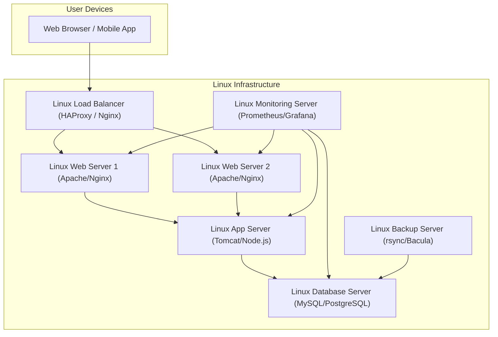
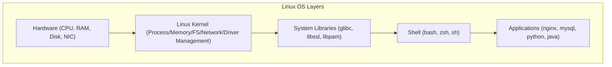
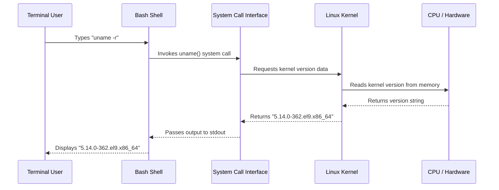

# CHAPTER 01 — HISTORY OF UNIX AND LINUX

---

## 1. Introduction

### Why This Topic Exists
Every technology has a story, and the story of Linux begins with Unix — a revolutionary operating system created in 1969 that fundamentally changed how humans interact with computers. Linux, born in 1991, carried forward that vision by making a powerful operating system completely free and open to the world. Today, Linux powers over 90 percent of the world's top servers, every Android smartphone, the International Space Station, all major cloud platforms (AWS, Azure, GCP), and 100 percent of the world's top 500 supercomputers.

### Why Linux Administrators Use It
Understanding the history of Linux helps engineers appreciate why certain design decisions were made — why the filesystem is a single tree rooted at `/`, why everything is treated as a file, why the command line is so powerful, and why the open-source licensing model has created the largest collaborative software project in human history.

### Why Companies Care About It
Companies that invest in Linux-based infrastructure benefit from zero licensing costs, vendor independence, kernel-level customizability, unmatched stability (servers running for years without rebooting), and access to the largest talent pool in enterprise computing. Understanding how Linux evolved helps engineers make informed technology decisions when choosing distributions, evaluating vendor support contracts, and planning infrastructure migrations.

---

## 2. Learning Objectives

By the end of this chapter, you will be able to:
- Describe the creation of Unix at AT&T Bell Labs in 1969 and explain its foundational design principles.
- Explain the Free Software Movement started by Richard Stallman and the GNU Project.
- Describe how Linus Torvalds created the Linux kernel in 1991.
- Explain the difference between the Linux Kernel and a Linux Distribution.
- Understand the GPL (GNU General Public License) and what open source means in practice.
- Identify the key milestones in Linux history from 1991 to the present day.

---

## 3. Beginner-Friendly Explanation

Imagine you want to build a car:
- **Unix (1969)** was the original blueprint for a high-performance engine designed by expert mechanics at AT&T Bell Labs. It worked brilliantly, but the blueprint was proprietary — you had to pay expensive licensing fees to use it.
- **Richard Stallman (1983)** said, "Everyone should be able to build their own car for free." He started the GNU Project to create free tools (steering wheel, brakes, seats, dashboard) but never completed the engine itself.
- **Linus Torvalds (1991)** was a 21-year-old Finnish university student who built a free engine (the Linux Kernel) in his bedroom. When he combined his engine with Stallman's free car parts, a complete free car was born — **GNU/Linux**.
- **Distributions** are different car manufacturers (Red Hat, Ubuntu, Debian, SUSE) who take the same free engine and tools, add their own paint jobs, dashboards, and warranties, and sell support services.

Today, this "free car" runs 90 percent of the internet, every cloud platform, and every Android phone in the world.

---

## 4. Core Theory

### 4.1 The Birth of Unix (1969–1979)
Unix was created in 1969 at AT&T Bell Laboratories by **Ken Thompson** and **Dennis Ritchie**. Thompson originally wrote Unix in assembly language for a PDP-7 minicomputer. In 1972, Dennis Ritchie rewrote it in the **C programming language**, making Unix the first operating system that could be ported across different hardware architectures.

**Core Unix Design Principles:**
- **Everything is a file** — Devices, processes, and sockets are represented as files in the filesystem.
- **Small, single-purpose tools** — Each command does one thing well (`ls` lists, `grep` searches, `wc` counts).
- **Pipe composition** — Small tools are chained together using the pipe operator (`|`) to build complex operations.
- **Plain text configuration** — Configuration files are human-readable text, not binary blobs.
- **Multi-user, multi-tasking** — Multiple users can run multiple programs simultaneously on the same hardware.

### 4.2 The Unix Fragmentation Problem (1980s)
AT&T began licensing Unix commercially, which led to proprietary forks:
- **BSD (Berkeley Software Distribution)** — University of California, Berkeley
- **HP-UX** — Hewlett-Packard
- **AIX** — IBM
- **Solaris** — Sun Microsystems
- **SCO Unix** — Santa Cruz Operation

Each vendor modified Unix for their own hardware, creating vendor lock-in and incompatibility. This fragmentation made Unix expensive and inaccessible to individuals and small organisations.

### 4.3 The Free Software Movement and GNU Project (1983)
In 1983, **Richard Stallman**, a programmer at MIT, launched the **GNU Project** (GNU's Not Unix) with the goal of creating a complete Unix-compatible operating system that would be entirely free software.

Stallman defined **Four Freedoms** of Free Software:
1. **Freedom 0** — The freedom to run the programme for any purpose.
2. **Freedom 1** — The freedom to study and modify the source code.
3. **Freedom 2** — The freedom to redistribute copies.
4. **Freedom 3** — The freedom to distribute modified versions.

By 1990, the GNU Project had created compilers (GCC), text editors (Emacs), shells (Bash), and core utilities (coreutils) — but the kernel (GNU Hurd) was incomplete.

### 4.4 The Birth of Linux (1991)
On **25 August 1991**, a 21-year-old computer science student at the University of Helsinki named **Linus Torvalds** posted a message to the Usenet newsgroup `comp.os.minix`:

> *"I'm doing a (free) operating system (just a hobby, won't be big and professional like gnu) for 386(486) AT clones."*

Torvalds released the **Linux kernel version 0.01** under the GPL license in September 1991. When combined with the existing GNU tools, it created a complete, free, Unix-like operating system — **GNU/Linux**.

### 4.5 The Linux Kernel vs a Linux Distribution
- **Linux Kernel:** The core engine — manages hardware, memory, processes, filesystems, and networking. Developed by Linus Torvalds and thousands of contributors. Current stable version: 6.x.
- **Linux Distribution:** A complete operating system package that includes the Linux kernel plus package managers, system libraries, desktop environments, configuration tools, and support services.

### 4.6 Key Milestones in Linux History

| Year | Milestone |
|:---|:---|
| **1969** | Unix created at AT&T Bell Labs by Thompson and Ritchie |
| **1983** | Richard Stallman launches the GNU Project and Free Software Foundation |
| **1991** | Linus Torvalds releases Linux kernel 0.01 |
| **1993** | Debian and Slackware distributions released |
| **1994** | Linux kernel 1.0 released; Red Hat Linux founded |
| **1998** | IBM invests $1 billion in Linux development |
| **2003** | Red Hat Enterprise Linux (RHEL) launched as commercial product |
| **2004** | Ubuntu 4.10 (Warty Warthog) released by Canonical |
| **2005** | Linus Torvalds creates Git version control system |
| **2008** | Google releases Android (built on the Linux kernel) |
| **2011** | Linux kernel 3.0 released; runs on 95% of supercomputers |
| **2014** | Microsoft CEO Satya Nadella declares "Microsoft loves Linux" |
| **2019** | IBM acquires Red Hat for $34 billion — largest open-source acquisition in history |
| **2020** | 100% of the world's top 500 supercomputers run Linux |
| **2021** | CentOS 8 discontinued; Rocky Linux and AlmaLinux emerge as replacements |
| **2024** | Linux kernel 6.x; Linux dominates cloud, containers, edge, and IoT |

---

## 5. Internal Working

The Linux kernel operates in **kernel space** — a protected memory region with direct access to CPU, RAM, storage controllers, and network interface cards. User applications operate in **user space** and communicate with the kernel through **system calls** (syscalls).

```text
┌──────────────────────────────────────────────┐
│              User Space Applications          │
│   (bash, nginx, mysql, python, java, ls)      │
├──────────────────────────────────────────────┤
│            System Call Interface (syscalls)    │
│        (open, read, write, fork, exec, ioctl) │
├──────────────────────────────────────────────┤
│                 Linux Kernel                  │
│  ┌──────────┬──────────┬──────────────────┐   │
│  │ Process  │ Memory   │ Filesystem       │   │
│  │ Scheduler│ Manager  │ Layer (VFS)      │   │
│  ├──────────┼──────────┼──────────────────┤   │
│  │ Network  │ Device   │ Security         │   │
│  │ Stack    │ Drivers  │ (SELinux/DAC)    │   │
│  └──────────┴──────────┴──────────────────┘   │
├──────────────────────────────────────────────┤
│                Hardware Layer                 │
│    (CPU, RAM, NVMe/SSD, NIC, GPU)             │
└──────────────────────────────────────────────┘
```

---

## 6. Production Architecture

In enterprise environments, Linux serves as the foundation of every infrastructure layer:



---

## 7. Command-by-Command Explanation

### 7.1 `uname -a`
- **Purpose:** Displays kernel name, hostname, kernel version, machine architecture, and OS type.
- **Syntax:** `uname [OPTIONS]`
- **Parameters:**
  - `-a` : Print all system information.
  - `-r` : Print kernel release version only.
  - `-m` : Print machine hardware architecture (x86_64).
- **Example Output:**
  ```
  Linux prod-web-01 5.14.0-362.el9.x86_64 #1 SMP x86_64 GNU/Linux
  ```
- **Output Analysis:**
  - `Linux` — Kernel name
  - `prod-web-01` — Hostname
  - `5.14.0-362.el9.x86_64` — Kernel version (5.14.0 = major.minor.patch, el9 = Enterprise Linux 9)
  - `x86_64` — 64-bit CPU architecture
  - `GNU/Linux` — Operating system type

### 7.2 `cat /etc/os-release`
- **Purpose:** Displays distribution name, version, and vendor information.
- **Syntax:** `cat /etc/os-release`
- **Sample Output:**
  ```text
NAME="CentOS Stream"
VERSION="9"
ID="centos"
ID_LIKE="rhel fedora"
VERSION_ID="9"
PLATFORM_ID="platform:el9"
PRETTY_NAME="CentOS Stream 9"
ANSI_COLOR="0;31"
LOGO="fedora-logo-icon"
CPE_NAME="cpe:/o:centos:centos:9"
HOME_URL="https://centos.org/"
BUG_REPORT_URL="https://issues.redhat.com/"
REDHAT_SUPPORT_PRODUCT="Red Hat Enterprise Linux 9"
REDHAT_SUPPORT_PRODUCT_VERSION="CentOS Stream"
  ```

---

## 8. Syntax Breakdown

| Command | Flag | Meaning |
|:---|:---|:---|
| `uname` | `-a` | All information |
| `uname` | `-r` | Kernel release version |
| `uname` | `-m` | Machine hardware name |
| `uname` | `-n` | Network hostname |
| `uname` | `-s` | Kernel name |

---

## 9. Parameter Explanation

| Parameter | Type | Description |
|:---|:---|:---|
| `-a` | Boolean flag | Combines all flags into a single comprehensive output line |
| `-r` | Boolean flag | Returns only the kernel version string, useful in scripts for version checking |

---

## 10. Sample Output Analysis

```bash
$ uname -r
5.14.0-362.el9.x86_64
```

| Segment | Meaning |
|:---|:---|
| `5` | Major kernel version |
| `14` | Minor version (feature additions) |
| `0` | Patch level (bug fixes) |
| `362` | Red Hat build iteration number |
| `el9` | Enterprise Linux 9 (RHEL 9 / Rocky 9 / AlmaLinux 9) |
| `x86_64` | 64-bit Intel/AMD architecture |

---

## 11. Architecture Diagram



---

## 12. Workflow Diagram



---

## 13. Real Production Examples

### Banking Environment
A major Indian bank (SBI, HDFC, ICICI scale) runs its core banking application on 500+ RHEL 9 servers across two data centres. The Linux servers handle 10 million transactions per day, running Java applications on Apache Tomcat, with MySQL databases on dedicated Linux database servers. Linux was chosen because of zero licensing cost per core (saving crores in Windows Server licensing), 99.999% uptime capability, and kernel-level security (SELinux mandatory access control).

### E-Commerce Flash Sale
During a Flipkart Big Billion Days sale, traffic spikes from 5 million to 50 million concurrent users. The entire infrastructure — load balancers, web servers, application servers, caching layers (Redis), and databases — runs on Linux. Auto-scaling groups on AWS EC2 spin up hundreds of new Linux instances within seconds to absorb the traffic spike.

---

## 14. Common Mistakes

1. **Saying "Linux is an operating system"** — Technically, Linux is only the kernel. The complete OS is GNU/Linux or a distribution (RHEL, Ubuntu).
2. **Confusing free (cost) with free (freedom)** — Free software means freedom to modify and distribute, not necessarily zero cost. RHEL is free software but requires a paid subscription for support.
3. **Assuming all Linux distributions are identical** — RHEL uses `dnf`, Ubuntu uses `apt`, they have different directory structures for services, different init systems across versions, and different security frameworks.
4. **Ignoring distribution lifecycle** — CentOS 8 was discontinued unexpectedly. Engineers must track distribution End-of-Life dates.

---

## 15. Best Practices

- Always use Long-Term Support (LTS) or Extended Life Cycle distributions for production servers.
- Standardise on a single distribution family across your organisation (e.g., all RHEL 9, or all Ubuntu 22.04 LTS).
- Subscribe to vendor security advisories (Red Hat Security Advisories, Ubuntu Security Notices).
- Track kernel versions across your fleet using configuration management tools (Ansible, Puppet, Chef).

---

## 16. Security Considerations

- Keep kernels patched. Unpatched kernels are vulnerable to privilege escalation exploits (e.g., Dirty COW CVE-2016-5195, Dirty Pipe CVE-2022-0847).
- Use distributions with mandatory access control frameworks (SELinux on RHEL, AppArmor on Ubuntu).
- Prefer minimal installation profiles for servers — fewer installed packages mean fewer attack surfaces.

---

## 17. Performance Considerations

- Newer kernels include performance improvements: better I/O schedulers (mq-deadline, BFQ), improved memory management (transparent huge pages), and enhanced CPU schedulers (CFS, EEVDF in kernel 6.6+).
- Match your kernel version to your workload — database servers benefit from the latest I/O scheduler improvements.

---

## 18. Troubleshooting Guide

| Symptom | Root Cause | Resolution |
|:---|:---|:---|
| `uname -r` shows old kernel after update | Server not rebooted after kernel patch | Reboot server: `sudo reboot` |
| `cat /etc/os-release` shows unexpected distro | Server was migrated or re-imaged incorrectly | Verify with `rpm -qa \| grep release` |
| Application incompatibility after kernel upgrade | Application depends on specific kernel version | Check vendor compatibility matrix; consider `kexec` for rapid kernel rollback |

---

## 19. Practical Labs

**Lab 1.1:** Open a terminal and run the following commands. Document the output of each:
```bash
uname -a
uname -r
uname -m
cat /etc/os-release
hostnamectl
```

**Lab 1.2:** Research and document the End-of-Life dates for:
- RHEL 7, RHEL 8, RHEL 9
- Ubuntu 20.04 LTS, Ubuntu 22.04 LTS, Ubuntu 24.04 LTS
- CentOS 7 (last CentOS with full support)

---

## 20. Mini Project

Create a one-page "Linux Timeline Infographic" document listing the 15 most important dates in Linux history (from 1969 to 2024) with a one-sentence description for each event. Save it as `~/linux_timeline.md`.

---

## 21. Assignments

1. Write a 200-word essay explaining why Linus Torvalds released the Linux kernel under the GPL license rather than keeping it proprietary.
2. List five Unix design principles and explain how each one is still visible in modern Linux commands.
3. Research and document three real-world companies that migrated from Windows Server to Linux, including their stated reasons.

---

## 22. Interview Questions

### Basic
1. **Q: What is the difference between Unix and Linux?**
   A: Unix was created in 1969 at AT&T Bell Labs as a proprietary, commercial operating system. Linux was created in 1991 by Linus Torvalds as a free, open-source Unix-like kernel released under the GPL license. Unix requires commercial licensing; Linux is freely available.

2. **Q: Who created Linux and when?**
   A: Linus Torvalds, a 21-year-old Finnish computer science student, created the Linux kernel in 1991 at the University of Helsinki.

### Intermediate
3. **Q: What is the difference between the Linux kernel and a Linux distribution?**
   A: The Linux kernel is the core engine that manages hardware, processes, memory, and filesystems. A Linux distribution is a complete operating system that bundles the Linux kernel with package managers, system libraries, configuration tools, and optional desktop environments. Examples include RHEL, Ubuntu, Debian, and SUSE.

4. **Q: What does GPL stand for and what does it guarantee?**
   A: GPL stands for GNU General Public License. It guarantees four freedoms: the freedom to run the software, study its source code, redistribute copies, and distribute modified versions. Any derivative work must also be released under the GPL.

### Advanced
5. **Q: Why did IBM acquire Red Hat for $34 billion? What does this tell us about the value of Linux in enterprise computing?**
   A: IBM acquired Red Hat to gain dominance in the hybrid cloud and enterprise Linux market. Red Hat's value lies not in the Linux code itself (which is free) but in its enterprise support subscriptions, certification ecosystem, consulting services, and deep integration with cloud platforms (OpenShift, Ansible). This acquisition validated that Linux and open source are the foundation of modern enterprise computing.

### Scenario-Based
6. **Q: Your company currently runs 200 CentOS 8 servers. CentOS 8 has reached end-of-life. What is your migration strategy?**
   A: I would evaluate three options: (1) Migrate to Rocky Linux 8 or AlmaLinux 8, which are binary-compatible CentOS replacements with minimal migration effort. (2) Migrate to RHEL 8 if the company requires commercial vendor support and SLAs. (3) Plan a phased upgrade to RHEL 9 or Rocky 9 if the application stack supports it. I would test the migration on a non-production environment first, validate application compatibility, and execute the migration in batches during maintenance windows.

---

## 23. Chapter Summary and Quick Revision Notes

- Unix was created in 1969 at Bell Labs; Linux kernel was created in 1991 by Linus Torvalds.
- GNU Project (1983) provided free tools; Linux kernel completed the free OS.
- The Linux kernel is the engine; a distribution is the complete car.
- GPL guarantees four freedoms: run, study, redistribute, modify.
- Linux runs 90%+ of servers, 100% of supercomputers, and all Android devices.
- Always use LTS distributions in production.

---

## 24. Cheat Sheet

| Command | Purpose |
|:---|:---|
| `uname -a` | Display all kernel and system information |
| `uname -r` | Display kernel release version |
| `uname -m` | Display machine architecture (x86_64) |
| `cat /etc/os-release` | Display distribution name and version |
| `hostnamectl` | Display hostname, OS, kernel, and architecture |
