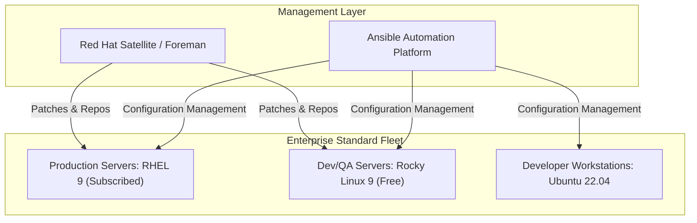
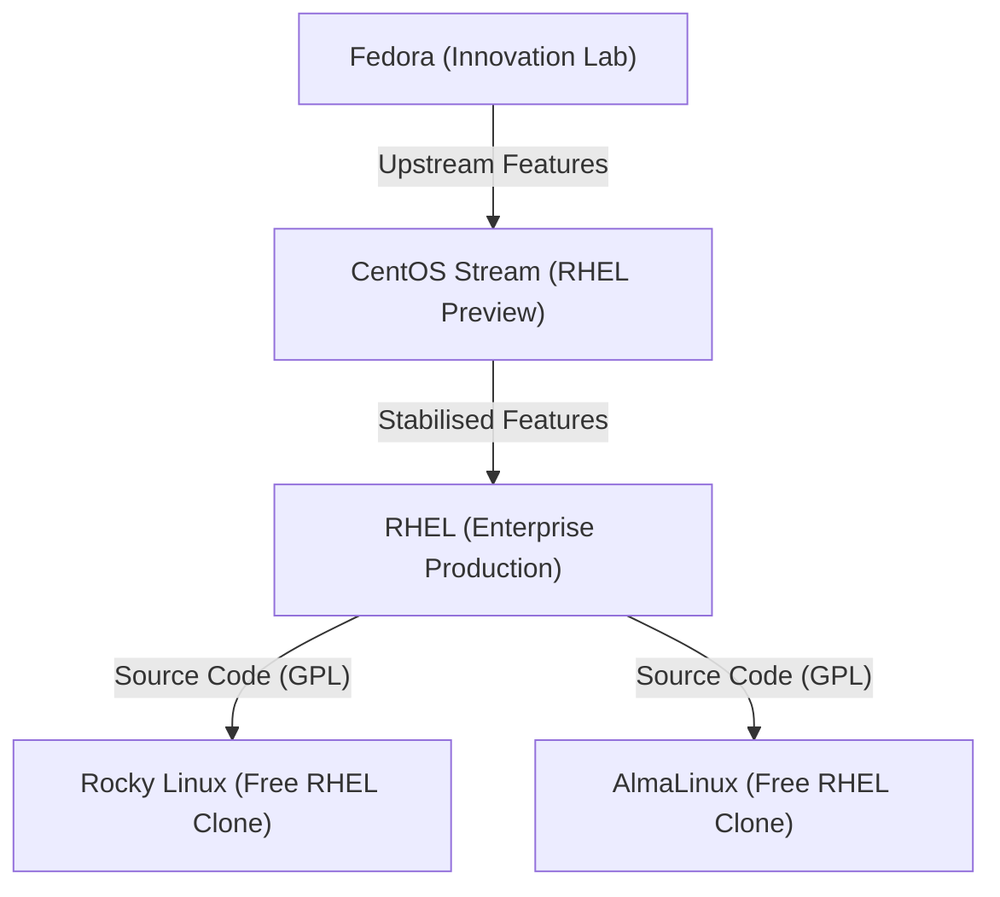
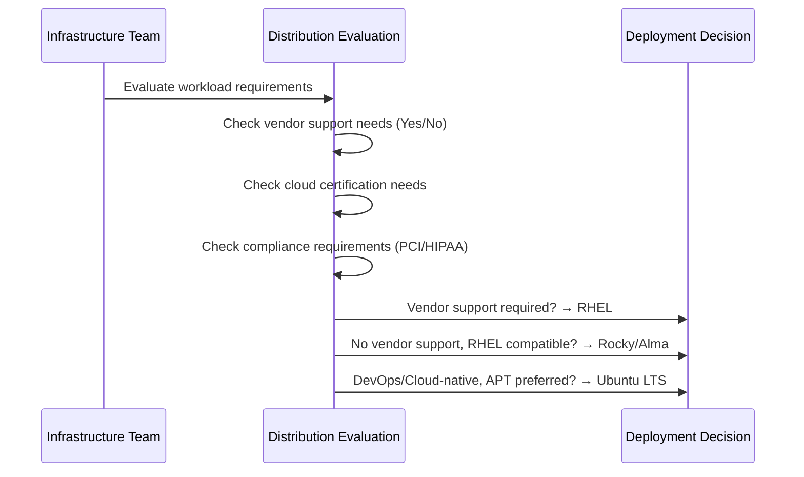

# CHAPTER 02 — LINUX DISTRIBUTIONS AND ECOSYSTEM

---

## 1. Introduction

### Why This Topic Exists
A Linux distribution (distro) is a complete operating system built around the Linux kernel, bundled with system libraries, a package manager, configuration tools, and optional desktop environments. There are over 600 active distributions, but enterprise production environments use only a handful of trusted, commercially supported distributions. Choosing the wrong distribution can lead to vendor lock-in, security gaps, or compliance failures.

### Why Linux Administrators Use It
Linux Engineers must understand distribution families, release cycles, support lifecycles, and package ecosystems to make informed decisions about server provisioning, patch management, and long-term infrastructure planning.

### Why Companies Care About It
Distribution selection determines vendor support availability, security patch response times, hardware certification, cloud marketplace compatibility, and total cost of ownership. A Fortune 500 bank cannot run production workloads on an unsupported or community-only distribution without violating regulatory compliance requirements.

---

## 2. Learning Objectives

By the end of this chapter, you will be able to:
- Classify Linux distributions into major families (Red Hat, Debian, SUSE, Arch).
- Compare RHEL, CentOS, Rocky Linux, AlmaLinux, Ubuntu Server, Debian, and SUSE Linux Enterprise.
- Explain the critical differences between RHEL 7, RHEL 8, and RHEL 9.
- Understand distribution lifecycle policies and End-of-Life (EOL) planning.
- Choose the appropriate distribution for different enterprise workloads.

---

## 3. Beginner-Friendly Explanation

Think of Linux distributions like different car manufacturers building vehicles from the same engine:
- **The Linux Kernel** is the engine — identical across all cars.
- **Red Hat (RHEL)** is like a Mercedes-Benz — premium build quality, expensive support contracts, preferred by banks and governments.
- **CentOS / Rocky Linux / AlmaLinux** are like Hyundai or Kia — built from the same Mercedes blueprints but without the premium warranty, free to use.
- **Ubuntu** is like a Toyota — reliable, popular, excellent community support, great documentation, preferred by startups and developers.
- **Debian** is like a Honda — incredibly stable, conservative updates, preferred by engineers who value long-term reliability over bleeding-edge features.
- **Arch Linux** is like building a car from a kit — maximum control but requires expert knowledge.

---

## 4. Core Theory

### 4.1 Major Distribution Families

```text
                        ┌──── RHEL (Commercial)
                        ├──── CentOS Stream (Rolling Preview)
Red Hat Family ─────────├──── Rocky Linux (Free RHEL Clone)
                        ├──── AlmaLinux (Free RHEL Clone)
                        └──── Fedora (Upstream Innovation)

                        ┌──── Ubuntu Server (Canonical)
Debian Family ──────────├──── Ubuntu Desktop
                        ├──── Debian Stable
                        ├──── Linux Mint
                        └──── Kali Linux (Security)

                        ┌──── SLES (SUSE Linux Enterprise Server)
SUSE Family ────────────└──── openSUSE Leap / Tumbleweed

Independent ────────────├──── Arch Linux
                        ├──── Gentoo
                        └──── Slackware
```

### 4.2 Enterprise Distribution Comparison

| Feature | RHEL | Rocky Linux | AlmaLinux | Ubuntu Server | Debian |
|:---|:---|:---|:---|:---|:---|
| **Vendor** | Red Hat (IBM) | Rocky Enterprise Software Foundation | CloudLinux | Canonical | Debian Project |
| **Cost** | Paid Subscription | Free | Free | Free (Paid support optional) | Free |
| **Package Manager** | `dnf` / `rpm` | `dnf` / `rpm` | `dnf` / `rpm` | `apt` / `dpkg` | `apt` / `dpkg` |
| **Default Filesystem** | XFS | XFS | XFS | Ext4 | Ext4 |
| **Init System** | systemd | systemd | systemd | systemd | systemd |
| **Security Framework** | SELinux | SELinux | SELinux | AppArmor | AppArmor |
| **Support Lifecycle** | 10 years | 10 years | 10 years | 5 years (LTS) / 10 (ESM) | ~5 years |
| **Certification** | AWS, Azure, GCP, SAP, Oracle | AWS, Azure, GCP | AWS, Azure, GCP | AWS, Azure, GCP | Limited |
| **Best For** | Banks, Government, Telecom | Cost-sensitive enterprises | Cost-sensitive enterprises | Startups, DevOps, Cloud-native | Servers requiring maximum stability |

### 4.3 RHEL Version Comparison: RHEL 7 vs RHEL 8 vs RHEL 9

| Feature | RHEL 7 | RHEL 8 | RHEL 9 |
|:---|:---|:---|:---|
| **Release Year** | 2014 | 2019 | 2022 |
| **Kernel Version** | 3.10 | 4.18 | 5.14 |
| **Default Filesystem** | XFS | XFS | XFS |
| **Package Manager** | `yum` (YUM v3) | `dnf` (YUM v4) | `dnf` (YUM v4) |
| **Init System** | systemd (v219) | systemd (v239) | systemd (v252) |
| **Python Default** | Python 2.7 | Python 3.6 (Application Streams) | Python 3.9 |
| **Firewall** | firewalld + iptables backend | firewalld + nftables backend | firewalld + nftables backend |
| **Networking** | NetworkManager + network-scripts | NetworkManager (network-scripts deprecated) | NetworkManager only |
| **Container Runtime** | Docker | Podman (rootless, daemonless) | Podman |
| **Security** | SELinux | SELinux + System-Wide Crypto Policy | SELinux + Enhanced Crypto Policy |
| **End of Life** | June 2024 (Maintenance) | May 2029 | May 2032 |

> **Critical Interview Point:** RHEL 8 replaced `yum` with `dnf`, replaced `iptables` backend with `nftables`, deprecated `network-scripts` in favour of `NetworkManager`, and replaced Docker with Podman.

### 4.4 CentOS Discontinuation and Its Impact
In December 2020, Red Hat announced the end of CentOS Linux 8 (previously a 1:1 binary-compatible RHEL rebuild). CentOS was converted into **CentOS Stream** — a rolling upstream development branch that sits between Fedora and RHEL.

**Replacements:**
- **Rocky Linux** — Founded by Gregory Kurtzer (original CentOS co-founder) to continue providing a free, community-driven RHEL-compatible distribution.
- **AlmaLinux** — Sponsored by CloudLinux, Inc. as a free, stable RHEL binary-compatible distribution.

---

## 5. Internal Working

Each distribution wraps the Linux kernel with its own ecosystem of tools:

| Component | Red Hat Family | Debian Family |
|:---|:---|:---|
| **Package Format** | `.rpm` (RPM Package Manager) | `.deb` (Debian Package) |
| **High-Level Package Tool** | `dnf` (RHEL 8/9), `yum` (RHEL 7) | `apt` / `apt-get` |
| **Low-Level Package Tool** | `rpm` | `dpkg` |
| **Repository Config** | `/etc/yum.repos.d/*.repo` | `/etc/apt/sources.list` |
| **Service Manager** | `systemctl` (systemd) | `systemctl` (systemd) |
| **Network Config** | `/etc/NetworkManager/` + `nmcli` | `/etc/netplan/*.yaml` + `nmcli` |
| **Default Shell** | `bash` | `bash` (Ubuntu), `dash` (Debian /bin/sh) |

---

## 6. Production Architecture



---

## 7. Command-by-Command Explanation

### 7.1 `cat /etc/os-release`
- **Purpose:** Displays distribution name, version, and identification metadata.
- **Syntax:** `cat /etc/os-release`

### 7.2 `cat /etc/redhat-release`
- **Purpose:** RHEL-family specific file showing exact release version.
- **Example Output:** `Red Hat Enterprise Linux release 9.3 (Plow)`

### 7.3 `lsb_release -a`
- **Purpose:** Displays LSB (Linux Standard Base) distribution information (common on Ubuntu/Debian).

### 7.4 `rpm -qa | grep release`
- **Purpose:** Queries RPM database for installed release packages to identify exact distribution.

---

## 8. Syntax Breakdown

| Command | Purpose |
|:---|:---|
| `cat /etc/os-release` | Universal distro identification (all modern distributions) |
| `cat /etc/redhat-release` | RHEL / CentOS / Rocky / Alma specific |
| `cat /etc/debian_version` | Debian family specific |
| `lsb_release -a` | LSB standard query (Ubuntu/Debian) |

---

## 9. Parameter Explanation

The commands in this chapter are file reads (`cat`) or simple queries. They do not accept complex parameters.

---

## 10. Sample Output Analysis

```bash
$ cat /etc/os-release
NAME="CentOS Stream"
VERSION="9"
ID="centos"
ID_LIKE="rhel fedora"
VERSION_ID="9"
PLATFORM_ID="platform:el9"
```

| Field | Meaning |
|:---|:---|
| `NAME` | Human-readable distribution name |
| `VERSION` | Full version with codename |
| `ID` | Machine-readable lowercase identifier |
| `ID_LIKE` | Parent distribution family (rocky is like rhel, centos, fedora) |
| `VERSION_ID` | Numeric version (useful in scripts) |
| `PLATFORM_ID` | Platform designation for module streams |

---

## 11. Architecture Diagram



---

## 12. Workflow Diagram



---

## 13. Real Production Examples

### Banking Sector
Reserve Bank of India mandated guidelines require banks to use commercially supported operating systems with vendor SLAs. All core banking servers run RHEL with active Red Hat subscriptions. Development and testing environments use Rocky Linux to reduce costs.

### Cloud-Native Startup
A SaaS startup deploying on AWS EKS uses Ubuntu 22.04 LTS as the base AMI for EC2 instances and container worker nodes. Ubuntu is chosen for its extensive documentation, broad community support, and Canonical's free tier support.

---

## 14. Common Mistakes

1. **Using CentOS 8 in production after EOL** — CentOS 8 reached end-of-life on 31 December 2021. Any server still running it receives zero security patches.
2. **Mixing distribution families in the same environment** — Running some servers on RHEL and others on Ubuntu creates operational complexity (different package managers, different config paths, different security frameworks).
3. **Ignoring the RHEL 7 to RHEL 8 migration** — RHEL 7 reached end of full support. The transition from `yum` to `dnf`, `iptables` to `nftables`, and Docker to Podman requires careful planning.

---

## 15. Best Practices

- Standardise on one distribution family across your organisation.
- Use RHEL for production, Rocky/Alma for non-production (same binary compatibility, lower cost).
- Track End-of-Life dates in a centralised asset management system.
- Test all application compatibility on the target distribution version before production deployment.

---

## 16. Security Considerations

- RHEL family uses **SELinux** (Mandatory Access Control) by default — more restrictive but more secure.
- Ubuntu/Debian family uses **AppArmor** — profile-based, easier to configure but less granular.
- Always verify that your chosen distribution receives timely CVE security patches.

---

## 17. Performance Considerations

- XFS (default on RHEL) excels at large file and parallel I/O workloads (databases, media servers).
- Ext4 (default on Ubuntu) is excellent for general-purpose workloads and supports online shrinking.
- Newer kernel versions in RHEL 9 (5.14) include better BPF performance tracing, improved memory management, and enhanced NVMe storage support compared to RHEL 7 (3.10).

---

## 18. Troubleshooting Guide

| Symptom | Root Cause | Resolution |
|:---|:---|:---|
| `dnf` command not found | Server is running RHEL 7 (uses `yum`) or Ubuntu (uses `apt`) | Use `yum` on RHEL 7 or `apt` on Ubuntu |
| Application fails after distro migration | Library version mismatch between distributions | Check application vendor support matrix for target distro |
| SELinux denials after migrating from Ubuntu | Ubuntu uses AppArmor; RHEL uses SELinux | Learn SELinux context management: `restorecon`, `semanage` |

---

## 19. Practical Labs

**Lab 2.1:** Run the following commands and document your distribution details:
```bash
cat /etc/os-release
uname -r
rpm -qa | grep release    # RHEL family
lsb_release -a            # Ubuntu/Debian family
```

**Lab 2.2:** Research the current End-of-Life date for your server's distribution version. Is it still within full support?

---

## 20. Mini Project

Create a comparison document `~/distro_comparison.md` that evaluates RHEL 9, Rocky Linux 9, Ubuntu 22.04 LTS, and Debian 12 across: cost, support lifecycle, default filesystem, package manager, security framework, and cloud certifications. Include a recommendation for a hypothetical 50-server banking environment.

---

## 21. Assignments

1. Explain why Red Hat discontinued CentOS 8 and what alternatives exist.
2. List three technical differences between RHEL 8 and RHEL 9.
3. A company is choosing between RHEL 9 and Ubuntu 22.04 LTS for a new e-commerce platform. List the pros and cons of each choice.

---

## 22. Interview Questions

### Basic
1. **Q: Name five popular Linux distributions used in enterprise environments.**
   A: Red Hat Enterprise Linux (RHEL), Rocky Linux, Ubuntu Server, Debian, and SUSE Linux Enterprise Server (SLES).

### Intermediate
2. **Q: What replaced CentOS 8 after its discontinuation?**
   A: Rocky Linux and AlmaLinux emerged as free, binary-compatible RHEL replacements. CentOS Stream continues as a rolling upstream preview for RHEL.

3. **Q: What are the key differences between RHEL 7 and RHEL 8?**
   A: RHEL 8 replaced `yum` with `dnf`, switched the firewall backend from `iptables` to `nftables`, deprecated `network-scripts` in favour of `NetworkManager`, replaced Docker with Podman, and upgraded from Python 2.7 to Python 3.6+ via Application Streams.

### Advanced
4. **Q: Your company has 300 RHEL servers with active subscriptions costing $800/server/year. Management asks if you can reduce costs. What do you recommend?**
   A: I would recommend a tiered approach: Keep RHEL subscriptions for production servers that require vendor support SLAs and certified hardware/software compatibility. Migrate development, testing, staging, and non-critical servers to Rocky Linux 9 or AlmaLinux 9, which are binary-compatible with RHEL 9 at zero cost. This could reduce subscription costs by 40-60% while maintaining production support coverage.

### Scenario-Based
5. **Q: A developer installs Ubuntu on a server that should be running RHEL 9 per company policy. What issues might arise?**
   A: Different package manager (`apt` vs `dnf`), different security framework (AppArmor vs SELinux), different default filesystem (Ext4 vs XFS), different network configuration tooling, incompatibility with existing Ansible playbooks and configuration management, non-compliance with company's Red Hat Satellite patch management, and potential audit failures if the server handles regulated data.

---

## 23. Chapter Summary and Quick Revision Notes

- Linux distributions are complete operating systems built around the Linux kernel.
- Red Hat family: RHEL (paid), Rocky/Alma (free clones), Fedora (upstream), CentOS Stream (preview).
- Debian family: Ubuntu (popular), Debian (stable), Mint (desktop).
- RHEL 8 replaced yum→dnf, iptables→nftables, Docker→Podman.
- Always choose a distribution with active security support and a clear lifecycle policy.
- Standardise distribution family across your organisation.

---

## 24. Cheat Sheet

| Command | Purpose |
|:---|:---|
| `cat /etc/os-release` | Identify distribution name and version |
| `cat /etc/redhat-release` | RHEL family version (RHEL, Rocky, Alma) |
| `lsb_release -a` | Ubuntu/Debian family version |
| `uname -r` | Current running kernel version |
| `rpm -qa \| grep release` | Installed release packages (RPM-based) |
