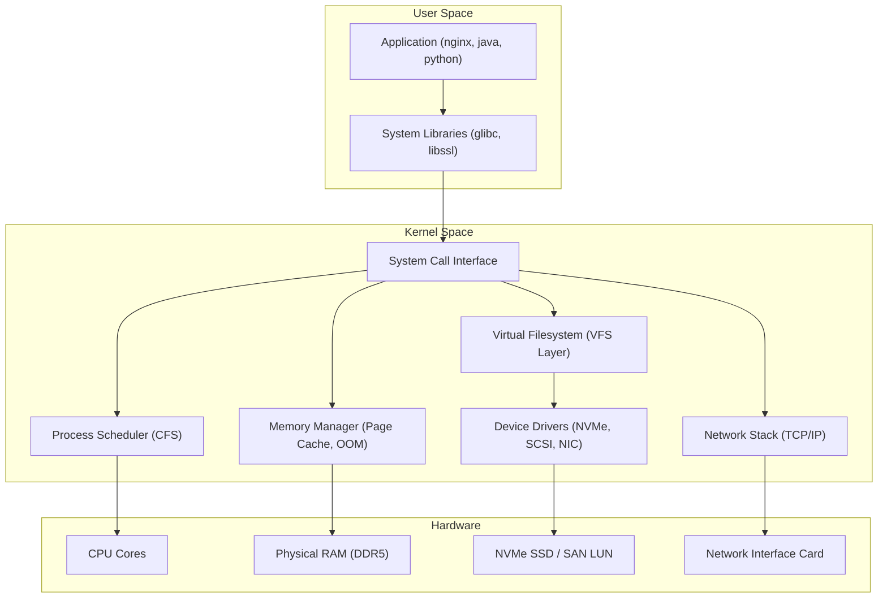
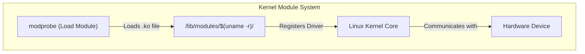
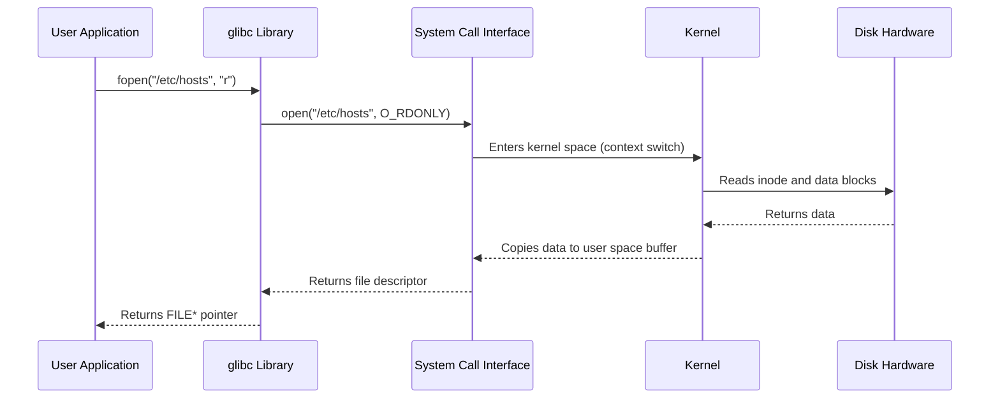

# CHAPTER 03 — LINUX ARCHITECTURE AND KERNEL FUNDAMENTALS

---

## 1. Introduction

### Why This Topic Exists
The Linux operating system is not a monolithic black box. It is a precisely engineered, layered architecture where each layer has a specific responsibility. Understanding these layers — from bare-metal hardware at the bottom to user-space applications at the top — is essential for troubleshooting, performance tuning, security hardening, and system design.

### Why Linux Administrators Use It
When a production server experiences high CPU load, memory exhaustion, or I/O bottlenecks, the engineer must understand which layer is causing the problem. Is it a runaway user-space process? A kernel driver issue? A hardware failure? Understanding Linux architecture enables precise root-cause analysis.

### Why Companies Care About It
Companies invest in engineers who understand how Linux works internally — not just how to type commands. An engineer who understands kernel-space vs user-space, context switching, system calls, and memory management can design more efficient infrastructure, prevent outages, and resolve incidents faster.

---

## 2. Learning Objectives

By the end of this chapter, you will be able to:
- Describe the four core layers of Linux architecture: Hardware, Kernel, Shell, and User Space.
- Explain the role of the Linux kernel: process scheduling, memory management, filesystem layer, device drivers, and networking stack.
- Differentiate between kernel space and user space.
- Understand how applications communicate with the kernel through system calls.
- Describe kernel modules and how drivers are loaded dynamically.
- Explain the role of system libraries (glibc) in bridging user applications and kernel services.

---

## 3. Beginner-Friendly Explanation

Think of the Linux operating system as a large commercial airport:

- **Hardware Layer (The Physical Airport)** — Runways, terminals, hangars, fuel depots. These are the physical CPU, RAM, hard drives, and network cards.
- **Kernel Layer (Air Traffic Control)** — The central command centre that decides which plane takes off, which one lands, allocates gates, manages fuel distribution, and ensures no collisions. The kernel manages processes, memory, storage, and networking.
- **Shell Layer (The Control Tower Radio)** — The communication translator between pilots (users) and Air Traffic Control (kernel). When a pilot says "Request clearance for takeoff", the radio translates it into signals ATC understands. When you type `ls -la`, the shell translates it into kernel system calls.
- **User Space (Passengers and Airlines)** — The passengers (applications like Nginx, MySQL, Python scripts) who use the airport facilities. They cannot directly access the runway — they must go through designated gates (system calls).

---

## 4. Core Theory

### 4.1 The Four Layers of Linux Architecture

```text
┌─────────────────────────────────────────────────┐
│  Layer 4: USER SPACE                            │
│  Applications: nginx, mysql, bash, python, java │
│  Libraries: glibc, libssl, libpam, libcurl      │
├─────────────────────────────────────────────────┤
│  Layer 3: SHELL                                 │
│  Command Interpreter: bash, zsh, sh, fish       │
│  Translates user commands → system calls        │
├─────────────────────────────────────────────────┤
│  Layer 2: LINUX KERNEL                          │
│  Process Scheduler | Memory Manager             │
│  Virtual Filesystem (VFS) | Network Stack       │
│  Device Drivers | Security (SELinux/DAC)        │
├─────────────────────────────────────────────────┤
│  Layer 1: HARDWARE                              │
│  CPU | RAM | NVMe/SSD/HDD | NIC | GPU          │
└─────────────────────────────────────────────────┘
```

### 4.2 Kernel Responsibilities

| Kernel Subsystem | Responsibility | Example |
|:---|:---|:---|
| **Process Scheduler** | Decides which process runs on which CPU core and for how long | CFS (Completely Fair Scheduler) distributes CPU time |
| **Memory Manager** | Allocates and reclaims RAM pages, manages virtual memory and swap | OOM Killer terminates processes when RAM is exhausted |
| **Virtual Filesystem (VFS)** | Provides a unified interface to different filesystem types | Allows XFS, Ext4, NFS, and /proc to all look like regular directories |
| **Network Stack** | Implements TCP/IP protocols, manages sockets, handles packet routing | Processes HTTP requests through the kernel's networking layer |
| **Device Drivers** | Interfaces with hardware devices (storage controllers, NICs, GPUs) | SCSI driver communicates with SAS/SATA storage devices |
| **Security Framework** | Enforces Discretionary Access Control (DAC) and Mandatory Access Control (SELinux) | Prevents unprivileged users from reading `/etc/shadow` |

### 4.3 Kernel Space vs User Space

| Aspect | Kernel Space | User Space |
|:---|:---|:---|
| **Access Level** | Full access to CPU, RAM, and all hardware | Restricted — cannot access hardware directly |
| **Memory Region** | Protected high-memory addresses | Lower virtual memory addresses |
| **Failure Impact** | Kernel panic — entire system crashes | Only the process crashes; system continues |
| **Who Operates Here** | Kernel code, device drivers, kernel modules | Applications (bash, nginx, mysql, python) |
| **Communication** | Direct hardware access | Must use **system calls** to request kernel services |

### 4.4 System Calls (Syscalls)
System calls are the API gateway between user space and kernel space. When an application needs to read a file, create a process, or open a network socket, it invokes a system call.

Common system calls:
- `open()` — Open a file descriptor
- `read()` — Read data from a file descriptor
- `write()` — Write data to a file descriptor
- `fork()` — Create a new child process
- `exec()` — Replace current process with a new programme
- `exit()` — Terminate the current process
- `socket()` — Create a network socket
- `ioctl()` — Device-specific I/O control operations

### 4.5 Kernel Modules
The Linux kernel uses a **modular architecture**. Device drivers and filesystem support can be loaded and unloaded dynamically at runtime without rebooting the server.

- **`lsmod`** — Lists currently loaded kernel modules.
- **`modprobe <module_name>`** — Loads a kernel module and its dependencies.
- **`modinfo <module_name>`** — Displays information about a kernel module.
- **`rmmod <module_name>`** — Removes a loaded kernel module.

### 4.6 System Libraries (glibc)
The GNU C Library (glibc) provides wrapper functions that simplify system call invocation. When a C programme calls `printf("Hello")`, glibc translates this into the `write()` system call, which passes the data to the kernel for output.

---

## 5. Internal Working

When you type `cat /etc/hostname` in a terminal, the following process occurs:

1. **Bash shell** parses the command and identifies `cat` as `/usr/bin/cat`.
2. Bash calls `fork()` to create a child process, then `exec()` to replace it with the `cat` binary.
3. `cat` calls `open("/etc/hostname", O_RDONLY)` — a system call that enters kernel space.
4. The kernel's **VFS layer** identifies the filesystem type (XFS) and delegates to the XFS driver.
5. The XFS driver locates the file's inode, reads the data blocks from the storage device, and copies them into a kernel buffer.
6. The kernel copies the buffer contents from kernel space to user space via the `read()` system call.
7. `cat` calls `write(1, buffer, length)` to send the data to stdout (file descriptor 1 = terminal).
8. The kernel's TTY driver sends the character data to your terminal display.

---

## 6. Production Architecture



---

## 7. Command-by-Command Explanation

### 7.1 `lsmod`
- **Purpose:** Lists all currently loaded kernel modules.
- **Example Output:**
  ```
  Module          Size  Used by
  xfs           1720320  2
  dm_mod          159744  6 dm_log,dm_mirror
  ext4           753664  1
  ```

### 7.2 `modinfo ext4`
- **Purpose:** Displays metadata about a specific kernel module (author, description, dependencies).

### 7.3 `cat /proc/cpuinfo`
- **Purpose:** Displays detailed CPU information from the kernel's virtual `/proc` filesystem.

### 7.4 `cat /proc/meminfo`
- **Purpose:** Displays detailed memory statistics (total RAM, free, buffers, cached, swap).

### 7.5 `dmesg | tail -20`
- **Purpose:** Displays kernel ring buffer messages — hardware detection, driver loading, errors.

---

## 8. Syntax Breakdown

| Command | Purpose |
|:---|:---|
| `lsmod` | List loaded kernel modules |
| `modprobe <module>` | Load a kernel module with dependencies |
| `rmmod <module>` | Unload a kernel module |
| `modinfo <module>` | Display module metadata |
| `cat /proc/cpuinfo` | CPU details from kernel |
| `cat /proc/meminfo` | Memory details from kernel |
| `dmesg` | Kernel ring buffer messages |

---

## 9. Parameter Explanation

| Command | Parameter | Description |
|:---|:---|:---|
| `modprobe` | module_name | Name of kernel module to load |
| `modprobe` | `-r` | Remove/unload a module (same as `rmmod`) |
| `dmesg` | `-T` | Display timestamps in human-readable format |
| `dmesg` | `--level=err` | Filter to show only error-level messages |

---

## 10. Sample Output Analysis

```bash
$ cat /proc/cpuinfo | grep "model name" | head -1
model name      : Intel(R) Xeon(R) Platinum 8375C CPU @ 2.90GHz

$ cat /proc/meminfo | head -5
MemTotal:       16384000 kB
MemFree:         2048000 kB
MemAvailable:   12288000 kB
Buffers:          512000 kB
Cached:          9728000 kB
```

| Field | Meaning |
|:---|:---|
| `MemTotal` | Total physical RAM installed |
| `MemFree` | RAM not used by anything (often low — Linux aggressively caches) |
| `MemAvailable` | RAM available for new applications (Free + Reclaimable Cache) |
| `Buffers` | Kernel buffer cache for block device metadata |
| `Cached` | Page cache for file contents (reclaimable on demand) |

---

## 11. Architecture Diagram



---

## 12. Workflow Diagram



---

## 13. Real Production Examples

### Kernel Module Issue in Cloud Environment
An AWS EC2 instance running RHEL 9 was unable to mount an NFS share. Investigation with `dmesg | grep nfs` revealed the NFS kernel module was not loaded. Resolution: `sudo modprobe nfs` loaded the module, and adding `nfs` to `/etc/modules-load.d/nfs.conf` ensured it loads automatically on every boot.

### OOM Killer Terminating Database
A MySQL database server with 16GB RAM experienced sudden process termination during peak hours. Investigation of `dmesg | grep -i oom` revealed the kernel's Out-of-Memory (OOM) Killer terminated the `mysqld` process because available memory dropped to zero. Resolution: Increased server RAM to 32GB and configured MySQL's `innodb_buffer_pool_size` to prevent memory overcommitment.

---

## 14. Common Mistakes

1. **Confusing kernel space crashes with application crashes** — A kernel panic (blinking cursor, system freeze) is fundamentally different from an application crash (process exits, system continues).
2. **Ignoring `dmesg` during troubleshooting** — Hardware failures, driver errors, and security violations are logged in the kernel ring buffer. Many engineers skip this critical data source.
3. **Assuming Free RAM is wasted** — Linux aggressively uses free RAM for page cache. Low "free" memory is normal and healthy. The important metric is `MemAvailable`, not `MemFree`.

---

## 15. Best Practices

- Monitor kernel messages regularly: `dmesg -T --level=err,warn`.
- Keep kernel modules at the minimum required for your hardware.
- Use `MemAvailable` (not `MemFree`) to assess memory pressure.
- Subscribe to kernel security advisories for your distribution.

---

## 16. Security Considerations

- Kernel vulnerabilities (e.g., Dirty Pipe CVE-2022-0847) allow unprivileged users to overwrite data in read-only files, including SUID binaries, enabling root privilege escalation.
- Restrict kernel module loading in hardened environments using `kernel.modules_disabled=1` in `/etc/sysctl.conf`.
- Enable kernel address space layout randomisation (KASLR) to mitigate memory exploitation attacks.

---

## 17. Performance Considerations

- The kernel page cache dramatically improves read performance by caching frequently accessed file data in RAM.
- CPU context switching between user space and kernel space has a measurable cost. Minimise unnecessary system calls in performance-critical applications.
- Use `perf` and `bpftrace` tools for kernel-level performance profiling.

---

## 18. Troubleshooting Guide

| Symptom | Root Cause | Resolution |
|:---|:---|:---|
| System hangs with blinking cursor | Kernel panic | Check serial console or crash dump; update kernel |
| `dmesg` shows `Out of memory: Killed process` | OOM Killer activated | Increase RAM or reduce application memory usage |
| `modprobe: FATAL: Module not found` | Module not installed for current kernel version | Install kernel-modules package: `dnf install kernel-modules` |
| High `%sy` (system CPU) in `top` | Excessive kernel-space activity (context switches, I/O wait) | Investigate with `vmstat 1` and `perf top` |

---

## 19. Practical Labs

**Lab 3.1:** List all loaded kernel modules and count them:
```bash
lsmod
lsmod | wc -l
```

**Lab 3.2:** Inspect kernel messages for hardware and driver information:
```bash
sudo dmesg -T | head -30
sudo dmesg -T --level=err
```

**Lab 3.3:** Examine CPU and memory from the kernel's perspective:
```bash
cat /proc/cpuinfo | grep "model name"
cat /proc/meminfo | head -10
```

---

## 20. Mini Project

Write a shell script `system_info.sh` that collects and displays:
- Kernel version (`uname -r`)
- CPU model (`/proc/cpuinfo`)
- Total and available RAM (`/proc/meminfo`)
- Number of loaded kernel modules (`lsmod | wc -l`)
- Last 5 kernel error messages (`dmesg --level=err | tail -5`)

---

## 21. Assignments

1. Explain the difference between kernel space and user space with an analogy.
2. What happens when an application tries to access hardware directly without going through a system call?
3. Research the OOM Killer. What criteria does it use to decide which process to terminate?

---

## 22. Interview Questions

### Basic
1. **Q: What are the four layers of Linux architecture?**
   A: Hardware, Kernel, Shell, and User Space.

2. **Q: What is a system call?**
   A: A system call is the programmatic interface through which user-space applications request services from the Linux kernel, such as file operations (`open`, `read`, `write`), process management (`fork`, `exec`), and network operations (`socket`, `connect`).

### Intermediate
3. **Q: What is the difference between kernel space and user space?**
   A: Kernel space is a protected memory region where the kernel executes with full hardware access privileges. User space is a restricted memory region where applications run without direct hardware access. Applications communicate with the kernel through system calls.

4. **Q: What is the OOM Killer and when does it activate?**
   A: The OOM (Out of Memory) Killer is a kernel mechanism that activates when the system runs out of physical RAM and swap space. It selects and terminates the process with the highest OOM score (typically the largest memory consumer) to free memory and prevent a complete system freeze.

### Advanced
5. **Q: A production server shows 95% memory used but applications are running normally. Should you be concerned?**
   A: Not necessarily. Linux aggressively uses free RAM for page cache (caching file data in memory for faster access). The critical metric is `MemAvailable` from `/proc/meminfo`, not `MemFree`. If `MemAvailable` is healthy (e.g., 20%+ of total RAM), the system is performing optimally. The page cache is reclaimable on demand when applications need memory.

### Scenario-Based
6. **Q: `dmesg` shows repeated messages: "Out of memory: Killed process 1234 (mysqld)". What do you do?**
   A: (1) Immediately check if MySQL is running: `systemctl status mysqld`. (2) Review the OOM kill details in `dmesg` to identify memory consumption. (3) Check MySQL's `innodb_buffer_pool_size` configuration — it may be consuming more RAM than available. (4) As a short-term fix, restart MySQL and reduce buffer pool size. (5) As a long-term fix, add more RAM to the server or migrate to a larger instance type.

---

## 23. Chapter Summary and Quick Revision Notes

- Linux architecture has four layers: Hardware → Kernel → Shell → User Space.
- The kernel manages processes, memory, filesystems, networking, and device drivers.
- User-space applications access kernel services through system calls (syscalls).
- Kernel modules allow dynamic loading of drivers without rebooting.
- `MemAvailable` is the true measure of available memory, not `MemFree`.
- `dmesg` is the first place to check for hardware and kernel-level issues.

---

## 24. Cheat Sheet

| Command | Purpose |
|:---|:---|
| `uname -r` | Display kernel version |
| `lsmod` | List loaded kernel modules |
| `modprobe <module>` | Load a kernel module |
| `modinfo <module>` | Display module information |
| `cat /proc/cpuinfo` | CPU details |
| `cat /proc/meminfo` | Memory statistics |
| `dmesg -T` | Kernel messages with timestamps |
| `dmesg --level=err` | Kernel error messages only |
