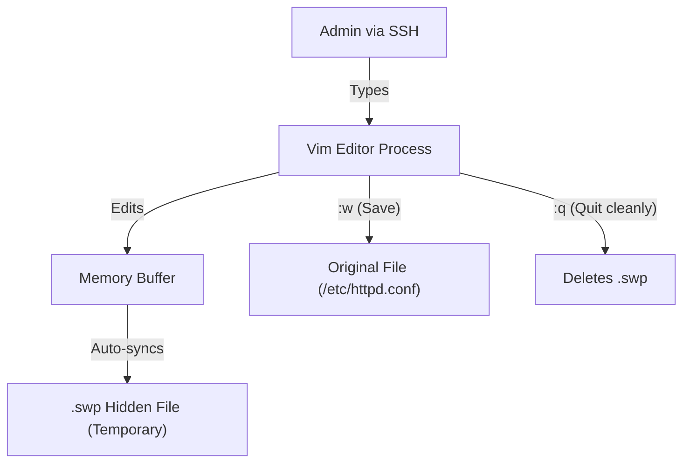
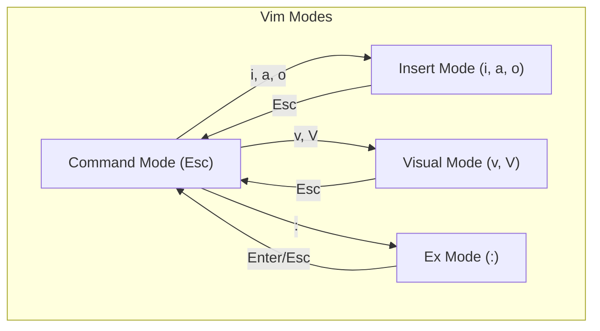
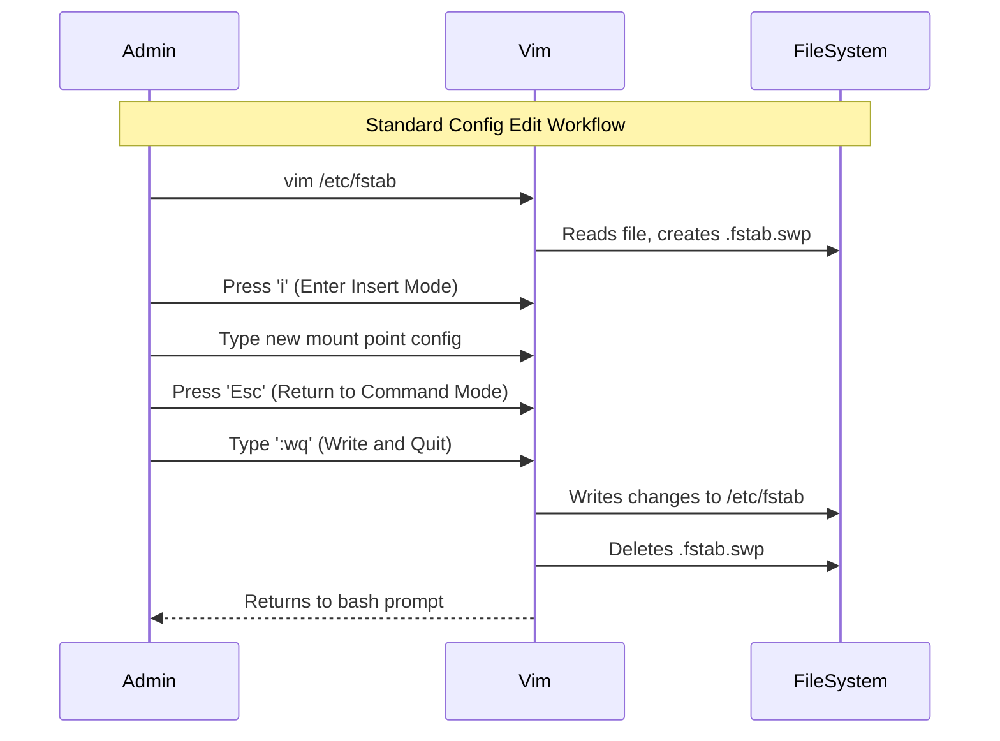

# CHAPTER 10 — TEXT EDITORS: VIM AND NANO MASTERY

---

## 1. Introduction

### Why This Topic Exists
In Linux, everything is a file — and most configurations are plain text files. To configure a web server, set up a network interface, write a script, or edit a cron job, you must modify text files directly from the command line. Text editors like `vim` and `nano` are the primary tools for this task because they work entirely within the terminal, requiring no graphical interface.

### Why Linux Administrators Use It
While graphical editors like VS Code or Notepad++ are great for development on a workstation, production servers do not have GUIs. Administrators rely on `vim` (Vi Improved) because it is universally installed on almost every Linux/Unix system in the world. It is incredibly fast, highly customisable, and designed for touch-typists.

### Why Companies Care About It
An engineer who cannot edit files in the terminal cannot fix a broken production server. When a server boots into emergency mode with a corrupted `/etc/fstab`, the only tool available to fix it is `vi` or `nano`. Terminal editor proficiency is a non-negotiable survival skill for Linux professionals.

---

## 2. Learning Objectives

By the end of this chapter, you will be able to:
- Use `nano` for simple, quick text editing.
- Understand the three modes of `vim` (Command, Insert, Visual).
- Open, edit, save, and exit files using `vim`.
- Search, replace, copy (yank), paste (put), and delete text efficiently in `vim`.
- Configure `vim` preferences using `~/.vimrc`.
- Recover from a sudden disconnect using `.swp` files.

---

## 3. Beginner-Friendly Explanation

Think of text editors like different types of cars:

- **`nano` (The Automatic Scooter):** Very easy to learn. It tells you exactly which buttons to press at the bottom of the screen (`^O` to save, `^X` to exit). Perfect for beginners, but lacks advanced features for heavy editing.
- **`vim` (The Manual Sports Car):** Very difficult to learn initially (the infamous "How do I exit vim?" joke exists for a reason). It doesn't tell you what to do. But once you master the clutch and gears (the different modes), it is incredibly fast and powerful. You can delete 50 lines, copy 10 lines, and jump to the end of the file in three keystrokes.

---

## 4. Core Theory

### 4.1 Nano — The Simple Editor
Nano is a straightforward modeless editor (what you type is what appears).
- **Open file:** `nano filename`
- **Save file:** `Ctrl + O` (Write Out) → Press Enter to confirm filename.
- **Exit:** `Ctrl + X` (If unsaved, it will prompt you to save).
- **Search:** `Ctrl + W` (Where is).

### 4.2 Vim — The Power Editor
Vim is a **modal editor**. Depending on the mode, pressing the `d` key will either type the letter "d" or delete a line. Understanding modes is the key to Vim.

**The Three Main Modes:**
1. **Command Mode (Normal Mode):** The default mode when you open a file. Used for navigating, deleting, copying, and pasting. You cannot type text here.
   - *How to enter:* Press `Esc` (always press Esc if you get lost).
2. **Insert Mode:** Used for typing text.
   - *How to enter:* Press `i` (insert before cursor) or `a` (append after cursor) or `o` (open new line below) while in Command Mode.
3. **Visual Mode:** Used for highlighting text blocks to copy or delete.
   - *How to enter:* Press `v` (character visual) or `V` (line visual) while in Command Mode.
4. **Command-Line Mode (Ex Mode):** Used for saving, exiting, and complex replacements.
   - *How to enter:* Press `:` while in Command Mode.

### 4.3 Essential Vim Commands (Command Mode)

| Action | Keystroke | Description |
|:---|:---|:---|
| **Navigation** | `h` `j` `k` `l` | Left, Down, Up, Right (arrow keys also work) |
| **Navigation** | `gg` | Jump to first line |
| **Navigation** | `G` | Jump to last line |
| **Navigation** | `50G` | Jump to line 50 |
| **Navigation** | `0` and `$` | Go to start of line (`0`) and end of line (`$`) |
| **Delete** | `x` | Delete single character under cursor |
| **Delete** | `dd` | Delete current line |
| **Delete** | `5dd` | Delete 5 lines |
| **Undo/Redo** | `u` / `Ctrl+r` | Undo last action / Redo action |
| **Copy/Paste** | `yy` | Yank (copy) current line |
| **Copy/Paste** | `p` | Put (paste) copied/deleted text after cursor |

### 4.4 Essential Vim Commands (Command-Line Mode - starts with `:`)

| Action | Keystroke | Description |
|:---|:---|:---|
| **Save** | `:w` | Write (save) file |
| **Save & Quit** | `:wq` or `:x` | Save and exit |
| **Quit** | `:q` | Quit (fails if there are unsaved changes) |
| **Force Quit** | `:q!` | Quit without saving (discard changes) |
| **Line Nums** | `:set nu` | Display line numbers |
| **Search** | `/pattern` | Search forward for "pattern" (press `n` for next) |
| **Replace** | `:%s/old/new/g` | Replace "old" with "new" globally in the file |

---

## 5. Internal Working

### The `.swp` (Swap) File Mechanism
When you open a file in Vim (`vim config.txt`), Vim does not edit the original file directly.
1. It reads the file into memory.
2. It creates a hidden swap file named `.config.txt.swp` in the same directory.
3. As you edit, changes are written to the swap file, not the original file.
4. When you save (`:w`), Vim writes the swap file contents to the original file.
5. When you exit cleanly (`:q`), Vim deletes the swap file.

**If the SSH connection drops or the server crashes while editing:**
The `.swp` file remains on disk. Next time you open the file, Vim detects the `.swp` file and warns you: `Swap file ".config.txt.swp" already exists`. It offers options to Recover (`r`), Delete (`d`), or Quit (`q`).

---

## 6. Production Architecture



---

## 7. Command-by-Command Explanation

### 7.1 `vim /etc/ssh/sshd_config`
- **Purpose:** Opens the SSH configuration file in Vim.
- **Workflow:** Opens in Command Mode. Press `i` to edit, make changes, press `Esc`, type `:wq`, press Enter.

### 7.2 `nano /etc/hostname`
- **Purpose:** Opens the hostname file in Nano.
- **Workflow:** Type new name, press `Ctrl+O`, `Enter`, `Ctrl+X`.

### 7.3 `vi` vs `vim`
- **`vi`** is the original editor (1976).
- **`vim`** is "Vi Improved" (1991), adding syntax highlighting, unlimited undo, and plugins.
- On modern RHEL/Ubuntu, typing `vi` usually runs `vim` via a symlink, but in minimal environments, actual `vi` might lack syntax highlighting.

---

## 8. Syntax Breakdown

```bash
:%s/192.168.1.50/10.0.0.50/g
││ │      │          │     │
││ │      │          │     └── g: global (replace all occurrences on the line)
││ │      │          └──────── Replacement text
││ │      └─────────────────── Search pattern
││ └────────────────────────── s: substitute command
│└──────────────────────────── %: apply to all lines in the file
└───────────────────────────── Enter command-line mode
```

---

## 9. Parameter Explanation

When launching Vim from the terminal:

| Parameter | Description | Example |
|:---|:---|:---|
| `+<line>` | Open file and jump directly to specific line | `vim +50 httpd.conf` |
| `+/pattern` | Open file and jump to first match of pattern | `vim +/Error application.log` |
| `-R` | Open in Read-Only mode (prevents accidental saves) | `vim -R /var/log/messages` |
| `-d` | Diff mode (compare two files side-by-side) | `vim -d config.old config.new` |

---

## 10. Sample Output Analysis

**Vim Swap File Warning Recovery Screen:**
```text
E325: ATTENTION
Found a swap file by the name ".sshd_config.swp"
          owned by: root   dated: Sun Jul 26 14:00:00 2026
         file name: /etc/ssh/sshd_config
          modified: YES
...
Swap file ".sshd_config.swp" already exists!
[O]pen Read-Only, (E)dit anyway, (R)ecover, (D)elete it, (Q)uit, (A)bort:
```

**Analysis:**
- This means another session is currently editing the file, or a previous session crashed without saving.
- **Action:** Press `R` to recover unsaved changes, review them, save, and then delete the `.swp` file. Or press `D` to delete the swap file if you want to discard the crashed changes.

---

## 11. Architecture Diagram



---

## 12. Workflow Diagram



---

## 13. Real Production Examples

### Mass IP Address Replacement
An engineer needs to update the backend database IP address in a 5,000-line application config file from `192.168.1.100` to `10.5.0.200`.
- Doing this manually takes hours and risks errors.
- In Vim: Type `:%s/192.168.1.100/10.5.0.200/g` and press Enter. Done in 2 seconds.

### Quick Log Investigation
An engineer needs to find a specific transaction ID in a massive log file.
- `vim -R /var/log/application.log` (Open read-only so no accidental edits are made).
- `/TXN-998822` (Search for the ID).
- Press `n` to jump to the next occurrence.

---

## 14. Common Mistakes

1. **Typing text in Command Mode** — Beginners start typing immediately after opening Vim, accidentally executing commands (like `d` for delete) instead of entering text. Always press `i` first.
2. **Forgetting how to exit** — Trapped in Vim? Press `Esc` three times, type `:q!`, and press Enter.
3. **Leaving orphaned `.swp` files** — If a session drops, users often press `E` (Edit anyway) when returning, leaving the `.swp` file forever. You must recover (`R`) and then delete (`D`) the swap file.
4. **Using Nano for massive files** — Nano loads the entire file into memory and struggles with 1GB+ logs. Vim handles large files much more efficiently.

---

## 15. Best Practices

- Use `vim` as your default editor (`export EDITOR=vim` in `.bashrc`).
- Create a `~/.vimrc` file with preferred settings:
  ```vim
  set number        " Show line numbers
  set hlsearch      " Highlight search results
  set autoindent    " Maintain indentation
  syntax on         " Enable syntax highlighting
  ```
- Learn `dd` (delete line) and `yy` (copy line) to edit configs rapidly without using a mouse.
- Never edit production configs without a backup (`cp file file.bak` first).

---

## 16. Security Considerations

- Using `sudo vim file` is dangerous if the user can escape to a shell from within Vim (`:!/bin/bash`). Use `sudoedit` or configure `sudoers` strictly (`NOEXEC` tag).
- Vim `.swp` files can expose sensitive configuration if left in web-accessible directories (`/var/www/html/.config.php.swp`).

---

## 17. Performance Considerations

- Vim is extremely lightweight, typically using <10MB RAM.
- When opening massive log files (>2GB), use `less` instead of `vim`. If you must use Vim, disable syntax highlighting (`:syntax off`) and swap files (`vim -n`) to prevent memory exhaustion and disk I/O spikes.

---

## 18. Troubleshooting Guide

| Symptom | Root Cause | Resolution |
|:---|:---|:---|
| Cannot type text | You are in Command Mode | Press `i` to enter Insert Mode |
| Cannot exit Vim | In Insert Mode or unsaved changes | Press `Esc`, type `:q!` to force quit |
| "Swap file already exists" warning | Previous session crashed or dropped | Press `R` to recover, save, exit, then delete the `.swp` file |
| Backspace doesn't work right in Insert mode | Legacy `vi` compatibility | Run `vim` instead of `vi`, or add `set backspace=indent,eol,start` to `~/.vimrc` |

---

## 19. Practical Labs

**Lab 10.1:** The Vim Survival Drill
1. `cp /etc/services ~/services.txt`
2. `vim ~/services.txt`
3. Press `G` to jump to the end.
4. Press `gg` to jump to the beginning.
5. Search for SSH: type `/ssh` and press Enter.
6. Enable line numbers: type `:set nu`.
7. Delete 5 lines: press `5dd`.
8. Undo the deletion: press `u`.
9. Quit without saving: type `:q!`.

**Lab 10.2:** Create a Vim Profile
1. `vim ~/.vimrc`
2. Press `i` and type:
   `set number`
   `set hlsearch`
3. Press `Esc`, type `:wq`.
4. Open Vim again to verify line numbers are enabled by default.

---

## 20. Mini Project

Create a script using Vim.
1. `vim ~/backup.sh`
2. Enter Insert Mode and write a 3-line bash script that copies `/etc/hosts` to `/tmp/hosts.bak`.
3. Save and quit.
4. Make it executable (`chmod +x ~/backup.sh`) and run it.

---

## 21. Assignments

1. What are the three main modes in Vim and what is the purpose of each?
2. Explain the difference between `:q`, `:wq`, and `:q!`.
3. What is a `.swp` file and why does Vim create it?

---

## 22. Interview Questions

### Basic
1. **Q: How do you save and exit a file in Vim?**
   A: Press `Esc` to ensure you are in Command Mode, then type `:wq` (Write and Quit) or `:x` and press Enter.

2. **Q: How do you search for a word in Vim?**
   A: In Command Mode, type `/` followed by the search pattern (e.g., `/error`) and press Enter. Use `n` to jump to the next match and `N` for the previous match.

### Intermediate
3. **Q: You open a file in Vim and get a "Swap file already exists" error. What caused this and how do you fix it?**
   A: This happens if a previous Vim session editing the file was killed improperly (e.g., SSH connection dropped, system crash) or if someone else is currently editing it. The `.swp` file is left behind. I would press `R` to recover the changes, save the file, exit, and then manually delete the `.swp` file.

4. **Q: How do you replace all instances of "foo" with "bar" globally in a file using Vim?**
   A: `:%s/foo/bar/g`

### Scenario-Based
5. **Q: You need to uncomment lines 100 to 110 in a configuration file (remove the `#` symbol). How can you do this efficiently in Vim without pressing delete 10 times?**
   A: I would use Block Visual Mode. Jump to line 100 (`100G`), press `Ctrl+v` to enter Block Visual Mode, press `j` down to line 110, highlighting the column of `#` symbols, then press `x` or `d` to delete them all simultaneously.

---

## 23. Chapter Summary and Quick Revision Notes

- `nano` is simple (modeless); `vim` is powerful (modal).
- Vim Modes: Command (default/navigation), Insert (typing), Visual (highlighting), Ex (saving/replacing).
- Always press `Esc` to return to Command Mode.
- Vim uses `.swp` files to track unsaved changes — recover them if a session crashes.
- Essential keystrokes: `i` (insert), `dd` (delete line), `yy` (copy line), `p` (paste), `:wq` (save & quit), `:q!` (discard & quit).

---

## 24. Cheat Sheet

| Action | Vim Command (Command Mode) |
|:---|:---|
| Insert Mode | `i` (before cursor), `a` (after cursor), `o` (new line below) |
| Save and Quit | `:wq` or `:x` |
| Force Quit (No Save) | `:q!` |
| Search Forward | `/pattern` |
| Next/Prev Search | `n` / `N` |
| Jump to Line N | `NG` (e.g., `50G`) |
| Start/End of Line | `0` (start), `$` (end) |
| Start/End of File | `gg` (start), `G` (end) |
| Delete Line | `dd` |
| Copy (Yank) Line | `yy` |
| Paste (Put) | `p` |
| Undo / Redo | `u` / `Ctrl+r` |
| Global Replace | `:%s/old/new/g` |
