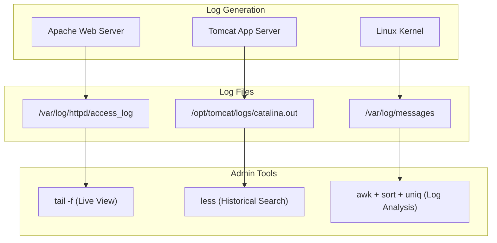
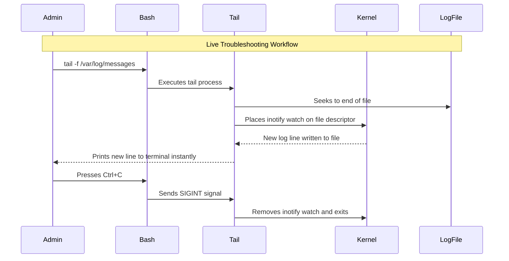

# CHAPTER 11 — VIEWING FILES, LOGS, AND TEXT PROCESSING

---

## 1. Introduction

### Why This Topic Exists
In Linux, almost all system events, application outputs, and configurations are recorded in plain text files. Reading these files quickly and extracting specific data is a core operational requirement. Opening a 5GB log file in a text editor like `vim` or `nano` will crash the editor or exhaust system memory. Instead, Linux provides dedicated, memory-efficient tools for viewing and parsing text.

### Why Linux Administrators Use It
When a production database crashes, the administrator must inspect the database logs immediately. Using tools like `tail`, `less`, and `grep`, the engineer can view live log streams, page through massive files instantly, and extract only the relevant error messages without loading the entire file into RAM.

### Why Companies Care About It
Mean Time To Resolution (MTTR) during an outage depends on how quickly engineers can find the root cause. Engineers who are proficient with text processing tools (`awk`, `sed`, `cut`, `sort`) can parse millions of log lines in seconds, identifying the exact IP address causing a DDoS attack or the specific database query failing in production.

---

## 2. Learning Objectives

By the end of this chapter, you will be able to:
- Read entire files using `cat` and `tac`.
- Safely page through massive files using `less` and `more`.
- Inspect the beginning and end of files using `head` and `tail`.
- Monitor live log files using `tail -f`.
- Extract specific columns of data using `cut` and `awk`.
- Sort data and remove duplicates using `sort` and `uniq`.
- Translate and replace characters using `tr` and `sed`.

---

## 3. Beginner-Friendly Explanation

Imagine a 10,000-page printed logbook:
- **`cat`:** Dumping the entire book on the floor at once. Fine for a 1-page memo, terrible for a 10,000-page book.
- **`less`:** Placing the book on a desk and reading it one page at a time, flipping forward and backward.
- **`head`:** Reading only the Table of Contents (first 10 pages).
- **`tail`:** Reading only the Conclusion (last 10 pages).
- **`tail -f` (Follow):** Staring at the last page while someone actively writes new lines in the book.
- **`cut` & `awk`:** Taking a pair of scissors and cutting out only the 3rd column of every page (e.g., extracting just the usernames from a log).

---

## 4. Core Theory

### 4.1 File Viewing Tools

| Command | Purpose | Best Used For |
|:---|:---|:---|
| `cat` | Concatenate and print entire file to stdout | Small files (config files, scripts) |
| `tac` | Print file in reverse (last line first) | Checking latest entries in small logs |
| `less` | Pager — view file one screen at a time | Large files (>10MB). Does not load entire file into memory |
| `more` | Older pager (less features than `less`) | Legacy systems |
| `head` | Output the first 10 lines (default) | Checking file headers or structure |
| `tail` | Output the last 10 lines (default) | Checking recent log entries |
| `tail -f`| "Follow" — output appended data as file grows | Live monitoring of application logs |

### 4.2 Text Processing Tools

Text processing tools treat plain text as structured data, usually delimited by spaces, tabs, or specific characters (like `:` in `/etc/passwd`).

| Command | Purpose | Example Use Case |
|:---|:---|:---|
| `wc` | Word count (lines, words, bytes) | `wc -l /var/log/messages` (Count total log lines) |
| `cut` | Extract specific columns/fields | Extract only usernames from `/etc/passwd` |
| `sort` | Sort lines alphabetically/numerically | Sort a list of IP addresses |
| `uniq` | Remove or count consecutive duplicate lines | Find unique IP addresses hitting a web server |
| `tr` | Translate or delete characters | Convert lowercase text to uppercase |
| `awk` | Advanced pattern scanning and processing | Print column 1 and 4, format output |
| `sed` | Stream editor (find and replace) | Replace a word across an entire file |

---

## 5. Internal Working

### Memory Efficiency of `less` vs `cat`
When you run `cat large_file.log`, the kernel reads the entire file from disk, copies it into user-space buffers, and flushes it to the terminal stdout. If the file is 5GB, this causes massive disk I/O and terminal lag.

When you run `less large_file.log`, the programme only reads the first few kilobytes (just enough to fill your terminal screen). It keeps a file descriptor open. When you press Page Down, it reads the next chunk from disk. This means `less` can open a 500GB file instantly while consuming only a few megabytes of RAM.

---

## 6. Production Architecture



---

## 7. Command-by-Command Explanation

### 7.1 `less /var/log/messages`
- **Navigation:**
  - `Spacebar`: Page down
  - `b`: Page up (back)
  - `g`: Go to beginning of file
  - `G`: Go to end of file
  - `/pattern`: Search forward for pattern (press `n` for next)
  - `q`: Quit

### 7.2 `tail -f /var/log/secure`
- **Purpose:** Monitors authentication logs in real-time. The command does not exit; it waits for new data.
- **Exit:** Press `Ctrl+C` to stop following.

### 7.3 `wc -l /etc/passwd`
- **Purpose:** Counts the number of lines (rows) in the file (equivalent to the number of users on the system).

### 7.4 `cut -d':' -f1 /etc/passwd`
- **Purpose:** Extracts the 1st field (`-f1`) using a colon (`-d':'`) as the delimiter. Returns only the usernames.

### 7.5 `awk '{print $1}' /var/log/httpd/access_log`
- **Purpose:** Prints the 1st space-separated column (usually the client IP address in an Apache log). Awk handles multiple spaces intelligently, unlike `cut`.

---

## 8. Syntax Breakdown

```bash
awk -F':' '{print $1, $7}' /etc/passwd
│   │ │    │     │  │      └──────── Target file
│   │ │    │     │  └─────────────── Variables representing Field 1 and Field 7
│   │ │    │     └────────────────── Awk command to output data
│   │ │    └──────────────────────── Awk action block
│   │ └───────────────────────────── The delimiter (colon)
│   └─────────────────────────────── Field separator flag
└─────────────────────────────────── Command: Awk text processor
```

---

## 9. Parameter Explanation

| Command | Parameter | Description |
|:---|:---|:---|
| `head` / `tail` | `-n 20` | Output 20 lines instead of the default 10 |
| `tail` | `-f` | Follow file descriptor (live stream) |
| `cut` | `-d ','` | Set delimiter to comma (default is tab) |
| `cut` | `-f 2,5` | Extract fields 2 and 5 |
| `sort` | `-n` | Numeric sort (e.g., 2 comes before 10. Without `-n`, 10 comes before 2) |
| `sort` | `-r` | Reverse sort (Z-A, highest to lowest) |
| `uniq` | `-c` | Count occurrences of duplicate lines |
| `tr` | `a-z A-Z` | Translate lowercase to uppercase |
| `sed` | `s/old/new/g` | Substitute old with new globally |

---

## 10. Sample Output Analysis

**Scenario:** We want to find the top 3 IP addresses hitting our web server.
**Command:**
```bash
awk '{print $1}' /var/log/httpd/access_log | sort | uniq -c | sort -nr | head -3
```

**Output:**
```
  4521 192.168.1.50
  1205 10.0.0.15
   850 172.16.5.99
```

**Pipeline Analysis:**
1. `awk '{print $1}'` → Extracts just the IP addresses from the log.
2. `sort` → Groups identical IP addresses together alphabetically.
3. `uniq -c` → Condenses duplicate IPs into a single line, prepending a count (`4521`).
4. `sort -nr` → Sorts the new list numerically (`-n`) and in reverse order (`-r`) so the highest count is at the top.
5. `head -3` → Shows only the top 3 results.

---

## 11. Architecture Diagram


---

## 12. Workflow Diagram



---

## 13. Real Production Examples

### Monitoring Application Startup
When restarting a Java application (like Tomcat), the process takes several seconds. The admin monitors the log to know when the application is fully ready to serve traffic:
```bash
sudo systemctl restart tomcat
tail -f /opt/tomcat/logs/catalina.out
# Admin waits to see: "INFO: Server startup in [4521] milliseconds"
# Admin presses Ctrl+C
```

### Checking for Failed SSH Logins
A security engineer checks how many automated brute-force SSH attacks the server received today:
```bash
# Extract the IP addresses of failed logins
grep "Failed password" /var/log/secure | awk '{print $11}' | sort | uniq -c | sort -nr | head -5
```

---

## 14. Common Mistakes

1. **Using `cat` on a massive log file** — This floods the terminal with thousands of lines, freezing the SSH session. Use `less` or `tail`.
2. **Forgetting `sort` before `uniq`** — The `uniq` command only removes *adjacent* duplicate lines. You MUST run `sort` before `uniq` or it will not count duplicates correctly.
3. **Using `tail -f` inside a script** — `tail -f` never exits. If placed inside a script without a timeout or background mechanism, the script will hang forever.
4. **Using `cut` when spacing is inconsistent** — If a log file uses varying numbers of spaces between columns, `cut -d' '` will fail because it treats two spaces as an empty column. Use `awk '{print $X}'` instead, as `awk` treats multiple spaces as a single delimiter.

---

## 15. Best Practices

- Use `less` for manual investigation of any file larger than a few megabytes.
- Use pipelines (`|`) to combine small tools (`awk | sort | uniq | head`) rather than writing complex scripts.
- When parsing logs, search for patterns first (`grep`) to reduce the data volume before passing it to heavier tools like `awk`.
- Press `G` in `less` to immediately jump to the most recent log entries at the bottom of the file.

---

## 16. Security Considerations

- Log files (`/var/log/secure`, `/var/log/messages`) contain sensitive data (IPs, usernames, system states) and are owned by root. Always use `sudo` to view them.
- Avoid printing sensitive logs to the terminal if someone is watching over your shoulder (shoulder surfing).
- `sed -i` performs in-place replacement. Be extremely careful using it as root on system configuration files, as a bad regex pattern can corrupt the entire file.

---

## 17. Performance Considerations

- For gigabyte-sized files, `cat file | grep pattern` is an anti-pattern (Useless Use of Cat). Run `grep pattern file` directly to save memory and CPU.
- `awk` is generally faster than chaining multiple `grep`, `cut`, and `sed` commands together in a long pipeline.

---

## 18. Troubleshooting Guide

| Symptom | Root Cause | Resolution |
|:---|:---|:---|
| Terminal flooded with text, unresponsive | Ran `cat` on a binary or massive file | Press `Ctrl+C` rapidly, or disconnect and reconnect SSH. Use `reset` to fix garbled fonts. |
| `uniq -c` is missing duplicate counts | Data was not sorted first | Add `| sort |` before `uniq` in the pipeline |
| `tail -f` shows no new lines | Application logs to a new rotated file | Log rotation replaced the file. Restart `tail -f` or use `tail -F` (follows by filename, not descriptor) |
| `less` exits immediately | File is smaller than one screen | Normal behaviour on modern systems. Use `cat` for small files. |

---

## 19. Practical Labs

**Lab 11.1:** Viewing files:
```bash
cat /etc/os-release
head -n 5 /etc/passwd
tail -n 5 /etc/passwd
```

**Lab 11.2:** Safe paging with `less`:
1. `less /etc/services`
2. Press `Space` twice.
3. Type `/ssh` and press Enter to search.
4. Press `q` to quit.

**Lab 11.3:** Text processing pipeline:
Extract all users with `/bin/bash` as their shell, sort them alphabetically:
```bash
grep "/bin/bash" /etc/passwd | cut -d':' -f1 | sort
```

---

## 20. Mini Project

Create a log analysis report.
1. Copy the system log to your home directory: `cp /var/log/messages ~/lab_log.txt` (or `/var/log/syslog` on Ubuntu).
2. Count the total number of lines: `wc -l ~/lab_log.txt`
3. Extract the 5th column (usually the service name) and find the top 5 services generating the most logs.
   *Hint:* `awk '{print $5}' ~/lab_log.txt | sort | uniq -c | sort -nr | head -5`
4. Document your findings in `~/log_report.md`.

---

## 21. Assignments

1. What is the difference between `less` and `cat` regarding memory consumption?
2. Write a pipeline to extract only the IP address (column 1) from an Apache log, remove duplicates, and count them.
3. What is the difference between `tail -f` and `tail -F`? (Research required).

---

## 22. Interview Questions

### Basic
1. **Q: How do you view a large log file without crashing the server?**
   A: Use the `less` command (e.g., `less /var/log/messages`). It is a pager that loads only one screen of data at a time, making it memory-efficient regardless of the file size.

2. **Q: How do you monitor a log file in real-time?**
   A: Use `tail -f filename`. This outputs the last 10 lines and then waits, printing new lines to the terminal as the application writes them to the file.

### Intermediate
3. **Q: Why must you use `sort` before `uniq`?**
   A: The `uniq` command only detects and removes duplicate lines that are *adjacent* (directly next to each other). If the same IP address appears on line 1 and line 10, `uniq` will not remove it. Running `sort` first groups all identical lines together so `uniq` can process them correctly.

4. **Q: When would you use `awk` instead of `cut`?**
   A: `cut` uses a single character delimiter and struggles with variable whitespace. For example, if a log file separates columns with varying numbers of spaces, `cut -d' '` will fail. `awk '{print $1}'` treats any amount of continuous whitespace as a single delimiter, making it far superior for parsing log files.

### Scenario-Based
5. **Q: A developer says their application is failing, and they want you to check the Tomcat log `/opt/tomcat/logs/catalina.out`. The file is 10GB. How do you find the errors from the last 5 minutes?**
   A: I would not use `cat` or `vim`. First, I would use `tail -n 1000 /opt/tomcat/logs/catalina.out | grep -i "error"` to quickly check the most recent entries. If I need to search interactively, I would use `less /opt/tomcat/logs/catalina.out`, press `G` to jump to the very end of the 10GB file, and then press `?error` to search backward through the file chronologically.

---

## 23. Chapter Summary and Quick Revision Notes

- `cat` for small files; `less` for large files; `head`/`tail` for ends of files.
- `tail -f` is essential for live monitoring of application restarts.
- `cut` extracts columns based on exact character delimiters (`:` or `,`).
- `awk` extracts columns intelligently handling multiple spaces.
- `wc -l` counts lines.
- Golden Pipeline: `awk | sort | uniq -c | sort -nr | head`

---

## 24. Cheat Sheet

| Command | Purpose |
|:---|:---|
| `cat file` | Print entire file |
| `less file` | Page through file interactively |
| `head -n 20 file` | Show first 20 lines |
| `tail -n 20 file` | Show last 20 lines |
| `tail -f file` | Follow live log updates |
| `wc -l file` | Count number of lines |
| `cut -d':' -f1 file`| Extract 1st column using colon delimiter |
| `awk '{print $1}'` | Extract 1st column separated by space(s) |
| `sort -nr` | Sort numerically, reverse order (highest first) |
| `uniq -c` | Remove duplicates and print occurrence count |
