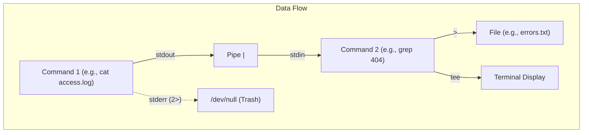
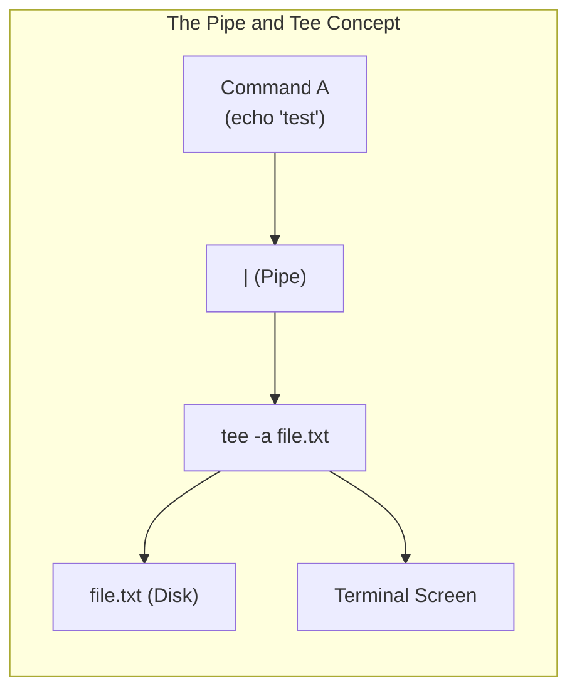
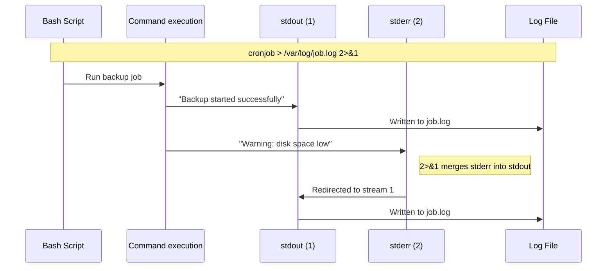

# CHAPTER 13 — I/O REDIRECTION, PIPES, AND WILDCARDS

---

## 1. Introduction

### Why This Topic Exists
A core philosophy of Unix and Linux is that "commands should do one thing and do it well." But what happens when you need to do something complex, like finding the top 5 largest files in a directory that contain the word "error"? Instead of building a massive, complicated programme to do exactly that, Linux allows you to chain small, simple tools together using **Pipes** (`|`). Furthermore, Linux allows you to capture the output of any command and write it directly to a file using **I/O Redirection** (`>`, `>>`).

### Why Linux Administrators Use It
System administrators rarely read raw command output on the screen when working with large datasets. They redirect logs to files for analysis, they silence noisy errors by sending them to a "black hole" (`/dev/null`), and they build powerful pipelines to parse data instantly. Wildcards (`*`, `?`) allow them to perform actions on hundreds of files simultaneously without typing every filename.

### Why Companies Care About It
Efficiency and automation. A task that takes a Windows administrator 30 minutes of clicking and sorting in Excel can be accomplished by a Linux engineer in 5 seconds using a piped command. This scriptable efficiency is why Linux dominates backend infrastructure.

---

## 2. Learning Objectives

By the end of this chapter, you will be able to:
- Understand the three standard I/O streams: `stdin` (0), `stdout` (1), and `stderr` (2).
- Redirect standard output to a file (overwrite `>` and append `>>`).
- Redirect standard errors to separate files or `/dev/null` (`2>`).
- Combine stdout and stderr into the same stream (`2>&1`).
- Connect the output of one command to the input of another using Pipes (`|`).
- Use the `tee` command to view output while simultaneously saving it.
- Match multiple files using Wildcards (`*`, `?`, `[]`).

---

## 3. Beginner-Friendly Explanation

Think of a Linux command as a water pump:
- **`stdin` (Standard Input / 0):** The intake pipe. Where the pump gets its water (usually your keyboard).
- **`stdout` (Standard Output / 1):** The clean water out-pipe. Where the successful results flow (usually your screen).
- **`stderr` (Standard Error / 2):** The dirty water out-pipe. Where errors and warnings flow (also to your screen by default, mixing with the clean water).

**Redirection (`>`)** is like attaching a hose to an out-pipe and routing the water into a bucket (a file) instead of splashing it on your screen.
**Piping (`|`)** is like connecting the clean water out-pipe of one pump directly into the intake pipe of a second pump.

---

## 4. Core Theory

### 4.1 Standard I/O Streams

| Stream | Number | Description | Default Location |
|:---|:---|:---|:---|
| **stdin** | 0 | Standard Input (data fed into a command) | Keyboard |
| **stdout** | 1 | Standard Output (successful command results) | Terminal Display |
| **stderr** | 2 | Standard Error (error messages) | Terminal Display |

### 4.2 I/O Redirection Operators

| Operator | Purpose | Example |
|:---|:---|:---|
| `>` | Redirect stdout to a file (Overwrites file) | `echo "Hello" > file.txt` |
| `>>` | Redirect stdout to a file (Appends to file) | `echo "World" >> file.txt` |
| `<` | Redirect file contents to stdin | `wc -l < file.txt` |
| `2>` | Redirect stderr to a file (Overwrites) | `ls /root 2> errors.log` |
| `2>>` | Redirect stderr to a file (Appends) | `ls /root 2>> errors.log` |
| `2>&1` | Redirect stderr to wherever stdout is going | `ls /root > output.log 2>&1` |
| `&>` | Redirect both stdout and stderr to a file (modern Bash) | `ls /root &> all.log` |

### 4.3 The "Black Hole" — `/dev/null`
`/dev/null` is a special device file that discards all data written to it. It is used to silence unwanted output.
- Hide errors: `find / -name "config" 2> /dev/null`

### 4.4 Pipes (`|`)
A pipe takes the `stdout` of the command on the left and passes it as `stdin` to the command on the right.
- **Example:** `cat /var/log/messages | grep "error" | wc -l`
- *Note:* Pipes only pass `stdout`. By default, `stderr` (errors) still print to the screen and do not cross the pipe.

### 4.5 The `tee` Command
The `tee` command reads from stdin and writes to **both** stdout (the screen) and a file simultaneously (like a T-junction in a plumbing pipe).
- **Example:** `echo "Starting backup" | tee backup.log`
- **Append mode:** `tee -a backup.log`

### 4.6 Wildcards (Globbing)
Wildcards allow you to match multiple filenames based on patterns.

| Wildcard | Matches | Example | Result |
|:---|:---|:---|:---|
| `*` | Zero or more characters | `*.log` | matches `error.log`, `access.log` |
| `?` | Exactly one character | `file?.txt` | matches `file1.txt`, `fileA.txt` |
| `[abc]` | Any one character in the set | `file[12].txt` | matches `file1.txt` or `file2.txt` |
| `[a-z]` | Any one character in the range | `file[a-c].txt`| matches `filea.txt`, `fileb.txt`, `filec.txt` |

---

## 5. Internal Working

When you run `ls /etc > output.txt`:
1. The shell (Bash) parses the command and sees the `>` operator.
2. The shell creates (or truncates) `output.txt`.
3. The shell calls `fork()` to create a child process.
4. Before calling `exec()` to run `ls`, the child process uses the `dup2()` system call to change file descriptor 1 (`stdout`) so it points to the open file `output.txt` instead of the terminal.
5. The `ls` programme runs normally, writing data to its `stdout` (FD 1). It does not know the data is going to a file; it just writes to FD 1 as usual.

When you use a pipe `ls | wc -l`:
1. The shell creates a pipe in the kernel using the `pipe()` system call (which provides a read buffer and a write buffer).
2. The shell forks two child processes.
3. Child 1 (`ls`) has its `stdout` attached to the write-end of the pipe.
4. Child 2 (`wc`) has its `stdin` attached to the read-end of the pipe.
5. Data flows through kernel memory from `ls` directly to `wc`.

---

## 6. Production Architecture



---

## 7. Command-by-Command Explanation

### 7.1 `> file.txt` (Overwrite)
- **Use Case:** Creating a new file or completely replacing the contents of an existing file with the output of a command.

### 7.2 `>> file.txt` (Append)
- **Use Case:** Adding a new line to an existing configuration file or log without destroying what is already there.

### 7.3 `2> /dev/null` (Silence Errors)
- **Use Case:** When searching the entire filesystem as a normal user, `find` generates hundreds of "Permission denied" errors. Redirecting `2>` to `/dev/null` hides the errors, leaving only the clean results.

### 7.4 `cat file.txt | grep "error"`
- **Use Case:** Reading a file and filtering it. (Though technically `grep "error" file.txt` is more efficient).

---

## 8. Syntax Breakdown

```bash
find / -name "*.conf" > results.txt 2> /dev/null
│    │ │    │         │             │
│    │ │    │         │             └── Redirect stderr (2) to the "black hole"
│    │ │    │         └──────────────── Redirect stdout (1) to results.txt
│    │ │    └────────────────────────── Wildcard: any file ending in .conf
│    │ └─────────────────────────────── Search flag
│    └───────────────────────────────── Search starting point (root)
└────────────────────────────────────── Command: find
```

---

## 9. Parameter Explanation

| Command | Parameter | Description |
|:---|:---|:---|
| `tee` | `-a` | Append to the given file, do not overwrite |
| `>` | N/A | Overwrite operator |
| `>>` | N/A | Append operator |
| `2>` | N/A | Stderr redirect operator |
| `\|` | N/A | Pipe operator |

---

## 10. Sample Output Analysis

**Scenario:** We want to list files in `/etc` and `/root`. As a regular user, we don't have access to `/root`. We want the successful list in a file, and the errors on the screen.
**Command:** `ls /etc /root > success.txt`

**Terminal Output:**
```text
ls: cannot open directory '/root': Permission denied
```
**Analysis:**
- The error message (`stderr`) printed to the screen because we did not redirect it.
- The successful listing of `/etc` (`stdout`) did NOT print to the screen; it went into `success.txt`.
- The two streams (1 and 2) operate completely independently.

---

## 11. Architecture Diagram



---

## 12. Workflow Diagram



---

## 13. Real Production Examples

### Cron Job Logging
When scheduling automated tasks (cron jobs), production engineers must capture both standard output and errors to the same log file for debugging:
```bash
/opt/scripts/daily_backup.sh > /var/log/backup.log 2>&1
```

### Safely Appending Configuration
An engineer needs to add a new DNS server to a configuration file. Using `cat` or `vim` is unnecessary.
```bash
echo "nameserver 8.8.8.8" >> /etc/resolv.conf
```

### Searching the Filesystem Silently
An engineer needs to find a specific SSL certificate file but wants to hide all "Permission denied" errors:
```bash
sudo find / -name "*.pem" 2> /dev/null
```

---

## 14. Common Mistakes

1. **Using `>` instead of `>>`** — Typing `echo "port 2222" > /etc/ssh/sshd_config` will instantly **delete** the entire configuration file and replace it with that one line, breaking SSH access permanently. Always double-check `>` vs `>>`.
2. **Sudo redirection failure** — `sudo echo "text" > /etc/root_file.txt` will fail with "Permission denied". The `echo` runs as root, but the `>` redirection is performed by your unprivileged shell.
   - *Fix:* `echo "text" | sudo tee -a /etc/root_file.txt`
3. **Piping to `grep` but missing errors** — `cat script.sh | grep "error"` only searches stdout. If the script outputs errors to stderr, `grep` will not see them. Use `2>&1 | grep` to search both.

---

## 15. Best Practices

- Always use `>>` when modifying configuration files from the command line unless you explicitly intend to destroy the file.
- Use `/dev/null` to silence verbose commands in automation scripts to prevent massive log files.
- Use `tee` when running long compilation jobs so you can monitor the progress on screen while saving it to a log: `make | tee build.log`.

---

## 16. Security Considerations

- Wildcard expansion (`*`) can be exploited in poorly written scripts (e.g., if a directory contains a file literally named `-rf`, running `rm *` expands to `rm -rf`, resulting in catastrophic deletion).
- Redirecting sensitive output (like database dumps or password generation scripts) to a file must be done in a directory with strict permissions (`700`) to prevent other users from reading the file during creation.

---

## 17. Performance Considerations

- Chaining many commands with pipes (`cat file | grep x | cut y | sort | uniq`) spawns multiple processes and context switches. While fine for MB-sized files, for GB-sized files, using a single `awk` script is significantly more CPU/Memory efficient.

---

## 18. Troubleshooting Guide

| Symptom | Root Cause | Resolution |
|:---|:---|:---|
| File truncated to zero bytes | Used `>` instead of `>>` | Restore from backup; double-check operators |
| "Permission denied" when redirecting with sudo | Shell executes redirect before sudo | Use `command \| sudo tee /path/to/file` |
| Pipe `\|` does not capture error output | Pipe only captures stdout (FD 1) | Merge stderr first: `command 2>&1 \| grep error` |

---

## 19. Practical Labs

**Lab 13.1:** Standard Redirection:
```bash
echo "Line 1" > test.log
echo "Line 2" > test.log     # Notice this overwrote Line 1
cat test.log
echo "Line 3" >> test.log    # Notice this appended
cat test.log
```

**Lab 13.2:** Error Redirection:
```bash
ls /etc /fake_directory > success.txt 2> errors.txt
cat success.txt
cat errors.txt
```

**Lab 13.3:** Sudo and Tee:
```bash
# This will fail (if you are not root):
echo "test" > /etc/test_file.txt 
# This will succeed:
echo "test" | sudo tee /etc/test_file.txt
```

**Lab 13.4:** Wildcards:
```bash
mkdir wildcard_lab && cd wildcard_lab
touch file1.txt file2.txt fileA.txt image.jpg
ls *.txt
ls file?.txt
ls file[12].txt
```

---

## 20. Mini Project

Create an automated diagnostic script `sys_diag.sh` that:
1. Appends the current date to `/tmp/diag.log`.
2. Appends the disk usage (`df -h`) to `/tmp/diag.log`.
3. Tries to search the entire `/` directory for files named "secret.txt", appending successful matches to `/tmp/diag.log` and sending all "Permission denied" errors to `/dev/null`.

---

## 21. Assignments

1. Explain the difference between `stdin`, `stdout`, and `stderr` using real-world analogies.
2. Why does `sudo echo "hello" > /root/file.txt` fail with Permission Denied? How do you fix it?
3. What is the difference between `ls *` and `ls ?` ?

---

## 22. Interview Questions

### Basic
1. **Q: What is the difference between `>` and `>>`?**
   A: `>` redirects standard output and **overwrites** the destination file. `>>` redirects standard output and **appends** to the bottom of the destination file.

2. **Q: How do you send the output of one command to another?**
   A: Using the pipe operator `|`. It takes the standard output of the left command and sends it to the standard input of the right command (e.g., `cat file.txt | grep "error"`).

### Intermediate
3. **Q: What does `2>&1` mean at the end of a command?**
   A: It redirects File Descriptor 2 (`stderr`) to the same destination as File Descriptor 1 (`stdout`). This merges errors and normal output into a single stream, which is typically then redirected to a single log file (`> all_output.log 2>&1`).

4. **Q: What is `/dev/null` used for?**
   A: `/dev/null` is a special pseudo-device file that discards all data written to it. It is used as a "black hole" to silently discard unwanted output or error messages (e.g., `2> /dev/null`).

### Scenario-Based
5. **Q: You need to run a compilation job (`make`) that takes 30 minutes. You want to see the progress on your terminal screen, but you also need to save all the output to a file named `build.log` so you can review it later if it fails. How do you do this?**
   A: Use the `tee` command: `make | tee build.log`. The `tee` command reads from standard input and writes simultaneously to standard output (the screen) and to the specified file.

---

## 23. Chapter Summary and Quick Revision Notes

- Stream 0 = `stdin` (Keyboard). Stream 1 = `stdout` (Screen). Stream 2 = `stderr` (Screen).
- `>` Overwrites. `>>` Appends.
- `2>` Redirects errors only.
- `2>&1` Merges errors into standard output.
- `|` (Pipe) chains commands by passing stdout to stdin.
- `/dev/null` is the trash can for unwanted output.
- `tee` writes to a file and the screen simultaneously.
- Wildcards: `*` (anything), `?` (one character), `[]` (specific characters).

---

## 24. Cheat Sheet

| Syntax | Action |
|:---|:---|
| `cmd > file` | Overwrite file with stdout |
| `cmd >> file` | Append stdout to file |
| `cmd 2> file` | Overwrite file with stderr (errors) |
| `cmd > file 2>&1` | Send both stdout and stderr to same file |
| `cmd 2> /dev/null` | Hide errors |
| `cmd1 \| cmd2` | Pipe stdout of cmd1 to stdin of cmd2 |
| `cmd \| tee file` | Display on screen AND save to file |
| `ls *.txt` | Match all files ending in .txt |
| `ls file?.txt` | Match file1.txt, fileA.txt, etc. |
