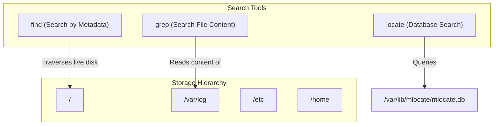
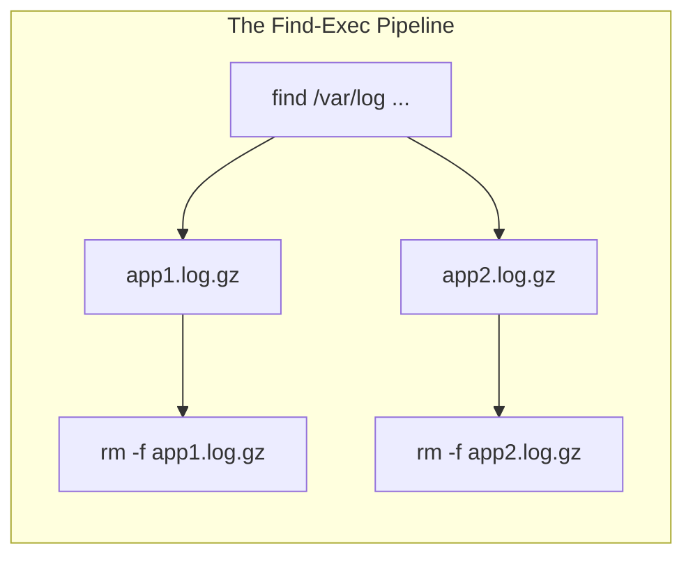
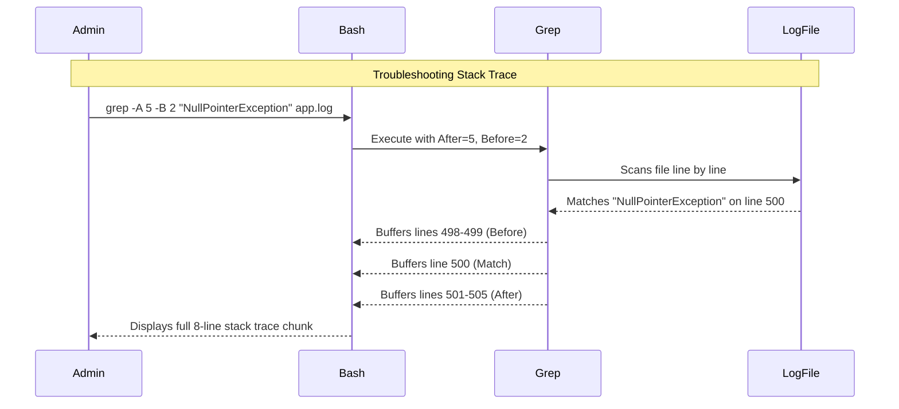

# CHAPTER 14 — SEARCHING FILES AND PATTERN MATCHING

---

## 1. Introduction

### Why This Topic Exists
Enterprise Linux servers contain hundreds of thousands of files across deeply nested directories, accumulating gigabytes of logs daily. When an application fails, or a security breach occurs, administrators cannot manually open every file to find the root cause. Linux provides powerful search tools (`find`, `locate`) to search for files based on attributes, and pattern-matching tools (`grep`) to search *inside* files for specific text.

### Why Linux Administrators Use It
System administrators use `find` to locate old files taking up disk space, discover files with insecure permissions, or find core dumps. They use `grep` (Global Regular Expression Print) to filter out millions of lines of irrelevant log data, pinpointing exact error codes, timestamps, or IP addresses using Regular Expressions (Regex).

### Why Companies Care About It
Speed and security. When investigating a security incident (e.g., "Which files were modified by the attacker yesterday?"), the `find` command can identify the exact files in seconds. When debugging an application, `grep` extracts the exact error from a 50GB log file instantly. These tools are the foundation of forensic analysis and troubleshooting.

---

## 2. Learning Objectives

By the end of this chapter, you will be able to:
- Use `locate` for fast, database-driven file searches.
- Use `find` for real-time searches based on name, size, time, and permissions.
- Execute commands on files discovered by `find` using `-exec`.
- Use `grep` to search for text patterns inside files.
- Understand basic Regular Expressions (Regex) with `grep -E`.
- Combine `find` and `grep` to search inside dynamically located files.

---

## 3. Beginner-Friendly Explanation

Think of searching a massive library:
- **`locate` (The Library Catalog):** You check the computer catalog to find exactly where a book is. It is instantaneous, but if a book was returned 5 minutes ago (and the catalog hasn't updated yet), you won't find it.
- **`find` (The Physical Search):** You physically walk down every single aisle of the library checking every shelf. It takes longer, but it is 100% accurate in real-time, and you can search by complex criteria ("Find all books thicker than 500 pages that were published yesterday").
- **`grep` (The Speed Reader):** Once you have the book, you flip through the pages at superhuman speed, extracting only the sentences that contain the word "murder".
- **Regex (The Smart Filter):** Instead of searching for exactly "murder", you tell the speed reader: "Find any sentence that starts with a capital letter, contains 'murder' or 'kill', and ends with a number."

---

## 4. Core Theory

### 4.1 File Search: `locate` vs `find`

| Feature | `locate` | `find` |
|:---|:---|:---|
| **Speed** | Instantaneous | Slower (reads actual disk) |
| **Mechanism** | Reads pre-built database (`mlocate.db`) | Traverses live filesystem hierarchy |
| **Accuracy** | May be outdated (updated daily via cron) | 100% accurate real-time |
| **Search By** | Filename only | Name, size, time, permissions, user, etc. |

### 4.2 The `find` Command
Syntax: `find [path] [conditions] [actions]`

**Common Conditions:**
- By Name: `-name "*.log"`, `-iname "*.log"` (case-insensitive)
- By Type: `-type f` (file), `-type d` (directory)
- By Size: `-size +100M` (greater than 100MB), `-size -10k` (less than 10KB)
- By Time: `-mtime -7` (modified in last 7 days), `-mmin +60` (modified over 60 mins ago)
- By User: `-user sachin`
- By Perms: `-perm 777`

**Common Actions:**
- `-print` (default: print paths to screen)
- `-delete` (delete matching files)
- `-exec cmd {} \;` (execute a command on each matching file)

### 4.3 The `grep` Command
`grep` searches input for lines matching a pattern and prints them.
Syntax: `grep [options] "pattern" [file]`

**Key Options:**
- `-i`: Case-insensitive search
- `-v`: Invert match (show lines that do NOT contain the pattern)
- `-r`: Recursive search (search inside all files in a directory)
- `-n`: Print line numbers
- `-c`: Count the number of matching lines
- `-E`: Use Extended Regular Expressions (same as `egrep`)

### 4.4 Basic Regular Expressions (Regex)
Regex is a sequence of characters that define a search pattern.

| Regex Symbol | Meaning | Example | Matches |
|:---|:---|:---|:---|
| `^` | Start of line | `^Error` | Lines starting with "Error" |
| `$` | End of line | `failed$` | Lines ending with "failed" |
| `.` | Any single character | `b.g` | bag, beg, big, bug |
| `*` | Zero or more of preceding char | `xy*z` | xz, xyz, xyyz |
| `[abc]` | Any one of the enclosed chars | `[Ee]rror` | Error, error |
| `[^abc]`| Any char NOT enclosed | `[^0-9]` | Any non-digit |

---

## 5. Internal Working

### How `find` executes commands
When you run `find /var/log -name "*.gz" -exec rm -f {} \;`
1. `find` recursively walks the `/var/log` directory using system calls (`opendir()`, `readdir()`).
2. For every file it finds, it checks if the name matches `*.gz`.
3. If it matches, `find` temporarily pauses and passes the file's absolute path to the `{}` placeholder.
4. `find` forks a new child process and executes `rm -f /var/log/file.gz`.
5. The `\;` tells `find` that the `-exec` command string is complete. (Without `\`, Bash would try to interpret the `;`).
6. Once `rm` finishes, `find` resumes walking the directory tree.

### How `grep` processes text
1. `grep` reads the target file line by line into a memory buffer.
2. It compiles the search string (or Regex pattern) into a finite state machine.
3. It compares the buffer against the state machine using optimized algorithms (like Boyer-Moore).
4. If a match occurs, it flushes the entire line buffer to standard output (screen).

---

## 6. Production Architecture



---

## 7. Command-by-Command Explanation

### 7.1 `locate passwd`
- **Purpose:** Instantly finds all paths containing "passwd".
- *Prerequisite:* Requires `mlocate` package installed and `updatedb` run recently.

### 7.2 `find / -name "*.conf" 2> /dev/null`
- **Purpose:** Searches the entire filesystem (`/`) for files ending in `.conf`. Hides permission errors.

### 7.3 `find /var/log -type f -mtime +30`
- **Purpose:** Finds standard files (`-type f`) in `/var/log` modified more than 30 days ago (`+30`).

### 7.4 `grep -i "error" /var/log/messages`
- **Purpose:** Searches for "error", "ERROR", "Error", etc., in the messages log.

### 7.5 `grep -v "DEBUG" application.log`
- **Purpose:** Prints every line in the log EXCEPT the lines containing "DEBUG" (filters out noise).

---

## 8. Syntax Breakdown

```bash
find /backup -type f -name "*.tar.gz" -mtime +90 -exec rm -f {} \;
│    │       │       │                │          │
│    │       │       │                │          └── Execute rm -f on each file ({}) and terminate statement (\;)
│    │       │       │                └───────────── Modified strictly greater than 90 days ago
│    │       │       └────────────────────────────── Match exact naming pattern
│    │       └────────────────────────────────────── Restrict to standard files (no directories)
│    └────────────────────────────────────────────── Starting path
└─────────────────────────────────────────────────── Command: find
```

---

## 9. Parameter Explanation

| Command | Parameter | Description |
|:---|:---|:---|
| `find` | `-user` | Match files owned by specific user |
| `find` | `-perm` | Match exact octal permissions (e.g., `-perm 777`) |
| `find` | `-empty`| Match empty files and directories |
| `find` | `-size` | Size constraints: `c` (bytes), `k` (KB), `M` (MB), `G` (GB). `+` is greater than, `-` is less than. |
| `grep` | `-r` | Recursively grep inside all files in a directory tree |
| `grep` | `-l` | Only print the filenames that contain matches (not the matched text) |
| `grep` | `-A 3`| After context: print match + 3 lines after |
| `grep` | `-B 3`| Before context: print match + 3 lines before |

---

## 10. Sample Output Analysis

**Scenario:** Checking which configuration files mention the database IP.
**Command:** `grep -rn "10.0.0.50" /etc/`
*(Search recursively `-r`, print line numbers `-n`)*

**Output:**
```text
/etc/httpd/conf/httpd.conf:145:ProxyPass /api http://10.0.0.50:8080/api
/etc/app/database.yml:12:  host: 10.0.0.50
/etc/app/database.yml:25:  replica: 10.0.0.50
```

**Analysis:**
- `grep` traversed the entire `/etc/` directory tree automatically.
- It identified two files containing the IP.
- It printed the exact path, line number (`145`, `12`, `25`), and the matched text.

---

## 11. Architecture Diagram



---

## 12. Workflow Diagram



---

## 13. Real Production Examples

### Disk Cleanup Automation
Production servers often run out of disk space due to unrotated logs or core dumps. Engineers run this command to find and delete large, old logs:
```bash
# Find files in /var/log larger than 1GB and older than 14 days, and delete them
sudo find /var/log -type f -name "*.log" -size +1G -mtime +14 -exec rm -f {} \;
```

### Security Audit — Finding World-Writable Files
World-writable files (`777` permissions) are a major security vulnerability. Auditors search the filesystem for them:
```bash
sudo find / -type f -perm 777 2> /dev/null
```

### Investigating SSH Break-in Attempts
Extract all IP addresses that failed to log in, filtering out internal IPs (`10.x.x.x`):
```bash
grep "Failed password" /var/log/secure | grep -v "10\."
```

---

## 14. Common Mistakes

1. **Forgetting `2> /dev/null` with `find /`** — If run as a normal user without sudo, searching from `/` generates thousands of "Permission denied" lines, burying the actual results.
2. **Missing the `\;` in `-exec`** — The `-exec` clause MUST be terminated with a space, backslash, and semicolon (` \;`). If you forget it, `find` throws a syntax error.
3. **Using `grep *` instead of `grep -r`** — `grep "pattern" *` only searches files in the current directory. It does NOT search inside subdirectories. Use `grep -r "pattern" .` for recursive search.
4. **Confusing Regex `*` with Wildcard `*`** — In Bash wildcards, `*` means "anything". In `grep` Regex, `*` means "zero or more of the PRECEDING character". (e.g., in Regex, `.*` means "anything").

---

## 15. Best Practices

- Use `locate` if you just installed a package and need to find where its config file went (run `sudo updatedb` first).
- Use `find -type f` to avoid matching directory names when searching for files.
- Before running `find ... -exec rm -f {} \;`, ALWAYS run the `find` command without the `-exec` part first to verify you are deleting the correct files.
- Use `grep -E` (or `egrep`) to use modern extended regular expressions (allows `|` for OR conditions).

---

## 16. Security Considerations

- The `-exec` flag in `find` executes commands with the privileges of the user running `find`. If you run `sudo find ... -exec`, you are executing commands as root on every matched file.
- When searching logs for sensitive data (like passwords accidentally printed to logs), ensure you do not pipe the output to a globally readable file.

---

## 17. Performance Considerations

- `find /` is heavily disk I/O intensive. Avoid running global searches on production database servers during peak business hours.
- When using `find` + `grep`, it is much faster to use `find` to limit the file scope before passing to `grep`, rather than using `grep -r` on the entire filesystem.

---

## 18. Troubleshooting Guide

| Symptom | Root Cause | Resolution |
|:---|:---|:---|
| `find: missing argument to '-exec'` | Missing ` \;` termination | Ensure there is a space before `\;` |
| `locate: command not found` | Package not installed | `sudo dnf install mlocate && sudo updatedb` |
| `grep` returns no results | Case sensitivity or wrong path | Add `-i` flag, verify path |
| Terminal hangs on `grep` | You ran `grep "pattern"` without a file | `grep` is waiting for stdin. Press `Ctrl+C` and add the filename. |

---

## 19. Practical Labs

**Lab 14.1:** Using Find:
```bash
# Create test files
mkdir find_lab && cd find_lab
touch file1.txt file2.txt old.log new.log
# Find only text files
find . -name "*.txt"
# Find files larger than 1MB in /var/log
find /var/log -type f -size +1M 2> /dev/null
```

**Lab 14.2:** Using Grep and Regex:
```bash
# Print users with bash shells
grep "bash$" /etc/passwd
# Print users whose names start with 'a'
grep "^a" /etc/passwd
# Exclude lines starting with comment (#)
grep -v "^#" /etc/ssh/sshd_config | grep -v "^$"
```

**Lab 14.3:** Find + Exec:
```bash
# Find logs in current dir and delete them (verify first)
find . -name "*.log"
find . -name "*.log" -exec rm -i {} \;
```

---

## 20. Mini Project

Create a forensic search script `forensic.sh`:
1. Find all files in `/var/log` modified in the last 24 hours (`-mtime 0`).
2. Inside those files, recursively `grep` for the word "Failed" or "error" (case-insensitive).
3. Save the output to `/tmp/forensic_report.txt`.

---

## 21. Assignments

1. What is the difference between `locate` and `find`? Which is better for finding a file created 5 minutes ago?
2. Write a `grep` command to extract only the lines from `/etc/ssh/sshd_config` that are NOT comments (do not start with `#`) and are NOT empty lines.
3. Write a `find` command to locate all files in `/tmp` owned by user `sachin` and delete them using `-exec`.

---

## 22. Interview Questions

### Basic
1. **Q: How do you search for a file named `httpd.conf` starting from the root directory?**
   A: `find / -name "httpd.conf" 2> /dev/null`

2. **Q: How do you search for the word "Error" inside a file, ignoring case?**
   A: `grep -i "error" filename`

### Intermediate
3. **Q: You need to find all files in `/var/log` that are larger than 500MB and delete them. What command do you use?**
   A: `find /var/log -type f -size +500M -exec rm -f {} \;`

4. **Q: What is the difference between `grep` and `grep -v`?**
   A: `grep` prints lines that MATCH the pattern. `grep -v` inverts the match, printing lines that DO NOT match the pattern.

### Scenario-Based
5. **Q: You are reviewing an Apache configuration file, but it is 1,000 lines long and 950 lines are just comments starting with `#`. How can you view just the active configuration lines?**
   A: I would use `grep -v "^#" /etc/httpd/conf/httpd.conf | grep -v "^$"`. The first part removes lines starting with `#` (`^` means start of line). The second part removes empty lines (`^$` means start of line immediately followed by end of line).

---

## 23. Chapter Summary and Quick Revision Notes

- `locate` uses a fast database (`mlocate.db`). `find` searches the live disk.
- `find` syntax: `find [path] [criteria] [action]`.
- Important `find` flags: `-name`, `-type`, `-size`, `-mtime`, `-exec`.
- `grep` searches inside files. `-i` (case-insensitive), `-v` (invert), `-r` (recursive).
- Regex basics: `^` (start), `$` (end), `.` (any char), `[abc]` (character set).
- Protect global searches from noisy errors with `2> /dev/null`.

---

## 24. Cheat Sheet

| Command | Purpose |
|:---|:---|
| `locate name` | Fast database search for filename |
| `find / -name "*.conf"` | Live search by name wildcard |
| `find / -type d` | Search for directories only |
| `find . -mtime -7` | Modified in last 7 days |
| `find . -size +1G` | Larger than 1 Gigabyte |
| `find . -exec cmd {} \;` | Run `cmd` on matched files |
| `grep "text" file` | Search for text in file |
| `grep -i "text"` | Case-insensitive search |
| `grep -v "text"` | Show lines without text |
| `grep -r "text" /dir/` | Search inside all files in directory |
| `grep "^text"` | Lines starting with text |
| `grep "text$"` | Lines ending with text |
