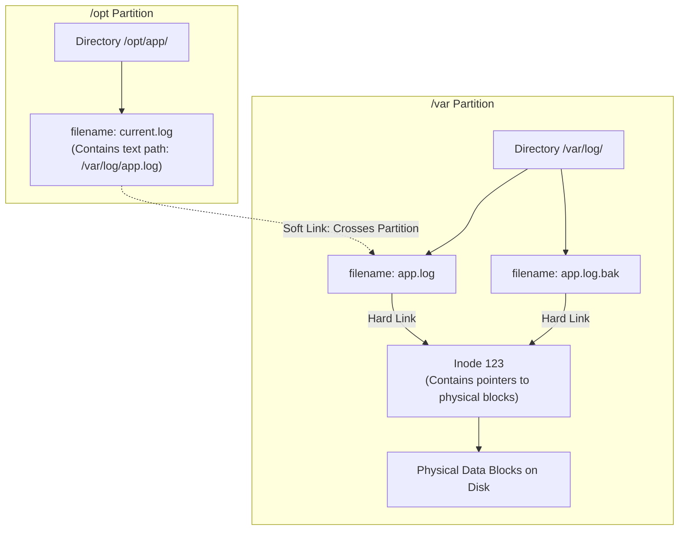
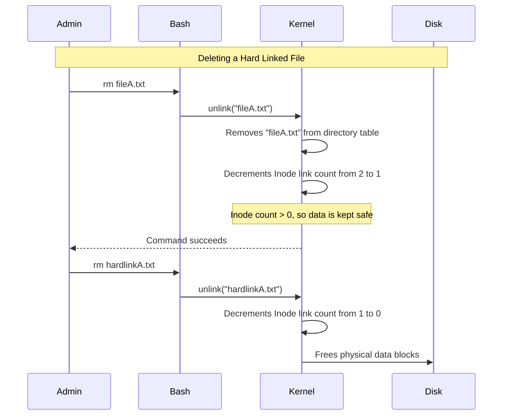

# CHAPTER 15 — INODES, HARD LINKS, AND SYMBOLIC LINKS

---

## 1. Introduction

### Why This Topic Exists
When you look at a file in Linux, you see a filename. But the Linux kernel does not care about filenames. The kernel identifies files using a unique numerical ID called an **inode** (Index Node). The filename is simply a human-readable label pointing to that inode. Understanding this separation between names and data is the key to understanding how the Linux filesystem works, and how Hard Links and Soft Links (Symbolic Links) function.

### Why Linux Administrators Use It
Administrators use inodes and links to save disk space, manage application versions, and resolve complex filesystem issues. When an application expects a configuration file at `/etc/app.conf` but the file must be stored on a different partition at `/opt/data/app.conf`, the administrator uses a Symbolic Link to bridge the gap without duplicating the file.

### Why Companies Care About It
A server can run out of inodes even if it has 500GB of free disk space. When this happens, no new files can be created, causing databases and web servers to crash instantly. Engineers who understand inodes can quickly diagnose and resolve "No space left on device" errors that baffle junior administrators.

---

## 2. Learning Objectives

By the end of this chapter, you will be able to:
- Explain what an inode is and what metadata it stores.
- Differentiate between file data (blocks) and file metadata (inodes).
- Check inode consumption and troubleshoot inode exhaustion (`df -i`).
- Create and explain Hard Links (`ln`).
- Create and explain Symbolic/Soft Links (`ln -s`).
- Compare the limitations of hard links vs soft links.

---

## 3. Beginner-Friendly Explanation

Imagine a book in a massive library:
- **The Data Blocks:** The actual paper pages containing the text of the book.
- **The Inode:** The library index card that stores the book's metadata (Author, Date Published, Number of Pages, and exactly which shelf the book is on). Note: The index card does *not* contain the book's title.
- **The Filename:** The library catalog entry that links the title "Harry Potter" to the specific index card.

**Links:**
- **Hard Link:** Creating a second catalog entry ("The Wizard Boy") that points to the *exact same index card*. If you delete the "Harry Potter" entry, "The Wizard Boy" entry still points to the index card, and the physical book is safe.
- **Soft Link (Symlink):** A sticky note placed in the catalog that says, "Go look for the book named 'Harry Potter'". If you delete the "Harry Potter" entry, the sticky note becomes useless (a broken link), because it doesn't point to the index card — it points to the name.

---

## 4. Core Theory

### 4.1 What is an Inode?
An inode is a data structure on a Linux filesystem that stores all information about a file **except** its name and its actual data content.

**An inode contains:**
- File type (regular file, directory, symlink, device)
- Permissions (read, write, execute)
- Ownership (UID and GID)
- Timestamps (creation, modification, access)
- Size in bytes
- Number of hard links pointing to this inode
- **Pointers to the physical disk blocks** where the actual data is stored.

### 4.2 How Linux Finds a File
When you run `cat /etc/passwd`:
1. The kernel looks in the `/etc` directory. A directory is just a table mapping filenames to inode numbers.
2. It finds the name `passwd` and sees it maps to inode `123456`.
3. It looks up inode `123456` in the filesystem's inode table.
4. It checks the permissions in the inode.
5. It follows the data block pointers in the inode to read the physical data from the disk.

### 4.3 Hard Links
A Hard Link is an additional filename pointing to the **same inode number** as the original file.
- **Syntax:** `ln original_file hard_link_name`
- **Rules:**
  1. Both files share the exact same data and metadata.
  2. Modifying one modifies the other (they are the same file).
  3. Deleting the original file does NOT delete the data. The data is only deleted when the hard link count drops to 0.
  4. **Limitation 1:** Hard links cannot cross filesystem partitions (an inode number is only unique within its own partition).
  5. **Limitation 2:** Hard links cannot point to directories (to prevent infinite loops in the filesystem tree).

### 4.4 Symbolic Links (Soft Links)
A Symbolic Link is a completely separate file, with its own unique inode, whose data content is simply the text path to another file.
- **Syntax:** `ln -s original_file soft_link_name`
- **Rules:**
  1. Point to the *path*, not the inode.
  2. Can cross filesystem boundaries (e.g., a link on `/` pointing to `/var`).
  3. Can point to directories.
  4. If the original file is deleted, the symlink becomes a **dangling/broken link** (shown in blinking red in some terminals).

---

## 5. Internal Working

### Inode Exhaustion
When a filesystem (like Ext4 or XFS) is formatted using `mkfs`, a fixed number of inodes is created based on the partition size.
- 1 file = 1 inode.
- 1 directory = 1 inode.
If a partition has 1,000,000 inodes, you can only create 1,000,000 files, even if the files are zero bytes in size and you have 50GB of free disk space. Once inodes hit 100%, the filesystem throws a "No space left on device" error.

### The Link Count
Every inode tracks its "Link Count" — how many filenames point to it.
- When a file is created, its link count is 1.
- Creating a hard link increases it to 2.
- Deleting a filename (`rm`) does not actually delete data. It runs the `unlink()` system call, which reduces the link count by 1.
- When the link count reaches 0 (and no processes have the file open), the kernel finally frees the data blocks on the disk.

---

## 6. Production Architecture



---

## 7. Command-by-Command Explanation

### 7.1 `ls -i`
- **Purpose:** Displays the inode number alongside the filename.
- **Example Output:** `123456 file.txt`

### 7.2 `df -i`
- **Purpose:** Displays filesystem inode usage (total, used, free, percentage).

### 7.3 `ln file1 link1`
- **Purpose:** Creates a hard link named `link1` pointing to `file1`.

### 7.4 `ln -s /path/to/original /path/to/link`
- **Purpose:** Creates a symbolic (soft) link. Always use absolute paths for the original file to prevent broken links if the symlink is moved.

### 7.5 `readlink filename`
- **Purpose:** Prints the target path that a symbolic link points to.

---

## 8. Syntax Breakdown

```bash
ln -s /opt/java/jdk-17.0.2 /opt/java/latest
│  │  │                      │
│  │  │                      └── Link name (the shortcut to be created)
│  │  └───────────────────────── Target (the original file or directory)
│  └──────────────────────────── s flag: create a Symbolic (soft) link
└─────────────────────────────── Command: link
```

---

## 9. Parameter Explanation

| Command | Parameter | Description |
|:---|:---|:---|
| `ln` | `-s` | Create a symbolic link instead of a hard link |
| `ln` | `-f` | Force creation (overwrite destination if it exists) |
| `ls` | `-i` | Print the index number (inode) of each file |
| `df` | `-i` | Report inode information instead of block usage |

---

## 10. Sample Output Analysis

**Scenario:** We created a symlink and a hard link to `file.txt`.
**Command:** `ls -li`

**Output:**
```text
3456789 -rw-r--r--. 2 sachin sachin 1024 Jul 26 10:00 file.txt
3456789 -rw-r--r--. 2 sachin sachin 1024 Jul 26 10:00 hardlink.txt
9876543 lrwxrwxrwx. 1 sachin sachin    8 Jul 26 10:05 symlink.txt -> file.txt
```

**Analysis:**
- Column 1 is the inode number. Notice `file.txt` and `hardlink.txt` share the exact same inode (`3456789`).
- Column 3 is the link count. For the hard links, it is `2`.
- The symlink (`symlink.txt`) has a completely different inode (`9876543`), its file type is `l` (link), its permissions are `777` (dummy permissions, target dictates access), and the arrow `->` shows its target.

---

## 11. Architecture Diagram

| Feature | Hard Link | Symbolic (Soft) Link |
|:---|:---|:---|
| **What does it link to?** | The exact same inode | The path (filename) |
| **Can link to directories?** | No | Yes |
| **Can cross partitions?** | No | Yes |
| **If original is deleted?**| Data remains (if link count > 0) | Link breaks (becomes dangling) |
| **Different Inode number?**| No | Yes |
| **File Type in `ls -l`** | `-` (Regular file) | `l` (Symbolic link) |

---

## 12. Workflow Diagram



---

## 13. Real Production Examples

### Application Version Management (Symlinks)
Companies frequently use symlinks to manage Java, Node, or application versions.
```bash
# We have multiple versions installed
/opt/app/v1.0.0/
/opt/app/v1.1.0/

# We create a symlink to the active version
ln -s /opt/app/v1.0.0 /opt/app/current

# Applications are configured to use /opt/app/current.
# To upgrade, we just change the symlink:
ln -sfn /opt/app/v1.1.0 /opt/app/current
```
*Result: Zero-downtime application upgrades without modifying application configuration files.*

### Inode Exhaustion Incident
A monitoring system triggers a critical alert: "Web server down, cannot write logs."
Admin checks disk space: `df -h` shows `/var` is only 40% full.
Admin checks inodes: `df -i` shows `/var` is 100% full (IUse=100%).
**Root cause:** PHP session files generated 2 million zero-byte files in `/var/lib/php/session`, consuming all available inodes on the partition.

---

## 14. Common Mistakes

1. **Using relative paths for Symlinks** — If you run `ln -s file.txt /tmp/link.txt`, the link looks for `file.txt` inside `/tmp/`, which doesn't exist, causing a broken link. Always use absolute paths: `ln -s /home/sachin/file.txt /tmp/link.txt`.
2. **Trying to hard link a directory** — `ln dir1 dir2` will fail. Linux prohibits hard linking directories to prevent infinite recursive loops during filesystem traversal.
3. **Assuming `rm` deletes data** — Deleting a file only removes the name. If a hard link exists elsewhere, the data persists. If a process is currently writing to the file, the data persists in memory until the process closes the file descriptor.

---

## 15. Best Practices

- Use **Symbolic Links (Soft Links)** for 99% of your daily linking needs. They are flexible, can cross partitions, and clearly show their target in `ls -l`.
- Use **Absolute Paths** when creating symlinks.
- Set up monitoring alerts for both Disk Space (`df -h`) AND Inode Usage (`df -i`).

---

## 16. Security Considerations

- **Symlink Attacks:** In world-writable directories like `/tmp`, an attacker might create a symlink pointing to a sensitive file (e.g., `/etc/shadow`). If a poorly written root script writes to that symlink, it overwrites the shadow file. Modern Linux kernels mitigate this with the `fs.protected_symlinks=1` sysctl parameter.

---

## 17. Performance Considerations

- A massive number of small files (consuming all inodes) drastically slows down backup operations (`tar`, `rsync`) and directory listings (`ls`) due to metadata lookup overhead.
- XFS filesystems (default in RHEL) allocate inodes dynamically, reducing the chance of inode exhaustion compared to older Ext4 filesystems which have fixed inode limits set at format time.

---

## 18. Troubleshooting Guide

| Symptom | Root Cause | Resolution |
|:---|:---|:---|
| "No space left on device" but `df -h` shows space | Inode exhaustion | Check `df -i`. Find directory with massive file count (`find / -xdev -type d -size +100k`) and delete files. |
| Red blinking file in `ls` output | Broken symbolic link | Target file was deleted or moved. Delete or recreate the symlink. |
| File deleted but disk space not recovered | Process still holds file open | Find process with `lsof | grep deleted` and restart the process |
| `ln: failed to create hard link: Invalid cross-device link` | Hard linking across partitions | Use a symbolic link (`ln -s`) instead |

---

## 19. Practical Labs

**Lab 15.1:** Inode investigation:
```bash
df -i
touch target.txt
ls -i target.txt
```

**Lab 15.2:** Creating links:
```bash
ln target.txt hard.txt
ln -s /home/youruser/target.txt soft.txt
ls -li target.txt hard.txt soft.txt
```
*(Notice target and hard have the same inode number. Soft has a different inode and shows the `->` pointer).*

**Lab 15.3:** Deletion behavior:
```bash
rm target.txt
ls -l soft.txt      # The soft link is now broken
cat hard.txt        # The hard link still works perfectly
```

---

## 20. Mini Project

1. Create a directory `/tmp/app_v1` and put a file `config.txt` inside it containing "Version 1".
2. Create a symlink `/tmp/app_current` pointing to `/tmp/app_v1`.
3. Create `/tmp/app_v2` with `config.txt` containing "Version 2".
4. Update the symlink `/tmp/app_current` to point to `app_v2` using the force flag (`ln -sfn`).
5. `cat /tmp/app_current/config.txt` to verify it now reads "Version 2".

---

## 21. Assignments

1. Explain the difference between file metadata (inode) and file data (blocks).
2. Why can't a hard link cross to a different partition/filesystem?
3. What is a dangling/broken symbolic link? How does it happen?

---

## 22. Interview Questions

### Basic
1. **Q: How do you create a symbolic (soft) link?**
   A: `ln -s /absolute/path/to/target /path/to/link`

2. **Q: What happens to a hard link if you delete the original file?**
   A: Nothing. The hard link still works perfectly because it points directly to the data's inode. The data is only deleted when the link count reaches zero.

### Intermediate
3. **Q: You have 500GB of free space, but when you try to create a 1KB file, you get "No space left on device". What is the problem and how do you verify it?**
   A: The filesystem has run out of inodes. I would verify this using `df -i`. This happens when millions of tiny files consume all available inode data structures, leaving no index cards to track new files, even though physical block space is available.

4. **Q: Name two limitations of Hard Links compared to Soft Links.**
   A: (1) Hard links cannot cross filesystem/partition boundaries because inode numbers are only unique per filesystem. (2) Hard links cannot point to directories, preventing infinite loops in the directory tree.

### Scenario-Based
5. **Q: A legacy application is hard-coded to write logs to `/var/log/legacy_app.log`. The `/var` partition is filling up rapidly. You have a new, massive `/data` partition. Without changing the application code, how do you force the application to write to the new partition?**
   A: (1) Stop the application. (2) Move the existing log file: `mv /var/log/legacy_app.log /data/legacy_app.log`. (3) Create a symbolic link pointing from the old location to the new location: `ln -s /data/legacy_app.log /var/log/legacy_app.log`. (4) Restart the application. It will write to the symlink, which transparently redirects the data to the `/data` partition.

---

## 23. Chapter Summary and Quick Revision Notes

- The kernel uses **inodes** to track files, not filenames.
- `df -i` checks inode usage; `ls -i` shows a file's inode number.
- **Hard links** point directly to the inode. They share the same data, cannot cross partitions, and cannot link directories.
- **Soft links (symlinks)** point to the path of another file. They can cross partitions and link directories, but break if the original is deleted.
- Use `ln -s` with absolute paths for production symlinks.

---

## 24. Cheat Sheet

| Command | Purpose |
|:---|:---|
| `ls -li` | List files with inode numbers and link counts |
| `df -i` | View inode usage for all filesystems |
| `ln target linkname` | Create a hard link |
| `ln -s /path/tgt link`| Create a symbolic (soft) link |
| `ln -sfn /new/tgt link`| Update an existing symbolic link to a new target |
| `readlink linkname` | Show where a symlink points |
