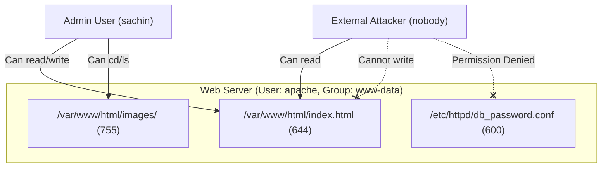
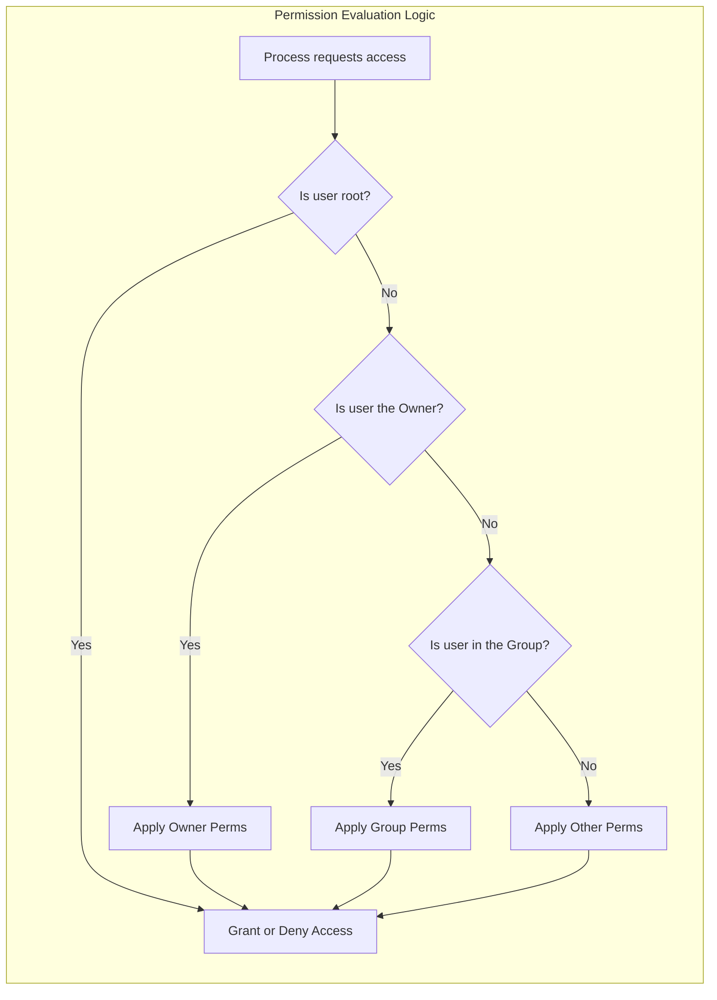
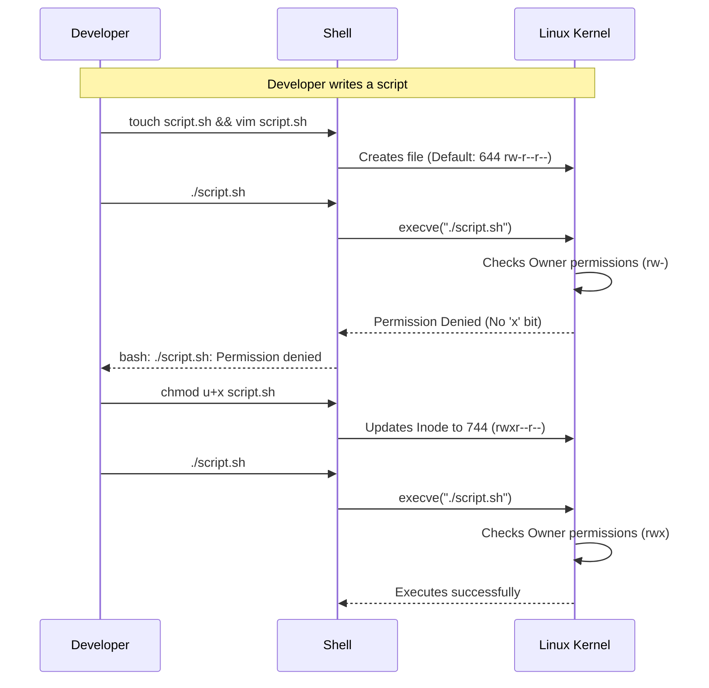

# CHAPTER 16 — LINUX PERMISSIONS DEEP DIVE

---

## 1. Introduction

### Why This Topic Exists
Linux is a multi-user operating system designed from the ground up for security and resource sharing. Dozens of users, services, and applications run simultaneously on a single server. To prevent users from reading each other's private data, or a web server from accidentally deleting system files, Linux employs a strict, mandatory permissions system. Every file and directory is governed by rules dictating exactly who can read, write, or execute it.

### Why Linux Administrators Use It
System administrators spend a significant portion of their time managing access control. When a developer says, "My script won't run," or a web application says, "403 Forbidden," the administrator uses tools like `ls -l` and `chmod` to diagnose and fix permission issues.

### Why Companies Care About It
Security and compliance. Incorrect permissions are the number one cause of internal data breaches. If a Junior Admin accidentally sets `777` permissions on a directory containing SSL private keys or database passwords, any user on the system (including compromised web services) can steal those secrets. Mastering permissions is mandatory for passing security audits (PCI-DSS, SOC2).

---

## 2. Learning Objectives

By the end of this chapter, you will be able to:
- Read and interpret the 10-character permission string in `ls -l`.
- Understand the difference between Read, Write, and Execute on files vs directories.
- Change permissions using Symbolic Mode (`chmod u+x`).
- Calculate and change permissions using Numeric/Octal Mode (`chmod 755`).
- Troubleshoot "Permission denied" errors effectively.

---

## 3. Beginner-Friendly Explanation

Think of Linux permissions like access badges in a corporate office building:
- **Owner (User):** You. You have a master badge for your own office. You can read your documents, write on your whiteboard, and execute your plans.
- **Group:** Your team (e.g., the HR department). Everyone in the HR group shares a badge that lets them into the HR filing room to read shared documents.
- **Others (World):** Everyone else in the company. Maybe they are allowed to look at the bulletin board in the hallway (Read), but they cannot write on it or enter private offices.

Permissions define what the Owner, the Group, and Others are allowed to do (Read, Write, Execute).

---

## 4. Core Theory

### 4.1 The Permission String (`ls -l`)

When you run `ls -l`, you see a 10-character string like `-rwxr-xr--`.

```text
  -   rwx   r-x   r--
  │    │     │     │
  │    │     │     └── Others (World) Permissions: Read only
  │    │     └──────── Group Permissions: Read & Execute
  │    └────────────── Owner (User) Permissions: Read, Write & Execute
  └─────────────────── File Type (- = file, d = directory, l = symlink)
```

### 4.2 What Permissions Actually Mean

Permissions behave differently depending on whether they are applied to a file or a directory.

| Permission | On a File | On a Directory |
|:---|:---|:---|
| **Read (`r`)** | Can view file contents (`cat`, `less`) | Can list filenames inside the dir (`ls`) |
| **Write (`w`)** | Can modify or empty the file (`vim`, `>`) | Can create, delete, or rename files inside the dir (`touch`, `rm`) |
| **Execute (`x`)** | Can run the file as a programme/script | Can enter the dir (`cd`) and access files within it |

> **Crucial Concept:** To delete a file, you do **not** need write permission on the file itself. You need write permission on the **directory** containing the file.

### 4.3 Changing Permissions: Symbolic Mode
Uses letters to add (`+`), remove (`-`), or set (`=`) permissions.
- **Who:** `u` (user/owner), `g` (group), `o` (others), `a` (all)
- **Operator:** `+` (add), `-` (remove), `=` (exact match)
- **What:** `r` (read), `w` (write), `x` (execute)

*Examples:*
- `chmod u+x script.sh` (Add execute to owner)
- `chmod go-w file.txt` (Remove write from group and others)
- `chmod a=r file.txt` (Set exactly read-only for everyone)

### 4.4 Changing Permissions: Numeric (Octal) Mode
Uses a 3-digit number to represent permissions. Each permission has a mathematical value:
- **Read (`r`) = 4**
- **Write (`w`) = 2**
- **Execute (`x`) = 1**
- **None (`-`) = 0**

You add the numbers together for each category (User, Group, Others).

*Calculation Example: `rwxr-x---`*
- User: `r` (4) + `w` (2) + `x` (1) = **7**
- Group: `r` (4) + `-` (0) + `x` (1) = **5**
- Other: `-` (0) + `-` (0) + `-` (0) = **0**
- **Result:** `chmod 750`

*Common Enterprise Numbers:*
- `644`: Standard for files (`rw-r--r--`). Owner writes, others read.
- `755`: Standard for directories/scripts (`rwxr-xr-x`). Owner writes, others read/execute.
- `600`: Private files like SSH keys (`rw-------`). Only owner can access.
- `700`: Private directories (`rwx------`). Only owner can access.
- `777`: **DANGEROUS** (`rwxrwxrwx`). Everyone can do everything. Never use in production.

---

## 5. Internal Working

The kernel stores permissions as bitmasks in the file's inode.
`rwx` is represented in binary as `111` (which equals 7 in octal).
`rw-` is represented as `110` (which equals 6 in octal).

When a process tries to open a file:
1. The kernel checks if the process UID matches the file's Owner UID. If yes, it applies Owner permissions.
2. If not, it checks if the process GID is in the file's Group list. If yes, it applies Group permissions.
3. If neither, it applies Other permissions.
*(Note: Root user UID 0 bypasses these checks completely).*

---

## 6. Production Architecture



---

## 7. Command-by-Command Explanation

### 7.1 `chmod` (Change Mode)
- **Purpose:** Changes file and directory permissions.
- **Example:** `chmod 755 /opt/scripts/backup.sh`

### 7.2 `chmod -R` (Recursive)
- **Purpose:** Changes permissions on a directory and everything inside it.
- **Example:** `chmod -R 750 /var/www/project/`
- *Warning:* Be careful using `-R`. You usually want directories to be 755 and files to be 644. Running `chmod -R 755` makes all files executable, which is a security risk.

---

## 8. Syntax Breakdown

```bash
chmod u=rw,g=r,o=r config.txt
│     │    │   │    │
│     │    │   │    └── Target file
│     │    │   └─────── Others: exactly Read
│     │    └─────────── Group: exactly Read
│     └──────────────── User: exactly Read/Write
└────────────────────── Command: change mode
```

---

## 9. Parameter Explanation

| Command | Parameter | Description |
|:---|:---|:---|
| `chmod` | `-R` | Recursively apply permissions to all files in directory tree |
| `chmod` | `-v` | Verbose; print a message for every file processed |
| `chmod` | `--reference=RFILE` | Copy permissions exactly from RFILE to target file |

---

## 10. Sample Output Analysis

**Scenario:** Checking permissions on an SSH private key.
**Command:** `ls -l ~/.ssh/id_rsa`

**Output:**
```text
-rw-------. 1 sachin sachin 2610 Jul 26 10:00 /home/sachin/.ssh/id_rsa
```

**Analysis:**
- `-`: Regular file.
- `rw-`: Owner (sachin) can read and write. (Octal 6)
- `---`: Group (sachin) has no access. (Octal 0)
- `---`: Others have no access. (Octal 0)
- Total Octal: `600`.
- *Note:* SSH strictly enforces this. If an SSH private key has permissions like `644`, the SSH client will throw a "WARNING: UNPROTECTED PRIVATE KEY FILE" error and refuse to connect.

---

## 11. Architecture Diagram



---

## 12. Workflow Diagram



---

## 13. Real Production Examples

### Securing Database Credentials
A web application reads a config file containing a database password. It must be readable by the web server (owner), but completely blocked from all other users on the system.
```bash
chmod 600 /etc/webapp/db_config.ini
```

### Making a Deployment Script Executable
An engineer writes a script to automate backups. Before it can be run, it must be made executable.
```bash
chmod +x /opt/scripts/backup.sh
# Note: 'chmod +x' is a shortcut for 'chmod a+x' (adds execute for everyone, constrained by umask)
```

---

## 14. Common Mistakes

1. **The `777` Solution** — When a Junior Admin gets a "Permission denied" error, they often run `chmod -R 777 /var/www/`. This is a catastrophic security failure. It allows any compromised service on the server to deface the website or drop malware. Fix ownership or use `755`/`644` instead.
2. **Missing `x` on Directories** — A user is given `r` (read) and `w` (write) on a directory, but cannot `cd` into it or run `ls`. Why? Because directories **must** have the `x` (execute) bit for a user to traverse into them.
3. **Trying to delete a file without directory write access** — A user owns a file and has `rw` on it, but cannot delete it. Deleting a file modifies the *directory* it sits in. The user needs `w` on the parent directory to delete the file.

---

## 15. Best Practices

- Standard Files: `644`
- Standard Directories: `755`
- Executable Scripts: `755`
- Private Keys/Passwords: `600`
- Use numeric mode (`chmod 755`) for bulk setups because it guarantees the exact state. Use symbolic mode (`chmod +x`) when you just want to tweak one bit without caring about the others.
- Never use `777` in production. If a service needs to write to a folder, change the group ownership to that service and use `775`.

---

## 16. Security Considerations

- Read permissions on `/var/log` allow attackers to see system events. Ensure logs are `640` or `600` and owned by root/syslog.
- Find world-writable files (777) during security audits using: `find / -type f -perm 777 2>/dev/null`

---

## 17. Performance Considerations

- `chmod -R` on a massive directory structure (e.g., millions of files) is extremely slow because it must issue an inode update for every single file. Do this off-peak.

---

## 18. Troubleshooting Guide

| Symptom | Root Cause | Resolution |
|:---|:---|:---|
| Cannot execute script | Missing `x` permission | `chmod +x script.sh` |
| `cd: Permission denied` | Missing `x` on directory | `chmod +x directory_name` |
| `rm: Permission denied` | Missing `w` on parent directory | Check permissions of the folder containing the file |
| Cannot edit file even with `rw` | File is owned by root, you are normal user | Use `sudo vim` |

---

## 19. Practical Labs

**Lab 16.1:** Numeric Mode:
```bash
touch numeric.txt
chmod 644 numeric.txt
ls -l numeric.txt
chmod 600 numeric.txt
ls -l numeric.txt
chmod 777 numeric.txt  # Look at the colors change in ls!
```

**Lab 16.2:** Symbolic Mode:
```bash
touch symbolic.sh
chmod u+x,g-w,o-r symbolic.sh
ls -l symbolic.sh
```

**Lab 16.3:** Directory Execute Bit:
```bash
mkdir secret_dir
touch secret_dir/file.txt
chmod 644 secret_dir    # Removing execute bit
cd secret_dir           # Fails!
chmod 755 secret_dir    # Restoring execute bit
cd secret_dir           # Succeeds!
```

---

## 20. Mini Project

Create a secure project structure for a theoretical web app:
1. `mkdir -p /tmp/webapp/config`
2. `touch /tmp/webapp/index.html`
3. `touch /tmp/webapp/config/db.ini`
4. Make the app directory traversable but read-only for others: `chmod 755 /tmp/webapp`
5. Make the html file readable by others: `chmod 644 /tmp/webapp/index.html`
6. Secure the database config so only the owner can read/write: `chmod 600 /tmp/webapp/config/db.ini`
7. Verify all with `ls -laR /tmp/webapp`

---

## 21. Assignments

1. Convert `rwxr-x---` into its numeric (octal) equivalent.
2. Why is the execute (`x`) permission necessary on a directory?
3. A user has `rw-` permission on a file, but the file is inside a directory where the user has `r-x` (read/execute but no write). Can the user delete the file? Why or why not?

---

## 22. Interview Questions

### Basic
1. **Q: How do you make a shell script executable?**
   A: `chmod +x scriptname.sh` (or `chmod 755 scriptname.sh`).

2. **Q: What does the permission `644` mean?**
   A: Owner can read and write (6). Group can read only (4). Others can read only (4). It is the standard permission for files.

### Intermediate
3. **Q: You run `chmod -R 755 /var/www/html`. Why is this considered bad practice?**
   A: The `-R` flag applies `755` recursively to everything. While `755` is correct for directories (allowing traversal), it makes every single HTML, image, and text file executable as a programme. Files should be `644`.

4. **Q: How do you fix the above mistake, making directories 755 and files 644?**
   A: Use the `find` command.
   `find /var/www/html -type d -exec chmod 755 {} \;`
   `find /var/www/html -type f -exec chmod 644 {} \;`

### Scenario-Based
5. **Q: A junior admin says, "I can't read this log file. I even ran `chmod 777` on the log file, but I still get Permission Denied!" What is the most likely reason?**
   A: The junior admin lacks execute (`x`) permission on one of the parent directories leading to the file (e.g., `/var/log`). If you cannot traverse the parent directory, you cannot access the file inside it, regardless of the file's own permissions.

---

## 23. Chapter Summary and Quick Revision Notes

- `ls -l` shows `[Type][Owner][Group][Other]`.
- Numeric values: Read=4, Write=2, Execute=1.
- Files: Read=view, Write=edit, Execute=run script.
- Directories: Read=list files, Write=create/delete files, Execute=enter directory (`cd`).
- `chmod` changes permissions. `-R` is recursive.
- Standard File: `644`. Standard Directory: `755`. Secret File: `600`.
- Deleting a file requires write permission on the **directory**, not the file.

---

## 24. Cheat Sheet

| Command | Purpose |
|:---|:---|
| `chmod 644 file` | `rw-r--r--` (Standard file) |
| `chmod 755 dir` | `rwxr-xr-x` (Standard directory/script) |
| `chmod 600 file` | `rw-------` (Private file, SSH keys) |
| `chmod 700 dir` | `rwx------` (Private directory) |
| `chmod u+x file` | Add execute for Owner |
| `chmod go-w file` | Remove write for Group and Others |
| `chmod a+r file` | Add read for All |
