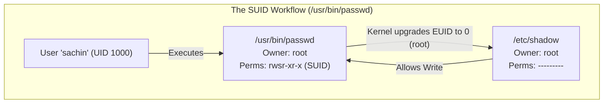
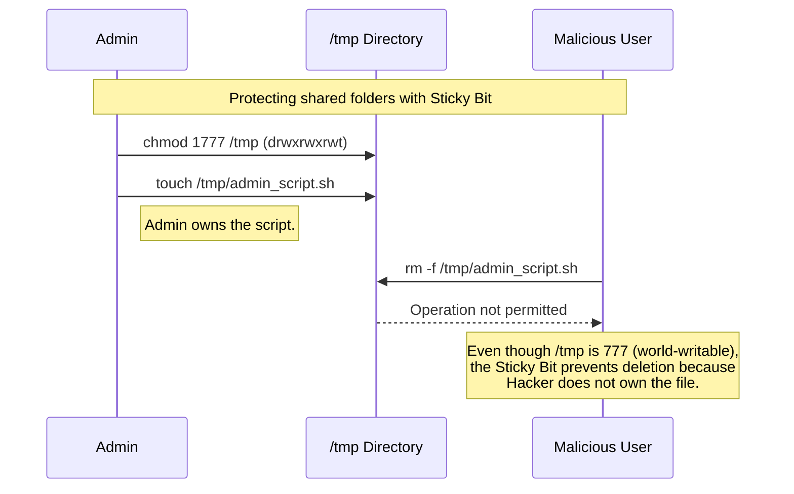

# CHAPTER 18 — SPECIAL PERMISSIONS: SUID, SGID, STICKY BIT

---

## 1. Introduction

### Why This Topic Exists
Standard permissions (Read, Write, Execute) and ACLs dictate *who* can access a file. But Linux also has three "Special Permissions" that dictate *how* files and directories execute and share data. These are Set User ID (SUID), Set Group ID (SGID), and the Sticky Bit. They solve fundamental operational problems, such as allowing normal users to change their own passwords (which requires writing to a root-owned file), or preventing users from deleting each other's files in a shared folder like `/tmp`.

### Why Linux Administrators Use It
Administrators configure SGID on shared departmental directories so that all files created within them automatically inherit the correct group ownership, ensuring seamless collaboration. They apply the Sticky Bit to shared upload folders so users can drop files but cannot sabotage colleagues by deleting their work.

### Why Companies Care About It
Security and Privilege Escalation. SUID is one of the most dangerous features in Linux. If a junior administrator incorrectly applies the SUID bit to a script or binary (like `vim` or `nmap`), an attacker can exploit it to gain instant `root` access to the server. Security audits (like CIS Benchmarks) explicitly scan for unauthorised SUID/SGID files to prevent privilege escalation attacks.

---

## 2. Learning Objectives

By the end of this chapter, you will be able to:
- Understand and configure the SUID bit on executables (`chmod u+s`).
- Understand and configure the SGID bit on directories for collaboration (`chmod g+s`).
- Understand and configure the Sticky Bit on shared directories (`chmod +t`).
- Calculate the 4-digit numeric permissions (e.g., `4755`, `2770`, `1777`).
- Identify special permissions in `ls -l` output (`s`, `S`, `t`, `T`).
- Search the filesystem for SUID/SGID files using `find`.

---

## 3. Beginner-Friendly Explanation

Think of Special Permissions like corporate security policies:

- **SUID (Set User ID) - "The Proxy Card":**
  You are a normal employee, but you need to enter the Server Room to reboot a machine. You don't have access. The IT Director hands you their Proxy Card. While you hold the card, the building treats you as if you are the IT Director.
  *(Linux Translation: A normal user runs a command, but the command executes with the privileges of the file's owner, usually `root`)*.

- **SGID (Set Group ID) - "The Team Folder":**
  Your Marketing team has a shared filing cabinet. Normally, if you put a file in there, you own it, and others might not be able to edit it. The SGID policy says: "Anything placed in this cabinet instantly belongs to the Marketing Team, regardless of who put it there."
  *(Linux Translation: Files created in an SGID directory automatically inherit the directory's group ownership).*

- **Sticky Bit - "The Public Noticeboard":**
  The company breakroom has a public noticeboard. Anyone can pin a notice (Write). But to prevent chaos, the rule is: You can only remove your *own* notices. You cannot tear down someone else's notice.
  *(Linux Translation: In a Sticky Bit directory, users can create files, but can only delete files they own).*

---

## 4. Core Theory

### 4.1 SUID (Set User ID)
- **Applies to:** Executable files (binaries).
- **Function:** When a user executes the file, the process runs with the privileges of the file's **Owner**, not the user who ran it.
- **Example:** The `passwd` command. A normal user runs `passwd` to change their password. This requires writing to `/etc/shadow`, which is owned by root and has `000` permissions. Because `/usr/bin/passwd` has the SUID bit set, it executes as `root`, allowing the write.
- **Symbolic:** `chmod u+s filename`
- **Numeric:** Add `4000` to base permissions (e.g., `chmod 4755`).
- **Indicator:** An `s` in the owner's execute position (`-rwsr-xr-x`).

### 4.2 SGID (Set Group ID)
- **Applies to:** Executable files (rare) and Directories (common).
- **Function on Directories:** Any file or directory created inside an SGID directory will automatically inherit the **Group Ownership** of the parent directory, rather than the primary group of the user who created it. Crucial for shared team folders.
- **Symbolic:** `chmod g+s directoryname`
- **Numeric:** Add `2000` to base permissions (e.g., `chmod 2770`).
- **Indicator:** An `s` in the group's execute position (`drwxrws---`).

### 4.3 Sticky Bit
- **Applies to:** Directories.
- **Function:** Restricts file deletion. In a directory with the Sticky Bit, a file can only be deleted by the file's owner, the directory's owner, or root. Even if the directory has `777` permissions, users cannot delete files they don't own.
- **Example:** `/tmp` is the classic example (`drwxrwxrwt`). Everyone can write to it, but nobody can delete other people's temp files.
- **Symbolic:** `chmod +t directoryname`
- **Numeric:** Add `1000` to base permissions (e.g., `chmod 1777`).
- **Indicator:** A `t` in the others' execute position (`drwxrwxrwt`).

---

## 5. Internal Working

### The Process EUID (Effective User ID)
When a process starts in Linux, it has a Real User ID (RUID) and an Effective User ID (EUID).
- The **RUID** identifies who launched the process (e.g., `sachin`).
- The **EUID** determines the actual permissions the process has for kernel access checks.
Normally, `RUID = EUID`.
However, when the kernel executes a binary with the SUID bit set, it sets the `EUID` to the UID of the file's owner (e.g., `root`). The process operates as root until it finishes, at which point the temporary escalation is destroyed.

*(Note: Linux ignores the SUID bit on shell scripts for security reasons; it only works on compiled binary executables).*

---

## 6. Production Architecture



---

## 7. Command-by-Command Explanation

### 7.1 `chmod u+s /usr/bin/custom_tool`
- **Purpose:** Applies the SUID bit. The file will now execute as the owner.

### 7.2 `chmod g+s /shared/marketing`
- **Purpose:** Applies the SGID bit. New files inside `/shared/marketing` will belong to the `marketing` group.

### 7.3 `chmod +t /shared/uploads`
- **Purpose:** Applies the Sticky Bit. Users can upload files, but cannot delete each other's uploads.

### 7.4 `find / -perm -4000 -type f 2>/dev/null`
- **Purpose:** Security audit command. Searches the entire filesystem for files with the SUID bit set (`4000`).

---

## 8. Syntax Breakdown

```bash
chmod 2775 /opt/shared_project/
│     ││││
│     │││└── Others: Read/Execute (5)
│     ││└─── Group: Read/Write/Execute (7)
│     │└──── Owner: Read/Write/Execute (7)
│     └───── Special: SGID Bit (2)
└─────────── Command: change mode
```

---

## 9. Parameter Explanation

| Special Bit | Octal Value | Symbolic Flag | Meaning |
|:---|:---|:---|:---|
| **SUID** | `4000` | `u+s` | Execute as owner |
| **SGID** | `2000` | `g+s` | Inherit group ownership (directories) |
| **Sticky** | `1000` | `+t` | Restrict deletion to file owners |

*(You can combine them: `7000` sets SUID, SGID, and Sticky simultaneously, though this is rarely useful).*

---

## 10. Sample Output Analysis

**Scenario:** We examine three different files/directories.
**Command:** `ls -ld /usr/bin/passwd /var/tmp /run/log/journal`

**Output:**
```text
-rwsr-xr-x. 1 root root    34816 Jul 26 10:00 /usr/bin/passwd
drwxr-sr-x. 3 root systemd  4096 Jul 26 10:00 /run/log/journal
drwxrwxrwt. 7 root root     4096 Jul 26 10:05 /var/tmp
```

**Analysis:**
- **`/usr/bin/passwd`:** The `s` in the owner's execute spot means SUID is active. (Numeric: `4755`)
- **`/run/log/journal`:** The `s` in the group's execute spot means SGID is active. Any logs created here inherit the `systemd` group. (Numeric: `2755`)
- **`/var/tmp`:** The `t` in the others' execute spot means the Sticky Bit is active. It is world-writable, but files are protected from deletion by non-owners. (Numeric: `1777`)

**Capital Letters vs Lowercase:**
If you see a capital `S` or `T`, it means the special bit is set, but the underlying execution bit is missing.
- `-rwSr-xr-x` = SUID is set, but the owner doesn't have `x` permission. (Broken configuration).
- `-rwsr-xr-x` = SUID is set, AND the owner has `x` permission. (Correct configuration).

---

## 11. Architecture Diagram

```mermaid
graph LR
    subgraph Collaborative_Directory_with_SGID ["Collaborative Directory with SGID"]
        Admin["Admin runs: chgrp finance /shared<br/>chmod 2770 /shared"]
        UserA["Alice (Primary Grp: users)"]
        UserB["Bob (Primary Grp: users)"]
        FileA["Alice creates: report.txt<br/>Owner: alice, Group: finance"]
        FileB["Bob creates: budget.xlsx<br/>Owner: bob, Group: finance"]
    end

    Admin --> UserA
    Admin --> UserB
    UserA --> FileA
    UserB --> FileB
    FileA -.->|Group matches| FileB
    Note over FileA,FileB: Because group is 'finance',<br/>Alice and Bob can edit each other's files.
```

---

## 12. Workflow Diagram



---

## 13. Real Production Examples

### The Corporate Shared Folder
The Finance department needs a folder where anyone in the `finance` group can create and edit files.
```bash
sudo mkdir /data/finance
sudo chgrp finance /data/finance
sudo chmod 2770 /data/finance   # SGID ensures all files belong to 'finance' group
```

### The FTP Upload Drop Box
A public FTP server allows users to upload files, but they shouldn't be able to delete files.
```bash
sudo mkdir /var/ftp/uploads
sudo chmod 1777 /var/ftp/uploads  # Sticky bit protects files from deletion by others
```

### Finding Security Vulnerabilities
During a quarterly security audit, an administrator must identify all SUID binaries on the system to ensure an attacker hasn't hidden a backdoor (like a copy of `/bin/bash` with SUID root).
```bash
sudo find / -type f -perm -4000 -exec ls -l {} \; > /tmp/suid_audit.txt
```

---

## 14. Common Mistakes

1. **Setting SUID on shell scripts** — Administrators sometimes try to give a script root privileges using `chmod u+s script.sh`. Linux explicitly ignores the SUID bit on interpreted scripts (bash, python) due to massive security flaws (race conditions and environment variable injection). If a script needs root, configure `sudo` rules.
2. **Capital `S` or `T` confusion** — A junior admin runs `chmod 1666 /tmp`. They see `drw-rw-rwT`. The capital `T` indicates an error: the directory lacks the execution bit (`x`), meaning users cannot even `cd` into it. It should be `chmod 1777`.
3. **Using SUID instead of Sudo** — Granting root privileges to a binary via SUID applies to *everyone* who can execute the binary. This is terrible for auditing and security. Use `sudo` to grant privileges to specific users instead.

---

## 15. Best Practices

- Use SGID (`2770` or `2775`) aggressively for departmental collaboration folders to eliminate group-ownership headaches.
- Use the Sticky Bit (`1777`) on any directory where multiple untrusted users write data.
- **Never** add the SUID bit to system binaries. If a vendor tool requires it, isolate it and ensure only specific groups can execute it.
- Regularly audit SUID/SGID files using `find`.

---

## 16. Security Considerations

- **Privilege Escalation:** If a binary has SUID root, and that binary has a buffer overflow vulnerability, an attacker can crash the binary and drop into a root shell.
- **Living off the Land:** If an attacker copies `/usr/bin/find` or `/usr/bin/nmap` and sets SUID root on it, they can use it to read any file or execute commands as root at any time.

---

## 17. Performance Considerations

- Special permissions have absolutely zero performance impact. The checks are performed instantaneously by the kernel during the `execve()` or `open()` system calls.

---

## 18. Troubleshooting Guide

| Symptom | Root Cause | Resolution |
|:---|:---|:---|
| See a capital `S` or `T` in `ls -l` | Missing the underlying execute (`x`) bit | Add execute permission: `chmod +x file` |
| SUID on a bash script isn't working | Linux ignores SUID on scripts | Configure `/etc/sudoers` for the script instead |
| Files in shared dir belong to wrong group | SGID is not set on the directory | Run `chmod g+s dir_name` |
| Can't delete file in 777 directory | Sticky bit is set, and you don't own the file | Ask file owner or root to delete it |

---

## 19. Practical Labs

**Lab 18.1:** Setting the Sticky Bit
```bash
sudo mkdir /tmp/sticky_lab
sudo chmod 1777 /tmp/sticky_lab
ls -ld /tmp/sticky_lab
# As user A, touch a file in the directory.
# Switch to user B, try to delete it (it will fail).
```

**Lab 18.2:** Setting SGID for Collaboration
```bash
sudo mkdir /tmp/collab
sudo groupadd projectx
sudo chgrp projectx /tmp/collab
sudo chmod 2770 /tmp/collab
ls -ld /tmp/collab
# Create a file inside it, check its group ownership.
```

**Lab 18.3:** Auditing SUID
```bash
# Find all SUID root files on your system
find /usr/bin -type f -perm -4000 -exec ls -l {} \;
```

---

## 20. Mini Project

Build a secure project environment:
1. Create a group `designers`.
2. Create a directory `/opt/design_assets`.
3. Change group ownership to `designers`.
4. Apply permissions so that the owner (root) and the group (`designers`) have full access, others have no access, AND ensure all future files inherit the `designers` group. (Hint: Numeric permissions `2770`).
5. Verify your work with `ls -ld`. You should see `drwxrws---`.

---

## 21. Assignments

1. Why does the `/usr/bin/passwd` command require the SUID bit? What would happen if it was removed?
2. Explain the difference between `rwsr-xr-x` and `rwSr-xr-x`.
3. What is the octal value for setting the Sticky Bit, and what does it do?

---

## 22. Interview Questions

### Basic
1. **Q: What does the Sticky Bit do on a directory?**
   A: It restricts file deletion. Only the owner of a file, the owner of the directory, or root can delete files within that directory. It is typically used on world-writable directories like `/tmp`.

2. **Q: How do you identify if an executable has the SUID bit set?**
   A: Run `ls -l`. The execute character for the owner will be an `s` instead of an `x` (e.g., `-rwsr-xr-x`).

### Intermediate
3. **Q: A team needs a shared folder where every file created automatically belongs to the team's group, regardless of who creates it. How do you configure this?**
   A: I would change the group ownership of the directory to the team's group (`chgrp teamgroup /shared`), and then set the SGID (Set Group ID) bit on the directory using `chmod g+s /shared` or `chmod 2770 /shared`.

4. **Q: You wrote a bash script that restarts a system service. You applied `chmod 4755 script.sh` to give it SUID root privileges so normal users can run it. However, it still asks for a password. Why?**
   A: Linux kernel security design ignores the SUID bit on interpreted scripts (like bash, python, or perl) to prevent privilege escalation exploits. SUID only works on compiled binaries. To allow users to run the script as root, you must configure `sudo` via the `/etc/sudoers` file.

### Scenario-Based
5. **Q: During a security audit, you run `find / -perm -4000`. You see `/usr/bin/nmap` in the list. Is this a problem? Why?**
   A: Yes, this is a massive security vulnerability. Nmap has an interactive mode (or allows arbitrary script execution) that can spawn a shell. Because the SUID bit is set, executing `nmap` runs it as root, meaning any unprivileged user on the system can use `nmap` to spawn a root shell and take full control of the server. The SUID bit must be removed immediately.

---

## 23. Chapter Summary and Quick Revision Notes

- **SUID (4000, `u+s`, `s`):** Executable runs with Owner's privileges (e.g., `passwd`). Ignored on scripts.
- **SGID (2000, `g+s`, `s`):** Files created in directory inherit directory's Group. Ideal for collaboration.
- **Sticky Bit (1000, `+t`, `t`):** Restricts deletion in a directory to file owners only (e.g., `/tmp`).
- **Capital letters (`S`, `T`):** Indicate the special bit is set, but the required execute bit (`x`) is missing.
- **Calculation:** Add the special value to the thousands place (e.g., `4000` + `0755` = `4755`).

---

## 24. Cheat Sheet

| Command | Numeric | Symbolic | Action |
|:---|:---|:---|:---|
| `chmod 4755 file` | `4000` | `u+s` | Set SUID (runs as owner) |
| `chmod 2770 dir` | `2000` | `g+s` | Set SGID (inherit group ownership) |
| `chmod 1777 dir` | `1000` | `+t` | Set Sticky Bit (restrict deletion) |
| `find / -perm -4000` | - | - | Search for all SUID files |
| `find / -perm -2000` | - | - | Search for all SGID files/dirs |
