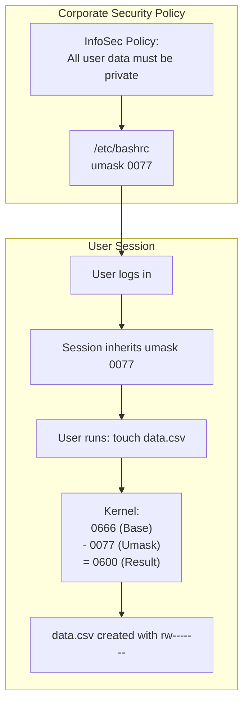
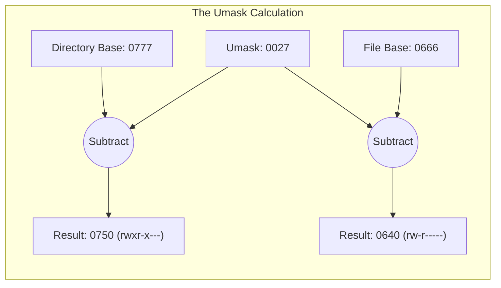
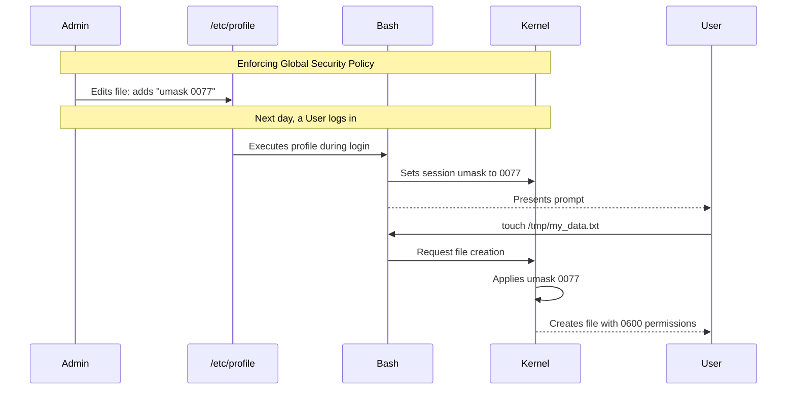

# CHAPTER 19 — DEFAULT PERMISSIONS AND UMASK

---

## 1. Introduction

### Why This Topic Exists
When you create a new file using `touch` or save a document in `vim`, Linux automatically assigns it a set of default permissions (usually `644` for files and `755` for directories). But who decides these defaults? Why doesn't Linux create files with `777` permissions? The answer lies in a mechanism called `umask` (User File Creation Mask), which automatically subtracts specific permissions to ensure newly created files are secure by default.

### Why Linux Administrators Use It
In highly secure environments (like banking or healthcare), the default `644` permissions (world-readable) are unacceptable. Administrators modify the system-wide `umask` so that every file created by any user is automatically locked down to `600` (private to the owner) or `640` (private to the team).

### Why Companies Care About It
Data leakage. If an application developer writes a script that exports customer data to `/tmp/export.csv`, and the system `umask` defaults to world-readable, any other user logged into that server can steal the data. Enforcing a strict corporate `umask` policy prevents accidental data exposure at the moment of file creation.

---

## 2. Learning Objectives

By the end of this chapter, you will be able to:
- Explain how Linux calculates default permissions for files and directories.
- Understand the difference between Base Permissions and the Umask value.
- Calculate effective permissions using umask subtraction.
- View and temporarily change your current umask.
- Permanently configure system-wide and user-specific umask settings.

---

## 3. Beginner-Friendly Explanation

Think of `umask` like a security filter on a factory production line.

- **The Factory Default (Base Permissions):** Every time the factory produces a folder, it wants to give everyone a master key (`777`). Every time it produces a document, it wants to give everyone a read/write key (`666`).
- **The Security Filter (Umask):** Before the folder or document leaves the factory, it must pass through the Security Filter. The filter is designed to *take away* specific keys.
- **The Result:** If the filter is set to take away the "write key for Others" (value `002`), the document leaves the factory as `664` instead of `666`. The `umask` is literally a mask that blocks certain permissions from being granted.

---

## 4. Core Theory

### 4.1 Base Permissions (Maximum Allowable)
The Linux kernel hard-codes the maximum starting permissions for new objects:
- **Maximum for Directories:** `0777` (`rwxrwxrwx`)
- **Maximum for Files:** `0666` (`rw-rw-rw-`)
*(Notice that files are NEVER created with execute permissions by default, for security reasons. You must manually `chmod +x` a script).*

### 4.2 The Umask Concept
The `umask` is a 4-digit octal number (e.g., `0022`) that represents the permissions to be **removed** (masked out) from the Base Permissions.

**Effective Permissions = Base Permissions - Umask**

### 4.3 Umask Calculation (Octal Subtraction)

**Scenario 1: Default RHEL/Ubuntu umask (`0022`)**
- **For a Directory:**
  Base:  `0777`
  Mask: `-0022`
  Result:`0755` (`rwxr-xr-x`)
- **For a File:**
  Base:  `0666`
  Mask: `-0022`
  Result:`0644` (`rw-r--r--`)

**Scenario 2: Secure Corporate umask (`0077`)**
- **For a Directory:**
  Base:  `0777`
  Mask: `-0077`
  Result:`0700` (`rwx------` - completely private)
- **For a File:**
  Base:  `0666`
  Mask: `-0077`
  Result:`0600` (`rw-------` - completely private)

*(Note: While we say "subtraction" for simplicity, the actual kernel math is a bitwise NOT AND operation: `Base AND (NOT Umask)`).*

### 4.4 Temporary vs Permanent Umask
- Running `umask 0077` in the terminal changes it only for your current session.
- To make it permanent, it must be defined in the shell startup files (`/etc/profile`, `~/.bashrc`).

---

## 5. Internal Working

### Why User and Root have different default umasks
On Red Hat based systems (RHEL, CentOS, Rocky, Fedora):
- Standard Users get a umask of `0002`. This results in files being `664` (Group writable). This is because modern Linux uses UPG (User Private Groups) where every user has their own dedicated group.
- The `root` user gets a umask of `0022`. This results in files being `644` (Group read-only). This is stricter because files created by root are often system configurations that nobody else should modify.

---

## 6. Production Architecture



---

## 7. Command-by-Command Explanation

### 7.1 `umask`
- **Purpose:** Displays the current umask value for the active shell session.
- **Example Output:** `0022`

### 7.2 `umask -S`
- **Purpose:** Displays the current umask symbolically (showing what permissions are *allowed*, rather than what is stripped).
- **Example Output:** `u=rwx,g=rx,o=rx` (This corresponds to a mask of `0022`).

### 7.3 `umask 0027`
- **Purpose:** Temporarily changes the session umask.
- **Result:** New files will be `640` (Owner read/write, Group read, Others nothing).

---

## 8. Syntax Breakdown

```bash
echo "umask 0077" >> ~/.bashrc
│     │     │     │  │
│     │     │     │  └── The user's shell profile (executes on login)
│     │     │     └───── Append operator
│     │     └─────────── The exact mask value (blocks all Group/Other access)
│     └───────────────── The command to set the mask
└─────────────────────── Command: echo text to file
```

---

## 9. Parameter Explanation

| Value | Mask Meaning (What is Removed) | Result on Files | Result on Directories |
|:---|:---|:---|:---|
| `0000` | Removes nothing (DANGEROUS) | `666` (World writable) | `777` (World writable) |
| `0002` | Removes write from Others | `664` | `775` |
| `0022` | Removes write from Group/Others| `644` (Standard) | `755` (Standard) |
| `0027` | Removes write from Group, all from Others | `640` | `750` |
| `0077` | Removes all from Group/Others | `600` (Highly Secure)| `700` (Highly Secure) |

---

## 10. Sample Output Analysis

**Scenario:** We want to test how umask affects file creation.
**Command Sequence:**
```bash
$ umask
0022
$ touch file1.txt
$ mkdir dir1
$ umask 0077
$ touch file2.txt
$ mkdir dir2
$ ls -l
```

**Output:**
```text
-rw-r--r--. 1 sachin sachin    0 Jul 26 10:00 file1.txt
drwxr-xr-x. 2 sachin sachin 4096 Jul 26 10:00 dir1
-rw-------. 1 sachin sachin    0 Jul 26 10:01 file2.txt
drwx------. 2 sachin sachin 4096 Jul 26 10:01 dir2
```

**Analysis:**
- Under `0022`, `file1.txt` became `644` and `dir1` became `755`.
- Under `0077`, the filter stripped all permissions from Group and Others, resulting in `600` for `file2.txt` and `700` for `dir2`.
- Changing the umask does **not** affect existing files (`file1.txt` remained `644`); it only affects files created *after* the change.

---

## 11. Architecture Diagram



---

## 12. Workflow Diagram



---

## 13. Real Production Examples

### System-Wide Hardening (PCI-DSS Compliance)
Financial institutions undergo strict audits (PCI-DSS). Auditors require that no user can accidentally create world-readable files.
Administrators edit `/etc/login.defs` or `/etc/profile` and change the default `UMASK 022` to `UMASK 027`. This ensures that across the entire server fleet, files are created as `640` (secure).

### Application Service Accounts
A web server daemon (`nginx` or `apache`) runs under its own user account. When the application writes logs or creates temporary cache files, the permissions depend on the service's umask. Administrators often set the umask inside the systemd service file:
```ini
[Service]
UMask=0027
ExecStart=/usr/sbin/nginx -g 'daemon off;'
```
This guarantees log files are created securely.

---

## 14. Common Mistakes

1. **Thinking umask grants permissions** — `umask` only *subtracts* permissions. Setting `umask 0000` will not create files with `777` permissions; it will create them with `666` because the Base Permission for files is `666`.
2. **Confusing Umask with Chmod** — `chmod 022` sets a file to be completely unreadable (`----w--w-`). `umask 022` sets the filter to remove group/other write permissions. They are opposites.
3. **Using odd numbers in Umask** — Setting `umask 0023` to try and remove execution from directories usually causes confusion. Stick to standard filters: `022`, `002`, `027`, `077`.

---

## 15. Best Practices

- Standard default `022` is acceptable for standard internal infrastructure.
- Secure standard `027` is recommended for corporate file servers to block accidental "Others" access.
- Highly secure `077` is mandatory for bastions, jump servers, and systems handling cryptographic keys.
- To make a umask persistent for a single user, append it to `~/.bash_profile` or `~/.bashrc`.
- To make a umask persistent system-wide, modify `/etc/bashrc` or `/etc/profile` (or `/etc/login.defs` depending on the distribution).

---

## 16. Security Considerations

- A user creating a public/private SSH keypair relies on the ssh-keygen tool internally forcing a secure permission (`600`). If they copy-paste a key into a text file using `cat > id_rsa`, the file will inherit the umask (likely `644`), resulting in a severely compromised private key.

---

## 17. Performance Considerations

- Umask calculations happen at the kernel level in nanoseconds. There is zero performance penalty for enforcing strict umask policies.

---

## 18. Troubleshooting Guide

| Symptom | Root Cause | Resolution |
|:---|:---|:---|
| Files created via script are world-readable | Script is running under a permissive umask | Add `umask 027` at the top of the bash script |
| App logs are created as `644` instead of `640` | systemd service ignores shell umask | Add `UMask=0027` to the `[Service]` block of the unit file |
| `umask` change lost after logout | Set in active session only | Add to `~/.bashrc` for persistence |

---

## 19. Practical Labs

**Lab 19.1:** Calculate and Verify
1. Type `umask` to see your current mask.
2. `touch first.txt` and `ls -l first.txt` to see the result.
3. Change it: `umask 0077`
4. `touch second.txt` and `ls -l second.txt` to see the new secure result.
5. Restore it: `umask 0022`

**Lab 19.2:** Symbolic Umask
```bash
umask -S
# Change umask using symbols (Remove Read/Execute for Others)
umask o-rx
umask
```

---

## 20. Mini Project

1. Log in as your normal user.
2. Edit your profile to make a secure umask permanent: `echo "umask 0027" >> ~/.bashrc`.
3. Source the profile to apply immediately: `source ~/.bashrc`.
4. Create a test directory and file: `mkdir /tmp/secure_dir` and `touch /tmp/secure_dir/secure_file.txt`.
5. Run `ls -ld /tmp/secure_dir` (should be `750`).
6. Run `ls -l /tmp/secure_dir/secure_file.txt` (should be `640`).

---

## 21. Assignments

1. What are the Base Permissions for files and directories? Why do files not have the execute bit by default?
2. If the umask is `0002`, what will be the final permissions (in octal) for a newly created directory?
3. How do you make a umask change permanent for all users on a server?

---

## 22. Interview Questions

### Basic
1. **Q: What is the purpose of the `umask` command?**
   A: It determines the default permissions assigned to newly created files and directories by defining which permissions should be "masked" or subtracted from the system's base permissions.

2. **Q: If a system's umask is `0022`, what permissions will a new file get?**
   A: The base permission for a file is `0666`. Subtracting `0022` results in `0644` (`rw-r--r--`).

### Intermediate
3. **Q: Why does the root user typically have a umask of `0022` while normal users have `0002`?**
   A: Root operates on critical system files, so `0022` ensures that no group or other user can accidentally write to root-created files (resulting in `644`). Normal users on modern Linux use User Private Groups (UPG), where they are the only member of their own group. Therefore, a mask of `0002` (resulting in `664`) allows them group-write access, facilitating easier collaboration via SGID without compromising security.

4. **Q: Can `umask` force a file to be created with execute permissions (e.g., `777`)?**
   A: No. `umask` is a subtractive filter. The kernel hard-codes the maximum base permissions for files as `0666` (no execute). Even with a umask of `0000`, the file will be `0666`. You must use `chmod` to add execute permissions.

### Scenario-Based
5. **Q: Your company requires that all user-created files are completely private by default (no group access, no other access). How do you achieve this, and how do you ensure it persists across reboots?**
   A: I would set the umask to `0077`. To make it persistent for all users across reboots, I would append `umask 0077` to the global profile script (e.g., `/etc/profile` or `/etc/bashrc`, depending on the distribution).

---

## 23. Chapter Summary and Quick Revision Notes

- **Base Directory:** `0777`
- **Base File:** `0666`
- **Umask Logic:** Base Permissions - Umask = Effective Permissions.
- Umask strips permissions; it cannot add them.
- `0022` creates `644` files / `755` dirs (Standard).
- `0077` creates `600` files / `700` dirs (Highly Secure).
- Set temporarily via `umask 0022` in terminal.
- Set permanently via `~/.bashrc` or `/etc/profile`.

---

## 24. Cheat Sheet

| Umask | File Perm | Dir Perm | Use Case |
|:---|:---|:---|:---|
| `0000` | `666` | `777` | Highly Insecure, do not use |
| `0002` | `664` | `775` | Default for normal users (RHEL) |
| `0022` | `644` | `755` | Default for root / Standard Security |
| `0027` | `640` | `750` | Strict Corporate Environment |
| `0077` | `600` | `700` | Complete Privacy / Bastion Hosts |
