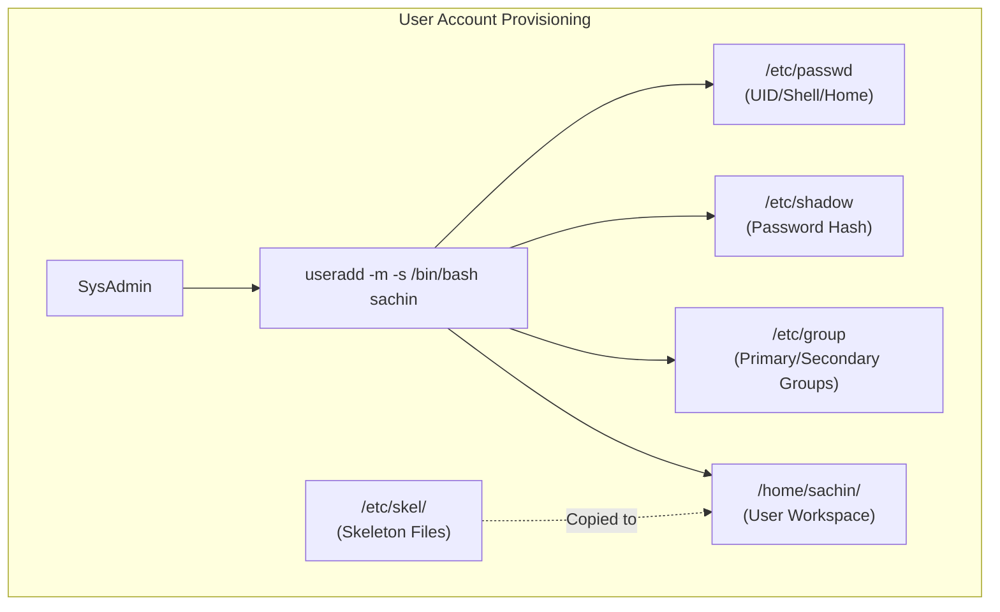
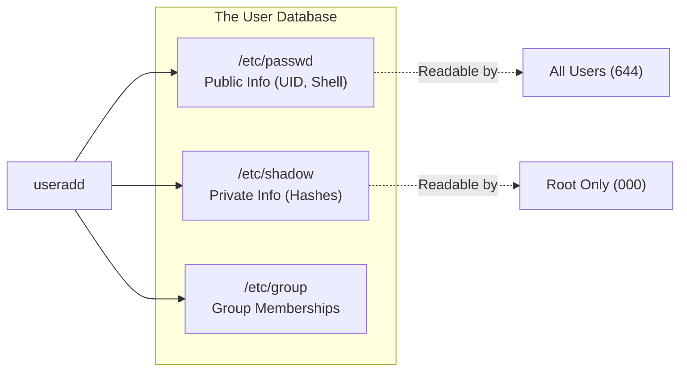
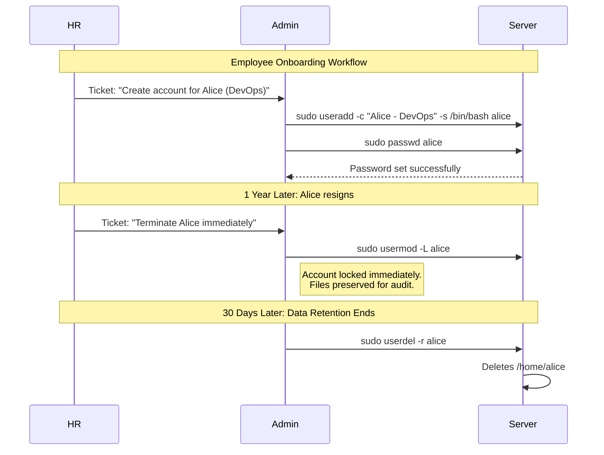

# CHAPTER 21 — USER MANAGEMENT BASICS

---

## 1. Introduction

### Why This Topic Exists
Linux is a multi-user environment. Whether a system has one administrator or five hundred engineers, every individual and every application service (like Apache or MySQL) requires a dedicated User Account to interact with the OS. User Management encompasses creating, modifying, locking, and deleting these accounts securely.

### Why Linux Administrators Use It
System administrators create accounts during employee onboarding, modify them when an employee changes departments (changing primary groups or home directories), and delete or lock them during offboarding to revoke access. They also create non-login accounts for applications to ensure services run with least privilege.

### Why Companies Care About It
Identity and Access Management (IAM) is a core pillar of corporate security. If an administrator fails to lock the account of a terminated employee, that account becomes a backdoor for data theft. Furthermore, security audits (like SOC2 or ISO 27001) mandate that every human user has a unique, traceable ID, rather than sharing generic accounts like `root` or `admin`.

---

## 2. Learning Objectives

By the end of this chapter, you will be able to:
- Understand the `/etc/passwd` file structure.
- Differentiate between System Users and Regular Users.
- Create users using `useradd` with custom IDs, shells, and home directories.
- Modify existing users using `usermod`.
- Delete users and their associated data using `userdel`.
- Switch between users using the `su` command.

---

## 3. Beginner-Friendly Explanation

Think of Linux user accounts like creating profiles on a shared corporate laptop:
- **`useradd` (New Employee):** You create a new profile for Alice. You give her a unique ID badge (UID), a default folder for her documents (Home Directory), and assign her to the Marketing team (Primary Group).
- **`usermod` (Promotion/Transfer):** Alice transfers to the Finance team. Instead of deleting her profile and making a new one, you modify her existing profile to change her department.
- **`userdel` (Resignation):** Alice leaves the company. You delete her profile. If she had sensitive company data on her desktop, you have the option to securely archive or wipe her home directory.
- **System Users:** You create a special profile for the automated vacuum robot. It has an ID, but you configure it so no human can actually type a password and log into it (No Login Shell).

---

## 4. Core Theory

### 4.1 The `/etc/passwd` File
Linux does not store user data in a database; it stores it in a plain text file: `/etc/passwd`.
Despite its name, it **does not contain passwords** (those were moved to `/etc/shadow` decades ago).

Each line represents one user and has 7 fields separated by colons (`:`):
`sachin:x:1000:1000:Sachin Admin:/home/sachin:/bin/bash`
1. **Username:** `sachin`
2. **Password Placeholder:** `x` (indicates password is encrypted in `/etc/shadow`)
3. **UID (User ID):** `1000` (The number the kernel actually cares about)
4. **GID (Group ID):** `1000` (Primary group ID)
5. **GECOS (Comment):** `Sachin Admin` (Full name, phone, etc.)
6. **Home Directory:** `/home/sachin`
7. **Login Shell:** `/bin/bash` (The programme that runs when the user logs in)

### 4.2 UID Ranges (RHEL 9 / Ubuntu)
- **`0`**: Reserved exclusively for `root`.
- **`1` to `200`**: Statically allocated system users (e.g., `bin`, `daemon`).
- **`201` to `999`**: Dynamically allocated system users (e.g., `apache`, `mysql`).
- **`1000+`**: Regular human users.

### 4.3 `useradd` (Create User)
The `useradd` command creates a user, assigns a UID, creates a home directory, and copies default configuration files (like `.bashrc`) from `/etc/skel/` into the new home directory.

### 4.4 `usermod` (Modify User)
The `usermod` command alters the `/etc/passwd` file for an existing user. It can change their shell, home directory, expiry date, or append secondary groups.

### 4.5 `userdel` (Delete User)
Deletes the user from `/etc/passwd` and `/etc/shadow`. By default, it **does not** delete the user's home directory (to prevent accidental data loss). You must use `userdel -r` to remove the home directory.

---

## 5. Internal Working

### The `/etc/skel` Mechanism
When you run `useradd sachin`:
1. The kernel creates an entry in `/etc/passwd`, `/etc/shadow`, and `/etc/group`.
2. It creates the directory `/home/sachin`.
3. It copies all files (including hidden ones) from `/etc/skel/` to `/home/sachin/`.
   *(If an admin wants all new employees to automatically get a specific `.bashrc` alias or a README file, they simply place it in `/etc/skel/`).*
4. It changes the ownership of `/home/sachin` from root to `sachin:sachin`.

---

## 6. Production Architecture



---

## 7. Command-by-Command Explanation

### 7.1 `sudo useradd sachin`
- **Purpose:** Creates the user `sachin` with system defaults. (On RHEL, it automatically creates the home directory. On Ubuntu, you often need to add `-m` to force home directory creation).

### 7.2 `sudo passwd sachin`
- **Purpose:** Sets or changes the password for user `sachin`. (A newly created user is locked until a password is set).

### 7.3 `sudo usermod -s /sbin/nologin apache`
- **Purpose:** Changes the login shell of the `apache` user to `/sbin/nologin`. This ensures that even if an attacker compromises the apache account, they cannot get an interactive terminal shell.

### 7.4 `su - sachin`
- **Purpose:** Switch User. The `-` (dash) is critical; it simulates a full login, loading sachin's environment variables (`$PATH`, `$HOME`) and running `.bash_profile`. Without the dash (`su sachin`), you stay in the previous user's environment, which causes severe pathing errors.

### 7.5 `sudo userdel -r sachin`
- **Purpose:** Deletes the user `sachin` and recursively deletes `/home/sachin` and `/var/spool/mail/sachin`.

---

## 8. Syntax Breakdown

```bash
sudo useradd -u 2005 -c "Database Admin" -s /bin/bash david
│    │       │       │                   │          │
│    │       │       │                   │          └── Username
│    │       │       │                   └───────────── Specify login shell
│    │       │       └───────────────────────────────── GECOS Comment (Full Name)
│    │       └───────────────────────────────────────── Force specific UID
│    └───────────────────────────────────────────────── Command: Add User
└────────────────────────────────────────────────────── Superuser privilege
```

---

## 9. Parameter Explanation

| Command | Parameter | Description |
|:---|:---|:---|
| `useradd` | `-u` | Specify a custom UID |
| `useradd` | `-c` | Add a comment (Full name) |
| `useradd` | `-s` | Specify the login shell (e.g., `/bin/bash` or `/sbin/nologin`) |
| `useradd` | `-d` | Specify a custom home directory path |
| `useradd` | `-M` | Do NOT create a home directory (useful for service accounts) |
| `usermod` | `-L` | Lock a user account (prepends `!` to shadow hash) |
| `usermod` | `-U` | Unlock a user account |
| `userdel` | `-r` | Recursively delete the home directory and mail spool |

---

## 10. Sample Output Analysis

**Scenario:** We need to verify if the web server service account (`nginx`) is configured securely.
**Command:** `cat /etc/passwd | grep nginx`

**Output:**
```text
nginx:x:998:996:Nginx web server:/var/lib/nginx:/sbin/nologin
```

**Analysis:**
- **UID:** `998` (Under 1000, confirming it is a system user).
- **Home Dir:** `/var/lib/nginx` (It does not have a standard `/home` directory).
- **Shell:** `/sbin/nologin` (Highly secure. If an attacker tries to SSH as `nginx` or run `su - nginx`, the system will immediately reject the login).

---

## 11. Architecture Diagram



---

## 12. Workflow Diagram



---

## 13. Real Production Examples

### Creating Application Service Accounts
When you install enterprise software manually (like Tomcat or a custom Go application), you must create a dedicated system account for it to run under. This account must have no password and no shell.
```bash
sudo useradd -r -s /sbin/nologin -d /opt/tomcat -M tomcat
```
*(Explanation: `-r` creates a system UID < 1000. `-s /sbin/nologin` prevents SSH access. `-d /opt/tomcat` sets the home path. `-M` prevents creating the `/home/tomcat` skeleton).*

### Standardizing UIDs Across a Cluster
In a cluster of 50 servers sharing an NFS drive, the UID for user `sachin` must be exactly `1050` on every single server. If sachin is UID 1050 on Server A, but UID 1055 on Server B, he will not be able to read his own files on the shared NFS drive from Server B.
```bash
sudo useradd -u 1050 sachin
```

---

## 14. Common Mistakes

1. **Forgetting `su -` (the dash)** — Running `su root` instead of `su - root`. Without the dash, you become root, but your `$PATH` remains the normal user's path. System admin commands (located in `/usr/sbin`) will return "command not found". Always use `su -`.
2. **Forgetting to set a password** — Running `useradd sachin` creates the user, but the account is locked (`!!` in `/etc/shadow`) until `passwd sachin` is executed.
3. **Running `userdel` without `-r`** — An admin deletes a user, but leaves the home directory behind. Six months later, a new employee is hired, gets assigned the same UID, and suddenly has access to the old employee's abandoned files. Use `userdel -r` to clean up, or manually archive and delete the folder.

---

## 15. Best Practices

- Never log in directly as `root` via SSH. Log in as a normal user and use `sudo` or `su -`.
- Set service accounts (Apache, MySQL, custom apps) to `/sbin/nologin`.
- Always include a GECOS comment (`-c "Full Name"`) so other admins know who the account belongs to.
- Use `usermod -L` to lock accounts of departed employees immediately, rather than deleting them, in case their home directory contains critical code or data needed by the team.

---

## 16. Security Considerations

- The `/etc/passwd` file must be world-readable (`644`), or commands like `ls -l` will fail to resolve UIDs into names, and SSH logins will break.
- The `/etc/shadow` file must be `000` (readable only by root). If an attacker can read `/etc/shadow`, they can run an offline brute-force attack against the password hashes using tools like Hashcat or John the Ripper.

---

## 17. Performance Considerations

- `useradd` operations are instantaneous. However, if a user has 10 million files in their home directory, running `userdel -r` will take significant time as the kernel must delete every single file.

---

## 18. Troubleshooting Guide

| Symptom | Root Cause | Resolution |
|:---|:---|:---|
| `useradd: user sachin already exists` | Name is taken in `/etc/passwd` | Check `cat /etc/passwd \| grep sachin` |
| `userdel: user sachin is currently used by process 1234` | User has active processes running | Kill the processes: `sudo pkill -u sachin`, then delete |
| Can't login via SSH after `useradd` | No password set | Run `sudo passwd username` |
| Output of `ls -l` shows numbers instead of names | The user was deleted, but their files remain | Use `chown` to give files to a valid user, or delete them |

---

## 19. Practical Labs

**Lab 21.1:** Creating and Modifying
```bash
sudo useradd -c "Test User" tester1
sudo passwd tester1    # Set a simple password
tail -1 /etc/passwd    # Verify creation
sudo usermod -c "Senior Test User" tester1
tail -1 /etc/passwd    # Verify modification
```

**Lab 21.2:** Switching Users
```bash
su - tester1
whoami
pwd             # Should be /home/tester1
exit            # Return to original user
```

**Lab 21.3:** Clean Deletion
```bash
sudo userdel -r tester1
ls -ld /home/tester1   # Should return "No such file or directory"
```

---

## 20. Mini Project

Create a restricted service account environment:
1. Create a user named `app_daemon` with no home directory (`-M`) and no login shell (`-s /sbin/nologin`).
2. Verify the configuration by grepping `/etc/passwd`.
3. Try to switch to the user: `sudo su - app_daemon`. You should receive an error saying "This account is currently not available."
4. This proves the account is secure for running background services without interactive risk.

---

## 21. Assignments

1. What are the 7 fields in `/etc/passwd`?
2. What is the difference between `su sachin` and `su - sachin`?
3. What is the purpose of the `/etc/skel/` directory?

---

## 22. Interview Questions

### Basic
1. **Q: How do you create a new user and ensure their home directory is created and deleted when the user is removed?**
   A: Create with `useradd -m username` (the `-m` forces home dir creation on systems that don't do it by default). Delete with `userdel -r username` to recursively remove the home directory.

2. **Q: How do you lock a user account without deleting it?**
   A: `usermod -L username`. (This prepends a `!` to their password hash in `/etc/shadow`, making any password entry fail).

### Intermediate
3. **Q: A user executes `ls -l` and sees `1005` in the owner column instead of a username. Why?**
   A: The user account associated with UID 1005 was deleted from `/etc/passwd`, but the files owned by that UID were not deleted or reassigned. They are now "orphaned" files.

4. **Q: You need to create an account for a new database service (PostgreSQL). What parameters should you pass to `useradd` for maximum security?**
   A: I would use `useradd -r -s /sbin/nologin postgres`. The `-r` flag creates a system account (UID under 1000), and `-s /sbin/nologin` ensures the account cannot be accessed via an interactive shell or SSH.

### Scenario-Based
5. **Q: An employee is leaving the company today. They have important scripts in their home directory that the rest of the team needs. What steps do you take to secure the system while preserving the data?**
   A: First, I immediately lock the account: `usermod -L username`. Second, I forcefully terminate any active sessions they might have: `pkill -KILL -u username`. Finally, I change the ownership of their home directory to their manager or a shared team group (`chown -R manager_name /home/username`), ensuring the data is preserved and accessible to the team, while the departed user is completely locked out.

---

## 23. Chapter Summary and Quick Revision Notes

- User data is stored in `/etc/passwd`. Hashes in `/etc/shadow`.
- UIDs under 1000 are system users. UIDs 1000+ are human users.
- `useradd` creates users and copies default files from `/etc/skel/`.
- `usermod` modifies user attributes (shell, UID, expiration).
- `userdel -r` deletes the user AND their home directory.
- `su -` loads the full environment of the target user.
- Always assign `/sbin/nologin` to service accounts.

---

## 24. Cheat Sheet

| Command | Purpose |
|:---|:---|
| `useradd -c "Name" user` | Create user with a comment |
| `useradd -s /sbin/nologin user` | Create user with no interactive shell |
| `useradd -r user` | Create a system user (UID < 1000) |
| `usermod -L user` | Lock user account |
| `usermod -U user` | Unlock user account |
| `userdel -r user` | Delete user and wipe home directory |
| `passwd user` | Set or change a password |
| `su - user` | Switch to user with full environment |
