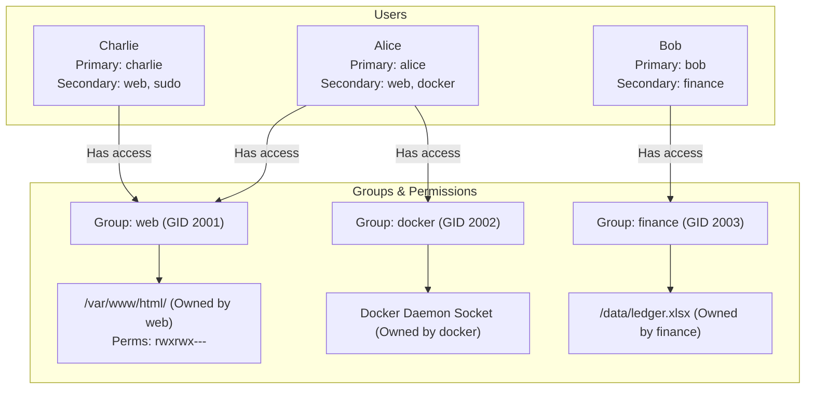
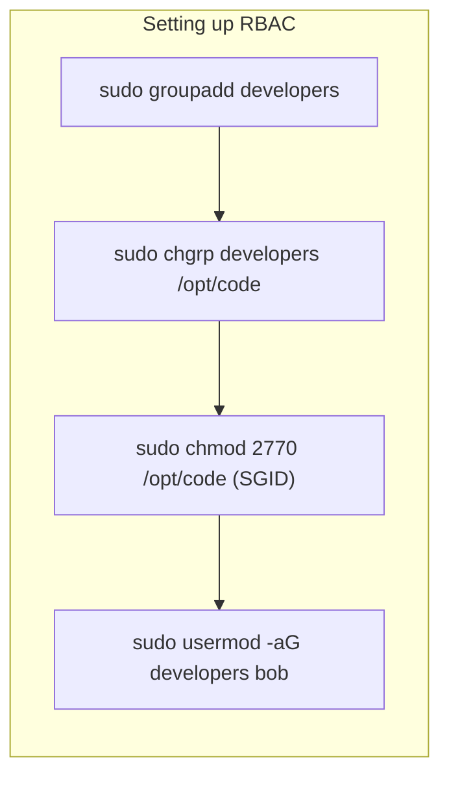
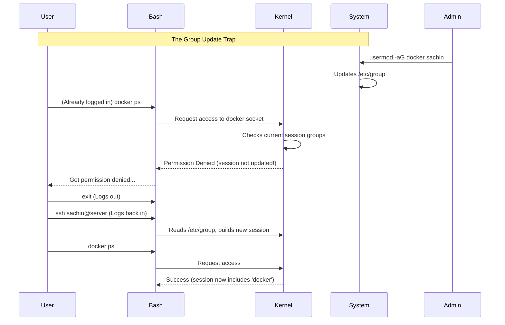

# CHAPTER 22 — GROUP ADMINISTRATION

---

## 1. Introduction

### Why This Topic Exists
Managing permissions on a user-by-user basis is impossible at scale. If 50 developers need access to the `/var/www/html` directory, setting permissions individually for all 50 people is a nightmare. Linux solves this with **Groups**. You assign permissions to a single Group, and then you add those 50 users to the Group.

### Why Linux Administrators Use It
System administrators use groups to manage Role-Based Access Control (RBAC). For example, creating a `wheel` or `sudo` group to define who is allowed to run administrator commands, a `docker` group to define who can manage containers, and a `finance` group to protect sensitive accounting directories.

### Why Companies Care About It
Efficiency and Security. When a new developer joins the company, the IT team shouldn't have to manually grant them access to 20 different servers and 100 different folders. Instead, they simply add the user to the `developers` group, and the user instantly inherits all the necessary access rights. When they leave the team, removing them from the group instantly revokes all those rights.

---

## 2. Learning Objectives

By the end of this chapter, you will be able to:
- Understand the `/etc/group` file structure.
- Distinguish between a user's Primary Group and Secondary (Supplementary) Groups.
- Create, modify, and delete groups (`groupadd`, `groupmod`, `groupdel`).
- Add and remove users from groups using `usermod -aG` and `gpasswd`.
- Understand the concept of User Private Groups (UPG).

---

## 3. Beginner-Friendly Explanation

Think of Linux Groups like corporate mailing lists or Microsoft Teams channels:
- **Primary Group (Your Department):** Every employee belongs to exactly one main department (e.g., HR). This is your Primary Group. If you create a new document on the shared drive, it defaults to belonging to HR.
- **Secondary Groups (Project Committees):** You might also be on the "Party Planning Committee" and the "Fire Wardens" team. These are Secondary Groups. Being in these groups grants you access to their respective folders and resources, even though you are primarily in HR.

In Linux, a user has exactly 1 Primary Group, but can be a member of up to 15 Secondary Groups (or more, depending on kernel configuration).

---

## 4. Core Theory

### 4.1 The `/etc/group` File
Linux stores group information in `/etc/group`.
Format: `group_name:password_placeholder:GID:user_list`
Example: `wheel:x:10:sachin,david`
1. **Group Name:** `wheel`
2. **Password:** `x` (Group passwords are a legacy feature and rarely used).
3. **GID:** `10`
4. **Members:** `sachin,david` (Comma-separated list of users who have this as a Secondary Group).

### 4.2 Primary vs Secondary Groups
- **Primary Group:** Defined in `/etc/passwd`. Every time a user creates a new file, the file's group ownership is set to the user's Primary Group.
- **Secondary (Supplementary) Groups:** Defined in `/etc/group`. These grant the user additional permissions for files owned by these groups.

### 4.3 User Private Groups (UPG)
Historically, Unix systems put all regular users into a single primary group called `users` (GID 100). This caused security issues. Modern Linux (RHEL, Ubuntu) uses UPG.
When you run `useradd sachin`, Linux automatically:
1. Creates a group named `sachin`.
2. Makes the `sachin` group the Primary Group for user `sachin`.
This allows for a more permissive default `umask` (0002) which makes collaboration using SGID directories much easier and more secure.

### 4.4 Group Management Commands
- **`groupadd`**: Creates a new group.
- **`groupmod`**: Changes group name or GID.
- **`groupdel`**: Deletes a group.
- **`usermod -aG`**: Appends a user to secondary groups.
- **`gpasswd`**: Administers group passwords and memberships.

---

## 5. Internal Working

When a user logs in, the login process reads `/etc/passwd` to find the Primary GID, and then scans `/etc/group` to build a list of all Secondary GIDs the user belongs to.
This list of GIDs is attached to the user's active session in the kernel.
Whenever the user tries to access a file, the kernel compares the file's GID against the user's entire list of GIDs. If there is a match, group permissions are granted.

**Crucial Note:** If you add a user to a group while they are logged in, **the kernel does not automatically update their active session**. The user must log out and log back in (or run `newgrp groupname`) for the new group membership to take effect.

---

## 6. Production Architecture



---

## 7. Command-by-Command Explanation

### 7.1 `groupadd finance`
- **Purpose:** Creates a new group named `finance` with an automatically assigned GID.

### 7.2 `groupadd -g 5000 audit`
- **Purpose:** Creates a new group and forces a specific GID (`5000`). Essential when mounting NFS shares where GIDs must match across multiple servers.

### 7.3 `usermod -aG docker sachin`
- **Purpose:** Adds user `sachin` to the `docker` group.
- **CRITICAL:** You MUST use the `-a` (append) flag. If you run `usermod -G docker sachin` (without `-a`), it will remove sachin from ALL other secondary groups and make him *only* a member of docker.

### 7.4 `gpasswd -d sachin docker`
- **Purpose:** Removes user `sachin` from the `docker` group.

### 7.5 `id sachin`
- **Purpose:** Displays the UID, Primary GID, and all Secondary GIDs for a user.

---

## 8. Syntax Breakdown

```bash
sudo usermod -a -G wheel,docker sachin
│    │       │  │  │            │
│    │       │  │  │            └── Target User
│    │       │  │  └─────────────── Comma-separated list of secondary groups
│    │       │  └────────────────── Secondary Groups flag
│    │       └───────────────────── Append flag (Crucial!)
│    └───────────────────────────── Command: Modify User
└────────────────────────────────── Superuser privilege
```

---

## 9. Parameter Explanation

| Command | Parameter | Description |
|:---|:---|:---|
| `groupadd` | `-g` | Assign specific GID |
| `groupmod` | `-n` | Rename a group (e.g., `groupmod -n newname oldname`) |
| `groupdel` | N/A | Delete group |
| `usermod` | `-aG` | **Append** to secondary groups (always use together) |
| `usermod` | `-g` | Change the user's Primary Group |
| `gpasswd` | `-a` | Add a single user to a group |
| `gpasswd` | `-d` | Delete a single user from a group |
| `id` | `-nG` | Print only the group names the user belongs to |

---

## 10. Sample Output Analysis

**Scenario:** Checking a developer's group memberships.
**Command:** `id sachin`

**Output:**
```text
uid=1000(sachin) gid=1000(sachin) groups=1000(sachin),10(wheel),994(docker),2001(webadmins)
```

**Analysis:**
- **uid=1000:** Sachin's User ID.
- **gid=1000:** Sachin's Primary Group (this is the UPG). When Sachin creates a file, it will be owned by group `sachin`.
- **groups=...:** Sachin's Secondary Groups. He has administrator rights (`wheel`), can manage containers (`docker`), and edit web files (`webadmins`).

---

## 11. Architecture Diagram



---

## 12. Workflow Diagram



---

## 13. Real Production Examples

### The Sudoers Group (Wheel)
On RHEL/CentOS systems, members of the `wheel` group are granted `sudo` access (the ability to run commands as root). If a new employee needs admin rights:
```bash
sudo usermod -aG wheel new_admin_user
```
*(On Ubuntu/Debian, the group is named `sudo` instead of `wheel`).*

### Shared Web Hosting
A server hosts websites for three different clients. The files must be kept strictly separated.
```bash
# Create specific groups
groupadd client_alpha
groupadd client_beta

# Assign developers to their respective clients
usermod -aG client_alpha dev1
usermod -aG client_beta dev2

# Lock down the directories
chown -R root:client_alpha /var/www/alpha
chmod 2770 /var/www/alpha
```

---

## 14. Common Mistakes

1. **Forgetting the `-a` flag** — This is the most common and disastrous mistake in user management. Running `usermod -G docker sachin` removes Sachin from the `wheel` group, revoking his admin access instantly. ALWAYS run `usermod -aG`.
2. **Expecting immediate group updates** — Adding a user to a group does not affect their current terminal session. They will swear it didn't work. Tell them to log out and log back in.
3. **Deleting a Primary Group** — You cannot run `groupdel sachin` if `sachin` is the primary group for a user. You must change the user's primary group first, or delete the user.

---

## 15. Best Practices

- Use Role-Based Access Control (RBAC). Do not assign permissions to users directly via ACLs unless absolutely necessary. Create a group (e.g., `db_admins`), assign permissions to the group, and add users to the group.
- Always use `-aG` when modifying groups.
- Standardise GIDs across your infrastructure using configuration management (Ansible/Puppet) to ensure NFS mounts and cluster storage permissions don't break.

---

## 16. Security Considerations

- Membership in groups like `wheel`, `sudo`, or `docker` is equivalent to having root access. Adding a user to the `docker` group allows them to spawn a container mapping the host's `/` directory, giving them instant, passwordless root access to the entire server. Guard these groups carefully.
- Audit `/etc/group` regularly to ensure terminated employees or compromised accounts have been removed from privileged groups.

---

## 17. Performance Considerations

- `/etc/group` operations are extremely fast. However, Linux kernels have a historical limit on the maximum number of secondary groups a user can belong to (often 16 or 32 for NFSv3/v4 compatibility). If a user is in 50 groups, file sharing over NFS may fail cryptically.

---

## 18. Troubleshooting Guide

| Symptom | Root Cause | Resolution |
|:---|:---|:---|
| User was added to group but gets "Permission denied" | Active session not updated | User must log out and log in again, or run `newgrp groupname` |
| Used `usermod -G` and lost sudo access | Forgot the `-a` (append) flag | Log in as root, run `usermod -aG wheel username` to restore |
| `groupdel: cannot remove the primary group of user` | Group is in use as a Primary Group | Change the user's primary group first: `usermod -g newgroup user` |
| Cannot mount NFS share correctly | GID mismatch between servers | Ensure `/etc/group` GIDs match exactly across all servers |

---

## 19. Practical Labs

**Lab 22.1:** Group Creation and Modification
```bash
sudo groupadd auditors
tail -1 /etc/group          # Verify creation
sudo groupmod -n compliance auditors
tail -1 /etc/group          # Verify rename
```

**Lab 22.2:** Adding Users (Safely)
```bash
# Assuming your user is sachin
sudo usermod -aG compliance sachin
id sachin                   # Verify membership
```

**Lab 22.3:** The Session Trap
```bash
sudo groupadd testgrp
sudo usermod -aG testgrp $(whoami)
id                          # Notice testgrp is MISSING
su - $(whoami)              # Simulate logout/login
id                          # Notice testgrp is now PRESENT
exit                        # Return to original session
```

---

## 20. Mini Project

Simulate setting up an IT department:
1. Create two groups: `sysadmins` and `netadmins`.
2. Create two users: `server_guy` and `router_guy` (without home directories to keep it clean: `useradd -M server_guy`).
3. Add both users to their respective primary roles (`usermod -aG`).
4. Now, the IT Director says `server_guy` needs to help with the routers. Add `server_guy` to the `netadmins` group WITHOUT removing him from `sysadmins`.
5. Verify `server_guy` is in both groups using the `id` command.

---

## 21. Assignments

1. Explain the difference between `usermod -G` and `usermod -aG`. What is the danger of the former?
2. Why doesn't a group membership change take effect immediately in your current terminal?
3. What is a User Private Group (UPG) and why does modern Linux use it?

---

## 22. Interview Questions

### Basic
1. **Q: How do you add an existing user to an existing group?**
   A: `usermod -aG groupname username` (The `-a` is for append, `-G` is for supplementary groups).

2. **Q: How do you check which groups a user belongs to?**
   A: Using the `id username` command or the `groups username` command.

### Intermediate
3. **Q: You added a developer to the `docker` group so they can run containers. They immediately run `docker ps` but get a "Permission denied" error regarding the docker socket. `id` shows they are in the group. What is wrong?**
   A: When a user logs in, the kernel attaches their group memberships to that specific terminal session. Modifying `/etc/group` does not retroactively update active sessions. The developer must log out and log back in to get a new session token that includes the `docker` group.

4. **Q: What is the difference between a Primary Group and a Secondary Group?**
   A: A user has exactly one Primary Group (defined in `/etc/passwd`). When the user creates a new file, the file's group ownership is automatically set to the user's Primary Group. Secondary Groups (defined in `/etc/group`) provide supplementary access; they allow the user to read/write files owned by those groups, but new files are not created under them by default.

### Scenario-Based
5. **Q: A junior admin was trying to add the user `bob` to the `marketing` group. They typed `usermod -G marketing bob`. Five minutes later, Bob calls the helpdesk saying he can no longer use `sudo` and lost access to the `finance` share. What happened and how do you fix it?**
   A: The junior admin forgot the `-a` (append) flag. Using `-G` without `-a` tells the system to make `marketing` the *only* secondary group for Bob, actively removing him from all other groups, including `wheel/sudo` and `finance`. To fix it, a root user must manually re-add Bob to all his previous groups: `usermod -aG wheel,finance bob`.

---

## 23. Chapter Summary and Quick Revision Notes

- Group data is stored in `/etc/group`.
- Users have 1 Primary Group (for file creation) and multiple Secondary Groups (for access rights).
- UPG (User Private Group) gives every user their own unique primary group by default.
- Always use `usermod -aG` to add users to groups. Never forget the `-a`.
- Group changes require the user to log out and log back in to take effect.
- The `wheel` (RHEL) or `sudo` (Ubuntu) group grants administrator privileges.

---

## 24. Cheat Sheet

| Command | Purpose |
|:---|:---|
| `groupadd mygroup` | Create a new group |
| `groupmod -n newname old`| Rename a group |
| `groupdel mygroup` | Delete a group |
| `usermod -aG group user` | Safely add user to secondary group |
| `gpasswd -d user group` | Remove user from secondary group |
| `id user` | Show user's UID and all GIDs |
| `newgrp group` | Apply group changes to current session without logging out |
