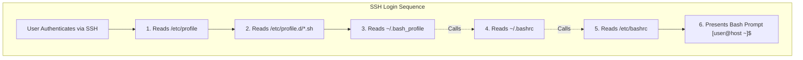
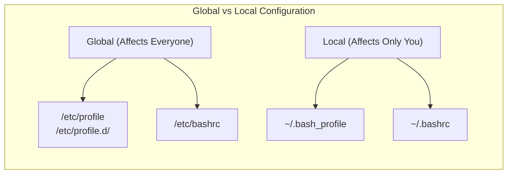
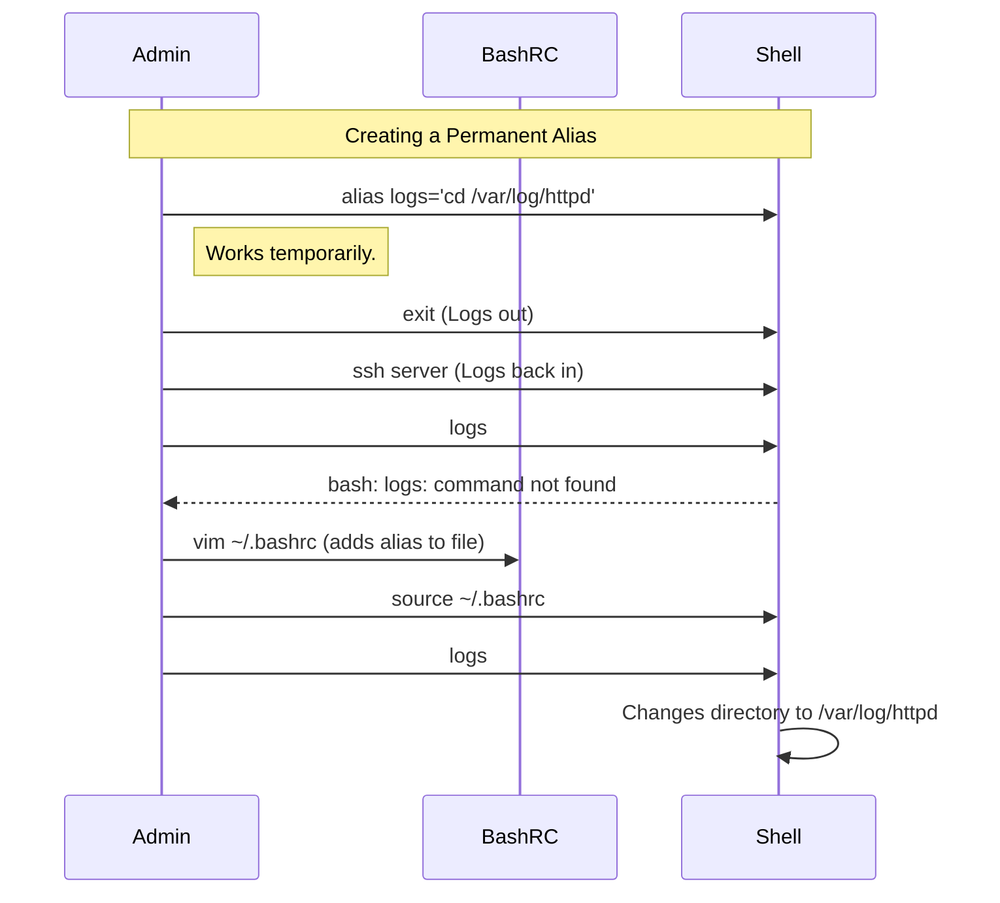

# CHAPTER 25 — USER PROFILES AND INITIALISATION

---

## 1. Introduction

### Why This Topic Exists
When a user logs into a Linux system, they are not presented with a blank slate. They have custom environment variables (like `$PATH`), command aliases (like `ll` for `ls -l`), and a formatted prompt. These settings are loaded dynamically during the login process by reading Profile Scripts. Understanding how these scripts execute, and in what order, is essential for configuring user environments correctly.

### Why Linux Administrators Use It
System administrators use initialization scripts to deploy company-wide standards. If a company develops a custom internal application installed in `/opt/company/bin`, the administrator modifies the global profile so that `/opt/company/bin` is automatically added to every user's `$PATH`. Without this, users would have to type the absolute path every time they run the app.

### Why Companies Care About It
Standardisation and Security. By controlling global initialization files, companies can enforce restrictive paths, set system-wide timeouts (`TMOUT` to log out idle users), and audit exactly what environmental configuration is applied to service accounts (like Oracle or PostgreSQL) to ensure they start reliably after a reboot.

---

## 2. Learning Objectives

By the end of this chapter, you will be able to:
- Differentiate between a Login Shell and a Non-Login Shell.
- Understand the execution order of global vs user-specific profile scripts.
- Configure global environment variables in `/etc/profile` and `/etc/profile.d/`.
- Configure user-specific variables and aliases in `~/.bash_profile` and `~/.bashrc`.
- Create and apply custom command aliases.

---

## 3. Beginner-Friendly Explanation

Think of User Profiles like getting ready for work:
- **Global Profile (`/etc/profile`):** The company handbook. Every single employee, regardless of department, must read this handbook when they walk in the door. It tells everyone the building hours and the emergency exits.
- **User Profile (`~/.bash_profile`):** Your personal desk setup. When you sit at your desk, you arrange your keyboard a certain way and put up pictures of your dog. Only you see this setup.
- **Login Shell vs Non-Login Shell:** 
  - *Login Shell:* Arriving at work for the first time in the morning. You go through the full security check (read the handbook, set up your desk).
  - *Non-Login Shell:* You went to the kitchen for coffee and came back to your desk. You don't need to read the company handbook again, you just pick up where you left off.

---

## 4. Core Theory

### 4.1 Login Shells vs Non-Login Shells
- **Login Shell:** The first shell you get when you authenticate via SSH, log in at a local console, or run `su - user`. The system reads the full stack of profile scripts.
- **Non-Login Shell:** Any shell started *after* you are already logged in (e.g., opening a new terminal tab in a GUI, or running `su user` without the dash). It skips the heavy profile scripts and only reads the lightweight `bashrc` files.

### 4.2 The Bash Execution Order (Login Shell)
When you log in via SSH (Bash shell), scripts execute in this exact sequence:
1. `/etc/profile` (Global configuration for all users)
2. Files inside `/etc/profile.d/*.sh` (Modular global configs)
3. `~/.bash_profile` (User-specific login config)
4. `~/.bashrc` (User-specific non-login config, usually sourced by `.bash_profile`)
5. `/etc/bashrc` (Global non-login config, usually sourced by `.bashrc`)

### 4.3 The Bash Execution Order (Non-Login Shell)
When you open a new terminal window:
1. `~/.bashrc` (User-specific aliases and functions)
2. `/etc/bashrc` (Global aliases and functions)

### 4.4 Aliases
An alias is a custom shortcut for a longer command.
- **Temporary (Current session):** `alias ll='ls -la'`
- **Permanent:** Must be added to `~/.bashrc`.
- **View all aliases:** `alias`
- **Remove alias:** `unalias ll`

### 4.5 The `$PATH` Variable
The `$PATH` variable is a colon-separated list of directories the shell searches when you type a command. If a command is not in these directories, you get "command not found". Profiles are primarily used to modify the `$PATH`.

---

## 5. Internal Working

### "Sourcing" a File
If you edit `~/.bashrc` and save it, the changes do not take effect immediately because the shell read that file *when it started*. To apply the changes without logging out, you must use the `source` command (or the `.` operator).
- `source ~/.bashrc`
This tells the current shell process to read the file and execute its contents directly in the current environment space, rather than spawning a subshell.

---

## 6. Production Architecture



---

## 7. Command-by-Command Explanation

### 7.1 `echo $PATH`
- **Purpose:** Displays your current path.
- **Example Output:** `/usr/local/bin:/usr/bin:/usr/local/sbin:/usr/sbin:/home/sachin/.local/bin:/home/sachin/bin`

### 7.2 `export PATH=$PATH:/opt/custom/bin`
- **Purpose:** Appends `/opt/custom/bin` to the existing `$PATH` for the current session.

### 7.3 `alias update='sudo dnf update -y'`
- **Purpose:** Creates a shortcut so typing `update` runs the full system update command.

### 7.4 `source ~/.bash_profile`
- **Purpose:** Reloads the profile script into the current shell session to apply new changes immediately.

---

## 8. Syntax Breakdown

```bash
export TMOUT=600
│      │     │
│      │     └── Value (600 seconds = 10 minutes)
│      └──────── Variable Name (Time Out)
└─────────────── Command: Make variable available to child processes
```
*(If you place this in `/etc/profile.d/timeout.sh`, every user will be automatically logged out after 10 minutes of inactivity).*

---

## 9. Parameter Explanation

*N/A - This topic is conceptually focused on configuration files rather than specific command parameters.*

---

## 10. Sample Output Analysis

**Scenario:** We want to permanently add a directory to our path.
**File:** `~/.bash_profile`

**Contents:**
```bash
# .bash_profile

# Get the aliases and functions
if [ -f ~/.bashrc ]; then
        . ~/.bashrc
fi

# User specific environment and startup programs
PATH=$PATH:$HOME/.local/bin:$HOME/bin:/opt/custom/bin
export PATH
```

**Analysis:**
- The `if [ -f ~/.bashrc ]; then . ~/.bashrc; fi` block is why `~/.bashrc` is executed during a login shell. The `.bash_profile` explicitly checks if `bashrc` exists, and if so, sources (`.`) it.
- The `PATH` line takes the existing `$PATH`, appends three user-specific directories to the end of it, and `export`s it so it is available to any scripts run by the user.

---

## 11. Architecture Diagram



---

## 12. Workflow Diagram



---

## 13. Real Production Examples

### Deploying Java Enterprise Edition
When a company installs Java, the system doesn't know where it is. Hundreds of applications require the `$JAVA_HOME` variable to function. The admin creates `/etc/profile.d/java.sh`:
```bash
export JAVA_HOME=/usr/lib/jvm/java-17-openjdk
export PATH=$JAVA_HOME/bin:$PATH
```
When *any* user or service account logs in, this script runs, and Java is immediately available system-wide.

### Securing Root Environments
To prevent administrators from accidentally making a mistake in production, the root user's `~/.bashrc` often contains safety aliases:
```bash
alias rm='rm -i'
alias cp='cp -i'
alias mv='mv -i'
```
This forces the system to prompt for confirmation (`-i`) before deleting or overwriting files, preventing catastrophic typos.

---

## 14. Common Mistakes

1. **Editing `/etc/profile` directly** — During OS upgrades, the package manager may overwrite `/etc/profile`, deleting your custom paths. Always place global configurations in individual files inside `/etc/profile.d/` (e.g., `/etc/profile.d/custom_app.sh`).
2. **Breaking the `$PATH`** — A junior admin writes `export PATH=/opt/app/bin` instead of `export PATH=$PATH:/opt/app/bin`. This overwrites the entire path, meaning basic commands like `ls`, `cat`, and `vi` will return "command not found".
3. **Putting Aliases in `.bash_profile`** — Aliases should go in `.bashrc`. If placed in `.bash_profile`, they will not be available when you open a non-login shell (like opening a new tab in your terminal emulator).

---

## 15. Best Practices

- Global environment variables: `/etc/profile.d/`
- Personal environment variables: `~/.bash_profile`
- Personal aliases and functions: `~/.bashrc`
- Always use `$PATH:` when appending to paths to retain existing paths.
- Enforce idle session timeouts globally via `TMOUT` in `/etc/profile.d/` for security compliance.

---

## 16. Security Considerations

- The `$PATH` is searched from left to right. If `/tmp` is placed at the beginning of the `$PATH` (`export PATH=/tmp:$PATH`), an attacker can place a malicious script named `ls` in `/tmp`. When root types `ls`, the malicious script runs instead of the real `/usr/bin/ls`. Never put writable directories at the start of the `$PATH`.
- **"." in PATH:** Never include `.` (current directory) in the path, especially for root.

---

## 17. Performance Considerations

- Profile scripts are executed sequentially during login. If an admin puts a command that takes 5 seconds to run (like querying a remote database) inside `/etc/profile`, every single user login will be delayed by 5 seconds. Keep profile scripts extremely lightweight.

---

## 18. Troubleshooting Guide

| Symptom | Root Cause | Resolution |
|:---|:---|:---|
| Basic commands (`ls`, `cat`) return "command not found" | `$PATH` was overwritten | Run `export PATH=/usr/local/bin:/usr/bin:/usr/local/sbin:/usr/sbin` to recover, then fix the profile script. |
| Added alias to `.bashrc` but it doesn't work | File not re-read | Run `source ~/.bashrc` |
| `su user` doesn't load correct `$PATH` | It is a non-login shell | Use `su - user` to trigger a full login shell |

---

## 19. Practical Labs

**Lab 25.1:** Modifying the Path
```bash
mkdir ~/scripts
touch ~/scripts/hello.sh
chmod +x ~/scripts/hello.sh
echo 'echo "Hello World"' > ~/scripts/hello.sh
hello.sh                # Fails (not in path)
export PATH=$PATH:~/scripts
hello.sh                # Succeeds
```

**Lab 25.2:** Permanent Aliases
```bash
echo "alias c='clear'" >> ~/.bashrc
source ~/.bashrc
c                       # Screen clears
```

**Lab 25.3:** Global Profile drop-in
```bash
sudo bash -c 'echo "export CORP_SERVER=192.168.1.100" > /etc/profile.d/corp.sh'
# Log out completely and log back in
echo $CORP_SERVER       # Outputs 192.168.1.100
```

---

## 20. Mini Project

Build a hardened administrator profile.
1. Log in as your normal user.
2. Edit your `~/.bashrc` to include protective aliases:
   `alias rm='rm -i'`
   `alias chown='chown -c'`
   `alias chmod='chmod -c'`
3. Edit your `~/.bash_profile` to enforce a 5-minute timeout:
   `export TMOUT=300`
4. Apply the changes (`source`).
5. Verify the aliases work by typing `alias`.
6. Wait 5 minutes to verify the shell auto-terminates.

---

## 21. Assignments

1. What is the execution order of profile scripts for a Login Shell?
2. Why is it recommended to use `/etc/profile.d/*.sh` instead of editing `/etc/profile` directly?
3. What is the command to apply changes made to `~/.bashrc` without logging out?

---

## 22. Interview Questions

### Basic
1. **Q: What is the difference between `~/.bash_profile` and `~/.bashrc`?**
   A: `~/.bash_profile` is executed only once, during a login shell, and is used to set environment variables like `$PATH`. `~/.bashrc` is executed for every non-login shell (like opening a new terminal tab) and is used for setting aliases and custom functions.

2. **Q: How do you check your current PATH?**
   A: `echo $PATH`

### Intermediate
3. **Q: You wrote a script and placed it in `/opt/app/bin/start.sh`. You want users to be able to just type `start.sh` from anywhere to run it. How do you accomplish this globally?**
   A: I would create a script in `/etc/profile.d/app.sh` containing the line `export PATH=$PATH:/opt/app/bin`. This will append the directory to every user's path the next time they log in.

4. **Q: You ran `su oracle` to switch to a database account, but when you type database commands, you get "command not found". If you log in via SSH directly as oracle, it works fine. What caused this?**
   A: Running `su oracle` creates a non-login shell, which does not execute `~/.bash_profile` where the Oracle `$PATH` variables are defined. You must run `su - oracle` to create a login shell and load the correct environment.

### Scenario-Based
5. **Q: A junior admin tried to add Java to their path by editing `~/.bash_profile` and adding `export PATH=/opt/java/bin`. After logging out and back in, they are calling you in a panic because they can't even run `ls` or `vi` anymore. What happened, and how do you fix it?**
   A: They accidentally overwrote the entire `$PATH` variable instead of appending to it. Because `/usr/bin` is no longer in the path, standard commands fail. To fix it, I would have them type the absolute path `/usr/bin/vi ~/.bash_profile`, change the line to `export PATH=$PATH:/opt/java/bin`, save the file, and log out/log back in (or run `export PATH=/usr/bin:/usr/local/bin` temporarily in the shell).

---

## 23. Chapter Summary and Quick Revision Notes

- Login shells execute `profile` scripts. Non-login shells execute `rc` scripts.
- `/etc/` scripts are Global. `~/.bash` scripts are Local (User-specific).
- Best practice for global variables: Add `.sh` files to `/etc/profile.d/`.
- Aliases go in `~/.bashrc`.
- Environment variables (`$PATH`) go in `~/.bash_profile`.
- Use `source filename` to apply changes instantly.
- Always use `$PATH:` when adding to paths to prevent breaking the system.

---

## 24. Cheat Sheet

| File / Command | Purpose |
|:---|:---|
| `/etc/profile` | Global Login Script (do not edit) |
| `/etc/profile.d/*.sh` | Global modular drop-in scripts |
| `~/.bash_profile` | User Login Script (Environment vars) |
| `~/.bashrc` | User Non-Login Script (Aliases) |
| `export PATH=$PATH:/dir` | Append `/dir` to PATH |
| `alias name='cmd'` | Create a shortcut alias |
| `source ~/.bashrc` | Apply changes to current session |
| `su - user` | Switch user with a Login Shell |
