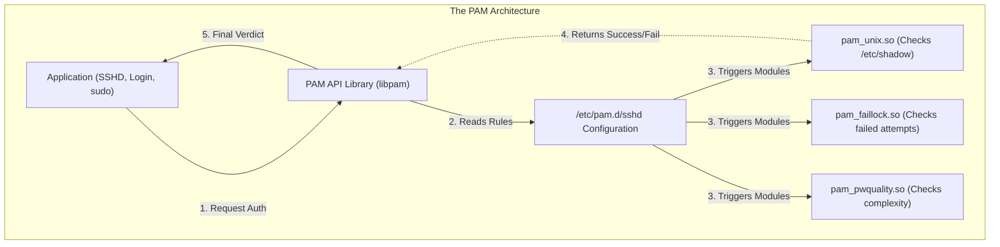
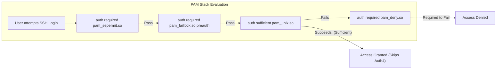
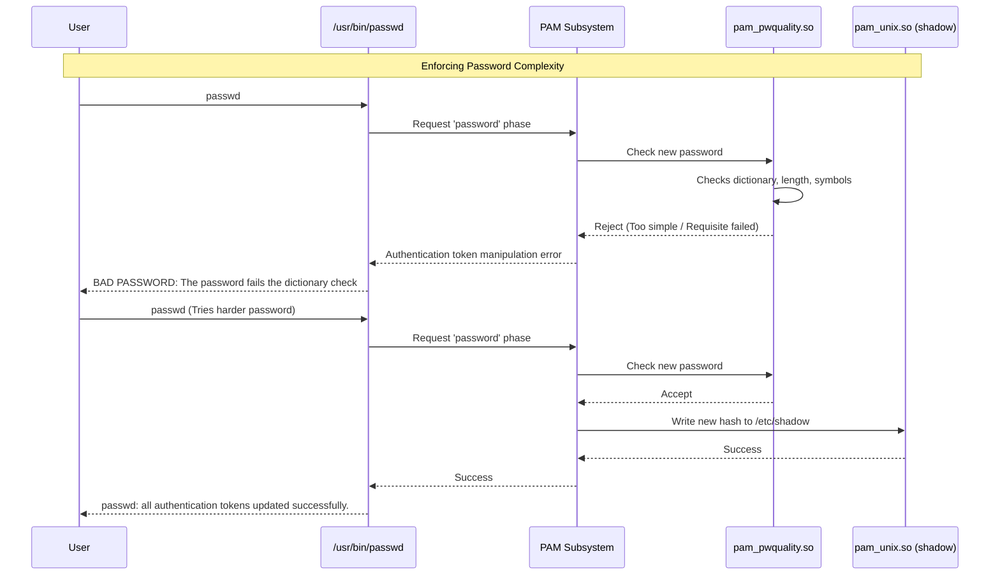

# CHAPTER 26 — PAM (PLUGGABLE AUTHENTICATION MODULES) FUNDAMENTALS

---

## 1. Introduction

### Why This Topic Exists
Historically, if an application (like FTP, SSH, or a GUI login screen) needed to verify a user's password, the application developer had to write custom code to read `/etc/shadow` and hash the password. This was insecure, inflexible, and unscalable. PAM (Pluggable Authentication Modules) was introduced to solve this. PAM acts as a middleman. Applications now simply ask PAM: "Is this user allowed in?" and PAM handles all the complex logic of checking passwords, biometric scanners, or central corporate directories (like Active Directory).

### Why Linux Administrators Use It
Administrators use PAM to enforce centralized security policies without modifying individual applications. If a company policy states: "Passwords must be at least 14 characters, contain a symbol, and users are locked out after 3 failed login attempts", the administrator configures this once in PAM. Instantly, SSH, FTP, console logins, and GUI logins all enforce this new policy.

### Why Companies Care About It
Enterprise Identity Management (SSO, MFA). When a company uses Duo Security or Google Authenticator for Multi-Factor Authentication, or connects Linux servers to Microsoft Active Directory via LDAP, it is entirely powered by PAM. Understanding PAM is the gateway to integrating Linux into complex, enterprise-wide security infrastructures.

---

## 2. Learning Objectives

By the end of this chapter, you will be able to:
- Understand the architecture of PAM and how applications interact with it.
- Navigate the `/etc/pam.d/` directory structure.
- Understand the 4 PAM Management Groups (auth, account, password, session).
- Understand PAM Control Flags (required, requisite, sufficient, optional).
- Configure a basic password complexity policy (`pam_pwquality`).
- Configure an account lockout policy for failed logins (`pam_faillock`).

---

## 3. Beginner-Friendly Explanation

Think of PAM like the front desk security at a high-tech corporate building.

- **The Application (e.g., SSH):** The door to a specific office. The door doesn't know how to verify IDs. It just asks the front desk: "Can Alice come in?"
- **PAM (The Front Desk):** Takes the request and runs it through a checklist (The PAM Configuration).
  - *Check 1 (Auth):* "Alice, show me your ID and type your password."
  - *Check 2 (Account):* "Let me check the database... Ah, Alice's contract expired yesterday. Access Denied."
  - *Check 3 (Password):* "Alice, your password is 90 days old. You must change it before going inside. The new password must have 14 characters."
  - *Check 4 (Session):* "Alice is allowed in. I will now log her entry in the security book and assign her a guest badge."

If PAM approves all the checks, it tells the door (SSH) to unlock.

---

## 4. Core Theory

### 4.1 The `/etc/pam.d/` Directory
Every PAM-aware application has a configuration file in this directory.
- `/etc/pam.d/sshd` (For SSH logins)
- `/etc/pam.d/login` (For local console logins)
- `/etc/pam.d/su` (For the `su` command)
- `/etc/pam.d/system-auth` (The master file that other files "include", so you only have to configure policies once).

### 4.2 The Four Management Groups (Types)
Every rule in a PAM configuration file falls into one of four categories:
1. **auth:** Verifies the user is who they claim to be (e.g., prompting for a password, checking a fingerprint, or MFA token).
2. **account:** Checks if the user is *allowed* to log in right now (e.g., Is the account locked? Is it past expiration? Is it outside allowed working hours?).
3. **password:** Handles updating the authentication token (e.g., enforcing password length and complexity when a user runs `passwd`).
4. **session:** Handles tasks before and after the login (e.g., mounting a user's home directory, logging the login event to syslog, setting limits).

### 4.3 PAM Control Flags
When PAM checks a rule, the Control Flag determines what happens if the rule succeeds or fails.
- **required:** Must succeed. If it fails, PAM will still evaluate the rest of the rules (to hide exactly *which* check failed from attackers), but ultimately deny access.
- **requisite:** Must succeed. If it fails, PAM denies access *immediately* without evaluating further rules.
- **sufficient:** If it succeeds, PAM immediately grants access (ignoring subsequent `required` rules), provided no previous `required` rules failed.
- **optional:** Doesn't strictly matter for approval, usually used for logging or mounting drives.

---

## 5. Internal Working

### The Stack Execution
When you run `su - sachin`:
1. `su` reads `/etc/pam.d/su`.
2. It processes the `auth` stack line by line.
3. It might hit a line like: `auth include system-auth`. This tells it to jump over to `/etc/pam.d/system-auth` and run all the `auth` rules there.
4. One of those rules is `auth required pam_unix.so`, which actually checks the password hash in `/etc/shadow`.
5. If successful, it moves to the `account` stack to ensure the account isn't expired.
6. If successful, it runs the `session` stack to open the environment, and `su` grants the shell.

---

## 6. Production Architecture



---

## 7. Command-by-Command Explanation

*(PAM is primarily configured via files, not commands, but there are a few utilities to interact with PAM modules).*

### 7.1 `faillock` (or `pam_tally2` on older systems)
- **Purpose:** Displays or resets the tally of failed login attempts for users (managed by the `pam_faillock.so` module).
- **Example:** `faillock --user sachin --reset` (Unlocks Sachin's account after he triggered the brute-force lockout).

### 7.2 `authconfig` or `authselect`
- **Purpose:** Modern RHEL/CentOS systems use `authselect` to automatically generate the complex `/etc/pam.d/system-auth` files so administrators don't have to write the PAM syntax manually.
- **Example:** `authselect select sssd` (Configures PAM to use Active Directory/LDAP for authentication).

---

## 8. Syntax Breakdown

```text
password    requisite     pam_pwquality.so retry=3 minlen=14
│           │             │                │
│           │             │                └── Module arguments (3 tries, min 14 chars)
│           │             └─────────────────── The PAM module to execute
│           └───────────────────────────────── Control Flag (Fail immediately if not met)
└───────────────────────────────────────────── Management Group (Password change phase)
```

---

## 9. Parameter Explanation

| PAM Module | Primary Purpose |
|:---|:---|
| `pam_unix.so` | The core module. Checks `/etc/shadow` for passwords and aging. |
| `pam_deny.so` | Unconditionally denies access (used as a catch-all at the end of lists). |
| `pam_permit.so` | Unconditionally allows access. |
| `pam_wheel.so` | Restricts `su` access to members of the `wheel` group. |
| `pam_faillock.so` | Locks accounts after N failed login attempts to stop brute-forcing. |
| `pam_pwquality.so` | Enforces password complexity (length, symbols, dictionary checks). |
| `pam_limits.so` | Enforces limits on CPU/RAM usage per user (reads `/etc/security/limits.conf`). |

---

## 10. Sample Output Analysis

**Scenario:** A user is locked out due to typing their password incorrectly 5 times.
**Command:** `faillock --user david`

**Output:**
```text
david:
When                Type  Source                                           Valid
2026-07-26 10:00:01 TTY   /dev/tty1                                        V
2026-07-26 10:00:15 TTY   /dev/tty1                                        V
2026-07-26 10:00:42 TTY   /dev/tty1                                        V
```

**Analysis:**
- The `pam_faillock` module has recorded 3 invalid (`V`) login attempts from the local console (`tty1`).
- If the PAM policy is configured to lock accounts after 3 failures, David is now locked out for a predefined time (e.g., 15 minutes).
- To fix it, the admin runs `faillock --user david --reset`.

---

## 11. Architecture Diagram



---

## 12. Workflow Diagram



---

## 13. Real Production Examples

### Securing the `su` Command
By default, any user can type `su - root` and try to guess the root password. In high-security environments, administrators use PAM to restrict this so *only* members of the `wheel` group can even attempt to run the command.
They edit `/etc/pam.d/su` and uncomment the following line:
```text
auth required pam_wheel.so use_uid
```
If a normal user types `su -`, they are instantly rejected without even being asked for a password.

### Adding Multi-Factor Authentication (MFA)
A company requires Google Authenticator for all SSH logins.
The admin installs the PAM module (`dnf install google-authenticator`).
They edit `/etc/pam.d/sshd` and add:
```text
auth required pam_google_authenticator.so
```
Now, after PAM checks the password (`pam_unix`), it executes `pam_google_authenticator`, forcing the user to type their 6-digit phone code before granting access.

---

## 14. Common Mistakes

1. **Locking yourself out** — Editing `/etc/pam.d/system-auth` manually and making a syntax error. Suddenly, no one can log in via SSH, console, or `su`. **Always keep a root terminal open** in another window before modifying PAM files, so you can revert the change if logins break.
2. **Misunderstanding `requisite` vs `required`** — Using `requisite` for a password check means the system fails *immediately*. Attackers can use this timing difference to determine if a username exists on the system. `required` forces the system to evaluate the whole stack, delaying the response and confusing the attacker.
3. **Editing files managed by `authselect`** — On modern RHEL/CentOS, if you manually edit `/etc/pam.d/system-auth`, the `authselect` tool will overwrite and delete your changes the next time the system is updated. Use the `authselect` command to apply custom PAM profiles instead.

---

## 15. Best Practices

- **Never edit PAM files manually in production** unless absolutely necessary. Use higher-level tools like `authselect` (RHEL) or `pam-auth-update` (Ubuntu) to manage configurations safely.
- Always implement `pam_faillock` (or `pam_tally2`) to defend against SSH brute-force attacks.
- Centralize your password complexity requirements in `/etc/security/pwquality.conf` rather than hardcoding them into the PAM files directly.

---

## 16. Security Considerations

- **LDAP/Active Directory Integration:** When Linux authenticates against Microsoft Active Directory, it uses `pam_sss.so` (System Security Services Daemon). If the network goes down, users can't log in. SSSD caches credentials securely locally, so PAM can authenticate users even if the domain controller is offline.

---

## 17. Performance Considerations

- PAM modules execute sequentially. If you add `pam_ldap.so` and the LDAP server is slow to respond, every single SSH login, `sudo` execution, or `su` command will hang for several seconds while PAM waits for a network timeout. Ensure external authentication sources are highly available.

---

## 18. Troubleshooting Guide

| Symptom | Root Cause | Resolution |
|:---|:---|:---|
| All logins suddenly fail (SSH, console) | Corrupt PAM configuration | Use an active root session to fix the file, or boot into Rescue Mode to fix `/etc/pam.d/system-auth`. |
| Correct password rejected by `sudo` | Account locked by `faillock` | Run `faillock --user name --reset` from a root account. |
| Application (like ProFTPd) ignores PAM rules | App is not PAM-aware or misconfigured | Check if `/etc/pam.d/proftpd` exists and the app config is set to use PAM. |

---

## 19. Practical Labs

**Lab 26.1:** Exploring the Configuration
```bash
ls -l /etc/pam.d/
cat /etc/pam.d/su
# Look for the pam_wheel.so line (usually commented out with #)
```

**Lab 26.2:** Password Complexity Policy
```bash
cat /etc/security/pwquality.conf
# Look for settings like minlen, dcredit (digits), ucredit (uppercase)
# These settings are read by the pam_pwquality.so module.
```

**Lab 26.3:** Simulating a lockout (If `faillock` is installed)
1. Open a second terminal. Attempt to SSH into your server with your username, but intentionally type the WRONG password 4 times.
2. In your main (root) terminal, run `faillock --user your_username`. Observe the failures.
3. Reset it: `faillock --user your_username --reset`.

---

## 20. Mini Project

Investigate your system's SSH authentication stack.
1. Run `cat /etc/pam.d/sshd`.
2. Notice that it heavily uses the `include` directive (e.g., `auth include password-auth`).
3. Run `cat /etc/pam.d/password-auth`.
4. Trace the execution:
   - Identify which module actually checks your password (`pam_unix.so`).
   - Identify which module checks if your account is locked due to brute force (`pam_faillock.so`).
   - Identify which module records your login in `/var/log/secure` or `/var/log/wtmp` (usually in the `session` block, e.g., `pam_unix.so` or `pam_lastlog.so`).
5. This exercise demonstrates how PAM acts as a modular programming language for security.

---

## 21. Assignments

1. What are the four PAM Management Groups?
2. What is the difference between the `required` and `requisite` control flags?
3. If you want to enforce a policy that passwords must contain at least one number, which PAM module and configuration file are involved?

---

## 22. Interview Questions

### Basic
1. **Q: What does PAM stand for, and why do Linux systems use it?**
   A: Pluggable Authentication Modules. It separates the authentication logic from the application. Instead of every app (SSH, FTP, GUI) writing its own password-checking code, they hand the request to PAM, allowing administrators to centrally manage security policies (like MFA or Active Directory integration) across all applications.

2. **Q: Where are the PAM configuration files located?**
   A: `/etc/pam.d/`

### Intermediate
3. **Q: You want to restrict the `su` command so that only administrators can use it. How do you do this using PAM?**
   A: I would edit `/etc/pam.d/su` and uncomment or add the line `auth required pam_wheel.so use_uid`. This ensures that only members of the `wheel` (or `sudo`) group can successfully authenticate through the `su` command.

4. **Q: What does the `sufficient` control flag do?**
   A: If a module marked as `sufficient` succeeds, PAM immediately grants access and ignores any subsequent `required` modules in the stack, provided that no prior `required` modules have failed. It is often used for biometric or smartcard logins (if the fingerprint works, don't bother asking for a password).

### Scenario-Based
5. **Q: You edit `/etc/pam.d/system-auth` to add a new security module. Immediately, all SSH connections and local terminal logins to the server are rejected, even with the correct password. You still have one active root SSH session open. What is your immediate next step, and why did this happen?**
   A: My immediate next step is to use the active root session to revert the changes to `/etc/pam.d/system-auth` or restore it from a backup. If I close that session, the server will be permanently inaccessible over the network. The failure likely occurred because I made a syntax error in the file, or the new PAM module (`.so` file) I referenced does not exist or lacks correct permissions, causing the entire `auth` stack to fail and deny access.

---

## 23. Chapter Summary and Quick Revision Notes

- **PAM** centralizes authentication. Apps ask PAM; PAM checks the rules.
- **Config location:** `/etc/pam.d/`
- **4 Types:**
  - `auth`: Verify identity (passwords, MFA).
  - `account`: Verify access rights (expired, locked).
  - `password`: Handle password updates (complexity).
  - `session`: Pre/post-login setup (logging, mounting).
- **Control Flags:**
  - `required`: Must pass. Failure is deferred to the end.
  - `requisite`: Must pass. Failure is immediate.
  - `sufficient`: If passes, immediate success.
- **DANGER:** Never test PAM changes without a backup root session open.

---

## 24. Cheat Sheet

| Module | Purpose |
|:---|:---|
| `pam_unix.so` | Standard `/etc/shadow` password check |
| `pam_pwquality.so`| Password complexity rules (length, symbols) |
| `pam_faillock.so` | Brute-force protection (Account lockout) |
| `pam_wheel.so` | Restrict access to `wheel` group members |
| `pam_deny.so` | Catch-all to deny access |
| `faillock --user X --reset` | Unlock a user locked by `pam_faillock` |
| `authselect` | RHEL tool to safely manage PAM profiles |
