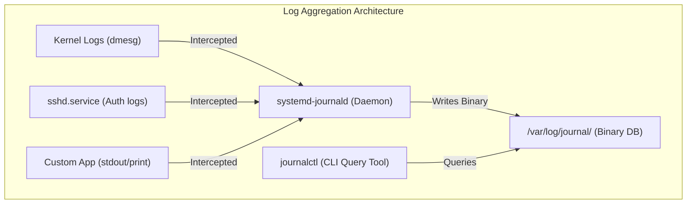
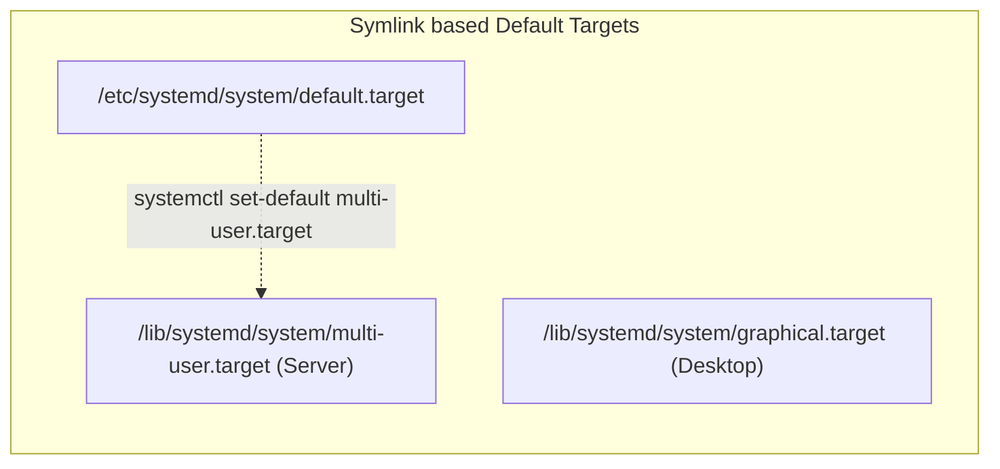
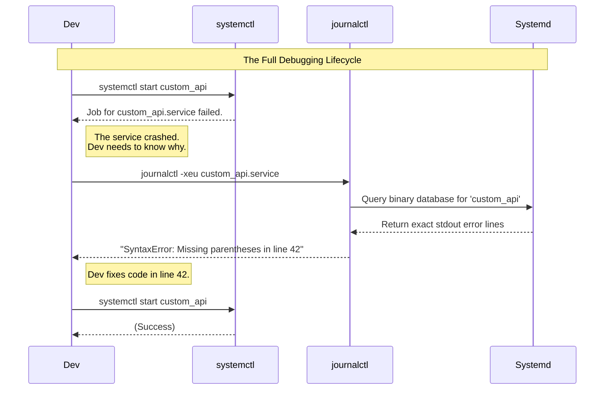

# CHAPTER 30 — SYSTEMD TARGETS (RUNLEVELS) AND JOURNALCTL

---

## 1. Introduction

### Why This Topic Exists
When a server boots, does it load the Graphical Desktop environment? Or does it stay at a black-and-white text terminal? Does it even load the network? The OS determines this based on its "Target" state (historically known as Runlevels). Furthermore, as all these services start, they generate thousands of logs. Systemd consolidates all these logs into a single, high-performance binary database managed by the `journald` daemon.

### Why Linux Administrators Use It
Administrators change Targets to troubleshoot servers. If a bad graphics driver causes the server to crash during boot, the administrator intervenes in the bootloader (GRUB) to force the system to boot into the "Rescue Target" (no GUI, no network, root access only) to fix the driver. Once fixed, they rely entirely on `journalctl` to search through millions of log lines instantly to find the exact millisecond the crash occurred.

### Why Companies Care About It
Server efficiency and auditing. Production web and database servers should **never** boot into a Graphical User Interface (GUI). GUIs consume gigabytes of RAM and CPU cycles that should be dedicated to serving customers. Setting the correct Default Target ensures resources are not wasted. Meanwhile, the `journald` database ensures tamper-resistant, highly structured logging, which is mandatory for security incident investigations.

---

## 2. Learning Objectives

By the end of this chapter, you will be able to:
- Map legacy SysVinit Runlevels (0-6) to modern systemd Targets.
- View and change the default boot target (`systemctl set-default`).
- Switch targets on the fly without rebooting (`systemctl isolate`).
- Query the systemd journal using `journalctl`.
- Filter logs by time, specific services, and priority levels.
- Configure persistent journaling across reboots.

---

## 3. Beginner-Friendly Explanation

**Targets:** Think of a building with different operational modes:
- **Lockdown Mode (Rescue Target):** Only the building manager is allowed in. No guests, no electricity, no elevators. Used for emergency repairs.
- **Normal Operations (Multi-User Target):** The doors are open, electricity is on, and employees are working. (Standard Server).
- **Gala Event Mode (Graphical Target):** Normal operations PLUS decorative lighting, music, and decorations. (Desktop computer with a GUI).
`systemctl isolate` is the switch that changes the building from one mode to another instantly.

**Journalctl:** Think of the old logging system (`/var/log/messages`) as a giant, messy notebook where everyone scribbles their notes. Finding something takes forever. `journalctl` is a highly organized, digital database. You can instantly query it: "Show me only the notes written by the Apache Chef, between 2 PM and 3 PM yesterday, that were marked as 'Critical'."

---

## 4. Core Theory

### 4.1 Systemd Targets vs Legacy Runlevels
Legacy Linux used Runlevels (0 through 6) to define system states. Systemd uses `.target` units. For backward compatibility, systemd aliases the old numbers to the new targets.

| Legacy Runlevel | Systemd Target | Description |
|:---|:---|:---|
| `0` | `poweroff.target` | Shuts down the system |
| `1` (or `s`) | `rescue.target` | Single-user mode (Local root only, no network) |
| `2`, `3`, `4` | `multi-user.target` | Standard CLI Server mode (Network + Multi-user) |
| `5` | `graphical.target` | Multi-user + Graphical Desktop Environment (GUI) |
| `6` | `reboot.target` | Reboots the system |

### 4.2 Switching Targets (`isolate`)
You can switch the state of a running system instantly without rebooting using `systemctl isolate <target>`.
For example, if you are in a GUI (`graphical.target`), running `systemctl isolate multi-user.target` will immediately kill the desktop environment and drop you into a text-only console, freeing up RAM.

### 4.3 The systemd Journal
Unlike traditional text logs managed by `rsyslog`, the systemd `journald` daemon collects logs from the kernel, initrd, services, and stdout/stderr of all processes, storing them in a structured binary format.
Because it is binary, you **cannot** use `cat` or `grep` on the raw log files in `/var/log/journal/`. You **must** use the `journalctl` command to read them.

### 4.4 Persistent vs Volatile Journals
Historically (especially on Ubuntu), the journal was stored in RAM (`/run/log/journal/`). If the server rebooted, all logs were lost! Modern RHEL/CentOS systems configure the journal to be persistent by default, storing it on the hard drive at `/var/log/journal/`.

---

## 5. Internal Working

### How `journald` collects stdout
In traditional Linux, if a developer wrote a Python script containing `print("Error")`, that text just printed to the screen and vanished. To save it, the admin had to redirect it: `python script.py >> /var/log/app.log`.
In systemd, if a service unit executes that Python script, systemd automatically intercepts the `print()` statement (stdout/stderr) and injects it directly into the journal database, permanently tagging it with the Python script's PID, UID, and Service Name. This completely eliminates the need for applications to manage their own log files.

---

## 6. Production Architecture



---

## 7. Command-by-Command Explanation

### 7.1 `systemctl get-default`
- **Purpose:** Prints the target that the system will boot into upon the next restart.

### 7.2 `systemctl set-default multi-user.target`
- **Purpose:** Changes the default boot target. (Under the hood, it deletes and recreates a symlink at `/etc/systemd/system/default.target`).

### 7.3 `journalctl -u sshd.service`
- **Purpose:** Filters the massive database to show *only* the logs generated by the SSH daemon. (The `-u` stands for Unit).

### 7.4 `journalctl --since "1 hour ago"`
- **Purpose:** Filters logs by time. Accepts human-readable strings or specific dates (`"2026-07-26 10:00:00"`).

### 7.5 `journalctl -f`
- **Purpose:** Follows the journal. Similar to `tail -f`, it continuously prints new logs to the screen as they happen in real-time.

---

## 8. Syntax Breakdown

```bash
journalctl -u nginx.service --since "yesterday" -p err
│          │                │                   │
│          │                │                   └── Filter Priority: Errors only (and worse)
│          │                └────────────────────── Filter Time: From yesterday until now
│          └─────────────────────────────────────── Filter Unit: Only Nginx logs
└────────────────────────────────────────────────── Command: Query Journal
```

---

## 9. Parameter Explanation

| Command | Parameter | Description |
|:---|:---|:---|
| `journalctl` | `-u` | Filter by specific systemd Unit |
| `journalctl` | `-p` | Filter by Priority (e.g., `err`, `warning`, `info`) |
| `journalctl` | `-f` | Follow (tail) the log in real-time |
| `journalctl` | `-n 50` | Show only the last 50 lines |
| `journalctl` | `--since` | Show logs newer than a specific time |
| `journalctl` | `--until` | Show logs older than a specific time |
| `journalctl` | `--disk-usage` | Show how much hard drive space the journal is consuming |
| `journalctl` | `--vacuum-time=7d` | Delete all logs older than 7 days to free up space |

---

## 10. Sample Output Analysis

**Scenario:** We are troubleshooting why a web server crashed this morning.
**Command:** `journalctl -u httpd.service --since "08:00" --until "09:00" -p err`

**Output:**
```text
-- Logs begin at Sun 2026-07-01 00:00:00 UTC, end at Sun 2026-07-26 10:00:00 UTC. --
Jul 26 08:15:33 web-prod-01 httpd[4589]: [core:error] [pid 4589] (EACCES) Permission denied: AH00099: could not open error log file /var/log/httpd/error_log.
Jul 26 08:15:33 web-prod-01 systemd[1]: httpd.service: Main process exited, code=exited, status=1/FAILURE
Jul 26 08:15:33 web-prod-01 systemd[1]: httpd.service: Failed with result 'exit-code'.
```

**Analysis:**
- We instantly narrowed millions of system logs down to exactly 3 lines.
- **Root Cause Identified:** The Apache process (`PID 4589`) failed to start at exactly 08:15:33 because it got a "Permission denied" error when trying to open its own log file.
- **Resolution:** The administrator needs to check the permissions (or SELinux context) on `/var/log/httpd/error_log`.

---

## 11. Architecture Diagram



---

## 12. Workflow Diagram



---

## 13. Real Production Examples

### Converting a Desktop to a Server
A Junior Admin accidentally installed Ubuntu Desktop on a production database server. The GUI is consuming 2GB of RAM. Instead of reinstalling the OS, the Senior Admin forces the system into server mode permanently:
```bash
# Kill the GUI right now and drop to text mode
sudo systemctl isolate multi-user.target

# Ensure it stays in text mode after future reboots
sudo systemctl set-default multi-user.target
```

### Freeing up Disk Space
A server's `/var` partition hits 100% usage. The admin checks the journal size and sees it is consuming 15GB of logs from the past two years.
```bash
journalctl --disk-usage
# Shrink the journal to only keep the last 30 days
sudo journalctl --vacuum-time=30d
```

---

## 14. Common Mistakes

1. **Using `cat` on journal files** — If you try to run `cat /var/log/journal/*`, your terminal will be flooded with unreadable binary garbage, and you might have to reset your terminal. Always use `journalctl`.
2. **Forgetting `sudo` with journalctl** — If you run `journalctl` as a normal user, you will only see logs *generated by your own user account*. You will not see system logs, kernel panics, or web server crashes. Always run `sudo journalctl` to see everything.
3. **Piping journalctl to grep unnecessarily** — `journalctl | grep nginx` is highly inefficient because it forces journalctl to dump the entire multi-gigabyte database to text before filtering it. Use the built-in binary filters instead: `journalctl -u nginx`.

---

## 15. Best Practices

- Ensure `/var/log/journal/` exists on your system. If it doesn't (common on Ubuntu), create it and run `systemctl restart systemd-journald` to enable persistent logging across reboots.
- Always use time filters (`--since "10 minutes ago"`) to speed up query times on heavily loaded servers.
- Use `systemctl get-default` during server provisioning to verify you are not accidentally booting into a GUI on production hardware.

---

## 16. Security Considerations

- **Log Tampering:** In the old days, if an attacker got root access, they would simply open `/var/log/messages` in `vim` and delete the lines showing their login. Systemd journal files are binary and continuously appended. Editing them with a hex editor usually corrupts the file, making tampering highly obvious during forensic analysis.

---

## 17. Performance Considerations

- The `journald` daemon uses rate limiting by default. If a broken application starts throwing 10,000 errors per second, `journald` will intentionally drop logs to prevent the CPU and Hard Drive from being overwhelmed, logging a message: "Suppressed X messages from application".

---

## 18. Troubleshooting Guide

| Symptom | Root Cause | Resolution |
|:---|:---|:---|
| Server boots to a blank screen or blinking cursor | GUI crashed on boot | Reboot, press `e` in GRUB, append `systemd.unit=multi-user.target` to boot to text mode |
| `journalctl` returns "No journal files were opened" | You are not root | Run with `sudo` |
| Rebooted server, and old logs are gone! | Journal is in volatile mode | Create `/var/log/journal/` and restart `systemd-journald` |
| `journalctl` command is extremely slow | Database is massive | Vacuum the journal: `journalctl --vacuum-size=1G` |

---

## 19. Practical Labs

**Lab 30.1:** Checking Targets
```bash
systemctl get-default
# It will likely say multi-user.target or graphical.target
```

**Lab 30.2:** Querying the Journal
```bash
# Follow the live log
sudo journalctl -f
# (In another terminal, try to SSH with a wrong password and watch it appear live)
```

**Lab 30.3:** Filtering by Unit and Time
```bash
# See SSH activity from the last 2 hours
sudo journalctl -u sshd --since "2 hours ago"
```

---

## 20. Mini Project

Debug a system start failure.
1. Run `sudo systemctl status sshd`.
2. Attempt to view only the *Error* priority logs for SSH for the entire day:
   `sudo journalctl -u sshd -p err --since "today"`
3. If no errors appear, it means SSH is perfectly healthy.
4. Now, view the raw kernel logs from the current boot session:
   `sudo journalctl -k -b`
   *(`-k` filters for kernel logs only (dmesg), `-b` filters for the current boot only).*

---

## 21. Assignments

1. What systemd target is equivalent to the old SysVinit Runlevel 3 (Text mode server)?
2. What command instantly switches the system from graphical mode to text mode without rebooting?
3. Why is it a bad idea to use `cat` on the files inside `/var/log/journal/`?

---

## 22. Interview Questions

### Basic
1. **Q: How do you set the system to boot into a text-only console by default instead of a GUI?**
   A: `systemctl set-default multi-user.target`

2. **Q: What command is used to view the logs collected by systemd?**
   A: `journalctl`

### Intermediate
3. **Q: A developer says their application (`my_app.service`) crashed 15 minutes ago. How do you pull the exact logs for that application for the last 20 minutes?**
   A: `journalctl -u my_app.service --since "20 minutes ago"`

4. **Q: A server is completely out of disk space on the `/var` partition. You discover `/var/log/journal/` is consuming 20GB. How do you safely clear it down to 1GB?**
   A: `journalctl --vacuum-size=1G`. You should never just `rm -rf` the files while the `journald` daemon is running.

### Scenario-Based
5. **Q: You ran `journalctl -u nginx` to check web server logs, but the output only shows a few lines from today. You know this server has been running for 6 months. Where did the logs go, and how do you prevent this from happening again?**
   A: The server is likely configured with a "volatile" journal, meaning it writes logs to RAM (`/run/log/journal/`). Every time the server reboots, all historical logs are destroyed. To fix this permanently, I need to create the persistent directory by running `mkdir -p /var/log/journal/`, set the correct permissions, and restart the `systemd-journald` service so it begins writing logs to the physical hard drive.

---

## 23. Chapter Summary and Quick Revision Notes

- **Targets** define the state of the system (GUI, CLI, Rescue).
- `multi-user.target` = Standard CLI Server (Runlevel 3).
- `graphical.target` = Desktop GUI (Runlevel 5).
- `systemctl isolate` = Change target immediately.
- `systemctl set-default` = Change target for next boot.
- `journald` collects stdout/stderr and system logs into a binary database.
- `journalctl` queries the binary database.
- Always filter using `-u` (Unit), `--since` (Time), and `-p` (Priority) for efficiency.

---

## 24. Cheat Sheet

| Command | Purpose |
|:---|:---|
| `systemctl set-default multi-user.target` | Boot into CLI mode permanently |
| `systemctl isolate graphical.target` | Switch to GUI mode instantly |
| `journalctl -u service_name` | View logs for one specific service |
| `journalctl -f` | Tail (follow) the log live |
| `journalctl --since "1 hour ago"` | Time filter |
| `journalctl -p err` | Priority filter (Errors and worse) |
| `journalctl -k` | View kernel logs (dmesg) |
| `journalctl --vacuum-time=7d` | Delete logs older than 7 days |
