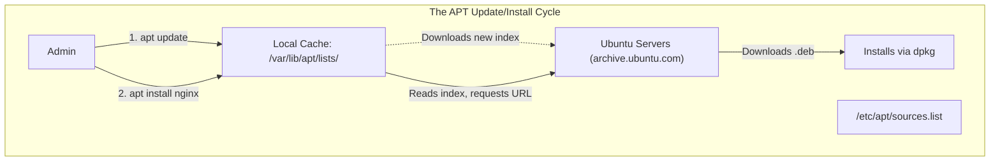
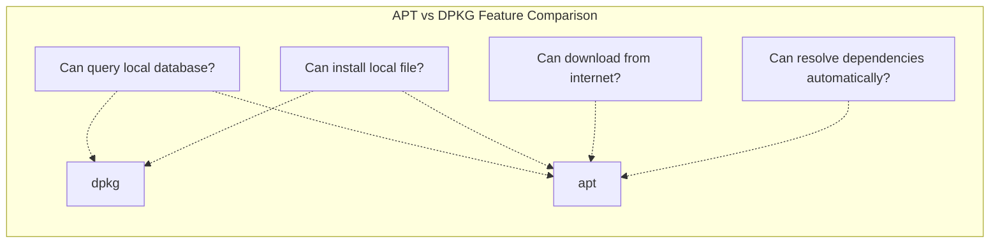
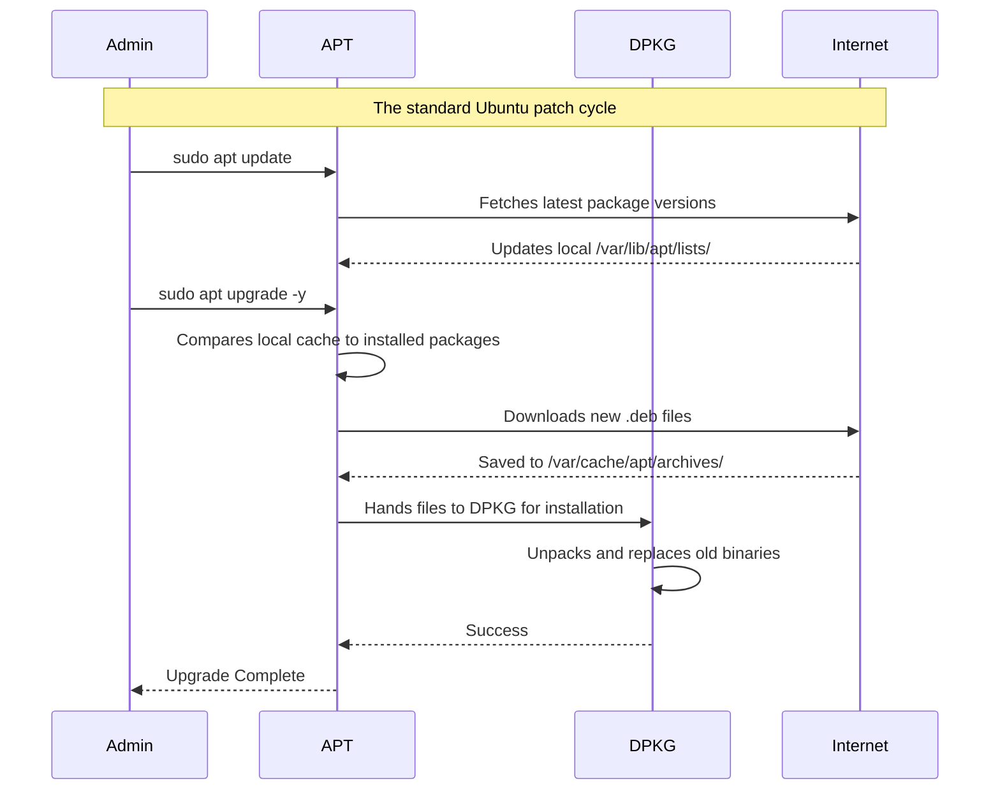

# CHAPTER 33 — PACKAGE MANAGEMENT: DPKG AND APT (UBUNTU/DEBIAN ECOSYSTEM)

---

## 1. Introduction

### Why This Topic Exists
While the Red Hat ecosystem uses RPM and DNF, the other half of the enterprise Linux world—the Debian ecosystem (which includes Ubuntu, Linux Mint, and Kali Linux)—uses a different architecture for package management. It relies on `.deb` packages. Just as with Red Hat, there is a low-level tool (`dpkg`) for local manipulation and a high-level tool (`apt`) for automated dependency resolution over the internet.

### Why Linux Administrators Use It
Ubuntu is the most popular operating system for cloud instances (AWS EC2, Azure VMs, Google Cloud) and modern containerised workloads (Docker base images). Administrators must master `apt` to deploy software on these platforms. They use `dpkg` when vendors supply proprietary, third-party software (like a VPN client or a proprietary database driver) as a standalone `.deb` file that isn't available in the public repositories.

### Why Companies Care About It
Standardisation and Security. Ubuntu LTS (Long Term Support) releases provide guaranteed security patches for 5 to 10 years. Companies rely on `apt` to seamlessly apply these patches across their cloud infrastructure to protect customer data and pass compliance audits. Furthermore, the massive size of the Ubuntu repositories means developers can install almost any open-source tool instantly without having to compile it manually.

---

## 2. Learning Objectives

By the end of this chapter, you will be able to:
- Differentiate between `dpkg` (low-level) and `apt` (high-level) package managers.
- Update the repository cache and install software using `apt`.
- Install local `.deb` files using `dpkg`.
- Configure software repositories using `/etc/apt/sources.list`.
- Search for packages and trace which package installed a specific file.
- Perform distribution upgrades (e.g., upgrading from Ubuntu 20.04 to 22.04).

---

## 3. Beginner-Friendly Explanation

If you recall the car kit analogy from the previous chapter:
- **`dpkg` (The Wrench):** You have a `.deb` file (the steering wheel) on a USB stick. You run `dpkg -i steering_wheel.deb`. It tries to bolt it on. If you are missing the steering column (a dependency), `dpkg` throws an error and stops. It cannot fetch the missing parts.
- **`apt` (The Master Mechanic):** You tell `apt install steering-wheel`. The mechanic checks the internet (Repositories), sees the missing steering column, buys it, and installs everything automatically.

It is exactly the same concept as RPM and DNF, just built by a different group of engineers with different commands.

---

## 4. Core Theory

### 4.1 DPKG (Debian Package Manager)
`dpkg` handles local `.deb` files.
- It manages the local database located in `/var/lib/dpkg/`.
- It installs, removes, and queries local packages.
- It does **not** resolve missing dependencies from the internet.

### 4.2 APT (Advanced Package Tool)
`apt` (and the older `apt-get`) is the high-level tool.
- It reads the repository URLs from `/etc/apt/sources.list`.
- **Crucial Difference from DNF:** Unlike DNF which automatically updates its cache every time you run it, `apt` does NOT. You must explicitly run `apt update` to download the latest index of available software before running `apt install`.

### 4.3 Repositories (`sources.list`)
Debian-based repositories are configured slightly differently than Red Hat.
They are heavily centralized in `/etc/apt/sources.list` (and `/etc/apt/sources.list.d/`).
A typical line looks like:
`deb http://archive.ubuntu.com/ubuntu focal main restricted`
This defines the URL, the OS version codename (`focal` for 20.04), and the specific software categories (Main, Restricted, Universe, Multiverse).

### 4.4 PPA (Personal Package Archives)
Ubuntu relies heavily on PPAs. If a developer creates a new tool that isn't in the official Ubuntu repositories yet, they can host it on a Canonical PPA. Administrators use `add-apt-repository` to easily add these PPAs to their system to get cutting-edge software.

---

## 5. Internal Working

### The Cache Sync Requirement
Why do you have to run `apt update` first?
When you type `apt install nginx`, the `apt` program does not check the internet. It checks a local text file cache on your hard drive (located in `/var/lib/apt/lists/`). If that local cache is 3 months old, `apt` will try to download a 3-month-old version of Nginx. The repository server will likely reject the download with a "404 Not Found" error because that old version has been deleted and replaced with a newer one.
Running `apt update` forces your server to download the newest index text file, ensuring `apt install` requests the correct, current files.

---

## 6. Production Architecture



---

## 7. Command-by-Command Explanation

### 7.1 `apt update`
- **Purpose:** Downloads the latest package lists from the repositories. Does *not* install or upgrade any software.

### 7.2 `apt upgrade`
- **Purpose:** Upgrades all currently installed software to the newest versions based on the lists downloaded by `apt update`. (Always run `update` first).

### 7.3 `apt install apache2`
- **Purpose:** Installs the Apache web server (Note: The package is named `apache2` in Ubuntu, unlike `httpd` in RHEL).

### 7.4 `apt search postgresql`
- **Purpose:** Searches the local cache for packages related to PostgreSQL.

### 7.5 `dpkg -i custom_app.deb`
- **Purpose:** Installs a local `.deb` file that you downloaded manually.

### 7.6 `dpkg -l`
- **Purpose:** Lists all packages currently installed on the system (Equivalent to `rpm -qa`).

---

## 8. Syntax Breakdown

```bash
sudo add-apt-repository ppa:ondrej/php
│    │                  │
│    │                  └── The PPA identifier (User: ondrej, Software: php)
│    └───────────────────── Command to inject a new repository into sources.list.d
└────────────────────────── Superuser privileges required
```
*(After running this, you must run `apt update` so your system actually downloads the list of PHP packages from Ondrej's server).*

---

## 9. Parameter Explanation

### APT Commands
| Command | Purpose |
|:---|:---|
| `apt install pkg` | Install software |
| `apt remove pkg` | Uninstall software (leaves config files behind) |
| `apt purge pkg` | Uninstall software AND delete all its config files |
| `apt autoremove` | Delete "orphan" dependencies that were installed automatically but are no longer needed |
| `apt show pkg` | Show detailed information about a package |

### DPKG Commands (Local)
| Command | Purpose |
|:---|:---|
| `dpkg -i file.deb` | Install a local `.deb` file |
| `dpkg -r pkg` | Remove an installed package |
| `dpkg -l` | List all installed packages |
| `dpkg -L pkg` | List all files belonging to an installed package |
| `dpkg -S /path/file` | Find which package installed a specific file |

---

## 10. Sample Output Analysis

**Scenario:** We attempt to install a downloaded package, but it fails.
**Command:** `sudo dpkg -i google-chrome-stable_current_amd64.deb`

**Output:**
```text
Selecting previously unselected package google-chrome-stable.
(Reading database ... 205118 files and directories currently installed.)
Preparing to unpack google-chrome-stable_current_amd64.deb ...
Unpacking google-chrome-stable (114.0.5735.198-1) ...
dpkg: dependency problems prevent configuration of google-chrome-stable:
 google-chrome-stable depends on libu2f-udev; however:
  Package libu2f-udev is not installed.
 google-chrome-stable depends on libvulkan1; however:
  Package libvulkan1 is not installed.
dpkg: error processing package google-chrome-stable (--install):
 dependency problems - leaving unconfigured
```

**Analysis:**
- `dpkg` successfully extracted Chrome but refused to configure it because the system is missing two libraries (`libu2f-udev` and `libvulkan1`).
- Because `dpkg` is low-level, it stopped and threw an error.
- **The Fix:** Run `sudo apt --fix-broken install`. `apt` will detect the broken, half-installed Chrome package, connect to the internet, download the two missing libraries, and finish the Chrome installation automatically.

---

## 11. Architecture Diagram



---

## 12. Workflow Diagram



---

## 13. Real Production Examples

### Deploying the LEMP Stack
Installing a web stack (Linux, Nginx, MySQL, PHP) on Ubuntu is incredibly fast because of the massive repositories.
```bash
sudo apt update
sudo apt install nginx mysql-server php-fpm php-mysql -y
```

### Full Distribution Upgrade
Unlike Red Hat (which traditionally requires a clean install between major versions like RHEL 8 to 9), Ubuntu is designed to upgrade in place (e.g., from Ubuntu 20.04 LTS to 22.04 LTS).
```bash
sudo apt update
sudo apt upgrade -y
sudo apt dist-upgrade -y
# Install the upgrade tool if missing
sudo apt install update-manager-core
# Trigger the massive OS upgrade
sudo do-release-upgrade
```

### Cleaning Up Junk
Over years of installing and uninstalling software, a server accumulates hundreds of "orphan" packages (dependencies that were installed for an app, but the app was later deleted). These waste disk space and slow down security scans.
```bash
sudo apt autoremove -y
```

---

## 14. Common Mistakes

1. **Forgetting `apt update`** — Running `apt install nodejs` on a server that has been running for 6 months without an `update` will almost always result in a "404 Not Found" error, because `apt` is trying to download a version that no longer exists on the Ubuntu servers.
2. **Mixing `apt` and `apt-get` inconsistently** — `apt` is the modern, user-friendly wrapper introduced in Ubuntu 16.04. It has a progress bar and consolidated commands. `apt-get` is the older, strict, script-friendly version. Use `apt` for daily use, but you may see `apt-get` heavily used in Dockerfiles and old automation scripts. They do the same thing.
3. **Interrupting `dpkg`** — If you reboot a server in the middle of a kernel upgrade, the `dpkg` database becomes corrupted. You will usually have to fix it by running `sudo dpkg --configure -a` to force it to finish configuring the interrupted packages.

---

## 15. Best Practices

- Always run `apt update && apt upgrade -y` when provisioning a fresh cloud VM.
- Use `apt purge` instead of `apt remove` if you completely messed up a configuration file (like Apache's `httpd.conf`) and want to start completely from scratch. `remove` leaves config files behind; `purge` destroys them.
- If an `apt` command fails due to a locked file (`Could not get lock /var/lib/dpkg/lock`), DO NOT delete the lock file immediately. It usually means another update process (like `unattended-upgrades`) is running in the background. Wait 5 minutes.

---

## 16. Security Considerations

- **Unattended Upgrades:** Ubuntu servers usually have a package called `unattended-upgrades` installed by default. This runs a cron job daily that automatically downloads and installs critical security patches. This is excellent for security, but can occasionally break production applications if a patch contains a bug. Administrators often configure it to patch security updates automatically, but hold back major software version upgrades.

---

## 17. Performance Considerations

- The `apt` cache can consume gigabytes of disk space over time as it stores every `.deb` file it downloads in `/var/cache/apt/archives/`. If a server is low on disk space, running `sudo apt clean` will delete all these cached installers instantly without affecting installed software.

---

## 18. Troubleshooting Guide

| Symptom | Root Cause | Resolution |
|:---|:---|:---|
| `404 Not Found` during `apt install` | Local cache is out of date | Run `sudo apt update` first |
| `Could not get lock /var/lib/dpkg/lock` | Another apt/dpkg process is running | Wait, or check `ps aux \| grep apt` to find and kill the hung process |
| `dpkg: error processing package` | Broken dependencies from local install | Run `sudo apt --fix-broken install` |
| `E: Unable to locate package` | Package doesn't exist in standard repos | Check spelling, or add the necessary PPA |

---

## 19. Practical Labs

**Lab 33.1:** The Update/Install Cycle
```bash
sudo apt update
sudo apt install htop -y
htop             # Press q to exit
```

**Lab 33.2:** Querying with DPKG
```bash
# Find out what package provided the 'ls' command
which ls         # Outputs /usr/bin/ls
dpkg -S /usr/bin/ls  # Outputs 'coreutils'

# List all files provided by coreutils
dpkg -L coreutils | head -n 10
```

**Lab 33.3:** Cleaning Up
```bash
sudo apt purge htop -y
sudo apt autoremove -y
sudo apt clean
```

---

## 20. Mini Project

Simulate resolving a broken local installation.
1. Download a dummy `.deb` file or a real one (like Google Chrome) that you know requires heavy dependencies:
   `wget https://dl.google.com/linux/direct/google-chrome-stable_current_amd64.deb`
2. Try to install it locally using the low-level tool:
   `sudo dpkg -i google-chrome-stable_current_amd64.deb`
3. Watch it fail with a list of missing dependencies.
4. Run the magic fix command:
   `sudo apt --fix-broken install -y`
5. Watch as `apt` reads the error state left by `dpkg`, reaches out to the internet, downloads the missing libraries, and successfully finishes the installation.

---

## 21. Assignments

1. What is the fundamental difference between `apt remove` and `apt purge`?
2. Why is it mandatory to run `apt update` before running `apt install` on Ubuntu, whereas `dnf install` on RHEL doesn't require it?
3. What is the Ubuntu/Debian equivalent of the `rpm -qa` command?

---

## 22. Interview Questions

### Basic
1. **Q: How do you completely update a Ubuntu or Debian server?**
   A: First run `sudo apt update` to refresh the package lists, then run `sudo apt upgrade -y` to apply the updates.

2. **Q: You have a file named `app.deb`. What command installs it?**
   A: `sudo dpkg -i app.deb` (or `sudo apt install ./app.deb` on modern systems).

### Intermediate
3. **Q: You try to run `apt install nginx`, but the terminal throws an error: "Could not get lock /var/lib/dpkg/lock-frontend - is another process using it?". What is happening?**
   A: Another package management process is currently running. This could be another administrator running `apt` in a different SSH session, or more likely, the automated `unattended-upgrades` background service applying security patches. You must wait for it to finish, or find the PID and kill it if it is permanently hung.

4. **Q: How do you find out which installed package provided the `/etc/ssh/sshd_config` file on an Ubuntu server?**
   A: Use the `dpkg -S` (Search) command: `dpkg -S /etc/ssh/sshd_config`.

### Scenario-Based
5. **Q: You are provisioning an Ubuntu server for a production database. After running `apt update && apt upgrade`, you notice the `/var` partition is alarmingly full. The server has a tiny hard drive. How can you safely reclaim gigabytes of space using only `apt` commands?**
   A: I would run two commands. First, `sudo apt autoremove -y`, which removes orphan dependencies and old, unused Linux kernels that are taking up space. Second, I would run `sudo apt clean`, which deletes all the cached `.deb` installer files located in `/var/cache/apt/archives/` that `apt` downloaded during the upgrade. Neither command impacts running software.

---

## 23. Chapter Summary and Quick Revision Notes

- **DPKG:** Low-level package manager for `.deb` files. No network dependency resolution.
- **APT:** High-level package manager. Resolves dependencies via the internet.
- **Repositories:** Configured in `/etc/apt/sources.list`.
- **PPAs:** Personal Package Archives used to add 3rd-party software.
- Always run `apt update` to refresh the local cache before installing software.
- `apt remove` leaves configuration files; `apt purge` destroys everything.
- `apt --fix-broken install` resolves dependency messes created by manual `dpkg` installs.

---

## 24. Cheat Sheet

| Command | Purpose |
|:---|:---|
| `apt update` | Refresh local list of available software |
| `apt upgrade` | Install available updates |
| `apt install pkg` | Install new software |
| `apt purge pkg` | Uninstall and delete config files |
| `apt autoremove` | Delete unused orphan dependencies |
| `dpkg -i file.deb`| Install local package |
| `dpkg -l` | List all installed packages |
| `dpkg -S /path` | Find package that provided the file |
