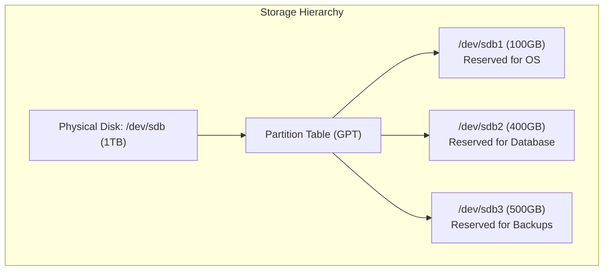
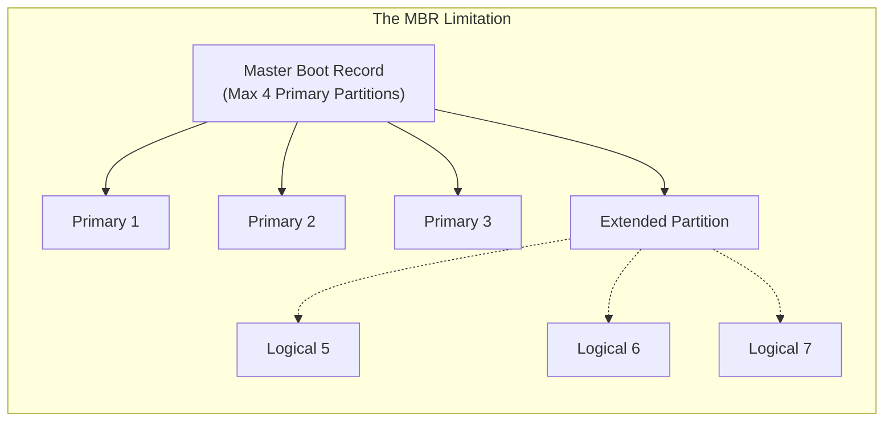
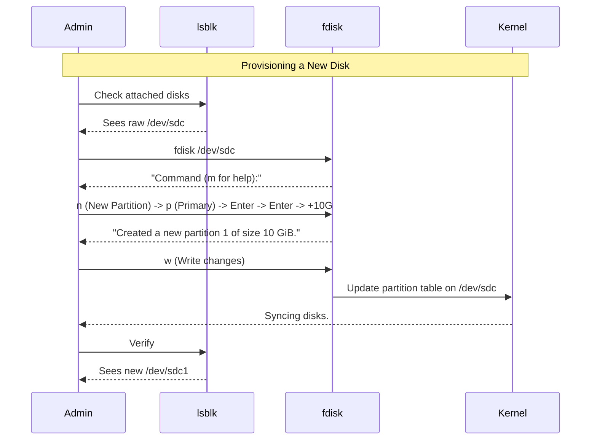

# CHAPTER 35 — STORAGE FUNDAMENTALS AND PARTITIONING

---

## 1. Introduction

### Why This Topic Exists
When you buy a raw hard drive and plug it into a server, you cannot immediately save files to it. The raw magnetic disks (or NAND chips in an SSD) have no structure. The operating system doesn't know where one file ends and another begins. Before using a disk, an administrator must divide the disk into manageable chunks called **Partitions**.

### Why Linux Administrators Use It
System administrators constantly manage storage. They attach new Virtual Hard Disks (VHDs) to cloud instances, partition them using tools like `fdisk` or `parted`, format them, and make them available to applications. Proper partitioning ensures that if a rogue application fills up the log partition, it doesn't crash the entire server by filling up the root (`/`) OS partition.

### Why Companies Care About It
Data Integrity and Disaster Recovery. In a corporate environment, the Operating System is disposable, but the Database is invaluable. Administrators partition disks so that the OS lives on `/dev/sda` and the Database lives on a completely separate physical disk `/dev/sdb`. If the OS disk dies, the company reinstalls the OS, reconnects the database disk, and loses zero customer data.

---

## 2. Learning Objectives

By the end of this chapter, you will be able to:
- Understand Linux storage device naming conventions (e.g., `sda`, `nvme0n1`).
- Explain the difference between MBR (Master Boot Record) and GPT (GUID Partition Table).
- List attached block devices using `lsblk`.
- Create, modify, and delete partitions using `fdisk`.
- Create partitions on disks larger than 2TB using `parted`.

---

## 3. Beginner-Friendly Explanation

Think of a brand new Hard Drive like a massive empty plot of land.
- **The Raw Disk:** The empty dirt. You cannot just throw office desks onto the dirt and call it a business.
- **Partitioning (`fdisk`):** Drawing lines in the dirt. "This rectangle here will be the HR building. This rectangle here will be the parking lot."
- **Formatting (Next Chapter):** Pouring concrete and building the actual rooms so people can use them.

You MUST draw the lines (Partition) before you pour the concrete (Format).

---

## 4. Core Theory

### 4.1 Device Naming Conventions
In Linux, everything is a file. Hard drives are represented as special "block device files" located in the `/dev/` directory.
- **SATA/SAS/USB Drives (SCSI):** Named `sda`, `sdb`, `sdc`.
  - The first disk is `/dev/sda`.
  - The first partition on the first disk is `/dev/sda1`.
  - The second partition on the first disk is `/dev/sda2`.
- **NVMe Drives:** Named `nvme0n1`, `nvme1n1`.
  - The first partition is `/dev/nvme0n1p1`.
- **Virtual Disks (KVM/AWS):** Named `vda`, `vdb` or `xvda`, `xvdb`.

### 4.2 MBR vs GPT (Partition Tables)
To remember where the partitions are, the disk stores a "map" at the very beginning of the drive.
1. **MBR (Master Boot Record):** The legacy standard (1980s).
   - **Limit 1:** Cannot handle disks larger than **2 Terabytes**.
   - **Limit 2:** Can only have 4 Primary partitions. (If you need more, you must make one an "Extended" partition and put "Logical" partitions inside it).
2. **GPT (GUID Partition Table):** The modern standard.
   - **Limit 1:** Can handle disks up to **9.4 Zettabytes** (essentially infinite).
   - **Limit 2:** Supports up to 128 primary partitions by default.

### 4.3 The Partitioning Tools
- `fdisk`: The traditional, interactive tool. Best for MBR disks (though modern versions support GPT).
- `parted`: The modern tool. Excels at managing GPT disks and can be scripted without interactive prompts.
- `gdisk`: specifically designed for GPT (like fdisk, but exclusively for GPT).

---

## 5. Internal Working

### Block Devices vs Character Devices
Why are hard drives called "Block Devices"?
When the CPU talks to a keyboard (a Character Device), it reads data one character (byte) at a time in a continuous stream. When the CPU talks to a hard drive, it cannot read just one byte. It reads and writes data in fixed-size blocks (traditionally 512 bytes, now 4096 bytes or 4K). `fdisk` aligns partitions perfectly to these physical block boundaries to maximize read/write performance.

---

## 6. Production Architecture



---

## 7. Command-by-Command Explanation

### 7.1 `lsblk`
- **Purpose:** Lists all block devices attached to the system in a clean, tree-like format.

### 7.2 `fdisk -l`
- **Purpose:** Lists all disks and their partitions, including detailed sector and cylinder information. Requires `root`.

### 7.3 `fdisk /dev/sdb`
- **Purpose:** Opens the interactive partitioning utility for the second hard drive. (Do NOT include a number like `sdb1`. You partition the *disk*, not the *partition*).
- **Internal Commands:**
  - `m`: Help menu
  - `p`: Print the current partition table
  - `n`: Create a new partition
  - `d`: Delete a partition
  - `t`: Change partition type (e.g., Linux, Swap, LVM)
  - `w`: Write changes to disk and exit
  - `q`: Quit without saving (safe exit)

### 7.4 `partprobe`
- **Purpose:** Forces the Linux Kernel to re-read the partition table. Required if the disk is currently in use and you modified a partition, otherwise the system won't see the new partition until a reboot.

---

## 8. Syntax Breakdown

```bash
parted /dev/sdc mkpart primary ext4 0% 100%
│      │        │      │       │    │  │
│      │        │      │       │    │  └── End at the end of the disk
│      │        │      │       │    └───── Start at the beginning of the disk
│      │        │      │       └────────── Intended filesystem type
│      │        │      └────────────────── Partition type
│      │        └───────────────────────── Command: Make Partition
│      └────────────────────────────────── Target Disk
└───────────────────────────────────────── Utility
```
*(This creates a single massive partition using 100% of the disk. `parted` runs instantly without interactive menus if you provide arguments).*

---

## 9. Parameter Explanation

| Command | Parameter | Description |
|:---|:---|:---|
| `lsblk` | `-f` | Output info about filesystems (UUID, format) |
| `parted` | `print` | Print partition table |
| `parted` | `mklabel gpt` | Convert an empty disk to GPT format |
| `parted` | `mklabel msdos` | Convert an empty disk to MBR format |
| `wipefs` | `-a /dev/sdb` | Completely erase all partition tables from a disk |

---

## 10. Sample Output Analysis

**Scenario:** We want to see what disks are attached to the server. We run `lsblk`.

**Output:**
```text
NAME    MAJ:MIN RM  SIZE RO TYPE MOUNTPOINT
sda       8:0    0   20G  0 disk 
├─sda1    8:1    0    1G  0 part /boot
└─sda2    8:2    0   19G  0 part /
sdb       8:16   0  500G  0 disk 
sr0      11:0    1 1024M  0 rom  
```

**Analysis:**
- **sda:** The first hard drive (20GB). It is divided into two partitions (`sda1` for booting, `sda2` for the main OS).
- **sdb:** The second hard drive (500GB). It has no branches below it. This tells us the disk is completely raw and unpartitioned.
- **sr0:** The CD-ROM drive (ROM type).

---

## 11. Architecture Diagram


*Note: Because MBR can only hold 4 slots, the 4th slot is turned into a "container" (Extended) that can hold infinite sub-partitions (Logical).*

---

## 12. Workflow Diagram



---

## 13. Real Production Examples

### Hot-Plugging a Drive
An AWS engineer attaches a new 1TB EBS volume to a running EC2 instance via the AWS web console. The engineer logs into the server.
```bash
# Verify the kernel sees the new disk (often /dev/nvme1n1 on AWS)
lsblk

# Partition it using parted for automation (make it GPT)
sudo parted /dev/nvme1n1 mklabel gpt
# Use 100% of the space
sudo parted /dev/nvme1n1 mkpart primary 0% 100%

# Verify
lsblk
```

### Deleting a Partition (DANGER)
A junior admin needs to repurpose an old 50GB partition.
```bash
sudo fdisk /dev/sdb
# Types 'd' to delete
# Types '1' to select partition 1
# Types 'w' to write to disk.
```
*Warning: Deleting a partition destroys the OS's ability to locate the data. The data is still magnetically on the disk, but for all practical purposes, it is gone.*

---

## 14. Common Mistakes

1. **Typing `fdisk /dev/sda1` instead of `fdisk /dev/sda`** — You cannot partition a partition. The command will fail. You must target the whole disk.
2. **Forgetting to press `w` in fdisk** — `fdisk` operates entirely in RAM to keep you safe. If you spend 10 minutes creating 5 partitions and then press `q` (Quit) or `Ctrl+C`, all your work is lost. You must press `w` (Write) to commit the changes to the disk.
3. **Partitioning an active disk without warning users** — If you resize or delete partitions on a disk that is currently mounted and being used by an application, you will cause massive data corruption and kernel panics.

---

## 15. Best Practices

- Standardize on **GPT** for all new servers. Disks larger than 2TB are incredibly common today, and MBR will silently fail to address any space beyond 2TB.
- Always run `lsblk` before typing an `fdisk` command to quadruple-check that you are operating on the correct disk. Partitioning the wrong disk (like the OS disk) is an instant Resume-Generating Event (you will be fired).
- Use `partprobe` immediately after `fdisk` to guarantee the kernel sees the new layout before you move on to formatting.

---

## 16. Security Considerations

- The partition table contains the exact block offsets for data. Forensic investigators can recover deleted partitions if a malicious actor ran `fdisk` and deleted the table, provided the attacker didn't also securely wipe the underlying blocks with random data (using `dd` or `shred`).

---

## 17. Performance Considerations

- **Partition Alignment:** Modern Advanced Format drives use 4K physical sectors. If a partition starts in the middle of a 4K sector, every single read/write operation requires the disk to read two physical sectors, cutting performance by 50%. Modern `fdisk` and `parted` automatically align partitions correctly by starting at sector 2048 (exactly 1MB in).

---

## 18. Troubleshooting Guide

| Symptom | Root Cause | Resolution |
|:---|:---|:---|
| `lsblk` doesn't show the new disk | Kernel didn't detect hardware | Run `echo "- - -" > /sys/class/scsi_host/host0/scan` to force a SCSI rescan |
| `fdisk` throws "Device or resource busy" | The disk is mounted | Unmount it using `umount /dev/sdb1` first |
| Created partition, but `lsblk` doesn't see it | Kernel table not synced | Run `sudo partprobe` |
| `Value out of range` for partition size | Trying to make a 3TB partition on MBR | Convert the disk to GPT using `parted` |

---

## 19. Practical Labs

**Lab 35.1:** Investigation
```bash
lsblk
sudo fdisk -l
```

**Lab 35.2:** Creating a Partition (Requires a spare disk, e.g., `/dev/sdb`)
1. Run `sudo fdisk /dev/sdb`
2. Press `n` for new partition.
3. Press `p` for primary.
4. Press `1` for partition number 1.
5. Press `Enter` to accept the default First Sector.
6. Type `+5G` to make a 5 Gigabyte partition and press Enter.
7. Press `p` to print and verify.
8. Press `w` to write changes.
9. Run `lsblk` to verify `/dev/sdb1` exists.

---

## 20. Mini Project

Scripted Provisioning with Parted.
Imagine you have to provision 100 new disks in the cloud. You cannot use the interactive `fdisk` menu 100 times.
Write a one-liner to partition `/dev/sdc` (ensure it is empty!).
```bash
# Convert to GPT
sudo parted -s /dev/sdc mklabel gpt
# Create one partition taking exactly 50% of the disk
sudo parted -s /dev/sdc mkpart primary 0% 50%
# Create a second partition taking the remaining 50%
sudo parted -s /dev/sdc mkpart primary 50% 100%
# Verify
lsblk /dev/sdc
```
*(The `-s` flag tells parted to run silently in script mode).*

---

## 21. Assignments

1. What is the maximum disk size supported by the legacy MBR partitioning scheme?
2. A new NVMe drive is attached to your server. What is its likely device name in the `/dev/` directory?
3. In `fdisk`, what key do you press to save your changes to the disk?

---

## 22. Interview Questions

### Basic
1. **Q: What command gives you a clean tree-view of all disks and their partitions on the system?**
   A: `lsblk`

2. **Q: What is the difference between `/dev/sdb` and `/dev/sdb1`?**
   A: `/dev/sdb` is the entire physical hard drive. `/dev/sdb1` is the first partition on that hard drive.

### Intermediate
3. **Q: You attach a brand new 4TB hard drive to a server. You run `fdisk`, create a single partition using the default settings, and format it. However, you notice the partition is only 2TB in size, and the remaining 2TB is unusable. What did you do wrong?**
   A: I used the legacy MBR (DOS) partition table, which has a hard architectural limit of 2TB. To utilize the full 4TB, I must delete the partition, convert the disk label to GPT (GUID Partition Table) using `parted` or `gdisk`, and recreate the partition.

4. **Q: You just used `fdisk` to resize a partition. You type `w` to save, but fdisk outputs a warning saying the kernel is still using the old partition table. What command must you run so you don't have to reboot the server?**
   A: `partprobe` (or `partx -u`). This forces the kernel to re-read the partition tables from the block devices.

### Scenario-Based
5. **Q: You are logged into a critical production database server as root. The database uses `/dev/sdc1`. You accidentally type `fdisk /dev/sdc`, then type `d` (delete), then `w` (write). The partition table is gone. You haven't rebooted yet. Is the database data gone, and can you fix this?**
   A: The data is not gone. `fdisk` only alters the tiny partition table at the very beginning of the disk; it does not touch the actual data blocks. Because the disk is currently mounted and active, the running kernel actually still has the old partition boundaries cached in RAM, so the database will continue running. To fix it, if I remember the exact starting and ending sectors of the deleted partition, I can simply recreate it using `fdisk` with the exact same sector numbers. Another tool, `testdisk`, can automatically scan the drive, find the lost filesystem boundaries, and rewrite the partition table to save the disk.

---

## 23. Chapter Summary and Quick Revision Notes

- Disks are Block Devices (`/dev/sda`, `/dev/nvme0n1`).
- **MBR:** Old standard, Max 2TB, Max 4 Primary partitions.
- **GPT:** Modern standard, Infinite size, 128 Primary partitions.
- `lsblk`: List block devices.
- `fdisk`: Interactive partitioning tool (Use `w` to save, `q` to quit safely).
- `parted`: Advanced tool, scriptable, required for GPT.
- `partprobe`: Tell the kernel to re-read the changes.

---

## 24. Cheat Sheet

| Command | Purpose |
|:---|:---|
| `lsblk` | View all disks and partitions |
| `fdisk -l` | Detailed view of disk sectors/sizes |
| `fdisk /dev/sdb` | Open interactive partition manager for sdb |
| `parted /dev/sdb print` | Print partition table info |
| `parted /dev/sdb mklabel gpt` | Convert disk to GPT |
| `partprobe` | Force kernel to reload partition tables |
