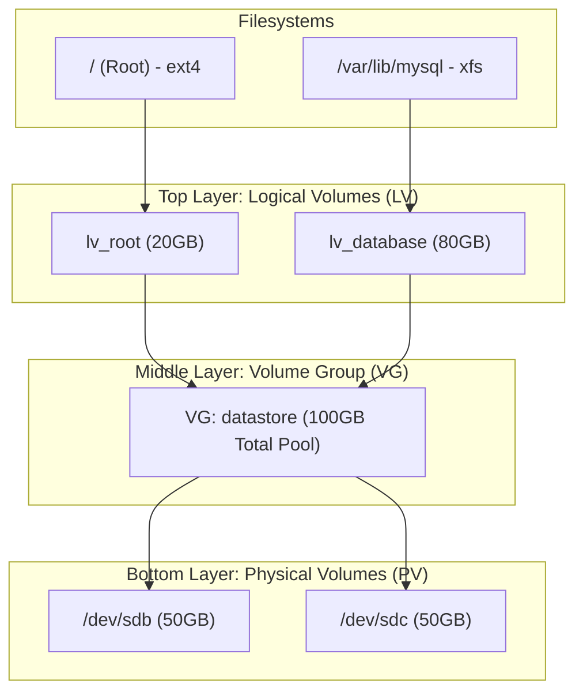
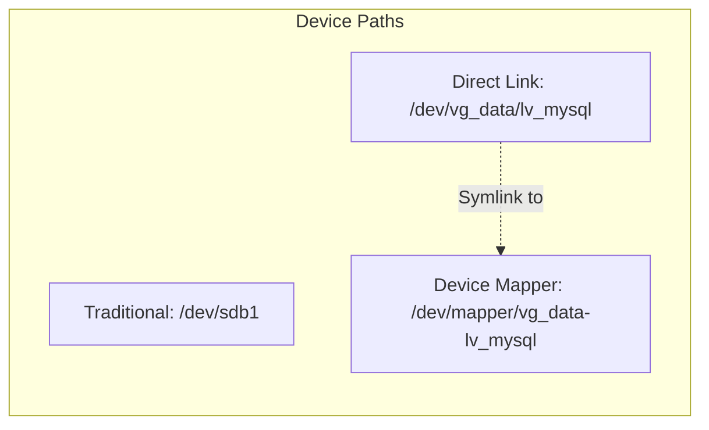
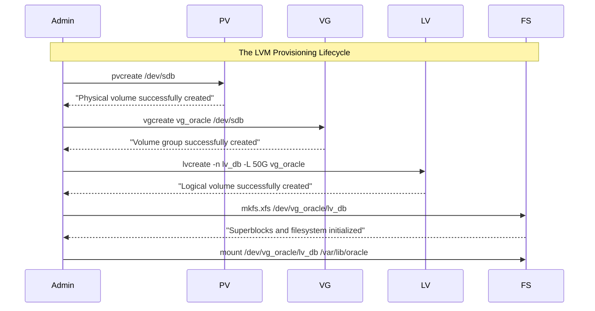

# CHAPTER 38 — LOGICAL VOLUME MANAGEMENT (LVM)

---

## 1. Introduction

### Why This Topic Exists
Standard partitioning (`fdisk` + `/dev/sdb1`) has a massive flaw: it is completely inflexible. If you format a 100GB partition and it fills up with data, you cannot easily add another 50GB to it. You would have to buy a bigger drive, format it, shut down the application, and copy all the data over. **LVM (Logical Volume Management)** solves this. It adds an abstraction layer between the physical hard drives and the filesystem, allowing administrators to resize, stretch, and pool storage dynamically across multiple physical disks while the system is running.

### Why Linux Administrators Use It
LVM is the industry standard for enterprise Linux storage. If an administrator notices a database partition `/var/lib/mysql` is 98% full, they don't panic. They simply attach a new hard drive to the server, use LVM to pool it with the existing storage, and stretch the filesystem live, without a single second of downtime for the database.

### Why Companies Care About It
Agility and Zero Downtime. Storage needs change constantly. A log directory might unexpectedly require 500GB of space. With LVM, companies don't have to over-provision expensive storage hardware on day one. They can provision exactly what they need today, and use LVM to dynamically expand storage on the fly as the business grows, keeping applications online 24/7.

---

## 2. Learning Objectives

By the end of this chapter, you will be able to:
- Explain the 3 tiers of LVM: Physical Volume (PV), Volume Group (VG), and Logical Volume (LV).
- Initialize physical disks as Physical Volumes using `pvcreate`.
- Pool multiple PVs into a single Volume Group using `vgcreate`.
- Slice a Volume Group into Logical Volumes using `lvcreate`.
- Format and mount a Logical Volume just like a standard partition.
- Differentiate between Physical Extents (PE) and Logical Extents (LE).

---

## 3. Beginner-Friendly Explanation

Think of LVM like managing water (data) in containers (hard drives).

- **Standard Partitioning (`fdisk`):** You have a 1-gallon glass jar (`/dev/sdb1`). If you have 2 gallons of water, it won't fit. You cannot stretch a glass jar. You must buy a bigger jar.
- **LVM:** 
  - **Physical Volume (PV):** You buy three 1-gallon glass jars.
  - **Volume Group (VG):** You smash the glass jars and melt the glass down to create a massive 3-gallon bucket of raw glass.
  - **Logical Volume (LV):** You mold that raw glass into whatever shape you want. You make a 1.5-gallon pitcher for the OS, and a 1.5-gallon bowl for the database. If the bowl gets full, you just buy another 1-gallon jar, melt it into the VG, and stretch the bowl.

---

## 4. Core Theory

### 4.1 The Three Layers of LVM
LVM abstracts storage into three distinct layers.
1. **Physical Volumes (PV):** The absolute lowest level. This is the raw physical hard drive (`/dev/sdb`) or a standard partition (`/dev/sdb1`) that has been "initialized" for use by LVM.
2. **Volume Groups (VG):** The middle layer. A VG is a storage pool. It groups one or more PVs together into a single massive chunk of raw capacity. (e.g., Two 10GB PVs combined into one 20GB VG).
3. **Logical Volumes (LV):** The top layer. LVs are carved out of the VG. These act exactly like standard partitions. You format the LV with a filesystem (ext4/xfs) and mount it to a directory.

### 4.2 Extents (PE and LE)
When LVM adds a disk to a Volume Group, it chops the disk into tiny, equal-sized chunks called **Physical Extents (PE)** (default size is 4MB). 
When you create a Logical Volume, it is made of **Logical Extents (LE)**. LVM simply maps Logical Extents to Physical Extents. If you expand an LV, LVM just assigns more free PEs to it.

---

## 5. Internal Working

### The Device Mapper
How does the Linux kernel understand an LV if it isn't a real partition?
LVM relies on a kernel subsystem called the **Device Mapper**. The Device Mapper creates virtual block devices in `/dev/mapper/`. When the database reads a file from `/dev/mapper/vg01-lv_data`, the Device Mapper intercepts the read request, looks at its internal mapping table, and forwards the read request to the correct physical blocks on the underlying `/dev/sdb` drive.

---

## 6. Production Architecture


*Notice how `lv_database` (80GB) is larger than any single physical disk (50GB). LVM seamlessly stripes the data across both physical disks.*

---

## 7. Command-by-Command Explanation

### 7.1 PV Commands (`pvs`, `pvdisplay`, `pvcreate`)
- `pvcreate /dev/sdb`: Initializes the raw disk `/dev/sdb` for LVM use. It writes an LVM header to the disk.
- `pvs`: Prints a one-line summary of all Physical Volumes.
- `pvdisplay`: Prints highly detailed information about PEs and UUIDs.

### 7.2 VG Commands (`vgs`, `vgdisplay`, `vgcreate`)
- `vgcreate vg_data /dev/sdb`: Creates a new Volume Group named `vg_data` using the initialized disk.
- `vgs`: Prints a summary of Volume Groups and their total/free space.

### 7.3 LV Commands (`lvs`, `lvdisplay`, `lvcreate`)
- `lvcreate -n lv_mysql -L 10G vg_data`: Carves a 10 Gigabyte Logical Volume named `lv_mysql` out of the `vg_data` pool.
- `lvs`: Prints a summary of all Logical Volumes.

---

## 8. Syntax Breakdown

```bash
lvcreate -n lv_app -l 100%FREE vg_web
│        │  │      │  │        │
│        │  │      │  │        └── The Source Volume Group pool
│        │  │      │  └─────────── Use 100% of the remaining free extents
│        │  │      └────────────── Size based on extents (lowercase L)
│        │  └───────────────────── The name of the new Logical Volume
│        └──────────────────────── Name flag
└───────────────────────────────── Command: Create LV
```

---

## 9. Parameter Explanation

| Command | Parameter | Description |
|:---|:---|:---|
| `lvcreate` | `-L 5G` | Define size in exact human units (Gigabytes, Megabytes). |
| `lvcreate` | `-l 50%VG` | Define size based on percentages of the Volume Group. |
| `lvscan` | | Scans all disks for LVM volumes (useful if moving disks between servers). |
| `pvremove` | `/dev/sdb` | Wipes the LVM label from a disk, returning it to raw state. (Only works if the disk is not part of a VG). |

---

## 10. Sample Output Analysis

**Scenario:** We want to check our current storage pool status.
**Command:** `vgs`

**Output:**
```text
  VG      #PV #LV #SN Attr   VSize   VFree
  rhel      1   2   0 wz--n-  19.00g    0 
  vg_data   2   1   0 wz--n-  99.99g 19.99g
```

**Analysis:**
- **rhel:** The default volume group created by the OS installer. It has 1 Physical disk, 2 Logical Volumes (probably root and swap). It is 19GB in size and has `0` free space (you cannot create any more LVs here).
- **vg_data:** A custom pool. It combines 2 Physical disks into a 100GB pool. It contains 1 Logical volume, and has ~20GB of free space remaining in the pool to create more LVs or expand the current one.

---

## 11. Architecture Diagram


*Note: When mounting an LV in `/etc/fstab`, you can use either `/dev/mapper/vg-lv` or `/dev/vg/lv`. Both point to the exact same virtual block device.*

---

## 12. Workflow Diagram



---

## 13. Real Production Examples

### Grouping Multiple Small Disks
An admin has three spare 10GB disks (`sdb`, `sdc`, `sdd`). They need a 25GB partition for a backup archive. Traditional partitioning cannot solve this.
```bash
# 1. Initialize all three disks
sudo pvcreate /dev/sdb /dev/sdc /dev/sdd

# 2. Pool them all together into a 30GB VG
sudo vgcreate vg_backups /dev/sdb /dev/sdc /dev/sdd

# 3. Carve out a 25GB LV from the pool
sudo lvcreate -n lv_archive -L 25G vg_backups

# 4. Format and Mount
sudo mkfs.ext4 /dev/vg_backups/lv_archive
sudo mount /dev/vg_backups/lv_archive /mnt/backups
```

### Deleting a Logical Volume
A project is finished, and the storage needs to be returned to the pool.
```bash
# 1. Unmount the filesystem (CRITICAL)
sudo umount /mnt/backups

# 2. Destroy the Logical Volume
sudo lvremove /dev/vg_backups/lv_archive
# (Press 'y' to confirm destruction of data)

# The 25GB is now returned to vg_backups as Free Space.
```

---

## 14. Common Mistakes

1. **Forgetting to unmount before deleting** — If you run `lvremove` on an LV that is currently mounted and active, the kernel will throw terrifying errors, and the system may become unstable. Always `umount` first.
2. **Confusing LVs and VGs** — `lvcreate` requires you to specify the VG it belongs to. Beginners often type `lvcreate -n name /dev/sdb`, which fails because LVs are carved from VGs, not directly from PVs.
3. **Using standard partitioning on LVM disks** — While you *can* create `/dev/sdb1` and run `pvcreate /dev/sdb1`, it is completely unnecessary in modern environments unless you are dual-booting. It adds an extra layer of complexity. Just run `pvcreate /dev/sdb` directly on the raw disk.

---

## 15. Best Practices

- Standardize naming conventions. Name Volume Groups starting with `vg_` (e.g., `vg_data`) and Logical Volumes starting with `lv_` (e.g., `lv_logs`). This prevents massive confusion when staring at `/etc/fstab` six months later.
- Never use 100% of a Volume Group immediately. If you have a 100GB VG, create a 50GB LV. Leave the other 50GB in the pool. It is incredibly easy to expand an LV later, but incredibly dangerous/difficult to shrink one. Leave space in the VG for future expansion.

---

## 16. Security Considerations

- **Secure Erase:** When you run `lvremove`, LVM simply deletes the pointers. The actual data is still magnetically present on the physical disk. If the server is in a multi-tenant environment and you return the raw disk to the hypervisor, the next tenant could potentially run forensic tools to recover your data. Consider using `lvremove --wipesignatures y` or `dd` to overwrite the volume before destruction.

---

## 17. Performance Considerations

- **LVM Striping:** By default, LVM writes linearly (it fills up `/dev/sdb` completely, then moves to `/dev/sdc`). You can tell `lvcreate` to stripe data (write to both disks simultaneously) using the `-i` flag (e.g., `-i 2` for two disks). This essentially creates a software RAID0, doubling read/write speeds, but doubling the risk of data loss if a single drive fails.

---

## 18. Troubleshooting Guide

| Symptom | Root Cause | Resolution |
|:---|:---|:---|
| `pvcreate: device /dev/sdb excluded by a filter` | Disk contains an old partition table | Run `wipefs -a /dev/sdb` to destroy old signatures |
| `lvcreate: Volume group not found` | Typo in VG name | Run `vgs` to verify the exact VG name |
| Server won't boot after adding LVM | Missing fstab or bad UUID | Use Emergency mode. Ensure you mount the `/dev/mapper/` path. |
| `lvremove: logical volume is in use` | The LV is mounted | Run `umount` and check `lsof` to ensure no processes are holding it open |

---

## 19. Practical Labs

*(Note: These labs require at least one unformatted, spare disk attached to your VM, e.g., `/dev/sdb`)*

**Lab 38.1:** Initialization and Pooling
```bash
sudo pvcreate /dev/sdb
sudo pvs
sudo vgcreate vg_web /dev/sdb
sudo vgs
```

**Lab 38.2:** Carving and Formatting
```bash
sudo lvcreate -n lv_html -L 2G vg_web
sudo lvs
sudo mkfs.xfs /dev/vg_web/lv_html
sudo mkdir /var/www/html
sudo mount /dev/vg_web/lv_html /var/www/html
df -h /var/www/html
```

---

## 20. Mini Project

Map the full path of an LVM setup.
1. Run `lsblk`. Notice how LVM volumes appear as branches underneath physical disks.
2. Run `pvs`, `vgs`, and `lvs`. Compare the outputs.
3. Look at the device mapper: `ls -l /dev/mapper/`. You will see the actual virtual block devices created by the kernel.
4. Look at the LVM symlinks: `ls -l /dev/vg_web/`. You will see these are just shortcuts pointing back to `/dev/mapper/`.
5. This exercise proves that while LVM abstracts storage, it still heavily relies on standard Linux filesystem principles.

---

## 21. Assignments

1. What are the three layers of LVM in order from lowest to highest?
2. What command pools multiple physical disks together into a single storage entity?
3. If a Volume Group has 50GB of free space, what command creates a 10GB Logical Volume named `lv_test` inside it?

---

## 22. Interview Questions

### Basic
1. **Q: What is the primary advantage of using LVM over standard `fdisk` partitioning?**
   A: Flexibility. LVM allows you to resize filesystems dynamically while the system is running, and allows you to pool multiple physical hard drives together to create partitions larger than any single physical disk.

2. **Q: What do PV, VG, and LV stand for?**
   A: Physical Volume, Volume Group, Logical Volume.

### Intermediate
3. **Q: You ran `lvcreate` and carved out a 10GB volume. However, when you run `df -h`, it does not appear. Why?**
   A: `lvcreate` only creates the raw block device. To make it usable and visible to `df -h`, you must format it with a filesystem (`mkfs.xfs` or `mkfs.ext4`) and then `mount` it to a directory.

4. **Q: You have an old server with a full 1TB drive (`/dev/sda`). You attach a brand new 2TB drive (`/dev/sdb`). How do you make that 2TB available to the existing `vg_data` volume group?**
   A: First, initialize the new disk with `pvcreate /dev/sdb`. Second, extend the existing pool by running `vgextend vg_data /dev/sdb`. The Volume Group will now have 2TB of free space available to create new LVs or expand existing ones.

### Scenario-Based
5. **Q: An application team requests that you delete a specific logical volume (`lv_oldapp`) to free up space in the volume group. You run `umount /mnt/oldapp`, followed by `lvremove /dev/vg_data/lv_oldapp`. You press 'y' to confirm. Suddenly, the application team calls back and says, "Wait, we needed some files off that volume!" Can you recover the data?**
   A: Generally, no. Once `lvremove` is executed and confirmed, the Logical Extents are returned to the Volume Group as free space. If any other application requests space, or if the kernel reallocates those blocks, the old data is overwritten. While forensic tools might recover fragments if the blocks haven't been overwritten yet, from a system administration standpoint, the filesystem is destroyed. This highlights the absolute necessity of backups before running destructive commands.

---

## 23. Chapter Summary and Quick Revision Notes

- **LVM:** Solves the inflexibility of standard partitions.
- **PV (Physical Volume):** The raw disk (`pvcreate`, `pvs`).
- **VG (Volume Group):** The storage pool (`vgcreate`, `vgs`).
- **LV (Logical Volume):** The usable partition (`lvcreate`, `lvs`).
- **Formatting:** LVs must be formatted (`mkfs.xfs`) and mounted, just like regular partitions.
- **Device Mapper:** The kernel subsystem that routes LV reads/writes to the physical disk. Found in `/dev/mapper/`.
- Never allocate 100% of a VG immediately. Save free space for future LV expansion.

---

## 24. Cheat Sheet

| Command | Purpose |
|:---|:---|
| `pvcreate /dev/sdb` | Initialize disk for LVM |
| `vgcreate vgname /dev/sdb`| Create Volume Group |
| `lvcreate -n lvname -L 10G vgname` | Create Logical Volume |
| `pvs`, `vgs`, `lvs` | Show summaries of LVM layers |
| `vgextend vgname /dev/sdc`| Add a new disk to an existing VG |
| `lvremove /dev/vgname/lvname` | Delete an LV (unmount first!) |
