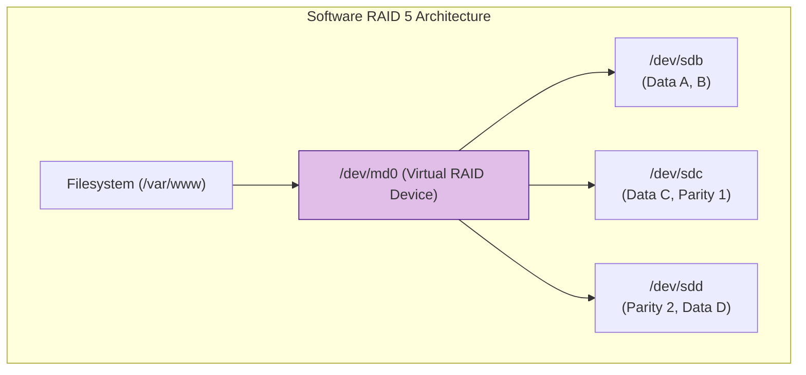
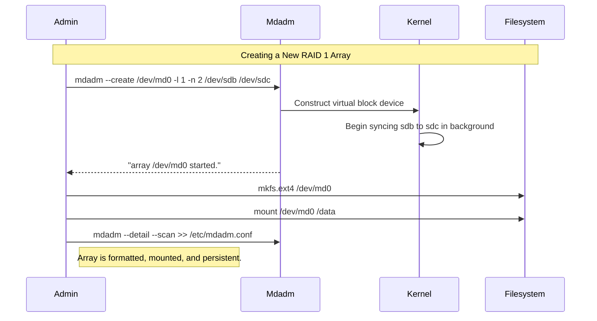

# CHAPTER 40 — RAID FUNDAMENTALS (MDADM)

---

## 1. Introduction

### Why This Topic Exists
Hard drives fail. It is not a matter of *if*, but *when*. If a company stores its central database on a single hard drive, a mechanical failure means total data loss and massive downtime while restoring from backups. **RAID (Redundant Array of Independent Disks)** solves this by combining multiple cheap hard drives into a single logical unit. Depending on how they are combined, RAID can survive the catastrophic failure of one or more drives without losing a single byte of data, while also vastly improving read and write speeds.

### Why Linux Administrators Use It
Administrators configure RAID to ensure High Availability (HA) at the hardware level. While enterprise datacenters usually use expensive Hardware RAID controllers, Linux includes a robust Software RAID system managed by the `mdadm` utility. Administrators use `mdadm` to build software RAID arrays, monitor drive health, and hot-swap failed drives without shutting down the server.

### Why Companies Care About It
Business Continuity. If a physical disk dies in a RAID 1 or RAID 5 array on a production web server, the web server keeps running. The users don't notice anything. The administrator simply receives an alert, walks into the datacenter, pulls out the red-blinking dead drive, pushes in a new one, and the Linux kernel automatically rebuilds the data in the background while the company continues making money.

---

## 2. Learning Objectives

By the end of this chapter, you will be able to:
- Differentiate between Hardware RAID and Software RAID.
- Understand the core RAID levels: RAID 0, RAID 1, RAID 5, and RAID 10.
- Create a Software RAID array using the `mdadm` command.
- Monitor the health and synchronization status of an array (`/proc/mdstat`).
- Simulate a drive failure and successfully swap it out for a spare drive.
- Configure RAID to persist across reboots (`mdadm.conf`).

---

## 3. Beginner-Friendly Explanation

Think of storing important documents:
- **No RAID (Single Disk):** You have one notebook. If you spill coffee on it, all your notes are gone.
- **RAID 0 (Striping):** You write half a sentence in Notebook A, and the other half in Notebook B. You can write twice as fast! But if you lose Notebook A, the remaining half-sentences in Notebook B are completely useless gibberish. (Fast, but dangerous).
- **RAID 1 (Mirroring):** You hire an assistant. Every time you write a sentence in your notebook, the assistant writes the exact same sentence in their notebook. It takes the same amount of time, but if you lose your notebook, you just take your assistant's notebook. (Safe, but you had to buy two notebooks to store one notebook's worth of data).
- **RAID 5 (Parity):** You have 3 notebooks. You write Part 1 in Notebook A, Part 2 in Notebook B, and in Notebook C, you write a mathematical equation (Parity) that describes the relationship between A and B. If you lose Notebook B, you use the math equation in C combined with the text in A to perfectly reconstruct B!

---

## 4. Core Theory

### 4.1 Hardware vs Software RAID
- **Hardware RAID:** A dedicated physical microchip (RAID Controller) inside the server handles the math. The Linux OS just sees one massive hard drive. Fast, but expensive, and you are locked into that vendor's hardware.
- **Software RAID (`mdadm`):** The Linux kernel (specifically the Multi-Disk `md` driver) handles the math using the server's main CPU. Highly flexible, completely free, and you can move the disks to any other Linux machine and they will still work.

### 4.2 Standard RAID Levels
1. **RAID 0 (Striping):** Minimum 2 disks. Data is split across all disks.
   - *Pros:* Massive speed boost (Read and Write). Full capacity used.
   - *Cons:* Zero redundancy. If one disk dies, ALL data is lost.
2. **RAID 1 (Mirroring):** Minimum 2 disks. Data is identically copied.
   - *Pros:* Can survive 1 disk failure. Fast read speeds.
   - *Cons:* 50% capacity penalty (Two 1TB drives only give you 1TB of usable space).
3. **RAID 5 (Striping with Distributed Parity):** Minimum 3 disks. Data and parity math are distributed across all drives.
   - *Pros:* Can survive 1 disk failure. Excellent read speeds. Highly cost-efficient capacity (N-1 drives of space).
   - *Cons:* Slower write speeds due to calculating parity math.
4. **RAID 10 (Stripe of Mirrors):** Minimum 4 disks. Combines the speed of RAID 0 with the safety of RAID 1.
   - *Pros:* Extremely fast reads/writes. Excellent fault tolerance (can survive 1 failure per mirror set).
   - *Cons:* 50% capacity penalty. Expensive. (The standard for high-performance databases).

---

## 5. Internal Working

### Parity and the XOR Operation
How does RAID 5 reconstruct lost data? It uses the logical XOR (Exclusive OR) operation.
Imagine binary data across 3 disks:
- Disk 1: `1`
- Disk 2: `0`
- Disk 3 (Parity): `1` (Because 1 XOR 0 = 1)

If Disk 2 dies, the kernel looks at Disk 1 (`1`) and Disk 3 (`1`). The only possible way the answer could be `1` is if the missing number was `0`. The kernel rebuilds the `0` onto a new replacement disk. This math is done millions of times per second.

---

## 6. Production Architecture



---

## 7. Command-by-Command Explanation

### 7.1 `mdadm --create`
- **Purpose:** Creates a new RAID array from raw disks.
- **Example:** `mdadm --create --verbose /dev/md0 --level=1 --raid-devices=2 /dev/sdb /dev/sdc`

### 7.2 `cat /proc/mdstat`
- **Purpose:** A virtual file that shows the real-time status, health, and synchronization progress of all software RAID arrays on the system.

### 7.3 `mdadm --detail /dev/md0`
- **Purpose:** Prints a highly detailed report of the array, including UUIDs, chunk sizes, and the status of individual physical member drives.

### 7.4 `mdadm --manage /dev/md0 --fail /dev/sdb`
- **Purpose:** Manually marks a disk as failed/faulty. Used for testing or safely removing a dying drive before it completely crashes.

### 7.5 `mdadm --manage /dev/md0 --remove /dev/sdb`
- **Purpose:** Logically removes the failed drive from the array so you can physically unplug it from the server.

### 7.6 `mdadm --manage /dev/md0 --add /dev/sde`
- **Purpose:** Adds a new, healthy drive into the array. The kernel will immediately begin syncing data onto this new drive.

---

## 8. Syntax Breakdown

```bash
mdadm --create /dev/md0 --level=5 --raid-devices=3 /dev/sdb /dev/sdc /dev/sdd
│      │       │        │         │                │
│      │       │        │         │                └── The raw physical disks to consume
│      │       │        │         └─────────────────── The number of active disks
│      │       │        └───────────────────────────── The RAID type (RAID 5)
│      │       └────────────────────────────────────── The name of the new virtual RAID device
│      └────────────────────────────────────────────── Action: Create array
└───────────────────────────────────────────────────── Command: Multiple Disk Admin
```

---

## 9. Parameter Explanation

| Command / File | Parameter | Description |
|:---|:---|:---|
| `mdadm --create` | `--spare-devices=1` | Assigns an extra disk as a "hot spare". If an active disk dies, the spare automatically takes over instantly. |
| `mdadm --detail` | `--scan` | Scans the system for arrays and outputs them in a format suitable for the config file. |
| `/etc/mdadm.conf` | | The configuration file. If this is not updated, the array might rename itself from `md0` to `md127` on reboot! |

---

## 10. Sample Output Analysis

**Scenario:** We want to check the health of our RAID 1 array.
**Command:** `cat /proc/mdstat`

**Output:**
```text
Personalities : [raid1] 
md0 : active raid1 sdc[1] sdb[0]
      10475520 blocks super 1.2 [2/2] [UU]
      
unused devices: <none>
```

**Analysis:**
- **active raid1:** The array is running normally as a mirror.
- **sdc[1] sdb[0]:** It is composed of `/dev/sdb` and `/dev/sdc`.
- **[2/2]:** The array expects 2 drives, and currently has 2 healthy drives attached.
- **[UU]:** Both drives are Up (`U`). If a drive failed, this would look like `[U_]`, indicating the second drive is missing or dead.

---

## 11. Architecture Diagram

```mermaid
graph LR
    subgraph The_Resync_Process_Drive_Replacement ["The Resync Process (Drive Replacement)"]
        MD0["/dev/md0 (RAID 1)"]
        SDB["/dev/sdb (Healthy)"]
        SDC["/dev/sdc (FAILED)"]
        SDE["/dev/sde (New Replacement)"]
        
        MD0 --> SDB
        MD0 -.x SDC
        
        SDE -.->|mdadm --add| MD0
        SDB -->|"Background Sync (Copying Data)"| SDE
    end
    style SDC fill:#ffcdd2,stroke:#c62828
    style SDE fill:#c8e6c9,stroke:#2e7d32
```

---

## 12. Workflow Diagram



---

## 13. Real Production Examples

### Hot Spare Auto-Recovery
A database server has 4 disks. The admin creates a RAID 5 array with 3 active disks and 1 "Hot Spare" sitting completely idle.
```bash
sudo mdadm --create /dev/md0 --level=5 --raid-devices=3 --spare-devices=1 /dev/sdb /dev/sdc /dev/sdd /dev/sde
```
Six months later, at 3:00 AM, `/dev/sdc` experiences a mechanical head crash. The kernel detects the I/O error. `mdadm` automatically marks `sdc` as faulty, boots it from the array, spins up the hot spare (`sde`), and immediately begins rebuilding the lost data using the parity math. The admin sleeps through the night, and only has to replace the physical dead drive the next morning.

### The Missing Config File Disaster
An admin creates `/dev/md0`, formats it, puts data on it, adds it to `/etc/fstab`, and reboots. The server fails to boot. Why? Because without an `/etc/mdadm.conf` file (and updating the initramfs), the kernel scans the drives at boot, discovers RAID metadata, but doesn't know what to call the array, so it defaults to `/dev/md127`. Because `fstab` is looking for `/dev/md0`, the boot fails.
**Always save the configuration:**
```bash
sudo mdadm --detail --scan | sudo tee -a /etc/mdadm/mdadm.conf
sudo update-initramfs -u  # (On Ubuntu/Debian)
sudo dracut -H -f         # (On RHEL/CentOS)
```
*(Alternatively, use UUIDs in `fstab` to avoid device naming issues altogether).*

---

## 14. Common Mistakes

1. **Ignoring RAID rebuild times** — If you replace a 16TB drive in a RAID 5 array, the rebuild process could take 3 to 4 days, severely impacting server performance. If a *second* drive dies during those 4 days, the entire array is destroyed. (This is why RAID 6 or RAID 10 is heavily preferred for large modern drives).
2. **Confusing RAID with Backups** — RAID is NOT a backup. RAID protects against *hardware failure*. If an administrator accidentally types `rm -rf /var/www/`, RAID will instantly and perfectly mirror that deletion across all drives. The data is gone. You still need offsite backups.
3. **Partitioning the RAID drives manually** — While you can partition `/dev/sdb1` and `/dev/sdc1` and build a RAID array out of the partitions, it is usually cleaner to give the entire raw disk (`/dev/sdb`) directly to `mdadm`.

---

## 15. Best Practices

- Use **RAID 10** for heavy database workloads. It provides the highest IOPS (Input/Output Operations Per Second) and avoids the heavy CPU parity calculation penalties of RAID 5.
- Always configure `mdadm` email alerts. A RAID 1 array surviving a drive failure doesn't help if nobody knows the drive died, and then the second drive dies a month later.
- Never use disks of different sizes in a traditional RAID array. The array size will be bottlenecked by the smallest drive (e.g., mixing a 1TB and 2TB drive in RAID 1 gives you exactly 1TB of usable space).

---

## 16. Security Considerations

- **Encryption on RAID:** If you require Full Disk Encryption (LUKS), the standard architecture is to build the RAID array first (`/dev/md0`), and then place the LUKS encryption layer on top of the virtual RAID device. This ensures the CPU encrypts the data once, and `mdadm` mirrors the encrypted blocks.

---

## 17. Performance Considerations

- **Chunk Size:** When creating a RAID 0, 5, or 10 array, data is striped into "chunks" (default 512KB). If you are storing massive video files, a larger chunk size improves sequential read speeds. If you are storing millions of tiny text files, a smaller chunk size improves random read speeds.

---

## 18. Troubleshooting Guide

| Symptom | Root Cause | Resolution |
|:---|:---|:---|
| `[U_]` in `/proc/mdstat` | A drive has failed or dropped out | Check `dmesg` for hardware errors. Replace drive. |
| Array named `/dev/md127` after reboot | Missing configuration | Save output of `mdadm --detail --scan` to `mdadm.conf` |
| `mdadm: device or resource busy` | Array is mounted | Unmount the filesystem before trying to stop the array |
| State shows `recovering` or `resyncing` | Normal rebuild operation | Wait for it to finish. Check progress in `mdstat`. |

---

## 19. Practical Labs

*(Requires 2 extra unformatted disks, e.g., `/dev/sdb` and `/dev/sdc`)*

**Lab 40.1:** Create a Mirror
```bash
sudo mdadm --create /dev/md0 --level=1 --raid-devices=2 /dev/sdb /dev/sdc
watch cat /proc/mdstat   # Watch the sync progress live (Ctrl+C to exit)
sudo mkfs.ext4 /dev/md0
sudo mkdir /mnt/raid
sudo mount /dev/md0 /mnt/raid
```

**Lab 40.2:** Simulate a Failure and Recovery
```bash
# 1. Manually fail a disk
sudo mdadm --manage /dev/md0 --fail /dev/sdc
cat /proc/mdstat   # Notice the [U_]

# 2. Remove it from the array
sudo mdadm --manage /dev/md0 --remove /dev/sdc

# 3. "Insert" a new drive (We'll just re-add sdc to simulate a new drive)
sudo mdadm --manage /dev/md0 --add /dev/sdc
cat /proc/mdstat   # Watch it rebuild automatically!
```

---

## 20. Mini Project

The Complete RAID Teardown.
You no longer need the RAID array and want to return the disks to the OS as raw storage. You must do this carefully.
1. Unmount the filesystem: `sudo umount /mnt/raid`
2. Stop the RAID array completely: `sudo mdadm --stop /dev/md0`
3. Erase the RAID metadata signatures from the physical disks (CRITICAL step, otherwise they will magically reform on reboot):
   `sudo mdadm --zero-superblock /dev/sdb /dev/sdc`
4. The disks are now clean, raw storage again.

---

## 21. Assignments

1. Explain why RAID 0 is the fastest RAID level but the most dangerous.
2. What is the mathematical concept used by RAID 5 to reconstruct lost data from a dead drive?
3. What file must be updated to ensure your array retains its name (like `md0`) across reboots?

---

## 22. Interview Questions

### Basic
1. **Q: What command do you run to quickly check the health and sync status of all Software RAID arrays on a Linux server?**
   A: `cat /proc/mdstat`

2. **Q: How many drive failures can a standard RAID 5 array survive without losing data?**
   A: One.

### Intermediate
3. **Q: You have four 1TB hard drives. You need maximum read/write performance for a database, but you also require hardware redundancy. Which RAID level do you choose, and what will be your total usable capacity?**
   A: I would choose RAID 10 (Stripe of Mirrors). It provides excellent IOPS performance and can survive a drive failure. The usable capacity will be 2TB (a 50% penalty).

4. **Q: What is a "Hot Spare"?**
   A: A hot spare is an extra, healthy physical disk plugged into the server that is assigned to a RAID array but sits completely idle. If an active disk in the array fails, `mdadm` automatically removes the dead disk and activates the hot spare, immediately beginning the rebuild process without requiring an administrator to physically visit the datacenter.

### Scenario-Based
5. **Q: You receive a PagerDuty alert at 2:00 AM that a disk `/dev/sdc` in your RAID 1 array (`/dev/md0`) has failed. The server is still running. You walk into the datacenter with a replacement disk. Walk me through the exact CLI steps you take to safely replace the disk without causing downtime.**
   A: 
   1. First, I explicitly mark the failing disk as faulty in software: `mdadm --manage /dev/md0 --fail /dev/sdc`.
   2. I remove it logically from the array: `mdadm --manage /dev/md0 --remove /dev/sdc`.
   3. I physically pull the dead drive from the server and slide the new one in.
   4. Assuming the new drive registers as `/dev/sdc`, I add it to the array: `mdadm --manage /dev/md0 --add /dev/sdc`.
   5. I run `watch cat /proc/mdstat` to verify that the kernel has begun resyncing the data to the new drive in the background. The server remains online the entire time.

---

## 23. Chapter Summary and Quick Revision Notes

- **RAID 0:** Striping. Fast, no redundancy, uses 100% space.
- **RAID 1:** Mirroring. 1-disk fault tolerance, uses 50% space.
- **RAID 5:** Striping with Parity. 1-disk fault tolerance, N-1 space. (Slow rebuilds).
- **RAID 10:** Stripe of Mirrors. Very fast, great fault tolerance, uses 50% space.
- **mdadm:** The Linux Software RAID management tool.
- `/proc/mdstat`: The virtual file to check real-time RAID health.
- **NEVER** forget to save your array configuration to `/etc/mdadm.conf`.
- RAID is for high availability, **NOT** a replacement for off-site backups.

---

## 24. Cheat Sheet

| Command | Purpose |
|:---|:---|
| `mdadm --create /dev/md0 -l 1 -n 2 /dev/sdb /dev/sdc` | Create RAID 1 array |
| `cat /proc/mdstat` | View RAID health and sync status |
| `mdadm --detail /dev/md0` | View detailed array metadata |
| `mdadm --manage /dev/md0 --fail /dev/sdc` | Mark disk as failed |
| `mdadm --manage /dev/md0 --remove /dev/sdc` | Remove disk from array |
| `mdadm --manage /dev/md0 --add /dev/sde` | Add new replacement disk |
| `mdadm --stop /dev/md0` | Deactivate array |
| `mdadm --zero-superblock /dev/sdb` | Wipe RAID signature from disk |
