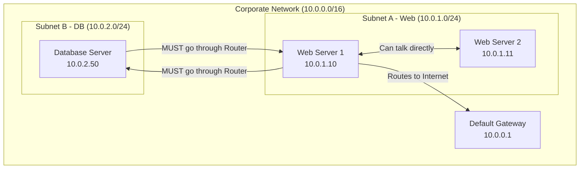
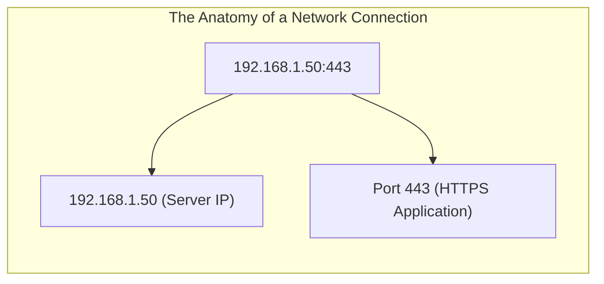
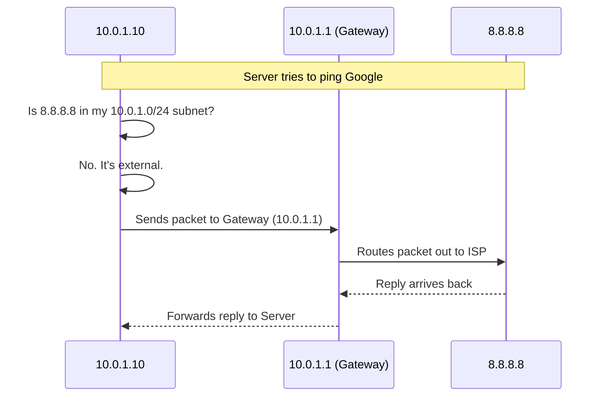

# CHAPTER 41 — NETWORK CONFIGURATION BASICS (IP AND SUBNETS)

---

## 1. Introduction

### Why This Topic Exists
A server without a network connection is just a noisy space heater. For a Linux server to serve web pages, process database queries, or accept SSH connections, it must be properly configured to communicate over the network. This requires assigning it a unique address (IP Address), defining which neighborhood it belongs to (Subnet Mask), and telling it how to reach the outside world (Default Gateway).

### Why Linux Administrators Use It
System administrators constantly troubleshoot connectivity issues. When a web server suddenly goes offline, the administrator must determine if the server lost its IP address, if the subnet mask is misconfigured, or if the server is trying to send traffic to the wrong router. Understanding the absolute fundamentals of IP networking is a prerequisite for any advanced troubleshooting.

### Why Companies Care About It
Security and Architecture. Companies divide their massive networks into smaller subnets. They might put the Web Servers in one subnet and the Database Servers in a completely different, highly secure subnet. If a Linux administrator doesn't understand subnets, they might accidentally configure a database server on the public web subnet, instantly exposing customer data to the open internet.

---

## 2. Learning Objectives

By the end of this chapter, you will be able to:
- Explain the purpose of MAC addresses, IP addresses, Subnet Masks, and Gateways.
- Differentiate between IPv4 and IPv6.
- Calculate basic subnets using CIDR notation (e.g., `/24`, `/16`).
- Understand the difference between Public, Private, and Loopback IP addresses.
- Identify common network ports and protocols (TCP vs UDP).

---

## 3. Beginner-Friendly Explanation

Think of sending a physical letter through the postal service:
- **The MAC Address:** Your Social Security Number. It is permanently burned into you at birth. It never changes, no matter where you move.
- **The IP Address:** Your current street address. If you move to a new house (a new network), your address changes.
- **The Subnet Mask:** Your ZIP Code. It tells the mailman which houses belong to your specific neighborhood.
- **The Default Gateway:** The local Post Office. If you want to send a letter to someone in your own neighborhood (same subnet), you can just walk over and hand it to them. If you want to send a letter to another city (a different subnet), you *must* drop it off at the Post Office (Gateway). They handle routing it out of your neighborhood.

---

## 4. Core Theory

### 4.1 IPv4 (Internet Protocol version 4)
An IPv4 address is a 32-bit number, usually written as four decimals separated by dots (e.g., `192.168.1.50`). Each decimal is an "octet" ranging from 0 to 255.
Because the world ran out of IPv4 addresses in 2011, IPv6 (a 128-bit address using hexadecimal letters and numbers) is slowly replacing it.

### 4.2 The Subnet Mask
An IP address is split into two parts: The **Network ID** (the neighborhood) and the **Host ID** (the specific house). The Subnet Mask determines where the split happens.
- Example IP: `192.168.1.50`
- Example Mask: `255.255.255.0`
This mask tells the computer: "The first three numbers (`192.168.1`) are the Network ID. The last number (`50`) is the Host ID."

### 4.3 CIDR Notation
Writing `255.255.255.0` is tedious. Modern Linux uses **CIDR (Classless Inter-Domain Routing)** notation. It simply counts how many binary "1"s are in the subnet mask.
- `255.255.255.0` equals exactly 24 binary ones. So it is written as **`/24`**.
- An IP address is written as: `192.168.1.50/24`.

### 4.4 Private vs Public IP Addresses
To save IPv4 space, certain IP ranges are reserved for internal use only. These are called **Private IP Addresses** (RFC 1918). They cannot be routed over the public internet.
- `10.0.0.0` to `10.255.255.255`
- `172.16.0.0` to `172.31.255.255`
- `192.168.0.0` to `192.168.255.255`
If a server has one of these, it must use NAT (Network Address Translation) via a router to talk to the internet.

### 4.5 The Loopback Address
Every Linux server has a virtual network interface called `lo` (Loopback). Its IP address is always `127.0.0.1`. It points back to the server itself. This allows a database running on the server to securely talk to a web server running on the exact same server without the traffic ever leaving the physical network card.

---

## 5. Internal Working

### TCP vs UDP
When data leaves the IP layer, it uses a transport protocol.
- **TCP (Transmission Control Protocol):** Like making a phone call. The server says "Hello?" and waits for the client to say "I'm here!" before sending data. If a data packet gets lost, TCP retransmits it. Highly reliable (used for Web, SSH, Databases).
- **UDP (User Datagram Protocol):** Like shouting into a megaphone. The server just blasts data out. It doesn't check if the client received it. Very fast, but unreliable (used for Live Video Streaming, DNS).

---

## 6. Production Architecture



---

## 7. Concept-by-Concept Explanation

*(Since this chapter is theoretical, we focus on interpreting network configurations).*

### 7.1 Understanding `/24` Subnets
If a server is assigned `192.168.10.50/24`:
- The Network ID is `192.168.10.0`.
- The Broadcast Address (used to yell to everyone in the neighborhood) is `192.168.10.255`.
- The usable IPs for servers are `192.168.10.1` through `192.168.10.254` (Exactly 254 hosts).

### 7.2 The Gateway's Job
If server `192.168.10.50` wants to talk to `8.8.8.8` (Google):
1. The server compares `8.8.8.8` to its subnet mask (`/24`).
2. It realizes `8.8.8.8` is NOT in the `192.168.10` network.
3. Therefore, it cannot send the packet directly.
4. It looks at its routing table, finds the Default Gateway (e.g., `192.168.10.1`), and throws the packet to the Gateway. "I don't know where this is, you deal with it."

### 7.3 Ports
An IP address gets a packet to the right server. A **Port** gets the packet to the right *application* on that server.
- Port 22: SSH (Remote administration)
- Port 80: HTTP (Unencrypted web)
- Port 443: HTTPS (Encrypted web)
- Port 3306: MySQL Database

---

## 8. Syntax Breakdown

*(N/A - See Chapter 42 for the actual `ip` and `nmcli` command syntax).*

---

## 9. Parameter Explanation

### Common CIDR Subnets
| CIDR | Subnet Mask | Total Usable Hosts | Common Use Case |
|:---|:---|:---|:---|
| `/8` | `255.0.0.0` | 16.7 Million | Massive ISP or Fortune 500 WAN |
| `/16` | `255.255.0.0` | 65,534 | AWS VPC (Virtual Private Cloud) base |
| `/24` | `255.255.255.0` | 254 | Standard office LAN or specific cloud subnet |
| `/32` | `255.255.255.255`| 1 (A single host) | Firewall rules pointing to one specific server |

---

## 10. Sample Output Analysis

**Scenario:** We check our IP address (using the `ip addr` command).

**Output:**
```text
2: eth0: <BROADCAST,MULTICAST,UP,LOWER_UP> mtu 1500 qdisc fq_codel state UP
    link/ether 00:1a:2b:3c:4d:5e brd ff:ff:ff:ff:ff:ff
    inet 192.168.1.100/24 brd 192.168.1.255 scope global eth0
```

**Analysis:**
- **eth0:** The name of the network interface (Ethernet 0).
- **link/ether:** `00:1a:2b:3c:4d:5e` is the physical MAC address burned into the network card.
- **inet:** `192.168.1.100` is the IPv4 address.
- **/24:** The subnet mask (255.255.255.0).
- **brd:** The broadcast address is `192.168.1.255`.

---

## 11. Architecture Diagram



---

## 12. Workflow Diagram



---

## 13. Real Production Examples

### IP Whitelisting (The /32 rule)
A database server (`10.0.2.50`) is highly secured. The firewall is configured to block ALL traffic. The administrator adds a rule: "Allow traffic from `10.0.1.10/32`".
The `/32` mask mathematically specifies exactly one, single IP address. This means only the web server (`10.0.1.10`) is allowed to talk to the database. All other servers in the `10.0.1.x` neighborhood are blocked.

### The Missing Gateway
An administrator configures a server with the IP `192.168.1.50/24` but forgets to configure the Gateway.
- The administrator can SSH into the server from their laptop (which is on `192.168.1.25`).
- However, when the administrator tries to run `dnf update` or `ping google.com`, it instantly fails with "Network is unreachable." Without a gateway, the server is trapped in its own subnet and cannot reach the internet.

---

## 14. Common Mistakes

1. **Confusing Public and Private IPs** — A junior admin might assign `8.8.8.8` to a test server in the lab. This breaks the network because when other servers in the lab try to reach Google DNS, the local network routes the traffic to the junior admin's test server instead. Always use Private IP ranges (e.g., `10.x.x.x`) for internal servers.
2. **Subnet Mask Mismatches** — Server A is configured as `192.168.1.10/24`. Server B is accidentally configured as `192.168.1.11/16`. They might be able to talk to each other sometimes, but Server B's routing will be severely broken when trying to talk to other networks. All servers in the same VLAN must have the exact same subnet mask.

---

## 15. Best Practices

- Servers should almost always have **Static IP Addresses**. If a database server uses DHCP (Dynamic IPs) and reboots, it might get a new IP address. The web servers won't know the new IP, and the entire application will crash.
- Document your subnets meticulously. Using an IPAM (IP Address Management) tool prevents assigning the same static IP to two different servers (IP Conflict).

---

## 16. Security Considerations

- **Private IPs do not secure you from internal threats.** If a hacker breaches an employee's laptop on the `10.0.x.x` network, they can scan for servers on the `10.0.x.x` network. You must still use local firewalls (like `iptables` or `firewalld`) and strong passwords even if the server doesn't have a public internet IP.

---

## 17. Performance Considerations

- **Broadcast Storms:** If you configure a massive flat network (e.g., `/16` with 65,000 servers), every time one server sends an ARP broadcast (asking "Who has this IP?"), 65,000 servers have to process it. This can consume 20% of the CPU just listening to network noise. Always divide large networks into smaller `/24` subnets to contain broadcast traffic.

---

## 18. Troubleshooting Guide

*(Practical troubleshooting commands will be covered in Chapter 46. This section focuses on theory).*

| Symptom | Root Cause Theory |
|:---|:---|
| Server can ping neighbors, but cannot ping internet | Missing or incorrect Default Gateway |
| Server cannot ping neighbors | Wrong subnet mask, or wrong VLAN assigned to the network switch port |
| Two servers randomly drop offline and come back | IP Conflict (Two servers have the same Static IP) |

---

## 19. Practical Labs

*(Mental exercises for IP math)*

**Lab 41.1:** Subnet Identification
You are given the IP `172.16.5.100` with a subnet mask of `255.255.255.0` (`/24`).
- What is the Network ID? (Answer: `172.16.5.0`)
- Is the IP `172.16.6.100` in the same network? (Answer: No, the third octet is different, and the mask locks the first 3 octets).

**Lab 41.2:** Loopback testing
From any Linux terminal, ping yourself:
`ping 127.0.0.1`
(This proves your local TCP/IP networking stack is functioning, even if your physical network cable is unplugged).

---

## 20. Mini Project

Map a Web Request.
Imagine you type `https://10.0.1.50` into your browser.
1. The packet leaves your computer, hitting port **443** (HTTPS) on the server.
2. The server's network card receives the packet because its **MAC address** matched.
3. The kernel accepts the packet because the **IP address** (`10.0.1.50`) matched.
4. The kernel looks at the **Port** (443) and routes the data to the Nginx application listening on that port.
5. Nginx prepares the webpage.
6. The server realizes your IP is outside its **Subnet**, so it sends the webpage reply to its **Default Gateway**, which routes it back to your computer.

---

## 21. Assignments

1. What is the difference between an IP address and a MAC address?
2. What does the `/24` mean at the end of `192.168.1.100/24`?
3. Why do servers use the loopback address (`127.0.0.1`)?

---

## 22. Interview Questions

### Basic
1. **Q: What is the purpose of a Subnet Mask?**
   A: It determines which portion of an IP address represents the Network (the neighborhood) and which portion represents the Host (the specific machine).

2. **Q: What port does SSH use by default?**
   A: Port 22 (TCP).

### Intermediate
3. **Q: A server is configured with the IP `10.5.5.50` and a mask of `255.255.255.0`. Can it communicate directly with a server at `10.5.6.50` without a router?**
   A: No. The `255.255.255.0` (or `/24`) mask means the first three octets must match perfectly to be on the same network. `10.5.5` does not match `10.5.6`. The traffic must be sent to a router.

4. **Q: Explain the difference between TCP and UDP.**
   A: TCP is connection-oriented; it guarantees delivery and ordering of packets, making it highly reliable but slightly slower (used for HTTP, SSH). UDP is connectionless; it just fires packets at the destination without checking if they arrived, making it extremely fast but unreliable (used for DNS, Video Streaming).

### Scenario-Based
5. **Q: You deploy a new database server. You configure its static IP address, subnet mask, and start the database service. You successfully ping the database server from a web server located in the exact same rack. However, the application servers in AWS cannot connect to it, and you cannot ping Google from the database server. What did you most likely forget to configure?**
   A: I most likely forgot to configure the Default Gateway. Because the web server is in the same rack (same subnet), the database server can use ARP to talk to it directly. But to reach AWS or Google (different subnets/internet), the server needs to know the IP of the local router to forward the traffic. Without a Default Gateway, the server simply drops the packets destined for outside networks.

---

## 23. Chapter Summary and Quick Revision Notes

- **IP Address:** Logical, changeable address (Where you are).
- **MAC Address:** Physical, burned-in address (Who you are).
- **Subnet Mask (`/24`):** Defines the boundaries of your local network.
- **Default Gateway:** The router that handles traffic destined for *other* networks.
- **Private IPs:** Non-routable on the internet (e.g., `10.x.x.x`, `192.168.x.x`).
- **Loopback (`127.0.0.1`):** The internal virtual network pointing back to the server itself.
- **TCP:** Reliable, error-checked connection.
- **UDP:** Fast, unchecked broadcast.
- **Ports:** Direct traffic to specific applications (e.g., 80=HTTP, 22=SSH).

---

## 24. Cheat Sheet

| Concept | Standard Value / Example |
|:---|:---|
| `/24` Subnet Mask | `255.255.255.0` (254 usable IPs) |
| `/16` Subnet Mask | `255.255.0.0` (65,534 usable IPs) |
| Localhost / Loopback| `127.0.0.1` |
| Private IP Ranges | `10.0.0.0/8`, `172.16.0.0/12`, `192.168.0.0/16` |
| TCP Port 22 | SSH (Secure Shell) |
| TCP Port 80 / 443 | HTTP / HTTPS (Web Servers) |
| TCP Port 3306 | MySQL Database |
| UDP Port 53 | DNS (Domain Name System) |
