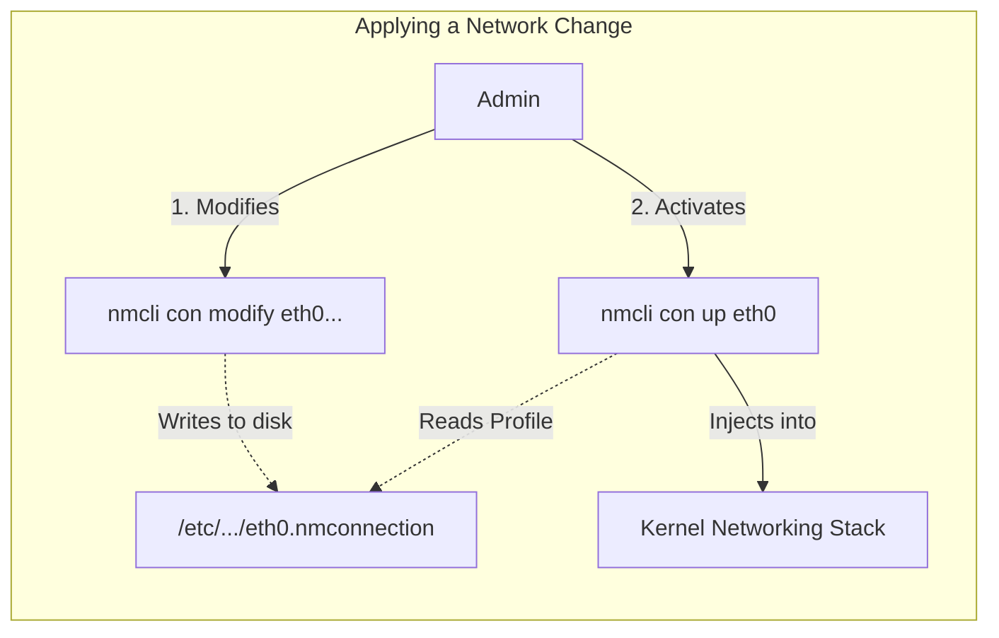
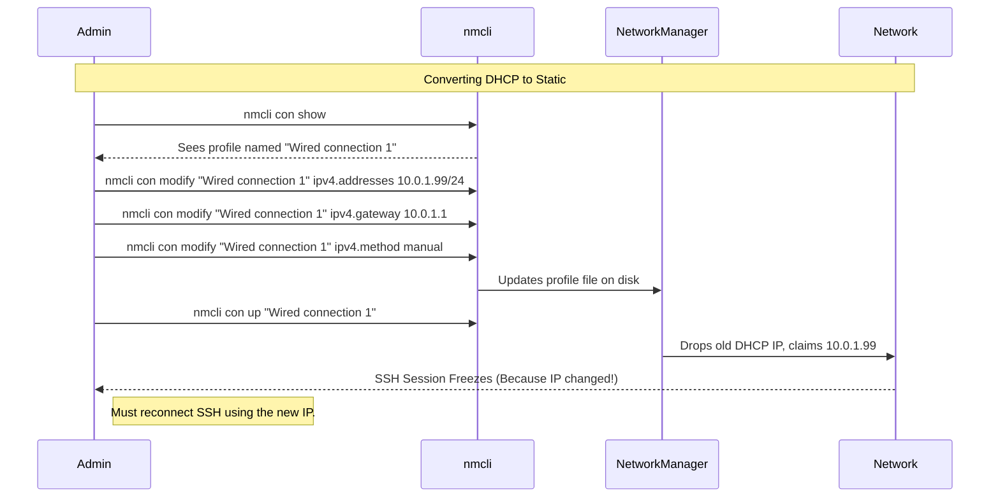

# CHAPTER 42 — NETWORK CONFIGURATION TOOLS (IP, NMCLI, NMTUI)

---

## 1. Introduction

### Why This Topic Exists
In the previous chapter, we learned the theory behind IP addresses and Gateways. In this chapter, we apply that theory. Historically, Linux administrators used tools like `ifconfig` to configure networks. Today, `ifconfig` is completely obsolete. Modern Linux relies on the `ip` command for instant, temporary network changes, and NetworkManager (`nmcli` / `nmtui`) for persistent network configuration.

### Why Linux Administrators Use It
When a server boots up and fails to get an IP address from DHCP, it falls off the network. An administrator must plug in a physical crash cart (monitor and keyboard) or use an out-of-band management console (like iLO or iDRAC), log in, and use `nmcli` to manually assign a static IP address so the server can rejoin the corporate network.

### Why Companies Care About It
Standardization and Automation. In an enterprise datacenter with 5,000 servers, administrators do not click through graphical menus to configure IP addresses. They use the command-line tool `nmcli` because it can be scripted and automated by tools like Ansible or Terraform, ensuring every server is deployed with a perfectly accurate static IP, Subnet, and Gateway in seconds.

---

## 2. Learning Objectives

By the end of this chapter, you will be able to:
- Explain why `ifconfig` is deprecated in favor of the `ip` command.
- View and temporarily assign IP addresses using `ip addr`.
- Use NetworkManager's Text User Interface (`nmtui`) for easy configuration.
- Use NetworkManager's Command Line Interface (`nmcli`) for scriptable configuration.
- Assign a static IP address, gateway, and DNS server persistently across reboots.

---

## 3. Beginner-Friendly Explanation

Configuring a network in Linux has two layers:
1. **The Kernel Layer (`ip` command):** This is like writing your new address on a sticky note and slapping it on your chest. It works immediately, everyone sees it, but the moment you go to sleep (reboot), the sticky note falls off and you forget the address.
2. **The Manager Layer (NetworkManager / `nmcli`):** This is the DMV (Department of Motor Vehicles). You go to the DMV, fill out official paperwork, and they print your new address on your Driver's License. Every time you wake up (reboot), you check your license and remember your address. The DMV then automatically slaps the sticky note on your chest for you.

To make a permanent change, you must talk to the Manager (`nmcli`), not just the Kernel (`ip`).

---

## 4. Core Theory

### 4.1 The Deprecation of `ifconfig`
For 20 years, `ifconfig` (part of the `net-tools` package) was the standard. It is now deprecated because it does not support modern Linux kernel networking features (like advanced policy routing or network namespaces). The `iproute2` package (which provides the `ip` command) replaces it entirely.
*If you type `ifconfig` on a modern RHEL 9 server, you will get "command not found". Stop using it.*

### 4.2 NetworkManager
NetworkManager is a background daemon (`systemctl status NetworkManager`) that controls all networking on modern Red Hat/CentOS/Fedora systems (and optionally on Ubuntu).
It manages **Connections** (the saved profiles containing your IP/Gateway) and applies them to **Devices** (the physical network cards like `eth0`).

### 4.3 Interface Naming Conventions
In the past, the first network card was always `eth0`. Today, systemd uses "Predictable Network Interface Names" based on the physical hardware slot on the motherboard.
- `enp3s0`: **E**ther**n**et, **P**CI bus **3**, **S**lot **0**.
- `ens192`: **E**ther**n**et, **S**lot **192** (Common in VMware virtual machines).
This prevents interface names from randomly swapping if you add a new PCI card.

---

## 5. Internal Working

### Connections vs Devices in NetworkManager
This is a crucial concept to grasp.
- **The Device (`enp3s0`):** The physical piece of plastic and silicon plugged into the motherboard.
- **The Connection (`static-profile-1`):** A text file sitting in `/etc/NetworkManager/system-connections/` that says "IP: 10.0.0.5, Gateway: 10.0.0.1".

You can have 5 different Connections (profiles) saved on the server, but only one Connection can be "Active" on the Device at a time. When you use `nmcli`, you are usually modifying the Connection profile, not the Device directly.

---

## 6. Production Architecture

```mermaid
graph TD
    subgraph Persistent_Networking_NetworkManager ["Persistent Networking (NetworkManager)"]
        NM["NetworkManager Daemon"]
        File["/etc/NetworkManager/.../eth0.nmconnection"]
        CLI["nmcli (Command Line)"]
        TUI["nmtui (Text Menu)"]
        
        CLI -->|Edits| File
        TUI -->|Edits| File
        File -->|Read by| NM
        NM -->|Applies config to| Kernel
    end
    
    subgraph Temporary_Networking_iproute2 ["Temporary Networking (iproute2)"]
        IPCMD["ip addr add..."]
        Kernel["Linux Kernel (RAM)"]
        
        IPCMD -->|Bypasses NM, edits directly| Kernel
        Note over IPCMD,Kernel: Lost on Reboot!
    end
```

---

## 7. Command-by-Command Explanation

### 7.1 `ip addr show` (or just `ip a`)
- **Purpose:** Replaces `ifconfig`. Shows all network interfaces, their MAC addresses, and current IP addresses.

### 7.2 `nmtui`
- **Purpose:** Opens a colorful, arrow-key-driven graphical menu in the terminal. Excellent for beginners who need to set a static IP quickly without memorizing `nmcli` syntax.

### 7.3 `nmcli connection show`
- **Purpose:** Lists all saved connection profiles. Shows which profiles are currently active (green) and which device they are attached to.

### 7.4 `nmcli device status`
- **Purpose:** Lists all physical hardware network cards and shows if NetworkManager is currently managing them.

### 7.5 `nmcli connection up "System eth0"`
- **Purpose:** Activates a connection profile. If you made changes to the IP address, you must run this command to force NetworkManager to apply the changes to the live system.

---

## 8. Syntax Breakdown

**Setting a Static IP with NMCLI**

```bash
nmcli connection modify eth0 ipv4.addresses 192.168.1.50/24 ipv4.gateway 192.168.1.1 ipv4.method manual
│     │          │      │    │                          │            │           │           │
│     │          │      │    │                          │            │           │           └── Turn off DHCP (make it static)
│     │          │      │    │                          │            │           └── The Default Gateway
│     │          │      │    │                          │            └── The Gateway property
│     │          │      │    │                          └── The Static IP and Subnet mask
│     │          │      │    └── The IP Address property
│     │          │      └── The name of the connection profile (often matches device name)
│     │          └───────── Action: modify an existing profile
│     └──────────────────── Object: We are working with Connections (profiles)
└────────────────────────── Utility: NetworkManager CLI
```
*(After modifying, you must run `nmcli connection up eth0` to apply it).*

---

## 9. Parameter Explanation

| Command | Parameter | Description |
|:---|:---|:---|
| `ip` | `link` | Show layer 2 info only (MAC addresses, Interface UP/DOWN state) |
| `ip` | `route` | Show the routing table (displays the Default Gateway) |
| `nmcli` | `con add` | Create a brand new connection profile from scratch |
| `nmcli` | `con del` | Delete a saved connection profile permanently |
| `nmcli` | `ipv4.dns` | Property to set the DNS server (e.g., `8.8.8.8`) |

---

## 10. Sample Output Analysis

**Scenario:** We check our IP address using the modern command.
**Command:** `ip a`

**Output:**
```text
1: lo: <LOOPBACK,UP,LOWER_UP> mtu 65536 qdisc noqueue state UNKNOWN group default qlen 1000
    link/loopback 00:00:00:00:00:00 brd 00:00:00:00:00:00
    inet 127.0.0.1/8 scope host lo
       valid_lft forever preferred_lft forever
2: ens192: <BROADCAST,MULTICAST,UP,LOWER_UP> mtu 1500 qdisc fq_codel state UP group default qlen 1000
    link/ether 00:50:56:b9:22:98 brd ff:ff:ff:ff:ff:ff
    inet 10.0.1.50/24 brd 10.0.1.255 scope global dynamic noprefixroute ens192
       valid_lft 86290sec preferred_lft 86290sec
```

**Analysis:**
- **Interface 1 (`lo`):** The loopback interface for internal server communication.
- **Interface 2 (`ens192`):** The VMware virtual network card.
- **state UP:** The physical (or virtual) network cable is plugged in and active. (If it said `DOWN`, the cable is unplugged).
- **inet 10.0.1.50/24:** The assigned IPv4 address and subnet mask.
- **dynamic:** This keyword is critical. It means this IP address was assigned automatically by a DHCP server, NOT statically configured by an admin.

---

## 11. Architecture Diagram



---

## 12. Workflow Diagram



---

## 13. Real Production Examples

### The Temporary Fix (`ip`)
A production database server (`10.0.2.50`) is actively serving clients. An administrator accidentally configured the wrong Subnet Mask (`/16` instead of `/24`). Fixing it via `nmcli` and restarting the interface (`nmcli con up`) will drop all active database connections for a few seconds. Instead, the admin uses `ip` to fix it live in RAM with zero downtime, and then updates `nmcli` later during a maintenance window.
```bash
# Add the correct IP/Mask dynamically to the running interface
sudo ip addr add 10.0.2.50/24 dev eth0
# Remove the bad one
sudo ip addr del 10.0.2.50/16 dev eth0
```

### Scripting with `nmcli`
A DevOps engineer is writing a bash script to provision 50 new web servers. They cannot use `nmtui` because it requires human interaction. They use `nmcli`.
```bash
# Inside provision.sh
# Assume $1 is the IP passed to the script (e.g., 10.0.1.51)
nmcli con modify eth0 ipv4.addresses $1/24
nmcli con modify eth0 ipv4.gateway 10.0.1.1
nmcli con modify eth0 ipv4.dns 8.8.8.8
nmcli con modify eth0 ipv4.method manual
nmcli con up eth0
```

---

## 14. Common Mistakes

1. **Forgetting `nmcli con up`** — This is the #1 mistake beginners make. They run `nmcli con modify`, they check `ip a`, and they are confused why the IP hasn't changed. `modify` ONLY edits the text file on the hard drive. You must bounce the connection (`con up`) for NetworkManager to apply the file to the live system.
2. **Locking yourself out via SSH** — If you SSH into a server at `192.168.1.50`, and you use `nmcli` to change its IP to `192.168.1.99`, the moment you hit Enter on `nmcli con up`, your SSH terminal will permanently freeze. The server is fine, but it just threw away the IP address you were connected to. You must open a new terminal and SSH into `.99`.
3. **Using `ifconfig` in scripts** — Do not write bash scripts that parse the output of `ifconfig`. It may not be installed on modern minimal servers, breaking your automation. Parse `ip a` instead.

---

## 15. Best Practices

- While `nmtui` is easy, force yourself to learn `nmcli`. In a job interview, saying "I use the graphical `nmtui` menu" marks you as a junior. Typing the `nmcli` commands proves you can automate infrastructure.
- If you accidentally delete a connection profile, don't panic. You can always tell NetworkManager to regenerate a default DHCP profile by running: `nmcli dev connect eth0`.
- In RHEL 9 and modern Ubuntu, the actual network config files are stored in `/etc/NetworkManager/system-connections/` as INI-style files (e.g., `eth0.nmconnection`). You *can* edit these with `vim`, but if you do, you must run `nmcli con reload` for NM to notice your manual edits.

---

## 16. Security Considerations

- NetworkManager profiles contain sensitive data (especially Wi-Fi passwords, or 802.1x enterprise authentication secrets). For this reason, the files in `/etc/NetworkManager/system-connections/` are strictly locked down to `chmod 600` (root read/write only).

---

## 17. Performance Considerations

- For standard servers, NetworkManager has virtually zero performance overhead. However, on extremely high-performance edge routers or load balancers pushing 40 Gigabits per second, some administrators disable NetworkManager and rely entirely on `systemd-networkd` or direct kernel routing to strip away all user-space abstraction layers.

---

## 18. Troubleshooting Guide

| Symptom | Root Cause | Resolution |
|:---|:---|:---|
| `ip a` shows no IP address on eth0 | Interface is down or DHCP failed | Run `nmcli dev connect eth0` or check cable (`ip link`) |
| `nmcli: command not found` | NetworkManager isn't installed | (Debian/Ubuntu specific). Use `netplan` instead of `nmcli` |
| IP changed via `nmcli modify`, but `ip a` shows old IP | Changes not applied | Run `nmcli con up <profile_name>` |
| `nmcli con up` fails immediately | Syntax error in IP or missing Gateway | Review settings with `nmcli con show <profile>` |

---

## 19. Practical Labs

**Lab 42.1:** Exploration with `ip`
```bash
ip link              # View MAC addresses
ip addr              # View IPs
ip route             # View Default Gateway (Look for "default via")
```

**Lab 42.2:** Setting a Static IP with `nmtui` (Beginner)
1. Type `sudo nmtui` in the terminal.
2. Select "Edit a connection" -> Select your interface (e.g., eth0) -> Edit.
3. Change IPv4 from `<Automatic>` to `<Manual>`.
4. Select `<Show>` to expand the menu.
5. Add an IP (e.g., `10.0.2.100/24`), Gateway, and DNS server.
6. Scroll to `<OK>`, quit the tool.
7. Restart the network to apply: `sudo systemctl restart NetworkManager`.

**Lab 42.3:** Setting a Static IP with `nmcli` (Enterprise)
*(Warning: Only do this in a VM console, not over SSH, or you will disconnect yourself!)*
```bash
sudo nmcli con show
# Identify the active connection name, e.g., "eth0"
sudo nmcli con modify "eth0" ipv4.addresses 192.168.1.200/24
sudo nmcli con modify "eth0" ipv4.gateway 192.168.1.1
sudo nmcli con modify "eth0" ipv4.method manual
sudo nmcli con up "eth0"
ip a   # Verify the new static IP is applied!
```

---

## 20. Mini Project

The Temporary Alias.
You have a web server running on `192.168.1.50`. You are migrating a legacy application that hardcodes the IP `192.168.1.99`. You can assign a second IP address to the same network card instantly without dropping the main IP.
1. Run `ip a` and identify your interface (e.g., `eth0`).
2. Add the alias dynamically:
   `sudo ip addr add 192.168.1.99/24 dev eth0`
3. Verify: `ip a`. You will see `eth0` now has TWO `inet` lines.
4. Try to ping `.99` from another machine; it works!
5. Note: Because you used the `ip` command, this alias will vanish on reboot.

---

## 21. Assignments

1. Why is the `ifconfig` command no longer recommended?
2. What is the difference between the `ip addr add` command and the `nmcli con modify` command regarding reboots?
3. What is the exact purpose of the `nmcli con up` command?

---

## 22. Interview Questions

### Basic
1. **Q: How do you find the IP address of a modern Linux server?**
   A: By running `ip addr` or `ip a`.

2. **Q: You prefer a graphical menu to set an IP address, but you don't have a desktop environment (GUI) installed. What tool can you use?**
   A: `nmtui` (NetworkManager Text User Interface).

### Intermediate
3. **Q: Explain the relationship between a Device and a Connection in NetworkManager.**
   A: A Device (like `eth0`) is the physical hardware interface. A Connection (like `static-profile-1`) is a logical configuration profile (containing the IP, subnet, etc.). You can create multiple Connection profiles, but only one can be bound/active on a Device at any given time.

4. **Q: You write a bash script containing the command `nmcli con modify eth0 ipv4.addresses 10.0.0.50/24`. You run the script, and it returns no errors. However, the server still has its old IP. What is missing from your script?**
   A: The script is missing `nmcli con up eth0` (or restarting NetworkManager). The `modify` command only updates the configuration file on the disk; it does not push the changes to the live kernel network stack.

### Scenario-Based
5. **Q: You are hired to manage an infrastructure of 500 Ubuntu and RHEL servers. The previous admin used `nmtui` manually on every server. You want to automate IP assignments using Ansible. Which tool will you use in your Ansible playbooks: `ip`, `nmtui`, or `nmcli`, and why?**
   A: I will use `nmcli`. I cannot use `nmtui` because it requires interactive human keystrokes in a terminal. I cannot use `ip` because the changes will be lost the next time the servers reboot. `nmcli` is the only tool that is fully scriptable via the command line and makes persistent configuration changes to the disk.

---

## 23. Chapter Summary and Quick Revision Notes

- `ifconfig` is dead. Use `ip`.
- `ip a`: View IP addresses.
- `ip link`: View MAC addresses.
- **Temporary Config:** `ip addr add 10.0.0.5/24 dev eth0` (Lost on reboot).
- **Persistent Config:** Uses NetworkManager (`nmcli` or `nmtui`).
- **NetworkManager layers:** Profiles (Connections) are applied to Hardware (Devices).
- **nmcli modify:** Edits the profile file on the hard drive.
- **nmcli con up:** Pushes the profile file into live RAM to activate it.
- **Warning:** Changing your IP over SSH will instantly kill your SSH session.

---

## 24. Cheat Sheet

| Command | Purpose |
|:---|:---|
| `ip a` | View IP configuration |
| `ip route` | View the routing table (Default Gateway) |
| `nmtui` | Open the graphical network config menu |
| `nmcli con show` | List all network profiles |
| `nmcli dev status` | List all physical network cards |
| `nmcli con modify eth0 ipv4.method manual` | Disable DHCP (Static) |
| `nmcli con modify eth0 ipv4.addresses 10.0.1.5/24`| Set Static IP |
| `nmcli con up eth0` | Apply the new settings immediately |
