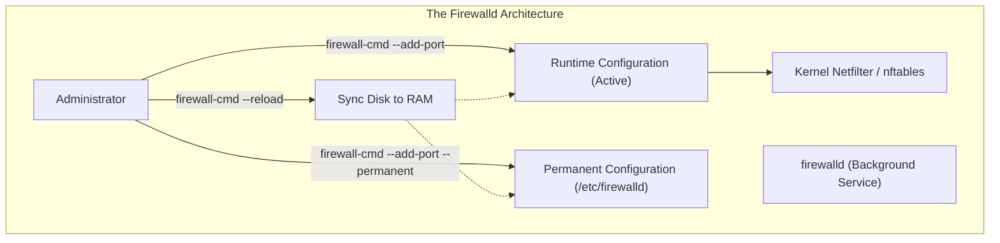
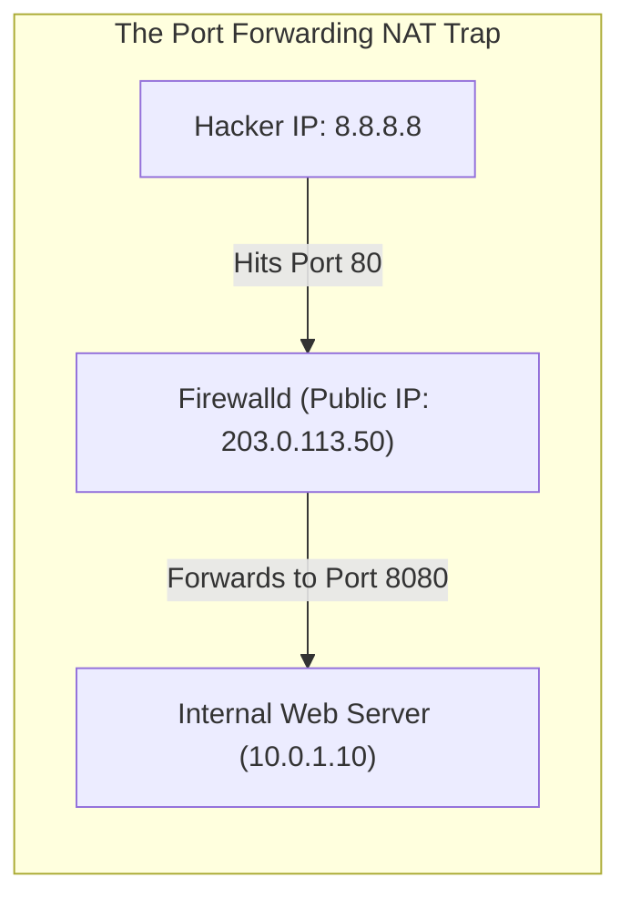
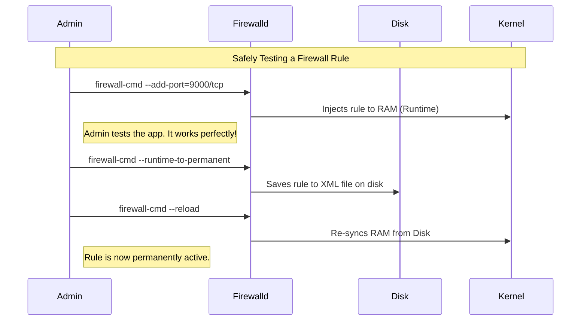

# CHAPTER 45 — FIREWALLD AND IPTABLES

---

## 1. Introduction

### Why This Topic Exists
A Linux server connected to the internet is constantly under attack. Automated bots scan every IP address on earth, looking for open ports (like SSH or HTTP) to launch brute-force password attacks or exploit vulnerabilities. A **Firewall** acts as a security guard at the door of your server, inspecting every piece of incoming and outgoing network traffic. If traffic does not meet specific security rules, the firewall silently drops it into the trash.

### Why Linux Administrators Use It
Linux administrators use firewalls to implement the principle of "Default Deny". When an administrator installs a new database on a server, that database might automatically listen on Port 3306 on all network interfaces, exposing it to the entire company or the internet. The administrator must explicitly configure the firewall to allow traffic to Port 3306, and strictly limit it so only the Web Server's IP address can connect.

### Why Companies Care About It
Compliance and Defense in Depth. Even if a corporate datacenter has massive, million-dollar hardware firewalls (like Palo Alto or Cisco) protecting the perimeter, companies still demand that every individual Linux server runs its own local firewall (`firewalld`). If a hacker manages to breach the perimeter, local firewalls stop the hacker from moving laterally from server to server inside the network.

---

## 2. Learning Objectives

By the end of this chapter, you will be able to:
- Explain the evolution from `iptables` to `firewalld` to `nftables`.
- Understand the concept of Firewalld "Zones" (Public, Internal, DMZ).
- Open and close network ports and services using `firewall-cmd`.
- Differentiate between temporary (runtime) firewall rules and permanent rules.
- Implement rich rules to block or allow specific IP addresses.
- Perform a port forwarding operation (NAT).

---

## 3. Beginner-Friendly Explanation

Think of a VIP nightclub:
- **The Server:** The nightclub itself.
- **The Ports:** The different doors into the club (Port 80 is the front door, Port 22 is the VIP backdoor).
- **The Firewall:** The Bouncer standing outside.
- **The Zones:** Different rules for different doors.
  - The "Public Zone" rule: "Nobody gets in unless they are on the guest list (HTTP)."
  - The "Trusted Zone" rule: "If the owner of the club shows up, let them in immediately through any door."
- **Runtime vs Permanent:** If the club manager yells, "Let this guy in right now!" (Runtime), the bouncer lets him in tonight. But tomorrow, the bouncer forgets. If the manager writes the guy's name in the Official Guestbook (Permanent), the bouncer lets him in every single night forever.

---

## 4. Core Theory

### 4.1 The Kernel Netfilter Subsystem
Firewalls in Linux do not run as user-space applications; they operate deep inside the Linux Kernel using a framework called **Netfilter**. It intercepts packets the exact microsecond they arrive on the network card, before any application (like Apache or SSH) even knows they exist.

### 4.2 The Evolution of Tools
- **iptables:** The legendary, legacy tool used for 20 years to control Netfilter. It requires writing highly complex syntax and reading rules from top to bottom.
- **nftables:** The modern kernel replacement for `iptables`, featuring better performance and syntax.
- **firewalld:** A dynamic, user-friendly management daemon that sits *on top* of `nftables`/`iptables`. Instead of typing complex kernel rules, you tell `firewalld` "Allow HTTP", and it translates that into the complex `nftables` math for you. It is the default on RHEL, CentOS, and Fedora.
- **UFW (Uncomplicated Firewall):** The equivalent user-friendly wrapper used on Ubuntu.

### 4.3 Firewalld Zones
`firewalld` groups rules into "Zones" to assign different levels of trust to different network interfaces.
- **Drop:** Drops all incoming traffic silently. No reply.
- **Block:** Rejects all incoming traffic with an ICMP "Prohibited" message.
- **Public:** The default zone. Does not trust the network. Only explicitly allowed ports (like SSH) get through.
- **Internal / Trusted:** Trusts the network completely. Allows almost all traffic (used for backend server-to-server networks).

### 4.4 Runtime vs Permanent
- **Runtime Configuration:** Takes effect instantly in RAM. Lost if the server reboots or if `firewalld` is restarted.
- **Permanent Configuration:** Saved to the hard drive in `/etc/firewalld/`. Does *not* take effect immediately. You must reload the firewall to push permanent rules into RAM.

---

## 5. Internal Working

### Stateful Inspection
Modern Linux firewalls are "Stateful". If you run `curl google.com`, your server sends a request out to Google. Google's web server sends a response back to your server. 
Why didn't your firewall block Google's incoming response? 
Because the firewall remembers the "State" of the connection. It logged that *you* initiated the outbound connection, so it dynamically punches a temporary hole in the firewall to allow Google's response back in. Once the connection closes, the hole seals.

---

## 6. Production Architecture



---

## 7. Command-by-Command Explanation

### 7.1 `firewall-cmd --state`
- **Purpose:** Checks if the firewalld daemon is running. (If not, run `systemctl start firewalld`).

### 7.2 `firewall-cmd --get-active-zones`
- **Purpose:** Shows which Zones are currently attached to which network interfaces. By default, `eth0` is attached to `public`.

### 7.3 `firewall-cmd --list-all`
- **Purpose:** Prints a highly detailed list of all rules, services, and ports allowed in the default zone.

### 7.4 `firewall-cmd --add-service=http`
- **Purpose:** Temporarily opens Port 80. (Lost on reboot).

### 7.5 `firewall-cmd --add-port=8080/tcp --permanent`
- **Purpose:** Permanently opens TCP Port 8080. (Not active until reloaded).

### 7.6 `firewall-cmd --reload`
- **Purpose:** Takes the permanent rules saved on disk and applies them to the live kernel RAM, wiping out any temporary runtime rules.

---

## 8. Syntax Breakdown

```bash
firewall-cmd --zone=public --add-source=10.5.5.50/32 --permanent
│            │             │                  │        │
│            │             │                  │        └── Save to disk (survives reboot)
│            │             │                  └─────────── The exact IP address to whitelist
│            │             └────────────────────────────── Action: Allow traffic coming from this IP
│            └──────────────────────────────────────────── The Zone to apply this rule to
└───────────────────────────────────────────────────────── Command: Firewalld CLI
```

---

## 9. Parameter Explanation

| Command | Parameter | Description |
|:---|:---|:---|
| `firewall-cmd` | `--remove-service=http` | Closes the port associated with the HTTP service. |
| `firewall-cmd` | `--runtime-to-permanent`| Takes all your current live, temporary rules and saves them to disk permanently. (Excellent for testing safely). |
| `firewall-cmd` | `--panic-on` | Instantly drops ALL network traffic (including SSH!). Used to quarantine a server if you realize it is actively being hacked. |

---

## 10. Sample Output Analysis

**Scenario:** We want to see what traffic is allowed through our server.
**Command:** `firewall-cmd --list-all`

**Output:**
```text
public (active)
  target: default
  icmp-block-inversion: no
  interfaces: eth0
  sources: 
  services: cockpit dhcpv6-client ssh http https
  ports: 3306/tcp 8080/tcp
  protocols: 
  forward: yes
  masquerade: no
  forward-ports: 
  source-ports: 
  icmp-blocks: 
  rich rules: 
        rule family="ipv4" source address="192.168.1.100" drop
```

**Analysis:**
- **interfaces: eth0:** This zone governs traffic arriving on the `eth0` card.
- **services:** The firewall translates human names (like `http`) to port numbers (80). It is currently allowing SSH, HTTP, and HTTPS.
- **ports:** The administrator also manually opened TCP ports 3306 (MySQL) and 8080.
- **rich rules:** The administrator added a specific security rule to explicitly drop/block any traffic coming from the hacker IP `192.168.1.100`.

---

## 11. Architecture Diagram


*Port Forwarding (NAT): Firewalld can intercept traffic arriving on Port 80, alter the destination IP and Port, and forward it to a backend server hidden inside the corporate network.*

---

## 12. Workflow Diagram



---

## 13. Real Production Examples

### The "Oh No" Lockout
A junior administrator attempts to tighten security. They remove the SSH service permanently and reload the firewall.
```bash
sudo firewall-cmd --remove-service=ssh --permanent
sudo firewall-cmd --reload
```
The instant they hit enter on `--reload`, their SSH session freezes. They have locked themselves completely out of the server. The only way to fix it is to log into the hypervisor (VMware/AWS Console), open a virtual monitor, log in locally, and re-add the SSH service.

### Whitelisting a Specific IP (Rich Rules)
A database must be exposed on Port 3306, but it should only accept connections from the Web Server (`10.0.1.10`). Exposing it to everyone is a massive security risk.
```bash
sudo firewall-cmd --add-rich-rule='rule family="ipv4" source address="10.0.1.10" port port="3306" protocol="tcp" accept' --permanent
sudo firewall-cmd --reload
```
Anyone else trying to connect to 3306 will be silently dropped.

### Port Forwarding
You want to host a web server on Port 80, but the web application runs as a normal user (not root). In Linux, non-root users cannot bind to ports below 1024. So, the app runs on Port 8080. You use the firewall to redirect Port 80 traffic to Port 8080 seamlessly.
```bash
sudo firewall-cmd --add-forward-port=port=80:proto=tcp:toport=8080 --permanent
sudo firewall-cmd --reload
```

---

## 14. Common Mistakes

1. **Forgetting `--permanent`** — You spend 20 minutes adding rules for a new application. Everything works. Three months later, the server reboots for a kernel patch. When it comes back up, the application is broken. Because you didn't use `--permanent`, all your rules evaporated from RAM on reboot.
2. **Forgetting `--reload`** — You add 5 rules using `--permanent`. You try to access the application, but it's blocked. You stare at the screen confused. `--permanent` *only writes to the hard drive*. It does not inject the rule into live RAM. You must run `firewall-cmd --reload` to activate them.
3. **Using both `iptables` and `firewalld`** — If you try to manually write `iptables` rules while the `firewalld` daemon is running, they will conflict and overwrite each other, causing massive chaos. Pick one management tool and stick to it.

---

## 15. Best Practices

- Use the **Test-Then-Save** methodology. Add your rules *without* the `--permanent` flag first. Test your application. If it breaks your SSH session or destroys connectivity, just restart the firewalld service (`systemctl restart firewalld`) and the bad rule vanishes. If the rule works perfectly, run `firewall-cmd --runtime-to-permanent` to safely lock it in.
- Use Services instead of Ports when possible. Typing `--add-service=http` is much easier for the next administrator to read in the config file than `--add-port=80/tcp`.

---

## 16. Security Considerations

- **Default Zone Danger:** By default, physical interfaces are assigned to the `public` zone. If you add a second network card and connect it to the internet, but accidentally assign it to the `trusted` zone, you have just bypassed all firewall rules for the entire internet, fully exposing the server. Always verify zone assignments using `firewall-cmd --get-active-zones`.

---

## 17. Performance Considerations

- **Logging Dropped Packets:** By default, firewalld does not log dropped packets (because internet bots scan ports thousands of times a minute, which would fill up your hard drive with useless logs). If you are troubleshooting why a legitimate application is failing, you can temporarily enable panic logging (`firewall-cmd --set-log-denied=all`), check `/var/log/messages`, and then turn it off immediately.

---

## 18. Troubleshooting Guide

| Symptom | Root Cause | Resolution |
|:---|:---|:---|
| Application unreachable, `ping` works | Firewall is blocking the specific port | Check `--list-all`. Add the port if missing. |
| Rule added, but still blocked | Rule not in RAM | Did you use `--permanent` but forget `--reload`? |
| Server locked up, SSH disconnected | Removed SSH from active zone | Use Hypervisor console to re-add SSH. |
| Cannot add port (`firewallD is not running`) | Daemon is dead | `systemctl start firewalld` |

---

## 19. Practical Labs

**Lab 45.1:** Basic Service Management
```bash
sudo firewall-cmd --state
sudo firewall-cmd --list-all
# Temporarily open HTTP
sudo firewall-cmd --add-service=http
sudo firewall-cmd --list-all   # Notice http is there
# Restart firewall
sudo systemctl restart firewalld
sudo firewall-cmd --list-all   # Notice http is GONE (It wasn't permanent)
```

**Lab 45.2:** Permanent Rules
```bash
# Open port 8080 permanently
sudo firewall-cmd --add-port=8080/tcp --permanent
sudo firewall-cmd --list-all   # Notice 8080 is NOT there yet!
# Apply it
sudo firewall-cmd --reload
sudo firewall-cmd --list-all   # Now it is active.
```

---

## 20. Mini Project

The Panic Button.
Imagine you are tailing the web server logs and realize you are actively being hit by a massive DDoS attack or a hacker attempting to exploit a vulnerability. You need to sever the server from the network instantly without pulling the physical power plug.
1. Enable Panic Mode:
   `sudo firewall-cmd --panic-on`
   *(WARNING: Doing this over SSH will disconnect you instantly! Do this in a local VM console).*
2. Try to ping the server, or ping *from* the server to `google.com`. Every single packet is dropped. The server is completely isolated in a digital cage.
3. Once the threat is mitigated or you are ready to resume:
   `sudo firewall-cmd --panic-off`
4. Network connectivity is instantly restored.

---

## 21. Assignments

1. What is the difference between a Runtime rule and a Permanent rule in `firewalld`?
2. If you execute a command with `--permanent`, what additional command MUST you run to make it take effect?
3. What is the fundamental difference between the `drop` zone and the `block` zone? (Hint: Does the sender receive a reply?)

---

## 22. Interview Questions

### Basic
1. **Q: How do you list all active firewall rules on a RHEL server?**
   A: `firewall-cmd --list-all`

2. **Q: How do you permanently open TCP port 443 (HTTPS)?**
   A: `firewall-cmd --add-port=443/tcp --permanent` followed by `firewall-cmd --reload`.

### Intermediate
3. **Q: You want to test a complex firewall rule, but you are afraid it might lock you out of SSH. How should you apply it safely?**
   A: I should apply the rule *without* the `--permanent` flag. This applies it as a runtime rule. If it breaks my connection and locks me out, I can simply restart the server (or ask a colleague to run `systemctl restart firewalld` from the console). The bad rule will be wiped from RAM, and I can reconnect. If it works perfectly, I can run `firewall-cmd --runtime-to-permanent` to save it safely.

4. **Q: What is the underlying kernel technology that `firewalld` configures?**
   A: Netfilter (specifically via `nftables` or legacy `iptables`).

### Scenario-Based
5. **Q: A developer installs a custom application running on Port 9090. They ask you to open the firewall. You run `firewall-cmd --add-port=9090/tcp --permanent` and `firewall-cmd --reload`. You run `--list-all` and verify the port is open. However, the developer still cannot connect from their laptop. You run `ping` and confirm the server is reachable. What is the most likely cause?**
   A: If the firewall port is definitely open and network routing is working (ping), the issue is almost certainly with the application itself. The application might be configured to listen only on `localhost` (`127.0.0.1`) instead of all interfaces (`0.0.0.0`), meaning it rejects external connections regardless of the firewall. I would run `ss -tulpn | grep 9090` to verify which IP the application is actually bound to.

---

## 23. Chapter Summary and Quick Revision Notes

- **Netfilter:** The kernel packet filtering engine.
- **Firewalld:** The user-friendly management daemon.
- **Zones:** Determine trust levels (e.g., `public`, `trusted`, `drop`).
- **Runtime:** Active in RAM, lost on reboot.
- **Permanent:** Saved to disk, requires `--reload` to activate.
- **`--runtime-to-permanent`:** The safest way to test rules before saving them.
- **Rich Rules:** Complex rules for specific IP filtering and NAT.

---

## 24. Cheat Sheet

| Command | Purpose |
|:---|:---|
| `firewall-cmd --list-all` | View active rules |
| `firewall-cmd --add-service=http` | Open port 80 (Temporary) |
| `firewall-cmd --add-port=8080/tcp --permanent` | Open custom port (Persistent) |
| `firewall-cmd --remove-port=8080/tcp --permanent`| Close custom port |
| `firewall-cmd --reload` | Apply permanent rules to live RAM |
| `firewall-cmd --runtime-to-permanent` | Save active temp rules to disk |
| `firewall-cmd --panic-on` | Drop ALL traffic instantly |
