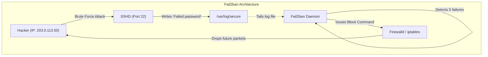
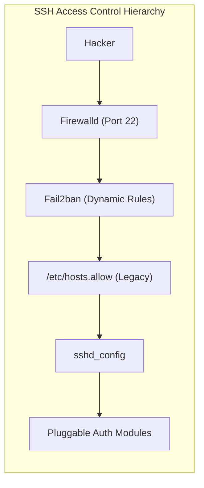
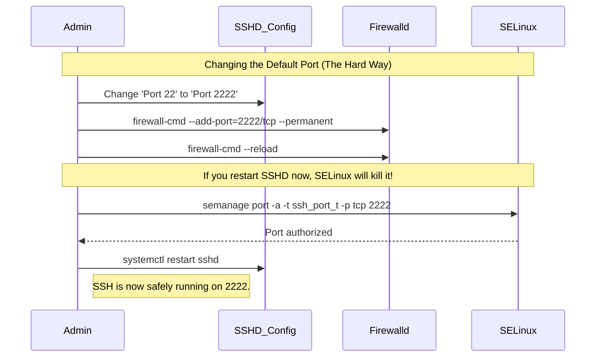

# CHAPTER 48 — SECURING SSH (HARDENING, FAIL2BAN, PORT KNOCKING)

---

## 1. Introduction

### Why This Topic Exists
While SSH encrypts data in transit, the `sshd` service listening on Port 22 is the single largest attack vector on any Linux server. Within 60 seconds of attaching a Linux server to the public internet, automated botnets will find it and begin launching thousands of brute-force password guesses per hour against Port 22. Standard out-of-the-box SSH configurations are not designed to withstand this constant assault.

### Why Linux Administrators Use It
Linux administrators must proactively "harden" the SSH service. This involves editing configuration files to disable dangerous default behaviors (like allowing `root` to log in directly), and installing secondary defense tools (like `fail2ban`) to dynamically block IP addresses that are acting maliciously.

### Why Companies Care About It
Preventing System Compromise. If an employee uses a weak password like `company123` and SSH password authentication is enabled, a botnet will guess the password within hours. The hacker gains full access to the server, installs ransomware, and pivots into the corporate network. Proper SSH hardening eliminates this risk entirely, ensuring that even if a password is stolen, the attacker cannot log in.

---

## 2. Learning Objectives

By the end of this chapter, you will be able to:
- Disable `root` login and Password Authentication in `sshd_config`.
- Change the default SSH port to avoid automated script-kiddie scanners.
- Limit SSH access to specific users or groups.
- Install and configure `fail2ban` to automatically block brute-force attacks.
- Understand advanced obfuscation techniques like Port Knocking.

---

## 3. Beginner-Friendly Explanation

Think of a medieval castle (The Server) and its main gate (Port 22).
- **Default SSH:** The main gate is on the main road. Anyone can walk up, bang on the door, and try to guess the password. They can stand there all night guessing 10,000 times until they get it right.
- **Hardening (`sshd_config`):** 
  - *No Root Login:* The King (`root`) is banned from opening the gate himself. A normal guard must open it, and then go get the King.
  - *No Passwords:* The door no longer accepts passwords. It only accepts physical cryptographic keys.
  - *Changing Ports:* Moving the main gate off the main road and hiding it in the bushes (Port 2222).
- **Fail2ban:** A sniper on the castle wall. If someone bangs on the door and fails to provide the right key 5 times in a row, the sniper shoots them (blocks their IP address at the firewall level), so they can't even touch the door anymore.

---

## 4. Core Theory

### 4.1 The `sshd_config` Hardening Checklist
Hardening SSH is simply a matter of toggling settings in `/etc/ssh/sshd_config`. The industry standard (CIS Benchmarks) demands three immediate changes:
1. `PermitRootLogin no`: Hackers know the user `root` always exists. They just have to guess the password. By disabling root login, they must guess BOTH a random username (like `jsmith`) AND the password, making it exponentially harder.
2. `PasswordAuthentication no`: Passwords can be brute-forced. Cryptographic keys cannot. 
3. `AllowUsers` / `AllowGroups`: By default, any valid user on the system can SSH in. You can restrict this so only members of the `wheel` or `admin` group are allowed.

### 4.2 Fail2ban
`fail2ban` is an intrusion prevention software framework. It operates by reading log files (like `/var/log/secure` or the systemd journal). It uses Regular Expressions (RegEx) to look for the phrase "Failed password for...". If it sees the same IP address fail 5 times within 10 minutes, it automatically issues a `firewalld` command to block that IP address for a set amount of time (e.g., 24 hours). 

### 4.3 Port Knocking (Security through Obscurity)
Port knocking is an extreme stealth technique. The firewall completely drops all traffic to Port 22. The server looks dead. However, a daemon listens to the firewall logs. If it sees a specific, secret sequence of "knocks" (e.g., a ping on port 7000, then 8000, then 9000 within 2 seconds), the daemon instantly alters the firewall to open Port 22, but *only* for the specific IP address that performed the secret knock.

---

## 5. Internal Working

### The Danger of Changing the Default Port
Changing `Port 22` to `Port 2222` stops 90% of automated botnet "noise" because bots are lazy and only scan Port 22 to save time. However, it does **not** stop a targeted attack. A human hacker using `nmap` will scan all 65,535 ports on your server, discover that SSH is hiding on 2222, and attack it anyway. Security professionals call this "Security through Obscurity." It cleans up your log files, but it is not actual security. (Disabling passwords is actual security).

---

## 6. Production Architecture



---

## 7. Command-by-Command Explanation

### 7.1 Editing `/etc/ssh/sshd_config`
- **Purpose:** We use `vim` or `nano` to edit the configuration file.

### 7.2 `PermitRootLogin no`
- **Purpose:** Denies direct login for the `root` user. You must log in as a standard user (like `admin`) and then use `sudo` or `su -` to elevate privileges.

### 7.3 `PasswordAuthentication no`
- **Purpose:** Forces Key-Based authentication. If a user tries to connect without an SSH key, the server instantly drops the connection without even prompting for a password.

### 7.4 `sshd -t`
- **Purpose:** (Reminder) Tests the configuration for syntax errors.

### 7.5 `systemctl reload sshd`
- **Purpose:** Applies the changes. (`reload` is preferred over `restart` because `reload` asks the daemon to re-read the config file without dropping currently active SSH connections).

---

## 8. Syntax Breakdown

**Fail2ban Jail Configuration (`/etc/fail2ban/jail.local`)**

```ini
[sshd]
enabled = true
port    = ssh
logpath = %(sshd_log)s
backend = %(sshd_backend)s
maxretry = 5
findtime = 600
bantime  = 86400
│          │
│          └── The duration of the ban (in seconds). 86400 = 24 hours.
└───────────── How many failures (maxretry) within this timeframe (600s = 10m) trigger a ban.
```

---

## 9. Parameter Explanation

| sshd_config Parameter | Description |
|:---|:---|
| `Port 2222` | Changes the listening port. (Requires you to also open 2222 in `firewalld` AND configure SELinux to allow it!) |
| `AllowUsers alice bob` | Only Alice and Bob can SSH in. Everyone else is rejected, even if they have the password. |
| `AllowGroups wheel` | Only members of the `wheel` (sudo) group can SSH in. Highly recommended for enterprise. |
| `ClientAliveInterval 300` | The server will ping the client every 300 seconds. If the client doesn't respond, the session is terminated. Prevents dead connections. |
| `ClientAliveCountMax 0` | If set to 0, combined with the above, it will auto-disconnect idle administrators after 300 seconds. |

---

## 10. Sample Output Analysis

**Scenario:** We check if `fail2ban` has caught any hackers.
**Command:** `sudo fail2ban-client status sshd`

**Output:**
```text
Status for the jail: sshd
|- Filter
|  |- Currently failed: 1
|  |- Total failed:     45
`- Actions
   |- Currently banned: 2
   |- Total banned:     3
   `- Banned IP list:   192.168.1.100 203.0.113.50
```

**Analysis:**
- **Currently failed: 1** — One person has recently failed a password, but hasn't hit the limit of 5 yet.
- **Total failed: 45** — Since the daemon started, it has seen 45 password failures in the log file.
- **Currently banned: 2** — Two IPs have been dynamically added to the firewall's "drop" list.
- **Banned IP list:** If you try to ping those IPs, or if they try to touch your server, the packets are dropped instantly by the kernel firewall before they even reach the SSH daemon.

---

## 11. Architecture Diagram


*Note: A connection must pass through every single layer of security. If it is blocked at any layer, the connection fails.*

---

## 12. Workflow Diagram



---

## 13. Real Production Examples

### The "Lockout" Recovery (Important!)
You enforce `PasswordAuthentication no`. You are logged in with your SSH key. A junior admin accidentally deletes the `~/.ssh/authorized_keys` file on the server. If you log out, you will never be able to get back in.
**Fix:** Before you log out, re-paste the public key into the file. Or, if you need a password temporarily, use `sudo vim /etc/ssh/sshd_config`, change it back to `PasswordAuthentication yes`, and run `systemctl reload sshd`.

### Unbanning an IP in Fail2ban
A legitimate developer forgot their passphrase, failed 5 times, and got banned. They are screaming that the server is down. You must unban their specific IP address manually.
```bash
sudo fail2ban-client set sshd unbanip 192.168.1.50
```

---

## 14. Common Mistakes

1. **Disabling Passwords before Keys are tested** — If you set `PasswordAuthentication no` on a brand new server before you have successfully proven that your SSH keys work, you will lock yourself out permanently. Always verify Key-based auth works in a separate terminal *before* turning off passwords.
2. **Forgetting SELinux when changing ports** — On RHEL/CentOS, SELinux maintains a strict list of allowed ports for specific services. It knows SSH belongs on 22. If you change `sshd_config` to 2222 and restart, SELinux blocks the daemon from starting because "SSH isn't allowed to bind to port 2222." You must update the SELinux policy using `semanage port`.
3. **Locking out Automation** — Many companies use Ansible for automation. Ansible uses SSH to connect to servers. If you set `AllowUsers alice bob`, you just blocked the `ansible` user, breaking your entire automation pipeline.

---

## 15. Best Practices

- **Never allow root login.** Every automated attack script on the planet tries to log in as `root`. If you disable it, those scripts fail instantly.
- **Use `fail2ban`.** It is lightweight and highly effective. Even if you use Key-based authentication (which bots can't guess), a botnet attacking Port 22 50,000 times a second can cause a Denial of Service (DoS) simply by exhausting the server's CPU and RAM. `fail2ban` stops the traffic at the firewall level, saving CPU cycles.
- Set up idle timeouts (`ClientAliveInterval 300`) to ensure administrators who leave their laptops open at a coffee shop don't leave active root shells exposed to the public.

---

## 16. Security Considerations

- **SSH Agent Forwarding:** Avoid using SSH Agent Forwarding (`ssh -A`) unless strictly necessary. If you forward your agent to a compromised "jump host" server, a root user on that jump host can hijack your local SSH keys and use them to log into other servers pretending to be you. Use `ProxyJump` (`ssh -J`) instead.

---

## 17. Performance Considerations

- **Fail2ban overhead:** By default, `fail2ban` tails log files using standard Python libraries. If a server is under a truly massive DDoS attack, the sheer volume of logs can cause `fail2ban` to consume 100% of the CPU just trying to read the text file. In extreme cases, hardware firewalls or cloud security groups (like AWS WAF) must handle the blocking before it reaches the Linux server.

---

## 18. Troubleshooting Guide

| Symptom | Root Cause | Resolution |
|:---|:---|:---|
| `Permission denied (publickey)` | Server rejecting password | You must provide an SSH key, or fix permissions on the server's `~/.ssh/` folder. |
| User cannot log in, but others can | User not in `AllowUsers` | Edit `sshd_config` and add them. |
| SSH hangs immediately | IP is blocked by Fail2ban | Run `fail2ban-client status sshd` and unban them. |
| `sshd` fails to start after changing port | SELinux blocked it | Run `semanage port -a -t ssh_port_t -p tcp <Port>` |

---

## 19. Practical Labs

**Lab 48.1:** Hardening the Config
1. Ensure your SSH key works first!
2. `sudo vim /etc/ssh/sshd_config`
3. Find `#PermitRootLogin yes` and change it to `PermitRootLogin no`.
4. Find `#PasswordAuthentication yes` and change it to `PasswordAuthentication no`.
5. Run `sudo sshd -t` to verify syntax.
6. Run `sudo systemctl reload sshd`.

**Lab 48.2:** Installing Fail2ban (Requires EPEL repo on RHEL)
```bash
# On Ubuntu: sudo apt install fail2ban
sudo dnf install epel-release -y
sudo dnf install fail2ban -y
sudo systemctl enable --now fail2ban
# Check the status of the SSH jail
sudo fail2ban-client status sshd
```

---

## 20. Mini Project

The Simulated Attack.
1. Ensure `fail2ban` is running on Server A.
2. Go to Server B. Try to SSH into Server A using a fake username and a password.
   `ssh fakeuser@ServerA`
3. Enter a random password. It will fail. Do this 5 times quickly.
4. On the 6th try, the command will simply hang (Timeout) instead of asking for a password.
5. Go to Server A. Run `sudo fail2ban-client status sshd`. You will see Server B's IP address in the Banned list.
6. Unban Server B: `sudo fail2ban-client set sshd unbanip <IP_of_Server_B>`

---

## 21. Assignments

1. Why is `PermitRootLogin no` considered one of the most critical security settings on a Linux server?
2. What does `fail2ban` actually do when it detects a brute-force attack in the log files?
3. What is the danger of changing the SSH port to 2222 on an SELinux-enforcing system?

---

## 22. Interview Questions

### Basic
1. **Q: You want to completely disable password logins and force all users to use cryptographic keys. What directive in `sshd_config` does this?**
   A: `PasswordAuthentication no`

2. **Q: A user typed their password wrong 6 times and now they cannot even ping the server. What software likely caused this?**
   A: `fail2ban`. It detected the failures and blocked their IP address at the firewall level.

### Intermediate
3. **Q: What is the difference between `systemctl restart sshd` and `systemctl reload sshd`, and which one should you use in production?**
   A: `restart` completely kills the `sshd` process and starts a new one. This can sever existing connections and drop the service temporarily. `reload` sends a SIGHUP signal to the daemon, instructing it to gracefully re-read the configuration file without dropping currently active SSH sessions. You should always use `reload` in production.

4. **Q: What is Port Knocking?**
   A: It is a stealth technique where a firewall blocks all access to a port (like 22). The administrator must send a specific sequence of network packets (knocks) to closed ports in a specific order. A daemon monitors the firewall logs for this exact sequence, and if it matches, it dynamically opens Port 22 for that administrator's IP address.

### Scenario-Based
5. **Q: You just joined a new company. You are tasked with hardening a public-facing web server. The senior admin says, "I already secured it. I changed the SSH port to 4444." Is this server secure? Why or why not, and what would you do differently?**
   A: The server is not secure. Changing the port (Security through Obscurity) only stops lazy automated scripts. It does not stop a targeted hacker who runs a full port scan (`nmap`), finds port 4444, and begins brute-forcing passwords. To actually secure the server, I would edit `sshd_config` to enforce `PasswordAuthentication no` (forcing SSH keys), set `PermitRootLogin no`, limit access via `AllowUsers`, and install `fail2ban` to block active scanners.

---

## 23. Chapter Summary and Quick Revision Notes

- **`sshd_config`:** The primary file to harden SSH.
- **`PermitRootLogin no`:** Forces attackers to guess both username and password.
- **`PasswordAuthentication no`:** Defeats brute-force password guessing entirely.
- **`AllowUsers / AllowGroups`:** Strictly limits who can even attempt to log in.
- **`fail2ban`:** Reads log files and dynamically blocks attacking IPs at the firewall.
- **Port Changing:** Reduces log noise but is not true security. Requires SELinux and Firewalld updates.
- Always use `sshd -t` and `systemctl reload sshd`.

---

## 24. Cheat Sheet

| Command / Config | Purpose |
|:---|:---|
| `PermitRootLogin no` | Disable direct root access |
| `PasswordAuthentication no` | Force SSH Key usage |
| `AllowGroups admin` | Restrict access to a specific group |
| `sudo sshd -t` | Verify config file syntax |
| `sudo systemctl reload sshd` | Apply changes safely |
| `sudo fail2ban-client status sshd`| View banned IPs |
| `sudo fail2ban-client set sshd unbanip <IP>` | Manually unban an IP |
