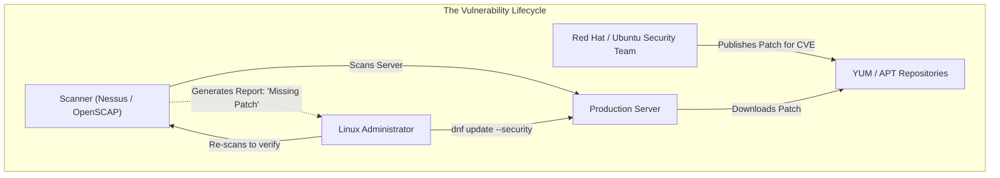
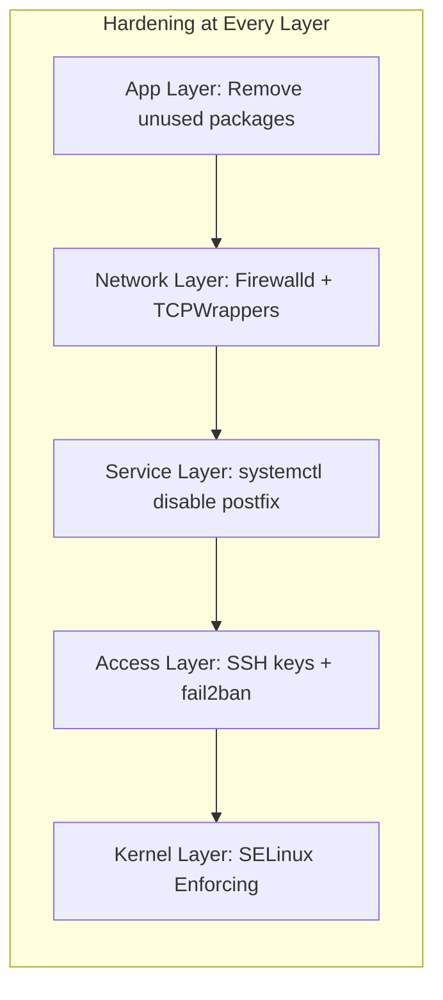
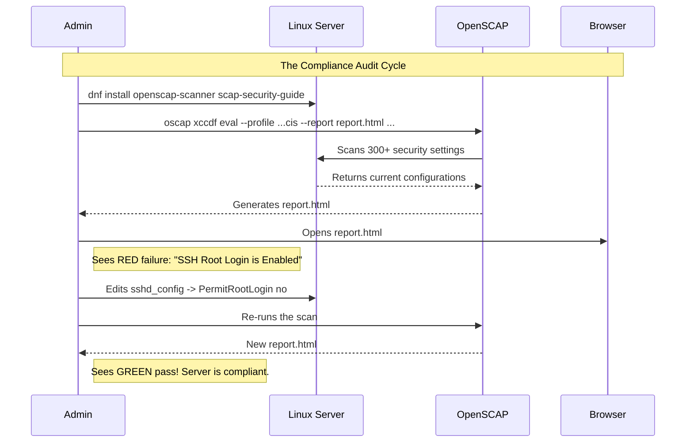

# CHAPTER 52 — VULNERABILITY SCANNING AND OS HARDENING BASICS

---

## 1. Introduction

### Why This Topic Exists
Installing a Linux server is easy. Keeping it secure is a continuous, never-ending battle. Every day, security researchers and hackers discover new vulnerabilities (CVEs) in software that is already running on millions of servers. If an administrator installs a server and never touches it again, it will inevitably be compromised. **OS Hardening** is the proactive process of shrinking the server's attack surface. **Vulnerability Scanning** is the reactive process of finding out if the server is missing critical security patches.

### Why Linux Administrators Use It
Administrators use hardening frameworks (like CIS Benchmarks) to systematically disable unused services, tighten file permissions, and secure network stacks. They run automated scanning tools (like OpenSCAP or Nessus) to generate reports that tell them exactly which packages are vulnerable and need immediate updating.

### Why Companies Care About It
Liability and Reputation. If a company suffers a data breach and customer data is stolen, they will be sued. If forensic investigators determine that the breach was caused by a known vulnerability that the company simply forgot to patch for 6 months, the company is found negligent and faces massive fines. Regular vulnerability scanning and strict OS hardening prove to auditors that the company is performing its due diligence.

---

## 2. Learning Objectives

By the end of this chapter, you will be able to:
- Understand the concept of the "Attack Surface".
- Explain the role of CVEs (Common Vulnerabilities and Exposures).
- Implement basic OS Hardening principles (Disabling services, minimizing software).
- Use OpenSCAP to automatically scan a Linux system against security compliance profiles.
- Read an OpenSCAP HTML report and remediate the failures.

---

## 3. Beginner-Friendly Explanation

Think of a medieval castle (The Server):
- **The Attack Surface:** This is how many doors and windows the castle has. A castle with 50 doors is easy to attack because the guards can't watch all of them. **Hardening** is the process of bricking up 48 of those doors so the guards only have to watch 2.
- **CVEs (Vulnerabilities):** The castle's iron gate was built by a famous blacksmith. One day, a thief discovers a secret trick: if you hit the gate's left hinge with a hammer, it instantly falls open. The thief publishes this trick in a book (The CVE Database). Now every thief in the world knows how to break your gate.
- **Vulnerability Scanning (OpenSCAP):** An inspector walks around your castle holding the thief's book. They check your gate. If you have the old, broken hinge, they write a report saying "VULNERABLE: REPLACE HINGE IMMEDIATELY" (Apply the software patch).

---

## 4. Core Theory

### 4.1 Shrinking the Attack Surface
The Golden Rule of Linux Security: **If you do not strictly need it, uninstall it or disable it.**
If your server is a Database server, it does not need the Apache web server software installed. It does not need FTP. It does not need X11 (the graphical desktop environment). Every piece of software you install is a potential liability that might contain a future vulnerability. A minimal install is a secure install.

### 4.2 CVEs and CVSS Scores
When a vulnerability is discovered, it is assigned a **CVE (Common Vulnerabilities and Exposures)** ID (e.g., CVE-2021-44228, the infamous Log4j vulnerability).
It is also given a **CVSS (Common Vulnerability Scoring System)** score from 1.0 to 10.0.
- A score of 4.0 (Medium) might mean a hacker can crash a specific app if they already have local access. (Fix it next month).
- A score of 9.8 (Critical) means a hacker on the public internet can execute arbitrary code and take full control of the server without even logging in. (Wake up at 3:00 AM and fix it right now).

### 4.3 CIS Benchmarks and OpenSCAP
The Center for Internet Security (CIS) publishes massive, 300-page PDF documents detailing exactly how to harden a Linux OS (e.g., "Set permissions on /etc/passwd to 644", "Disable USB storage drivers").
Instead of reading 300 pages manually, administrators use **OpenSCAP** (Security Content Automation Protocol). It is a command-line tool that automatically scans the server against the CIS ruleset and generates a color-coded HTML report showing exactly what passed and what failed.

---

## 5. Internal Working

### How Patches Fix Vulnerabilities
When Red Hat or Ubuntu releases a security patch, they don't usually upgrade the software to a massive new version (which might break your application). They take the specific lines of code that fix the vulnerability, and they "backport" those lines into the older, stable version you are currently running. This guarantees stability while closing the security hole.

---

## 6. Production Architecture



---

## 7. Command-by-Command Explanation

### 7.1 `dnf updateinfo list security` (RHEL/CentOS/Rocky)
- **Purpose:** Checks the software repositories and lists exactly which security patches are available for your system, categorized by severity (Important, Moderate, Critical).

### 7.2 `dnf update --security`
- **Purpose:** Updates *only* packages that have a known security fix. It ignores standard feature updates. This is excellent for keeping a production server stable while still patching vulnerabilities.

### 7.3 `oscap info`
- **Purpose:** Lists the available security compliance profiles installed on the system (e.g., PCI-DSS, standard CIS, DISA STIG).

### 7.4 `oscap xccdf eval --profile xccdf_org.ssgproject.content_profile_cis --report report.html /usr/share/xml/scap/ssg/content/ssg-rhel9-ds.xml`
- **Purpose:** Executes a massive, automated compliance scan against the server using the CIS profile and outputs a highly detailed HTML report. (This takes a few minutes to run).

---

## 8. Syntax Breakdown

**The OpenSCAP Evaluation Command**

```bash
oscap xccdf eval --profile xccdf_..._profile_cis --report /tmp/scan.html /usr/share/.../ssg-rhel9-ds.xml
│     │     │    │                               │                        │
│     │     │    │                               │                        └── The path to the SCAP data stream (the rulebook for your OS)
│     │     │    │                               └─────────────────────────── Where to save the output HTML file
│     │     │    └─────────────────────────────────────────────────────────── The specific security profile to test against
│     │     └──────────────────────────────────────────────────────────────── Action: Evaluate
│     └────────────────────────────────────────────────────────────────────── Module: eXtensible Configuration Checklist Description Format
└──────────────────────────────────────────────────────────────────────────── Command: OpenSCAP tool
```

---

## 9. Parameter Explanation

| Hardening Action | Implementation | Purpose |
|:---|:---|:---|
| Disable USB Storage | `echo "install usb-storage /bin/true" > /etc/modprobe.d/disable-usb.conf` | Prevents a rogue employee from plugging in a USB drive and stealing data or executing malware. |
| Disable Core Dumps | `echo "* hard core 0" >> /etc/security/limits.conf` | If an app crashes, the kernel dumps its RAM to disk. This RAM might contain plaintext passwords. Disabling it stops this leak. |
| Remove legacy protocols| `dnf remove telnet rsh-server tftp-server` | Removes outdated, unencrypted communication protocols. |
| Enforce Password Rules | Configure `pam_pwquality.so` in `/etc/security/pwquality.conf` | Forces users to create 14-character passwords with symbols, preventing easy brute-forcing. |

---

## 10. Sample Output Analysis

**Scenario:** We run `dnf updateinfo` to see if we are vulnerable.

**Output:**
```text
Updates Information Summary: available
    3 Security notice(s)
        1 Important Security notice(s)
        2 Moderate Security notice(s)
    2 Bugfix notice(s)
    1 Enhancement notice(s)
```

**Analysis:**
- The server has 3 known security vulnerabilities in its currently installed software.
- 1 is **Important**. This requires immediate patching (`dnf update --security`).
- It also has 2 Bugfix updates (non-security bugs) and 1 Enhancement (new features). In a strict production environment, an admin might choose to *only* install the 3 security notices and ignore the bugfixes to minimize the risk of breaking the application.

---

## 11. Architecture Diagram


*Defense in Depth: If a hacker bypasses the firewall, they hit SSH hardening. If they steal an SSH key, they hit SELinux. You do not rely on a single wall; you build multiple walls.*

---

## 12. Workflow Diagram



---

## 13. Real Production Examples

### The Unused Service Exploit
A company installs a standard RHEL server to act purely as a database. They leave the default configuration alone. By default, the `postfix` mail server daemon is installed and listening on port 25. Six months later, a Critical CVSS 9.8 vulnerability is discovered in `postfix`. Because the admin never disabled unused services, the database server is compromised via the mail server port, even though the company never used the mail server.
**Hardening Fix:** `systemctl disable --now postfix && dnf remove postfix`.

### Reading the OpenSCAP Report
When you open an OpenSCAP `report.html` in a web browser, it looks like a massive dashboard. It will say "Score: 72%". You scroll down and find a red "Fail" box.
**Rule:** Ensure password expiration is 90 days or less.
**Rationale:** Passwords must be rotated to prevent compromised credentials from being used indefinitely.
**Remediation Script:** The report literally gives you the exact bash command to type to fix the issue (e.g., editing `/etc/login.defs` and setting `PASS_MAX_DAYS 90`). You copy, paste, and run it.

---

## 14. Common Mistakes

1. **Patching without a rollback plan** — A critical CVE is announced. A junior admin panics and runs `dnf update -y` on the primary production database server during business hours. The update breaks the database binary. The company goes offline. ALWAYS take an LVM Snapshot or a VM Snapshot *before* running security updates, so you can instantly roll back if the patch destroys the application.
2. **Blindly applying all OpenSCAP remediations** — OpenSCAP might tell you to "Disable the root account entirely." If you just run the remediation script blindly without ensuring you have a secondary user with full `sudo` privileges set up, you will permanently lock yourself out of the server. Always read what a hardening script does before executing it.
3. **Ignoring Kernel Updates** — When you run `dnf update --security` and it updates the `kernel` package, the new secure kernel is *not* actively protecting the system. The old, vulnerable kernel is still sitting in RAM. **You must reboot the server** to boot into the new, secure kernel.

---

## 15. Best Practices

- Implement **Automated Patching** for development and staging environments (using `dnf-automatic` or `unattended-upgrades`). Let the non-critical servers patch themselves every night. If they survive for a week, you manually roll those same patches into the production environment.
- **Principle of Least Privilege:** If a web application only needs to read files, ensure the Linux user running that application does not have write access, and definitely does not have `sudo` access.

---

## 16. Security Considerations

- **Supply Chain Attacks:** You can harden your OS perfectly, but if your developer installs a malicious `npm` or `pip` package from the internet to run their application, the hacker is already inside the walls. OS Hardening must be paired with Application Security (scanning developer code).

---

## 17. Performance Considerations

- **Scanning Overhead:** Running an OpenSCAP scan or a Nessus network vulnerability scan is CPU intensive. It also checks tens of thousands of files, generating massive disk I/O. Never schedule automated vulnerability scans during peak business hours; schedule them for 2:00 AM on Sunday.

---

## 18. Troubleshooting Guide

| Symptom | Root Cause | Resolution |
|:---|:---|:---|
| `oscap: command not found` | Package not installed | `dnf install openscap-scanner` |
| No profiles found for oscap | SCAP content missing | `dnf install scap-security-guide` |
| `dnf updateinfo` shows nothing | Server lacks internet/repo access | Check routing, DNS, and Red Hat Subscription Manager |
| Patched a CVE, but security scanner still says "Vulnerable" | Service wasn't restarted | If you patch `openssl`, you must restart `sshd` and `nginx` so they load the new libraries into RAM! |

---

## 19. Practical Labs

**Lab 52.1:** Identifying Security Updates
```bash
sudo dnf check-update
# Filter for just security patches
sudo dnf updateinfo list security
# Apply ONLY security patches
sudo dnf update --security
```

**Lab 52.2:** Running a Compliance Scan (RHEL/CentOS/Rocky 9)
1. Install the tools:
   `sudo dnf install openscap-scanner scap-security-guide -y`
2. View available profiles for your OS:
   `oscap info /usr/share/xml/scap/ssg/content/ssg-rhel9-ds.xml`
3. Run a basic scan against the Standard profile:
   `sudo oscap xccdf eval --profile xccdf_org.ssgproject.content_profile_standard --report /tmp/scan-report.html /usr/share/xml/scap/ssg/content/ssg-rhel9-ds.xml`
4. The scan will output hundreds of lines (Pass/Fail).
5. (Optional): Use `scp` or a web server to download `/tmp/scan-report.html` to your laptop and open it in Chrome to see the beautiful graphical report.

---

## 20. Mini Project

The Unused Service Purge.
You have inherited a server. You want to shrink the attack surface.
1. See what services are currently running and listening on the network:
   `sudo ss -tulpn`
2. You notice `rpcbind` (Port 111) and `cupsd` (Port 631 - the printer daemon) are running. This is a web server, it doesn't need to print documents!
3. Stop the services immediately:
   `sudo systemctl stop cups rpcbind`
4. Disable them so they never start again on reboot:
   `sudo systemctl disable cups rpcbind`
5. (Advanced): Completely remove the software so it can never be exploited:
   `sudo dnf remove cups rpcbind`
6. Run `ss -tulpn` again. The attack surface is smaller. The server is objectively more secure.

---

## 21. Assignments

1. What is the Golden Rule of Linux Security regarding the Attack Surface?
2. What does a CVSS score of 9.8 indicate about a vulnerability compared to a score of 4.0?
3. If you use `dnf update` to install a critical security patch for the Linux Kernel, what must you do immediately afterward for the patch to actually protect the system?

---

## 22. Interview Questions

### Basic
1. **Q: You want to update your server, but you ONLY want to install packages that contain security fixes, ignoring new features. What command do you use?**
   A: `dnf update --security`

2. **Q: What is a CVE?**
   A: Common Vulnerabilities and Exposures. It is a unique identifier (like CVE-2021-44228) assigned to a publicly disclosed cybersecurity vulnerability.

### Intermediate
3. **Q: You run a vulnerability scanner on your web server. It reports that your server is vulnerable to an exploit in the `vsftpd` (FTP) software. You talk to the developers, and they say they don't even use FTP. What is the best way to remediate this vulnerability?**
   A: The best remediation is not to patch it, but to completely uninstall the software (`dnf remove vsftpd`). By removing unused software, I eliminate the vulnerability entirely and shrink the overall attack surface of the server.

4. **Q: What is the purpose of the OpenSCAP tool?**
   A: OpenSCAP is an automated auditing tool. Instead of manually checking hundreds of configuration files to ensure the server meets corporate or government security policies (like CIS Benchmarks), OpenSCAP automatically scans the system, compares it to the policy, and generates a report detailing exactly what passed, what failed, and how to fix the failures.

### Scenario-Based
5. **Q: A critical vulnerability is announced in `glibc` (the core C library used by almost every program in Linux). You immediately run `dnf update --security` and successfully patch `glibc`. Your manager asks, "Are we secure now?" What is your response?**
   A: "Not yet." Because `glibc` is a core library, every running process on the server (like Apache, SSH, Systemd) loaded the old, vulnerable version of `glibc` into their RAM when they started. Updating the package on the hard drive does not magically update the code actively running in RAM. To become secure, we must either restart every single affected service, or much more safely, reboot the entire server to ensure everything loads the patched library.

---

## 23. Chapter Summary and Quick Revision Notes

- **Attack Surface:** The amount of code/services exposed to potential hackers.
- **Hardening:** The process of disabling services, tightening permissions, and locking down the OS (Shrinking the attack surface).
- **CVE:** A publicly known vulnerability.
- **CVSS Score:** How dangerous the vulnerability is (0 to 10).
- **`dnf update --security`:** The safest way to patch production without breaking features.
- **Kernel/Library Patches:** Require a reboot (or service restart) to take effect in RAM!
- **OpenSCAP:** Automated compliance scanner (Checks your config against CIS/STIG rules).

---

## 24. Cheat Sheet

| Command | Purpose |
|:---|:---|
| `dnf updateinfo list security` | List available security patches |
| `dnf update --security` | Apply security patches safely |
| `oscap info <SCAP_Stream_File>`| List available compliance profiles |
| `oscap xccdf eval --profile <Profile> --report report.html <File>` | Run full security compliance scan |
| `ss -tulpn` | Find unused listening services to disable |
| `systemctl disable --now <service>`| Turn off and disable an unused service |
