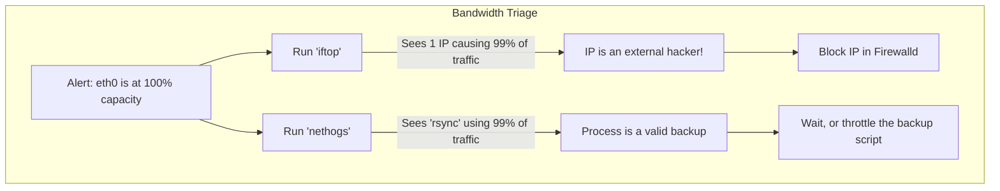
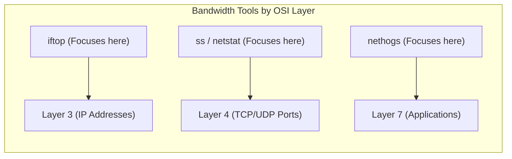
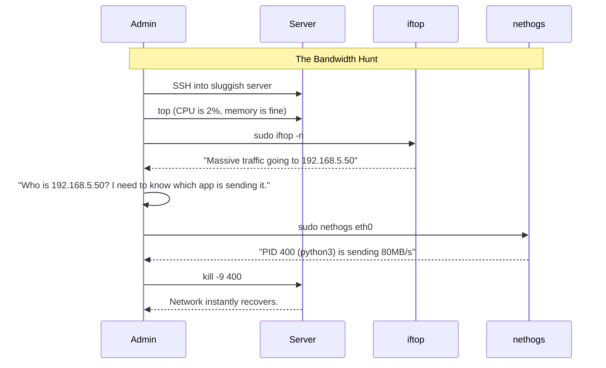

# CHAPTER 55 — NETWORK MONITORING AND BANDWIDTH (IFTOP, NETHOGS)

---

## 1. Introduction

### Why This Topic Exists
A Linux server might have plenty of CPU and RAM, but if the network pipe (bandwidth) connecting it to the internet is 100% full, the server will appear dead to users. Standard tools like `top` show you which process is using the CPU. Standard network tools like `ping` show if the network is alive. But if you want to know *which specific IP address* is downloading 500 Megabytes per second, or *which specific application* is maxing out the network card, you need specialized network monitoring tools like `iftop` and `nethogs`.

### Why Linux Administrators Use It
When the monitoring dashboard shows that the primary network interface (`eth0`) is suddenly passing 10 Gigabits per second of outbound traffic, the administrator must act immediately. Are they being DDoS'd? Is a hacker exfiltrating the customer database? Is a legitimate backup script running at the wrong time? Administrators use `iftop` and `nethogs` to instantly identify the source and destination of massive data flows.

### Why Companies Care About It
Bandwidth Costs and Security. Cloud providers (like AWS, Azure, GCP) charge companies for outbound network traffic (Egress). If a rogue script accidentally gets stuck in an infinite loop downloading and uploading a 10GB file to the internet, it can cost the company thousands of dollars in a single weekend. Real-time network monitoring allows administrators to catch and kill these rogue processes instantly.

---

## 2. Learning Objectives

By the end of this chapter, you will be able to:
- Explain the difference between `iftop` (IP-based) and `nethogs` (Process-based) monitoring.
- Use `iftop` to identify which external IP addresses are consuming the most bandwidth.
- Use `nethogs` to identify which local application is causing a bandwidth spike.
- Interpret basic bandwidth metrics (Kbps vs KBps).
- Use `ip -s link` for a quick, native check of dropped network packets.

---

## 3. Beginner-Friendly Explanation

Think of a water pipe attached to your house (The Network):
- **`ip -s link`:** The water meter on the side of your house. It tells you that 500 gallons of water have flowed into your house today.
- **`iftop`:** The plumber looking at the pipes. They tell you, "100 gallons are going to the kitchen, and 400 gallons are going to the backyard." (Shows you the Destination IP Address).
- **`nethogs`:** The detective in the house. They tell you, "The dishwasher in the kitchen is running, but it's actually your son filling up a giant inflatable pool in the backyard that is using all the water." (Shows you the specific Application Process).

---

## 4. Core Theory

### 4.1 Bandwidth Math (Bits vs Bytes)
Network speeds are always measured in **bits** (lowercase `b`). File sizes are measured in **Bytes** (uppercase `B`). There are 8 bits in 1 Byte.
If your server has a "1 Gigabit" network card (`1 Gbps`), it can transfer roughly `125 Megabytes` per second (`125 MBps`).
When looking at network monitoring tools, always pay strict attention to whether the tool is displaying `Kbps` (Kilobits) or `KBps` (KiloBytes).

### 4.2 `iftop` (Interface Top)
`iftop` listens to network traffic and creates a real-time, ASCII-art bar graph showing you every single active connection. It pairs your server's IP address on the left with the remote destination IP address on the right, and draws a visual bar representing how much data is flowing between them. It is incredible for spotting DDoS attacks or massive file transfers.

### 4.3 `nethogs` (Network Hogs)
`iftop` is great, but sometimes it tells you "You are sending 500MB/s to AWS." If your server runs 5 different applications that all talk to AWS, `iftop` doesn't help you figure out *which* application is doing it. `nethogs` groups bandwidth by Process ID (PID). It looks exactly like `top`, but instead of sorting by `%CPU`, it sorts by `Sent KB/s` and `Received KB/s`.

---

## 5. Internal Working

### Promiscuous Mode vs Netlink
- `iftop` works by putting the network card into "promiscuous mode" and sniffing the actual packets (similar to `tcpdump`). Because of this, it requires `root` privileges.
- `nethogs` works by querying the Linux kernel's `netlink` sockets and the `/proc` filesystem to map active network connections directly to their owning process. It also requires `root` privileges.

---

## 6. Production Architecture



---

## 7. Command-by-Command Explanation

### 7.1 `ip -s link show eth0`
- **Purpose:** Native command (no installation required). Shows total cumulative bytes sent/received since the server booted, and critically, shows `dropped` and `errors`. If you have high network errors, you have a bad physical cable.

### 7.2 `iftop -n`
- **Purpose:** Launches the `iftop` real-time visualizer. The `-n` flag tells it NOT to resolve IP addresses to hostnames (which saves time and prevents DNS lookups from generating their own network traffic).

### 7.3 `nethogs eth0`
- **Purpose:** Launches `nethogs` specifically monitoring the `eth0` interface, displaying exactly which application is sending/receiving data.

### 7.4 `ss -s`
- **Purpose:** Socket Statistics Summary. Shows how many total network connections are currently open. If a web server normally has 500 open connections, and suddenly has 50,000, you are likely experiencing a DDoS attack.

---

## 8. Syntax Breakdown

**Reading the `iftop` display**

```text
                  12.5MB             25.0MB             37.5MB             50.0MB
└─────────────────┴──────────────────┴──────────────────┴──────────────────┴
192.168.1.50             => 8.8.8.8                 120Kb  150Kb  120Kb
                         <=                         500Kb  550Kb  500Kb
│                        │  │                       │      │      │
│                        │  │                       │      │      └── Average over 40 seconds
│                        │  │                       │      └── Average over 10 seconds
│                        │  │                       └── Average over 2 seconds
│                        │  └── Destination IP
│                        └── Arrow shows traffic direction (Outbound =>) (Inbound <=)
└── Source IP (Your server)
```
*(The visual bar graph at the top scales dynamically based on the traffic volume).*

---

## 9. Parameter Explanation

| Tool | Parameter/Key | Description |
|:---|:---|:---|
| `iftop` | `p` (Interactive) | Pauses the display so you can actually read the IPs before they jump around. |
| `iftop` | `t` (Interactive) | Toggles the view. Instead of showing two lines for inbound/outbound, it collapses them into one line per connection. |
| `nethogs` | `m` (Interactive) | Cycles the display units between KB/s, B/s, and MB/s. |
| `nethogs` | `q` (Interactive) | Quits the program. |
| `vnstat` | (Separate tool) | A daemon that records total bandwidth used per day/month. Excellent for answering "Did we exceed our 1TB monthly cloud limit?" |

---

## 10. Sample Output Analysis

**Scenario:** A server is running slowly. The CPU and RAM are fine. We run `sudo nethogs`.

**Output:**
```text
NetHogs version 0.8.5

  PID USER     PROGRAM                      DEV        SENT      RECEIVED       
 4512 mysql    /usr/sbin/mysqld             eth0       0.514       0.102 KB/sec
 8810 root     sshd: root@pts/0             eth0       0.150       0.050 KB/sec
 9102 backup   /usr/bin/rsync               eth0   45000.000     250.000 KB/sec
    ? root     unknown TCP                             0.000       0.000 KB/sec

  TOTAL                                            45000.664     250.152 KB/sec
```

**Analysis:**
- **MySQL (PID 4512):** Using almost zero bandwidth. The database is not the issue.
- **SSH (PID 8810):** Using tiny amounts of bandwidth (just our current SSH keystrokes).
- **Rsync (PID 9102):** **THE CULPRIT.** The `backup` user is running `rsync` and sending **45,000 KB/sec** (45 MB/sec) out of the `eth0` interface. This is completely saturating a standard 500 Mbps cloud network link.
- **Action:** The admin can either `kill -9 9102` to stop the backup, or wait for it to finish. Next time, they should run `rsync` with the `--bwlimit` flag to prevent it from hogging all the bandwidth.

---

## 11. Architecture Diagram


*Professional administrators use all three tools in conjunction to paint a complete picture of a network bottleneck.*

---

## 12. Workflow Diagram



---

## 13. Real Production Examples

### The "Hidden" Exfiltration
A company's intrusion detection system flags that a server is uploading data to an unknown IP address in a foreign country.
The administrator logs in and runs `iftop`. They clearly see the server uploading 5MB/s to `203.0.113.99`.
They run `nethogs`. They expect to see a normal application like `curl` or `wget`. Instead, they see a process named `/tmp/.hidden/sysupdate`.
A hacker has uploaded a custom malware binary, named it something innocent-looking (`sysupdate`), and is actively stealing the database over the network. The administrator immediately runs `firewall-cmd --panic-on` to sever the connection and preserve the evidence.

### Checking for Dropped Packets
A web server is only using 10% of its bandwidth, but customers complain the website is "glitchy" and requires refreshing the page multiple times.
The admin runs `ip -s link show eth0`:
```text
    RX: bytes  packets  errors  dropped overrun mcast
    10500201   150000   450     450     0       0
```
The admin sees hundreds of `errors` and `dropped` packets. This means the physical network cable is broken, the switch port is failing, or the virtual network driver in VMware is glitching. The network isn't full; it's physically broken.

---

## 14. Common Mistakes

1. **Running without `sudo`** — Both `iftop` and `nethogs` require direct access to the kernel's raw networking stack. If you run them as a standard user, they will instantly crash with an error like `pcap_open_live failed: Operation not permitted`.
2. **Forgetting to specify the interface** — If a server has 4 network cards (`eth0`, `eth1`, `docker0`, `lo`), and you just type `nethogs`, it might latch onto the `docker0` interface and show you zero traffic, while the real bottleneck is happening on `eth1`. Always specify the interface: `nethogs eth1`.
3. **Leaving `iftop` running** — Network sniffers consume CPU to process every single packet. If you leave `iftop` running in a `tmux` session on a 10Gbps production router, `iftop` itself will eventually consume 100% of the CPU and crash the server. Run it, find the problem, and press `q` to exit.

---

## 15. Best Practices

- If you don't have `iftop` installed and cannot reach the internet to install it (because the network is choked), you can use the built-in `ss` command to get a rough idea of traffic volume. Run `ss -ti` (TCP Info). It will print highly detailed internal kernel metrics for every connection, including how much data is in the send/receive queues.
- Always use the `-n` flag with `iftop`. If you are being DDoS'd by 10,000 IP addresses, `iftop` will try to perform a Reverse DNS lookup on all 10,000 IPs simultaneously, completely locking up your server. `-n` forces it to just display the raw IP numbers.

---

## 16. Security Considerations

- **Packet Capture Dangers:** Because `iftop` runs in promiscuous mode, it has access to the raw data payloads of the packets. While `iftop` only displays the headers (IPs and sizes), the underlying mechanism is the same as `tcpdump`. Restrict `sudo` access to these tools, as a malicious insider could use them as a stepping stone to perform full packet captures on unencrypted internal traffic.

---

## 17. Performance Considerations

- **10Gbps+ Networks:** `iftop` and `nethogs` are designed for standard enterprise servers (1Gbps to 10Gbps). If you attempt to run these tools on a core telecom router pushing 40Gbps or 100Gbps, the tools will completely fail to keep up with the packet rate, drop packets, and potentially cause kernel panics. At that scale, you must use hardware-accelerated NetFlow/sFlow monitoring.

---

## 18. Troubleshooting Guide

| Symptom | Root Cause | Resolution |
|:---|:---|:---|
| `iftop: command not found` | EPEL repository not installed | RHEL: `dnf install epel-release && dnf install iftop` |
| `nethogs` shows empty screen | Wrong network interface | Run `ip a` to find your active interface, e.g., `nethogs ens192` |
| Server is slow, but `nethogs` is 0 KB/s | Not a network bottleneck | Check `top` for CPU/RAM, or `iostat` for Disk I/O |
| `ip -s link` shows high `errors` | Physical layer failure | Replace the ethernet cable or check switch port negotiation |

---

## 19. Practical Labs

**Lab 55.1:** Basic Network Statistics
1. View cumulative interface stats: `ip -s link show`
2. View total open connections: `ss -s`

**Lab 55.2:** Using Iftop (Requires EPEL on RHEL)
1. `sudo dnf install epel-release -y && sudo dnf install iftop -y`
2. Open a second terminal and start a ping: `ping 8.8.8.8`
3. In the first terminal, run: `sudo iftop -n -i eth0` (Replace eth0 with your interface name from `ip a`).
4. You will see the ICMP traffic flowing to 8.8.8.8. Press `q` to quit.

**Lab 55.3:** Using Nethogs
1. `sudo dnf install nethogs -y`
2. Open a second terminal and download a large file:
   `wget http://speedtest.tele2.net/100MB.zip`
3. In the first terminal, immediately run: `sudo nethogs`
4. You will clearly see the `wget` process spike to the top of the list, showing exactly how fast it is downloading.

---

## 20. Mini Project

The Bottleneck Simulation.
1. Run `sudo nethogs`. Notice that it is relatively quiet.
2. We will simulate a runaway backup script. Open a second terminal.
3. Run the following command to generate massive internal loopback traffic:
   `cat /dev/zero | nc -l 9999 &` (Starts a server sending infinite data).
   `nc localhost 9999 > /dev/null &` (Connects and downloads the infinite data).
4. Go back to your `nethogs` terminal.
5. You will see two `nc` (netcat) processes screaming at the top of the list, transferring massive amounts of Gigabytes per second on the `lo` (loopback) interface.
6. Note the PID of the processes in `nethogs`.
7. Kill them: `sudo kill -9 <PID_1> <PID_2>`
8. Watch `nethogs` instantly return to normal.

---

## 21. Assignments

1. What is the key difference in what `iftop` displays versus what `nethogs` displays?
2. Why must you run `iftop` and `nethogs` with `sudo` privileges?
3. If you run `ip -s link` and see a high number of `dropped` packets, what layer of the OSI model is likely experiencing a failure?

---

## 22. Interview Questions

### Basic
1. **Q: You want to see exactly which remote IP addresses are connecting to your server and consuming the most bandwidth right now. Which tool provides a visual, real-time bar graph of this?**
   A: `iftop`.

2. **Q: Which tool shows you network bandwidth grouped by the specific Linux Process ID (PID)?**
   A: `nethogs`.

### Intermediate
3. **Q: You are monitoring a server that hosts a website. `iftop` shows 500 Mbps of outbound traffic going to a single external IP address. You need to know if this is a legitimate user downloading a large PDF via Apache, or a hacker stealing data via a rogue script. How do you find out?**
   A: I would exit `iftop` and immediately run `nethogs`. `nethogs` will show me the exact process generating the traffic. If the process is `httpd` or `nginx`, it's a legitimate user. If the process is `python3` or `scp`, it is likely an unauthorized exfiltration.

4. **Q: What is the risk of running `iftop` without the `-n` flag on a heavily loaded server?**
   A: Without `-n`, `iftop` attempts to resolve every single IP address it sees into a human-readable hostname (via Reverse DNS). If there are thousands of connections, the server will flood the local DNS server with thousands of DNS queries, causing severe latency, high CPU usage, and potentially crashing the DNS server. Always use `-n` to stick to raw IP addresses during high-load events.

### Scenario-Based
5. **Q: An alarm goes off indicating that a production database server is utilizing 100% of its network bandwidth. You SSH into the server (which is very sluggish due to the network saturation). You don't have `iftop` or `nethogs` installed. You cannot run `dnf install` because the network is too choked to reach the repositories. How can you figure out what is happening using only built-in tools?**
   A: 
   1. First, I would run `ss -s` to see if there is a massive spike in total connections (indicating a DDoS).
   2. Next, I would run `ss -tupan` (TCP, UDP, Processes, All, Numeric). This lists all active connections. 
   3. I would look at the `Send-Q` and `Recv-Q` columns in the `ss` output. If a specific connection has a massive number in the Send Queue, that connection is trying to push a huge amount of data. 
   4. The `-p` flag in `ss` will show me the PID of the application owning that connection. I can then investigate or `kill` that specific PID to clear the bottleneck.

---

## 23. Chapter Summary and Quick Revision Notes

- **Network Monitoring:** Crucial for identifying DDoS attacks, exfiltration, and rogue scripts.
- **`ip -s link`:** Native tool. Shows total bytes and hardware-level errors/dropped packets.
- **`iftop`:** Shows bandwidth by IP Address (Layer 3). Requires EPEL repo. Use `-n` for performance.
- **`nethogs`:** Shows bandwidth by Process/PID (Layer 7). Excellent for pinpointing rogue applications.
- **`ss`:** Native fallback tool. Use `ss -s` for connection summaries and `ss -tupan` to inspect queues.
- Always be aware of bits (b) vs Bytes (B) when reading network graphs.

---

## 24. Cheat Sheet

| Command | Purpose |
|:---|:---|
| `ip -s link show eth0` | View total bytes and dropped packets |
| `ss -s` | View total number of open network connections |
| `sudo iftop -n -i eth0` | View bandwidth by Destination IP |
| `sudo nethogs eth0` | View bandwidth by Application/PID |
| `sudo kill -9 <PID>` | Stop the rogue application |
