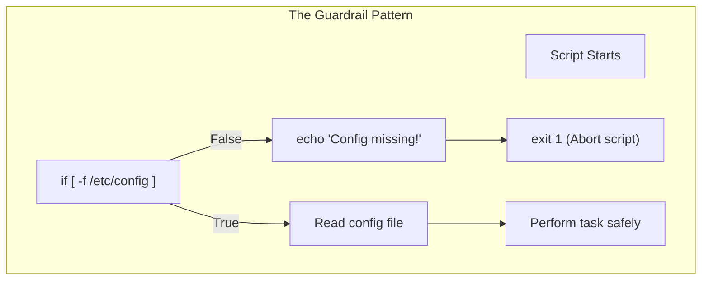
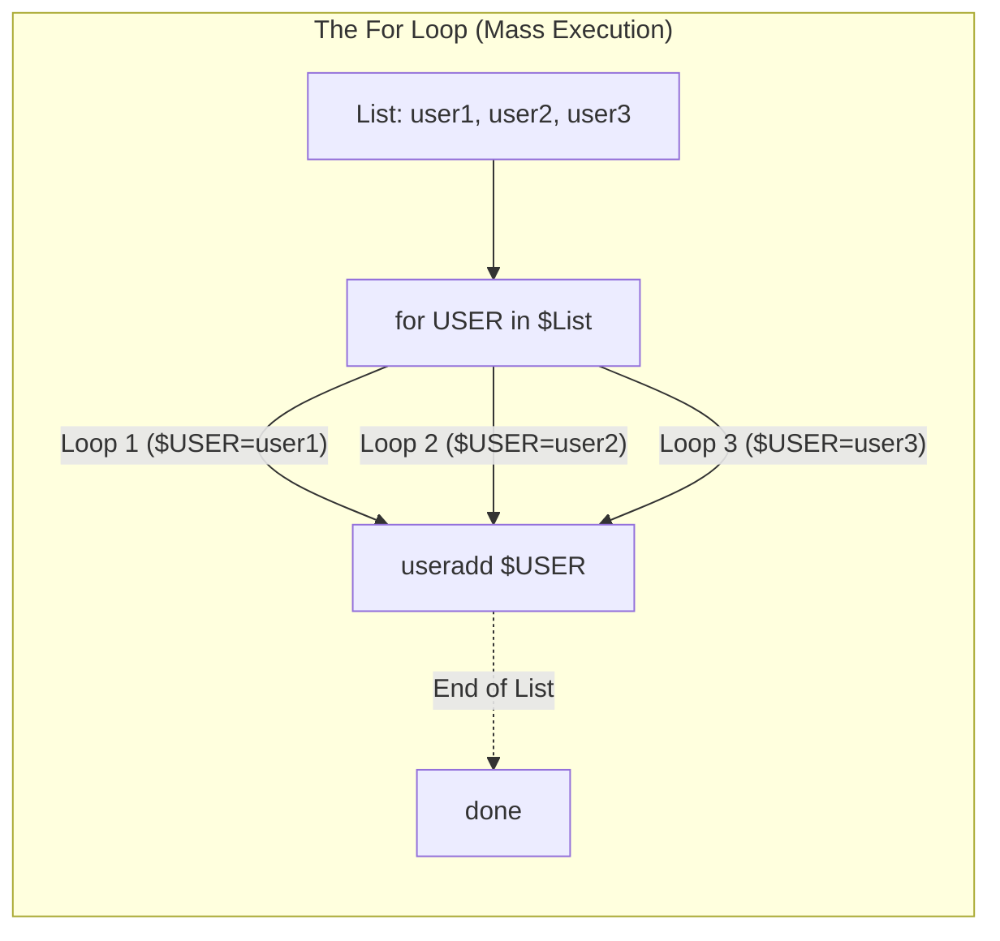
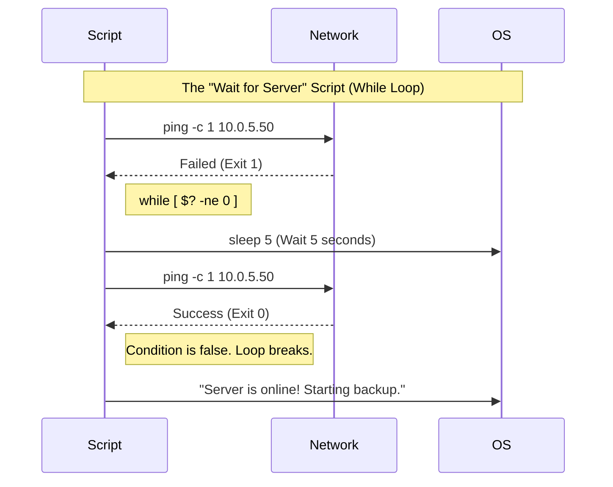

# CHAPTER 62 — CONTROL STRUCTURES (IF, FOR, WHILE)

---

## 1. Introduction

### Why This Topic Exists
A script that just runs 10 commands in a straight line from top to bottom is useful, but it isn't "smart". What if you want the script to run a backup, but *only if* the hard drive isn't already 99% full? What if you want to ping a server over and over again *until* it comes back online? To give scripts logic, decision-making abilities, and repetition, you must use **Control Structures**.

### Why Linux Administrators Use It
Administrators use Control Structures to build "guardrails" into their automation. If an administrator writes a script to delete old log files, they use an `if` statement to verify they are actually inside the `/var/log` directory *before* running the `rm -rf` command. They use `for` loops to apply the exact same configuration change to 500 different user accounts in 3 seconds, rather than running the command 500 times.

### Why Companies Care About It
Safety and Scale. A "dumb" script will blindly execute destructive commands even if the previous command failed, potentially wiping a production database. A script built with proper `if/then` logic protects the company's data by halting execution when anomalies are detected. Furthermore, `for` loops allow a single administrator to manage 10,000 servers just as easily as they manage 1.

---

## 2. Learning Objectives

By the end of this chapter, you will be able to:
- Use `if`, `elif`, and `else` statements to make decisions.
- Use the `test` command (`[ ]`) to evaluate numbers, strings, and files.
- Write `for` loops to iterate over lists of items or files.
- Write `while` loops to run commands continuously based on a condition.
- Protect destructive scripts using logical guardrails.

---

## 3. Beginner-Friendly Explanation

Think of a Train on a railroad track:
- **A basic script:** The train goes perfectly straight. It never stops. If the bridge is out, the train falls into the river.
- **An `if` statement:** A switch on the track. If the bridge is out, switch the track and go right (`else`), keeping the train safe.
- **A `for` loop:** The train stops at 5 different stations to drop off mail. It does the exact same "drop mail" action at every station until the list of stations is finished.
- **A `while` loop:** The train drives in a circle around the mountain *while* it is snowing. As soon as the snow stops, the train breaks the circle and goes home.

---

## 4. Core Theory

### 4.1 The `if` Statement
The `if` statement evaluates a condition. If the condition is True (Exit Code 0), the script executes the code inside the block. If it is False (Exit Code > 0), the script skips it. Every `if` block must be closed backwards with `fi` (if spelled backwards).

### 4.2 The Test Brackets `[ ]`
To actually evaluate something (like "Is 5 greater than 3?"), Bash uses the `test` command, which is represented by square brackets `[ ]`. 
**CRITICAL BASH RULE:** You MUST have spaces inside the brackets. `[ 5 -gt 3 ]` works. `[5 -gt 3]` will crash your script instantly.

### 4.3 The `for` Loop
A `for` loop takes a list of items (like apples, bananas, oranges). It grabs the first item, assigns it to a temporary variable (e.g., `$FRUIT`), runs the code block, and then loops back up to grab the next item. It stops when the list is empty.

### 4.4 The `while` Loop
A `while` loop does not care about a list. It evaluates a condition (like "Is the server offline?"). It runs the code block, and then checks the condition again. It will run forever (an infinite loop) until the condition becomes False.

---

## 5. Internal Working

### Numeric vs String Comparison
Bash handles numbers and text completely differently inside the `[ ]` brackets.
- **Numbers:** You cannot use `>`. You must use `-gt` (Greater Than), `-lt` (Less Than), or `-eq` (Equal).
- **Strings (Text):** You use `=` (Equal) or `!=` (Not Equal).
If you write `[ 5 > 3 ]`, Bash thinks you are trying to redirect the output of the number 5 into a file named "3". 

---

## 6. Production Architecture


*Never assume a file exists or a command succeeded. Always wrap destructive actions in `if` statements.*

---

## 7. Command-by-Command Explanation

*(These are Bash syntax structures, rather than terminal commands)*

### 7.1 `if [ condition ]; then ... fi`
- **Purpose:** Executes code only if the condition is true.

### 7.2 `for ITEM in LIST; do ... done`
- **Purpose:** Loops over every item in the list.

### 7.3 `while [ condition ]; do ... done`
- **Purpose:** Loops continuously as long as the condition remains true.

### 7.4 `exit 1`
- **Purpose:** Immediately kills the script and returns an exit code of `1` (Failure) to the OS. `exit 0` returns Success.

---

## 8. Syntax Breakdown

**A Complex `if/elif/else` Block**

```bash
AGE=25

if [ "$AGE" -lt 18 ]; then
    echo "You are a minor."
elif [ "$AGE" -eq 18 ]; then
    echo "You just became an adult!"
else
    echo "You are an adult."
fi
```
- `-lt`: Less than.
- `-eq`: Equal to.
- `elif`: "Else If". Used to chain multiple conditions.
- `fi`: Closes the entire block.

**A standard `for` Loop**

```bash
for SERVER in web1 web2 web3; do
    echo "Connecting to $SERVER..."
    ping -c 1 "$SERVER"
done
```
- `SERVER`: The temporary variable that holds `web1` on the first loop, `web2` on the second, etc.
- `do`: Starts the code block.
- `done`: Ends the code block.

---

## 9. Parameter Explanation

| Test Operator inside `[ ]` | Purpose | Example |
|:---|:---|:---|
| `-eq` / `-ne` | Math: Equal / Not Equal | `[ $X -eq 10 ]` |
| `-gt` / `-lt` | Math: Greater Than / Less Than | `[ $X -gt 5 ]` |
| `=` / `!=` | Strings: Equal / Not Equal | `[ "$NAME" = "Alice" ]` |
| `-z` | Strings: Is the string empty? (Zero length) | `[ -z "$VAR" ]` |
| `-f` | Files: Does the File exist? | `[ -f /etc/passwd ]` |
| `-d` | Files: Does the Directory exist? | `[ -d /var/log ]` |

---

## 10. Sample Output Analysis

**Scenario:** We want to create a loop that counts from 1 to 5.
**Code:**
```bash
COUNT=1
while [ $COUNT -le 5 ]; do
    echo "Count is: $COUNT"
    ((COUNT++))
done
```

**Output:**
```text
Count is: 1
Count is: 2
Count is: 3
Count is: 4
Count is: 5
```

**Analysis:**
- **`[ $COUNT -le 5 ]`**: The `while` loop checks if the variable is Less-than-or-Equal-to 5.
- **`((COUNT++))`**: This is special Bash math syntax. It increases the variable by 1 on every loop.
- Without `((COUNT++))`, the variable would remain 1 forever. `1` is always less than 5, so the script would print "Count is: 1" infinitely until the computer crashed. (This is a dangerous "Infinite Loop").

---

## 11. Architecture Diagram



---

## 12. Workflow Diagram



---

## 13. Real Production Examples

### The Safe Delete Script
A junior admin accidentally runs `rm -rf /` in a script, wiping the server. A senior admin forces everyone to use `if` statements as guardrails before deleting anything.
```bash
#!/bin/bash
TARGET_DIR="/tmp/cache"

# Guardrail: Check if directory actually exists first
if [ -d "$TARGET_DIR" ]; then
    echo "Directory found. Deleting contents..."
    rm -rf "$TARGET_DIR"/*
else
    echo "ERROR: Directory $TARGET_DIR does not exist. Aborting!"
    exit 1
fi
```

### The Log Archiver (For Loop)
An administrator needs to compress 500 `.log` files in a directory to save space. Doing this manually would take hours.
```bash
#!/bin/bash
cd /var/log/myapp/

for FILE in *.log; do
    echo "Compressing $FILE..."
    gzip "$FILE"
done
```
*Because of wildcard expansion (`*.log`), Bash automatically generates a list of all 500 files, and the `for` loop compresses every single one of them perfectly.*

---

## 14. Common Mistakes

1. **Missing spaces in brackets** — `if [$AGE -gt 18]` will fail. You MUST have spaces: `if [ $AGE -gt 18 ]`.
2. **Using `<` or `>` for numbers** — `if [ $X > 5 ]` does not mean "greater than". Bash intercepts the `>` symbol and tries to redirect output to a file named "5". Always use `-gt` or `-lt` for math.
3. **Forgetting `fi` or `done`** — If you start an `if` block and forget to type `fi` at the end of the script, Bash will throw an `unexpected EOF while looking for matching if` error. 
4. **Infinite While Loops** — If you write a `while` loop but forget to update the variable inside the loop, the condition will never become false. The loop will run billions of times a second, locking up 100% of a CPU core until you forcefully kill the script.

---

## 15. Best Practices

- **Quote your string variables in `if` statements:**
  `if [ $NAME = "Alice" ]` (BAD). If the user leaves the `$NAME` variable blank, Bash evaluates `if [ = "Alice" ]`, which crashes with a syntax error.
  `if [ "$NAME" = "Alice" ]` (GOOD). If it is blank, Bash evaluates `if [ "" = "Alice" ]`, which safely evaluates to False without crashing.
- **Fail Early:** If your script requires `root` privileges, don't wait for line 50 to fail. Check it on line 2 and exit immediately.
```bash
if [ "$EUID" -ne 0 ]; then
    echo "Please run as root."
    exit 1
fi
```

---

## 16. Security Considerations

- **Untrusted Input in For Loops:** If you use a `for` loop to iterate over user-submitted data, and you don't validate that data, a malicious user could pass a string containing `; rm -rf /`. Always sanitize input before looping over it and passing it to system commands.

---

## 17. Performance Considerations

- **Spawning Subshells in Loops:** Inside a `for` loop that runs 10,000 times, you should avoid calling external commands (like `grep`, `awk`, or `cut`) if possible. Every time you call `grep` inside a loop, Linux has to fork a brand new process. Doing this 10,000 times will take 5 minutes. If you use native Bash string manipulation instead, the loop will finish in 0.5 seconds.

---

## 18. Troubleshooting Guide

| Symptom | Root Cause | Resolution |
|:---|:---|:---|
| `syntax error: unexpected end of file`| Missing closing tag | Ensure every `if` has a `fi`, and every `do` has a `done`. |
| `[: missing ]` | Missing space | Ensure there is a space before the closing bracket `]`. |
| `command not found` inside `if` | Missing space after `[` | Ensure there is a space after the opening bracket `[`. |
| `too many arguments` inside `if` | Unquoted variable with spaces | Wrap the variable in double quotes: `[ "$VAR" = "test" ]` |

---

## 19. Practical Labs

**Lab 62.1:** The Number Checker (`if` / `elif`)
1. Create `check.sh`.
2. Code:
```bash
#!/bin/bash
read -p "Enter a number between 1 and 10: " NUM

if [ "$NUM" -gt 10 ]; then
    echo "Too high!"
elif [ "$NUM" -lt 1 ]; then
    echo "Too low!"
else
    echo "Perfect. You chose $NUM."
fi
```
3. Run it and test different numbers.

**Lab 62.2:** The Multi-Ping Script (`for`)
1. Create `pingall.sh`.
2. Code:
```bash
#!/bin/bash
for IP in 8.8.8.8 1.1.1.1 256.256.256.256; do
    ping -c 1 "$IP" &> /dev/null
    
    if [ $? -eq 0 ]; then
        echo "Server $IP is UP"
    else
        echo "Server $IP is DOWN"
    fi
done
```
3. Run it. Notice how it cleanly formats the output based on the success (`$?`) of the hidden ping command.

---

## 20. Mini Project

The File Creator.
Write a script named `create_files.sh` that takes a number as an argument (e.g., `./create_files.sh 5`). It should use a `while` loop to create that many blank text files (e.g., `file1.txt`, `file2.txt`, up to `file5.txt`).
*Solution:*
```bash
#!/bin/bash
MAX=$1
COUNT=1

while [ $COUNT -le $MAX ]; do
    touch "file${COUNT}.txt"
    echo "Created file${COUNT}.txt"
    ((COUNT++))
done
```

---

## 21. Assignments

1. What is the fundamental difference between a `for` loop and a `while` loop?
2. Write the exact Bash `if` statement syntax to check if a file named `/tmp/lockfile` exists.
3. Why is it dangerous to write `if [ $AGE -gt 18 ]` instead of `if [ "$AGE" -gt 18 ]`?

---

## 22. Interview Questions

### Basic
1. **Q: How do you close an `if` block in Bash?**
   A: With `fi`.

2. **Q: Which test operator do you use to check if two strings are identical?**
   A: The `=` (or `==`) operator.

### Intermediate
3. **Q: You write a script: `if [ $X > 100 ]; then echo "High"; fi`. When you run it, `$X` is 50. It still prints "High", and mysteriously, a blank file named `100` appears in your directory. What happened?**
   A: I used the `>` redirect operator instead of the `-gt` (Greater Than) mathematical operator. Bash evaluated `[ $X ]` (which was true, because the variable exists), and then redirected the output of that invisible command into a new file named `100`. I must change it to `if [ "$X" -gt 100 ]`.

4. **Q: A script creates 50 users from a list using a `for` loop. One of the users in the list is accidentally formatted as `"Bob Smith"`. When the loop reaches Bob, it tries to create a user named `Bob` and a user named `Smith`, which fails. How do you fix the `for` loop?**
   A: By default, the `for` loop breaks lists apart on spaces. If the list is in a text file, I can change the Internal Field Separator (`IFS`) variable to only break on Newlines (`IFS=$'\n'`) before the loop starts. Alternatively, I should use a `while read` loop, which processes files line-by-line by default.

### Scenario-Based
5. **Q: You need to write a script that runs every night. It stops the Apache web server, runs a software update, and starts Apache again. However, if the software update command fails, the script MUST NOT attempt to start Apache, because it might corrupt the database. How do you structure this script?**
   A: I would use an `if` statement checking the exit code (`$?`) of the update command.
   ```bash
   systemctl stop httpd
   dnf update myapp -y
   if [ $? -eq 0 ]; then
       echo "Update succeeded. Starting Apache."
       systemctl start httpd
   else
       echo "Update FAILED. Leaving Apache offline and exiting."
       exit 1
   fi
   ```
   This acts as a strict guardrail protecting the application from starting in a corrupted state.

---

## 23. Chapter Summary and Quick Revision Notes

- **Control Structures:** Make scripts "smart" by making decisions and looping.
- **`if / elif / else`:** Branching logic based on conditions. Closed with `fi`.
- **`[ ]` (Test):** Requires spaces inside! Evaluates conditions.
- **Numbers:** `-eq` (Equal), `-ne` (Not Equal), `-gt` (Greater), `-lt` (Less).
- **Strings:** `=` (Equal), `!=` (Not Equal), `-z` (Empty).
- **Files:** `-f` (File exists), `-d` (Directory exists).
- **`for` loop:** Iterates through a fixed list of items.
- **`while` loop:** Loops continuously as long as a condition is True.

---

## 24. Cheat Sheet

| Structure | Syntax |
|:---|:---|
| File Check | `if [ -f /etc/passwd ]; then ... fi` |
| Number Check | `if [ "$NUM" -gt 10 ]; then ... fi` |
| String Check | `if [ "$NAME" = "Alice" ]; then ... fi` |
| Exit Code Check| `if [ $? -eq 0 ]; then ... fi` |
| For Loop | `for ITEM in a b c; do ... done` |
| While Loop | `while [ "$COUNT" -lt 10 ]; do ... done` |
| Math Increment| `((COUNT++))` |
