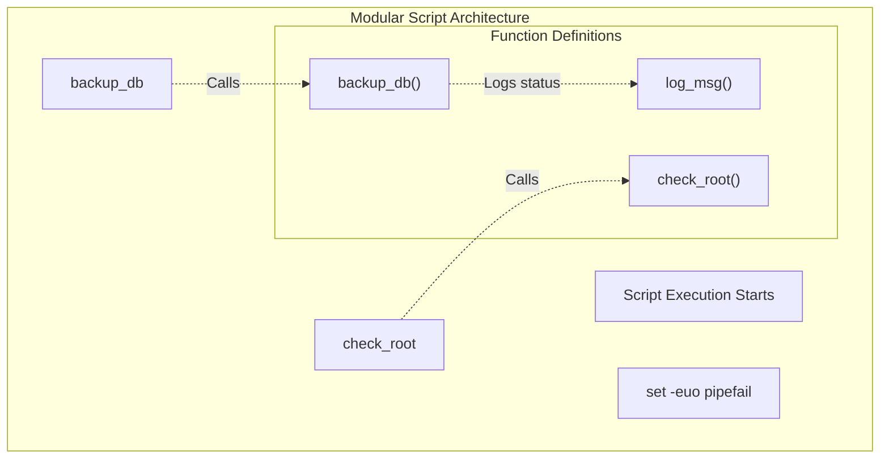
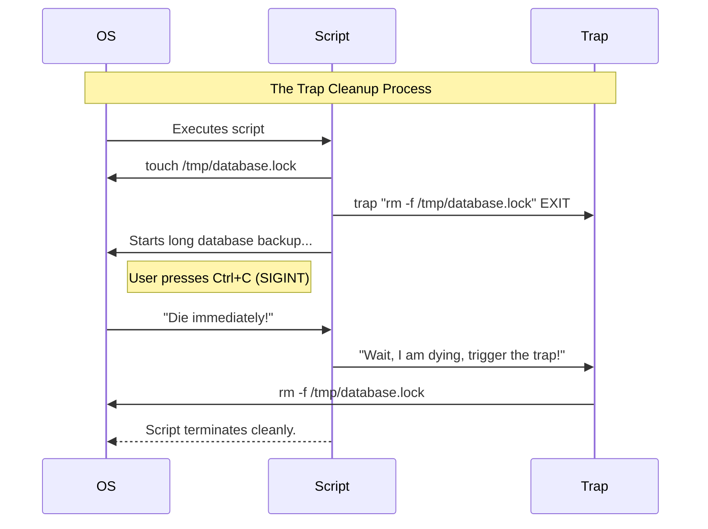

# CHAPTER 63 — FUNCTIONS AND ERROR HANDLING

---

## 1. Introduction

### Why This Topic Exists
As administrators write larger and more complex Bash scripts, the code quickly becomes messy. If you have a script that connects to a database, and you need to perform that connection step in 5 different places within the script, copying and pasting the same 10 lines of code 5 times is terrible practice. **Functions** allow you to group those 10 lines into a single, reusable block of code. **Error Handling** ensures that when one of those functions inevitably fails, the script dies gracefully instead of causing a cascade of catastrophic errors.

### Why Linux Administrators Use It
Administrators use Functions to make their scripts modular, readable, and easy to maintain. They use strict Error Handling (`set -e`) to guarantee that if a critical command (like `mount /dev/sdb1 /backups`) fails, the script instantly aborts before it runs the next command (like `rm -rf /original_data/`), which would destroy the company's files.

### Why Companies Care About It
Code Quality and Blast Radius. A 500-line script written without functions is a "spaghetti code" nightmare that no other employee can read or safely modify. A script without error handling has an infinite "blast radius"—it will keep executing destructive commands even when the system is in an invalid state. Functions and Error Handling elevate a junior administrator's hacking into enterprise-grade Software Engineering.

---

## 2. Learning Objectives

By the end of this chapter, you will be able to:
- Define and call custom Functions inside a Bash script.
- Pass arguments to functions and return values.
- Understand variable Scope (Global vs Local variables).
- Implement strict error handling using `set -e`, `set -u`, and `set -o pipefail`.
- Use the `trap` command to clean up temporary files if a script crashes or is killed.

---

## 3. Beginner-Friendly Explanation

Think of a Manager at a busy restaurant:
- **No Functions:** The Manager personally walks to Table 1, takes the order, walks to the kitchen, cooks the food, walks it back, and washes the dishes. The Manager is exhausted and the code is messy.
- **Functions:** The Manager creates roles: `take_order()`, `cook_food()`, `wash_dishes()`. When a customer arrives, the Manager just calls the functions. The code is clean and organized.
- **Error Handling (`set -e`):** The `cook_food()` function requires gas for the stove. If the gas is turned off, the cook throws an error. Without error handling, the Manager ignores the error, serves a raw chicken to the customer, and poisons them. With `set -e`, the Manager instantly shuts down the restaurant the second the gas fails, saving the customer.

---

## 4. Core Theory

### 4.1 Defining and Calling Functions
A function is a named block of code. You define it once, and you can "call" it (execute it) as many times as you want simply by typing its name.
Functions MUST be defined at the top of the script *before* you try to call them. Bash reads from top to bottom; it cannot call a function it hasn't seen yet.

### 4.2 Function Arguments
Functions act like mini-scripts inside your main script. If you call a function and pass it data (`create_user bob`), the function reads that data using `$1`, `$2`, just like the main script does.

### 4.3 Local vs Global Variables
By default, every variable in Bash is Global. If you change `$NAME` inside a function, it permanently changes `$NAME` for the entire script. This causes massive bugs. You must use the `local` keyword inside functions to create isolated variables that disappear when the function finishes.

### 4.4 The "Unofficial Bash Strict Mode"
Bash is historically very sloppy. If you use a variable you never defined, Bash just treats it as empty and keeps going. If a command fails, Bash prints an error and keeps going.
Professional administrators force Bash to be strict by placing this at the top of every script:
`set -euo pipefail`

---

## 5. Internal Working

### How `set -e` Works
When `set -e` (Exit on Error) is active, the Bash interpreter inspects the exit code (`$?`) of every single command it runs. If any command returns an exit code greater than 0 (Failure), the Bash interpreter immediately commits suicide, terminating the entire script.

---

## 6. Production Architecture


*Notice the script logic at the bottom is incredibly clean because the complex code is hidden inside the function definitions at the top.*

---

## 7. Command-by-Command Explanation

### 7.1 `function my_func() { ... }` or `my_func() { ... }`
- **Purpose:** Defines a function. Both syntaxes are valid in Bash, though `my_func()` is more compatible with older Unix systems.

### 7.2 `local VAR="data"`
- **Purpose:** Used strictly inside functions. Forces the variable to be scoped only to that function, preventing it from overwriting global variables of the same name.

### 7.3 `set -e`
- **Purpose:** Exit immediately if a command exits with a non-zero status.

### 7.4 `set -u`
- **Purpose:** Treat unset (undefined) variables as an error and exit immediately. (Prevents you from accidentally running `rm -rf /$EMPTY_VAR/`).

### 7.5 `trap "rm -f /tmp/lockfile" EXIT`
- **Purpose:** Intercepts signals. This tells the script: "No matter how this script ends—whether it succeeds, fails, or the user presses Ctrl+C—always run this `rm` command before you die." It is the ultimate cleanup mechanism.

---

## 8. Syntax Breakdown

**A Clean, Enterprise-Grade Script**

```bash
#!/bin/bash
set -euo pipefail  # Strict Mode

# --- GLOBAL VARIABLES ---
LOG_FILE="/var/log/my_script.log"

# --- FUNCTIONS ---
log_info() {
    local MSG="$1"
    echo "[INFO] $(date +%T) - $MSG" | tee -a "$LOG_FILE"
}

check_root() {
    if [ "$EUID" -ne 0 ]; then
        echo "[ERROR] Must run as root!"
        exit 1
    fi
}

# --- MAIN EXECUTION ---
check_root
log_info "Script started successfully."
log_info "Performing tasks..."
# ... do work ...
log_info "Script finished."
```

---

## 9. Parameter Explanation

| `set` Flag | Long Name | Purpose |
|:---|:---|:---|
| `-e` | `errexit` | Abort script at the first error. |
| `-u` | `nounset` | Abort script if an undefined variable is used. |
| `-x` | `xtrace` | Print every command to the screen *before* executing it. The ultimate debugging tool. |
| `-o pipefail` | | If you run `grep | awk | sort`, and `grep` fails but `sort` succeeds, Bash normally considers the whole pipeline a success. `pipefail` forces the whole pipeline to fail if *any* part of it fails. |

---

## 10. Sample Output Analysis

**Scenario:** We have a script that creates a backup directory and copies files. We forgot to create the directory first. We run it WITH and WITHOUT `set -e`.

**Without `set -e` (Default Bash):**
```text
$ ./backup.sh
cp: cannot create regular file '/backup/data.zip': No such file or directory
Removing original files...
Success!
```
*Analysis: The `cp` failed. But Bash kept going and ran the `rm` command anyway! The data was deleted, but never backed up. Catastrophic data loss.*

**With `set -e` (Strict Mode):**
```text
$ ./backup.sh
cp: cannot create regular file '/backup/data.zip': No such file or directory
```
*Analysis: The `cp` failed. The script INSTANTLY aborted. The `rm` command was never reached. The data is completely safe.*

---

## 11. Architecture Diagram

```mermaid
graph LR
    subgraph Variable_Scope_Local_vs_Global ["Variable Scope (Local vs Global)"]
        Global["Global: USER='Admin'"]
        
        subgraph Function_A ["Function A"]
            Local["Local: USER='Bob'"]
            PrintA["echo $USER (Prints Bob)"]
        end
        
        PrintB["echo $USER (Prints Admin)"]
        
        Global --> Function A
        Function A --> PrintB
    end
```
*If Function A did NOT use the `local` keyword, it would overwrite the Global variable, and PrintB would permanently say "Bob", causing massive bugs elsewhere in the script.*

---

## 12. Workflow Diagram



---

## 13. Real Production Examples

### The Reusable Logging Function
In enterprise scripts, you don't just use `echo`. You want logs to have timestamps and be saved to a file, while also showing on the screen.
```bash
log_message() {
    local LEVEL="$1"   # e.g., INFO or ERROR
    local MESSAGE="$2"
    local TIMESTAMP=$(date "+%Y-%m-%d %H:%M:%S")
    echo "[$TIMESTAMP] [$LEVEL] $MESSAGE" | tee -a /var/log/sys_maint.log
}

log_message "INFO" "Starting maintenance."
log_message "ERROR" "Disk space is too low!"
```

### Safely Bypassing `set -e`
Sometimes you *expect* a command to fail, and you don't want `set -e` to kill the script. For example, checking if a user exists with `grep`. If the user doesn't exist, `grep` returns an error.
```bash
set -e
# If grep fails, '|| true' forces it to return Success (0), saving the script.
USER_EXISTS=$(grep "bob" /etc/passwd || true)

if [ -z "$USER_EXISTS" ]; then
    echo "User bob does not exist."
fi
```

---

## 14. Common Mistakes

1. **Defining a function *after* calling it** — If you put your main code at the top of the script, and the `log_info()` function at the bottom, the script will crash saying `log_info: command not found`. Bash is not compiled; it reads top-to-bottom. Define functions first.
2. **Forgetting `local` variables** — A function loops through a variable named `i`. The main script is also looping through a variable named `i`. The function overwrites the main script's `i`, causing the main loop to skip 50 items and exit early. Always use `local i` inside functions!
3. **Trapping the wrong signal** — If you write `trap ... SIGINT`, the cleanup only happens if the user presses Ctrl+C. If the script succeeds naturally, the cleanup is bypassed. If you write `trap ... EXIT`, the cleanup happens 100% of the time, no matter how the script exits. `EXIT` is almost always the correct choice.

---

## 15. Best Practices

- **The `main()` Function:** In advanced scripts, administrators wrap their main logic inside a function named `main()`, and place `main "$@"` at the absolute bottom of the file. This forces the script to read all functions into memory before executing anything, perfectly mimicking Python and C program structures.
- **Use `set -x` for debugging:** If your script is doing something bizarre and you can't figure out why, put `set -x` at the top. Run it again. Bash will print every single variable expansion and mathematical evaluation to the screen in real-time, instantly revealing where the math went wrong.

---

## 16. Security Considerations

- **The Nounset Trap (`set -u`):** A junior admin writes a script: `rm -rf /var/www/$WEBSITE_DIR/`. They forget to define the `$WEBSITE_DIR` variable. Standard Bash evaluates it as `rm -rf /var/www//` and deletes every website on the server. If they had used `set -u`, Bash would have said `WEBSITE_DIR: unbound variable` and aborted before running the `rm` command, saving the company.

---

## 17. Performance Considerations

- **Function Overhead:** Calling a function in Bash is incredibly fast because it does not spawn a Subshell (unlike running external scripts or piped commands). You can call a Bash function 100,000 times in a loop with virtually no CPU overhead.

---

## 18. Troubleshooting Guide

| Symptom | Root Cause | Resolution |
|:---|:---|:---|
| Script exits silently halfway through | `set -e` caught an error | Add `set -x` to see exactly which command failed. |
| `unbound variable` error | `set -u` caught an empty var | Define the variable, or use default expansion: `${VAR:-default}` |
| Function variables overwrite globals | Missing `local` keyword | Add `local` to variables inside the function. |
| Lockfile remains after script crashes | Missing `trap` | Add `trap "rm -f /lock" EXIT` at the top of the script. |

---

## 19. Practical Labs

**Lab 63.1:** Functions and Scope
1. Create `scope.sh`:
```bash
#!/bin/bash
NAME="Global_Admin"

change_name() {
    local NAME="Local_User"
    echo "Inside function: $NAME"
}

echo "Before function: $NAME"
change_name
echo "After function: $NAME"
```
2. Run it. Notice that the Global variable was perfectly protected by the `local` keyword.

**Lab 63.2:** Strict Mode and Traps
1. Create `safe.sh`:
```bash
#!/bin/bash
set -euo pipefail

trap "echo 'Cleaning up temporary files...'" EXIT

echo "Script is starting..."
# This command will fail because the directory doesn't exist.
# Because of 'set -e', the script will die here.
ls /directory/that/does/not/exist

# This will never run.
echo "Script finished successfully!"
```
2. Run it. Observe that it crashes, but the `trap` still successfully executes the cleanup echo!

---

## 20. Mini Project

The Production Skeleton.
Every time you write a new script for your company, you shouldn't start from scratch. You should have a template.
Create a file named `template.sh`:
```bash
#!/bin/bash
set -euo pipefail

# --- VARIABLES ---
LOG_FILE="/tmp/script.log"

# --- TRAPS ---
cleanup() {
    echo "[INFO] Cleaning up..."
}
trap cleanup EXIT

# --- FUNCTIONS ---
log() {
    echo "[$(date +%T)] $1" | tee -a "$LOG_FILE"
}

main() {
    log "Starting execution..."
    # Your code goes here
    log "Execution complete."
}

# --- KICKOFF ---
main "$@"
```
Save this. Whenever you need to automate a task, copy this template. You are now writing enterprise-grade scripts.

---

## 21. Assignments

1. Why is `set -e` considered a critical safety feature for destructive Bash scripts?
2. What happens to a variable inside a function if you forget to use the `local` keyword?
3. In a `trap` statement, why is the `EXIT` signal preferred over `SIGINT` (Ctrl+C)?

---

## 22. Interview Questions

### Basic
1. **Q: What is the purpose of a function in a Bash script?**
   A: To group reusable blocks of code together, preventing code duplication and making the script modular and easier to read.

2. **Q: You want to force a Bash script to immediately exit if any command fails. What line do you add at the top?**
   A: `set -e`

### Intermediate
3. **Q: You write a script that creates a temporary lockfile in `/tmp/my.lock` to prevent the script from running twice simultaneously. If the script crashes halfway through due to a bug, the lockfile is never deleted, and the script can never run again. How do you guarantee the lockfile is deleted even if the script crashes?**
   A: I use the `trap` command. I add `trap "rm -f /tmp/my.lock" EXIT` at the top of the script. This tells the kernel to intercept the exit signal and guarantee the execution of the `rm` command, regardless of whether the script succeeds, crashes, or is killed by the user.

4. **Q: Explain the `set -u` command and give a scenario where it prevents a disaster.**
   A: `set -u` forces Bash to treat undefined (empty) variables as fatal errors. If a script has the command `rm -rf /home/$USER_DIR/`, and the administrator forgets to pass the `$USER_DIR` variable to the script, standard Bash evaluates it as `rm -rf /home//` and deletes every user's home directory. With `set -u`, Bash aborts the script immediately upon seeing the undefined variable, preventing the deletion.

### Scenario-Based
5. **Q: You use `set -euo pipefail`. Your script contains the line `cat /var/log/messages | grep "ERROR" | wc -l`. The script runs, and it instantly aborts on this line, even though there are no syntax errors. Why did it abort, and how do you fix it without removing the strict mode?**
   A: Because there were no "ERROR" strings in the log file, `grep` found nothing. When `grep` finds nothing, it returns an exit code of `1` (Failure). Because `pipefail` is enabled, the failure of `grep` causes the entire pipeline to fail, and `set -e` kills the script. To fix this, I can append `|| true` to the `grep` command (`grep "ERROR" || true`), which forces that specific command to always return a success code, allowing the script to proceed safely.

---

## 23. Chapter Summary and Quick Revision Notes

- **Functions:** Reusable blocks of code. Must be defined *before* they are called.
- **`local` Keyword:** Keeps variables isolated inside the function. Always use it.
- **Unofficial Strict Mode:** `set -euo pipefail`.
- **`set -e`:** Aborts on any command failure.
- **`set -u`:** Aborts on undefined variables.
- **`pipefail`:** Aborts if any command inside a `|` pipeline fails.
- **`trap`:** Intercepts exit signals to guarantee cleanup tasks (like deleting temporary files) are always executed.

---

## 24. Cheat Sheet

| Syntax | Purpose |
|:---|:---|
| `set -euo pipefail` | Enable strict error handling |
| `set -x` | Enable real-time debugging output |
| `my_func() { ... }` | Define a function |
| `local VAR="data"` | Define a safely scoped variable |
| `my_func "arg1"` | Call a function and pass an argument |
| `trap "rm -f /lock" EXIT`| Guarantee cleanup on script exit |
| `command \|\| true` | Force a command to succeed (bypassing `set -e`) |
