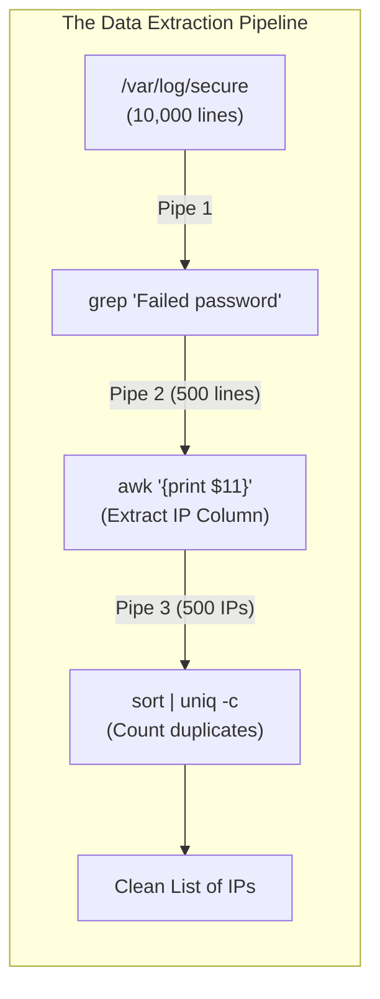
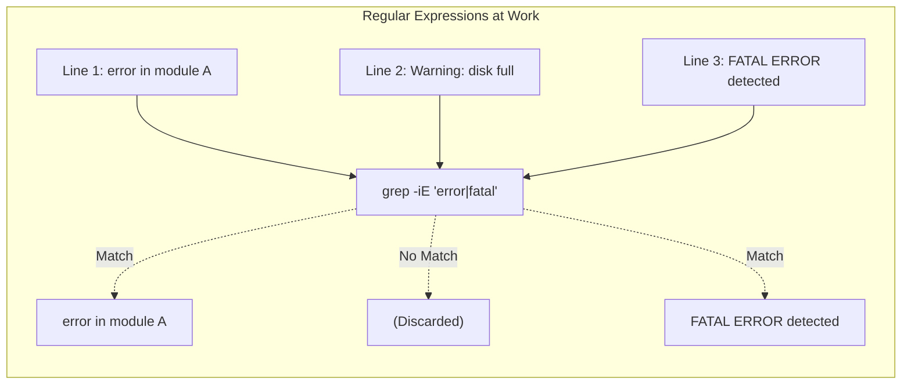
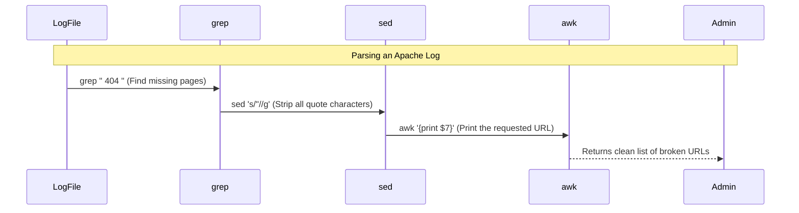

# CHAPTER 64 — TEXT PROCESSING (AWK, SED, GREP MASTERY)

---

## 1. Introduction

### Why This Topic Exists
In Linux, "Everything is a file." Specifically, everything is a *text* file. User accounts are in `/etc/passwd`. Configurations are in `/etc/ssh/sshd_config`. Application outputs are in `/var/log/messages`. If a server generates 10 million lines of text a day, a human cannot possibly read it. You need tools to slice, dice, filter, and extract exactly the data you want. The "Holy Trinity" of Linux text processing is **`grep`** (Find), **`awk`** (Extract), and **`sed`** (Replace).

### Why Linux Administrators Use It
When an administrator is asked to "Find the IP addresses of the top 10 users who failed to log in via SSH yesterday," they don't open the log file in a text editor and start counting. They write a one-line command combining `grep`, `awk`, and `sort` to instantly filter out the noise, extract just the IP addresses, and present a clean list to management in milliseconds.

### Why Companies Care About It
Speed and Automation. The ability to manipulate data streams programmatically is what separates junior point-and-click admins from senior automation engineers. In enterprise environments, data is constantly passed between tools (e.g., extracting a specific server ID from an API response and injecting it into a deployment script). Mastering these tools makes you unimaginably fast.

---

## 2. Learning Objectives

By the end of this chapter, you will be able to:
- Master advanced `grep` features (Regex, Invert, Context).
- Use `awk` to slice text into columns and extract specific fields.
- Use `awk` for basic mathematical operations on text data.
- Use `sed` to perform search-and-replace operations in the terminal.
- Chain these tools together using Linux pipes (`|`) to solve complex data extraction tasks.

---

## 3. Beginner-Friendly Explanation

Think of a massive phone book:
- **`grep` (The Highlighter):** You ask `grep` to find "Smith". It highlights every single line in the phone book that contains the word "Smith" and ignores the rest.
- **`awk` (The Scissors):** You have a list of 1,000 people formatted as `Firstname Lastname PhoneNumber`. You don't care about their names; you only want their phone numbers. You tell `awk` to cut out the 3rd column and throw the rest in the trash.
- **`sed` (The White-out and Pen):** The phone company changed the area code from "555" to "777". You tell `sed` to instantly erase every instance of "555" and write "777" over it.

---

## 4. Core Theory

### 4.1 The Pipe (`|`)
None of these tools are designed to work in isolation. The true power of Linux comes from the Pipe (`|`). The pipe takes the *output* of Command A and shoves it directly into the *input* of Command B.
`cat logs.txt | grep "ERROR" | awk '{print $2}'`

### 4.2 `grep` (Global Regular Expression Print)
`grep` filters lines. By default, it searches for simple strings. However, its true power unlocks when you use **Regular Expressions (Regex)**. Regex allows you to search for *patterns* rather than exact words.
- e.g., "Find any line that starts with a number, contains 3 letters, and ends with the word 'failed'."

### 4.3 `awk` (Aho, Weinberger, and Kernighan)
`awk` is not just a command; it is an entire programming language built for processing columns of data. By default, `awk` assumes columns are separated by spaces or tabs.
If a line is `Alice Admin 555-1234`, `awk` assigns `Alice` to `$1`, `Admin` to `$2`, and `555-1234` to `$3`. `$0` represents the entire line.

### 4.4 `sed` (Stream Editor)
`sed` modifies text as it flows through the pipe. It is most commonly used for its substitution feature (`s`). You can also use it to delete specific lines, or print specific line numbers without opening the file.

---

## 5. Internal Working

### Regular Expressions (Regex) Basics
Regex is a universal language used by `grep`, `awk`, `sed`, Python, and Java.
- `^` : Matches the *start* of a line. (e.g., `^root` finds lines starting with "root").
- `$` : Matches the *end* of a line. (e.g., `bash$` finds lines ending with "bash").
- `.` : Matches *any single character*.
- `*` : Matches zero or more of the preceding character.
- `[a-z]` : Matches any lowercase letter.

---

## 6. Production Architecture



---

## 7. Command-by-Command Explanation

### 7.1 `grep -v "DEBUG" app.log`
- **Purpose:** Invert match (`-v`). Prints every line in the file EXCEPT the lines containing the word "DEBUG". Crucial for removing noise from logs.

### 7.2 `grep -i "error" app.log`
- **Purpose:** Case-insensitive search (`-i`). Finds "error", "ERROR", and "ErRoR".

### 7.3 `awk -F':' '{print $1}' /etc/passwd`
- **Purpose:** Prints the first column of the password file. The `-F':'` tells `awk` that the columns in this specific file are separated by colons instead of spaces. This instantly extracts a list of all usernames on the system.

### 7.4 `sed 's/oldtext/newtext/g' file.txt`
- **Purpose:** Search and replace. Substitutes (`s`) "oldtext" with "newtext" Globally (`g` - replaces every instance on the line, not just the first one it finds).

### 7.5 `sed -i 's/enabled=0/enabled=1/g' config.ini`
- **Purpose:** In-place edit (`-i`). Instead of just printing the modified text to the screen, this permanently saves the changes back into the original file. (DANGEROUS: Always double-check your syntax before using `-i`).

---

## 8. Syntax Breakdown

**An Advanced `awk` Command (Summing a Column)**

```bash
ls -l | awk '{sum += $5} END {print sum}'
│         │  │         │ │    │
│         │  │         │ │    └── Prints the final total after all lines are processed
│         │  │         │ └── The END block executes exactly once at the end of the file
│         │  │         └── Adds the value of Column 5 (File Size) to a running total variable
│         │  └──────────── Executes this block for every line in the input
│         └─────────────── The awk command
└───────────────────────── List files (Column 5 is file sizes in bytes)
```
*(This command instantly calculates the total size of all files in the directory).*

---

## 9. Parameter Explanation

| Tool | Flag | Description |
|:---|:---|:---|
| `grep` | `-E` | Extended Regex. Allows advanced pattern matching like `grep -E "Error|Warning"` (Finds either word). Equivalent to the `egrep` command. |
| `grep` | `-A 3` | "After". Prints the matching line, AND the 3 lines immediately after it. Excellent for seeing the context of a Java stack trace error. |
| `grep` | `-B 3` | "Before". Prints the matching line, AND the 3 lines immediately before it. |
| `awk` | `$NF` | Special variable meaning "Number of Fields". It always prints the *very last* column on the line, even if you don't know how many columns there are. |

---

## 10. Sample Output Analysis

**Scenario:** We want to extract the IP address of the `eth0` interface using `ip addr`.
**Command:** `ip addr show eth0 | grep "inet " | awk '{print $2}' | cut -d'/' -f1`

**Step-by-Step Analysis:**
1. **`ip addr show eth0`**: Outputs 6 lines of raw text detailing the interface.
2. **`grep "inet "`**: Filters out everything except the specific line containing the IPv4 address: `    inet 192.168.1.50/24 brd 192.168.1.255 scope global eth0`
3. **`awk '{print $2}'`**: Takes that single line, cuts it into columns based on spaces, and prints Column 2: `192.168.1.50/24`
4. **`cut -d'/' -f1`**: The `cut` command acts like a mini-awk. It splits the string using the `/` as a delimiter (`-d`), and prints Field 1 (`-f1`).
**Final Output:** `192.168.1.50`
*(We have successfully extracted a clean IP address that can be stored in a Bash variable!)*

---

## 11. Architecture Diagram



---

## 12. Workflow Diagram



---

## 13. Real Production Examples

### Mass Renaming Files with `sed`
A developer accidentally generated 100 configuration files named `server_conf.txt`. They actually needed to be named `server.conf`.
An administrator uses a loop and `sed` to fix it instantly:
```bash
for FILE in *.txt; do
    NEW_NAME=$(echo "$FILE" | sed 's/_conf.txt/.conf/g')
    mv "$FILE" "$NEW_NAME"
done
```

### Checking for Empty Passwords
An auditor wants to know if any users on the system have an empty password field in `/etc/shadow`.
```bash
sudo awk -F':' '$2 == "" {print $1}' /etc/shadow
```
*Translation: "Set the delimiter to colon. If Column 2 is exactly equal to nothing (blank), print Column 1 (the Username)."*

---

## 14. Common Mistakes

1. **Useless Use of Cat (UUOC)** — Beginners often write `cat file.txt | grep "apple"`. This spawns two processes for no reason. `grep` can read files directly: `grep "apple" file.txt`. Only use `cat` if you are combining multiple files into a pipe.
2. **`sed -i` destroying symlinks** — When you use `sed -i` to edit a file in place, `sed` actually creates a temporary file, writes the changes, and then deletes the original file and replaces it with the temporary one. If the original file was a Symbolic Link, `sed -i` will destroy the link and replace it with a standard text file! Use `sed -i --follow-symlinks` if you must edit links.
3. **Miscounting `awk` Columns** — `awk` collapses multiple spaces into a single delimiter. If a log file uses fixed-width columns instead of single spaces, `awk` might misalign the data. Use `cut` or specify exact field widths if the data isn't cleanly space-separated.

---

## 15. Best Practices

- **Test `sed` without `-i` first!** Never run `sed -i` on a production configuration file on your first try. Run the `sed` command *without* `-i`. It will print the proposed changes to the screen. If the changes look correct, hit the Up arrow, add `-i`, and run it for real.
- **Master `sort` and `uniq`:** The pipeline `| sort | uniq -c | sort -nr` is the most powerful combination in Linux. It takes a raw list, sorts it alphabetically, counts all the duplicates (`uniq -c`), and then sorts them again numerically in reverse order (`sort -nr`). This instantly produces a "Top 10" list.

---

## 16. Security Considerations

- **Log Sanitization:** When support engineers request log files, those logs often contain sensitive API keys or credit card numbers. An administrator must use `sed` to sanitize the logs before sending them out:
  `sed -i 's/api_key=[a-zA-Z0-9]*/api_key=REDACTED/g' debug.log`
  This Regex finds "api_key=" followed by any alphanumeric characters, and overwrites the entire string with REDACTED.

---

## 17. Performance Considerations

- **Grep is insanely fast:** The GNU `grep` utility is one of the most highly optimized pieces of software ever written. It searches for text by looking at memory addresses, bypassing massive chunks of the file. If you need to process a 50GB log file, always use `grep` as the very first command in your pipeline to filter the data down, *before* passing it to `awk` or Python.

---

## 18. Troubleshooting Guide

| Symptom | Root Cause | Resolution |
|:---|:---|:---|
| `sed: -e expression #1, char 5: unterminated 's' command`| Missing a slash | Ensure `sed` commands have 3 slashes: `s/old/new/` |
| `awk` prints the wrong column | The file doesn't use spaces | Tell `awk` the true delimiter: `awk -F','` for CSV files. |
| `grep` highlights the whole line, not just the word | Default behavior | Add `-o` to `grep` to ONLY print the exact matching word. |
| `sed` replaces the first word, but ignores the second | Missing the `g` flag | Append `g` to the end of the `sed` substitution block. |

---

## 19. Practical Labs

**Lab 64.1:** The Grep Master
1. Create a file `fruit.txt`:
```text
apple
Banana
Cherry
green apple
```
2. Find all apples (case insensitive): `grep -i "apple" fruit.txt`
3. Find lines that strictly END with apple: `grep "apple$" fruit.txt`
4. Find lines that DO NOT contain apple: `grep -v -i "apple" fruit.txt`

**Lab 64.2:** Awk and Sed
1. Look at your shadow file: `sudo cat /etc/shadow | head -n 5`
2. Extract just the usernames (Column 1):
   `sudo awk -F':' '{print $1}' /etc/shadow | head -n 5`
3. Replace the word "root" with "GOD" in the output:
   `sudo awk -F':' '{print $1}' /etc/shadow | head -n 5 | sed 's/root/GOD/g'`

---

## 20. Mini Project

The Intruder Detector.
You want to find the top 5 IP addresses that failed to log into your server via SSH.
1. The log file is `/var/log/secure` (RHEL) or `/var/log/auth.log` (Ubuntu).
2. Filter the log for failures:
   `sudo grep "Failed password" /var/log/secure`
3. Look at the output. Count which column the IP address is in (usually column 11).
4. Extract the IP address:
   `sudo grep "Failed password" /var/log/secure | awk '{print $11}'`
5. Count the duplicates and find the top 5 attackers:
   `sudo grep "Failed password" /var/log/secure | awk '{print $11}' | sort | uniq -c | sort -nr | head -n 5`

---

## 21. Assignments

1. In a `sed` substitution command (`s/old/new/g`), what does the `g` at the end do?
2. If you are parsing a CSV (Comma Separated Values) file, what flag must you pass to `awk` so it understands the columns?
3. What does the Regex anchor `^` signify in a `grep` search?

---

## 22. Interview Questions

### Basic
1. **Q: You want to search for the word "ERROR" in a massive log file. What command do you use?**
   A: `grep "ERROR" /path/to/logfile`

2. **Q: You have a file with 10 columns separated by spaces. You only want to print the 3rd column. What tool do you use?**
   A: `awk '{print $3}' filename`

### Intermediate
3. **Q: You need to replace the IP address `10.0.0.5` with `10.0.0.10` inside a configuration file named `app.conf`. You want the change to be saved directly to the file. Write the command.**
   A: `sed -i 's/10.0.0.5/10.0.0.10/g' app.conf`

4. **Q: You run `grep "Warning" app.log`. It outputs thousands of lines. You just want to know *how many* warnings there are, not see all the text. How do you do this?**
   A: I can pipe the output to `wc -l` (word count lines): `grep "Warning" app.log | wc -l`. Alternatively, `grep` has a built-in flag for this: `grep -c "Warning" app.log`.

### Scenario-Based
5. **Q: A developer asks you for a list of all unique email addresses that threw an error in yesterday's log file. The log file is 10GB. The lines look like this: `[2026-10-14] ERROR: User bob@company.com failed to sync`. Write the pipeline you would use to extract a clean, deduped list of email addresses.**
   A: 
   1. Filter for errors: `grep "ERROR"`
   2. Extract the email address (which is the 4th column): `awk '{print $4}'`
   3. Remove duplicates: `sort | uniq`
   Pipeline: `grep "ERROR" app.log | awk '{print $4}' | sort | uniq > emails.txt`. 
   Because `grep` is the first command in the pipeline, it efficiently drops 99% of the 10GB file before passing the remaining text to `awk`, making the pipeline incredibly fast.

---

## 23. Chapter Summary and Quick Revision Notes

- **`grep`:** Filters lines of text. Use `-i` (ignore case), `-v` (invert), `-E` (Regex).
- **Regex:** `^` (Start of line), `$` (End of line), `.` (Any character), `*` (Wildcard).
- **`awk`:** Extracts columns. Columns are accessed via `$1, $2, $3`. Delimiters are changed with `-F`.
- **`sed`:** Edits streams. Substitution is `s/old/new/g`. In-place file editing is `-i`.
- **The Pipeline:** Combining tools (`grep | awk | sort | uniq`) is the core philosophy of Unix.

---

## 24. Cheat Sheet

| Command | Purpose |
|:---|:---|
| `grep -i "error" log.txt` | Case-insensitive search |
| `grep -v "DEBUG" log.txt` | Print everything EXCEPT debug lines |
| `grep "^root" /etc/passwd` | Find lines starting with root |
| `awk '{print $1, $5}' file`| Print column 1 and 5 |
| `awk -F',' '{print $2}' file`| Print column 2 of a CSV file |
| `sed -i 's/yes/no/g' config` | Replace 'yes' with 'no' and save file |
| `sort \| uniq -c \| sort -nr` | The "Top 10 Duplicates" pipeline |
