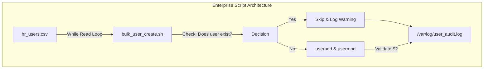
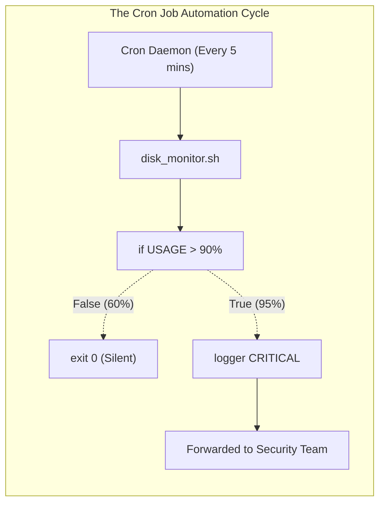
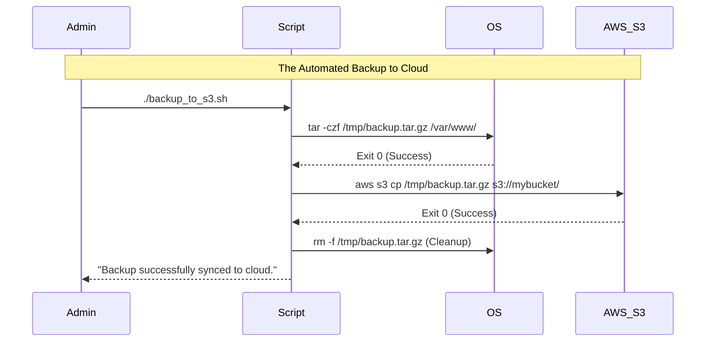

# CHAPTER 65 — AUTOMATING ADMIN TASKS WITH BASH

---

## 1. Introduction

### Why This Topic Exists
You have learned how to create variables, loops, functions, and slice text with `awk`. But how does this all fit together? **Automation** is the process of combining these atomic skills into complex, robust scripts that perform end-to-end administrative workflows without human intervention. This chapter bridges the gap between learning Bash syntax and actually engineering real-world solutions.

### Why Linux Administrators Use It
Administrators use automation to remove themselves from the equation. If an administrator spends 2 hours every Friday auditing user accounts and generating a report, they are wasting company time. By writing a Bash script to do the audit and schedule it via `cron`, they reclaim 104 hours a year. 

### Why Companies Care About It
Standardization and Auditing. When humans perform complex tasks (like deploying a new web server or rotating security keys), they forget steps. They make typos. When a Bash script performs the task, it does it exactly the same way across 10,000 servers. If a security auditor asks, "How exactly are these backups created?", the company simply points to the Bash script. The script *is* the documentation.

---

## 2. Learning Objectives

By the end of this chapter, you will be able to:
- Combine tools (`grep`, `awk`, loops, `if`) to solve complex, multi-step problems.
- Write a script to automate the creation of hundreds of user accounts from a CSV file.
- Write a script to monitor disk space and send alerts if a threshold is breached.
- Safely log script activity for post-mortem troubleshooting.
- Implement strict "Dry Run" capabilities to test destructive scripts safely.

---

## 3. Beginner-Friendly Explanation

Think of building a car assembly line:
- **Chapter 61-64 (The Tools):** You learned how to use a wrench (Variables), a hammer (`awk`), and a drill (Loops).
- **Chapter 65 (The Assembly Line):** You are no longer just holding a wrench. You are bolting the tools onto robotic arms, programming the conveyor belt, and stepping back. The raw materials (A CSV file) go into one end, and a fully finished car (100 configured user accounts) rolls out the other end, while the robots automatically print a receipt (Log file) proving they did it correctly.

---

## 4. Core Theory

### 4.1 The Automation Mindset
Before writing a script, you must think like an engineer:
1. **Input:** Where is the data coming from? (A file? A command-line argument? An API?)
2. **Sanitization:** Can I trust the input? (What if the user passes an empty variable?)
3. **Execution:** Do I have permission to run these commands?
4. **Validation:** Did the command actually work? (`$?`)
5. **Output:** Where do I log the results so I can prove it worked?

### 4.2 The "Dry Run" Concept
If you write a script that deletes unused files, you should NEVER run it immediately. Professional scripts include a `--dry-run` flag. When this flag is active, the script uses `echo` to print the destructive commands to the screen *instead* of actually executing them. This allows the administrator to verify the logic is perfectly safe before pulling the trigger.

### 4.3 Parsing CSV Files (Comma Separated Values)
Administrators rarely get clean data. HR usually exports a list of new hires from Excel as a `.csv` file. Bash is perfectly equipped to ingest this file line-by-line using a `while read` loop, temporarily overriding the Internal Field Separator (`IFS`) to split the data on commas instead of spaces.

---

## 5. Internal Working

### The `while read` Loop vs the `for` Loop
If you use a `for` loop to read a file (`for LINE in $(cat file.txt)`), Bash breaks the text apart at every single space. If a line is "Alice Admin", the loop runs twice (once for Alice, once for Admin). This destroys data integrity.
The `while read` loop inherently processes data line-by-line, perfectly preserving spaces within the data. It is the only safe way to parse files in Bash.

---

## 6. Production Architecture



---

## 7. Command-by-Command Explanation

*(In this chapter, we will break down entire script blocks rather than single commands)*

### 7.1 Reading a CSV File
```bash
while IFS=',' read -r FIRST LAST DEPT; do
    echo "Creating user $FIRST $LAST in department $DEPT"
done < users.csv
```
- **`IFS=','`**: Temporarily changes the Internal Field Separator to a comma for this loop only.
- **`read -r`**: Reads the line and prevents backslashes (`\`) from escaping characters. Always use `-r`.
- **`FIRST LAST DEPT`**: Bash automatically splits the comma-separated line into three variables.
- **`< users.csv`**: Feeds the file into the bottom of the loop.

### 7.2 The Dry Run Implementation
```bash
DRY_RUN=1  # Set to 1 for testing, 0 for real execution

execute() {
    if [ "$DRY_RUN" -eq 1 ]; then
        echo "[DRY RUN] Would execute: $1"
    else
        eval "$1"
    fi
}

execute "useradd bob"
```
- **Purpose:** Instead of typing `useradd bob`, you pass the command as a string to the `execute()` function. If Dry Run is active, it just prints it. If Dry Run is 0, `eval` actually runs the command.

---

## 8. Real-World Script 1: Disk Space Alerter

**Scenario:** We need a script that runs every 5 minutes via cron. It checks if the `/` partition is over 90% full. If it is, it writes a critical alert to the syslog and optionally sends an email/slack message.

```bash
#!/bin/bash
set -euo pipefail

# 1. Extract the percentage using awk. 
# (df -h / outputs a header row. tail -n 1 skips it. awk gets the 5th column. sed removes the % sign).
USAGE=$(df -h / | tail -n 1 | awk '{print $5}' | sed 's/%//')
THRESHOLD=90

# 2. Evaluate the math
if [ "$USAGE" -ge "$THRESHOLD" ]; then
    # 3. Use 'logger' to write directly to /var/log/messages
    logger -p user.crit "CRITICAL: Root partition is at ${USAGE}% capacity!"
    
    # (Optional: Add a curl command here to trigger a Slack Webhook)
else
    # 4. Silent success (Cron jobs shouldn't output text on success, or they spam email)
    exit 0
fi
```

---

## 9. Real-World Script 2: Bulk User Creation

**Scenario:** HR provides `new_hires.csv`. Format: `username,fullname,department`.
Example line: `jsmith,John Smith,engineering`

```bash
#!/bin/bash
set -euo pipefail

INPUT_FILE="new_hires.csv"

# Guardrail: Check if the file exists
if [ ! -f "$INPUT_FILE" ]; then
    echo "ERROR: Input file $INPUT_FILE not found!"
    exit 1
fi

# Parse the CSV
while IFS=',' read -r USERNAME FULLNAME DEPT; do
    
    # Guardrail: Check if user already exists
    if id "$USERNAME" &>/dev/null; then
        echo "WARNING: User $USERNAME already exists. Skipping."
        continue
    fi
    
    # Ensure the group exists (Create if it doesn't)
    if ! getent group "$DEPT" &>/dev/null; then
        groupadd "$DEPT"
        echo "Created missing group: $DEPT"
    fi
    
    # Create the user (-m creates home dir, -c adds full name, -g sets group)
    useradd -m -c "$FULLNAME" -g "$DEPT" "$USERNAME"
    
    if [ $? -eq 0 ]; then
        echo "SUCCESS: Created $USERNAME in $DEPT"
    else
        echo "ERROR: Failed to create $USERNAME"
    fi

done < "$INPUT_FILE"
```

---

## 10. Sample Output Analysis

**Scenario:** We run the Bulk User Creation script above.

**Output:**
```text
Created missing group: engineering
SUCCESS: Created jsmith in engineering
WARNING: User admin already exists. Skipping.
SUCCESS: Created ajohnson in sales
```

**Analysis:**
- **jsmith:** The script realized the `engineering` group didn't exist in Linux, so it automatically created it, and then created the user perfectly.
- **admin:** The CSV contained an entry for "admin". The `if id "$USERNAME"` guardrail caught the fact that `admin` was already a valid Linux user. Instead of throwing a fatal error and crashing the script, it elegantly printed a Warning and used `continue` to skip to the next line in the CSV. This is robust engineering.

---

## 11. Architecture Diagram



---

## 12. Workflow Diagram



---

## 13. Real Production Examples

### The Nginx Log Rotator (Custom)
Linux has `logrotate`, but sometimes you need custom logic to rotate application logs and sync them to a central server before deleting them.
```bash
#!/bin/bash
set -euo pipefail

LOG_DIR="/var/log/nginx"
ARCHIVE_DIR="/archive"
TODAY=$(date +%F)

# Find logs older than 7 days, compress them, move to archive
find "$LOG_DIR" -name "*.log" -mtime +7 -exec gzip {} \; -exec mv {}.gz "$ARCHIVE_DIR/" \;

# Sync archives to the central logging server using SSH keys
rsync -avq -e "ssh -i /root/.ssh/id_rsa" "$ARCHIVE_DIR/" logserver@10.0.1.50:/central_archives/

# Delete archives older than 30 days locally to save disk space
find "$ARCHIVE_DIR" -name "*.gz" -mtime +30 -exec rm -f {} \;
```
*This 5-line script replaces an entire commercial backup product.*

---

## 14. Common Mistakes

1. **Dangerous variables in `rm` commands** — A script contains `rm -rf /backup/$DATE_DIR`. The administrator accidentally forgets to define the `$DATE_DIR` variable. The script runs `rm -rf /backup/` and deletes 5 years of company backups. Always use strict mode (`set -u`), and for extreme safety, check variables manually: `if [ -z "$DATE_DIR" ]; then exit 1; fi`.
2. **Spamming emails via Cron** — If a script outputs text to the screen (`echo "Checking database... OK"`), and you put that script in a `cron` job, the cron daemon will email that output to the `root` user every single time it runs. If it runs every minute, `root` gets 1,440 emails a day, completely crashing the mail server. **Rule:** Cron scripts must be completely silent on success. Only echo text on Failure, or redirect all output to a log file (`> /var/log/script.log 2>&1`).
3. **Hardcoding Passwords** — Never write `mysql -u root -pPassword123` in a Bash script. Anyone who reads the script has the root database password. Use configuration files (`.my.cnf`) with restricted permissions (`chmod 600`), or pull secrets dynamically from a Vault API.

---

## 15. Best Practices

- **The `logger` command:** Instead of manually formatting text files for logs, use the built-in `logger` command. `logger "Script failed"` will instantly write that message into `/var/log/messages` (or `syslog`) with a perfect timestamp, hostname, and severity level, perfectly integrating your custom script into the OS's native logging infrastructure.
- **Idempotency:** An advanced engineering concept. A script is "Idempotent" if you can run it 1 time, or 100 times, and the end result is exactly the same without throwing errors or duplicating data. If a script creates a user, it must first check if the user exists. If it does, the script gracefully ignores it. If your script crashes halfway through, you should be able to safely just run it again.

---

## 16. Security Considerations

- **Sudo without Password (NOPASSWD):** To allow an automated script (running as a restricted user like `zabbix` or `nagios`) to restart a service without typing a password, you edit the `/etc/sudoers` file:
  `zabbix ALL=(ALL) NOPASSWD: /usr/bin/systemctl restart httpd`
  This grants the script exactly ONE root privilege, preventing it from compromising the entire server if it gets hacked.

---

## 17. Performance Considerations

- **Parallel Processing:** If you write a `for` loop to ping 254 IP addresses, and each timeout takes 2 seconds, the script will take 8 minutes to run. If you append an ampersand (`&`) to the end of the ping command (`ping $IP &`), Bash throws the command into the background. It will ping all 254 servers simultaneously, and the script will finish in 2 seconds.

---

## 18. Troubleshooting Guide

| Symptom | Root Cause | Resolution |
|:---|:---|:---|
| Script works manually, fails in Cron | Missing `$PATH` | Cron has a very limited PATH. Always use absolute paths in scripts (`/usr/bin/tar` instead of `tar`). |
| `while read` skips the last line of the file | No trailing newline | Add an empty blank line to the very end of your CSV file. |
| Variables aren't updating inside a `while` loop | Pipe Subshell issue | If you run `cat file \| while read`, variables die in the subshell. Use `while read ... done < file` instead. |

---

## 19. Practical Labs

**Lab 65.1:** The Idempotent Directory Setup
1. Create `setup_env.sh`:
```bash
#!/bin/bash
DIR="/opt/myapp/data"

# Check if directory exists. If not, create it.
if [ ! -d "$DIR" ]; then
    echo "Creating $DIR..."
    mkdir -p "$DIR"
else
    echo "Directory $DIR already exists. Proceeding."
fi
```
2. Run it once. It creates the directory.
3. Run it again. It gracefully detects it and proceeds without a "File exists" error.

**Lab 65.2:** CSV Parsing
1. Create `servers.csv`:
```text
web1,10.0.1.10
db1,10.0.1.20
```
2. Create `deploy.sh`:
```bash
#!/bin/bash
while IFS=',' read -r NAME IP; do
    echo "Deploying to $NAME at IP address $IP"
done < servers.csv
```
3. Run it and watch it parse the columns perfectly.

---

## 20. Mini Project

The Ultimate Service Restarter.
You have a buggy Java application (`myapp.service`) that occasionally crashes. You want to write a script that checks if it is running. If it isn't, the script should restart it and log the event.
1. Command to check status: `systemctl is-active myapp.service`
2. If the exit code is not 0, it means it crashed.
3. Write `watchdog.sh`:
```bash
#!/bin/bash
SERVICE="myapp.service"

if ! systemctl is-active --quiet "$SERVICE"; then
    logger -p daemon.warn "Watchdog: $SERVICE is down! Restarting..."
    systemctl restart "$SERVICE"
fi
```
4. Set this script to run every 1 minute in `cron`. You have just built a self-healing infrastructure.

---

## 21. Assignments

1. What is the concept of "Idempotency" in script writing, and why is it crucial for automation?
2. Why is it dangerous to use a `for` loop (e.g., `for LINE in $(cat file.csv)`) to read lines from a file that contains spaces?
3. If a Bash script runs perfectly when you type it in the terminal, but fails when scheduled in `cron`, what is the most likely reason?

---

## 22. Interview Questions

### Basic
1. **Q: What command is used to read a file line-by-line while preserving spaces inside a Bash script?**
   A: The `while read` loop (e.g., `while read line; do ... done < file.txt`).

2. **Q: You want to log a message from your script directly into the central `/var/log/messages` file so it is picked up by Splunk. What native command does this?**
   A: `logger`

### Intermediate
3. **Q: You are writing a script that will permanently delete old backups. Your manager is terrified the script has a bug and might delete active production data. How do you design the script to prove to your manager that the logic is safe before executing it for real?**
   A: I implement a `--dry-run` flag. When the script is run with this flag, it evaluates all the `if/else` logic, but instead of actually running the `rm -rf` command, it prepends `echo` to the command and prints it to the screen. The manager can read the screen to see exactly which files *would* be deleted.

4. **Q: An administrator writes a backup script and puts it in `/etc/cron.daily/`. The script works perfectly, but every morning, the administrator has 500 emails in their inbox containing the output of the `tar` command. How do you fix the script so it only emails the administrator if the backup FAILS?**
   A: I must silence the successful output of the script. I will redirect standard output to a log file or `/dev/null` (`tar -czf backup.tar.gz /data > /dev/null`). Then, I will check the exit code (`$?`). If it fails, I will `echo "Backup Failed!"` to standard error (`>&2`). Cron will capture that specific error text and email it.

### Scenario-Based
5. **Q: You write a script: `cat servers.txt | while read SERVER; do COUNT=5; done; echo "Total servers: $COUNT"`. When you run it, the output is "Total servers: ". The variable is completely empty, even though the loop processed 5 servers. Why did the variable disappear, and how do you fix it?**
   A: Because I used the pipe (`|`) operator to send the `cat` output into the `while` loop, Bash spawned a "Subshell" to execute the loop. The `COUNT` variable was successfully updated inside the subshell. However, when the loop finished, the subshell was destroyed, taking the variable with it. The main script never saw the variable change. To fix this, I must avoid the pipe and feed the file into the bottom of the loop instead: `while read SERVER; do COUNT=5; done < servers.txt`.

---

## 23. Chapter Summary and Quick Revision Notes

- **Automation:** Combining logic, error handling, and tools to run without humans.
- **Idempotency:** Scripts should be safe to run multiple times without corrupting data.
- **`while read`:** The only safe way to parse files line-by-line. Use `IFS` to split columns.
- **`logger`:** Sends custom script output directly to the OS syslog.
- **Dry Runs:** Always build a mechanism to print destructive commands without executing them.
- **Cron PATH:** Cron environments are stripped down. Always use absolute paths in automation scripts!

---

## 24. Cheat Sheet

| Snippet | Purpose |
|:---|:---|
| `while read -r LINE; do ... done < file` | Read a file safely line-by-line |
| `while IFS=',' read -r A B; do ...` | Parse a CSV file into columns |
| `logger -p user.err "Script failed"` | Write to `/var/log/messages` |
| `if ! command; then ... fi` | Run a command and execute block ONLY if it fails |
| `if id "$USER" &>/dev/null; then` | Silent guardrail (throws away output) |
| `/usr/bin/tar -czf ...`| Absolute paths (Required for Cron jobs) |
