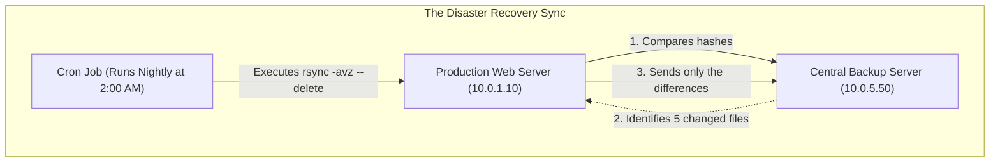
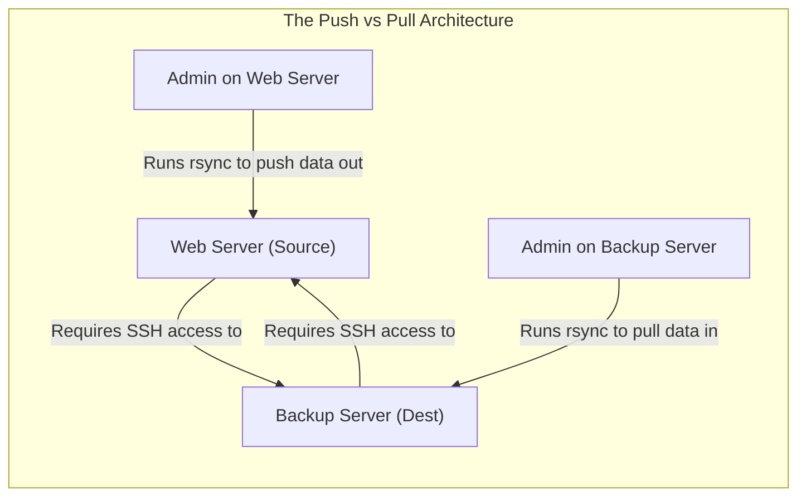
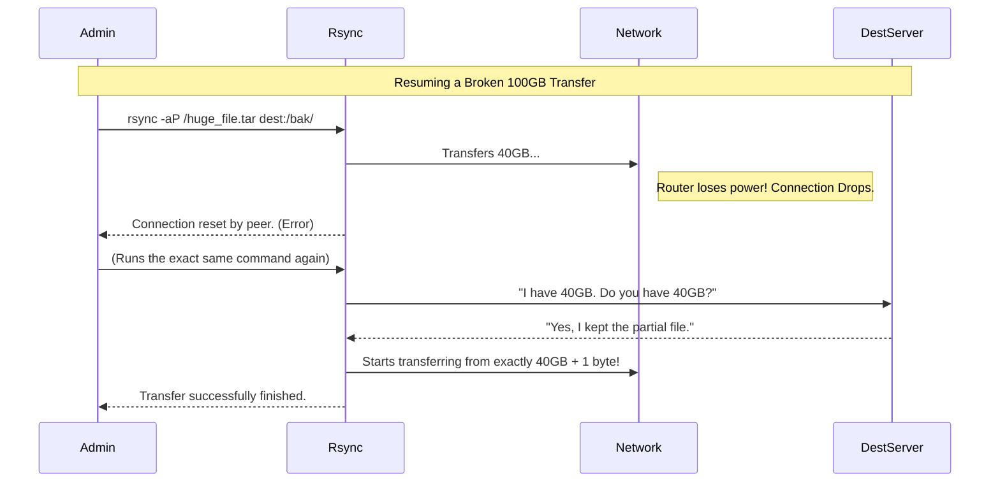

# CHAPTER 66 — RSYNC AND REMOTE FILE COPY

---

## 1. Introduction

### Why This Topic Exists
In a production environment, data is everything. You frequently need to move gigabytes or terabytes of data from one server to another (e.g., backing up a web server to a storage server, or migrating a database to new hardware). Standard copy commands like `cp` or `scp` are "dumb"—if a 100GB transfer fails at 99GB, you have to start the entire transfer over from the beginning. **`rsync` (Remote Sync)** was created to solve this. It is a "smart" tool that compares the source and destination, and only transfers the specific parts of the files that have changed.

### Why Linux Administrators Use It
Linux administrators use `rsync` as the backbone of almost every backup and synchronization script on the planet. They use it because it can compress data on the fly, preserve complex file permissions and ownership, and resume broken transfers instantly without wasting bandwidth.

### Why Companies Care About It
Bandwidth and Time. If a company has a 1 Terabyte database file that changes by 10 Megabytes every day, using `scp` to back it up would require sending the full 1TB over the network every single night, destroying the network's bandwidth and taking 8 hours. If the company uses `rsync`, it mathematically calculates the 10MB difference and sends ONLY those 10 Megabytes. The backup finishes in 3 seconds instead of 8 hours.

---

## 2. Learning Objectives

By the end of this chapter, you will be able to:
- Explain the difference between `cp`, `scp`, and `rsync`.
- Use the standard `rsync -avz` flags to synchronize local and remote directories.
- Understand the critical difference between trailing slashes (`/dir` vs `/dir/`).
- Use the `--delete` flag to mirror directories exactly.
- Use the `--exclude` flag to skip unnecessary files (like caches or temporary files).
- Execute `rsync` over a non-standard SSH port.

---

## 3. Beginner-Friendly Explanation

Think of moving a massive library of books to a new building:
- **`cp` (Copy):** You grab a book, walk it to the new building, and put it on the shelf. (Only works locally).
- **`scp` (Secure Copy):** You put all the books in a secure armored truck and drive them to the new building. But if the truck breaks down halfway, you throw all the books in the garbage and start completely over.
- **`rsync` (Remote Sync):** You send an inspector to the new building. The inspector looks at the shelves and says, "We already have copies of Harry Potter books 1 through 5, but we are missing book 6." The truck ONLY brings book 6. It saves massive amounts of time and effort.

---

## 4. Core Theory

### 4.1 The Delta-Transfer Algorithm
`rsync` is famous because of its algorithm. When it looks at two files that are supposed to be identical (one on Server A, one on Server B), it breaks the files into small mathematical blocks and calculates a "checksum" (a unique mathematical fingerprint) for each block. It compares the fingerprints. If block 4 has a different fingerprint, `rsync` knows only block 4 was modified, and it sends ONLY block 4 across the network.

### 4.2 Local vs Remote
`rsync` can be used to synchronize two folders on the exact same hard drive (`rsync -a /data/ /backups/`), or it can seamlessly integrate with SSH to synchronize a local folder to a server 5,000 miles away (`rsync -a /data/ user@remote:/backups/`).

### 4.3 The Trailing Slash Trap
This is the #1 mistake made by Linux administrators.
- `rsync -a /source /dest` — (NO Slash on Source). This copies the *entire directory itself*. The result will be `/dest/source/file.txt`.
- `rsync -a /source/ /dest` — (SLASH on Source). This copies the *contents* of the directory. The result will be `/dest/file.txt`.
**Rule to memorize:** A trailing slash on the source means "Dump the contents of this bucket into the destination."

---

## 5. Internal Working

### Preserving Metadata
If you copy a file as `root` and give it to a standard user, the standard user usually becomes the new owner of the file. In backups, this is disastrous. If you backup `/var/www/` (owned by `apache`), the backup files MUST remain owned by `apache`. The `-a` (archive) flag tells `rsync` to explicitly read the file's Ownership, Permissions, Symlinks, and Timestamps, and force the destination server to apply those exact same metadata attributes. (Note: The destination user running `rsync` must be `root` to force ownership changes).

---

## 6. Production Architecture



---

## 7. Command-by-Command Explanation

### 7.1 `scp file.txt user@10.0.1.50:/tmp/`
- **Purpose:** Secure Copy. An older, simpler tool. Copies `file.txt` over the SSH protocol to the `/tmp/` directory on the remote server. It is perfectly fine for moving small, single files.

### 7.2 `rsync -avz /var/www/html/ admin@10.0.1.50:/backups/website/`
- **Purpose:** The standard `rsync` command. Synchronizes the contents of the local HTML folder to the remote backup folder.
  - `-a` (Archive): Preserves all permissions, ownership, and timestamps. (Also inherently implies recursive, so it copies all subfolders).
  - `-v` (Verbose): Prints the names of the files to the screen as they are copied.
  - `-z` (Compress): Compresses the data on the fly before sending it over the network, saving massive bandwidth, and decompresses it on the other side.

### 7.3 `rsync -avz --delete /var/www/html/ admin@10.0.1.50:/backups/website/`
- **Purpose:** The exact mirror. Without `--delete`, if you delete a file on the Web server, the file will remain forever on the Backup server. By adding `--delete`, `rsync` realizes the file is missing on the source, and intentionally *deletes* it from the destination, ensuring a 1:1 perfect clone.

### 7.4 `rsync -avz --exclude '*.log' /var/www/html/ ...`
- **Purpose:** Skips specific files. In this case, it backs up the entire website, but ignores any file ending in `.log`, because we don't want to waste backup space storing 50GB of temporary log files.

---

## 8. Syntax Breakdown

**Using a Custom SSH Key and Port**

```bash
rsync -avz -e "ssh -p 2222 -i /root/.ssh/backup_key" /data/ admin@10.0.5.50:/backups/
│          │   │                                 │ │      │                 │
│          │   │                                 │ │      │                 └── Destination user, IP, and path
│          │   │                                 │ │      └──────────────────── Source directory
│          │   └─────────────────────────────────┘ └─────────────────────────── The exact SSH command to execute the tunnel
│          └─────────────────────────────────────────────────────────────────── Execute flag (Define the remote shell)
└────────────────────────────────────────────────────────────────────────────── Command and standard flags
```

---

## 9. Parameter Explanation

| Flag | Name | Purpose |
|:---|:---|:---|
| `-P` | Progress & Partial | Shows a live progress bar for large files, and keeps partially transferred files if the network drops, so it can resume exactly where it left off! (Equivalent to `--partial --progress`). |
| `-n` | Dry Run | Prints exactly what files *would* be transferred or deleted, without actually doing it. ALWAYS run this before using `--delete`! |
| `-u` | Update | If the destination file has a NEWER timestamp than the source file, do not overwrite it. (Useful for two-way syncs). |
| `-h` | Human Readable | Outputs file sizes in MB/GB instead of bytes during the transfer summary. |

---

## 10. Sample Output Analysis

**Scenario:** We are backing up a directory that contains 1,000 files. We run it twice.
**Command:** `rsync -av /data/ /backup/`

**First Run Output (Initial Sync):**
```text
sending incremental file list
file1.txt
file2.txt
... (998 more files) ...
sent 50,000,000 bytes  received 19,000 bytes  30,000,000 bytes/sec
total size is 49,900,000  speedup is 0.99
```
*Analysis: `rsync` had to transfer all 50 Megabytes of data because the destination was completely empty.*

**Second Run Output (We run it again 5 minutes later):**
```text
sending incremental file list
sent 1,200 bytes  received 35 bytes  2,470.00 bytes/sec
total size is 49,900,000  speedup is 40,404.86
```
*Analysis: We changed nothing. `rsync` quickly compared the folders, realized they were mathematically identical, and transferred 0 files. It only sent 1,200 bytes of "conversation" metadata over the network. It took 0.01 seconds. This is the magic of `rsync`.*

---

## 11. Architecture Diagram


*Security Best Practice: The Backup server should ALWAYS "Pull" the data. If the Web Server gets hacked, and the Web Server has the SSH keys to push data to the Backup server, the hacker can use those keys to delete the backups! If the Backup server pulls, the Web Server has no credentials, preventing the hacker from reaching the backups.*

---

## 12. Workflow Diagram



---

## 13. Real Production Examples

### The Code Deployment Script
A developer wants to push their new PHP code to the production web server. They don't want to use FTP because it is slow and unencrypted. They write a deployment script using `rsync` that excludes their local Git history and local `.env` configuration files:
```bash
rsync -avz --exclude '.git' --exclude '.env' /home/dev/myapp/ prod-admin@10.0.1.10:/var/www/html/
```
The script instantly pushes only the specific PHP files they edited today, applying them live to the production server.

### The Storage Migration
A company bought a massive new storage array. They need to move 5 Terabytes of user home directories from the old server to the new server with zero downtime.
1. The admin runs `rsync -av /home/ root@new_server:/home/`. It takes 12 hours. Users are still working and modifying files on the old server during this time.
2. At midnight, the admin kicks all users off the old server.
3. The admin runs the exact same `rsync -av --delete /home/ root@new_server:/home/` command again.
4. `rsync` only copies the tiny amount of files that users modified during the 12-hour window. It finishes in 3 minutes.
5. The admin redirects traffic to the new server. The migration is flawless.

---

## 14. Common Mistakes

1. **The Trailing Slash Nightmare** — An admin wants to back up `/etc/` to `/backup/`. They run `rsync -a /etc /backup/`. The result is `/backup/etc/`. They run it again the next day, but accidentally add a slash: `rsync -a /etc/ /backup/`. Instead of updating the `/backup/etc/` folder, `rsync` violently dumps 5,000 loose configuration files directly into the root of the `/backup/` directory, causing a massive mess. BE CAREFUL WITH SLASHES.
2. **Forgetting `--delete`** — An admin uses `rsync` to mirror a web directory. A developer deletes an obsolete, vulnerable plugin from the web server. The backup script runs. Because `--delete` was omitted, the backup server still has the vulnerable plugin. Later, the web server crashes, the admin restores from the backup, and the vulnerable plugin is accidentally put back into production.
3. **Running out of Memory** — If you try to `rsync` a directory containing 50 million tiny files, `rsync` must load the metadata for all 50 million files into RAM before it can start comparing them. On a server with 2GB of RAM, `rsync` will crash with an Out of Memory error.

---

## 15. Best Practices

- **Always use `-n` (Dry Run) with `--delete`:** The `--delete` flag will literally destroy data if you point it at the wrong directory. ALWAYS run `rsync -anv --delete ...` first. Look at the output. If it says `deleting /backup/critical_database.sql`, you made a typo. Fix it before running it for real.
- **Limit Bandwidth:** If you run an `rsync` backup during the middle of the business day, it will consume 100% of the network card's bandwidth, lagging the server for actual users. Use the `--bwlimit` flag to throttle it: `rsync --bwlimit=5000` (limits the transfer to 5 Megabytes per second).

---

## 16. Security Considerations

- **SSH Keys without Passwords:** For a `cron` job to run `rsync` securely in the middle of the night, it cannot prompt the administrator to type an SSH password. You must generate an SSH key (`ssh-keygen`) and copy it to the remote server (`ssh-copy-id`). However, a passwordless SSH key is a severe security risk. You should restrict that specific SSH key in the remote server's `~/.ssh/authorized_keys` file so that it is ONLY allowed to execute the `rsync` command, and nothing else.

---

## 17. Performance Considerations

- **Compression (`-z`) on Local Networks:** If you are backing up to a server on the exact same Gigabit switch (LAN), do NOT use the `-z` flag. The network is so fast that the CPU time required to compress and decompress the data actually slows the transfer down. Only use `-z` when transferring data across the slow, public internet (WAN).

---

## 18. Troubleshooting Guide

| Symptom | Root Cause | Resolution |
|:---|:---|:---|
| `Host key verification failed.` | First time SSH connection | Run the command manually once to accept the SSH RSA fingerprint prompt (type `yes`). |
| Files are transferring, but Ownership is wrong (e.g., owned by root) | Destination user lacks privileges | To preserve ownership (like `apache` or `mysql`), the user receiving the files on the destination server must be `root`. |
| `rsync: command not found` | Not installed | Run `dnf install rsync` on BOTH the source and destination servers. |
| Transfer is incredibly slow | Compressing large media files | Remove `-z` if transferring `.mp4` or `.zip` files, as they are already compressed. |

---

## 19. Practical Labs

**Lab 66.1:** Local Syncing and the Trailing Slash
1. `mkdir /tmp/source /tmp/dest`
2. `touch /tmp/source/file1.txt /tmp/source/file2.txt`
3. Test WITHOUT the slash: `rsync -av /tmp/source /tmp/dest`
4. Run `ls -l /tmp/dest`. Notice it created a folder named `source`.
5. Test WITH the slash: `rsync -av /tmp/source/ /tmp/dest`
6. Run `ls -l /tmp/dest`. Notice the `.txt` files are now loose in the `dest` folder.

**Lab 66.2:** The Delete Flag
1. With the lab above complete, go to the source:
   `rm -f /tmp/source/file1.txt`
2. Run standard `rsync`: `rsync -av /tmp/source/ /tmp/dest`
3. Check the destination: `ls /tmp/dest`. (file1.txt is STILL THERE!).
4. Run with delete: `rsync -av --delete /tmp/source/ /tmp/dest`
5. Check the destination: `ls /tmp/dest`. (file1.txt is now gone).

---

## 20. Mini Project

The Backup Script.
Write a script named `daily_backup.sh`.
1. It should back up `/etc/` and `/var/www/`.
2. It should sync them to a local backup directory: `/backups/`.
3. It must preserve all permissions.
4. It must create a perfect mirror (deleting files that were removed from the source).
*Solution:*
```bash
#!/bin/bash
set -euo pipefail

DEST="/backups"
mkdir -p "$DEST"

echo "Backing up /etc..."
rsync -a --delete /etc/ "$DEST/etc/"

echo "Backing up /var/www..."
rsync -a --delete /var/www/ "$DEST/www/"

echo "Backup complete!"
```

---

## 21. Assignments

1. What does the `-a` (archive) flag actually do under the hood in `rsync`?
2. Why is the `-P` flag essential when transferring a 50GB database file over an unstable internet connection?
3. Explain the difference between `rsync -a /var/log /backup` and `rsync -a /var/log/ /backup`.

---

## 22. Interview Questions

### Basic
1. **Q: What is the primary advantage of `rsync` over `scp`?**
   A: `rsync` uses a delta-transfer algorithm. It only copies the mathematical differences (the changes) between the source and destination files, saving massive amounts of time and bandwidth. `scp` always copies the entire file from scratch.

2. **Q: What three flags are almost universally used together in `rsync` to preserve permissions, show output, and compress data?**
   A: `-avz` (Archive, Verbose, Compress).

### Intermediate
3. **Q: You want to synchronize a massive log directory to a backup server. However, you absolutely do not want to delete any old logs on the backup server, even if they were deleted from the source. What `rsync` flag must you ENSURE you DO NOT use?**
   A: The `--delete` flag. Without it, `rsync` will only add new files and update existing ones, but it will safely leave orphaned files alone on the destination.

4. **Q: An automated `rsync` backup runs every night at 2:00 AM. It connects to the backup server via SSH using Port 22. The security team audits the network and changes the SSH port on the backup server to 45000. Your `rsync` script immediately breaks with a connection timeout. How do you fix the script?**
   A: I must explicitly tell `rsync` to use the non-standard port by passing the remote shell parameter. I will update the script to include `-e "ssh -p 45000"`.

### Scenario-Based
5. **Q: You are performing a server migration. You use `rsync -a` to copy the `/var/www/html` directory from the old server to the new server. On the old server, all files are owned by the user `apache` (UID 48). When you look at the new server, all the files are mysteriously owned by the user `nobody` (UID 99). The website throws 403 Forbidden errors. What caused this, and how do you fix it?**
   A: When `rsync -a` transfers files, it tries to preserve the Owner ID. However, if you executed the `rsync` command using a standard, unprivileged user account to connect to the new server, that standard user does not have Linux kernel permissions to `chown` (change ownership) of files to `apache`. The kernel rejects the ownership change and defaults the files to the user running the command (or `nobody`). To fix this and preserve strict ownership, the `rsync` connection to the destination server must be executed as the `root` user (or using passwordless `sudo` mapped in the `rsync` path).

---

## 23. Chapter Summary and Quick Revision Notes

- **`rsync`:** The ultimate tool for backups and server synchronization.
- **Delta-Transfer:** Only sends the pieces of files that actually changed.
- **`-a` (Archive):** Preserves ownership, permissions, and timestamps. (Mandatory for backups).
- **`-z` (Compress):** Saves bandwidth on WAN connections.
- **`--delete`:** Creates an exact mirror (Deletes files on dest that are missing on source).
- **Trailing Slash (`/`):** A slash on the source means "Copy the CONTENTS." No slash means "Copy the DIRECTORY ITSELF."
- **`-n` (Dry Run):** Always use this before running `--delete` to prevent data loss.

---

## 24. Cheat Sheet

| Command | Purpose |
|:---|:---|
| `rsync -avz /src /dest` | Standard sync (Copies the folder) |
| `rsync -avz /src/ /dest` | Standard sync (Copies the contents) |
| `rsync -a --delete /src/ /dest` | Perfect Mirror (Destroys unmatched files on dest) |
| `rsync -aP /hugefile dest:/` | Show progress bar & resume if broken |
| `rsync -anv --delete ...` | Dry Run (Test before destroying) |
| `rsync -e "ssh -p 2222" ...` | Use a custom SSH port |
| `rsync --exclude '*.tmp' ...` | Ignore specific files/extensions |
